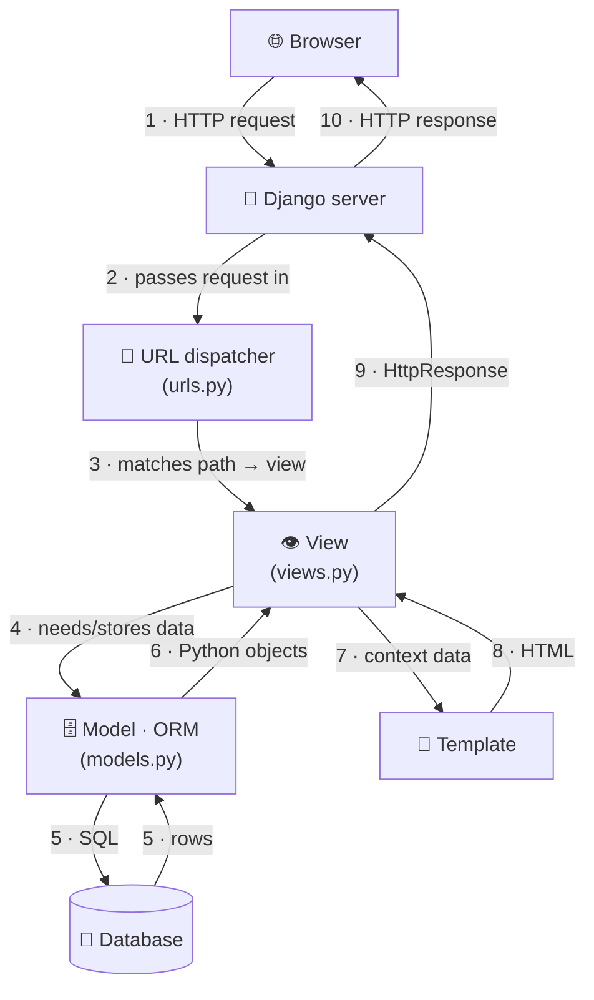
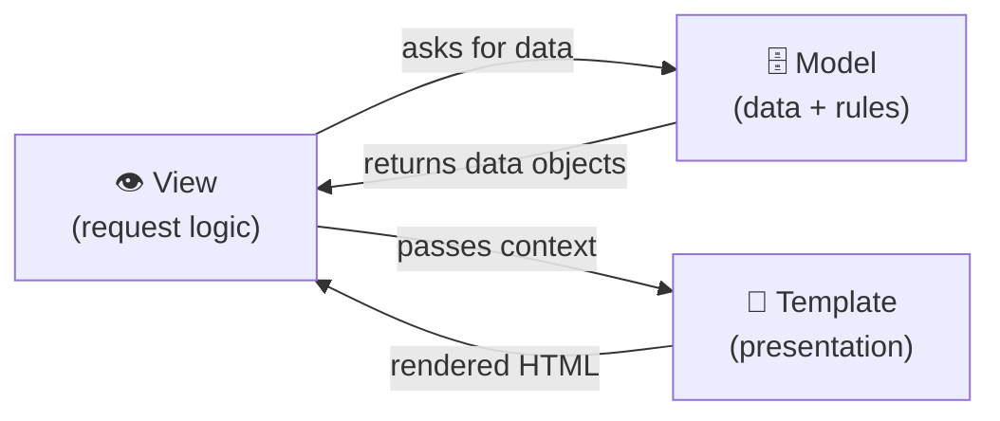
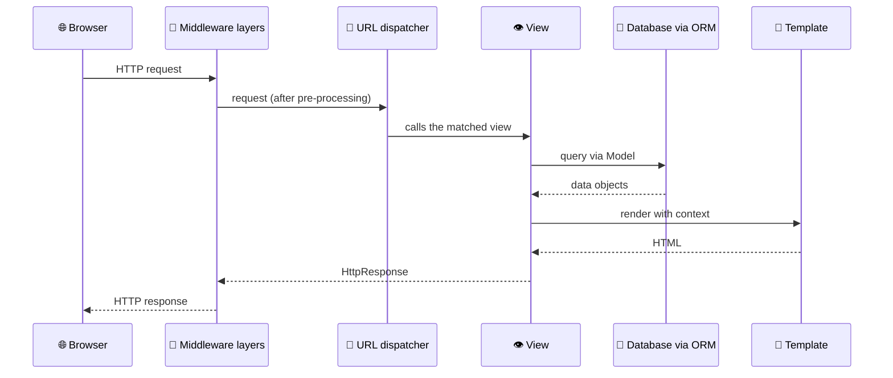
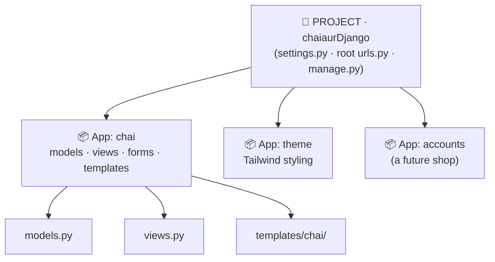
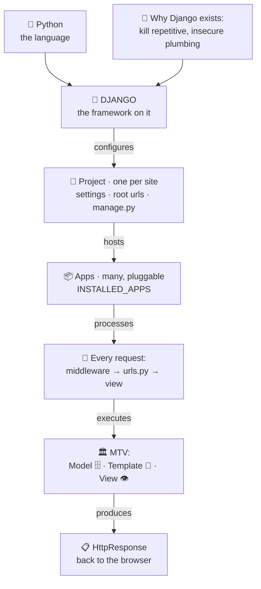

# 🚀 A001 — Introduction to Django

`📖 Lecture A001` · `🎓 Track: Core Django` · `📶 Level: Beginner` · `✅ Status: Documented`

> [!NOTE]
> **About this chapter's sources:** no lecture transcript or notes file was present in
> `A001_Introduction_What_is_Django/` when this chapter was written. The chapter is
> grounded in **(1)** the owner's stated topic list for A001, **(2)** the official Django
> documentation and philosophy pages at `djangoproject.com`, and **(3)** this
> repository's own Django project (`ChaiAurCode/`) for concrete references. Anything
> beyond that scope is explicitly marked **📌 Beyond the lecture**. See
> [Sources used](#-sources-used) at the end.

---

## 🧭 What You Will Learn

By the end of this chapter you will be able to:

- [ ] **Define** what Django is — in one sentence and in technically precise terms — and place it in the landscape of web technologies (a framework, not a language; server-side, not browser-side).
- [ ] **Explain why Django exists** — which painful, repetitive problems of web development it was built to solve.
- [ ] **Describe Django's philosophy** ("batteries included", DRY, explicit over implicit) and connect each principle to a concrete feature.
- [ ] **Name Django's major features** (ORM, admin, authentication, templates, URL routing, forms, security defaults) and say *what problem each one removes from your plate*.
- [ ] **Sketch Django's architecture (MTV)** and explain how its vocabulary differs from classic MVC — without confusing the two.
- [ ] **Trace the full request/response journey** through Django step by step, naming the component responsible at each step and what the developer controls.
- [ ] **Distinguish a Django *project* from a Django *app*** — the single most common beginner confusion — and justify why they are separate concepts.
- [ ] **Explain the relationship between Python and Django**, and what Django does *not* do (so you never expect the wrong thing from it).
- [ ] **Contrast building a website with Django vs. raw Python** and enumerate what you would have to build by hand without a framework.
- [ ] **Use A001 vocabulary fluently** — the words every later lecture (and every Django job interview) assumes you already know.

---

## 🎯 Why This Lecture Matters

Every later lecture in this series — models, views, templates, forms, admin,
authentication, REST APIs — silently **assumes** the mental model built here. If you
skip A001, later lectures still *read* fine, which is exactly the trap: you will follow
steps, type commands, and get results, while never understanding **why the pieces are
where they are**. Then one day something breaks — a URL doesn't resolve, an import
fails, a view returns nothing — and steps won't save you, because debugging requires
the *map*.

> [!TIP]
> **The map beats the steps.** Beginners who know *what the URL dispatcher is for* fix
> routing bugs in seconds. Beginners who memorized *commands* stare at error pages.
> A001 is where you get the map.

Three concrete reasons this foundation pays off:

1. **Architecture literacy.** Django has opinions — files have names (`views.py`,
   `models.py`, `urls.py`), and the names encode *roles*. Understanding the roles means
   every Django project on Earth feels familiar, because the framework imposes the same
   shape everywhere.
2. **Debugging superpower.** You cannot fix what you cannot locate. Knowing the
   request/response path (see [🔄 Django Request/Response Mental Model](#-django-requestresponse-mental-model))
   tells you *which file to open* when something goes wrong — that skill starts here.
3. **Interview reality.** "What is Django?" and "What is the difference between a
   project and an app?" are genuine screening questions. The answers that impress are
   built on understanding — which is what this chapter constructs.

> 🧠 **Remember this:** A001 does not teach you to *build* with Django yet. It teaches
> you to *see* Django — so that everything you build later has a place in your head.

---

## ✅ Prerequisites

- [ ] **Python basics** — functions, imports, basic data types (later chapters read this repo's real code)
- [ ] **You have used the web as a user** — typed a URL, clicked a link; that's all the "web experience" needed
- [ ] **No Django knowledge required** — this is lecture one; nothing is assumed
- [ ] 📌 *Optional (beyond the lecture):* comfort running commands like `python --version` — only needed for the hands-on preview later

> [!TIP]
> If Python feels shaky, pause and refresh functions/imports first — Django is Python
> wearing structure, and weak Python makes every later lecture harder.

---

## 🧠 What Is Django?

> 🧠 **Remember this — the one-sentence answer:**
> **Django is a high-level Python web framework that lets you build secure,
> database-driven websites quickly — by handling the common plumbing of web
> development for you, so you focus on what makes *your* app unique.**

That sentence is worth memorizing, because every word carries weight. Now let's
unpack it precisely.

### What *category* of technology is Django?

| Question | Answer | Why it matters |
|---|---|---|
| Language or framework? | **Framework** — a toolkit *written in* Python | You write Python; Django organizes it. You never "write Django" the way you write Python. |
| Frontend or backend? | **Backend (server-side)** | Django runs on a server, responds to HTTP requests, talks to databases. Browser-side look/feel is your HTML/CSS/JS. |
| Library or framework? | **Framework** | With a library, *your code calls it*. With Django, *Django calls your code* when a request arrives (inversion of control). |
| Micro or full-stack ("batteries included")? | **Full-stack, batteries included** | One install gives you database access, an admin panel, authentication, forms, security — not a minimal core you assemble yourself. |

> 💡 **Framework vs library — the furnished-house analogy.** A *library* is a pile of
> good bricks: you pick pieces and assemble the house yourself, and *your* code calls
> the bricks. A *framework* is a furnished house: rooms, wiring and plumbing exist in
> fixed places — and the house *calls you* ("the doorbell rang, handle it"). Django is
> the furnished house; you move in by writing views, models and templates in the rooms
> it prepared.

### Django's relationship with Python

- **Python is the language** — a general-purpose programming language used for
  scripting, data science, automation, and the web.
- **Django is written in Python** and **you extend it with Python** — every view,
  model and form you write is ordinary Python code in ordinary `.py` files.
- Django is installed like any other Python package (`pip install django`) — but it is
  not *just* a package: after installation it gives you command-line tools
  (`django-admin`, `manage.py`) and imposes a project structure.

> [!WARNING]
> **Do not confuse the two.** "Django is a programming language" is a classic
> interview-wipeout answer. Python is the language; Django is a framework built on it.
> Learning Django *is* learning Python-in-a-web-context, but Django also coexists with
> other Python packages, and Python works fine without Django.

### What Django provides (the "batteries")

Django ships with the machinery almost every web app needs:

- a **database layer (ORM)** — store and query data in Python instead of raw SQL;
- **URL routing** — web addresses mapped cleanly to Python functions;
- **request/response handling** — raw HTTP turned into Python objects;
- **templates** — data rendered into HTML safely;
- an **automatic admin panel** — a data-management UI generated from your models;
- **user authentication & permissions**;
- **forms** with validation;
- **security defaults** — protection against CSRF, XSS, SQL injection, clickjacking;
- **internationalization** (multi-language support) and a built-in **testing** framework.

> 🧠 **"Batteries included" — the furnished-apartment analogy:** with a minimalist
> framework you rent an empty room and buy every appliance yourself. Django hands you
> a furnished apartment: kitchen, heater, lights already installed — you start living
> (building *your* app) on day one.

### What Django does NOT do

Knowing the boundary prevents beginner frustration:

| ❌ Django does NOT … | ✅ Because / instead … |
|---|---|
| replace the Python language | you still write Python everywhere |
| run inside the browser | it is server-side; the browser only receives HTML/CSS/JS |
| design your UI | no built-in styling system — you bring CSS (this repo's `ChaiAurCode` project brings Tailwind) |
| act as your production web server | `runserver` is development-only; production uses WSGI/ASGI servers (Gunicorn, uWSGI, Daphne) behind Nginx etc. |
| replace the database | it *talks to* PostgreSQL / MySQL / SQLite / MariaDB through the ORM |
| execute frontend JavaScript logic | SPA-style logic lives in JS; Django serves pages or data (via an API) |

### Where Django fits in web development

The web works as a conversation: a **browser** sends an **HTTP request** to a
**server**, and the server sends back a **response** (usually HTML or JSON). Django
lives *on the server side* of that conversation: it receives the request, decides what
it means, fetches or changes data, and builds the response. Python is the language this
conversation-handler is written in — and the language you extend it with.


---

## 🤔 Why Was Django Created?

To understand *why* Django looks the way it does, you need to feel the pain it was born
from. **Why-before-how:** once you see the problems, every Django feature looks like an
obvious answer instead of an arbitrary rule.

### The origin story (from the official Django FAQ)

Django was created in **2003–2005** at the **Lawrence Journal-World newspaper** in
Kansas by **Adrian Holovaty** and **Simon Willison** — web developers under constant
newsroom **deadlines**. Stories, photos, breaking news: the site had to grow *today*.
They extracted the common web-development machinery from their projects, polished it,
and released it publicly in **July 2005**. It is named after **Django Reinhardt**, the
jazz guitarist, and is maintained today by the **Django Software Foundation**.

> 💡 This origin explains the famous tagline — **"The web framework for perfectionists
> with deadlines"** — and the entire philosophy: *do things properly, but fast.*

### The problems Django was built to remove

Building even a small dynamic website means solving the *same* hard problems on every
project. Without a framework, every developer re-solves them by hand — slowly, and
often wrongly. Here is each problem, and Django's answer:

| 🔥 The repeating problem | 😖 Doing it by hand | 🎁 Django's answer |
|---|---|---|
| **Repetitive plumbing** | Every project re-writes request parsing, DB connections, form handling | All of it ships in the box — "don't repeat yourself" applied to the whole ecosystem |
| **Routing URLs to code** | Hand-matching URL strings to handlers; `if`-chains that rot as the site grows | **URL dispatcher**: declare patterns in `urls.py`, cleanly separated from your code |
| **Request/response handling** | Manually parsing HTTP headers, query strings, file uploads | Requests and responses become **Python objects** (`HttpRequest` / `HttpResponse`) |
| **Database interaction** | Hand-written SQL strings scattered through code; schema drift; injection bugs | **ORM**: data as Python classes; Django generates and runs the SQL |
| **Security** | Every hand-rolled site forgets something: SQL injection, XSS, CSRF, clickjacking | Secure **by default**: auto-escaping templates, CSRF tokens, parameterized ORM queries, clickjacking protection |
| **Data entry & management** | Building custom "admin screens" for staff on every site | The **automatic admin site**, generated from your models |
| **Maintainability** | One big script grows into an unmaintainable blob | **Project/app structure + MTV** separation: every piece has one obvious home |
| **Scalability** | Designs that work for 10 users die at 10,000 | Stateless request handling, caching framework, easy to run many processes/servers |
| **Common infrastructure** | Re-building logins, sessions, password hashing, email, i18n every time | **Auth, sessions, i18n, testing** all included |

### The philosophy these answers share

1. **DRY — Don't Repeat Yourself.** Every piece of knowledge lives in exactly one
   place; anything repeated is a bug waiting to disagree with itself.
2. **Explicit is better than implicit.** URLs live in `urls.py`, logic in `views.py`,
   data in `models.py` — you can *see* the structure (a principle Django borrowed from
   the Zen of Python).
3. **Less code.** The fastest code to write, read, and fix is the code Django writes
   *for* you.
4. **Loose coupling.** The layers (URL → view → model → template) connect through
   small, clean interfaces, so you can change one without breaking the others.
5. **Rapid development.** The newsroom deadline is in Django's DNA — the framework
   optimizes for *a working, secure site today*.

> 🧠 **Remember this:** Django is not a pile of features — it is a **set of answers to
> the problems every web project has**. Whenever you later wonder *"why does Django
> make me put this in a separate file?"*, come back to this table: the answer is
> always one of these rows.


---

## 🏗️ Django at a Glance

Before diving into features, fix the **big picture** in your head: every Django
website — from a blog to Instagram — processes traffic through the same conceptual
pipeline. You are looking at the shape of *every* request that has ever hit a Django
site:

*What to see in the diagram: a request enters at the top, gets routed, is processed by
your code, touches the database, and leaves as a rendered response.*



Each stage has a *home file* in a Django project — and that is exactly what **you**
control as the developer:

| Stage | Django component | Lives in | What you write |
|---|---|---|---|
| Match the web address | URL dispatcher | `urls.py` | path patterns → view mapping |
| Do the work for this request | View | `views.py` | a Python function per page/action |
| Store / fetch data | Model + ORM | `models.py` | Python classes describing tables |
| Present the result | Template | `templates/` | HTML skeletons with placeholders |

> 🧠 **Remember this shape.** The rest of this chapter explains *each stage*. Later
> lectures (A002 onward) go deep on views, models and templates — but the pipeline
> itself never changes.

---

## 🧩 Django's Major Features

A list of buzzwords teaches nothing. So each feature below answers seven questions:
**what is it, why does it exist, how does it help, what does it look like, what is the
analogy, and where is the trap (caveat/misconception)?**

### 1 · The ORM — your database, in Python

| | |
|---|---|
| **What** | An **Object-Relational Mapper**: you describe data as Python classes (Models); Django creates the tables and converts Python calls into SQL. |
| **Why it exists** | Hand-written SQL scattered through code causes injection bugs, typos, and schema drift — and binds you to one database. |
| **How it helps** | You query with Python; switching SQLite → PostgreSQL is a settings change, not a rewrite. |
| **Analogy** | 🧠 A **translator**: you speak Python; the ORM speaks fluent SQL to the database and translates both directions. |

```python
# models.py — one class = one table; one attribute = one column
from django.db import models

class Chai(models.Model):
    name = models.CharField(max_length=100)                     # VARCHAR(100)
    price = models.DecimalField(max_digits=5, decimal_places=2)  # DECIMAL(5,2)
```

```python
# Anywhere in your app — query in Python, no SQL string in sight:
Chai.objects.filter(price__lte=100)     # Django translates to SQL for you
```

**Explanation:** the class `Chai` maps to a table `chai`; `CharField`/`DecimalField`
declare columns; `.objects.filter(...)` builds a SQL `WHERE` behind the scenes. In this
repository, `ChaiAurCode/chaiaurDjango/chai/models.py` contains exactly such a model
(`ChaiVarity`) — you will meet it properly in later lectures.

> ⚠️ **Caveat / misconception.** The ORM is not "SQL removed" — it is SQL *generated*.
> Extremely complex queries can become awkward or slow; Django still lets you drop to
> raw SQL when you truly need it.

### 2 · The automatic admin site — a back office for free

| | |
|---|---|
| **What** | A ready-made, production-hardened web interface for managing your data — generated automatically from your models. |
| **Why it exists** | Every project needs staff screens to add/edit data; Django's newsroom authors needed them *immediately*. |
| **How it helps** | Register a model, create a staff user, and you have a searchable, validated, permission-controlled data manager — in minutes, not days. |
| **Analogy** | 🧠 The **back office of a shop**: customers never see it, but staff use it every day to stock the shelves. |

```python
# admin.py — this one line gives the model a full admin UI
from django.contrib import admin
from .models import Chai

admin.site.register(Chai)
```

**Explanation:** after registering, visiting `/admin/` (with a staff account) lets you
create, edit, search and delete `Chai` rows — forms, validation and permissions
included. The repo's chai app does this for its models (`ChaiAurCode/chaiaurDjango/chai/admin.py`).

> ⚠️ **Caveat / misconception.** The admin is a **data-management tool for staff**, not
> a finished public-facing website, and not a full CMS out of the box.


### 3 · URL routing — the reception desk

| | |
|---|---|
| **What** | A clean, Pythonic mapping from URL paths to views, declared in `urls.py`. |
| **Why it exists** | Hand-built routing becomes unmaintainable `if`-chains; clean URLs are also an SEO/usability feature (`/chai/masala/`, not `/index.php?id=42`). |
| **How it helps** | URLs are designed once, separately from view code — change the view or the URL without breaking the other. |
| **Analogy** | 🧠 A **reception desk**: "I'm here for *masala chai details*" → the receptionist checks the directory and sends you to the right room. |

```python
# urls.py — a path pattern mapped to a view function
from django.urls import path
from . import views

urlpatterns = [
    path("chai/<int:chai_id>/", views.chai_detail, name="chai_detail"),
]
```

**Explanation:** a visit to `/chai/3/` matches the pattern, captures `3` as an
`int`, and calls `views.chai_detail(request, chai_id=3)`. This repo's chai app uses
exactly this pattern (`ChaiAurCode/chaiaurDjango/chai/urls.py`).

> ⚠️ **Caveat.** URL patterns live in files named `urls.py` — beginners often edit
> `views.py` and wonder why the address still doesn't work. Routing and logic are
> deliberately separate.

### 4 · Templates — data becomes HTML, safely

| | |
|---|---|
| **What** | HTML files with placeholders (`{{ }}`, ``) that Django fills with data — the Django Template Language (DTL). |
| **Why it exists** | Mixing data into raw string-concatenated HTML is error-prone and XSS-dangerous. |
| **How it helps** | Designers touch HTML, developers touch Python; and every variable is **auto-escaped** against XSS by default. |
| **Analogy** | 🧠 A **form letter / mail-merge**: one fixed letter ("Dear ____, your order ____ ships on ____"), filled per customer. |

```html
<!-- chai_detail.html -->
<h1>{{ chai.name }}</h1>          <!-- filled with data, auto-escaped -->
<p>Price: ₹{{ chai.price }}</p>
```

> ⚠️ **Caveat.** Keep logic *out* of templates — DTL is intentionally limited
> (no arbitrary Python calls). Heavy logic belongs in views/models.

### 5 · Forms — input, validation, rendering

| | |
|---|---|
| **What** | Python classes describing HTML forms: fields, widgets, and — crucially — **validation rules**. |
| **Why it exists** | Handling user input by hand means re-implementing parsing + validation + error display + CSRF on every form. |
| **How it helps** | Declare fields once; Django renders the HTML, validates on submit, re-renders with friendly errors, and protects with CSRF tokens. |
| **Analogy** | 🧠 A **bouncer with a checklist**: bad input is stopped at the door with a polite list of what to fix. |

```python
# forms.py — declaration + validation in one place
from django import forms

class ChaiSearchForm(forms.Form):
    query = forms.CharField(max_length=100, label="Search chai")
```

This repo's chai app defines exactly such a `ChaiVarityForm` in
`ChaiAurCode/chaiaurDjango/chai/forms.py`.

> ⚠️ **Caveat.** Server-side validation *always* runs; client-side (browser) validation
> is a convenience, never the security boundary.

### 6 · Authentication & permissions — logins in the box

| | |
|---|---|
| **What** | A built-in users system: registration, login/logout, sessions, password **hashing**, groups and permissions. |
| **Why it exists** | Auth is critical, subtle, and identical on almost every site — nobody should hand-roll password storage in 2025. |
| **How it helps** | `User` model, login views and `@login_required` decorators are ready; the admin UI already uses them. |
| **Analogy** | 🧠 The building's **security desk with keycards**: identity checks and room-access rules, pre-installed. |

> ⚠️ **Caveat.** It covers the standard cases; exotic SSO/2FA needs third-party
> packages (e.g. `django-allauth`) on top.

### 7 · Security by default — the guards you never hired

| | |
|---|---|
| **What** | Default protections: **CSRF** tokens, **XSS** auto-escaping, **SQL-injection-safe** ORM queries, **clickjacking** middleware, hashed passwords. |
| **Why it exists** | The most common web attacks are *repeating problems* (see §🤔) — so the fixes belong in the framework, not in each developer's memory. |
| **How it helps** | A beginner following defaults is protected from the classic attacks before even knowing their names. |
| **Analogy** | 🧠 A car with **airbags and seatbelts pre-installed** — protection you benefit from even while learning to drive. |

> ⚠️ **Caveat.** Defaults are strong, not magical: `DEBUG=True` in production, careless
> `mark_safe()`, or disabled middleware will still open holes.

### 8 · Internationalization + testing — growth tools

**i18n:** Django's framework for translating your site into multiple languages
(translations, locale-aware dates/numbers) — built in, not bolted on.
**Testing:** a built-in test runner and test client, so automated tests are a first-class
citizen (`python manage.py test`).

> ⚠️ **Caveat.** Neither is *needed* on day one; know they exist so you don't import
> third-party replacements later.

> 🧠 **Feature card — one-breath summary:** *the ORM stores, the admin manages, the
> dispatcher routes, templates present, forms validate, auth identifies, security
> protects, i18n translates, testing verifies.*


---

## 🏛️ Django Architecture

Django organizes code into three roles. Django's name for this pattern is **MTV** —
**Model · Template · View** — and it is Django's dialect of the classic **MVC**
(Model-View-Controller) pattern you will meet everywhere in web development.

### The three roles

| Role | Question it answers | Lives in | Does | Does NOT |
|---|---|---|---|---|
| **Model** | *What data exists?* | `models.py` | Describes tables via the ORM; carries data rules; talks to the database | Does not decide what a page looks like |
| **View** | *What happens for this request?* | `views.py` | Receives the request, fetches/changes data, decides which template to render, returns the response | Does not describe HTML appearance |
| **Template** | *How is it presented?* | `templates/` | HTML skeleton with placeholders that receives data and renders the page | Does not fetch data or contain request logic |

*What to see in the diagram: the View sits in the middle — it asks the Model for data
and hands that data to the Template, which produces the final HTML.*



### MVC vs MTV — resolving the #1 terminology confusion

You will read that Django is "MVC" in blog posts and "MTV" in others. Both are right:
Django *implements* the MVC idea with different names. The official Django FAQ puts it
this way: Django's **view** describes *which data* is presented, while the **template**
describes *how* the data is presented.

| Classic MVC | Django's name | Same job? |
|---|---|---|
| **Model** | **Model** | ✅ identical — data layer |
| **Controller** (decides flow: input → model → which view) | **View** | ✅ yes — Django's view receives input, works with models, picks the presentation |
| **View** (the visible presentation) | **Template** | ✅ yes — Django's template renders the visible output |

> [!IMPORTANT]
> **The trap:** in MVC, the word "View" means the *visible UI*. In Django, "View" means
> the *request-handling function*. Same word, different meaning. When a Django
> developer says "view", they mean `views.py` — the controller-ish part. Memorize:
> **Django View ≈ MVC Controller; Django Template ≈ MVC View.**

> 🧠 **Restaurant mental model (architectural version).** The **view** is the waiter —
> takes your order (request), goes to the kitchen, brings the result. The **model** is
> the kitchen + storeroom — owns the ingredients (data) and the recipes (rules). The
> **template** is the plating and menu-card presentation — how the dish looks when it
> reaches your table. The **URL dispatcher** is the receptionist deciding which waiter
> handles you. No role does another's job; that separation *is* MTV.

---

## 🔄 Django Request/Response Mental Model

This is the single most valuable mental model in A001. When something breaks in any
future lecture, you will debug by asking: *"which step of this journey failed?"*

*What to see in the diagram: one request's full round trip, including the middleware
"onion" it passes through twice.*



Now the same journey, step by step — *what happens, why, who does it, and what you
control*:

| # | What happens | Why it happens | Component involved | What you control |
|---|---|---|---|---|
| 1 | Browser sends an **HTTP request** to a URL on your site | The user asked for a page/action | — (the client) | Nothing here — it's the user |
| 2 | A web server passes the request to **Django** | Django must receive raw HTTP as workable Python | WSGI/ASGI layer | Server config (later lectures; `runserver` does it for you in dev) |
| 3 | **Middleware** pre-processes the request (security checks, session, CSRF…) | Cross-cutting concerns must apply to *every* request | Middleware stack (`settings.py`) | Add/remove middleware per project |
| 4 | **URL dispatcher** matches the path against `urls.py` | The framework must find *the one* responsible view | URLconf | Your path patterns and names |
| 5 | The matched **view** runs | Your app's logic for this request executes | Your view function | The entire logic: what to fetch, compute, change |
| 6 | View uses **models/ORM** to read/write data | Data lives in the database, not in code | ORM | Your models and queries |
| 7 | View renders a **template** with context data | Data must become presentable HTML | Template engine | Templates and the context you pass |
| 8 | View returns an **`HttpResponse`** | Django standardizes the reply object | View | Status code, headers, content type |
| 9 | **Middleware** processes the response on the way out | Headers/cookies may need post-processing | Middleware stack | Same stack, exit side |
| 10 | The response travels back to the **browser** | The conversation completes | — (the client) | Nothing here — it's the user |

> 🧠 **Remember this:** *request in → route → view → (data ↔ model) → template →
> response out*. Every Django error you will ever meet happens at exactly one of these
> steps — and knowing the step tells you the file to open.


---

## 📦 Django Project vs Django App

**The most common beginner confusion in Django** — mostly because both are created by
similar commands (`startproject` / `startapp`) and both produce similar-looking folders
with `__init__.py` files. Let's kill the confusion permanently.

### Definitions

> [!NOTE]
> **Project** = one complete Django website instance: its **settings** (`settings.py`),
> its **root URL configuration** (`urls.py`), and `manage.py` — the configured
> *container* that holds and coordinates apps.
> **App** = a self-contained Python package inside a project that does **one job**
> (blog, payments, accounts, chai catalog) — pluggable, and ideally reusable across
> projects.

### Why the separation exists (the why-before-how)

- **Reusability.** A well-built "comments" app can be dropped into any future project —
  that's the ecosystem of pluggable apps (Django itself ships as apps:
  `django.contrib.admin`, `django.contrib.auth`, …).
- **Organization.** Even if never reused, apps keep large sites navigable: the chai
  catalog logic lives in one place, not smeared across one giant folder.
- **Clear boundaries.** Each app has its own models/views/templates — the "explicit is
  better than implicit" philosophy applied to structure.

### A hierarchy you can see

*What to see in the diagram: one project (the mall) containing several apps (the
shops) — including this repository's real layout.*



This is **not an abstract example** — it is this repository's actual layout
(`ChaiAurCode/`): the *project* `chaiaurDjango` holds configuration, while the *apps*
`chai` and `theme` hold features. An app must be **registered** in the project's
`INSTALLED_APPS` setting to be used — that line is the "this shop is open in this mall"
contract.

### Comparison table

| Aspect | 🏬 Project | 📦 App |
|---|---|---|
| Created by | `django-admin startproject` | `python manage.py startapp` |
| One per website? | **Exactly one** | **As many as needed** |
| Contains | `settings.py`, root `urls.py`, `manage.py`, `wsgi.py` | `models.py`, `views.py`, (optional) `urls.py`, `forms.py`, `admin.py`, `templates/`, `migrations/` |
| Purpose | Configure & coordinate | Do one job |
| Reusable across projects? | No — it *is* the website instance | Yes — that's the design goal |
| Analogy | 🏬 The shopping mall | 🛍️ A shop inside it |

> 🧠 **Mental model — the mall.** The **project is the mall**: one address, one
> management office (settings), one front desk (root URL router). **Apps are the
> shops**: each with its own staff (views), inventory (models) and signage
> (templates). A mall with one giant shop defeats the point; shops that don't open
> (`INSTALLED_APPS` missing) serve no customers.

### Common mistakes with projects and apps

1. ❌ **Putting everything in the project folder** — logic belongs in apps; the project
   folder is for configuration.
2. ❌ **Forgetting `INSTALLED_APPS`** — the app exists on disk but Django ignores it;
   migrations and templates silently do nothing.
3. ❌ **Thinking an app must be a whole website** — an app can be as small as "reviews"
   or "newsletter signup".
4. ❌ **Assuming the project folder and project share the same name always** — the
   *inner* folder (config) is created by `startproject`; in this repo the outer folder
   is `ChaiAurCode/` and the inner config package is `chaiaurDjango`.


---

## 🐍 Why Python + Django?

Django could have been written in any language — it chose Python, and the pairing is a
large part of its success.

### What Python brings to the marriage

1. **Readability.** Python reads almost like English — which matters when a framework
   *imposes structure*: you can open any Django file and understand it without decoding
   clever syntax.
2. **One language, every layer.** Your models, views, forms, tests and shell utilities
   are all Python — no context-switching between languages for server logic.
3. **A huge ecosystem.** Need payments, PDFs, or APIs? `pip install` it; Django apps
   compose naturally with the wider Python world.
4. **Shared philosophy.** Django borrowed *"explicit is better than implicit"* straight
   from the **Zen of Python** (`import this`) — the two were designed with matching
   values.

### The stack, layered correctly

| Layer | What it is | Example |
|---|---|---|
| **Python language** | The programming language + interpreter that runs everything | Python 3.x |
| **Python packages** | Installable libraries (`pip install …`) | `django`, `pillow` |
| **Django (a framework package)** | The web framework that organizes your code | `django` |
| **Your project & apps** | *Your* Python code living in Django's structure | `chai` app in this repo |
| **Web server (separate!)** | The program that speaks HTTP to browsers | dev: `runserver` · production: Gunicorn + Nginx |

> [!IMPORTANT]
> Keep the boundary sharp: **Python is the language; Django is a framework *on* it; your
> app is code *in* Django.** Saying "I'm learning Django" already means "I'm learning
> Python for the web" — but never say "Django is a language."

---

## ⚖️ Django Compared With Traditional Python Web Development

You *can* build a website in Python with no framework — Python ships the raw pieces
(`http.server`, the WSGI standard). Seeing that struggle is the honest way to understand
what Django actually buys you. 📌 *Beyond the lecture: the following sketch is
supplementary — it exists to make the "before Django" pain concrete.*

```python
# A minimal "by hand" web app using Python's WSGI standard (simplified).
# This is roughly the floor that Django builds upon.
def application(environ, start_response):
    path = environ.get("PATH_INFO", "/")              # you parse the URL yourself
    if path == "/":                                   # you route it yourself
        body = b"<h1>Hello from raw WSGI</h1>"        # you build HTML by hand
        status = "200 OK"
    else:
        body = b"<h1>404 Not Found</h1>"
        status = "404 Not Found"
    start_response(status, [("Content-Type", "text/html; charset=utf-8")])
    return [body]
```

**Explanation:** this 10-line app "works" — and already contains hand-parsing, a
hand-rolled router, and hand-built HTML. It has no database access, no form handling,
no escaping (an XSS hole!), no admin, no auth. Multiply this by every page, every form,
every table — that's traditional Python web development.

### What you would build by hand without Django

| Concern | 🧱 By hand (raw Python) | 🎁 With Django |
|---|---|---|
| Routing | Manual `if path == …` chains | Declarative `urls.py` patterns |
| Request parsing | Read/decode `environ` yourself | `request.GET`, `request.POST`, `request.FILES` |
| Database | Hand-written SQL + connection management | Models + ORM + migrations |
| HTML generation | String concatenation (fragile, unsafe) | Templates with auto-escaping |
| Form validation | Parse + validate + re-render errors yourself | `forms.py` classes |
| Logins | Build sessions, hashing, "remember me"… | `django.contrib.auth` |
| Admin screens | Build per project | Generated from models |
| Security | You remember CSRF, XSS, SQLi… on every project | Secure by default |

> 🧠 **The honest takeaway:** raw Python is not "wrong" — for a tiny API or a learning
> exercise it's clarifying. But every hour spent rebuilding plumbing is an hour not
> spent on *your* product. A framework exists to move that plumbing out of your way —
> permanently.


---

## 🔍 Django vs Other Web Frameworks

> 📌 **Beyond the lecture:** this section is supplementary context. Keep it conceptual —
> choosing a framework is not a religious war; it's matching tools to problems.

The Python/web world has two broad philosophies:

| Philosophy | Meaning | Python examples |
|---|---|---|
| **Full-stack ("batteries included")** | ORM + admin + auth + forms + security ship together; structure is decided *for* you | **Django** |
| **Micro / minimal** | A tiny core (routing + request handling); you assemble the rest from packages | Flask, FastAPI |

And a third category that is often confused with both:

| Philosophy | Meaning | Examples |
|---|---|---|
| **Frontend frameworks** | Run *in the browser*, build interactive UIs — a different layer entirely, not a Django competitor | React, Vue, Angular |

**Conceptual comparison — Django vs a micro-framework:**

| Question | 🎁 Django | 🪶 Flask/FastAPI |
|---|---|---|
| First hello-world speed | Slower start (project/app structure) | Seconds |
| Admin panel, auth, ORM on day one | ✅ included | Build or install yourself |
| Structure for a large team | ✅ imposed and familiar | You design it (freedom or burden) |
| Best fit | Data-driven sites: e-commerce, CMS, internal tools, anything with users + database | Small APIs, microservices, prototypes |

**When Django shines:** database-driven applications with users, content, and
administration needs — exactly the story of its newspaper origin. Non-Python
full-stack cousins with the same philosophy: Ruby on Rails, PHP's Laravel.

> 🧠 **One-breath framing:** *Django vs Flask is "furnished apartment vs empty room" —
> neither is wrong; the question is how much furniture you already need.*

---

## 🧱 Important Django Vocabulary

The words every later lecture (and every Django interview) assumes. Simple meaning
first, technical precision second, memory hook last. *(These entries are also
registered in [`docs/MEMORY.md`](../docs/MEMORY.md) — the series-wide glossary.)*

| Term | Simple meaning | Technical meaning | 🧷 Memory hook |
|---|---|---|---|
| **Web framework** | Pre-built toolkit for websites | Reusable skeleton with inversion of control; handles HTTP, routing, data plumbing | Furnished house vs loose bricks |
| **Batteries included** | Everything ships in the box | Full-stack monolithic design: ORM, admin, auth, forms, security built in | Furnished apartment |
| **Server-side / backend** | Runs on the server, not in the browser | Receives HTTP, processes logic, returns responses | Kitchen, not the dining table |
| **HTTP request / response** | The browser's question / the server's answer | `HttpRequest` / `HttpResponse` objects in Django | Order ticket in, dish out |
| **URL dispatcher (URLconf)** | The router | Pattern-matcher in `urls.py` mapping paths → views, with captured parameters | Reception desk |
| **View** | The page's logic function | Request-handler: `request` in → `HttpResponse` out | The waiter |
| **Model** | A data blueprint | Python class mapped to a DB table via the ORM; carries validation | The storeroom ledger |
| **ORM** | Database access without writing SQL | Object-Relational Mapper: classes→tables, objects→rows | Translator Python ↔ SQL |
| **Template** | HTML with blanks to fill | DTL: `{{ variables }}`, ``, filters; auto-escaped | Mail-merge letter |
| **Project** | The whole website instance | `startproject` output: settings, root `urls.py`, `manage.py`, `wsgi.py` | The shopping mall |
| **App** | One feature module | Pluggable package registered in `INSTALLED_APPS` | A shop in the mall |
| **`manage.py`** | Django's command remote control | Per-project admin CLI: runserver, migrate, startapp, test… | The mall's intercom |
| **Migrations** | Version control for the database schema | Generated change-sets applied with `migrate` | Renovation permits |
| **Admin** | Ready-made back office | Auto-generated data-management UI from models | Staff-only back office |
| **Middleware** | Checkpoints every request passes | Hook layers processing requests/responses globally | Airport security lanes |
| **MTV** | Django's architecture | Model (data) · Template (presentation) · View (request logic) — Django's MVC dialect | Waiter–kitchen–plating |
| **DRY** | Don't say it twice | Every piece of knowledge lives in exactly one place | One price tag per item |
| **WSGI / ASGI** | Server ↔ Django handshake standards | Sync / async+sync Python web-server interfaces | The kitchen door standard |
| **CSRF / XSS / SQL injection** | The classic web attacks | Forged-form / injected-script / malicious-SQL attacks — all defended by default | The locked doors you never installed |


---

## 💡 Real-World Analogy — The Chai Restaurant (fully mapped)

One strong analogy, developed completely, beats ten weak ones. Throughout this chapter
you've met the restaurant in pieces — here it is as a whole. **The request:** a guest
walks in and says *"one masala chai, less sugar."*

| Restaurant | Django | What it did in the story |
|---|---|---|
| 🏬 The restaurant building | **Project** | The configured business the guest walked into |
| 🛍️ The chai counter | **App** | The department handling this kind of order |
| 🧷 The front desk directory | **URL dispatcher** (`urls.py`) | Matched "masala chai" to the right counter |
| 🙋 The waiter | **View** (`views.py`) | Took the order, coordinated everything, delivered the result |
| 🧑‍🍳 The kitchen & storeroom | **Model + ORM** (`models.py`) | Looked up the recipe, fetched ingredients (data) |
| 🧾 The order ticket | **HttpRequest** | The formal record of what was asked |
| 🍽️ Plating & presentation | **Template** | Turned ingredients into the dish the guest sees |
| 🛡️ The manager checking every order | **Middleware** | Health & safety rules applied to all guests, in and out |
| 📋 The bill | **HttpResponse** | The formal thing handed back to the guest |

> ⚠️ **Where the analogy breaks (know this too):** real waiters can improvise; views
> cannot return "whatever" — they must return an `HttpResponse`. And a restaurant has
> many guests per waiter, while Django can handle *thousands* of requests per second
> across many processes. Analogies build the first mental model — the technical sections
> above are the truth.

---

## ❌ Common Beginner Mistakes

Each mistake: what it is → why it happens → how to fix it.

1. ❌ **"Django is a programming language."**
   *Why:* installers and tutorials blur the line between tool and language.
   *Fix:* Python is the language; Django is a framework *on* it. Say "Django is a
   high-level Python web framework."

2. ❌ **Thinking Django is for frontend / makes the visual design.**
   *Why:* tutorials show finished pages, hiding who generated them.
   *Fix:* Django is backend; it *produces* HTML via templates, but styling and browser
   interactivity are your CSS/JS (this repo even adds Tailwind for that).

3. ❌ **Confusing project and app.**
   *Why:* similar-looking folders, similar commands.
   *Fix:* project = the mall (config, exactly one); app = a shop (a feature, many).
   When in doubt: "does this file configure the *mall* or run one *shop*?"

4. ❌ **Treating Django like a library.**
   *Why:* both are `pip install`ed.
   *Fix:* with a library you call it; with Django, *it calls you* — your functions run
   when requests arrive (inversion of control).

5. ❌ **Memorizing commands without the architecture.**
   *Why:* commands produce fast results and a false feeling of progress.
   *Fix:* for every command, ask *which pipeline step it serves* (`startapp` creates a
   shop; `migrate` applies schema renovations; `runserver` opens the doors).

6. ❌ **Editing `views.py` to fix a URL problem** (or vice versa).
   *Why:* routing and logic are deliberately separate files.
   *Fix:* symptoms tell you the file — "wrong page opens" = `urls.py`; "right page,
   wrong content" = `views.py`/template.

7. ❌ **Using `runserver` as a production server.**
   *Why:* it's what tutorials use.
   *Fix:* `runserver` is development-only; production needs a real WSGI/ASGI server
   (file this away — deployment lectures revisit it).

> 🧠 **Remember this:** every mistake above is a *boundary* confusion — language vs
> framework, backend vs frontend, mall vs shop, routing vs logic, dev vs production.
> A001's job is precisely to install those boundaries.


---

## 🧠 Common Misconceptions

The retention-tested format: what Django **is** vs what it **is not**.

| ✅ Django IS … | ❌ Django is NOT … |
|---|---|
| a high-level **Python web framework** | a programming language |
| **backend / server-side** technology | a frontend framework (that's React/Vue territory) |
| a **framework** that calls your code | a library you call for occasional helpers |
| **full-stack**: ORM + admin + auth + forms + security | a minimal micro-framework |
| a way to build **database-driven sites** fast | a database itself (it *talks to* PostgreSQL/MySQL/SQLite) |
| a **template engine** for producing HTML | a CSS/styling system |
| production-proven at massive scale | a "beginners-only" toy |
| maintained by the **Django Software Foundation** | owned by one company |

Three misconceptions deserve extra words, because they silently derail beginners:

1. **"Django does everything, so I don't need to learn Python well."** — Inverted. Every
   Django file you write *is* Python; weak Python means weak Django everywhere.
2. **"MTV and MVC are different architectures."** — They are the same idea with
   different names (see §🏛️). Interviewers test whether you know the *mapping*, not
   whether you can recite two acronyms.
3. **"The admin panel is the product."** — The admin is staff tooling generated from
   your models; the public site is *your* views + templates.

---

## 🧪 Practical Example — "Hello, Django" end to end

> [!NOTE]
> This is a **preview**, not a build exercise: A001 is conceptual. You will create this
> for real in a hands-on lecture. The goal here is to see the vocabulary *wired
> together*.

**The goal:** when a browser visits `/hello/`, return the page **"Hello, Django!"**.

**Step 1 — the view** (the waiter's recipe), in your app's `views.py`:

```python
# views.py — a view: takes a request, returns a response.
from django.http import HttpResponse

def hello(request):
    # 'request' holds everything the browser asked for (URL, headers, user…)
    return HttpResponse("Hello, Django!")
```

**Step 2 — the route** (the front-desk directory), in your app's `urls.py`:

```python
# urls.py — map the path "hello/" to the view function.
from django.urls import path
from . import views

urlpatterns = [
    path("hello/", views.hello),   # /hello/  →  views.hello(request)
]
```

> [!NOTE]
> **Wiring note (the step tutorials skip):** an app's `urls.py` is not live until the
> **project** includes it. In the project's root `urls.py`:
>
> ```python
> from django.urls import include, path
>
> urlpatterns = [
>     path("", include("yourapp.urls")),  # delegate matching to the app's urls.py
> ]
> ```
>
> Without this, `/hello/` returns a 404 even though the app code is perfect — routing
> is layered: mall directory first, shop floor plan second (see §📦).

**Step 3 — open the shop** (run the dev server):

```bash
python manage.py runserver
# then visit: http://127.0.0.1:8000/hello/
```

**What happened, step by step:** the browser sent an HTTP request for `/hello/` →
Django's **URL dispatcher** matched `hello/` in `urlpatterns` → it **called** your
`hello` view, passing the request as `request` → the view returned an
**`HttpResponse`** with our text → middleware finished it → the browser rendered
**"Hello, Django!"**. *That is the §🔄 pipeline, alive at 4 lines of code.*

**Repository connection:** the chai app in this repo (`ChaiAurCode/chaiaurDjango/chai/`)
follows this exact shape — `views.py` defines functions like `index` and `all_chai`,
`urls.py` maps paths like `chai/<int:chai_id>/` to them, and templates render the
result. Nothing magical was ever added on top of what you just read.


---

## 🎯 Interview Perspective

These are real screening questions at the A001 level. Cover the answer column, answer
aloud, then compare — the "why it works" column is what separates hired answers from
memorized ones.

**Q1 · What is Django?** *(beginner)*

> **Strong answer:** "Django is a high-level, batteries-included Python web framework
> for building secure, database-driven websites quickly. It follows the MTV pattern and
> ships an ORM, admin, authentication, forms, URL routing and security defaults."
>
> **Why it works:** one sentence = what/category/language/benefit, then proof of
> vocabulary. No rambling about versions or history.

**Q2 · Difference between a framework and a library?** *(beginner)*

> **Strong answer:** "With a library, *my code calls it* when I choose. With a
> framework, the *framework calls my code* at defined points — Django calls my views
> when requests arrive. That inversion of control is why Django dictates structure."
>
> **Why it works:** names the precise concept (inversion of control) instead of
> hand-waving "a framework is bigger".

**Q3 · Explain Django's architecture. How does it differ from MVC?** *(conceptual)*

> **Strong answer:** "Django uses MTV — Model, Template, View — which is its dialect of
> MVC: the Model is the data layer via the ORM; the View is the request handler (what
> MVC calls the controller); the Template is the presentation (what MVC calls the
> view). Django's FAQ says its view describes *which* data is presented and the
> template decides *how*."
>
> **Why it works:** it maps the terms instead of claiming they're unrelated — the exact
> misconception interviewers fish for.

**Q4 · What does "batteries included" mean? Any downside?** *(conceptual)*

> **Strong answer:** "Almost everything a web app needs ships in the box — ORM, admin,
> auth, forms, security, i18n, testing. The upside is speed and consistent structure;
> the trade-off is a larger surface to learn and more built-in machinery than a tiny
> project might need — at which point a micro-framework may fit better."
>
> **Why it works:** shows engineering judgment — benefits *and* costs.

**Q5 · Project vs app?** *(conceptual — asked constantly)*

> **Strong answer:** "A project is one Django website instance: settings, root URL
> config, `manage.py`. An app is a self-contained module doing one job — a catalog, a
> payments flow — registered in `INSTALLED_APPS`. A project has many apps; well-built
> apps are reusable across projects. Django itself ships as apps like
> `django.contrib.admin`."
>
> **Why it works:** definitions + relationship + the killer detail (Django ships as apps).

**Q6 · Walk me through what happens when a user hits a URL in Django.** *(practical)*

> **Strong answer:** "Request arrives via the web server → middleware pre-processes it →
> the URL dispatcher matches the path in `urls.py` → that view runs, using models/ORM
> to read or write data → renders a template with context → returns an `HttpResponse`
> → middleware post-processes → response goes back to the browser."
>
> **Why it works:** this *is* the mental model of this chapter — ordered, with the
> components named, no detours.

**Q7 · What is the ORM and why use it?** *(practical)*

> **Strong answer:** "It maps Python classes to database tables and objects to rows, so
> I query in Python instead of string-building SQL. Benefits: injection-safe queries,
> database portability, migrations. Caveat: generated SQL isn't always optimal, and
> Django allows raw SQL when needed."
>
> **Why it works:** knows the mechanism, the benefits, *and* the caveat — the
> three-part shape senior answers share.

**Q8 · Why is Django called "the web framework for perfectionists with deadlines"?**
*(why — culture check)*

> **Strong answer:** "It was born in a newsroom: fast output mattered, but the code had
> to stay correct and secure. Django encodes both — DRY, explicit structure, and secure
> defaults make the *right* way the *fast* way."
>
> **Why it works:** history → philosophy → consequence, in three sentences.

**Q9 · When would you *not* choose Django?** *(why — judgment check)*

> **Strong answer:** "For a tiny single-endpoint API or a prototype where I don't need
> ORM/auth/admin, a micro-framework is lighter. And for the browser-side UI itself,
> Django isn't the tool at all — that's a frontend framework's job."
>
> **Why it works:** admitting scope limits signals real understanding, not fandom.


---

## 🔁 Active Recall

Retrieval builds memory — *answers in your head first*, then expand to check.

**1. What is Django — one sentence, four key words included?**

<details><summary>Answer</summary>

A **high-level Python web framework** for building secure, database-driven websites
quickly. Key words: *Python* (language), *framework* (not library/language),
*batteries-included* (full-stack), *secure & fast* (the promise).
</details>

**2. Why does Django exist? Give three problems it removes.**

<details><summary>Answer</summary>

Repetitive plumbing (routing, request handling, forms), hand-written SQL and schema
drift (→ ORM), and insecure hand-rolled sites (→ secure defaults). Also acceptable:
no admin screens, unmaintainable structure (→ project/app + MTV).
</details>

**3. Django vs Python — what is the relationship?**

<details><summary>Answer</summary>

Python is the general-purpose *language*; Django is a *framework written in Python*
that you extend with Python. Django is installed as a package (`pip install django`)
but imposes structure and provides CLI tools — it is not a language and not the
Python runtime.
</details>

**4. Project vs app — two concrete differences?**

<details><summary>Answer</summary>

Exactly **one project** per website (settings + root `urls.py` + `manage.py`) vs
**many apps** per project (feature modules in `INSTALLED_APPS`). A project is
configured for one site; an app is designed to be reusable across projects.
</details>

**5. Recite the request/response journey in order.**

<details><summary>Answer</summary>

HTTP request → web server → middleware (in) → URL dispatcher (`urls.py`) → view →
models/ORM ↔ database → template render → `HttpResponse` → middleware (out) → browser.
</details>

**6. Name six major Django features and the problem each removes.**

<details><summary>Answer</summary>

ORM (raw SQL + injection risk), admin (building staff screens), auth (hand-rolled
logins), templates (string-built unsafe HTML), forms (parsing/validation by hand),
security defaults (forgotten protections: CSRF, XSS, clickjacking). Bonus: i18n,
testing.
</details>

**7. Map MTV onto classic MVC.**

<details><summary>Answer</summary>

Django **Model** = MVC Model (data). Django **View** = MVC **Controller** (request
logic). Django **Template** = MVC **View** (presentation). Django's view says *which*
data is shown; the template says *how*.
</details>

**8. Name three things Django does NOT do.**

<details><summary>Answer</summary>

Runs in the browser / designs your UI (no — backend), replaces the database (no — it
talks to it), serves as the production web server (`runserver` is dev-only). Also:
replaces Python, executes your JS.
</details>

**9. In the restaurant analogy: waiter, kitchen, front desk, plating = ?**

<details><summary>Answer</summary>

Waiter = **view**; kitchen/storeroom = **model + ORM**; front desk = **URL
dispatcher**; plating/menu presentation = **template**. The building = project; the
chai counter = app; the manager checking everyone = middleware.
</details>

**10. A URL shows the wrong page. Which file do you open first — and why?**

<details><summary>Answer</summary>

`urls.py` — "wrong page" is a *routing* failure (dispatcher sent you to the wrong
view). "Right page, wrong content" would point to `views.py` or the template instead.
Symptoms map to pipeline steps.
</details>

---

## 📝 Quick Revision — A001 in Five Minutes

**The one-liner:** Django = high-level, batteries-included **Python web framework** for
secure, database-driven sites — *"for perfectionists with deadlines."*

**Why it exists:** born 2005 in a newsroom; removes the repeating problems — plumbing,
routing, SQL, security, admin, structure.

**Architecture (MTV = Django's MVC):**

| Layer | Job | File |
|---|---|---|
| Model | data (via ORM) | `models.py` |
| View | request logic (≈ MVC controller) | `views.py` |
| Template | presentation (≈ MVC view) | `templates/` |

**The pipeline (memorize cold):**
`request → middleware → urls.py → view → model/ORM → template → response → middleware → browser`

**Project = mall (one) · App = shop (many, pluggable, `INSTALLED_APPS`) · `manage.py` = the intercom.**

**Features in one breath:** ORM stores · admin manages · dispatcher routes · templates
present · forms validate · auth identifies · security protects · i18n translates ·
testing verifies.

**Top 3 traps:** Django ≠ language · project ≠ app · `runserver` ≠ production server.

**Boundaries:** not frontend · not a database · not a CSS system · not a library.


---

## 🧠 Memory Palace / Final Mental Model

The whole chapter as **one connected picture** — if you can redraw this from memory,
A001 is yours:



**The narrative version (say it aloud once):** *Python is the language; Django is the
furnished framework built on it. One project (the mall) hosts many apps (the shops).
Each request walks the pipeline — middleware checks it, `urls.py` routes it, the view
coordinates it, models fetch its data, templates dress it, and an `HttpResponse` sends
it home. Every piece exists to remove a problem every website would otherwise solve by
hand.*

> 🧠 **Retention anchors — the five images to keep:**
> 1. **Furnished apartment** → batteries included
> 2. **Mall & shops** → project & apps
> 3. **Waiter–kitchen–plating** → view–model–template
> 4. **Reception desk** → URL dispatcher
> 5. **Airport security lanes** → middleware

---

## ❓ FAQ

**Q. Do I need to be a Python expert before Django?**
No — but you need *working* Python: functions, imports, classes, dictionaries. Django
teaches Python-in-context; the stronger your Python, the smoother everything is.

**Q. Is Django still worth learning in the age of JavaScript frameworks?**
Yes — differently. JS frameworks dominate rich in-browser UIs; Django dominates the
server side of data-driven sites, and is also a superb API backend for JS frontends.
They solve different layers.

**Q. Django vs Flask — which should a beginner start with?**
Django teaches structure, databases and security from day one (with some
"magic" to demystify); Flask teaches raw plumbing. For employability in Python web
work, Django's job market and structure-first habit are strong arguments for starting
here.

**Q. Why do I see both `urls.py` files — one in the project, one in the app?**
The project's root `urls.py` can *include* app URL configs — routing is layered, like a
mall directory delegating to each shop's floor plan. Details in a routing lecture.

**Q. What database does Django use?**
Whatever you configure — SQLite by default (zero setup, file-based), PostgreSQL,
MySQL, or MariaDB for production. The ORM keeps your code the same across them.

**Q. Is Django only for big websites?**
No. It shines for *data-driven* sites of any size. For a 50-line API it may be heavier
than needed — that's the "when not to choose Django" answer from the interview section.

**Q. Does Django do everything automatically, then?**
No — it automates the *repetitive* parts, not the decisions. You still register apps in
`INSTALLED_APPS`, wire `urls.py`, define models, run migrations, and configure
`settings.py`. Django builds the roads; you still choose the destinations.

**Q. Is an HTTP request the same thing as the HTTP response?**
No — they are opposite halves of one conversation. The **request** travels browser →
Django (what the user wants); the **response** travels Django → browser (what the
server answers with). Django hands your view a `request` object and expects an
`HttpResponse` back — that asymmetry is the whole view contract.

---

## 🏁 Learning Checkpoints

Pause and verify — each checkpoint gates the next level of the series:

- [ ] **Checkpoint 1 — Definition:** I can define Django in one sentence with all four
      key words (Python, framework, batteries-included, secure & fast) — *§🧠*
- [ ] **Checkpoint 2 — Boundaries:** I can name three things Django is not, and why
      framework ≠ library ≠ language — *§🧠, §❌*
- [ ] **Checkpoint 3 — Motivation:** I can explain the three newsroom-origin problems
      Django answers, why-before-how — *§🤔*
- [ ] **Checkpoint 4 — Pipeline:** I can recite the request/response journey in order
      and name the file each step lives in — *§🔄*
- [ ] **Checkpoint 5 — Structure:** I can explain project vs app with the mall model
      and point at this repo's real example — *§📦*
- [ ] **Checkpoint 6 — Terminology:** I can map MTV onto MVC without hesitation — *§🏛️*


---

## 🏋️ Exercises

Do them in order — each level builds on the previous. Answers are *your* words, not
copy-paste.

### Level 1 · Recall
1. Write Django's one-sentence definition from memory. Check it against §🧠.
2. List the four words that must appear in every correct Django definition.
3. Name the five retention-anchor images and what each stands for.

### Level 2 · Understanding
4. Explain framework vs library to a non-programmer using the furnished-house analogy —
   then *without* the analogy, in technical terms (the magic phrase is two words:
   *inversion* of *control*).
5. In your own words: why is Django's "view" what MVC calls the "controller"? One
   paragraph maximum.
6. The repo's `ChaiAurCode/` has a `chai` app and a `theme` app inside the
   `chaiaurDjango` project. Classify each file: `settings.py`, `models.py`,
   root `urls.py`, `admin.py` — project or app? Which mall/shop are they part of?

### Level 3 · Application
7. 📌 *Beyond the lecture (hands-on preview):* on paper — no computer — sketch the full
   request/response flow for the URL `/chai/3/` in the chai app, naming the component
   at every arrow. Then compare with §🔄.
8. A teammate says: *"Let's put the settings and the models in one folder to keep it
   simple."* Write a 3-sentence response using the project/app reasoning (why the
   separation exists).
9. Map these four symptoms to the pipeline step (and file) you'd inspect first:
   (a) browser shows 404 for `/chai/3/`; (b) page opens but shows wrong chai;
   (c) every request errors *before* reaching any view; (d) data saves but the page
   shows `{{ chai.name }}` literally.

### Level 4 · Interview reasoning
10. Answer aloud, in ≤ 60 seconds each: Q1, Q5 and Q6 from §🎯. Record yourself once;
    listen for the *shape* (definition → category → benefit → detail).
11. A job posting says "Django developer" and the interview asks: *"Why did your team
    choose Django over Flask for the last project?"* Build an answer using §🔍 —
    including one honest scenario where Flask would have been the better choice.

---

## 🏁 Final Takeaways

If you retain nothing else, retain this:

1. **Django is a high-level, batteries-included Python web framework** — Python is the
   language, Django is the organized skeleton on it.
2. **It exists to remove repeating web problems** — routing, request handling, SQL,
   security, admin, structure — so you build *your* app, not your plumbing.
3. **MTV is Django's MVC dialect** — Model (data) · Template (presentation, ≈MVC view)
   · View (request logic, ≈MVC controller).
4. **One project, many apps** — the project configures the mall; apps are its shops,
   registered in `INSTALLED_APPS`.
5. **The request pipeline is the master mental model** —
   request → middleware → `urls.py` → view → model/ORM → template → response.
6. **Security and structure are defaults, not add-ons** — DRY, explicit > implicit,
   and safe-by-default are the philosophy, born from a newsroom that had deadlines.

---

## 🔄 Next Lecture Connection

A001 gave you the *map*; the next lecture walks the *territory*:

- **A002 — MVT Architecture Explained** takes the three roles you met today — Model,
  View, Template — and opens each one: real `models.py`, real `views.py`, real
  templates, and how they actually pass data to each other in this repo's chai app.
- Before it: redo **Checkpoint 4** (recite the pipeline) — A002 assumes the pipeline is
  already in your head and spends its time *inside* the view and template stages.
- The "Hello, Django" preview (§🧪) becomes a real build in the hands-on lecture that
  follows A002 — keep the 4-line version in mind; you'll type it soon.

**Series navigation:** 🏠 [Documentation hub](../README.md) · ⬅️ *previous: none — this is the first lecture* · ➡️ *next: A002 — MVT Architecture Explained* (folder: `A002_MVT_Architecture_Explained/`)

---

## 📚 Sources Used

Primary and supplementary sources for this chapter, per the
[documentation contract](../docs/AGENTS.md):

| Source | Used for | Status |
|---|---|---|
| Lecture topic brief for A001 (task request, Stage 1–2) | Section structure, topic selection, conceptual order | ✅ Primary |
| Official Django documentation — FAQ (docs.djangoproject.com): general questions, MVC/MTV, design philosophies | Origin story, tagline, philosophy, MTV/MVC wording, feature descriptions | ✅ Primary (technical) |
| Official Django docs — "Django at a glance" & "Quick start" | Request/response flow, project/app behavior, example shapes | ✅ Primary (technical) |
| This repository — `ChaiAurCode/chaiaurDjango/` (`models.py`, `views.py`, `urls.py`, `forms.py`, `admin.py`, `settings.py`) | All "repository connection" claims and real examples | ✅ Primary (local) |
| General Django knowledge (community-standard explanations: WSGI/ASGI, middleware order, framework comparisons, WSGI sketch) | Sections marked 📌 *Beyond the lecture* | 📌 Supplementary |

Everything not marked 📌 is derivable from the first four rows. Discrepancies with any
future lecture transcript must be surfaced per `docs/AGENTS.md` §12.

---

*Part of the **Django Mastery series** — [back to hub](../README.md) · [glossary](../docs/MEMORY.md) · [documentation rules](../docs/AGENTS.md)*
