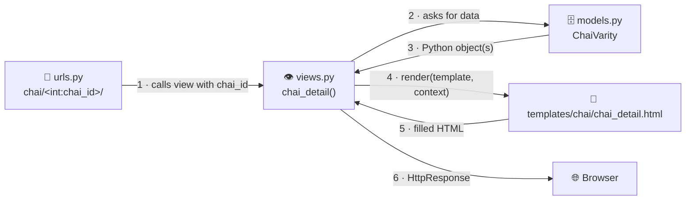
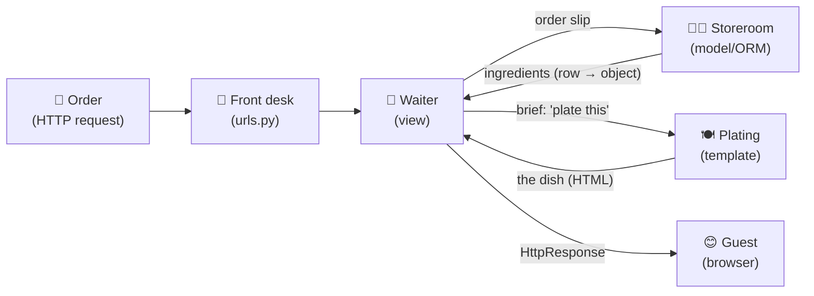

# 🏛️ A002 — MVT Architecture Explained

`📖 Lecture A002` · `🎓 Track: Core Django` · `📶 Level: Beginner` · `✅ Status: Documented`

> [!NOTE]
> **About this chapter's sources:** no lecture transcript exists in this folder (per the
> [documentation contract](../docs/AGENTS.md) §3). This chapter was built from the
> lecture's title and focus — *"Models, Views, Templates in depth"* (series hub) — the
> **official Django documentation**, and, uniquely for A002, the **real code of this
> repository's chai app** (`ChaiAurCode/chaiaurDjango/chai/`), quoted verbatim so theory
> and practice are the same thing. Anything beyond that grounding is marked 📌
> *Beyond the lecture*.

---

## 🧭 What You Will Learn

By the end of this chapter you will be able to:

- [ ] Name the three MVT layers, the file each lives in, and the one question each answers
- [ ] Read a real Django model, view and template and say what every line contributes
- [ ] Explain what `render()` does and what a **context** dictionary is
- [ ] Trace the concrete journey of `/chai/3/` through this repository's chai app, file by file
- [ ] Use the Django Template Language's three syntaxes: `{{ variables }}`, ``, `{{ value|filter }}`
- [ ] Explain template inheritance (`` / ``) and the problem it solves
- [ ] Map symptoms (wrong data, ugly page, broken link) to the layer you should open first
- [ ] Answer MVT interview questions with concrete, repo-grounded examples

## 🎯 Why This Lecture Matters

A001 introduced the three roles — Model, View, Template — at helicopter altitude: *what
they are and where they sit in the pipeline*. But "the view calls the model and renders
a template" is a sentence you can memorize without being able to *do* anything. This
chapter opens each layer and shows the moving parts, using the actual chai app you will
keep practicing in.

Everything later in this series depends on this chapter. Deep-dive model lectures extend
§🗄️. Form and user-input lectures extend §👁️. Admin customization, API responses and
every "make the page nicer" moment extend §🎨. When a future lecture says *"add a
model"* or *"pass it to the template"*, this chapter is what makes those instructions
mean something concrete.

There is also a debugging payoff. Most beginner Django bugs are **layer-confusion**
bugs: HTML built inside views, database queries hidden in templates, context keys that
don't match. After this chapter you will stop guessing and start asking *"which layer
failed?"* — the single most useful debugging habit in Django.

And the timing is deliberate: the chai app is still tiny — 4 models, 3 views, 3
templates — so this is the last moment you can see the *whole* architecture in one
glance, before real projects grow it beyond a single screen.

## ✅ Prerequisites

- [ ] **The A001 pipeline from memory** — request → middleware → `urls.py` → view →
      model/ORM → template → response ([A001 §🔄](../A001_Introduction_What_is_Django/README.md#-django-requestresponse-mental-model))
- [ ] **Project vs app** (the mall & the shops) — the chai app is our shop
      ([A001 §📦](../A001_Introduction_What_is_Django/README.md#-django-project-vs-django-app))
- [ ] **Basic Python:** functions and arguments, dictionaries, imports, classes
- [ ] **Basic HTML:** tags and attributes — 📌 the repo's templates contain Tailwind CSS
      classes, but they are decoration; you need no CSS for this lecture
- 📌 *Optional:* SQL basics will help in later model deep-dives, not here.

> [!NOTE]
> **Recap from [A001](../A001_Introduction_What_is_Django/README.md) — hold the pipeline
> in your head:**
> request → middleware → `urls.py` (dispatcher) → **view** → **model/ORM** ↔ database →
> **template** → response → middleware → browser.
> A002 does not re-derive that pipeline. It walks *inside* its three layers, using the
> real code of the chai app: one model, three views, two templates at a time.


---

## 🗺️ The Three Layers by Their Questions

A001 defined the layers by *role*. From now on, define them by the **question each
answers** — because when a page misbehaves, the question you ask determines the file
you open:

| Layer | The one question | Home file | Chai-app example |
|---|---|---|---|
| **Model** | *What data exists?* | `models.py` | `ChaiVarity` — name, image, type, description |
| **View** | *What happens for this request?* | `views.py` | `chai_detail` — fetch one chai, hand it to a template |
| **Template** | *How is it presented?* | `templates/` | `chai_detail.html` — the page skeleton the data fills |

Two connectors complete the picture: `urls.py` decides **which view** runs, and inside
the view, `render()` decides **which template** receives **which data**.

*What to see: the A001 pipeline with the real chai files in every box — and the two
handoffs (data out of the model; data + template into `render()`) made explicit.*



---

## 🗄️ The Model Layer — *What Data Exists?*

### Three mappings, one class

A model is one Python class with three simultaneous meanings:

| You write | The ORM turns it into |
|---|---|
| a **class** (`ChaiVarity`) | a **database table** |
| a **class attribute** with a field (`name = models.CharField(…)`) | a **column** with a type |
| an **instance** (an object fetched from the DB) | a **row** of that table |

> 🧠 **Remember this:** *class → table, field → column, object → row.* Every model
> sentence you will ever read is one of these three mappings.

### The real chai model, annotated

The actual `ChaiVarity` model from `ChaiAurCode/chaiaurDjango/chai/models.py`
(abbreviated to its core fields):

```python
from django.db import models
from django.utils import timezone

class ChaiVarity(models.Model):                # ① inherits Model → becomes a table
    CHAI_TYPE_CHOICE = [                       # ② permitted values for 'type'
        ('ML', 'MASALA'),
        ('GR', 'GINGER'),
        # … three more varieties
    ]
    name = models.CharField(max_length=100)    # ③ VARCHAR(100) column, required
    image = models.ImageField(upload_to='chais/')  # ④ file upload → media/chais/
    date_added = models.DateTimeField(default=timezone.now)  # ⑤ timestamp w/ default
    type = models.CharField(max_length=2, choices=CHAI_TYPE_CHOICE)  # ⑥ limited to ②
    description = models.TextField(default='') # ⑦ long text, empty default

    def __str__(self):                         # ⑧ human-readable label
        return self.name
```

**Explanation, annotation by annotation:**

- **① `models.Model` inheritance** is what promotes an ordinary class into a mapped
  model — without it this is just a Python class that Django ignores.
- **② `CHAI_TYPE_CHOICE`** is a plain list of `(stored_value, human_label)` pairs.
  Passing it as `choices=` makes Django validate input against it and render friendly
  labels (in forms and the admin).
- **③–⑦ are fields** — each declares a column *and* its rules (`max_length`,
  `upload_to`, `default`). The rules do double duty: they shape the database table
  **and** become validation for anything built on the model.
- **⑧ `__str__`** defines what prints when the object is displayed — in the admin list,
  logs, shell. Without it you'd see `ChaiVarity object (1)` everywhere.

### Why the model matters beyond the database

The model is the **single source of truth** for one kind of data. The admin panel,
forms and validation all *derive from it*: declare `max_length=100` once, and every
form, admin page and future API serializer built on `ChaiVarity` respects it. One
declaration, many obeying behaviors — A001's DRY principle, embodied in one file.

> [!WARNING]
> **A model is not the database.** It is the Python *description* of data; the database
> is separate infrastructure the ORM talks to (A001 §🧠 defused this confusion). And
> never put *presentation* concerns in a model — "how it looks" belongs to templates.

📌 *Deep dives — field types in full, relationships (this app also has `ForeignKey`,
`ManyToMany` and `OneToOne` models), migrations and querying — are later lectures.
Today you need only the three mappings and the single-source-of-truth idea.*


---

## 👁️ The View Layer — *What Happens for This Request?*

### The view contract (the one rule)

> [!IMPORTANT]
> **A view is a Python function that takes one `request` and must return one
> response object.** Request in → `HttpResponse` out. Every view you will ever
> write obeys this contract — that uniformity is what lets the URL dispatcher call
> *any* view without knowing anything about it.

Notice the word *response*, not *HTML string*. A view usually builds its response by
delegating — most commonly with `render()`, which itself returns an `HttpResponse`.
Even the fanciest view (a PDF, a redirect, a JSON reply) is still just "something that
returns a response" — 📌 those alternatives arrive in later lectures.

### `render()` dissected — the bridge between layers

`render()` is the most-called function in beginner Django. Its three arguments:

```python
render(
    request,                 # ① the request — passed through untouched
    'chai/all_chai.html',    # ② which template file to fill
    {'chais': chais},        # ③ the context: data handed to the template
)
```

- **① `request`** travels with the call so the template engine (and anything it
  touches) knows who asked and how.
- **② the template path** is relative to the app's `templates/` folder —
  `'chai/all_chai.html'` means `chai/templates/chai/all_chai.html`.
- **③ the context** is a plain Python **dictionary**. This is the *only* official
  channel carrying data from view to template — and its **keys become the template's
  variable names**: pass `{'chais': chais}` and the template loops over `chais`;
  pass `{'chai': chai}` and the template reads `{{ chai.name }}`.

> 🧠 **Remember this:** `render()` = *"here is the request, fill that file with this
> data, wrap the result in a response."* The context dictionary is the **handoff
> brief** the waiter (view) slides to the plating station (template).

### The real chai views, annotated

The actual `views.py` of the chai app — three views, three patterns:

```python
from django.shortcuts import render, get_object_or_404
from .models import ChaiVarity, Store
from .forms import ChaiVarityForm

def all_chai(request):                          # pattern 1: list everything
    chais = ChaiVarity.objects.all()            # ask the model for ALL rows
    return render(request, 'chai/all_chai.html', {'chais': chais})

def chai_detail(request, chai_id):              # pattern 2: one item by id
    chai = get_object_or_404(ChaiVarity, pk=chai_id)
    return render(request, 'chai/chai_detail.html', {'chai': chai})

def chai_store_view(request):                   # pattern 3: read user input
    stores = None
    if request.method == 'POST':                # form was submitted
        form = ChaiVarityForm(request.POST)
        if form.is_valid():
            chai_variety = form.cleaned_data['chai_varity']
            stores = Store.objects.filter(chai_varieties=chai_variety)
    else:                                       # first visit — show empty form
        form = ChaiVarityForm()
    return render(request, 'chai/chai_stores.html', {'stores': stores, 'form': form})
```

**Explanation, view by view:**

- **`all_chai`** — the whole pattern in two lines: query the model, hand the result to
  the template under the key `chais`. `ChaiVarity.objects.all()` returns a
  **QuerySet** — a chainable *database question*; here, "every chai row".
- **`chai_detail(request, chai_id)`** — the extra parameter exists because the URL
  pattern captured it (`<int:chai_id>` — §🔄 walks the whole journey). Inside,
  `get_object_or_404(ChaiVarity, pk=chai_id)` means: *"fetch the row whose primary key
  is this id — and if it doesn't exist, raise a proper 404 page."* Without it, a made-up
  id like `/chai/999/` would crash the server with an unhandled exception instead of
  politely saying *not found*.
- **`chai_store_view`** — 📌 *a preview, not today's syllabus:* views can branch on
  `request.method` (`POST` = the form was submitted; otherwise show an empty one).
  Forms, `is_valid()` and `cleaned_data` belong to a later lecture — the takeaway for
  A002 is only that **the view is where request-driven decisions happen**.

> [!WARNING]
> **A view does not build HTML.** Strings of markup never belong in `views.py` — the
> template layer exists precisely for that (and auto-escapes data safely). The view
> decides *which* template and *which* data; the template decides *how it looks*.
> Blurring this is the #1 layer-confusion bug (see §❌).


---

## 🎨 The Template Layer — *How Is It Presented?*

### The Django Template Language: exactly three syntaxes

Everything DTL can do uses one of three shapes — learn the shapes, read any template:

| Syntax | Name | Meaning | Real chai-app example |
|---|---|---|---|
| `{{ … }}` | **Variable** | "print this value here" | `{{chai.name}}`, `{{chai.description}}` |
| `` | **Tag** | do something: loop, inherit, build a URL | ` … ` |
| `{{ value\|filter }}` | **Filter** | transform the value on its way out | 📌 generic: `{{chai.name\|title}}`, `{{chai.date_added\|date:"Y"}}` |

> [!NOTE]
> The chai templates currently use variables and tags but no filters — the filter
> examples above are 📌 *supplementary*, added so the third syntax isn't a stranger.
> Dots in `{{chai.name}}` mean *attribute lookup*: Django reads the `name` field of the
> `chai` object that the context handed over.

### `all_chai.html` — a loop with data (the real file, trimmed)

```html
                 <!-- ① inheritance, explained below -->

                          <!-- ② fill the parent's 'content' slot -->
<h1>All Chai</h1>

<div class="grid grid-cols-3 gap-4 m-4">     <!-- Tailwind classes = decoration only -->
                      <!-- ③ loop over the context list -->
        <div class="bg-blue-500 p-5 rounded">
                   <!-- ④ attribute lookup -->
            <h3>{{chai.name}}</h3>
            <a href="">  <!-- ⑤ build URL by NAME -->
                <button>{{chai.type}} - {{chai.id}}</button>
            </a>
        </div>
    
</div>

```

**Explanation:** ③ the template never writes a query — it loops over the `chais`
*context variable* the view passed. ④ each attribute lookup walks the object the
ORM returned. ⑤ `` generates `/chai/3/` from the
pattern's `name=` — the template never hardcodes a URL string, so renaming or
restructuring URLs never breaks links (A001's DRY, again).

### Template inheritance — write the skeleton once

Every page of a site shares its outer shell (navbar, `<head>`, footer). Duplicating it
per page violates DRY, so Django templates **inherit**:

```html
<!-- templates/layout.html — the PARENT: the shared skeleton -->
<!DOCTYPE html>
<html lang="en">
<head>
    <title>Default Value</title>  <!-- blank field -->
</head>
<body>
    <nav>This is our navbar</nav>              <!-- shared by every child -->
              <!-- blank field for each page -->
</body>
</html>
```

```html
<!-- chai/templates/chai/chai_detail.html — the CHILD: only what differs -->



Chai Detail Page



<h1>Chai Detail Page</h1>
<h3>{{chai.name}}</h3>
<h3>{{chai.description}}</h3>

```

**Explanation:** the parent declares **blocks** (blank fields); the child declares
`` and fills only the fields it cares about. Visiting `/chai/3/` renders
*layout.html's skeleton* with *chai_detail.html's* blocks slotted in — one navbar
definition, N pages. This is why the repo has both `templates/layout.html` (project
shell) and per-app children under `chai/templates/chai/`.

> 🧠 **Remember this — the letterhead analogy:** `layout.html` is a company
> **letterhead** — logo, address, page frame printed once. Each letter (`chai_detail.html`,
> `all_chai.html`) is written on that letterhead, filling in only the *body* and
> *subject line*. Nobody re-types the logo per letter.

### How Django finds a template file

`render(request, 'chai/all_chai.html', …)` searches the app's `templates/` directories
(apps registered in `INSTALLED_APPS`) for `chai/all_chai.html`. If the path or the
folder name doesn't match — e.g. the file sits in `chai/templates/chai_details.html` —
you get `TemplateDoesNotExist` at request time. The render path and the folder layout
are a contract; when they disagree, the error names the path it couldn't find.

> [!WARNING]
> **Keep logic out of templates.** DTL is deliberately limited: loops, conditions and
> filters — no arbitrary Python calls. That limitation is a *feature*: it forces data
> shaping into the view (testable Python) and keeps templates presentation-only. A
> template that needs "smarter" data is telling you the *view* should have prepared it.


---

## 🔄 The `/chai/3/` Journey — File by File

The chapter diagram showed the shape; now walk the *actual files*. Bookmark this
walkthrough — it is the chai app in one table.

| # | Stage | The file that does it | What happens |
|---|---|---|---|
| 1 | Browser asks | — | `GET /chai/3/` arrives at Django |
| 2 | Hand-off | project `urls.py` | the root URLconf `include()`s the chai app's `urls.py` |
| 3 | Match | `chai/urls.py` | `path('<int:chai_id>/', views.chai_detail, name='chai_detail')` matches `3/` and the **converter** captures `3` as an `int` |
| 4 | Call | `chai/views.py` | Django calls `chai_detail(request, chai_id=3)` |
| 5 | Fetch | `chai/models.py` via ORM | `get_object_or_404(ChaiVarity, pk=3)` → SQL `SELECT … WHERE id=3` → one row becomes one Python object. *(An id with no row → a 404 page, not a crash.)* |
| 6 | Render | `render()` | loads `chai/chai_detail.html` with context `{'chai': chai}` |
| 7 | Inherit | `templates/layout.html` | the child extends the parent; both `block`s get filled |
| 8 | Fill | `chai_detail.html` | `{{chai.name}}` → e.g. *Masala Chai*; `{{chai.description}}` → its text |
| 9 | Return | view → middleware | the finished HTML travels back as the `HttpResponse` |

> 🧠 **Remember this:** every Django page is this walk with different values. When
> something breaks, find *the step* — the next section turns that habit into a table.

## 🧭 Debugging by Layer — Symptoms → First File to Open

The promise of MVT: bugs announce their layer.

| Symptom | Failing layer | Open first |
|---|---|---|
| Page loads but shows wrong / missing data | Model or View — query or context | `views.py` (is the query right? does the context key match the template?) |
| `TemplateDoesNotExist` | Template — path contract | the `render()` path vs the real folder/file names |
| Page renders but the navbar/skeleton is gone | Template — inheritance | the `` line and the parent's `` names |
| Link goes to the wrong page or 404 | URL layer | `urls.py` patterns, the `name=`, the `` arguments |
| Data is correct but the page looks broken | Template — presentation | the template's HTML (Tailwind/CSS is decoration — out of Django's scope) |
| Visiting a made-up id crashes the server | View — defensive fetch | add/verify `get_object_or_404` |

## 🧱 A002 Vocabulary (condensed)

Canonical spellings and full definitions live in
[`docs/MEMORY.md`](../docs/MEMORY.md) — this is the chapter's quick reference:

| Term | What it means here | 🧷 Hook |
|---|---|---|
| **Model** | class → table, field → column, object → row | the storeroom ledger |
| **View** | function: `request` in → response out | the waiter |
| **Template** | HTML skeleton that receives context data | the plating station |
| **QuerySet** | the chainable question you ask the model | the storeroom order slip |
| **`render()`** | request + template + context → filled response | "fill that file with this data" |
| **Context** | dictionary whose keys become template variables | the handoff brief |
| **DTL** | `{{ variables }}` · `` · `\|filters` | three shapes, read any template |
| **Inheritance** | `` + `` = skeleton once | letterhead & blank fields |
| **Path converter** | `<int:chai_id>` — capture and type a URL segment | room number on the ticket |
| **`get_object_or_404()`** | fetch a row or raise a clean 404 | "politely say not found" |
| **`pk` / `__str__`** | a row's badge number / its shelf label | id card · name tag |
| **URL `name=` + ``** | links built by nickname, not hardcoded path | call the room by its nickname |


---

## ❌ Common Beginner Mistakes

Each mistake: what it is → why it happens → how to fix it. All of these are *layer*
confusions — MVT exists precisely to make them impossible once you internalize it.

1. ❌ **Fetching data in the template.**
   *Why it happens:* the template "needs one more thing", so a query sneaks in.
   *Fix:* templates receive data; they never fetch it. If a template is missing data,
   the *view* should have put it in the context.

2. ❌ **Fixing wrong data by editing the template.**
   *Why it happens:* the wrong values are *visible* in the page, so the template looks
   guilty. *Fix:* diagnose by layer (table above): wrong data = query/context →
   `views.py`; the template can only show what it is handed.

3. ❌ **Context-key mismatches — the silent killer.**
   *Why it happens:* the view passes `{'item': chai}` but the template asks for
   `{{ chai.name }}` — the key and the variable don't match.
   *Fix:* the keys of the context dictionary **are** the variable names in the
   template. And know the dangerous detail: a missing variable renders as
   **empty text, not an error** — so a typo shows up as blank output. When a page is
   mysteriously empty, check the context keys first.

4. ❌ **Hardcoding URLs in templates** (`<a href="/chai/3/">`).
   *Why it happens:* it seems quicker than learning ``.
   *Fix:* build links by *nickname*: ``. Rename the
   pattern later and every link updates itself — hardcoding rots instantly.

5. ❌ **Putting `` anywhere but the first line.**
   *Why it happens:* other HTML or whitespace above it.
   *Fix:* `` must be the very first template tag; anything before it
   breaks inheritance.

6. ❌ **Storing templates in the wrong folder.**
   *Why it happens:* Django's template *loader* has a contract: an app's templates live
   under `app_name/templates/` (by convention further namespaced as
   `app_name/templates/app_name/`). Break the contract → `TemplateDoesNotExist`.
   *Fix:* match the path you pass to `render()` with the real folder/file names.

7. ❌ **Thinking MVT and MVC are different architectures.**
   *Why it happens:* different names suggest different ideas.
   *Fix:* same idea, different words — see §🏛️-style mapping: Django's **view** ≈
   MVC's controller; Django's **template** ≈ MVC's view. (Established in A001; here it
   becomes muscle memory.)

> 🧠 **Remember this:** every mistake above is one layer doing another layer's job —
> or two layers failing to agree on the *contract* between them (context keys, template
> paths, URL names).

---

## 🧠 Common Misconceptions

| ❌ Misconception | ✅ Reality |
|---|---|
| "The view renders the HTML" | The view *chooses* the template and calls `render()`; the **template engine** does the rendering |
| "The model and template talk to each other" | They never meet. The **view is the middleman**: model → data → context → template |
| "A QuerySet is a list of rows" | It's a **lazy, database-backed** question — SQL runs only when the results are actually needed |
| "Django's MVT breaks the MVC pattern" | It *implements* the same separation with different names |
| "Templates contain no logic at all" | They contain **limited, presentation-only** logic (tags/filters) — limited *on purpose* |
| "`{{ chai.name }}` would raise an error if `chai` were missing" | DTL is **silent by default**: missing variables render as empty strings — a designed (and dangerous) quietness |
| "`get_object_or_404` is just `get()`" | `get()` raises a raw server error for missing rows; `get_object_or_404` converts it into a proper **404 page** |


---

## 🎯 Interview Perspective

Seven questions that test whether a candidate *thinks in layers* — not whether they
memorized a diagram.

**Q1 · Explain Django's MVT architecture in under a minute.** *(beginner)*

> **Strong answer:** "MVT separates a Django page into three roles: the **Model**
> describes the data and talks to the database through the ORM; the **View** is a
> function that receives the request, fetches data via models, and returns a response —
> usually by rendering a **Template**, an HTML skeleton filled with the view's data.
> URLs route each request to its view."
>
> **Why it works:** three roles + one sentence on how they connect + the URL layer. No
> diagram-recitation, actual relationships.

**Q2 · Django is "MTV", not "MVC" — what's the difference?** *(the classic trap)*

> **Strong answer:** "No architectural difference — different names. Django's view does
> what MVC's controller does: receive the request and orchestrate. Django's template
> does what MVC's view does: presentation. Django's FAQ says its view decides *which*
> data is shown and the template decides *how* it looks."
>
> **Why it works:** candidates who panic here have memorized; candidates who map the
> terms understand.

**Q3 · What exactly does `render()` take and return?** *(practical)*

> **Strong answer:** "Three core arguments: the `request`, the template path, and a
> context dictionary. It returns an `HttpResponse` whose body is the template rendered
> with that context — which is why the view can return it directly."
>
> **Why it works:** signature + *why the return type matters* in the request/response
> contract.

**Q4 · Your template shows blank values with no error. First thing you check?**
*(practical — diagnostic reasoning)*

> **Strong answer:** "The context keys. DTL renders missing variables as empty strings
> by default, so a mismatch between the view's `{'item': chai}` and the template's
> `{{ chai.name }}` fails silently. After that: is the query returning what I think
> (view), and does the template path resolve (loader)."
>
> **Why it works:** knows DTL's *designed* silence, then orders the suspects by layer —
> exactly how seniors debug.

**Q5 · What problem does template inheritance solve?** *(conceptual)*

> **Strong answer:** "Duplication of shared page structure — navbars, footers, asset
> includes. A parent layout declares `` placeholders; each child template
> extends it and fills only its own region. Change the navbar once, every page updates."
>
> **Why it works:** names the DRY principle concretely with the one-place-change payoff.

**Q6 · Why use `get_object_or_404` instead of `get()` in a view?** *(practical)*

> **Strong answer:** "`get()` on a missing row raises a model-side exception — a 500
> error. `get_object_or_404` catches that case and produces a proper 404 response.
> Same lookup, correct HTTP semantics, and it keeps the try/except noise out of the
> view."
>
> **Why it works:** the answer is about *HTTP semantics*, not convenience — that's the
> senior framing.

**Q7 · A user visits `/chai/3/`. Walk me through what happens.** *(practical)*

> **Strong answer:** "Root URLconf includes the chai app's URLconf; `<int:chai_id>/`
> matches, capturing 3. Django calls `chai_detail(request, chai_id=3)`, which does
> `get_object_or_404(ChaiVarity, pk=3)` — one SQL SELECT, one object. Then
> `render(request, 'chai/chai_detail.html', {'chai': chai})` fills the template,
> which extends the shared layout, and the HTML goes back as the response body."
>
> **Why it works:** files named, capture explained, SQL made explicit, inheritance
> mentioned — the whole chapter in four sentences, no detours.


---

## 🔁 Active Recall

Answer in your head first — retrieval is the workout; the collapsed answers are just
the mirror.

**1. Name the three MVT layers, their home file, and the one question each answers.**

<details><summary>Answer</summary>

**Model** → `models.py` → *what data exists?* · **View** → `views.py` → *what happens
for this request?* · **Template** → `templates/` → *how is it presented?*
</details>

**2. The three model mappings: class→?, field→?, object→?**

<details><summary>Answer</summary>

class → database **table** · field (attribute) → **column** · object (instance) → **row**.
`ChaiVarity` → table; `name = CharField(...)` → column; one specific chai → one row.
</details>

**3. What are `render()`'s three arguments, and what does it return?**

<details><summary>Answer</summary>

`render(request, template_path, context)` → returns an **`HttpResponse`** whose body is
the template filled with the context — which is why a view can `return render(...)`
directly.
</details>

**4. Why do context keys matter so much — and what happens when one is wrong?**

<details><summary>Answer</summary>

The keys **are** the template's variable names. A mismatch (`{'item': chai}` vs
`{{ chai.name }}`) renders as **empty text with no error** — DTL is silent by default.
So: blank page → check context keys first.
</details>

**5. Name the DTL's three syntaxes and one example each.**

<details><summary>Answer</summary>

`{{ variable }}` — output a value · `` — logic/control (``,
``, ``, ``) · `{{ value|filter }}` — transform output
(`{{ name|title }}`).
</details>

**6. Template inheritance: which tag goes in the parent, which in the child, and what's
the first-line rule?**

<details><summary>Answer</summary>

Parent declares **`…`** placeholders; child starts with
**``** as the *very first* tag, then fills blocks. Anything
before `` breaks inheritance.
</details>

**7. `get_object_or_404(Model, pk=3)` vs `Model.objects.get(pk=3)` — what's the
difference when row 3 doesn't exist?**

<details><summary>Answer</summary>

`get()` raises an exception → ugly **500** error. `get_object_or_404` raises `Http404`
→ a proper **404 page**. Same lookup, correct HTTP semantics.
</details>

**8. Why write `` instead of `href="/chai/3/"`?**

<details><summary>Answer</summary>

Links are built from the pattern's **`name=`** (its nickname), not a hardcoded string.
Change the URL pattern later and every `` link updates automatically;
hardcoded paths rot immediately.
</details>

**9. Walk `/chai/3/` file by file — name every file in order.**

<details><summary>Answer</summary>

project `urls.py` (include) → chai `urls.py` (match, capture `int`) → `views.py`
(`chai_detail` runs, `get_object_or_404`) → `models.py` via ORM (SQL SELECT) →
`render()` loads `chai/chai_detail.html` → it extends `layout.html` (blocks filled) →
`HttpResponse` back to the browser.
</details>

**10. `TemplateDoesNotExist` — which layer, and what are you checking?**

<details><summary>Answer</summary>

Template layer — specifically the **loader contract**: the path string passed to
`render()` must match real folders/files under an app's `templates/` directory.
Fix names/paths, not code logic.
</details>


---

## 📝 Quick Revision — A002 in Five Minutes

**The three layers (one line each):**

| Layer | File | Answers | One-liner |
|---|---|---|---|
| 🗄️ Model | `models.py` | *What data exists?* | class→table, field→column, object→row |
| 👁️ View | `views.py` | *What happens for this request?* | request in → fetch via model → render → response out |
| 🎨 Template | `templates/` | *How is it presented?* | HTML skeleton + `{{ context }}` filled at render time |

**The four contracts that hold MVT together:**

1. `render(request, path, context)` → `HttpResponse` (view's favorite return)
2. context **keys** = template **variable names** (silent failure if they mismatch)
3. `` first line in child; `` named in parent
4. `` for every link — never hardcode paths

**The journey (memorize cold):**
`GET /chai/3/` → root `urls.py` include → `'<int:chai_id>/'` captures 3 →
`chai_detail(request, chai_id=3)` → `get_object_or_404(ChaiVarity, pk=3)` (SQL SELECT)
→ `render('chai/chai_detail.html', {'chai': chai})` → extends `layout.html`, blocks
filled → `HttpResponse` → browser.

**Debugging shortcuts:** wrong/missing data → `views.py` · `TemplateDoesNotExist` →
loader contract/paths · empty values, no error → context keys · broken/404 links →
`urls.py` names & `` args · skeleton missing → ``/blocks.

**Top 3 traps:** templates never fetch data · DTL renders missing variables as blank
(why blank-page bugs hide) · MVT ≠ different architecture — it's MVC with Django's names.

---

## 🧠 Mental Model — One Dish, Three Stations

A002 extends A001's restaurant into its **architecture lesson**. One order, three
stations, two contracts between them:

*What to see in the diagram: the request flows one way through the stations; the data
flows from storeroom to plating — the waiter (view) is the only station that touches
both.*



**Remember the chapter in one breath:** *the front desk matches the order to a waiter;
the waiter reads the storeroom ledger through the ORM, hands the ingredients to the
plating station with a brief, and carries the finished dish back — no station ever does
another's job, and every bug belongs to exactly one station.*


---

## 🏁 Learning Checkpoints

You can move on when *all* of these feel boringly obvious:

- [ ] I can name the three layers, their files, and the one question each answers —
      without looking.
- [ ] I can trace `/chai/3/` through every file, in order, from memory.
- [ ] I can write `render()`'s signature and say what it returns *and why that return
      type matters*.
- [ ] Given any symptom (blank values, `TemplateDoesNotExist`, wrong page), I can name
      the layer and the first file to open.
- [ ] I can explain template inheritance with the letterhead analogy and state the
      first-line rule.
- [ ] I can tell someone why MVT is not "a different architecture" from MVC.

---

## 🏋️ Exercises

**Level 1 — Recall** *(do from memory, then check the chapter)*

1. Write the three-layer table from §📝 — files and questions — from memory.
2. Write `render()`'s signature and its return type.
3. List the DTL's three syntaxes with one example each.

**Level 2 — Understanding** *(explain in your own words, aloud)*

4. A friend says "Django doesn't follow MVC." Correct them precisely, mapping each
   letter to Django's term.
5. Why is it *good* that DTL silently renders missing variables as empty… and *bad*?
   (Hint: think HTML comment fallbacks vs silent bugs.)
6. The chai app has `all_chai` (list page) and `chai_detail` (one item). Predict which
   template variables each template receives and why the *names* differ
   (`chais` vs `chai`).

**Level 3 — Application** *(write code; sketch before checking the repo)*

7. Using the repo's chai app as the model, write a new URL pattern + view + template
   snippet for `/chai/cheap/` that lists every chai with `price` under 100.
   *You need:* a path entry, a view using `ChaiVarity.objects.filter(...)`, a
   `render(...)` call, and a template that extends `layout.html` and loops with
   ``.
8. Deliberately break the app: rename the `{'chai': chai}` context key to `{'cup': chai}`
   and visit `/chai/3/`. Observe the *silent* blank output. Fix it — then write one
   sentence describing why this bug is invisible in most tutorials.

**Level 4 — Interview reasoning** *(write full spoken-style answers)*

9. "Our detail page sometimes shows blank product names under load. Walk me through
   your diagnosis." *(Expect: context keys → query results → template path — argue the
   order.)*
10. A teammate wants to run SQL inside a template to "save a trip to the view". Give
    them the architectural reason that's wrong, then the practical one.


---

## 🏁 Final Takeaways

1. **MVT is a separation of responsibilities, not a folder decoration** — Model answers
   *what data*, View answers *what happens*, Template answers *how it looks*.
2. **The view is the orchestrator** — the only layer that touches the request, the
   model *and* the template; the model and template never meet directly.
3. **Three mappings unlock the Model**: class→table, field→column, object→row. From
   `ChaiVarity` you can now predict the database shape without seeing SQL.
4. **`render(request, path, context)`** is the view's favorite return: an
   `HttpResponse` whose body is the template filled with context.
5. **Context keys are a contract** — and DTL breaks it *silently*: missing variables
   render as blank text, which is why blank-page bugs must be chased through the
   context first.
6. **Inheritance = write the skeleton once** — parent layout with ``
   placeholders, children that only fill regions, `` always first.
7. **URLs are part of the architecture** — `<int:chai_id>` captures and types input;
   `name=` + `` keep templates decoupled from paths.
8. **Bugs announce their layer** — the symptom→file table is not a cheat sheet; it is
   the *point* of the architecture.
9. **MVT vs MVC is vocabulary, not architecture** — Django's view ≈ MVC's controller;
   Django's template ≈ MVC's view.

---

## 🔄 Next Lecture Connection

You now own the *map* — every future lecture zooms into one station of the journey you
can already trace end to end:

- **If A003 deepens the URL dispatcher & views:** you're ready for `include()` trees,
  more converters, redirects, and class-based views — all refinements of the front-desk
  and waiter roles you just learned.
- **If it deepens Models & the ORM:** you're ready for `QuerySet` methods, model
  relationships, and migrations — the storeroom ledger grows a real inventory system.
- **If it deepens Templates:** inheritance, filters, and custom template tags extend
  the plating station you already understand.

Either way, A001 gave you the pipeline and A002 gave you the three stations inside it —
from here on, Django is *depth*, not new shape.

---

## 📚 Sources Used

> [!NOTE]
> **Source situation:** no A002 transcript or lecture notes existed in the repository
> when this chapter was written (the folder contained only this empty README).
> Per the documentation contract (AGENTS §3), this chapter was grounded in:
>
> 1. **The lecture title** — *MVT Architecture Explained* — and the topic scope it
>    implies (Model · View · Template as one system).
> 2. **The official Django documentation** — the Models, Views, Templates, Django
>    Template Language, URL dispatcher and shortcuts topics at docs.djangoproject.com.
> 3. **This repository's real chai app** — `ChaiAurCode/chaiaurDjango/chai/` code
>    (`models.py`, `views.py`, `urls.py`, `chai_detail.html`, `all_chai.html`,
>    `templates/layout.html`) quoted and annotated **verbatim**; every claim about the
>    chai app is backed by that code.
> 4. **A001** for continuity — the recap box, the restaurant analogy and the MVT↔MVC
>    mapping reuse A001's registered mental models unchanged.

Anything beyond these sources would be labeled 📌 *beyond the lecture* — none was
needed beyond standard Django background that official docs cover.

---

🧭 **Navigation:** [← A001 · Introduction to Django](../A001_Introduction_What_is_Django/README.md) · [📚 Series Hub](../README.md) · A003 *(next chapter — link appears when it exists)*
