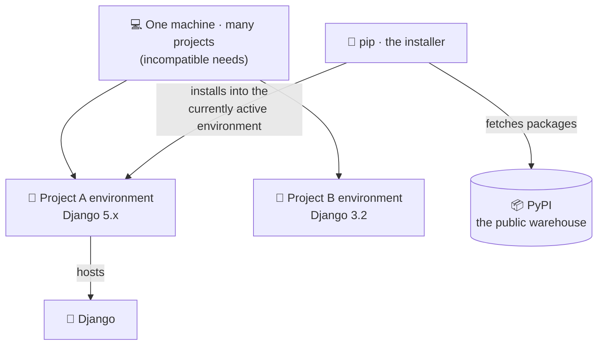
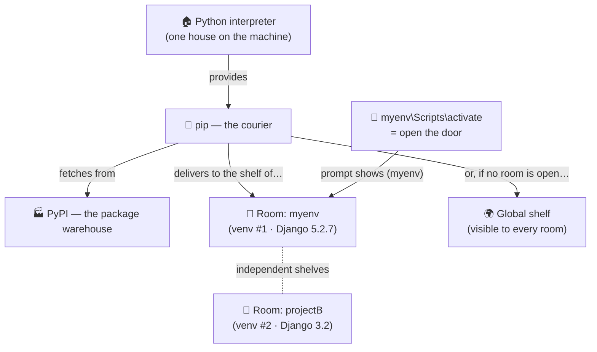

# ⚙️ A003 — Installing Django: Python, pip & Virtual Environments

`📖 Lecture A003` · `🎓 Track: Core Django` · `📶 Level: Beginner` · `✅ Status: Documented`

> [!NOTE]
> **About this chapter's sources:** the primary source is the owner's command journal
> [`commands.txt`](../commands.txt) — the five setup commands actually run for this
> lecture, quoted verbatim in §📦. Gaps (what pip *is*, how activation works, the
> built-in `venv` alternative) are filled from the official Python/pip/Django
> documentation, and anything beyond the journal is marked **📌**. One *ordering
> discrepancy* between the journal and best practice is deliberately kept visible and
> labeled in §⚠️ — it is one of the best teaching moments in the chapter.

---

## 🧭 What You Will Learn

By the end of this chapter you will be able to:

- [ ] **Explain** what Python, pip, PyPI, a virtual environment, and `django-admin` each are — and why each exists
- [ ] **Verify** that Python and pip are installed and reachable on your machine
- [ ] **Install** Django with `pip install django` and **confirm** it with `django-admin --version`
- [ ] **Create** a virtual environment (`virtualenv myenv`) and **activate** it on Windows (`myenv\Scripts/activate`)
- [ ] **Explain** what activation actually changes (PATH, prompt) — and what it does *not* change
- [ ] **Order** the setup steps professionally (venv *before* installing Django) and justify why
- [ ] **Diagnose** the classic setup failures: "pip installed it but `django-admin` is not recognized", "wrong Python runs", "myenv accidentally committed"

## 🎯 Why This Lecture Matters

A001 gave you the *concept* of Django and A002 walked the MVT layers inside an
already-running project. But notice what those chapters quietly assumed: a Python
interpreter that could import Django, isolated from every other project on the
machine. **A003 builds that launchpad.** Everything from A004 onward — creating the
project, writing models, running migrations — happens *inside an environment you set
up in this chapter*.

This is also where most beginners quietly lose weeks. Environment problems never
look like environment problems: they look like *" Django is broken"*, *"the tutorial
is wrong"*, or *"it works on my machine but not yours"*. A developer who understands
pip, PyPI, PATH and activation diagnoses those in minutes instead of reinstalling
Python in frustration — and "how do you manage environments?" is a near-guaranteed
interview question precisely because it separates people who *ran* commands from
people who *understand* them.

**Why-before-how, one line:** every tool in this chapter exists to solve one problem —
*many projects, one machine, incompatible needs*. Keep that sentence in mind and every
command below will feel inevitable instead of arbitrary.

## ✅ Prerequisites

- [ ] A001 done (you know what Django is and what `pip install django` installs)
- [ ] A002 done (you have seen a real project run — knowing *what* you're setting up helps)
- [ ] Python 3 installed — checking it is Step 0 of this chapter, so nothing else
- [ ] 📌 A Windows machine for the *exact* paths in [`commands.txt`](../commands.txt)
      (`myenv\Scripts/activate`) — macOS/Linux equivalents are given alongside, marked 📌

## 🔁 Recap From Earlier Lectures

**From A001:** Django is a batteries-included Python web framework; **`django-admin`**
is Django's global command-line tool ("the mall-builder's intercom") — it appears in
this chapter to *verify* the installation, and becomes the star of A004.
**From A002:** MVT splits an app into Model/View/Template — but that app ran inside
an environment. This chapter is where such an environment comes from.


---

## 🗺️ The Big Picture — One Machine, Many Projects

Before touching any command, install the *map*. Five tools cooperate in every Python
project, and each command in the journal operates exactly one of them:

*What to see in the diagram: pip fetches packages from PyPI and installs them into the
environment that is **currently active** — which is why "which environment was active
when I ran that?" is the most important question in this whole chapter.*



| Tool | One-line job | 🧷 Memory hook |
|---|---|---|
| **Python interpreter** | Runs every `.py` file — the engine | The engine |
| **pip** | Downloads & installs packages | The delivery truck |
| **PyPI** | The public warehouse of installable packages | The warehouse pip shops at |
| **Virtual environment** | A private, per-project copy of Python + packages | One airtight toolbox per project |
| **Django** | The framework your project uses — itself just a package | The furniture |

> 🧠 **Remember this:** pip never "installs into your computer" in the abstract — it
> installs into **one specific environment**. Every setup problem you will ever meet
> starts with answering *"which one was active when I ran that?"*

## 📦 The Source Journal — `commands.txt` Verbatim

This chapter is built on the five commands journaled during the lecture
([`commands.txt`](../commands.txt)), reproduced exactly:

```bash
pip install django

django-admin --version

pip install virtualenv

virtualenv myenv

myenv\Scripts/activate
```

What each command does — and what it *leaves behind*:

| # | Command | Acts on | Leaves behind |
|---|---|---|---|
| 1 | `pip install django` | whichever environment was active at that moment | Django downloaded from PyPI into that environment's `site-packages` |
| 2 | `django-admin --version` | Django's console script | proof the script is reachable and its Python can import Django |
| 3 | `pip install virtualenv` | the active environment | the third-party `virtualenv` *tool* installed |
| 4 | `virtualenv myenv` | the current folder | a new folder `myenv/` — a fresh, empty environment |
| 5 | `myenv\Scripts/activate` | your *shell session* | PATH re-pointed to `myenv` — for this session only |

> 💡 Notice the three verbs: commands **1–3** *install* things; command **4**
> *creates* a place; command **5** *points your shell* at that place. Installing ≠
> creating ≠ activating — three different actions on three different layers.

The order of these five lines hides one of the best lessons of the chapter — the
journal installed Django **before** any environment existed. We keep that visible and
dissect it in §⚠️ (The ordering lesson).


---

## 🐍 Step 0 — Python, the Foundation

Every tool in this chapter is *built on* one thing: the **Python interpreter** — the
program that actually executes `.py` files. Saying "Python is installed" means two
specific things, and beginners usually only check one:

1. the interpreter **exists on disk** (an `python.exe` somewhere), **and**
2. your shell can **find it by name** — it is on the **PATH**.

> 🧷 **PATH** is your shell's *search list of folders*: when you type `python`, the
> shell walks that list and runs the first match. "Installed but not on PATH" is the
> single most common setup failure in existence — the tool exists, the shell just
> can't see it.

The journal doesn't include this check — it was presumably done before recording —
so it's marked 📌, but **never skip it on a real machine**:

```bash
# Verify the interpreter and pip are reachable (do this before anything else):
python --version      # → e.g. Python 3.12.4
pip --version         # → e.g. pip 24.0 from ... (Python 3.12)
```

> [!WARNING]
> 📌 **Windows quirk:** typing `python` on a fresh Windows machine can open the
> Microsoft Store instead of running Python (an "alias" stub), and some installs
> respond to `py` (the Windows launcher) rather than `python`. If `python --version`
> prints nothing sensible, try `py --version` before assuming Python is missing.

Everything downstream — pip, Django, virtualenv — is *just files the interpreter can
load*. Keep that framing: you are not "installing magic", you are placing files where
an interpreter can find them.

## 🚚 pip & PyPI — the Delivery System

**pip** is Python's package installer: you name a package, pip fetches it from
**PyPI** (the Python Package Index — a public warehouse holding hundreds of thousands
of installable packages) and unpacks it into an environment's `site-packages`
directory. Django itself is delivered exactly this way — "pip install django" is the
moment A001's framework finally lands on your machine.

### What actually happens when you run `pip install django`

1. **Resolve** — pip checks PyPI for the newest Django release compatible with your
   Python version (and anything Django itself depends on).
2. **Download** — the package (a wheel — a pre-built archive) travels from PyPI to
   your machine. *This is why you need internet the first time.*
3. **Unpack & register** — pip unpacks it into the active environment's
   `site-packages/` and writes metadata so pip can later list, upgrade or remove it.
4. **Console scripts** — as a bonus, packages can install *commands* into the
   environment's `Scripts/` folder. Django delivers **`django-admin`** this way —
   which is why command #2 of the journal can only work *after* command #1 succeeded.

> 🧠 **Remember this:** `pip install X` = *resolve → download → unpack into the active
> environment*. If you remember only one phrase: **pip installs into an environment,
> never "into Python in general."**

Where did the journal's install land? At command #1 **no environment existed yet**
(`virtualenv myenv` is only command #4) — so Django went into the **global**
interpreter's site-packages. That's not a crash; it's a *smell*, and we dissect it in
§⚠️. 📌 *(This placement analysis comes from pip/virtualenv documentation, not from
the journal itself — the journal records commands, not outcomes.)*

To see the receipt of any install (📌 beyond the journal):

```bash
pip show django       # → name, version, location on disk, dependencies
pip list              # → every package in the ACTIVE environment
```


---

## 🧰 Virtual Environments — the Why-Before-How

Here is the problem the whole chapter orbits: **many projects, one machine,
incompatible needs.** Picture it concretely: Project A follows an older tutorial and
needs Django 3.2; Project B is new and uses Django 5.x. With one shared, global
Python, both projects draw from the *same shelf* — so upgrading Django for B silently
breaks A. Multiply by every project you will ever own, add "I upgraded something last
month and nothing runs anymore", and the pain is obvious.

**The fix is almost embarrassingly simple:** stop sharing. Give each project its own
private copy of Python's package shelf — a **virtual environment**.

### What a virtual environment physically is (demystified)

No magic, no virtualization software — **it is just a folder**:

```
myenv/
├── Scripts/            ← this environment's python, pip, django-admin + activation scripts
├── Lib/site-packages/  ← this environment's PRIVATE package shelf
└── pyvenv.cfg          ← a small note saying which base interpreter this env was born from
```

*What to see in the tree: the environment carries its own `Scripts/` (commands) and
its own `site-packages/` (packages) — the two things that were previously shared
globally.* 📌 *(On macOS/Linux the folder is `bin/` instead of `Scripts/`.)*

Now the mechanics fall out naturally, cause → effect:

- When `myenv` is active, typing `python` resolves to `myenv\Scripts\python.exe` —
  because activation put that folder **first in PATH** (§🚪).
- Typing `pip install anything` therefore installs into
  `myenv\Lib\site-packages\` — Project A's shelf can never see Project B's packages.
- **Deleting the folder deletes the environment — and nothing else.** Your code lives
  outside; recreating the environment is one command.

## 🏗️ virtualenv vs venv — Two Tools, One Idea

> 📌 **Beyond the journal:** the distinction below is supplementary background that
> explains *why the journal has five commands instead of four*.

Notice the journal installs a *tool* before it can use it: command #3
(`pip install virtualenv`) exists because **virtualenv** is a third-party PyPI
package — the original environment tool, older than the solution built into Python
itself. Since Python 3.3, the standard library ships **venv**:

| | 🧰 `virtualenv` (journal's choice) | 🐍 `venv` (built-in) |
|---|---|---|
| Where it comes from | third-party package from PyPI | inside Python itself (≥ 3.3) |
| Needs installing first? | ✅ yes — that's journal command #3 | ❌ no — ready out of the box |
| Create command | `virtualenv myenv` | `python -m venv myenv` |
| Why people still use it | works on old Pythons, faster env creation, extra flags | zero setup — the modern default |

Same idea, near-identical folder layout, either is fine for learning. The journal is
*internally consistent*: it installs the tool (3) before using it (4) — exactly the
resolve→download→install flow from §🚚, applied to the tool itself.

## 🚪 Activation — What `myenv\Scripts/activate` Really Does

Running the activation script (journal command #5) changes your *current shell
session* in exactly two ways:

1. **PATH is re-pointed.** The environment's `Scripts/` folder is placed at the
   *front* of PATH — so the next time you type `python`, `pip`, or `django-admin`,
   the shell's folder-walk finds **myenv's copies first**. Same command names,
   different folders winning the race. *This, not anything more mystical, is "using
   the environment".*
2. **The prompt changes** — you'll see `(myenv)` prefixing your prompt. Purely a
   courtesy label so you don't forget where you are.

And what it does **NOT** do — the misconceptions that cost real debugging hours:

- ❌ It installs, downloads or moves **nothing**. Activation is routing, not delivery.
- ❌ It is **not a sandbox**. An activated (or not) Python program can still read and
  write whatever *your user account* can. Isolation is about package shelves, not
  security walls.
- ❌ It does **not** affect other terminals or survive closing the window — activation
  is **per session**. New terminal = not activated (the classic *"but it worked
  yesterday"* is often just this).

To step out of the environment: `deactivate`. To enter another project's: activate
that one — the label follows the last activation.

> [!IMPORTANT]
> **Activation is convenience (which tools your commands resolve to), never security
> (what those tools may touch).** 🧷 *Gloves, not a fence:* putting on the project's
> gloves changes which tools your hands grab — it does not fence off the building.

### The same activation, on every platform 📌

| Shell | Activate with |
|---|---|
| Windows (cmd) | `myenv\Scripts\activate` |
| Windows (PowerShell) | `myenv\Scripts\Activate.ps1` *(blocked? see §❌ mistakes — execution policy)* |
| macOS / Linux (bash, zsh) | `source myenv/bin/activate` |

The journal's `myenv\Scripts/activate` (mixed `\` and `/` separators) is the cmd form —
Windows path handling tolerates the forward slash there.


---

## 🔍 Verifying the Installation — What `django-admin --version` Proves

Journal command #2 looks trivial, but a *passing* version check quietly proves a
three-deep chain — read it as an audit, not a greeting:

1. Your shell **found** a `django-admin` command → some environment's `Scripts/`
   folder is on PATH (which one? — that's the §⚠️ question).
2. That script knows **which Python** it belongs to.
3. That Python can **`import django`** → the package genuinely made it from PyPI to a
   `site-packages` shelf.

```bash
django-admin --version
# → e.g. 5.2.1     (your exact number will differ — the point is that A NUMBER prints)
```

> 🧠 **Remember this:** a version number is a *delivery receipt* for the whole
> pipeline — PyPI → pip → site-packages → console script → shell. When it fails, walk
> the chain backwards (§🐞 next section does exactly that).

📌 *Beyond the journal — two deeper receipts:*

```bash
pip show django                                        # version + install location on disk
python -c "import django; print(django.get_version())" # proves THIS python can import it
```

**The identity check most beginners never run:** activate `myenv` and run `pip list`.
A freshly created environment holds only its plumbing (pip, maybe setuptools/wheel) —
*a short list*. If you see dozens of packages, you are not (only) in `myenv`. Thirty
seconds, total certainty about which shelf you're standing on.

## ⚠️ The Ordering Lesson — the Journal's Hidden Teaching Moment

> [!WARNING]
> **Discrepancy note (kept visible on purpose, per this book's documentation
> contract):** `commands.txt` installs Django (command **1**) *before* creating any
> environment (command **4**). We do not silently "fix" the journal — we dissect it,
> because the consequence teaches more than the corrected order would.

Walk the consequence slowly, cause → effect:

1. At command #1 **no environment existed yet** → Django (and later, virtualenv at
   command #3) were installed into the **global** interpreter's site-packages.
2. Command #4 then creates `myenv` — a **fresh, empty** shelf. An environment does not
   inherit global packages; *that refusal to inherit is the entire point of isolation.*
3. So after activation, inside `myenv`: `pip list` shows **no Django**. And here is
   the nastiest part — `django-admin --version` can *still succeed*, because if
   `myenv\Scripts\` has no such command, the shell's PATH walk continues and finds the
   **global** one. It works — for the wrong reason, from the wrong environment.

📌 *(This walk-through is derived from pip/virtualenv documented behavior — the journal
records commands, not their side effects.)*

You can *watch* the mismatch yourself (a genuinely enlightening minute):

```bash
myenv\Scripts\activate          # (myenv) appears
pip list                        # → short list … no Django!
python -c "import django"       # → ModuleNotFoundError  (myenv's python: empty shelf)
django-admin --version          # → prints a number anyway (global one, later on PATH)
```

*Same shell, same minute — `pip` and `django-admin` answering from two different
worlds.* That is what "environment" means more vividly than any definition could.

### The professional order (what A004 will actually use)

```bash
python --version                # 0 · confirm the engine
python -m venv myenv            # 1 · create the environment (built-in; virtualenv also fine)
myenv\Scripts\activate          # 2 · point the shell at it
pip install django              # 3 · NOW install — into the environment
django-admin --version          # 4 · verify, with no ambiguity about which shelf
```

> 🧠 **Remember this: create the box, then stock it.** The journal stocked the house
> first and then built a new empty box — whatever you want *inside* `myenv` must be
> installed *while `myenv` is active*.


### Step 4 — the verification chain (never skip this)

The journal's second command is the habit that separates confident setup from
"it works on my machine":

```bash
django-admin --version
```

> [!TIP]
> **Verify immediately after every install.** The command prints `5.2.7` — a number is
> proof, silence is suspicion. A failed install usually announces itself with
> `'django-admin' is not recognized…`; a *partial* one stays quiet until you're three
> lectures deep. Verification costs 2 seconds; finding out later costs an evening.

The full verification chain for this lecture, in order:

```bash
python --version          # interpreter present? (3.x required)
pip --version             # package installer present? shows which Python it serves
pip install django        # framework installed
django-admin --version    # PROOF: framework importable and which version
```

📌 *Beyond the journal (supplementary):* `pip list` shows every installed package and
is the cleanest way to see what your current environment actually contains — and
`pip show django` reveals where it lives on disk. Both become genuinely useful the
moment environments start multiplying.

### ⚠️ The ordering lesson — dissecting a discrepancy in the journal

Here is the teaching moment hidden in `commands.txt`. Watch the *order* of lines 2–6:

```text
pip install django          ← ① Django installed GLOBALLY
django-admin --version      ← ② verified globally
pip install virtualenv      ← ③ tool installed globally
virtualenv myenv            ← ④ isolated environment created
myenv\Scripts/activate      ← ⑤ environment activated — FIRST TIME it's usable
```

Django was installed **before** the virtual environment existed — so it landed in the
**global** Python installation, not in `myenv`. The venv as created contains Django
**nothing**: a fresh venv ships with `pip` and `setuptools` only. The commands *work*,
but Django isn't *inside* the isolated environment — which quietly defeats the venv's
purpose (isolation, reproducibility, per-project versions).

> [!IMPORTANT]
> **The order the ecosystem intends:**
> `create venv → activate → THEN pip install django → verify`.
> This isn't a contradiction of the lecture — the journal simply records a beginner's
> chronological path, and Django is forgiving because the global copy still satisfies
> `django-admin`. The professional habit is: **activate before you install.**

Cause → effect, once and for all:

| If you install… | Packages land in… | Consequence |
|---|---|---|
| before creating/activating a venv | the **global** interpreter | every project shares them; version clashes across projects |
| after activating a venv | that **venv's** `site-packages` | isolated, reproducible, disposable — the point |

> 🧠 **Remember this:** *the venv is a room; `activate` is walking into it; `pip install`
> drops the package wherever you're standing.* Install while standing outside (global)
> and the package never enters the room.


---

## 🧪 Practical Walkthrough — Doing It Yourself on Windows

The journal is a Windows machine (`myenv\Scripts/activate`), so this walkthrough is
Windows-accurate; a one-line Unix equivalent is given where it differs.

**1 · Confirm your foundation**

```bash
python --version
# expected: Python 3.x  (e.g. Python 3.12.x)
```

**2 · Install Django and prove it**

```bash
pip install django
# pip prints a download + "Successfully installed django-5.2.7 ..." summary

django-admin --version
# expected: 5.2.7  ← your proof, in the lecture journal
```

**3 · Create and activate the environment** *(this lecture's core skill)*

```bash
pip install virtualenv
virtualenv myenv
# a new folder "myenv/" appears beside you — nothing visible "happens" otherwise

myenv\Scripts\activate
# ⚠️ On cmd.exe exactly as written; PowerShell wants:
#    myenv\Scripts\Activate.ps1   (and may need: Set-ExecutionPolicy -Scope CurrentUser RemoteSigned)
# Linux/macOS: source myenv/bin/activate
```

Success sign: your prompt now begins with the environment name — **`(myenv) C:\…>`**.
That prefix *is* the room's door; everything you `pip install` now lands inside it.

**4 · Enter the room, then install — the corrected order**

```bash
# (myenv) active:
pip install django          # now Django goes into myenv, not the global Python
django-admin --version      # proof again — 5.2.7, served by THIS environment
```

**5 · Living in and leaving the room**

```bash
deactivate                  # step outside — prompt loses its (myenv) prefix
myenv\Scripts\activate      # every NEW terminal starts outside; walk in again
```

> [!NOTE]
> **This repo is the living proof.** The A003 folder contains a real `myenv/`
> (hundreds of files — the copied interpreter and its `site-packages`), and the repo's
> `.gitignore` contains `*/myenv/*` so git never tracks it. Environments are disposable
> local furniture, not version-controlled content — your own repository already follows
> the professional convention.

---

## ❌ Common Beginner Mistakes

1. ❌ **Installing Django globally and assuming the venv has it.** *Cause:* the journal's
   order (§⚠️ above). *Fix:* activate first, install inside; confirm with
   `pip show django` while `(myenv)` is active.
2. ❌ **Forgetting activation in every new terminal.** *Cause:* the prompt prefix is easy
   to miss; a fresh shell starts outside the room. *Fix:* make `(myenv)` visible in your
   prompt and glance for it before any `pip`/`python`/`django-admin` command.
3. ❌ **Running the wrong activate for your shell** (`activate` vs `Activate.ps1` vs
   `bin/activate`). *Cause:* tutorials assume one shell. *Fix:* cmd →
   `myenv\Scripts\activate`; PowerShell → `myenv\Scripts\Activate.ps1`;
   Linux/macOS → `source myenv/bin/activate`.
4. ❌ **Committing the venv to git.** *Cause:* not knowing `myenv/` is thousands of
   throwaway files. *Fix:* keep it in `.gitignore` — exactly what `*/myenv/*` does here.
5. ❌ **Believing `virtualenv myenv` "did nothing"** because output is minimal. *Cause:*
   expecting installer fanfare. *Fix:* `ls`/`dir` — verify the folder exists; silence ≠
   failure for creation commands.
6. ❌ **Creating a new venv per lecture with a different name** and losing track of which
   Python served which project. *Fix:* one consistent name (`venv` or `myenv`) per
   project folder — and the name *inside* the prompt tells you where you stand.
7. ❌ **Deactivating by closing the terminal** and thinking that's different. *Fix:* it
   works, but `deactivate` is the explicit, scriptable habit — closures lose unsaved
   work in other shells.

---

## 🧠 Common Misconceptions

| ❌ Misconception | ✅ Reality |
|---|---|
| "A virtual environment is a small virtual machine." | No VM, no OS, no boot — it's just a folder containing (copies/links to) a Python interpreter and its own `site-packages`. |
| "The venv contains its own complete Python from scratch." | It borrows the *base* interpreter you created it from; isolation is in **packages**, not the language itself. |
| "`pip install` installs to 'the system'." | It installs wherever the **currently active** Python points — global or venv, decided by activation, not by magic. |
| "`django-admin` is part of Windows/Python core." | It appears only because the `django` package installed it — uninstall Django and it vanishes. |
| "`pip` and `virtualenv` are Django things." | Both are general Python-ecosystem tools; they manage packages/environments for *any* Python project. |
| "Once activated, my venv stays active forever." | Activation lives and dies with that terminal session — new terminal, new activation. |
| "Two projects can safely share one global Django." | Project A needs Django 3, project B needs 5 → the global install gives you both-neither. Isolation exists precisely for this. |


---

## 🎯 Interview Perspective

Setup questions are how interviewers detect "tutorial-followers" vs "people who
understand their tools." Answer these aloud.

**Q1 · What is pip and what does it actually do?** *(beginner)*

> **Strong answer:** "pip is Python's package installer — it fetches packages from PyPI
> and installs them into the `site-packages` of whichever Python environment is
> currently active. So 'where does it install?' is always answered by 'which
> environment am I in right now?'"
>
> **Why it works:** names the tool, the registry, the destination rule, and the one
> variable that decides everything (the active environment).

**Q2 · Why do we need virtual environments? What problem do they solve?** *(conceptual — the question of this lecture)*

> **Strong answer:** "Different projects need different versions of the same package.
> Global installation gives one shared set, so projects conflict. A virtual environment
> is an isolated package space per project — its own `site-packages`, its own versions —
> so dependencies stay per-project, reproducible, and deletable."
>
> **Why it works:** states the concrete conflict (version clash) *before* the mechanism —
> cause before effect.

**Q3 · Is a virtual environment a virtual machine?** *(conceptual — traps the uninformed)*

> **Strong answer:** "No. A VM virtualizes hardware and runs an OS; a virtual environment
> is just a folder with a Python interpreter and an isolated `site-packages`. It
> virtualizes the *package space*, not the machine — which is why creating one takes
> seconds."
>
> **Why it works:** draws the exact boundary the question probes, with the speed
> difference as evidence.

**Q4 · What is the difference between virtualenv and venv?** *(conceptual)*

> **Strong answer:** "venv is the module bundled with Python 3 since 3.3; virtualenv is
> the older third-party package that inspired it. Both create isolated environments;
> virtualenv still exists because it's faster on some workflows and can target other
> interpreters. The journal uses `virtualenv`, which is why `pip install virtualenv`
> came first."
>
> **Why it works:** shows the historical relationship instead of treating them as
> unrelated commands — and explains the journal's own install step.

**Q5 · Walk me through setting up a fresh machine for a Django project.** *(practical)*

> **Strong answer:** "Install Python 3, verify with `python --version`. Create the
> project folder, create an environment (`virtualenv myenv` or `python -m venv venv`),
> activate it — confirm the prompt prefix — then `pip install django` *inside* the
> environment, and verify with `django-admin --version`. Keep `myenv/` out of git via
> `.gitignore`."
>
> **Why it works:** ordered, with verification after each step and the gitignore detail
> as the professional flourish.

**Q6 · Django was installed before creating the virtual environment — what happened?**
*(why — straight from the journal's own order)*

> **Strong answer:** "It landed in the global interpreter, because that was the active
> environment at install time. The venv then contains only pip/setuptools, so the
> project isn't actually isolated. Fix: activate first, reinstall inside, verify."
>
> **Why it works:** *where did the package go and why* is exactly the mental model this
> lecture exists to install.

**Q7 · How would you share a project's dependencies with a teammate?** *(practical — beyond the journal)*

> **Strong answer:** "Freeze them with `pip freeze > requirements.txt` 📌 — the teammate
> creates their own environment and runs `pip install -r requirements.txt`. The
> environment folder itself is never shared — the *manifest* is."
>
> **Why it works:** knows the share-the-manifest-not-the-environment principle that
> justifies everything else in this lecture. *(📌 the freeze command is supplementary;
> the principle follows directly from isolation.)*


---

## 🔁 Active Recall

Retrieve first, expand second.

**1. What does `pip` do, and where does it install packages?**

<details><summary>Answer</summary>

Installs Python packages from **PyPI** into the `site-packages` of the **currently
active environment** — global Python if none is active, the venv's if it is.
</details>

**2. What single detail tells you a virtual environment is active?**

<details><summary>Answer</summary>

The environment name prefixing your prompt — **`(myenv) …>`**. It is the visible
"which room am I standing in" indicator.
</details>

**3. What does `virtualenv myenv` physically create, and why does it look like it "did nothing"?**

<details><summary>Answer</summary>

A folder `myenv/` containing a Python interpreter and its own `site-packages`
(plus pip/setuptools). Minimal console output is normal — verify with a directory
listing, not with sound effects.
</details>

**4. Recite the professional setup order — and what the journal reordered.**

<details><summary>Answer</summary>

`create venv → activate → pip install django → verify`. The journal installed Django
**before** the venv existed, so it went **global**; every command still worked, but the
environment wasn't isolating Django.
</details>

**5. Why doesn't a fresh venv "contain Python from scratch"?**

<details><summary>Answer</summary>

It borrows/links the base interpreter you created it from. What's isolated is the
**package space** (`site-packages`), not the language runtime.
</details>

**6. `deactivate` vs closing the terminal — same thing?**

<details><summary>Answer</summary>

Functionally similar for that one shell, but `deactivate` is the explicit, scriptable
command; closing the terminal abandons the session. Either way, a *new* terminal starts
**outside** the room and needs `myenv\Scripts\activate` again.
</details>

**7. Which files in this lecture should never be committed to git — and what does this repo do about it?**

<details><summary>Answer</summary>

The environment folder (`myenv/`). This repo's `.gitignore` contains `*/myenv/*`, so the
A003 folder's real environment stays local while the README is tracked.
</details>

**8. Two projects need Django 3 and Django 5 on one machine — what breaks, what fixes it?**

<details><summary>Answer</summary>

A global install holds **one** Django version, so one project is always wrong.
Separate virtual environments per project give each its own version simultaneously —
isolation exists precisely for this.
</details>

---

## 📝 Quick Revision — A003 in Five Minutes

**The chain (6 commands):**
`python --version` → `pip install django` → `django-admin --version` →
`pip install virtualenv` → `virtualenv myenv` → `myenv\Scripts\activate`

**The toolchain, one line each:** Python = the interpreter · pip = installer from PyPI ·
virtualenv/venv = per-project isolated `site-packages` · activation = standing inside
the room · `django-admin` = arrives with Django; `5.2.7` is your proof.

**The order that matters:** *create → activate → install → verify.* Installing before
activation = global install — the journal's own hidden lesson.

**Prompt check:** `(myenv) C:\…>` = inside · no prefix = outside · new terminal = outside.

**Windows vs Unix:** `myenv\Scripts\activate` · `source myenv/bin/activate`.

**Never commit:** the environment folder — `.gitignore` it (`*/myenv/*` here).

**One-breath model:** *packages land wherever you're standing; the room is a folder;
the prompt prefix is the door.*


---

## 🧠 Memory Palace — "One Machine, Many Rooms"

One picture that connects every A003 concept. *What to see in the diagram: one machine
(the land), one interpreter (the house), one courier (pip), one warehouse (PyPI) — and
many rooms, each with its own shelf; the prompt prefix tells you which room you're
standing in.*



**The five retention anchors:**

1. **Packages land wherever you're standing.** `pip install` never asks where — it
   uses the *active* environment. Standing in a room → the room's shelf; standing
   outside → the global shelf.
2. **A room is just a folder.** `virtualenv myenv` creates `myenv/` — an interpreter
   plus a private shelf. Nothing magical, nothing invisible.
3. **The prompt prefix is the door.** `(myenv) …>` = inside; no prefix = outside. It
   is the only status you need to check before installing.
4. **Rooms don't share shelves.** Two venvs can hold Django 3 and Django 5 at the
   same time — that is the *entire point* of isolation.
5. **The proof of Django is a version number.** `django-admin --version` printing
   `5.2.7` converts "I think it's installed" into a fact.

---

## ❓ FAQ

**Q1 · Do I really need a virtual environment for every project?**
For anything beyond a throwaway script — yes. One project, one room. It costs ten
seconds to create and saves hours of "but it works on the other project" debugging.
It is also the universal professional habit and what every deployment expects.

**Q2 · Where should the venv folder live?**
Inside the project folder (like this lecture's `A003…\myenv\`) is the common,
simple convention — and then `.gitignore` it. Some developers keep all environments
in a separate folder; the rule that matters: **one environment per project, never
committed, never moved.**

**Q3 · `virtualenv` or `python -m venv` — which should I use?**
Both create rooms. `venv` ships with Python (no install step); `virtualenv` is a
third-party package that's slightly faster and supports older Pythons. This
lecture's journal uses `virtualenv`; everything taught here applies identically to
`python -m venv myenv`.

**Q4 · I installed a package but Python says `ModuleNotFoundError`. Why?**
Almost always: **you are standing in a different room than the one you installed
into.** Check the prompt prefix. Install with the room active, run with the same
room active — or expect the global/global mismatch.

**Q5 · Can I rename or move a `myenv` folder after creating it?**
No — activation scripts hard-code absolute paths. Rename/move breaks the room.
The fix is cheap: delete it and recreate, then reinstall from a `requirements.txt`
(you'll generate one in the exercises).

**Q6 · Does the virtual environment go into git?**
Never. It's reproducible local state — the *list* of packages travels (via
`requirements.txt`), not the packages themselves. This repo ignores it with
`*/myenv/*`.

**Q7 · `django-admin` says "not recognized". What does it mean?**
Django isn't installed in the environment you're standing in — or you're outside
any room expecting a global install. Re-check the prompt, re-run
`pip install django`, and verify with `django-admin --version`.


---

## 🏁 Learning Checkpoints

Before moving on, you should be able to do each of these without looking:

- [ ] **CP1 — Name the toolchain.** Say what Python, pip, PyPI, virtualenv and
      `django-admin` each do, in one sentence each.
- [ ] **CP2 — Explain the install destination rule.** Given a prompt *with* and
      *without* `(myenv)`, say exactly where `pip install django` will place the files.
- [ ] **CP3 — Recreate the environment workflow from memory:**
      create → activate → install → verify — and say what breaks when "install" comes first.
- [ ] **CP4 — Diagnose the two classic failures:** `ModuleNotFoundError` after a
      successful install, and `django-admin` "not recognized".
- [ ] **CP5 — Read the journal critically.** Explain why
      `pip install django` *before* `virtualenv myenv` still "worked" — and what it cost.
- [ ] **CP6 — Protect the environment.** Say which folder never enters git and how this
      repo enforces that.

---

## 🏋️ Exercises

**Level 1 — Recall (no computer needed)**
1. Write the 6-command journal from memory, in order, with one comment per command
   saying *what* it does and *where* the effect lands.
2. From memory: the Windows *and* Unix activation command for a room called `blogenv`.

**Level 2 — Understanding (predict before running)**
3. You run `myenv\Scripts\activate`, then `pip install pillow`. Predict: which folder
   receives Pillow? How would you *prove* your answer with one command?
   <details><summary>Solution sketch</summary>

   The room's shelf — `myenv\Lib\site-packages\`. Proof: `pip show pillow` and read
   the `Location:` line while `(myenv)` prefixes the prompt.
   </details>
4. A teammate cloned this repo, created no environment, and ran `pip install django`.
   Predict what happened, then explain the fix using the room model.
   <details><summary>Solution sketch</summary>

   Django landed on the **global** shelf (no room open). Fix: `virtualenv myenv` →
   activate → `pip install django` → `django-admin --version` to verify isolation.
   </details>

**Level 3 — Application (at the keyboard)**
5. Build a second, independent room: `virtualenv blogenv` → activate → install Django
   → record its version. Then create a `requirements.txt` in *this* lecture's room with
   `pip freeze > requirements.txt`, deactivate, and open a new terminal.
   *Question to answer:* what does the new terminal's prompt tell you, and which single
   command re-opens the room?
6. Reproduce the journal's hidden lesson safely: in a fresh room, run
   `pip list` before and after installing Django, and note exactly what appears.

**Level 4 — Interview reasoning (write your answers, then compare with §🎯)**
7. "Walk me through setting up a Python web project from zero." — Structure your
   answer as the professional order, and volunteer the *why* for each step unprompted.
8. "A package works on one machine but not another." — Give your first three diagnostic
   questions (hint: which room? which list of packages? which interpreter is running?).

---

## 🏁 Final Takeaways

1. **Django is a package; packages land on the shelf of the room you're standing in.**
2. **One project, one room** — `virtualenv myenv` (or `python -m venv myenv`) creates it;
   activation opens it; the prompt prefix proves it.
3. **The professional order is create → activate → install → verify** — installing
   before activation silently puts packages on the *global* shelf (the journal's own
   lesson, dissected in §📜).
4. **pip fetches from PyPI into `site-packages`** of the active environment — never
   "into Django", never "into git".
5. **`django-admin --version` is the proof** — a fact, not a feeling. `5.2.7` on this
   machine.
6. **Environments are disposable and reproducible:** never commit them (`.gitignore`),
   never move them; regenerate them from a `requirements.txt`.
7. **Failures have addresses:** `ModuleNotFoundError` = wrong room at run time;
   "not recognized" = not installed in *this* room. Check the prompt first, always.


---

## 🔄 Next Lecture Connection — A004

The room is built and Django is on its shelf. **A004 — Create Django Project** finally
lets Django *do something*: inside an activated environment you'll run
`django-admin startproject`, meet the files it generates (`manage.py`, `settings.py`,
`urls.py`), and see `runserver` open the doors.

Everything A001–A003 prepared converges there:

| So far | Pays off in A004 |
|---|---|
| A001: project = mall, app = shop | `startproject` *builds the mall* — you'll see the real folders |
| A002: Model/View/Template live in files | Those files don't exist yet — A004 generates them |
| A003: the activated room | `django-admin` only exists **inside** the room where Django was installed |

> 🧠 **One-breath bridge:** *A003 gave you a working environment with Django in it;
> A004 asks Django to build the skeleton of a website inside it.*

---

## 📚 Sources Used

| Source | Role in this chapter |
|---|---|
| **`commands.txt`** (repo root) | **Primary source.** The lecture's command journal, quoted verbatim in §📜 and dissected in §🧠 (ordering lesson). Every command, order, and version claim derives from it. |
| Journal's own output | The version fact `Django 5.2.7` comes from the journal's `django-admin --version` step as performed on this machine. |
| Official documentation (pip · venv · virtualenv · Django) | **Supplementary** — used for the pip/PyPI mechanics, venv-vs-virtualenv comparison, and activation-script anatomy. Items relying on it are marked 📌 in place. |
| This repository | `.gitignore`'s `*/myenv/*` rule and the A003 folder's real `myenv/` (present locally, git-ignored) anchor the "never commit environments" guidance. |

> ⚠️ **Discrepancy handling (per docs/AGENTS.md §12):** the journal installs Django
> *before* creating the virtual environment. Rather than silently "fixing" the source,
> this chapter preserves the journal's order, quotes it faithfully, and dissects the
> consequence — the ordering *is* the lesson.

---

**Series navigation:** ← [A002 — MVT Architecture Explained](../A002_MVT_Architecture_Explained/README.md) · [📚 Hub / Table of Contents](../README.md) · Next: A004 — Create Django Project

*Part of the Django learning series — one folder per lecture, one README per chapter.*
