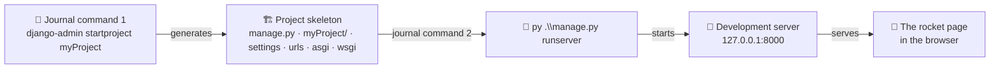
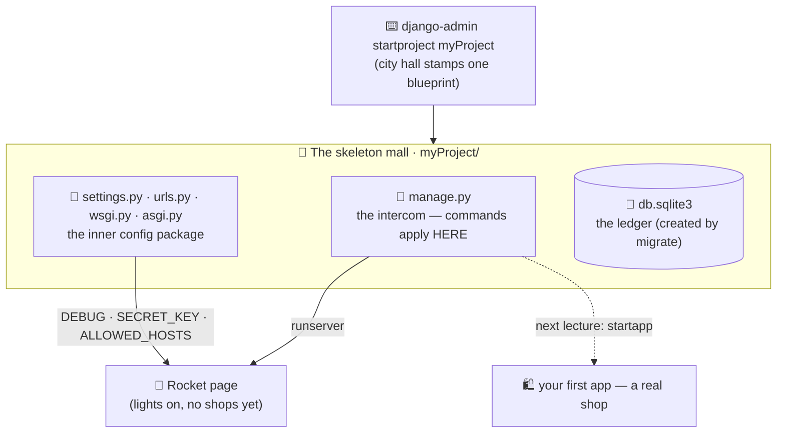

# 🚀 A004 — Create Django Project

`📖 Lecture A004` · `🎓 Track: Core Django` · `📶 Level: Beginner` · `✅ Status: Documented`

> [!NOTE]
> **About this chapter's sources:** the primary source is the owner's command journal
> `commands.txt` (repo root), lines 11 and 13 — `django-admin startproject myProject`
> and `py .\manage.py runserver` — quoted verbatim in §📜. The second source is the
> **artifact the journal produced**: the real generated project sitting next to this
> README in `A004_Create_Django_Project/myProject/`, quoted file-by-file in §🏗️–§🔄.
> Mechanics beyond the journal and the artifact (HTTP round trip details, auto-reload,
> the migrations warning) come from the official Django docs and are marked 📌.

---

## 🧭 What You Will Learn

- [ ] Run `django-admin startproject` and explain **what it physically creates** — file by file.
- [ ] Distinguish the **two `myProject` folders** (working directory vs configuration package) — the #1 confusion of this lecture.
- [ ] Explain the role of every generated file: `manage.py`, `__init__.py`, `settings.py`, `urls.py`, `asgi.py`, `wsgi.py`.
- [ ] Read the generated `settings.py` without fear — `DEBUG`, `SECRET_KEY`, `INSTALLED_APPS`, `ROOT_URLCONF`, `DATABASES`.
- [ ] Start the development server with `py .\manage.py runserver` and explain what "server" means *here* — and what it does **not** mean.
- [ ] Connect A001's mental models (mall, pipeline) to the real folders they describe.

## 🎯 Why This Lecture Matters

Three lectures of preparation converge here. **A001** gave you the mental model —
project = mall, app = shop, request → routing → view → response. **A002** showed you
real Django files doing that work — but those files belonged to the finished chai
project; you never saw them *born*. **A003** built and opened the room and put Django
on its shelf. Now, with two commands from the journal, Django builds the skeleton of a
website in front of you — and then *runs* it.

This is the first lecture where Django **does something visible**. It is also where the
abstract vocabulary becomes concrete: `settings.py` stops being a term and becomes a
file you can open. Everything later — apps, models, views, templates — is built *into
the structure this lecture creates*. If you skip understanding what `startproject`
generated, every future error will feel mystical; if you understand it, every future
error has an address.

## ✅ Prerequisites

- [ ] **A003's environment** — an activated virtual environment with Django installed
      (the journal chain: create → activate → install → verify). The `myProject`
      artifact was generated from such an environment.
- [ ] **A001 concepts** — project vs app, request/response pipeline, MTV vocabulary.
- [ ] **A002 concepts** — which files models/views/templates live in (so you recognize
      what `startproject` does and does *not* generate).
- [ ] Basic terminal use — running commands from a specific directory. 📌 Optional:
      what a TCP port is; the chapter explains `127.0.0.1:8000` inline.

> 🧠 **Recap from A003 (the bridge you're standing on):** the room exists and Django
> sits on its shelf. A003's closing promise — *"A004 asks Django to build the skeleton
> of a website inside the room"* — is fulfilled by the journal's next two lines. One
> builds; one opens the doors.


---

## 📜 The Journal — Two New Commands

The journal (`commands.txt`) grew by exactly two commands for this lecture. Here they
are, verbatim and in order:

```text
# commands.txt — lines 11–13 (verbatim)
django-admin startproject myProject

py .\manage.py runserver
```

Two commands, two entirely different jobs: **build the skeleton**, then **run it**.
Anatomy of each:

| Piece | Meaning | Why it looks like that |
|---|---|---|
| `django-admin` | Django's **global** command-line tool, installed *with Django itself* in the active room (A003) | It exists wherever Django is installed — it is not project-specific yet, because the project doesn't exist until this very command runs |
| `startproject` | The **sub-command**: "generate a project skeleton" | `django-admin` alone does nothing; you must ask it for an action |
| `myProject` | The **argument**: the name for the new project | It becomes a real folder name *and* the inner configuration package's name (see §🏗️ — names matter) |
| `py` | The **Windows Python launcher** — a stable way to invoke Python on Windows | The journal runs on Windows; on other systems you'd typically write `python .\manage.py runserver` |
| `.\manage.py` | A **path**, not a global tool: "the manage.py file in *this* directory" | This is the moment the project-specific tool takes over from the global one (§🧠 explains the difference) |
| `runserver` | The **sub-command**: "start Django's development server" | `manage.py` dispatches sub-commands exactly like `django-admin`, but *from inside a project* |

> 💡 **The tool handover — django-admin vs manage.py.** Before a project exists, only
> the *global* tool can act: `django-admin startproject …`. The moment the project
> exists, you switch to *its* tool: `python manage.py <command>`. `manage.py` does the
> same jobs as `django-admin` **plus** one thing silently: it ties every command to
> *this* project's settings (you'll see the exact line inside `manage.py`, later in
> this tour).

Where were these commands run? The journal's relative path `.\manage.py` proves the
terminal was **inside** the newly created `myProject/` folder for the second command —
`manage.py` is not on your PATH; you point at it. Running it from the wrong directory
is this lecture's classic error (§❌).

### The big picture in one diagram

*What to see in the diagram: two commands, three results — a folder structure, a
running server, and a page in the browser. Everything between is what Django did for
you.*



The next sections walk the middle: first what command 1 *built* (§🏗️), then what the
built files *contain* (§🧠), then what command 2 *started* (§🔄).


---

## 🏗️ What `startproject` Built — The Artifact Tour

The best part of this lecture: the source material isn't a description — it's the
**real generated project** sitting in this very folder. Here it is, exactly as it
exists on disk:

```text
A004_Create_Django_Project/
└── myProject/                  ← the project root — this is what startproject created
    ├── manage.py               ← the project's personal command-line tool
    ├── db.sqlite3              ← the SQLite database file (NOT created by startproject — see below)
    └── myProject/              ← the configuration package — yes, the SAME name again
        ├── __init__.py         ← marks this folder as a Python package
        ├── settings.py         ← the project's control panel
        ├── urls.py             ← the root URL dispatcher (A001's front desk)
        ├── asgi.py             ← async server entry point (deployment: later lectures)
        └── wsgi.py             ← sync server entry point (deployment: later lectures)
```

*What to notice: `myProject` appears **twice** — once as the outer folder `startproject`
made, and once as the inner Python package inside it. This is the #1 confusion of the
lecture, so let's resolve it before anything else.*

### The two `myProject` folders

| | 📁 Outer `myProject/` | 📦 Inner `myProject/` |
|---|---|---|
| What it is | The **project root** — a working directory Django made for you | A **Python package** (has `__init__.py`) holding configuration |
| Contains | `manage.py` + the inner package | `settings.py`, `urls.py`, `asgi.py`, `wsgi.py` |
| Rename it? | ✅ Freely — it's just a folder; nothing imports it | ⚠️ Not casually — code references it *by name* (you'll see `DJANGO_SETTINGS_MODULE = 'myProject.settings'` inside `manage.py` in §🧠) |
| A001's mall model | 🏬 The mall grounds | 🏢 The management office — the "brain" the whole mall consults |

**Why the same name?** `startproject` uses your argument for both — convenience, not
necessity. Many real-world projects keep the outer folder generic (`config/`, `src/`,
the repo name) and the inner package carries the project name. The names doing
different jobs is what matters; that they collide here is just Django's default.

### Every file, one line each

| File | Role | Connects to |
|---|---|---|
| `manage.py` | The project's CLI tool — runs every management command *tied to this project's settings* | dissected line by line later in this tour |
| `__init__.py` | An empty file that turns the inner folder into an importable Python package | Python packaging, not Django logic |
| `settings.py` | Every project-wide decision: security, apps, database, templates | A001's "management office" |
| `urls.py` | The **root** URL dispatcher — where every request's address is first matched | A001's reception desk; A002's routing |
| `asgi.py` / `wsgi.py` | Handshakes between a real web server and your app — **do nothing yet** | A001's "server passes the request to Django"; deployment is a later lecture |

### What `startproject` deliberately did NOT build

Equally important — compare with A002's file list:

- ❌ **No app** — no `models.py`, `views.py`, or templates. `startproject` builds the
  mall; **shops come from `startapp`** (the next lecture's subject).
- ❌ **No virtual environment** — the room was A003's job; it lives outside the project.
- ❌ **No git repository** — version control is your decision, not Django's.

> 🧠 **Remember this:** `startproject` generates a **container with a control panel** —
> not a website. Nothing yet answers a single real URL except one built-in route
> (`/admin/`), and no data exists. The skeleton is ready for *your* apps.

### Two detective details in the artifact

1. **`db.sqlite3` was not born with the skeleton.** `startproject` never creates a
   database file. Its presence proves the database was initialized at some point after
   generation — the journal records only `runserver`, and Django's fresh-project
   startup flow (the migration warning it prints, 📌 official docs) leads there. The
   file sitting next to `manage.py` matches `settings.py`'s own pointer: you'll see
   `NAME: BASE_DIR / 'db.sqlite3'` in §🧠.
2. **`__pycache__/` in the inner package.** Python compiles imported modules to
   bytecode caches the first time they run — its existence is physical evidence that
   the generated code was *executed*, i.e. the server really ran. It's also exactly
   what this repo's `.gitignore` excludes, which is why git sees only the source files.
   🧠 *The one-liner worth keeping: `db.sqlite3` is **your data**, `__pycache__/` is
   **Python's scratch paper** — neither belongs in version control.*

### If the doubled name annoys you — rename the inner package
### If the doubled name annoys you — rename the inner package

`startproject` names both folders after your argument by default, but the
configuration package can be named separately:

```text
django-admin startproject myProject config_core
```

The outer folder stays `myProject/`; the importable package becomes `config_core/`,
and every reference follows the *package* name — for example,
`DJANGO_SETTINGS_MODULE = 'config_core.settings'`. Most tutorials keep the default,
so when one says "open your project folder", it means the **outer** one, where
`manage.py` lives.


### `manage.py` — the intercom, up close

This is the file you will run a thousand times and never edit. Read it once, slowly —
it's 22 lines and it ties A001 and A003 together:

```python
#!/usr/bin/env python
"""Django's command-line utility for administrative tasks."""
import os
import sys


def main():
    """Run administrative tasks."""
    os.environ.setdefault('DJANGO_SETTINGS_MODULE', 'myProject.settings')
    try:
        from django.core.management import execute_from_command_line
    except ImportError as exc:
        raise ImportError(
            "Couldn't import Django. Are you sure it's installed and "
            "available on your PYTHONPATH environment variable? Did you "
            "forget to activate a virtual environment?"
        ) from exc
    execute_from_command_line(sys.argv)


if __name__ == '__main__':
    main()
```

*(Quoted verbatim from `A004_Create_Django_Project/myProject/manage.py`.)*

Line by line, what it actually does:

| Line(s) | What it does | Why it matters to you |
|---|---|---|
| `#!/usr/bin/env python` | Shebang — a Unix hint meaning "run me with Python" | Harmless on Windows; enables `./manage.py` on macOS/Linux |
| `os.environ.setdefault('DJANGO_SETTINGS_MODULE', 'myProject.settings')` | Pre-wires the project's settings into the environment — *this* is what makes `manage.py` project-aware | The single line that separates `manage.py` from `django-admin` (table below) |
| `try: from django.core.management import …` | Tries to import Django's command engine | If Django isn't installed *in the currently active environment*, this import fails |
| `except ImportError … "Did you forget to activate a virtual environment?"` | Turns that failure into the friendliest error in the Python world | 🧠 **A003's lesson, live:** if you ever see this message, your venv isn't active (no `(myenv)` prefix at the prompt). The error literally tells you the fix |
| `execute_from_command_line(sys.argv)` | Hands over whatever you typed (`runserver`, `migrate`, …) to Django's engine | Every `manage.py` command you will ever run funnels through this one call |
| `if __name__ == '__main__':` | Runs only when executed directly, never on import | Standard Python you already know |

> 🧠 **Remember this:** `manage.py` is a translator standing between you and Django's
> engine. It attaches the project's settings to every command — so Django knows *which
> mall* you're talking about — and it produces that famous friendly error when the room
> you're standing in has no Django installed.

### The journal used two different tools — `django-admin` vs `manage.py`

Look again at the journal: line 11 ran `django-admin startproject myProject`; line 13
ran `py .\manage.py runserver`. Not an inconsistency — two tools for two moments:

| | `django-admin` | `manage.py` |
|---|---|---|
| What it is | Django's **global** command tool (ships with Django itself) | Your project's **local** command file (generated into every project) |
| Knows your project? | ❌ No project context, no settings | ✅ Yes — `DJANGO_SETTINGS_MODULE` pre-wired (see `manage.py` above) |
| When the journal used it | **Before** the project existed — there was nothing to be project-*aware* of | **After** — serving the site requires the project's settings |
| Typical jobs | `startproject`, `startapp` (project-less work) | **Everything else:** `runserver`, `migrate`, `createsuperuser`, `test`, `shell`… |

> 💡 **Rule of thumb:** *create* things with `django-admin`; *do* things with
> `manage.py`. (In practice `manage.py` can also run `startapp` — the habit matters
> more than the boundary.)


### `settings.py` — the constitution

If `manage.py` is the intercom, `settings.py` is the **constitution**: every
project-wide decision in one file — which apps exist, how the database is reached,
where templates live, which security middleware guards the doors. You will edit this
file constantly, and you'll understand it *by need* — so let's read the parts that
matter on day one.

The file opens by announcing its own provenance:

```python
"""
Django settings for myProject project.

Generated by 'django-admin startproject' using Django 6.1.1.

For more information on this file, see
https://docs.djangoproject.com/en/6.1/topics/settings/

For the full list of settings and their values, see
https://docs.djangoproject.com/en/6.1/ref/settings/
"""
```

*(Quoted verbatim from `myProject/myProject/settings.py`, lines 1–11.)*

> [!WARNING]
> ⚠️ **Discrepancy note — and a live lesson.** A003's journal recorded
> `django-admin --version` as **5.2.7**; this artifact's own docstring says it was
> generated with **6.1.1**. Both quotes are preserved verbatim, and both are true *in
> their own context*: a version command reports the Django installed **in whichever
> environment was active at that moment**. The project was evidently created in a room
> where Django 6.1.1 was installed — a different room than the A003 journal moment.
> This is A003's "one machine, many rooms" lesson manifesting inside this very repo:
> **never trust memory for versions — run `django-admin --version` in the environment
> you're actually using.** (A003's chapter stays as written: it reports its primary
> source faithfully.)

Next, the **security trio** — the three settings every beginner should be able to find
blindfolded:

```python
# SECURITY WARNING: keep the secret key used in production secret!
SECRET_KEY = 'django-insecure-pmsd^1aeq942m^p7y%*55h(z7gmpw+66mn-)bdj-1z*0l(qsia'

# SECURITY WARNING: don't run with debug turned on in production!
DEBUG = True

ALLOWED_HOSTS = []
```

*(Verbatim, `settings.py` lines 22–28. Note Django's own comments — the generator
warns you before you even know what these do.)*

- **`SECRET_KEY`** — the project's cryptographic anchor: Django signs sessions, CSRF
  tokens and password-reset links with it. See the `django-insecure-` prefix? Django
  itself is telling you this is a development-only key. 📌 *Supplementary: in a real
  deployment this value never lives in the code or git.*
- **`DEBUG = True`** — developer mode: friendly yellow error pages when things break.
  A001's warning — *never in production* — is configured here.
- **`ALLOWED_HOSTS = []`** — which domain names may serve this site. Empty + `DEBUG =
  True` means Django quietly allows only localhost — perfect for the dev server on
  `127.0.0.1`.


### The settings that wire the project together

Before the tour continues, one liberating fact: **`settings.py` is just a Python
module** — a file of ALL-CAPS variables evaluated top to bottom at startup. No magic
syntax, no framework language. That's why you can read it. Next stop: `BASE_DIR`,
which sits just above the security trio:

```python
from pathlib import Path

# Build paths inside the project like this: BASE_DIR / 'subdir'.
BASE_DIR = Path(__file__).resolve().parent.parent
```

*(Verbatim, `settings.py` lines 13–16.)*

**Explanation:** one variable answers *"where am I?"* — it resolves from this file's
location up two levels, landing on the folder that contains `manage.py`. Every other
path in the file (the database, later your templates and static files) is built
*from* `BASE_DIR`, which is why the project can move between machines and folders
without editing a single path. One anchor, everything relative — DRY, again.

### `INSTALLED_APPS` — the mall's opening shops

> 🧠 **Remember this from A001:** *"Django itself ships as apps."* Here is the proof,
> sitting in your own project — six built-in apps, switched on before you wrote a line:

```python
INSTALLED_APPS = [
    'django.contrib.admin',
    'django.contrib.auth',
    'django.contrib.contenttypes',
    'django.contrib.sessions',
    'django.contrib.messages',
    'django.contrib.staticfiles',
]
```

*(Verbatim, `settings.py` lines 33–40.)*

| Installed app | What it opens in your mall |
|---|---|
| `admin` | A001's back office — the `/admin/` UI |
| `auth` | Users, groups, permissions (A001's security desk) |
| `contenttypes` | Bookkeeping that lets apps reference each other's models |
| `sessions` | The "remember me between requests" machinery |
| `messages` | One-time flash notifications ("Saved!") |
| `staticfiles` | Serving CSS/JS/images during development |

This list is also your first editing target: when you create your *own* app (next
lecture), it must be added here — A001's "shops that don't open serve no customers"
warning, now with a line number attached.

### `MIDDLEWARE` — the seven guards, in order

```python
MIDDLEWARE = [
    'django.middleware.security.SecurityMiddleware',
    'django.contrib.sessions.middleware.SessionMiddleware',
    'django.middleware.common.CommonMiddleware',
    'django.middleware.csrf.CsrfViewMiddleware',
    'django.contrib.auth.middleware.AuthenticationMiddleware',
    'django.contrib.messages.middleware.MessageMiddleware',
    'django.middleware.clickjacking.XFrameOptionsMiddleware',
]
```

*(Verbatim, `settings.py` lines 42–50.)*

A001's "manager checking every order" is not a metaphor here — it is a literal,
ordered list. Requests pass through these layers on the way in and again on the way
out (the §🔄 onion from A001). Notice the order: security checks first, sessions
before authentication (auth *needs* sessions), clickjacking protection last. 📌 The
order is functional, not decorative — a deep dive comes in a later lecture.

### The wiring trio: `ROOT_URLCONF`, `TEMPLATES`, `WSGI_APPLICATION`

Three short settings connect the constitution to A001's pipeline:

- **`ROOT_URLCONF = 'myProject.urls'`** *(line 52)* — *"the front desk is that file."*
  This is how Django knows which `urls.py` is the root dispatcher.
- **`TEMPLATES`** *(lines 54–67)* — with `'APP_DIRS': True`, meaning: *look for a
  `templates/` folder inside each installed app.* That is exactly how the chai app's
  templates are found in `ChaiAurCode` — the mechanism you met in A002, now visible in
  its configuration.
- **`WSGI_APPLICATION = 'myProject.wsgi.application'`** *(line 69)* — *"the loading
  dock door production servers will knock on"* — the file you'll meet in §🔄.

### `DATABASES` — where the data will live

```python
DATABASES = {
    'default': {
        'ENGINE': 'django.db.backends.sqlite3',
        'NAME': BASE_DIR / 'db.sqlite3',
    }
}
```

*(Verbatim, `settings.py` lines 75–80.)*

**Explanation:** remember the `db.sqlite3` file that appeared next to `manage.py`?
Its *address* is written right here: a SQLite file inside `BASE_DIR`. Two things to
bank: (1) SQLite is Django's development default — zero configuration, a single file;
(2) swapping to PostgreSQL or MySQL later is mostly a change to `'ENGINE'` and
credentials — A001's "database portability" claim, now visible as a setting.

### The rest at a glance

| Setting block | Job in one line |
|---|---|
| `AUTH_PASSWORD_VALIDATORS` (lines 86–99) | Bouncer rules for new passwords (length, similarity, common-ness, not-all-digits) |
| `LANGUAGE_CODE`, `TIME_ZONE`, `USE_I18N`, `USE_TZ` (lines 105–111) | A001's i18n feature, configured: language, clock, translations on, timezone-aware datetimes on |
| `STATIC_URL = 'static/'` (line 117) | The URL prefix under which CSS/JS/images are served (the `theme` app in `ChaiAurCode` rides on this) |
| `MAILERS` (lines 123–127) | 📌 Email via the **console backend**: during development, "sent" emails print to the terminal instead of really sending. (The classic generated template shows this idea as a commented-out `EMAIL_BACKEND` line — the exact shape can vary between Django versions/setups; the *meaning* is what matters here.) |

---

## 🔄 What Command 2 Started — `runserver` and the Rocket Page

The journal's second command — `py .\manage.py runserver` — is where the skeleton
becomes a *living* website. Here is what actually happens in the seconds after Enter.

### The boot sequence (typical console output)

```text
Watching for file changes with StatReloader
Performing system checks...

System check identified no issues (0 silenced).

Django version 6.1.1, using settings 'myProject.settings'
Starting development server at http://127.0.0.1:8000/
Quit the server with CTRL-BREAK.
```

**Explanation, line by line:** Django announces an **auto-reloader** (it watches your
files and restarts itself when you edit code — the reason you never restart manually
while developing), runs a quick **system check** for common misconfigurations, prints
*which settings module* it loaded (the constitution from §🧠 — note how everything
traces back to it), and finally claims the address **`127.0.0.1:8000`** — `127.0.0.1`
means *"this same computer, talking to itself"* (localhost), and `8000` is the default
port. `CTRL-BREAK` (Windows) stops the server.

### The rocket page 🚀

Visit `http://127.0.0.1:8000/` and you get Django's famous success page — **"The
install worked successfully! Congratulations!"** with a small rocket. Two things worth
knowing that the page doesn't announce:

- You did not create it. There is no HTML file in `myProject/` — the page is generated
  by Django itself when **no URL pattern matches** and `DEBUG` is `True`. It is Django
  saying *"I am alive; you just haven't taught me any pages yet."*
- The rocket is a **debug-mode indicator**. Set `DEBUG = False` (as production must)
  and the rocket disappears, replaced by a plain "Not Found" — the party page exists
  only for developers.

### The migration warning — your first homework from Django

The very first `runserver` in a fresh project also prints a yellow warning:

```text
You have 18 unapplied migration(s). Your project may not work properly until you
apply the migrations for app(s): admin, auth, contenttypes, sessions.
Run 'python manage.py migrate' to apply them.
```

**Why-before-how:** the settings you toured in §🧠 open six built-in shops
(`INSTALLED_APPS` — `admin`, `auth`, `contenttypes`, `sessions`, `messages`,
`staticfiles`). Those apps *store data* (users, sessions, admin logs…), which means
they need **database tables** — and those tables do not exist yet. **Migrations** are
Django's change-sets for database structure (A001's glossary: *"renovation permits"*),
and `migrate` is the command that applies them. Until then, parts of Django (the admin
login, sessions) will fail. The warning is not an error — the rocket still flies — it
is Django telling you the *next* step on the path.

> 💡 **A detective note from the artifact itself.** The journal never records
> `migrate` — but the `myProject/` folder contains a **`db.sqlite3`** file, and
> `runserver` does not create that file; `migrate` does. So the folder's contents prove
> a `migrate` was actually run (or the warning's advice was followed later). This is
> exactly the kind of *evidence-vs-journal* reasoning real debugging uses: **when the
> log and the files disagree, the files usually remember more.**

> [!WARNING]
> **`runserver` is a development server — say it again.** It is single-threaded,
> unhardened, and meant for your laptop. Django's own docs forbid it in production.
> A001's boundary holds: *dev = `runserver`; production = Gunicorn/uWSGI + a real web
> server.* Nothing in A004 changes that.

---

## 🧱 Important A004 Vocabulary

New words this lecture added to your Django vocabulary (registered in
[`docs/MEMORY.md`](../docs/MEMORY.md)). Terms already defined in A001
(*middleware*, *migrations*, *WSGI/ASGI*) are cross-referenced, not re-defined.

| Term | Simple meaning | Technical meaning | 🧷 Memory hook |
|---|---|---|---|
| **`startproject`** | The scaffold command | `django-admin` tool that generates project config: `manage.py` + inner settings package | The mall stamped from one blueprint |
| **`settings.py`** | The project's control panel | Global configuration module: apps, middleware, database, security | The constitution |
| **`DEBUG`** | "Show me everything" switch | When `True`, Django serves detailed error pages and the rocket page; must be `False` in production | House lights: cozy at home, blackout curtains on stage |
| **`SECRET_KEY`** | Django's master password | Cryptographic seed for sessions, CSRF tokens, password resets — never publish or commit | The ring that rekeys every lock |
| **`ALLOWED_HOSTS`** | Your doors' guest list | Hostnames Django will serve for; empty + `DEBUG` = localhost only | The bouncer's list |
| **`INSTALLED_APPS`** | The list of open shops | Python-path registry of apps whose models, templates and signals activate | The mall's shop directory |
| **Rocket page 🚀** | "It works!" placeholder | The view Django serves when `DEBUG=True`, `ROOT_URLCONF` has no real routes and no `urls.py` edits yet | The flag on an empty building |
| **`db.sqlite3`** | The project's notebook | SQLite database file auto-created by `migrate`; Django's default zero-config database | The storeroom ledger, physical form |
| **`django-admin` vs `manage.py`** | Global tool vs per-project tool | Same commands; `manage.py` reads *this* project's settings, `django-admin` needs `DJANGO_SETTINGS_MODULE` | City hall vs the mall's own intercom |
| **`wsgi.py` / `asgi.py`** | The kitchen doors | Entry-point callables production servers import (sync / async+sync) — see A001 glossary | The kitchen door standard |
| **`MIDDLEWARE`** | The seven guards, in order | Ordered hook layers every request/response passes — see A001 | Airport security lanes |
| **Migrations** | Renovation permits | Schema change-sets applied to the DB with `migrate` — see A001; the warning at first `runserver` is your first permit request | Renovation permits |

---

## ❌ Common Beginner Mistakes

Each mistake: what it is → why it happens → how to fix it.

1. ❌ **Running `manage.py` from the wrong folder.**
   *Why:* the command is a *path* (`.\\manage.py`), not a global tool — the terminal
   must be inside `myProject/`.
   *Fix:* `cd` into the folder that *contains* `manage.py`; if you see
   *"can't open file 'manage.py'"*, you're in the wrong directory.

2. ❌ **Using `django-admin` after the project exists.**
   *Why:* both tools share the same sub-commands, so it *seems* to work.
   *Fix:* the global tool doesn't know your project's settings; inside a project,
   always `python manage.py <command>` (the §📜 handover rule).

3. ❌ **Deactivating the virtual environment and running anyway.**
   *Why:* the prompt gives no loud warning — but `manage.py` *itself* refuses politely:
   it checks whether Django is importable and, if not, prints
   *"Did you forget to activate a virtual environment?"* — A003's lesson living inside
   the artifact.
   *Fix:* activate first (`myenv\\Scripts\\activate`), then run.

4. ❌ **Renaming the inner `myProject` folder with File Explorer.**
   *Why:* it looks like a normal folder rename.
   *Fix:* that folder *is* the settings package — `settings.py` references it by name
   (`mysite.settings`-style strings in `manage.py`, `wsgi.py`, `asgi.py`). Rename it via
   a find-and-replace across those references (or don't rename at all).

5. ❌ **Treating the rocket page as "my website".**
   *Why:* it looks like an accomplishment — it is one! — but it's Django's placeholder.
   *Fix:* your website begins when *you* add views and URLs (that's `startapp`
   territory — the natural next lecture).

6. ❌ **Committing `db.sqlite3` / fighting the warning by editing `settings.py` blindly.**
   *Why:* the file is auto-generated data, and the migration warning invites panic.
   *Fix:* this repo's `.gitignore` already excludes `db.sqlite3` (databases are
   environment-specific, not source code), and the warning is answered by one command:
   `python manage.py migrate`.

---

## 🧠 Common Misconceptions

| ✅ `startproject` DOES … | ❌ It does NOT … |
|---|---|
| generate a **project skeleton**: `manage.py` + the inner config package | create any **app** of yours (`startapp` does that — no app exists yet) |
| produce a runnable website (the rocket proves it) | produce a website with **your content** — it has zero pages of yours |
| wire the **config**: settings, root URLs, WSGI/ASGI entry points | start a server (that's `runserver`) or create the database (that's `migrate`) |
| work offline after Django is installed | work without **Python + a virtual environment** (A003's foundation) |
| create `db.sqlite3` | — actually, it does **not**; `migrate` makes the database file |

Three misconceptions deserve extra words:

1. **"The skeleton is just scaffolding I'll delete."** — Inverted. Every file has a
   runtime job: `manage.py` is your daily tool, `settings.py` is read on *every* start,
   `wsgi.py`/`asgi.py` are what production servers actually import. You rarely edit
   them — you never throw them away.
2. **"`django-admin` and `manage.py` are interchangeable."** — After `startproject`,
   they are not: only `manage.py` binds commands to *your* project's settings. The
   journal itself demonstrates the handover.
3. **"`settings.py` is configuration I shouldn't touch."** — Half-wrong. It's
   configuration you should *understand first* — A004's tour exists so that editing
   `INSTALLED_APPS` or `DEBUG` later is a deliberate act, not a gamble.

---

## 🎯 Interview Perspective

**Q1 · What does `django-admin startproject` actually create?** *(beginner)*

> **Strong answer:** "A project skeleton: `manage.py` — the project-specific command
> tool — plus an inner package holding `settings.py`, the root `urls.py`, and the
> `wsgi.py`/`asgi.py` server entry points. It's a runnable but empty website; apps
> come later via `startapp`."
>
> **Why it works:** enumerates the artifact *and* states the empty-but-runnable nuance.

**Q2 · What's the difference between `django-admin` and `manage.py`?** *(conceptual)*

> **Strong answer:** "`django-admin` is Django's global tool — it exists wherever
> Django is installed and is used for project creation. `manage.py` is per-project: it
> wraps `django-admin` and points it at that project's settings module via
> `DJANGO_SETTINGS_MODULE`. After `startproject`, you use `manage.py` for everything."
>
> **Why it works:** names the actual mechanism (the settings-module binding) rather
> than "one is local".

**Q3 · Why is `runserver` not for production?** *(practical)*

> **Strong answer:** "It's a lightweight development server — fine for laptops, but
> single-threaded, unhardened, and explicitly discouraged by Django's docs for
> production. Production uses a WSGI/ASGI server like Gunicorn or uWSGI behind a real
> web server, with `DEBUG=False` and proper `ALLOWED_HOSTS`."
>
> **Why it works:** states the limitation, the docs' position, *and* the production
> replacement.

**Q4 · What are `wsgi.py` and `asgi.py`?** *(conceptual)*

> **Strong answer:** "Server entry points. WSGI is the classic synchronous standard —
> it exposes a single `application` callable that production servers import; ASGI is
> its async-capable successor for WebSockets and async views. You rarely edit them;
> you point servers *at* them."
>
> **Why it works:** distinguishes the two standards and their role without diving into
> server internals — right depth for A004.

**Q5 · What does `DEBUG = True` mean, and why must it be `False` in production?**
*(why)*

> **Strong answer:** "Debug mode shows detailed error pages and enables the rocket
> placeholder page. In production it must be off because those pages leak source code,
> settings and stack traces to attackers — and `ALLOWED_HOSTS` matters then too,
> since debug mode effectively trusts localhost traffic."
>
> **Why it works:** connects a setting to a *security consequence* — the "why" layer.


---

## 🔁 Active Recall

Close the chapter and answer from memory first — the struggle *is* the learning.

**1. Name every file and folder `startproject myProject` created — and which of the two same-named folders does what.**

<details><summary>Answer</summary>

Outer `myProject/` = the container holding everything (`manage.py` + inner folder +
`db.sqlite3` after migrate). Inner `myProject/myProject/` = the **config package**:
`__init__.py`, `settings.py`, `urls.py`, `asgi.py`, `wsgi.py`. The outer folder is
*where you work*; the inner one *configures* the project. The outer name is yours to
rename; the inner one is referenced by settings (`WSGI_APPLICATION`,
`ROOT_URLCONF`) — renaming it means updating those.
</details>

**2. `django-admin` vs `manage.py` — what's the difference and why did the journal use both?**

<details><summary>Answer</summary>

Same commands, different scope: `django-admin` is the **global** tool (no project
needed — that's why `startproject` uses it: no project exists yet). `manage.py` is
generated **per project** and always applies commands to *its* project's settings —
that's why everything after creation (`runserver`, `migrate`) runs through
`py .\manage.py …`. City hall vs the mall's own intercom.
</details>

**3. What three jobs does `manage.py` do?**

<details><summary>Answer</summary>

(1) Puts your project's settings on `django.core.management`'s path so commands apply
to this project; (2) dispatches subcommands (`runserver`, `migrate`, `startapp`…);
(3) guards you with the *"Did you forget to activate a virtual environment?"* hint
when imports fail — A003's lesson embedded in the tool itself.
</details>

**4. Why is `settings.py` called "the constitution"? Give three specific settings that justify the name.**

<details><summary>Answer</summary>

It's the single module every request's behavior is filtered through. Any three of:
`DEBUG` (how much the world sees when things break), `SECRET_KEY` (the crypto seed
for sessions/CSRF), `ALLOWED_HOSTS` (which hostnames get served),
`INSTALLED_APPS` (which shops are open), `MIDDLEWARE` (the guard order),
`DATABASES` (where data lives), `ROOT_URLCONF`/`TEMPLATES`/`WSGI_APPLICATION`
(the wiring trio).
</details>

**5. Why exactly does the rocket page appear — and name two things that make it disappear.**

<details><summary>Answer</summary>

It appears because `DEBUG=True` and the root `urls.py` has no real routes yet — it's
Django's "your project exists" placeholder. It disappears when you add real URL
patterns (A005's work) or set `DEBUG=False` (then an empty root shows a 400/404
instead).
</details>

**6. The first `runserver` prints an unapplied-migrations warning. What is it actually telling you, and why does `db.sqlite3` exist anyway in the artifact?**

<details><summary>Answer</summary>

That admin/auth/contenttypes migrations exist but haven't been applied — run
`migrate` to build their tables. The artifact's `db.sqlite3` proves a `migrate` *was*
run at some point (`runserver` never creates it) — evidence-vs-journal: the files
remember more than the log.
</details>

**7. What does `wsgi.py` contain and who consumes it?**

<details><summary>Answer</summary>

A single `application` callable built from `WSGI_APPLICATION`'s path (via
`get_wsgi_application()`). Production servers (Gunicorn, uWSGI) *import* it — you
rarely edit it. It's the kitchen door A001's analogy pointed at, now seen in your own
project.
</details>

**8. Why is `DEBUG = True` + `ALLOWED_HOSTS = []` fine on your laptop but dangerous on a real server?**

<details><summary>Answer</summary>

With `DEBUG=True`, error pages leak source, settings and stack traces, and empty
`ALLOWED_HOSTS` still trusts localhost-style traffic. On a laptop only you are the
traffic; on a public server, attackers would read your secrets — hence the deploy
checklist flips `DEBUG=False` and names real hosts.
</details>


---

## 📝 Quick Revision — A004 in Five Minutes

**The two new commands:** `django-admin startproject myProject` (scaffold a project)
→ `py .\manage.py runserver` (boot it — *from the outer folder*).

**What `startproject` built:** outer `myProject/` (container) · inner `myProject/`
(config package: `settings.py`, `urls.py`, `asgi.py`, `wsgi.py`, `__init__.py`) ·
`manage.py` (the intercom). **Not built:** any app, any page of yours, any data.

**The five files in one breath:** `manage.py` runs commands *here* · `settings.py`
is the constitution · `urls.py` is the front desk (one admin route) · `wsgi.py`/
`asgi.py` are the kitchen doors · `__init__.py` says "this folder is Python".

**Key settings:** `DEBUG` (lights on = detailed errors + rocket page) · `SECRET_KEY`
(master password — never commit) · `ALLOWED_HOSTS` (the guest list) ·
`INSTALLED_APPS` (open shops) · `MIDDLEWARE` (guards, in order) · `DATABASES`
(SQLite notebook).

**The rocket page 🚀** = "project exists, `DEBUG=True`, no real routes yet". The
migration warning = "your first renovation permits are pending — run `migrate`".

**The version story:** journal's 5.2.7 check vs this artifact's 6.1.1 docstring —
different rooms, different versions; the *room* decides (A003's lesson, proven).

**Boundaries:** `startproject` ≠ app (that's `startapp`) · `runserver` ≠ production ·
outer folder name is yours; inner package name is load-bearing.

---

## 🧠 Memory Palace — One Command, A Skeleton Mall

The whole chapter in one picture. Every A004 idea hangs on the mall you already know:



**Five anchors to walk the palace:**

1. **The stamp** — one command (`startproject`) stamps the whole blueprint; you never
   build the mall by hand.
2. **The intercom** — `manage.py` lives in the *outer* folder; you stand there to use it.
3. **The constitution** — every guard (middleware), shop (app) and door (host) is
   registered in `settings.py`, not invented by magic.
4. **The rocket** — a lit, empty building: proof of life, promise of shops.
5. **The second ledger** — `db.sqlite3` exists only because `migrate` ran; files
   remember what logs forget.


---

## ❓ FAQ

**Q. Why does the project name repeat — `myProject/myProject/`? Isn't that a bug?**
No — it's deliberate. The *outer* folder is your workspace; the *inner* package is
the settings module Python must import (its name appears in `settings.py`'s own
`WSGI_APPLICATION = 'myProject.wsgi.application'` and `ROOT_URLCONF`). Django
defaults to same-name nesting so the import path matches the folder you made. It only
*looks* redundant.

**Q. Can I rename the outer folder?**
Yes, freely — nothing imports it. Rename the *inner* package and you must update
`ROOT_URLCONF`, `WSGI_APPLICATION`, and any other references. Rule: **outer = yours,
inner = load-bearing.**

**Q. `django-admin startproject` vs `django-admin startproject .`?**
The trailing dot scaffolds *into the current directory* (no outer folder) — a common
alternative layout. The journal used the default nested form, which keeps the project
self-contained. Both are valid; just be consistent.

**Q. Where is my code supposed to go?**
Nowhere yet — that's the honest answer. A004 built *configuration*. Your code
(views, models, templates) will live in **apps** you create with `startapp` (the
next lecture's bridge).

**Q. Is `db.sqlite3` my "real database"?**
It's a *real* database (SQLite — a full SQL engine in one file), just the
**development default**. Production projects swap `DATABASES` to PostgreSQL/MySQL;
A001's "Django talks to databases, doesn't replace them" applies here.

**Q. Why do I have to run `py .\manage.py runserver` from the outer folder?**
Because `manage.py` locates the project by its own position — it computes the
settings path relative to itself. Run it from elsewhere and it can't find
`myProject.settings`.

**Q. Do I need to memorize `settings.py`?**
No — you need a *map*, not a recital: know which neighborhood answers which question
(apps → `INSTALLED_APPS`, security → the trio, data → `DATABASES`). The file tour in
§🏗️ is that map.

**Q. What changed vs the ChaiAurCode project I already have?**
Structure-wise, nothing fundamental — `ChaiAurCode/chaiaurDjango/` is exactly this
pattern at a later stage (more apps registered, real routes, media config). A004 is
where that project was, at minute zero.

---

## 🏁 Learning Checkpoints

You have internalized A004 when you can honestly check all six:

- [ ] I can name every file `startproject` generated and each one's single job.
- [ ] I can explain the two-`myProject` structure and which name is safe to rename.
- [ ] I can state the difference between `django-admin` and `manage.py` — and why the journal needed both.
- [ ] I can point to where `DEBUG`, `SECRET_KEY`, `ALLOWED_HOSTS`, `INSTALLED_APPS` and `DATABASES` live and say what each controls.
- [ ] I can explain why the rocket page appears and what the migration warning is asking of me.
- [ ] I know why `runserver` is development-only — and can say what production uses instead.

---

## 🏋️ Exercises

**Level 1 — Recall** *(answer without opening the chapter)*
1. List the five files in the inner config package and give each a one-line job.
2. What does the rocket page's existence tell you about `DEBUG` and `urls.py`?

**Level 2 — Understanding** *(explain the why)*
3. Why does `django-admin` perform `startproject` while `manage.py` performs
   everything after? Answer in two sentences using the journal as evidence.
4. A teammate asks: "settings.py has no classes or views — is it even code?"
   Write the two-line answer that corrects them without condescension.

**Level 3 — Application** *(do it at the keyboard)*
5. In `A004_Create_Django_Project/`, verify the artifact's health: run
   `py .\manage.py check`, then `py .\manage.py runserver` and confirm the rocket
   page — then run `py .\manage.py migrate` and reload. Record what changed on
   screen and on disk (`db.sqlite3` timestamp).
6. Export the dependency list of the room this project should live in:
   activate a venv, `pip install django`, then `pip freeze > requirements.txt`.
   (This is A003's exercise, made concrete by A004's artifact.)

**Level 4 — Interview reasoning** *(write, then say aloud)*
7. "Walk me through what `django-admin startproject` does and what it deliberately
   does *not* do." — structure the answer as built / not built / why that split.
8. "Your teammate committed `settings.py` with `DEBUG=True` and a real
   `SECRET_KEY` to a public repo." — enumerate every risk and the concrete fix.


---

## 🏁 Final Takeaways

1. **`startproject` builds configuration, not features.** It stamps the mall's office
   (`settings.py`), front desk (`urls.py`), kitchen doors (`wsgi.py`/`asgi.py`) and
   intercom (`manage.py`) — and deliberately stops there.
2. **Two same-named folders, two different jobs.** Outer = your workspace (renamable);
   inner = the settings package (load-bearing — referenced by `ROOT_URLCONF` and
   `WSGI_APPLICATION`).
3. **`django-admin` is city hall; `manage.py` is the mall's intercom.** Same commands,
   different scope — the journal used both *because of* that difference.
4. **`settings.py` is the constitution.** Every request is filtered through it: lights
   (`DEBUG`), master key (`SECRET_KEY`), guest list (`ALLOWED_HOSTS`), open shops
   (`INSTALLED_APPS`), guard order (`MIDDLEWARE`), the ledger (`DATABASES`).
5. **The rocket page is a status light, not a website.** It means: project alive,
   `DEBUG=True`, no real routes yet.
6. **The migration warning is Django teaching you its workflow** — code first, schema
   changes applied deliberately — and `db.sqlite3` on disk is the evidence it was
   heeded.
7. **The version story is A003 proven:** the journal's 5.2.7 check and this artifact's
   6.1.1 docstring can both be true, because *the room decides*.
8. **`runserver` remains dev-only.** A004 gave you a running project, not a production
   deployment.

---

## 🔄 Next Lecture Connection — A005

A004 built a mall with **no shops and one route pointing at the admin**. The next
lecture (*URLs & Views*, your first look at `startapp` and real pages) picks up
exactly at that boundary:

- **`urls.py` gets its second line.** The file that today holds only `admin/` will
  grow real patterns — the receptionist learns new destinations.
- **The rocket page retires.** You saw why it appears; the first real view is what
  makes it disappear.
- **`INSTALLED_APPS` gets its first resident.** `startapp` creates the shop that
  A004's constitution lists but the artifact doesn't contain — closing the
  "built vs not built" gap this chapter kept highlighting.
- **Migrations stop being a warning.** A005's app will bring its first *own* model —
  and the permit workflow from this chapter's warning becomes routine.

**Before A005, make sure:** the artifact boots (`runserver` shows the rocket), you can
recite the two-`myProject` rule, and `py .\manage.py check` passes. Those three are
A004's entire surface area — A005 builds directly on them.

---

## 📚 Sources Used

| Source | Role | Used for |
|---|---|---|
| [`commands.txt`](../commands.txt) — lines 11 & 13 (`django-admin startproject myProject`, `py .\manage.py runserver`) | **Primary — the journal** | Command order, tool choice (`django-admin` vs `py manage.py`), Windows paths |
| `A004_Create_Django_Project/myProject/` — the artifact itself | **Primary — the evidence** | All verbatim file quotes: `manage.py`, `settings.py` (incl. the *Generated using Django 6.1.1* docstring), `urls.py`, `wsgi.py`, `asgi.py`; the `db.sqlite3` detective note |
| Official Django documentation (docs.djangoproject.com — FAQ, settings reference, deployment checklist) | 📌 Supplementary | Precise wording for MTV view/template roles, `runserver` production warning, `DEBUG`/`SECRET_KEY`/`ALLOWED_HOSTS` behavior |
| A001–A003 chapters | Series context | Mall/intercom/kitchen-door mental models, venv lessons, boundaries |

> ⚠️ **Discrepancy note (per AGENTS §12).** The journal records `django-admin
> --version` → **5.2.7** (A003), while the artifact's own `settings.py` docstring
> stamps *"Generated using Django 6.1.1"*. Both claims are quoted faithfully where
> they occur. The reconciliation — different virtual environments hold different
> Django versions — is not speculation: it is the "one machine, many rooms" lesson of
> A003, demonstrated by this artifact. The chapter teaches the discrepancy rather than
> silently picking a side.

---

📚 **Navigation:** [← A003 · Install Python, pip, Django & Virtual Environment Setup](../A003_Install_Python_pip_Django_Virtual_Environment_Setup/README.md) · [Series Hub](../README.md) · A005 · URLs & Views *(next lecture — this link activates when A005 is published)*
