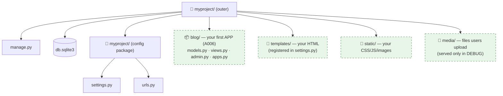
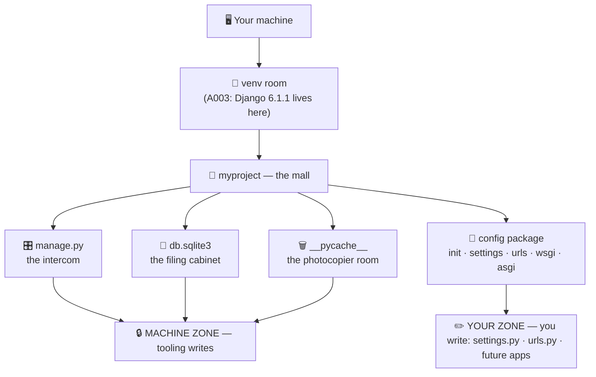

# 🗂️ A005 — Django Files & Folders

**Django Lecture Series · Chapter A005** · 🗺️ Level: Beginner · ⏱️ Study time: ~35 min
**Sources:** lecture journal (`commands.txt`, line 15) · the real `myproject/` artifact · official Django docs *(see [Sources used](#-sources-used))*

> **📖 How to read this chapter:** no transcript exists for this lecture, so it is built
> from three honest sources — the **journaled command** (`py .\manage.py runserver 8080`),
> the **actual artifact it produced** (a second generated project, `myproject/`, sitting
> in this folder), and the **official Django documentation**. Anything beyond those is
> marked 📌. A004 toured this same generated layout file-by-file; A005's different job is
> the **complete map** — including the files A004 deliberately skipped — and the one
> skill that separates operators from owners: knowing **what you may edit, what you
> should leave alone, and where your own future files will live**.

## 🧭 What You Will Learn

By the end of this chapter, you will be able to:

- **Recite the complete anatomy** of a generated Django project — every file *and* every
  folder, including `db.sqlite3` and `__pycache__/`, which A004 skipped on purpose
- **Classify each item** as *edit freely*, *edit carefully*, or *leave alone* — the
  working developer's split
- **Explain what a custom port is** and run your project with `runserver 8080`
- **Predict where future files go** — your first app, your templates, your static and
  media files — before you ever create them
- **Explain why the same generated project appeared twice with different names**
  (`myProject` vs `myproject`) and what that teaches about case sensitivity

## 🎯 Why This Lecture Matters

A004 built the project; this chapter makes you **literate in it**. The difference shows
the first time something breaks:

- an error mentions `settings.py` — do you open it boldly or panic?
- a tutorial says *"add a templates folder"* — where, exactly, and how does Django find it?
- your `db.sqlite3` file grows — is that dangerous? (no — that's your data)
- a teammate's machine has `myproject/`, yours has `myProject/` — same project? (yes)

**File literacy is debugging speed.** Every future error message in this series will
name one of the files you map today — and from A006 onward, you will *add* to this map
(apps, templates, static files). You cannot navigate what you cannot name.

## ✅ Prerequisites

- **A001** — what Django is; project vs app vocabulary
- **A003** — a working venv; Django installed; `runserver` basics
- **A004** — you created `myProject` and saw the rocket page

> **🔁 Recap from A003 & A004:** A003's mental model was *one machine, many rooms* — a
> virtual environment per project, each room holding its own Django version. A004 ran
> `django-admin startproject myProject` and toured the result: `manage.py` (the
> intercom), the *inner* `myProject/` (the mall's management office — settings, root
> URLs, WSGI/ASGI), and two entry standards (`wsgi.py`/`asgi.py`). A005 widens the lens
> from "what is each file" to "what is the **whole territory** — and who owns which part".


---

## 📜 The Journal — What This Lecture Actually Ran

A005 adds exactly one new command to the journal (`commands.txt`, line 15):

```bash
# commands.txt — line 15 (this lecture's new entry)
py .\manage.py runserver 8080
```

You already know `py .\manage.py runserver` from A004 — same command, **one new
ingredient: `8080`**. Everything else in this chapter's story comes from *looking
closely at what exists* rather than running more commands. That is a real workflow
shift worth noticing: **A004's skill was generating; A005's skill is reading.**

### Anatomy of the new argument

| Piece | What it is | Why it's there |
|---|---|---|
| `py` | The Windows **Python launcher** — finds your Python | A003's lesson: this ran *inside the activated venv*, so it's the room's Python |
| `.\manage.py` | The project's **intercom** — Django's per-project CLI | Must run from the folder *containing* `manage.py` (that's what `.\` means: "here") |
| `runserver` | The sub-command: start Django's **development web server** | Serves your project on your machine for testing |
| `8080` | Optional **port number** — *which door* on your machine the server listens at | Without it, Django defaults to **8000**; with it, the rocket page lives at `http://127.0.0.1:8080/` |

> 🧠 **Remember this:** `runserver 8080` doesn't change *what* Django serves — it changes
> **which door** you knock on. Same house, different doorbell.

### A detective moment — two projects, two names

This folder contains a second generated project: **`myproject/`** — lowercase, while
A004's was **`myProject/`** (capital P). Same command produced both
(`django-admin startproject myproject` vs `startproject myProject`), and both work.
Verify it inside the artifact itself:

```python
# A005's myproject/myproject/settings.py — the project's own name is wired in:
ROOT_URLCONF = "myproject.urls"     # ← lowercase, exactly the name given to startproject
WSGI_APPLICATION = "myproject.wsgi.application"
```

**What this proves:** the name you pass to `startproject` is not decoration — it is
stamped into the configuration in *three or more places* (folder name, inner package
name, `ROOT_URLCONF`, `WSGI_APPLICATION`). And on **Windows, file/folder names are
case-insensitive**, but **Python imports are case-sensitive everywhere** — so the
moment you or a tool renames `myProject` to `myproject` halfway through, imports and
stamps can silently disagree.

> ⚠️ **Practical rule:** pick a project name once, in **lowercase-with-no-spaces**
> (`myproject`, `chai_site`), and never rename the generated folders afterward.
> Renaming means editing every stamped reference — possible, but a beginner trap with
> nothing to teach you that a fresh `startproject` wouldn't.


---

## 🗺️ The Complete Map — Every File, Every Folder

Here is the artifact in this folder, annotated. Two items are marked **🆕 new since
A004** — A004 skipped them deliberately; today they earn their explanations:

```
A005_Django_Files_Folders/
└── myproject/                  # 🏬 OUTER folder — the whole project (convenience wrapper)
    ├── manage.py               # 🎛️ Your command intercom (runserver, migrate, …)
    ├── db.sqlite3        🆕    # 💾 Your DATABASE file — starts empty (0 bytes!), grows as you store data
    └── myproject/              # 🏢 INNER folder — the config package ("the management office")
        ├── __init__.py         # 📦 Marks this folder as an importable Python package
        ├── settings.py         # ⚖️ The project's constitution — every major switch lives here
        ├── urls.py             # 🧭 Root URL dispatch table — which URL goes to which view
        ├── wsgi.py             # 🚪 Sync entry point — how production servers will greet Django
        ├── asgi.py             # 🚪 Async entry point — the modern twin of wsgi.py
        └── __pycache__/  🆕    # 🗑️ Python's compiled-bytecode cache — auto-generated, disposable
```

### The full inventory — A005's master table

| Item | Kind | One-line job | A005 verdict |
|---|---|---|---|
| `manage.py` | File | Per-project CLI: `runserver`, `migrate`, `startapp`… | 🔧 Edit: **rarely** (customize settings path at most) |
| `db.sqlite3` 🆕 | File | Your **SQLite database** — the default store for users, models, sessions | 🔒 **Never hand-edit**; it's machine-managed via migrations |
| `__init__.py` | File | Makes the folder a Python **package** (importable) | 🔒 Leave alone (empty by convention) |
| `settings.py` | File | **Constitution**: apps, middleware, DB, templates, static, security | 🔧 Edit: **constantly** — this is *your* control panel |
| `urls.py` | File | Root **URL dispatch table** → includes app URLconfs | 🔧 Edit: **often** — every new route touches it |
| `wsgi.py` | File | **Sync** server entry point (Gunicorn & friends) | 🔒 Leave alone |
| `asgi.py` | File | **Async** server entry point (Daphne, Uvicorn; also powers `runserver`) | 🔒 Leave alone |
| outer `myproject/` | Folder | Human-friendly wrapper around everything | 🏷️ Rename *only* if you accept the §📜 renaming cost |
| inner `myproject/` | Folder | The config **package** — name stamped into settings | 🔒 Rename = breakage (see §📜) |
| `__pycache__/` 🆕 | Folder | Python's **bytecode cache** — `.pyc` versions of your files | 🗑️ **Ignorable & disposable** — delete anytime; Python rebuilds it |

### The two newcomers, properly introduced

**💾 `db.sqlite3` — your data's filing cabinet.** SQLite is a database that lives in
*one file* — no server process, no setup; that's why Django defaults to it for
learning. It started as **0 bytes** because an empty project stores nothing yet. From
A006 onward (first `startapp`, first model, first `migrate`) this file starts growing —
and that growth is *healthy*: rows of your real data. Two rules follow:

1. **Never open it in an editor** (and never hand-edit it) — models + migrations are
   the only sanctioned writers.
2. **Treat it as precious but replaceable** — it holds your data, yet `migrate` can
   recreate an *empty* one anytime; what it can't recreate is your rows, so real
   projects back it up (or graduate to PostgreSQL/MySQL — same models, different engine,
   a later lecture's story).

**🗑️ `__pycache__/` — the photocopier room.** The first time Python imports a file, it
compiles it to bytecode and photocopies the result here, so next import is faster.
Everything in it is **derived**: delete the folder and Python calmly rebuilds it. It
should never be committed to version control (this repo's `.gitignore` already excludes
`__pycache__/` and `*.pyc`) — if you ever see one in a repo, it's litter, not code.

> 🧠 **One-breath summary of the map:** *two folders with the same name (wrapper vs
> config package), five hand-written Python files, one auto-managed database, one
> disposable cache. Four are yours to edit sooner or later — the rest you respect.*


---

## 🚦 The Ownership Map — What You Edit, What You Never Touch

This is the skill that turns the map into *judgment*. Every item in a Django project
falls into one of three zones:

| Zone | Meaning | Items | Rule of thumb |
|---|---|---|---|
| 🟢 **Yours — edit freely** | Written *for* you to change; every project customizes them | `settings.py`, `urls.py`, (soon) your apps' files | If a tutorial says "add X", it usually means here |
| 🟡 **Yours — edit deliberately** | Editable, but rare/structural changes; know what you're doing | `manage.py`, outer folder name | Change with intent, not by accident |
| 🔴 **Machine's — leave alone** | Generated or derived; hand-editing loses a fight with tooling | `__init__.py`, `wsgi.py`, `asgi.py`, `db.sqlite3`, `__pycache__/`, inner folder name | If you're typing here, you're probably solving the wrong problem |

**Why the zones exist (the why-before-how):** Django's whole design separates *your
decisions* from *framework machinery* (A001's loose-coupling philosophy, now visible as
folders). The green zone is where your decisions live; the red zone is machinery whose
shape is a **contract** — `wsgi.py` exposes exactly one callable, `db.sqlite3` is
written by migrations, `__init__.py` makes imports work. Editing a contract doesn't
customise it; it *voids* it.

### Where your future files will land (predict before you create)

A006 starts adding to this map — here is the forecast, so nothing surprises you:

*What to see in the diagram: the project starts nearly empty; each future lecture adds
one shaded region — apps appear next to the config package, project-wide folders
(templates/static/media) appear beside `manage.py`.*



> 🧠 **Remember this:** *apps are siblings of the config package; project-wide folders
> are siblings of `manage.py`. When a later lecture says "create X", you should already
> see the X's home in your head before your finger touches a key.*

Two setup notes the forecast depends on (📌 *beyond the lecture* — official Django
docs, previewed for later chapters): templates/static/media folders don't exist until
you create them, **and** Django won't look for them until you tell it where they are in
`settings.py` (`TEMPLATES['DIRS']`, `STATICFILES_DIRS`, `MEDIA_ROOT`). The folders are
the rooms; the settings entries are the signposts.


---

## 🔌 The Port Lesson — `runserver 8080`

You type `py .\manage.py runserver 8080` and the console answers:

```text
Starting development server at http://127.0.0.1:8080/
Quit the server with CTRL-BREAK.
```

Same rocket page as A004 — but at a different address. Three concepts unpack it:

| Concept | What it is | In the journal's command |
|---|---|---|
| **`127.0.0.1` (localhost)** | The special address meaning *"this very machine"* — your browser calling your own computer | Where Django listens by default; nothing outside your machine can reach it |
| **Port** | A numbered **door** on that machine; many programs can share one machine by each owning different doors | Django's default door is **8000**; `8080` opens the same app on door 8080 |
| **URL** | Address + door + path: `http://127.0.0.1:8080/` = *machine* `127.0.0.1`, *door* `8080`, *path* `/` | Change the number → same app, different knock |

**Why the option exists (the why-before-how):** only **one program can hold a port at a
time**. Real development means juggling — yesterday's `runserver` still open in another
terminal, another project, a Docker container, a tool that grabbed 8000. When door 8000
is occupied, Django refuses to start:

```text
Error: That port is already in use.
```

The fix is not to hunt down and kill the other program (sometimes you *want* it
running) — it's to **open a different door**: `runserver 8080`. That's why the
journal's habit of demonstrating a custom port is a real-world survival skill, not a
trick. (Ports can range from 1–65535; anything ≥ 1024 is fair game for you without
admin rights — 📌 *beyond the lecture*, general networking knowledge.)

> 🧠 **Remember this:** `Error: That port is already in use.` translates to *"somebody
> already owns door 8000 — pick another."* The cure is one argument: `runserver 8080`.
>
> **Door-note:** the port only matters in development. In production, your site lives
> behind a real server on door 80/443 (the web's standard doors) — deployment's story,
> much later in the series.


---

## ❌ Common Beginner Mistakes

1. ❌ **Opening `db.sqlite3` in an editor to "see the data".**
   *Why:* it's right there, it's a file, curiosity knocks.
   *Fix:* it's a binary database — open it via the admin (later) or SQLite tools; the
   sanctioned writer is always models + `migrate`.
2. ❌ **Committing `__pycache__/` or `db.sqlite3` to git.**
   *Why:* they sit inside the project folder, so they look like project files.
   *Fix:* caches are regenerable (litter), databases are environment-local. This repo's
   `.gitignore` excludes both — read it, it's teaching by example.
3. ❌ **Renaming the inner config folder** (`myproject/` → `config/` or `myProject/`).
   *Why:* it *looks* like an ordinary folder rename.
   *Fix:* the name is stamped in `manage.py`, `settings.py` references, `wsgi.py`,
   `asgi.py` — and Python imports are case-sensitive. Renaming is a coordinated edit;
   beginners regenerate instead.
4. ❌ **Running `manage.py` from the wrong directory.**
   *Why:* after `cd`-ing around, `py manage.py runserver` fails with "can't open file".
   *Fix:* `manage.py` lives in the **outer** folder — that's your working directory for
   every Django command.
5. ❌ **Treating port 8000 as part of the project.**
   *Why:* every tutorial shows `127.0.0.1:8000`.
   *Fix:* the port is a *runtime choice* — `runserver 8080` proves it. Nothing in your
   files says 8000; it's Django's default door.
6. ❌ **Deleting `__init__.py` "because it's empty".**
   *Why:* an empty file looks pointless.
   *Fix:* it's the package marker — without it, `myproject.urls` stops importing and
   `ROOT_URLCONF` breaks. Empty ≠ useless; some contracts are silent.
7. ❌ **Putting new code directly in the config package.**
   *Why:* it's the folder you know best after this chapter.
   *Fix:* the config package is *configuration*; features get their own apps (A006) —
   that's the mall-vs-shop boundary from A001, now enforced by you.

## 🧠 Common Misconceptions

| ✅ Reality | ❌ Misconception |
|---|---|
| `db.sqlite3` is your **data**, managed by migrations | it's a settings file or source code |
| `__pycache__/` is **disposable bytecode cache** | it's part of your project (or a virus!) |
| The **port** is chosen at launch time | 8000 is baked into the project |
| The **outer** folder is a convenience wrapper | the outer folder *is* the Python project |
| The **inner** folder is the config **package** | the inner folder is where features go |
| `wsgi.py`/`asgi.py` are **server handshakes** | they're the web server themselves |
| Both `myProject` and `myproject` are valid names | Django requires a specific casing |

> 🧠 **Pattern behind all of them:** each misconception blurts the *machine's zone*
> into *your zone* — or vice versa. When confused, re-ask the zoning question: *"who
> writes this, me or the tooling?"*


---

## 🧱 A005 Vocabulary

New terms this chapter — registered in [`docs/MEMORY.md`](../docs/MEMORY.md) too:

| Term | Simple meaning | Technical meaning | 🧷 Memory hook |
|---|---|---|---|
| **SQLite / `db.sqlite3`** | Your app's data file | File-backed relational database; Django's default `ENGINE`, written via ORM + migrations | Filing cabinet in the office |
| **`__pycache__/`** | Python's scratch copies | Directory of compiled `.pyc` bytecode, auto-regenerated on import | Photocopier room |
| **Bytecode** | Pre-chewed Python | Intermediate compiled form CPython caches for faster imports | Pre-chewed food |
| **`__init__.py`** | The "this is a package" flag | Makes a directory importable as a Python package | The shop's "OPEN" sign |
| **Port** | Which door on the machine | Numbered endpoint (1–65535) one program listens on at a time | Doorbell number |
| **localhost / `127.0.0.1`** | "This machine itself" | Loopback address — traffic never leaves the computer | Talking to yourself in the mirror |
| **Case sensitivity** | `myProject` ≠ `myproject` (to Python) | Windows FS is case-insensitive; Python imports are case-sensitive everywhere | Name tags must match exactly |

---

## 🎯 Interview Perspective

**Q1 · What is `db.sqlite3` and should you commit it to version control?**
> **Strong answer:** "It's the SQLite database file Django creates by default — actual
> application data managed through models and migrations, never by hand. You generally
> don't commit it: it's environment-local, it grows with real (often test) data, and
> schema comes from migrations, not the file."
> **Why it works:** identifies the artifact, names its writers, and gives the
> reasoning — not just "don't commit it".

**Q2 · What's the difference between the outer and inner project folder?**
> **Strong answer:** "The outer folder is a convenience wrapper — it holds `manage.py`
> and is your working directory for commands. The inner folder is an importable Python
> package whose name is stamped into `ROOT_URLCONF`, `WSGI_APPLICATION`, and `manage.py`
> — it's the configuration package. Django doesn't care where the outer folder lives;
> the inner name is load-bearing."
> **Why it works:** the A004/A005 distinction interviewers probe because tutorials blur it.

**Q3 · What is `__pycache__` and does it belong in git?**
> **Strong answer:** "It's CPython's bytecode cache — `.pyc` files compiled from my
> sources to speed up imports. It's fully derived: delete it and Python regenerates it.
> It never belongs in version control, so it's gitignored via `__pycache__/` and
> `*.pyc` rules."
> **Why it works:** knows the mechanism *and* the hygiene, and ties it to config.

**Q4 · `runserver` says "That port is already in use." What now?**
> **Strong answer:** "Another process owns port 8000 — only one listener per port. If I
> need both running, I start mine on another port: `python manage.py runserver 8080`.
> Otherwise I find and stop the old listener. It's a runtime conflict, not a project bug."
> **Why it works:** correct diagnosis → two legitimate cures → correct category.

**Q5 · Which generated files would you never edit, and why?**
> **Strong answer:** "`wsgi.py`/`asgi.py` — they're contract entry points exposing one
> callable for server infrastructure. `__init__.py` — the package marker; removing it
> breaks imports. `db.sqlite3` — migrations own it. The config package's name — stamped
> everywhere. My work happens in `settings.py`, `urls.py`, and apps."
> **Why it works:** converts a list into a *principle* (contracts vs decisions).

**Q6 · Where will your templates live, and how does Django find them?**
> **Strong answer:** "Conventionally a project-level `templates/` folder next to
> `manage.py` for shared templates, plus per-app templates inside each app. Django
> finds them through the template engines configuration in `settings.py` —
> `APP_DIRS` and `DIRS`. Creating the folder alone isn't enough; the setting is the
> signpost."
> **Why it works:** previews architecture correctly and separates *folder* from
> *configuration* — the exact lesson of this chapter.


---

## 🔁 Active Recall

Cover the answers; say each one aloud first.

**1. List every item in a generated project — including the two A004 skipped.**

<details><summary>Answer</summary>

Outer folder → `manage.py`, `db.sqlite3` 🆕, inner config package → `__init__.py`,
`settings.py`, `urls.py`, `wsgi.py`, `asgi.py`, `__pycache__/` 🆕.
</details>

**2. What does `runserver 8080` change — and what does it *not* change?**

<details><summary>Answer</summary>

Changes the **port** (the door): from Django's default 8000 to 8080, so the URL becomes
`http://127.0.0.1:8080/`. Does **not** change what is served, which project runs, or any
file on disk.
</details>

**3. Why does "That port is already in use" happen, and what are the two cures?**

<details><summary>Answer</summary>

Only one program can listen on a port at a time — something already owns 8000 (often
yesterday's `runserver`). Cures: stop that process, or start on another door
(`runserver 8080`).
</details>

**4. Which zone does each belong in: `settings.py`, `db.sqlite3`, `__pycache__/`, `manage.py`?**

<details><summary>Answer</summary>

🟢 `settings.py` (edit freely) · 🔴 `db.sqlite3` (migrations own it) ·
🔴 `__pycache__/` (disposable cache) · 🟡 `manage.py` (deliberate/rare edits only).
</details>

**5. What is `__pycache__/` and what happens if you delete it?**

<details><summary>Answer</summary>

Python's bytecode cache — compiled `.pyc` copies of your files made on first import for
faster subsequent imports. Deleting is harmless: Python rebuilds it on the next run.
</details>

**6. Why is the inner folder's name "load-bearing"?**

<details><summary>Answer</summary>

It's an importable package whose name is stamped into configuration:
`ROOT_URLCONF = "myproject.urls"`, `WSGI_APPLICATION = "myproject.wsgi.application"`,
plus `manage.py`'s settings reference. Rename it and those imports break — and Python
imports are case-sensitive, so even a casing change is breaking.
</details>

**7. `myProject` and `myproject` both work on Windows — so casing doesn't matter, right?**

<details><summary>Answer</summary>

Wrong for Python. Windows' file system is case-insensitive (folders coexist), but
**Python imports are case-sensitive on every OS** — `myProject.urls` and
`myproject.urls` are different names to the interpreter. The stamped references must
match the actual package name exactly.
</details>

**8. Where will your first app's folder appear, and where will project-wide templates go?**

<details><summary>Answer</summary>

The app (A006's `blog/`) appears **inside the outer folder, as a sibling of the config
package**; project-wide `templates/` goes **next to `manage.py`** — and Django only
finds it once `settings.py` points to it (`TEMPLATES['DIRS']`). Apps are shops in the
mall; project-wide folders sit beside the management entrance.
</details>


---

## 📝 Quick Revision — A005 in Five Minutes

**The one-liner:** A005 = file literacy — know every item in a generated project, who
owns it (you vs the tooling), and that even the port is a runtime choice
(`runserver 8080`), not a setting.

**The complete map (10 items):**

| Zone | Items |
|---|---|
| 🏬 Project | outer `myproject/` (wrapper) · inner `myproject/` (config **package**, name stamped into settings) |
| 🎛️ Commands | `manage.py` — the intercom (`runserver`, `migrate`, `startapp`) |
| ⚖️ Config office | `settings.py` (constitution) · `urls.py` (dispatch table) · `wsgi.py`/`asgi.py` (server handshakes) · `__init__.py` (package flag) |
| 💾 Data | `db.sqlite3` 🆕 — your database file: starts 0 bytes, grows with your data |
| 🗑️ Disposable | `__pycache__/` 🆕 — bytecode cache; delete anytime, Python rebuilds |

**The ownership split (the chapter's core skill):**

| Verdict | Items |
|---|---|
| ✏️ **Edit freely** | `settings.py` · `urls.py` — and, from A006, your own apps |
| ⚠️ **Edit carefully / rarely** | `manage.py` · outer folder name |
| 🔒 **Never hand-edit** | `db.sqlite3` · `__init__.py` · `wsgi.py` · `asgi.py` · inner package name |
| 🗑️ **Ignore & disposable** | `__pycache__/` |

**The port lesson:** `py .\manage.py runserver 8080` → rocket page at
`http://127.0.0.1:8080/`. Port = **which door**, chosen at launch; default door is
8000; stop with `CTRL+C`. Nothing in your files says 8000.

**The case rule:** Windows folders are case-insensitive; **Python imports are not**.
`myProject` ≠ `myproject` to the interpreter. Pick a lowercase name once; never rename.

**Top 3 traps:** hand-editing `db.sqlite3` · putting features in the config package ·
treating port 8000 as part of the project.

---

## 🧠 Memory Palace — One Machine, Zoned

A005's model is not a new building — it is **property lines** drawn across everything
A004 built. Every item in the map sits in one of two zones, and the deciding question
is always: ***who writes this — me, or the tooling?***



**The five anchors:**

1. **The intercom** (`manage.py`) — your *voice* into the building, but its wiring is
   the machine's: run it from the outer folder, edit it almost never.
2. **The management office** (config package) — five employees; only **settings** and
   **urls** take your direction; the name plate (`myproject/`) is stamped in three
   places, so never re-engrave it.
3. **The filing cabinet** (`db.sqlite3`) — staff (migrations) file every record; you
   may read the labels, never rewrite the files by hand.
4. **The photocopier room** (`__pycache__/`) — robot copies of your files; bin them
   without fear, they re-print themselves.
5. **The zoning question** — when lost, ask *"who writes this?"* It resolves every
   confusion in the misconception table, and from A006 onward it tells you where every
   new folder belongs.

> 🧠 **Remember this:** A004 gave you the building; A005 gave you the **property
> lines**. Owning code starts with knowing which rooms are yours.


---

## ❓ FAQ

**Q1 · Is `db.sqlite3` my database? Can I delete it?**
It *is* your database — a real, working SQLite file. Deleting it doesn't break Django;
it deletes **your data** (and the next `migrate` recreates an empty one). For A005:
know it exists, never hand-edit it, back it up like any data file.

**Q2 · Why does the project appear twice — `myproject/` inside `myproject/`?**
Not a mistake. The *outer* folder is the project's home on disk; the *inner* folder is
the **config package** Python imports by name. The name is stamped into `settings.py`
(`ROOT_URLCONF`, `WSGI_APPLICATION`), so renaming either afterwards means renaming in
several places — A004's advice stands: choose once, don't rename.

**Q3 · Is `__pycache__/` part of my project? Should I commit it?**
No — it's Python's bytecode cache, regenerated automatically. It's disposable (and this
repo's `.gitignore` already excludes it). It appears the moment Python imports your
modules — seeing it means your code *ran*, which is oddly reassuring.

**Q4 · Is 8000 or 8080 "the Django port"?**
Neither is *the* port. 8000 is just `runserver`'s **default**; `runserver 8080`
demonstrates the port is a **launch-time choice**, not a setting. Any free port works.

**Q5 · Where will my own files go?**
From A006 onward: **apps** are created by `startapp` and live beside `manage.py`;
templates/static/media folders you create are pointed to from `settings.py`. That is
exactly what the ownership map's ✏️ zone promised.

**Q6 · My folder shows `myProject` but the journal says `myproject` — did I fail?**
No. Windows folders are case-insensitive, so both open. But Python **imports** are
case-sensitive — the interpreter genuinely distinguishes them. One reason to pick
lowercase and stay consistent.

---

## 🏁 Learning Checkpoints

Check yourself — each should be a *yes*:

- [ ] I can draw the complete map from memory — all 10 items, including `db.sqlite3` and `__pycache__/`
- [ ] I can classify every item into the four ownership verdicts without looking
- [ ] I can explain the two-`myproject` structure (outer wrapper vs inner config package) and why renaming is risky
- [ ] I can run the server on a custom port and explain what 8080 changed — and what it didn't
- [ ] I can state the case-sensitivity rule and the one place it bites (Python imports)
- [ ] I can name where my future files will live: apps, templates, static, media

---

## 🏋️ Exercises

**Level 1 — Recall** *(from memory, no peeking)*
1. List the complete project map — every file *and* folder.
2. Which items may you edit freely, and which must you never hand-edit?
3. What does `db.sqlite3` contain, and what is `__pycache__/` for?

**Level 2 — Understanding**
4. Explain, in two sentences each, the difference between the outer and inner
   `myproject/` — and why the inner name appears inside `settings.py`.
5. A teammate says *"put the port in settings so everyone uses 8080."* Why is that a
   misunderstanding? What *is* the setting for which door Django answers, versus which
   door you knock on?

**Level 3 — Application** *(hands on the real artifact in this folder)*
6. In `A005_Django_Files_Folders/myproject/`: open `manage.py` and find the
   virtual-environment warning string; run `py .\manage.py runserver 8080` from the
   outer folder and confirm the rocket page on port 8080; stop with `CTRL+C`; re-run
   without the port and confirm 8000. Two doors, same building.
7. Run the server, reload the page twice, then inspect `db.sqlite3`'s size — did the
   rocket page change it? (Why not? Which future commands *will*?)

**Level 4 — Interview reasoning**
8. A new teammate proposes renaming the inner config package from `myproject` to
   `config` "for clarity." Walk through everything that must change and the safer
   alternative (`startproject config` on day one). 📌 *This rename tip goes slightly
   beyond the journal — flagged per the source rules.*


---

## 🏁 Final Takeaways — A005

1. **The map is now complete.** Every item in a `startproject` skeleton has a name, a
   job, and an owner — you can draw the whole tree from memory.
2. **The zoning law:** `manage.py` and the inner config package are the tooling's and
   Django's territory; your code will live in **apps**, **templates**, and (later)
   project-level folders you create. Editing generated files happens *rarely and
   deliberately* — never casually.
3. **`db.sqlite3` is the database file, born empty** — it fills as you migrate and add
   data; deleting it is destructive (and, in dev, recoverable by re-migrating).
   `__pycache__/` is disposable bytecode — regenerate-able, git-ignorable, never edited.
4. **The inner name is load-bearing.** It appears as `ROOT_URLCONF = 'myproject.urls'`
   and `WSGI_APPLICATION = 'myproject.wsgi.application'` — which is why renaming it
   later is surgery, and why choosing the name once, deliberately, matters.
5. **Same building, many doors:** `runserver 8080` proved the port is a *knock* choice,
   per command — not a settings change. Settings configure the building; the command
   chooses the door.
6. **Case matters:** `myProject` (A004) and `myproject` (A005) are two different
   packages on disk and in imports. Pick a casing convention and keep it.
7. **Two artifacts, one lesson:** compare this folder's `myproject/` with A004's
   `myProject/` — identical skeletons, different names and keys. The *shape* is what
   Django guarantees; the *names* are what you choose.

---

## 🔄 Next Lecture Connection — A006

The map you just memorized has an obvious empty lot: a skeleton with **no app in it** —
`INSTALLED_APPS` lists only Django's built-ins, and there is no `models.py` of your own
anywhere. A006 adds the first shop to the mall: the journal's next command
(`startapp blog` — already visible in [`commands.txt`](../commands.txt)) creates an
app package, and with it the files you'll edit *every day*: `models.py`, `views.py`,
`admin.py`. After A006, the zoning map gains its first *your-code* zone.

---

## 📚 Sources Used

| Source | Role | Notes |
|---|---|---|
| [`commands.txt`](../commands.txt) — line 15: `py .\manage.py runserver 8080` | **Primary** | Quoted verbatim; the custom-port lesson is built directly on it |
| `A005_Django_Files_Folders/myproject/` — the second generated artifact | **Primary** | Folder tree, `ROOT_URLCONF`, `SECRET_KEY` difference, and the 0-byte `db.sqlite3` all observed directly (lowercase name = the case-sensitivity case study) |
| [A004 — Create Django Project](../A004_Create_Django_Project/README.md) | Context | The file-by-file tour A005 builds on; its artifact `myProject/` is the comparison twin |
| Official Django docs (`django-admin`/`manage.py` reference, settings overview) | 📌 Supplementary | Command flags, auto-reload behavior, and the `startproject config` rename tip go beyond the journal and are flagged in place |

> 📌 **Scope note:** everything derived from the journal and the artifact is
> source-grounded; anything else (e.g., the rename recommendation, auto-reload
> internals) carries the 📌 badge. No transcript exists for A005 — declared per the
> documentation contract.

---

**Navigation:** [← A004 · Create Django Project](../A004_Create_Django_Project/README.md) · [📚 Series Hub](../README.md) · [A006 · Django startapp Command →](../A006_Django_startapp_Command_Explained/)

<div class="doc-footer">

**Series:** [A001](../A001_Introduction_What_is_Django/README.md) ·
[A002](../A002_MVT_Architecture_Explained/README.md) ·
[A003](../A003_Install_Python_pip_Django_Virtual_Environment_Setup/README.md) ·
[A004](../A004_Create_Django_Project/README.md) · **A005** ·
[Hub](../README.md)

</div>
