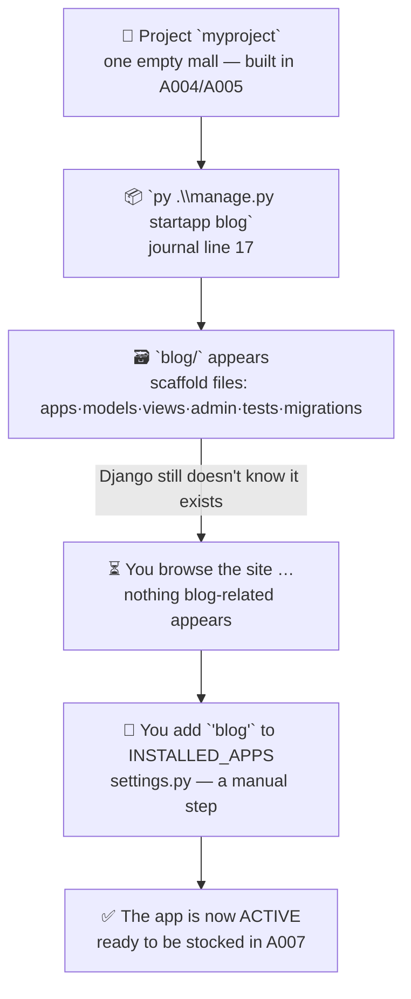

# 🚀 A006 — The Django `startapp` Command

`📖 Lecture A006` · `🎓 Track: Core Django` · `📶 Level: Beginner` · `✅ Status: Documented`

> [!NOTE]
> **About this chapter's sources:** built from **two primary in-repo sources** — the
> owner's command journal [`commands.txt`](../commands.txt) **line 17**
> (`py .\manage.py startapp blog`, quoted verbatim) and the real artifact it produced:
> a full `blog/` app inside A006's `myproject/` project (every generated file quoted
> verbatim below). Django's official `startapp`/applications docs fill the background —
> always marked 📌 where they go beyond the sources. No transcript exists for A006.

---

## 🧭 What You Will Learn

- [ ] Explain what `python manage.py startapp` creates — and what it does **not** create
- [ ] Name every file in a fresh app and say exactly what each one is for
- [ ] Read an app's `apps.py` and explain what `AppConfig` is doing
- [ ] Register an app in `INSTALLED_APPS` and explain *why* that step exists
- [ ] Debug the classic "I created my app but nothing happens" failure

## 🎯 Why This Lecture Matters

Until now, the mall (the project) has stood with **no shops inside it**: every
`INSTALLED_APPS` entry was one of Django's own built-ins (`django.contrib.*`), and the
only `models.py`-like files in the repository were the chai app's — made by a command
you had not yet learned. From this lecture onward, *everything* you build — a blog, a
chai catalog, an accounts system — starts life as an **app created by `startapp`**.

And there is a wall almost every beginner hits right after running it: *"I created the
app… but my site doesn't show it anywhere."* That is not a bug — it is a **missing
step** (registration), and this chapter's artifact proves the point: the command
created the `blog/` folder, *and the folder sat there doing nothing* until the journal's
owner manually listed it in `INSTALLED_APPS`. A007 (views & URLs) builds directly on
this chapter — you cannot write your first *view* until you know which file it belongs
in and why that file was invisible until now.

## ✅ Prerequisites

- [ ] **A001** — project vs app; the shopping-mall & shops mental model
- [ ] **A003** — Python interpreters, pip, and virtual environments (`py`, activate)
- [ ] **A004** — `manage.py` (the intercom), `settings.py`, the inner/outer project folders
- [ ] **A005** — the project file map and `INSTALLED_APPS` = "the mall's directory"

### 📌 Recap from A004 & A005 (60 seconds)

`django-admin startproject` stamped out one skeleton **mall** whose directory listed
only Django's built-in apps. A005's zoning map ended with an obvious empty lot: the
project had *no application of your own* — no `models.py`, no `views.py`, nothing you
edit for your own features. A006's command opens the first shop in that mall — and
this lecture folder contains the proof, on disk, that the command really ran.

---

## 📜 The Journal — Line 17

> `py .\manage.py startapp blog`

Every journal line so far has been one small step; this one is the first whose whole
output is an **app** rather than a project. Decode each piece:

| Piece | Means | Learned in |
|---|---|---|
| `py` | The Windows launcher that runs the *active environment's* Python (not a global one) | A003 |
| `.\manage.py` | The project's command remote control — wraps `django-admin` with *this* project's settings | A004 |
| `startapp` | The subcommand that generates a new **app** package | **this lecture** |
| `blog` | The app's name — one word, lowercase, describing its *single job* | **this lecture** |

Double-click (pun intended) on the `manage.py` vs `django-admin` split, because A004
made it and the journal has been following it ever since:

- `django-admin startproject myProject` (line 11) — global, one-shot project creation
  (A004) — Django itself is not yet inside any project.
- `py .\manage.py startapp blog` (line 17) — inside the project, using its own
  settings. `startapp` also works as `django-admin startapp` outside a project, but the
  *normal* way is through `manage.py`, from the folder that holds it.

> 💡 `startapp` is not a "feature of Django the framework" sitting in the clouds — it is
> a command that copies a **template of files** into your project and renders the names
> you gave it. That single insight explains everything the next sections show you.

## 🗺️ Big Picture — From Project to Active App

The whole lecture is this one flow. *What to see: the command creates files **instantly**
— but the app stays invisible until a second, manual step (registration) happens.*



The two middle boxes (`C → D`) are the trap this chapter exists to remove: `startapp`
gives you the shop's **shell**, not its business license. The license is the
`INSTALLED_APPS` line — and you write it yourself.

---

## 🏗️ What `startapp` Actually Built — The Artifact Tour

This lecture folder contains the **real output** of journal line 17: a `myproject/`
directory that was created the same way as A004/A005's, plus the new `blog/` package
inside it. Here is the ground truth as it sits on disk right now *(the `__pycache__/`
entries are A005's disposable photocopier room and are omitted)*:

```
A006_Django_startapp_Command_Explained/
└── myproject/                        ← the project folder (A005's zoning map applies)
    ├── manage.py                     ← the intercom — from startproject, untouched
    ├── db.sqlite3                    ← 0 bytes — no tables yet, nothing migrated
    ├── blog/                         ← 🆕 CREATED BY `startapp blog`
    │   ├── __init__.py               ← “this folder is a Python package” flag
    │   ├── admin.py                  ← register your models for the back office
    │   ├── apps.py                   ← the app's name card (AppConfig)
    │   ├── models.py                 ← 🏠 your future data blueprints go here
    │   ├── tests.py                  ← your future automated tests go here
    │   ├── views.py                  ← 🏠 your future request-handlers go here
    │   └── migrations/               ← this app's own schema-notebook
    │       └── __init__.py           ← (empty; filled when you migrate)
    └── myproject/                    ← the config package — startapp did NOT touch it
        ├── settings.py               ← YOU edited this: now lists 'blog'
        └── urls.py                   ← still only admin/ roads (see §🔒)
```

Count what you see: **seven files in `blog/`** (one of which is the `migrations/`
sub-package, itself a package by its own `__init__.py`). Compared with the project
(tree above), an app is *small* — it has no `settings.py`, no `wsgi.py`, no `asgi.py`.
It is a feature module, not a config root. That's the mall/shop split from A001,
visible at last on disk.

### Reading the generated files, one by one

Every file is a **stub**: a correct, importable skeleton that does nothing yet and
tells you (in its comments) exactly what you are expected to write there.

**`apps.py` — the app's name card** (verbatim, all 5 lines):

```python
from django.apps import AppConfig


class BlogConfig(AppConfig):
    name = 'blog'
```

**Explanation:** every Django app gets an `AppConfig` subclass. Its single attribute —
`name = 'blog'` — points at the app's *package*, so Django knows which folder holds
this app's models, views, and templates. Django derives the class name from your app
name: `blog` → `BlogConfig`. This file is how the framework "reads the nameplate" once
the app is registered. 📌 You can add more settings here later (`verbose_name`, etc.)
— from Django docs — but A006 only needs `name`.

**`models.py` & `views.py` & `admin.py` & `tests.py` — the four invitation cards** (verbatim):

```python
# models.py — from django.db import models · “Create your models here.”
# views.py  — from django.shortcuts import render · “Create your views here.”
# admin.py  — from django.contrib import admin · “Register your models here.”
# tests.py  — from django.test import TestCase · “Create your tests here.”
```

**Explanation:** three things to notice. **(1)** Each file already imports what you'll
need (`models`, `render`, `admin`, `TestCase`) — no import boilerplate to write.
**(2)** Each ends with a one-line comment inviting you to fill it — the *stub
comments*. **(3)** Only `models.py` and `views.py` are loaded automatically by Django;
`admin.py` and `tests.py` are discovered because they are conventional names the
framework looks for. The blank `migrations/__init__.py` simply marks the folder as a
package; it stays empty until you create your first model and run `makemigrations`
(A007+).

> 🧠 **Remember this:** the generated app is *empty but wired* — the folders and import
> lines exist so that the moment you type a class/function, Django can find it. A
> `startapp`-then-instant-model workflow is ~2 files away, not 20.

---

## 🔑 The Step `startapp` Does NOT Do — Registration

Here is the crucial reality baked into the artifact: **`startapp` created the `blog/`
folder, and the app stayed disabled until someone edited `settings.py` by hand.**

Look at the artifact's own `INSTALLED_APPS` (verbatim from
`A006 .../myproject/myproject/settings.py`):

```python
INSTALLED_APPS = [
    'django.contrib.admin',
    'django.contrib.auth',
    'django.contrib.contenttypes',
    'django.contrib.sessions',
    'django.contrib.messages',
    'django.contrib.staticfiles',
    'blog', # Custom app created by user
]
```

**Explanation — and the tell:** the bottom line ends with `# Custom app created by
user`. That comment was **not written by `startapp`** — the command does not touch
`settings.py` at all. A person (the journal's owner) typed that line after running the
command. It is the *fingerprint of the manual registration step* — and it proves the
whole story of this lecture:

1. `startapp` runs → `blog/` exists on disk.
2. Django still doesn't list it → **the app is inert**: `blog.views`, `blog.models`
   will not be collected; running `python manage.py check` would not complain, but
   nothing from `blog` exists to the running site.
3. Someone adds `'blog'` to `INSTALLED_APPS` → now (and only now) the app is active.

> [!IMPORTANT]
> **The one-sentence rule:** *`startapp` creates the shop's shell; `INSTALLED_APPS`
> is what opens it for business — and the second step is always yours.* This is the
> single most common `startapp` mistake in real projects, and the artifact is your
> living evidence that even its own author had to do it by hand.

### What `startapp` deliberately did NOT do (check them against the tree)

| ❌ It did NOT … | ✅ Evidence on disk |
|---|---|
| add the app to `INSTALLED_APPS` | the `# Custom app created by user` comment |
| create an app-level `urls.py` | there is no `blog/urls.py` in the tree — you'll make it in A007 |
| create any models | `models.py` still says `# Create your models here.` |
| run any migration | `db.sqlite3` is **0 bytes**; `migrations/` holds only `__init__.py` |

Four "silences" — and each one is a feature, not an oversight: Django never guesses
what your app should *do*. Scaffolding gives you the frames; the decisions are yours,
which is why the generated files are stubs and not examples you'd have to delete.

### Where the app lands, and how to name it

- **Location:** `startapp` drops the new package in the **same folder as `manage.py`**
  — the project container's root (`myproject/blog/` here, sitting next to
  `manage.py`), never inside the inner config package. Run the command from that
  folder, exactly as the journal does (`py .\manage.py startapp blog` from
  `myProject/`'s parent).
- **Name rules:** one word, **lowercase**, letters/digits/underscores only — **no
  hyphens, no spaces** — and it should name the app's single job (`blog`, `chai`,
  `payments`). `BlogConfig` is derived from it, so keep it valid Python (no dashes, no
  Python keywords), and prefer a *singular* job name you can say out loud: "the blog
  app", "the chai app".
- **The project is untouched:** `myproject/`'s config files stay exactly where
  `startproject` put them — the shop moves *in*, the mall's walls never move.

---

## 🧱 Important Vocabulary

The words this lecture lives on. *(New terms are also registered in
[`docs/MEMORY.md`](../docs/MEMORY.md) — the series-wide glossary.)*

| Term | Simple meaning | Technical meaning | 🧷 Memory hook |
|---|---|---|---|
| **`startapp`** | Django's command to create a new app | `python manage.py startapp <name>` renders Django's app template next to `manage.py`; it does **not** register the app | A key that cuts a new shop's shell |
| **App scaffolding** | The ready-made skeleton a new app starts with | Template-generated stubs (`apps`/`models`/`views`/`admin`/`tests` + `migrations/`), importable but empty | A shelved-but-empty shop unit |
| **`AppConfig`** | The class that represents the app to Django | Lives in `apps.py`; its `name` points at the app package; class is derived from the app name (`blog` → `BlogConfig`) | The shop's nameplate |
| **Stub comment** | The `# Create your … here` lines in generated files | Scaffolding's explicit "your code goes here" markers — you replace them | Shelf labels marked "stock me" |
| **App registration** | Adding the app to `INSTALLED_APPS` | The setting that switches an app on; without it the folder is inert (`INSTALLED_APPS` itself was defined in A004) | Adding the shop to the mall's directory |

---

## 💡 Real-World Analogy — The Empty Shop Unit

A mall developer (the project) signs a lease for **shop unit #12** (the app). What the
leaseholder receives:

- the **shop shell** — four walls, a front door, standard wiring (`startapp`'s files),
- the **nameplate** over the door (`apps.py`: `name = 'blog'`),
- **empty shelves** (`models.py`) and a **service counter** (`views.py`) — frames
  waiting to be stocked and staffed,
- **no street sign** pointing customers to it — no `urls.py` yet (A007).

And crucially: the **mall directory** (the paper map at the entrance) does not list
shop #12 — nobody even knows the unit exists for business until the leaseholder asks
the developer to add it to the directory. That request is your edit to
`INSTALLED_APPS`. Until then the unit is perfectly real and completely invisible —
exactly like the `blog/` folder before registration.

> ⚠️ **Where the analogy is exact:** registration is a *directory update*, not
> "building more shop". It costs one line and changes nothing about the app's files —
> it changes whether the rest of Django can see them. And it is **always manual**, in
> every shop and every mall: the artifact's own `# Custom app created by user` comment
> is that leaseholder's pen stroke.

---

## ❌ Common Beginner Mistakes

1. ❌ **Forgetting `INSTALLED_APPS` after `startapp`.** *Why:* the command "worked"
   (exit 0, files appeared), so it feels complete. *Fix:* remember the rule —
   `startapp` builds, *you* open. When an app "does nothing", check the directory
   first; 90% of the time the app was never registered.

2. ❌ **Expecting `startapp` to create a `urls.py`.** *Why:* the project had one, so
   the app "should" too. *Fix:* it doesn't — `blog/urls.py` doesn't exist in the
   artifact. Creating it is an app-decision, so Django leaves it to you (A007 shows
   how).

3. ❌ **Expecting `/blog/` to already work.** *Why:* "I created the app, so the URL
   exists." *Fix:* an unregistered, unrouted app has no URLs. Nothing appears until
   views exist *and* a route points at them — the mall directory and the street signs
   are separate systems.

4. ❌ **Bad names: `my-blog`, `MyBlog`, `BlogApp`.** *Why:* dashes break imports,
   capitals break convention, and "App" is redundant. *Fix:* one lowercase word for a
   single job — `blog`. If the name isn't valid as a Python identifier, the generated
   package won't import.

5. ❌ **Running `startapp` from the wrong folder.** *Why:* the project is nested
   (`myProject/myProject`), so "the wrong myProject" is easy. *Fix:* run it from the
   folder that contains `manage.py` — that's where the app package must land (next to
   `manage.py`, not inside the config package).

6. ❌ **Editing the wrong `settings.py`** (or editing it without saving). *Why:* every
   project has at least one inner config module. *Fix:* the file that lists
   `INSTALLED_APPS` is the *inner* package's `settings.py` (`myproject/myproject/settings.py`);
   the artifact literally shows the resulting line.

7. ❌ **`startapp` while the venv isn't active.** *Why:* `py` may resolve to a
   different interpreter without the project's Django installed. *Fix:* activate the
   env (A003) before running — the journal's own sequence does exactly this.

---

## 🧠 Common Misconceptions

| ✅ `startapp` IS … | ❌ It is NOT … |
|---|---|
| a scaffolding command that renders an **app template** | a generator of working features — the files are empty stubs |
| responsible for **creating** the app folder | responsible for *registering* it — that's `INSTALLED_APPS`, always manual |
| the source of an app's `apps.py` / `models.py` / `views.py` | the source of an app's `urls.py` — it does not create one |
| the way every feature starts (`blog`, `chai`, `payments` …) | a way to create a second project — that's `startproject` (A004) |
| run **inside** a project via `manage.py` | something you run per-app on the *config package* — it lands next to `manage.py` |
| part of the normal per-feature workflow | a once-per-project event — you'll run it many times, in many projects |

> 🧠 **One sentence to kill the family of misconceptions:** *`startapp` builds the
> shop's shell and nameplate; registration opens it in the directory; you do the
> stocking (models), the staffing (views), and the signposting (URLs) — and not one of
> those five steps is done by the other.*

---

## 🧪 Practical Example — From Command to "Active App"

> [!NOTE]
> This is the exact three-step recipe the artifact's owner followed. You have already
> seen its *output* — now run its *input* on a project of your own.

**Step 1 — create the app** (from the folder that holds `manage.py`, venv active):

```bash
py .\manage.py startapp blog
```

**Step 2 — register it** (add one line at the end of `INSTALLED_APPS` in the inner
`settings.py`):

```python
INSTALLED_APPS = [
    # ... django.contrib.* entries unchanged ...
    'blog',  # your new app — the line startapp did NOT write
]
```

**Step 3 — prove the project is still healthy:**

```bash
py .\manage.py check
# System check identified no issues (0 silenced).
```

**Explanation:** `check` is the project's self-examination command — it verifies your
configuration without starting the server. A clean run after `startapp` + registration
confirms the app is now *seen* by Django: malformed app references would surface here
as errors. (📌 `check` verifies configuration, not behavior — it will not complain
about an app that has no views yet, because that's not an error; it's just early. The
real proof comes in A007, when the first view and URL make the app serve traffic.)

**What you have now vs what you'll have in A007:**

| Now (end of A006) | After A007 |
|---|---|
| `blog/` scaffold, registered and *seen* | the app *does* something |
| `models.py` — empty stub | first model + `makemigrations`/`migrate` (A007+) |
| `views.py` — empty stub | first view function |
| no `blog/urls.py` | app-level `urls.py` wired with `include()` |

---

## 🎯 Interview Perspective

Cover the answer, answer aloud, compare — the "why it works" is what lands the job.

**Q1. What does `python manage.py startapp blog` do?** *(beginner)*

> **Strong answer:** "It generates a new app package named `blog` inside the project —
> a scaffold with `apps.py`, `models.py`, `views.py`, `admin.py`, `tests.py`, and a
> `migrations/` folder — all as importable stubs. It does not register the app: I have
> to add `'blog'` to `INSTALLED_APPS` myself, and it does not create a `urls.py`."
>
> **Why it works:** names the files *and* the two things the command famously does
> not do — that's the part most candidates miss.

**Q2. I ran `startapp` but my app isn't showing up. What's the first thing you check?** *(practical)*

> **Strong answer:** "Whether it's in `INSTALLED_APPS`. The command only creates
> files; the app stays inert until it's registered. I'd open the inner `settings.py`,
> verify the app name is listed, then run `python manage.py check` to confirm Django
> loads it."
>
> **Why it works:** diagnoses the classic failure from the artifact's own lesson —
> registration first, panic second.

**Q3. What does `apps.py` / `AppConfig` do?** *(conceptual)*

> **Strong answer:** "Every app has an `AppConfig` subclass; `blog` gets `BlogConfig`
> with `name = 'blog'`, which points at the app's package. Django reads it to
> represent the app once it's enabled — it's the app's identity/'nameplate'. You can
> configure extra app-level behavior there, but the `name` alone is the core."
>
> **Why it works:** explains the *mechanism* (Django reads this on startup), not just
> the file's existence.

**Q4. Why does `startapp` not create a `urls.py`?** *(why — judgment)*

> **Strong answer:** "Because routing is an app decision, not boilerplate. The project
> provides root routing; each app decides how much internal routing it needs and how to
> expose it. Django scaffolds what's *universal* and leaves the opinions to you."
>
> **Why it works:** answers why (framework philosophy) instead of memorizing "it just
> doesn't".

**Q5. What's the difference between `startproject` and `startapp`?** *(conceptual)*

> **Strong answer:** "`startproject` creates the configured container — settings,
> root URL conf, `manage.py`, WSGI/ASGI doors — one per website. `startapp` creates a
> feature module inside it — a package of models/views/templates. A project holds many
> apps; apps can be reusable across projects. A004 and A005 made the mall; A006 opens
> its first shop."
>
> **Why it works:** a clean three-part shape: what each creates, the relationship, and
> the mental model tying the whole series together.

---

## 🔁 Active Recall

Retrieval builds memory — answer *in your head first*, then expand each answer.

**1. What exactly does `startapp` create — name all the files?** *(no peeking at the tree)*

<details><summary>Answer</summary>

A new package folder named after the app, containing: `__init__.py`, `admin.py`,
`apps.py`, `models.py`, `tests.py`, `views.py`, and a `migrations/` package with its own
`__init__.py`. Nothing else — no `urls.py`, no `settings.py`.
</details>

**2. What is in `apps.py`, and where does the class name come from?**

<details><summary>Answer</summary>

An `AppConfig` subclass — for `blog` it is `BlogConfig` with `name = 'blog'`. The class
name is derived from the app name (capitalize it, append `Config`); `name` points at
the app's package so Django can find its models/views/templates.
</details>

**3. `startapp` does NOT do four things. Name them.**

<details><summary>Answer</summary>

(1) Add the app to `INSTALLED_APPS`; (2) create an app-level `urls.py`; (3) create any
models; (4) run any migrations. The artifact proves all four: the user-written
`# Custom app created by user` comment, no `blog/urls.py`, `# Create your models here.`,
and a 0-byte `db.sqlite3`.
</details>

**4. Why did the app stay "invisible" right after the command ran?**

<details><summary>Answer</summary>

Because `startapp` only created files. Django loads apps from `INSTALLED_APPS`; until
`'blog'` was added there, the folder existed but nothing in Django knew about it.
</details>

**5. What sequence does the journal follow up to line 17?**

<details><summary>Answer</summary>

`pip install django` → version check → install `virtualenv` → create `myenv` →
activate → `startproject myProject` → `runserver` (default port) → `runserver 8080` →
**`startapp blog`**. The environment setup (A003) always precedes the Django commands.
</details>

**6. Where does `startapp` put the new app — and where does it NEVER go?**

<details><summary>Answer</summary>

In the same folder as `manage.py` — the project container root (`myproject/blog/`),
next to `manage.py`. Never inside the inner config package (`myproject/myproject/`).
</details>

**7. What are the naming rules for an app, and why do they matter?**

<details><summary>Answer</summary>

One lowercase word, letters/digits/underscores only, no hyphens or spaces, a job name
you can say aloud (`blog`). They matter because the name becomes a Python package to
import and the base for `BlogConfig` — dashes would break both.
</details>

**8. Which line in the artifact proves registration is manual — and why can't that line come from `startapp`?**

<details><summary>Answer</summary>

`'blog', # Custom app created by user` in `INSTALLED_APPS`. `startapp` never touches
`settings.py` — the command only writes inside the new app's own folder — so a human
typed that comment.
</details>

---

## 📝 Quick Revision — A006 in Five Minutes

**The one-liner:** `startapp` creates an app's **shell + nameplate**; registration in
`INSTALLED_APPS` **opens** it; you stock it (models), staff it (views), signpost it
(URLs).

**Command (journal line 17):** `py .\manage.py startapp blog` — run from the folder
that holds `manage.py`, venv active.

**The 7 generated files:**

| File | Job |
|---|---|
| `apps.py` | the nameplate — `BlogConfig`, `name = 'blog'` |
| `models.py` | 📦 your data blueprints (`# Create your models here.`) |
| `views.py` | 🧑💼 your request-handlers (`# Create your views here.`) |
| `admin.py` | back-office registrations |
| `tests.py` | your tests |
| `migrations/` | this app's schema-notebook (empty until you migrate) |
| `__init__.py` | "this folder is a package" flag |

**The 4 things it does NOT do:** register in `INSTALLED_APPS` · create `urls.py` ·
create models · run migrations.

**Debugging reflex:** app "not showing up"? → `INSTALLED_APPS` first, then
`py .\manage.py check`.

**Naming:** one lowercase word, no dashes, a single job → `blog`, `chai`, `payments`.

**Memory hook:** *the empty shop unit — shell and nameplate exist; the directory
doesn't list it until you add it, and the shelves stay empty until you stock them.*

---

## 🧠 Final Mental Model — The Empty Shop Unit

*What to see: the shop's lifecycle in one picture — shell → nameplate → directory → stock.
Every A006 concept is a box in this flow.*

```mermaid
flowchart LR
    subgraph PROJECT["🏬 Project — the mall (A004/A005)"]
        direction TB
        M["manage.py"] ---> S["settings.py · INSTALLED_APPS"]
    end
    A["`startapp blog` — cuts the shell"] --> B["📦 blog/ — 7 scaffold files"]
    B --> C["🪧 apps.py — nameplate<br>BlogConfig · name='blog'"]
    C --> D["🔑 'blog' in INSTALLED_APPS<br>the mall directory now lists it"]
    D --> E["✅ ACTIVE but empty<br>models.py / views.py say 'Create … here'"]
    E -. "A007: staff the counter & hang the sign" .-> F["🛰️ Views + urls.py"]
```

**Reading the model aloud:** the *project* provides `manage.py` and `settings.py`; the
*command* cuts the shop's shell; `apps.py` is the nameplate; the *directory entry* is
`INSTALLED_APPS`; "empty but wired" is the app's honest state at the end of A006; and
both stocking (models) and signposting (URLs) are the very next chapter.

---

## ❓ FAQ

**Q1. I ran `startapp` and got no error — but my app does nothing. Normal?**
Yes — completely. The command's job ends at creating files. "Doing nothing" is the
expected state until you register the app (one line) *and* give it views + URLs (A007).
Verify with `py .\manage.py check` after registering.

**Q2. Should the app folder be inside the project folder or at the repo root?**
Inside the project, next to `manage.py` — exactly like `blog/` sits inside A006's
`myproject/`. In that repo, `ChaiAurCode/chaiaurDjango/chai/` is the same shape: app
`chai` inside project `chaiaurDjango`.

**Q3. Why does my `apps.py` only contain `name = 'blog'`?**
Because that's the minimal contract — Django needs the app's package path. 📌 You can
extend `BlogConfig` later (`verbose_name`, `default_auto_field`, signals) — Django
docs cover those — but for A006 the single attribute is the whole point.

**Q4. `startapp` vs `startproject` — which do I run when?**
`startproject` once per website (A004); `startapp` once per *feature* — many times per
project, across every project. Different commands, different outputs, different
frequencies.

**Q5. Can I rename the app folder after `startapp`?**
Technically yes if you also fix `BlogConfig.name`, references, and any migration
history that exists. Practically: name it right the first time (one lowercase word) and
you'll never need to.

---

## 🏁 Learning Checkpoints

- [ ] **Checkpoint 1 — Command:** I can run `py .\manage.py startapp <name>` from the
      right folder and predict where the app lands — *§📜*
- [ ] **Checkpoint 2 — Artifact map:** I can name every file `startapp` creates and
      what each does — *§🏗️*
- [ ] **Checkpoint 3 — Registration:** I can explain what the
      `# Custom app created by user` comment proves, and register an app myself — *§🔑*
- [ ] **Checkpoint 4 — The silences:** I can list the four things `startapp` does
      NOT do, with the on-disk evidence for each — *§🔑*
- [ ] **Checkpoint 5 — Debugging:** given "my app does nothing", I check
      `INSTALLED_APPS` first — *§❌*

---

## 🏋️ Exercises

- **Level 1 — Recall:** From memory, draw the `blog/` tree — all 7 files — and label
  each with its job. Then check against §🏗️.
- **Level 2 — Understanding:** A classmate says *"I ran `startapp` and immediately
  visited `/blog/` but got a 404 — Django is broken."* Write the three-step correction
  explaining what's actually missing.
- **Level 3 — Application:** Start a *fresh* project (from A004's recipe), then create
  and register a `products` app following this chapter's three-step recipe. Verify with
  `py .\manage.py check`, then confirm `INSTALLED_APPS` contains it. Commit the result
  — the pattern you just used is the same one every future feature starts with.
- **Level 4 — Interview reasoning:** Answer aloud: *"Why does Django split the 'create
  the app' step from the 'enable the app' step?"* Use the mall/directory analogy plus
  the framework philosophy (explicit, separable, reusable apps). Then answer the full
  §🎯 set.

---

## 🏁 Final Takeaways

1. **`startapp` = shell + nameplate, never the business license** — files appear instantly; nothing is enabled until you register it.
2. **The app's honest state after creation is "empty but wired"** — importable stubs with invitation comments, zero behavior.
3. **Registration is one manual line** — `'blog'` in `INSTALLED_APPS`; the artifact's own `# Custom app created by user` is the living proof.
4. **The four silences are features** — no `INSTALLED_APPS` edit, no `urls.py`, no models, no migrations; each is a decision Django leaves to you.
5. **An app is small** — 7 files, no settings/wsgi/asgi; a feature module, not a project.
6. **Names are Python** — one lowercase word, no dashes; the name becomes a package and a `Config` class.
7. **A006 + A005's zoning map = where you'll live** — from now on, your daily files are `models.py` and `views.py` inside an app you created yourself.

---

## 🔄 Next Lecture Connection

The shop is now **open in the directory but empty inside**. A007 — **Views & URLs
Basics** — staffs the counter and hangs the street sign: you'll write the first
*view* function in `views.py`, create the `blog/urls.py` that `startapp` deliberately
didn't make, wire it into the project with `include()` (the docstring hint you saw in
the artifact's `urls.py`), and watch the app finally answer a browser. The jump is
small — this chapter did all the structural groundwork.

---

<div class="doc-footer">

**Sources used:**

| Source | Role | Notes |
|---|---|---|
| [`commands.txt`](../commands.txt) — line 17: `py .\manage.py startapp blog` | **Primary** | Quoted verbatim; the chapter's command and the trigger for the artifact below |
| `A006_Django_startapp_Command_Explained/myproject/` — third real artifact | **Primary** | The generated `blog/` app quoted verbatim (`apps.py`, `models.py`, `views.py`, `admin.py`, `tests.py`, `migrations/`) plus `settings.py`'s `INSTALLED_APPS` — whose `# Custom app created by user` comment is the evidence that registration is manual |
| [A004 — Create Django Project](../A004_Create_Django_Project/README.md) · [A005 — Django Files & Folders](../A005_Django_Files_Folders/README.md) | Context | `manage.py`, `INSTALLED_APPS`, the project tree and zoning concepts this chapter builds on |
| Official Django docs (`startapp`, Applications, `AppConfig`) | 📌 Supplementary | `AppConfig` extension points and naming conventions beyond the journal — flagged 📌 in place |

> 📌 **Scope note:** everything derived from the journal and the artifact is
> source-grounded; items sourced from Django's docs (e.g. `AppConfig` extensions) carry
> the 📌 badge. No transcript exists for A006 — declared per the documentation contract.
>
> **Navigation:** [← A005 · Django Files & Folders](../A005_Django_Files_Folders/README.md) · [📚 Series Hub](../README.md) · [A007 · Views & URLs Basics →](../A007_Views_URLs_Basics/)
>
> **Series:** [A001](../A001_Introduction_What_is_Django/README.md) ·
> [A002](../A002_MVT_Architecture_Explained/README.md) ·
> [A003](../A003_Install_Python_pip_Django_Virtual_Environment_Setup/README.md) ·
> [A004](../A004_Create_Django_Project/README.md) ·
> [A005](../A005_Django_Files_Folders/README.md) · **A006** ·
> [Hub](../README.md)

</div>
