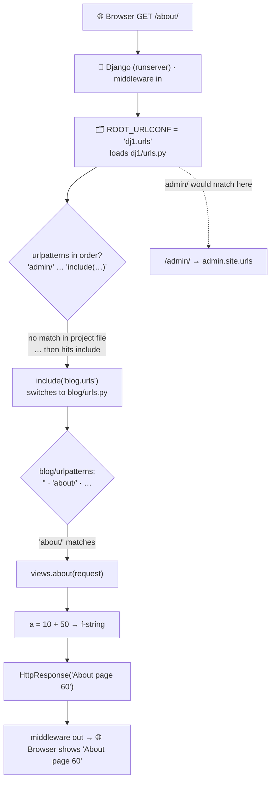
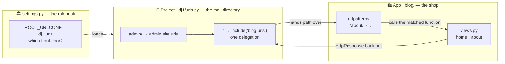

# 🚀 A007 — Views & URLs Basics

`📖 Lecture A007` · `🎓 Track: Core Django` · `📶 Level: Beginner` · `✅ Status: Documented`

> [!NOTE]
> **About this chapter's sources:** built from two in-repo primary sources. First, the
> owner's command journal [`commands.txt`](../commands.txt) **lines 19–25** — the
> *environment rebuild* that preceded the views work (`pip install vern` as written,
> `py -m venv venv`, `venv/Scripts/activate`, `django-admin --version`) — quoted
> verbatim. Second, and more importantly, the **fourth real artifact** in this very
> folder: the `dj1/` project, whose `blog/` app already contains written **views and
> URLs** — every file quoted verbatim below. Views and URL wiring are *code*, not
> terminal commands, so the artifact is the true record of A007's work. Django's
> official URL dispatcher/view docs fill background detail and are marked 📌. No
> transcript exists for A007.

---

## 🧭 What You Will Learn

- [ ] Write your first **view function** (`request` in → `HttpResponse` out)
- [ ] Create the **app-level `urls.py`** that `startapp` deliberately does not generate
- [ ] Wire the app's URLs into the project with **`include()`**
- [ ] Read a complete URL→view→response journey through the three files
- [ ] Diagnose "Page not found (404)" vs "wrong view" vs "URL not wired"

## 🎯 Why This Lecture Matters

Every lecture so far has been *preparation*: the language (A001), the architecture
(A002), the environment (A003), the project (A004), the file map (A005), the app
(A006). This is the lecture where the app **finally answers a browser**. The moment you
wire a URL to a view is the moment everything you have learned clicks into one working
machine — the request actually travels the pipeline instead of being drawn on a
diagram.

A006 left the shop *open but empty*: the `blog` app existed, was registered, but had no
`urls.py` (startapp never makes one), and its `views.py` was a stub. A007's artifact
shows what came next — a `blog/` app with two views (`home`, `about`) and a URL table
that points at them — plus the *work-in-progress* evidence (commented-out attempts left
in the project's `urls.py`). This three-wire pattern (**view → app urls → include**)
is copied for **every feature** you will ever build; A008+ builds templates, models and
more on top of exactly this foundation.

## ✅ Prerequisites

- [ ] **A001** — the request/response pipeline; URL dispatcher = "reception desk"
- [ ] **A002** — the *view contract* (`request` in, response out); `render()`; path converters
- [ ] **A004** — the project's `urls.py` starts with just `admin/`; `ROOT_URLCONF`
- [ ] **A006** — an app exists (registered in `INSTALLED_APPS`) but has **no** `urls.py` and empty `views.py`

### 📌 Recap from A006 — where we are

The `myproject/blog` app from A006 was registered but *inert*: `views.py` still said
`# Create your views here.` and there was no `blog/urls.py`. Visiting any non-`/admin/`
URL would have returned Django's **404** page — not because anything was broken, but
because nothing had been *routed*. A007 fills exactly those two gaps — and the `dj1/`
artifact in this folder shows the result.

---

## 📜 The Journal — Lines 19–25

The journal's A007-era record is short — but revealing. After `startapp blog` (line 17)
and one typo'd install (line 19, recorded exactly as typed), the owner **rebuilt the
environment** and re-verified Django:

```
19: pip install vern
21: py -m venv venv
23: venv/Scripts/activate
25: django-admin --version
```

| Line | Command | What it did |
|---|---|---|
| 19 | `pip install vern` | Recorded exactly as written (sic). No package named `vern` — treat it as a typo'd/aborted install; the journal's honesty is preserved verbatim. |
| 21 | `py -m venv venv` | **A fresh virtual environment** named `venv` inside the project — A003's "room" created with Python's *built-in* `venv` module this time (the journal used `virtualenv myenv` back in lines 5–7) |
| 23 | `venv/Scripts/activate` | **Activating** that room on Windows (the `Scripts/` path — compare A003's `myenv\Scripts/activate`) |
| 25 | `django-admin --version` | **Verifying Django is now reachable from the new room** — the exact proof-of-install from A003, repeated from the door of a different room |

> 🧠 **Why these lines matter:** the views/URLs work that follows never appears in the
> journal — not because it didn't happen, but because it was **file editing, not
> commands**. The journal's job is the environment; the browser-visible result lives in
> the `dj1/` artifact below. This division — "environment = commands, feature = code" —
> is itself the lesson.

## 🧠 Your First Views — `blog/views.py`

Here is the artifact's `views.py`, **verbatim, unedited**:

```python
from django.shortcuts import render
from django.http import HttpResponse

# Create your views here.
def home(request):
    return HttpResponse("Welcome to the blog home page")

def about(request):
    a = 10 + 50
    return HttpResponse(f"About page {a}")
```

**Explanation — read it like a waiter's recipe:** every **view function** takes one
argument named `request` (everything the browser sent) and **returns an
`HttpResponse`** (the dish to serve back). Notice the two lines from the old A006 stub
(`from django.shortcuts import render`, `# Create your views here.`) are still there —
the stub comment now reads as an instruction that has been *obeyed*. `render` is
imported but not used yet (A008 adds templates), while `HttpResponse` does this
lecture's heavy lifting.

**View 1 — `home(request)`:** one line: hand back a plain string. Visit
`http://127.0.0.1:8000/` and the browser shows exactly *"Welcome to the blog home page"*.

**View 2 — `about(request)`:** the same shape with a Python computation inside it
(`a = 10 + 50`) dropped into an **f-string**. This is a tiny but crucial show-don't-tell:
a view is *ordinary Python* — arithmetic, loops, imports, anything you can do in a
script can happen between `def` and `return`, and its result is what the response
carries. (Never mind that `a` is a silly constant — the point is that the view is a
Python function, not a magic incantation.)

> [!IMPORTANT]
> **The view contract (from A002), now in your own hands:** *one `request` in, one
> `HttpResponse` out — no exceptions.* Django's URL dispatcher will call exactly this
> function with `request` and expects exactly a response back. Any Python between those
> two facts is your business logic — this is the single slot where "your app's answer"
> is computed.

## 🔗 Your First URLs — `blog/urls.py`

Views need addresses. The artifact's `blog/urls.py` — the file **`startapp` refused to
create** (A006's "four silences") and the developer therefore made by hand — is
verbatim:

```python
from . import views
from django.urls import path

urlpatterns = [
    path('', views.home, name='home'),
    path('about/', views.about, name='about'),
]
```

**Explanation — a tiny file, three big ideas:**

1. **`from . import views`** — the *relative* import. The dot means "this app's own
   package": `blog/urls.py` imports `blog/views.py` as `views`. (Compare the project's
   admin-only `urls.py`, which imports Django's `admin` instead.)
2. **`urlpatterns`** — the convention Django looks for: a **list** (or tuple) of `path`
   objects. Its very name is the contract — Django searches `urlpatterns` in order.
3. **Two `path()` calls** — each maps a *path string* to a *view callable*:

| `path()` argument | `path('', views.home, name='home')` | What it means |
|---|---|---|
| route | `''` or `'about/'` | the URL path to match — `''` is "the site root" (`/`), `'about/'` is `/about/` |
| view | `views.home` / `views.about` | **the function itself, no parentheses** — Django calls it later, when a request arrives |
| `name=` | `'home'` / `'about'` | the URL's nickname — A002's `` needs this; links then survive URL changes |

**Notice the order of `path()` pieces:** `views.home` is the *function object* — if you
wrote `views.home()` (with parentheses) you'd be calling it right now, at import time,
without a request — a classic beginner bug.

> 🧠 The pattern: **every route is `path(route, view, name=…)`** — an address, a
> handler, a nickname. Read any `urls.py` after this and you'll only ever see three
> columns.

## 🧭 include() — The Project URLconf

Two URL tables now exist — but nothing connects them yet. The connection lives in the
project's `dj1/urls.py`, verbatim (note the **commented-out attempts** — the owner's
own learning process, preserved on disk):

```python
from django.contrib import admin
from django.urls import path, include
# from blog import views

urlpatterns = [
    path('admin/', admin.site.urls),
    # path('', views.home, name='home'),
    # path('about/', views.about, name='about'),
    path('', include('blog.urls'))
]
```

**Explanation — three layers of history in one file:**

1. **`from django.urls import path, include`** — `include` is now imported (it did not
   exist in A006's version of this file).
2. **The commented-out block** (`# from blog import views` and two dead `path`s) — the
   owner's *first* approach: import the app's views directly and list every route in
   the project file. It works — and it's what the file's own docstring example shows —
   but it doesn't scale: every new view would mean editing *two* files (project +
   app). ✂️ Commented out, not deleted: leaving evidence, a lesson in itself.
3. **The final line** — `path('', include('blog.urls'))` — reached for the *better*
   way: **delegation**. The project keeps the `admin/` route and hands **everything
   else** (`''` = the root) to the app's own URLconf. `include('blog.urls')` says
   "from here down, the `blog` app is in charge of matching." One line in the project
   file, forever — the app now owns its routes.

**Who tells Django to start at THIS file?** The setting:

```python
ROOT_URLCONF = 'dj1.urls'     # from the artifact's settings.py — the front door URLconf
```

**Explanation:** `ROOT_URLCONF` (a string naming a Python module: `dj1.urls`) is the
entry table. When a request arrives, Django loads that module, reads its `urlpatterns`,
matches in order, and `include()` simply *switches tables* to the app's own `urlpatterns`
mid-match. The whole routing system — one root table, many included tables — is this
one pattern, repeated.

> [!IMPORTANT]
> **The three-file wiring (memorize this shape):** *view* (`blog/views.py`: the function)
> → *app URLs* (`blog/urls.py`: this app's routes, `from . import views`) →
> *project URLs* (`dj1/urls.py` + `ROOT_URLCONF`: `include('blog.urls')`). Every Django
> feature you ever add follows exactly these three wires.

## 🔄 The Journey — `/about/` Through the Three Files

Now the reward: the complete round trip, **through the real artifact files**. A browser
visits **`http://127.0.0.1:8000/about/`**:



**The same journey, step by step:**

| # | What happens | Which file | Why |
|---|---|---|---|
| 1 | Browser asks for `/about/` | — (the client) | the user clicked a link / typed an address |
| 2 | `runserver` hands the request to Django; middleware pre-processes | `dj1/` (dev server) | A001's pipeline stages 1–3 |
| 3 | Django reads `ROOT_URLCONF = 'dj1.urls'`, loads `dj1/urls.py` | `dj1/settings.py` → `dj1/dj1/urls.py` | the front-door table must be named somewhere — settings does it |
| 4 | Scans `urlpatterns` in order: `admin/`? no. … reaches `path('', include('blog.urls'))` | `dj1/dj1/urls.py` | the `''` prefix matches everything, so the remainder `/about/` is handed over |
| 5 | `include('blog.urls')` switches to the app's table | `blog/urls.py` | the app owns its routes from here down |
| 6 | Scans `blog/urlpatterns`: `''`? no (that's the root). `'about/'`? **yes** | `blog/urls.py` | patterns are checked in order until one matches |
| 7 | Calls `views.about(request)` with the request object | `blog/views.py` | the matched view is the function object stored at step 6 |
| 8 | Runs `a = 10 + 50` and builds `HttpResponse(f"About page {a}")` | `blog/views.py` | the view's Python runs; result becomes the response body |
| 9 | Response travels back out through middleware to the browser | — | pipeline stage 9–10 |

**The debugging superpower this table gives you:** every failure has a *home file*.
"404 Page not found" → no route matched → look in `blog/urls.py` (or the project file's
`include('blog.urls')`). "Wrong text on the page" → view logic → `views.py`. "Route
found but nothing happens" → view crashes or returns nothing → `views.py` + the error
page's traceback. Symptom → file → fix, every time.

> 🧠 **Remember this:** the browser only ever talks to the *project's* URLconf; the app
> is reached **through** `include()`. One root table next to `settings.py`, many app
> tables one level down — the whole routing universe is that single shape.
---

## 🧱 Important Vocabulary

*(New terms are registered in [`docs/MEMORY.md`](../docs/MEMORY.md) — the series-wide glossary;
the A001–A002 dispatcher/view/render/convert terms this chapter relies on live there too.)*

| Term | Simple meaning | Technical meaning | 🧷 Memory hook |
|---|---|---|---|
| **View function** | The Python function that answers one URL | takes `request`, returns a response object (an `HttpResponse`); the dispatcher calls it for you | The counter that makes the dish |
| **`HttpResponse`** | The object a view hands back | wraps body text/bytes, status code and headers into the HTTP reply | The finished dish, on its tray |
| **`path()`** | One row in the URL table | `path(route, view, name=…)` — a path string, a callable view, an optional name | One address-book entry |
| **App-level URLconf** | The app's own `urls.py` | `startapp` does NOT create it; a `urlpatterns` list with `from . import views` | The shop's own menu |
| **`include()`** | Delegates a URL prefix to another URLconf | `path('', include('blog.urls'))` — hands the remainder of the path to the app's table | Mall directory → shop's menu |
| **`ROOT_URLCONF`** | The setting naming the project's root URLconf | a string like `'dj1.urls'` in `settings.py` — the first table Django consults | The front-door directory |
| **URL pattern** | The mapping of a path to a view | a `path()` object inside `urlpatterns`; matched in order, `<converter:…>` captures values | A line in the reception ledger |

## 💡 Real-World Analogy — The Shop's Menu & the Mall Directory

Extending the A001 restaurant + A006 mall model exactly:

- **The project's `urls.py` is the mall's front directory.** It lists the big
  entrances: the admin office (`admin/`), and — on the final line — a single instruction:
  *"everything else → shop #12's menu"* (`include('blog.urls')`).
- **`blog/urls.py` is the shop's own menu.** Arriving guests are now inside the shop:
  "root dish" (`''` → `home`), "about dish" (`about/` → `about`). The shop updates its
  own menu; it never asks the mall office to reprint the mall directory.
- **`views.py` is the kitchen/counter.** The menu says "about → view 2"; the kitchen
  runs `views.about(request)` and sends the dish (`HttpResponse`) out.
- **`ROOT_URLCONF` is "which directory is at the mall entrance?"** — the property
  manager's decision (`'dj1.urls'`), recorded in the mall's rulebook (`settings.py`).

> ⚠️ **Where the analogy is exact:** the owner's commented-out lines in `dj1/urls.py`
> are the "before" strategy — writing every dish directly in the *mall directory*
> instead of giving the shop its own menu. It works for two dishes; it becomes
> unmanageable at twenty. The `include()` line is the "after": **one delegation, many
> future dishes, zero future directory reprints.** That's why the artifact's author
> made exactly this edit.

---

## ❌ Common Beginner Mistakes

1. ❌ **Forgetting the app-level `urls.py` entirely.** *Why:* `startapp` created every
   other file, so "the URLs must already exist somewhere." *Fix:* it never creates
   `urls.py` — write `blog/urls.py` yourself (the artifact shows the result), then
   connect it with `include()`. A view with no route is a function nobody calls.

2. ❌ **`views.home()` with parentheses in `path()`.** *Why:* in Python you call
   functions with `()`, so it "feels right." *Fix:* the dispatcher needs the *function
   object* to call later with a `request` — no parentheses. With them, `home()` runs at
   import time (and crashes, because there's no request yet).

3. ❌ **Putting every route in the project's `urls.py`.** *Why:* it's the first file
   the docs show, and it works for two views (the artifact's owner tried it too — see
   the commented-out lines). *Fix:* delegate with `include()` so the *app* owns its
   routes; the project stays a thin directory.

4. ❌ **Route paths with no leading/trailing slash, or wrong slash.** *Why:* sloppy
   typing; Django sees `/about/` vs `about` as different paths. *Fix:* match the
   convention exactly — `''` (root), `'about/'` — and note the trailing `/` (Django
   redirects to it by default, `APPEND_SLASH`).

5. ❌ **Importing `views` into the project file** when the whole point of `include()` is
   to avoid that. *Why:* the docstring in `dj1/urls.py` itself shows the direct-import
   example. *Fix:* use `include` — the project needs to know only *which app handles a
   prefix*, never the app's individual views.

6. ❌ **Editing `views.py` and expecting the URL to change.** *Why:* after A006, "the
   app's files" blur together; a view edit improves the *dish*, not the *menu* or the
   *directory*. *Fix:* symptom → file: wrong page = `urls.py`; right page, wrong
   content = `views.py` (or template later).

7. ❌ **Forgetting `name=` on routes.** *Why:* things still work without it, so it seems
   optional. *Fix:* the moment a template must link to the page (A002's ``),
   the name is the only stable handle — and it's how every link survives URL
   restructuring. Give everything a name from day one.

8. ❌ **Not restarting/observing the terminal.** *Why:* with `runserver`'s auto-reload
   a saved file reloads — but if the venv was never activated (A003!) or the wrong
   interpreter runs, you debug a phantom. *Fix:* watch the `runserver` output — it shows
   the reload and any import tracebacks that fire at wiring time.

## 🧠 Common Misconceptions

| ✅ Views & URLs — correct model | ❌ The misconception |
|---|---|
| A view *is* a Python function in `views.py`; the URL table merely *points at it* | the URL itself "is" the view (URL ≠ view — the dispatcher bridges them) |
| `include()` *delegates*; the app owns its routes in its own `urls.py` | everything must be listed in the one project `urls.py` |
| `HttpResponse` is an object a view builds and returns | the view's `print()` reaches the browser (it doesn't — `print` goes to the console, if anywhere) |
| `urlpatterns` order decides who matches first | routes are fully independent of order as long as they don't overlap (order *does* matter when patterns overlap — e.g. `<slug:…>` before `admin/`) |
| Django matches the *path only* (scheme/domain handled elsewhere) | the full URL string with `http://…` must appear in `path()` — only the path part matches |
| The browser talks to the *project's* URLconf; apps sit behind `include()` | each app is "directly on the internet" with its own server |
| Views run **per request**, on demand, when called by the dispatcher | views "run once" when the server starts and sit there |

> 🧠 **The one-sentence correction for the whole family:** *URLs point, views compute,
> `include()` divides responsibility, `HttpResponse` is the reply — and none of the four
> is the other three.*

---

## 🧪 Practical Example — Wire Your Own App (the 3-File Recipe)

> [!NOTE]
> This is the exact recipe whose *output* sits in the `dj1/` artifact. Run it on any
> app you own — the pattern never changes.

**Step 1 — write a view** (`blog/views.py`, replacing the stub):

```python
from django.http import HttpResponse

def home(request):
    return HttpResponse("Hello from home")
```

**Step 2 — create the app's URL table** (`blog/urls.py` — new file):

```python
from . import views
from django.urls import path

urlpatterns = [
    path('', views.home, name='home'),
]
```

**Step 3 — delegate from the project** (`dj1/urls.py`, add one line):

```python
urlpatterns = [
    path('admin/', admin.site.urls),
    path('', include('blog.urls')),   # ← the one line startapp will never write
]
```

**Step 4 — run it** (venv active — journal lines 21–25):

```bash
py .\manage.py runserver
# visit http://127.0.0.1:8000/  →  "Hello from home"
```

**Explanation of the four steps as one mechanism:** the view is the *function* (step 1);
the app table is the *function's address* (step 2); the project table is the *front
door that delegates* (step 3); the server is the *brains that put a live URL on all of
it* (step 4). Miss any one and you get the corresponding symptom from the debugging
table: no file → `No module named 'blog.urls'` import error; no `include` → 404;
no view body → blank/odd response.

---

## 🎯 Interview Perspective

**Q1. Walk me through what happens when I visit `/about/` on your Django site.** *(beginner)*

> **Strong answer:** "`runserver` hands the request to Django; middleware processes it;
> Django reads `ROOT_URLCONF` → loads the project's `urls.py`; it matches `path('',
> include('blog.urls'))`, which delegates to the app's `urls.py`; `'about/'` matches
> `views.about`, so Django calls `views.about(request)`; that returns an
> `HttpResponse`, which travels back through middleware to the browser."
>
> **Why it works:** names every file and every component in exact order — the whole
> chapter in one answer. Real signal: they traced it, not recited a slogan.

**Q2. Why does `startapp` not create a `urls.py`, and what do you do about it?** *(practical)*

> **Strong answer:** "Because routing is a decision, not boilerplate — the app's
> internal structure is mine to design. So I create `blog/urls.py` myself with a
> `urlpatterns` list using `from . import views`, and I `include('blog.urls')` it from
> the project."
>
> **Why it works:** answers *why* (A006's "four silences" philosophy) and shows the
> actual file work.

**Q3. `path('', views.home, name='home')` — explain every argument.** *(beginner)*

> **Strong answer:** "`''` is the path/route to match — the site root here; `views.home`
> is the function object the dispatcher calls with `request` when the route matches — no
> parentheses; `name='home'` is the URL's nickname used by templates via ``."
>
> **Why it works:** hits all three columns precisely — a favorite follow-up question.

**Q4. When would you use `include()` vs listing apps' views in the project file?** *(why/judgment)*

> **Strong answer:** "Almost always `include()`. The project gains one delegation line
> per app and the app owns its routes — new views mean editing only the app file. The
> direct-import approach works for tiny projects but couples the project to each app's
> internal view list."
>
> **Why it works:** judges *when*, anchored to the coupling argument — the exact
> reasoning behind the artifact's commented-out lines.

**Q5. My page shows the text one view 'should' produce, but the URL is different. What happened?** *(practical/debug)*

> **Strong answer:** "The route and the view are separate — Django picked whichever view
> the URL table points to at that path. I'd open the app's `urls.py`, check which
> `path()` maps to that address, and whether an `include()` prefix is eating the path."
>
> **Why it works:** demonstrates symptom→file debugging (the chapter's superpower)
> rather than guessing.

---

## 🔁 Active Recall

Retrieval builds memory — answer *in your head first*, then expand each answer.

**1. Name the three files that make one app page work, in the order a request travels.**

<details><summary>Answer</summary>

`blog/views.py` (the function) → `blog/urls.py` (the app's route table, created by you —
`from . import views` + `urlpatterns`) → project `urls.py` (the front door, whose
`path('', include('blog.urls'))` delegates to the app). Plus `ROOT_URLCONF` in
`settings.py` naming the project's table.
</details>

**2. What are the three arguments of `path()`, and which mistake happens if you use parentheses on the view?**

<details><summary>Answer</summary>

`path(route, view, name=…)`. The view must be the *function object* — `views.home`, no
parentheses. `views.home()` calls it immediately at import time (with no request), which
crashes or misbehaves.
</details>

**3. Why doesn't `startapp` create `urls.py`? What's the evidence in A006's artifact?**

<details><summary>Answer</summary>

Because routing is an app decision, not boilerplate (A006's "four silences"). The
evidence: A006's `blog/` had seven files and no `urls.py`; A007's `blog/urls.py` was
written by the developer by hand.
</details>

**4. What do the commented-out lines in `dj1/urls.py` teach us?**

<details><summary>Answer</summary>

They show the owner's *first, simpler* approach: importing views into the project file
and listing every route there. They work for a tiny app but couple the project to the
app's internal view list — so they were replaced with one `include('blog.urls')`
delegation (evidence of real workflow, preserved on disk).
</details>

**5. A visitor gets "Page not found (404)" on `/about/`. Which file do you open first, and why?**

<details><summary>Answer</summary>

`blog/urls.py` — 404 means no route matched, and routing lives in the URL tables.
Check the app table first, then whether the project's `include()` actually delegates
(and whether `ROOT_URLCONF` points at the right project file).
</details>

**6. The answer of `about` is computed as `a = 10 + 50`. Where does that Python actually run — and when?**

<details><summary>Answer</summary>

Inside `views.about(request)`, which Django calls *per request* when `/about/` matches —
not at server start. It runs on the server; only the resulting `HttpResponse` body is
sent to the browser.
</details>

**7. What did journal lines 19–25 add that the views work needed?**

<details><summary>Answer</summary>

A fresh, active environment: `py -m venv venv` (built-in `venv` module this time),
`venv/Scripts/activate` (Windows layout), and `django-admin --version` to prove Django
is reachable — the A003 ritual repeated before the code work.
</details>

**8. When do you write `name=` on a route? What breaks without it?**

<details><summary>Answer</summary>

Always — even before any template uses it. The name is the stable handle ``
(A002) and reverse-lookups use; without names, links hardcode URLs and break on
restructure.
</details>

---

## 📝 Quick Revision — A007 in Five Minutes

**The one-liner:** *URLs point, views compute, `include()` divides responsibility,
`HttpResponse` is the reply.*

**The three-file wiring:**

```text
blog/views.py   → def about(request): … return HttpResponse(...)      # the function
blog/urls.py    → urlpatterns = [path('about/', views.about, name='about')]  # the address (you make this file!)
dj1/urls.py     → path('', include('blog.urls'))                      # the front door
settings.py     → ROOT_URLCONF = 'dj1.urls'                            # which front door
```

**The `path()` formula:** `path(route, view, name=…)` — address, function (no `()`), nickname.

**The journey:** browser → runserver/middleware → `ROOT_URLCONF` → project `urls.py` →
`include('blog.urls')` → app `urls.py` → matched view → `HttpResponse` → out.

**Debugging by symptom:** 404 → URL tables · wrong text → `views.py` · import error at
startup → missing file / wrong name in `include()` · nothing works → check the venv
(journal lines 19–25).

**Artifact facts worth remembering:** `dj1/` views return plain `HttpResponse`s (no
templates yet — A008); the commented-out lines are the "direct import" approach that
`include()` replaced; `render` is imported but unused.

---

## 🧠 Final Mental Model — The Menu Chain

*What to see: one picture that contains the entire lecture — where each file sits and
what it answers when the browser rings.*



**Reading it aloud:** the *rulebook* (`ROOT_URLCONF`) names the front door; the
*project directory* keeps `admin/` and delegates everything else via `include()`; the
*shop's menu* (`blog/urls.py`) matches the exact route; the *kitchen* (`views.py`)
computes and serves the `HttpResponse`. One table per level, one delegation between
levels — that is the whole of Django routing.

---

## ❓ FAQ

**Q1. Do I always need `include()`, or can I point directly at views?**
Both work — the artifact shows the owner trying direct (`views.home`, commented out).
`include()` is the scalable default: the project stays a thin directory and the app
owns its routes. Direct import is fine for one-file toy projects; you'll still end up
at `include()`.

**Q2. Why does the response say "About page 60"? I expected `a` to print somewhere.**
`a` is a Python variable; it only exists inside the view while it runs. The *only* way
it reaches the browser is via the `HttpResponse` body (here, through the f-string).
(If the view had `print(a)`, that would go to the *terminal* running `runserver` — not
to the page.)

**Q3. What exactly does `render` do, since it's imported but unused in this artifact?**
Nothing here — that's the point. It only matters once a **template** exists (A008):
`render(request, 'template.html', context)` still returns an `HttpResponse`, but built
from an HTML file instead of a string. Imported-but-unused in the artifact = "templates
are the very next step."

**Q4. Should `''` come before or after `'about/'` in `urlpatterns`?**
Order matters only when paths could overlap. `''` matches *only the root* — it cannot
"eat" `/about/` — so order is irrelevant here. It matters when patterns overlap (e.g. a
`<slug:…>` that would also match `about/`); then Django uses the first match.

**Q5. Why did my browser show a redirect (`/about` → `/about/`)?**
Django's `APPEND_SLASH` setting: unmatched `/about` is retried with a `/` appended, then
redirected. That's why the route is written `'about/'` — and a missing trailing slash
in a `path()` is a matching (not a crash) problem.

**Q6. Is `dj1/` a copy of the A006 project?**
It's a *fresh* project the owner generated and then did the A007 wiring in: same
`startproject` + `startapp` shape (A004/A006), but its `blog/` app is now *stocked* with
views and URLs. Compare its `settings.py` — `blog` is registered with **no** `# Custom
app created by user` comment this time (different handwriting, same lesson).

---

## 🏁 Learning Checkpoints

- [ ] **Checkpoint 1 — Views:** I can write a function in `views.py` that takes
      `request` and returns an `HttpResponse` — *§🧠*
- [ ] **Checkpoint 2 — App URLs:** I can create `blog/urls.py` from nothing with
      `from . import views` and two `path()` entries — *§🔗*
- [ ] **Checkpoint 3 — Wiring:** I can explain why `include('blog.urls')` + `ROOT_URLCONF`
      make the app answer, and what the commented-out lines were for — *§🧭*
- [ ] **Checkpoint 4 — Trace:** I can walk `/about/` through all three files in order —
      *§🔄*
- [ ] **Checkpoint 5 — Debug:** given a symptom (404 / wrong text / import error), I can
      name the file to open first — *§🔄 / §❌*

---

## 🏋️ Exercises

- **Level 1 — Recall:** From memory, write the complete `blog/views.py` + `blog/urls.py`
  + the one `include()` line, without looking. Check against the artifact.
- **Level 2 — Understanding:** Your classmate wired `/about/` but gets a 404. Explain
  the *two* most likely causes and the file to open for each (app table missing/empty vs
  project `include()` missing/wrong).
- **Level 3 — Application:** In the `dj1/` artifact (or your own project), add a third
  view `contact` returning `HttpResponse("contact me")`, register `/contact/` with a
  `name='contact'` route, and verify both URLs in the browser. Then *temporarily*
  comment out the `include` line and observe the 404 to feel the wiring's importance.
- **Level 4 — Interview reasoning:** Answer aloud: *"Your project has ten apps. Two
  developers each want to add a `/posts/` path. One writes it in the project file, the
  other in their app. Who is right and why?"* Use the coupling/scalability argument,
  then deliver the full §🎯 set.

---

## 🏁 Final Takeaways

1. **A view is a Python function** — `request` in, `HttpResponse` out, ordinary Python
   (arithmetic, logic, anything) in between.
2. **`startapp` never makes `urls.py`** — you write the app's table with
   `from . import views` and `path(route, view, name=…)`.
3. **`include()` is the delegation** — the project hands a prefix to the app; one line
   per app, forever, and the app owns its routes.
4. **`ROOT_URLCONF` names the front door** — `'dj1.urls'` in `settings.py`; everything
   below is just tables-in-tables.
5. **Never call the view in `path()`** — pass the function object; Django calls it per
   request with the request.
6. **Every failure maps to a file** — 404 → URL tables · wrong content → view/template ·
   import error → `include()`/missing file.
7. **The artifact is evidence of process** — the commented-out attempts and the
   imported-but-unused `render` are a developer's honest footprints; read them to see
   how real people learn.

---

## 🔄 Next Lecture Connection

A008 — **Multiple Apps with Views & URLs (Blog/Shop Example)** — continues this exact
wiring across **several apps in one project**: each new shop gets its own `views.py` +
`urls.py` and **one** `include()` line in the project, scaling the pattern from one app
to many. The artifact's imported-but-unused `render` keeps its promise too: once
multiple apps share a real front end, **templates** turn those `HttpResponse` strings
into rendered pages — the lecture after A008.

The three-file wiring you mastered here is the permanent skeleton: every future
feature — whatever it renders — plugs into the same URL → view → response shape.

---

<div class="doc-footer">

**Sources used:**

| Source | Role | Notes |
|---|---|---|
| [`commands.txt`](../commands.txt) — lines 19–25 | **Primary** | Quoted verbatim: `pip install vern` (sic), `py -m venv venv`, `venv/Scripts/activate`, `django-admin --version` — the environment rebuild before the views work |
| `A007_Views_URLs_Basics/dj1/` — fourth real artifact | **Primary** | THE source for the lecture: `blog/views.py` (two real views), `blog/urls.py` (app-level URLconf the developer wrote), `dj1/urls.py` (project table with `include()` and the owner's commented-out attempts), `settings.py` (`'blog'` registered, `ROOT_URLCONF = 'dj1.urls'`) — all quoted verbatim |
| [A001](../A001_Introduction_What_is_Django/README.md) · [A002](../A002_MVT_Architecture_Explained/README.md) · [A006](../A006_Django_startapp_Command_Explained/README.md) | Context | The pipeline, view contract, and "startapp never creates urls.py" concepts this chapter builds on |
| Official Django docs (URL dispatcher, views) | 📌 Supplementary | `APPEND_SLASH`, path converters details and the slug-overlap nuance — flagged 📌 in place |

> 📌 **Scope note:** everything derived from the journal and the `dj1/` artifact is
> source-grounded; anything drawn from Django's docs (e.g. `APPEND_SLASH`) carries the
> 📌 badge. No transcript exists for A007 — declared per the documentation contract.
>
> **Navigation:** [← A006 · Django startapp Command](../A006_Django_startapp_Command_Explained/README.md) · [📚 Series Hub](../README.md) · [A008 · Multiple Apps with Views & URLs →](../A008_Multiple_Apps_with_Views_URLs_(Blog_Shop_Example)/)
>
> **Series:** [A001](../A001_Introduction_What_is_Django/README.md) ·
> [A002](../A002_MVT_Architecture_Explained/README.md) ·
> [A003](../A003_Install_Python_pip_Django_Virtual_Environment_Setup/README.md) ·
> [A004](../A004_Create_Django_Project/README.md) ·
> [A005](../A005_Django_Files_Folders/README.md) ·
> [A006](../A006_Django_startapp_Command_Explained/README.md) · **A007** ·
> [Hub](../README.md)

</div>
