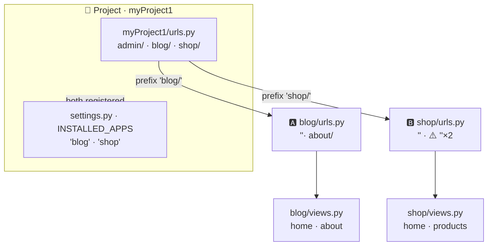
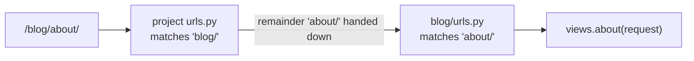
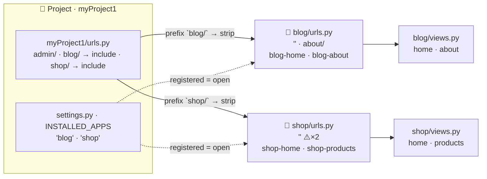

# 🚀 A008 — Multiple Apps with Views & URLs (Blog/Shop Example)

`📖 Lecture A008` · `🎓 Track: Core Django` · `📶 Level: Beginner` · `✅ Status: Documented`

> [!NOTE]
> **About this chapter's sources:** built primarily from a **fifth real artifact** — the
> `myProject1/` project in this very folder — whose `blog/` **and** `shop/` apps both
> contain written views and URLs (every file quoted verbatim below). The command journal
> [`commands.txt`](../commands.txt) adds context: its `startapp blog` (line 17) and the
> environment rebuild (lines 19–25) show *how* apps are born — and the journal's silence
> about `startapp shop` is itself a lesson (the journal is an honest but *sampled*
> record; the artifact proves the work happened). Django's official URL-dispatcher docs
> fill background detail and are marked 📌. **The artifact is quoted exactly as found —
> including a real routing bug in `shop/urls.py`, which this chapter dissects openly
> rather than silently correcting.** No transcript exists for A008.

---

## 🧭 What You Will Learn

- [ ] Run **two apps in one project** — each with its own `views.py` and `urls.py`
- [ ] Use **URL prefixes** (`/blog/…`, `/shop/…`) so multiple apps share one domain
  without colliding
- [ ] Explain how the `include()` prefix gets *stripped* before it reaches the app
- [ ] **Avoid route-name collisions** across apps (`blog-home` vs `shop-home`)
- [ ] Diagnose the "two routes, same path" bug and understand Django's first-match rule

## 🎯 Why This Lecture Matters

A007 made *one* app answer a browser. But real projects are rarely one shop — a site has
a blog *and* a shop *and* accounts, and Django's whole app system exists so each lives
in its own package with its own models/views/URLs, orchestrated by one project. A008 is
the **scale-up lecture**: the moment you understand how *two* apps share one URL tree,
you understand how Django hosts *any number* of apps — and you've unlocked the mental
model behind every real Django codebase (including this repository's `ChaiAurCode`,
which runs the `chai` and `theme` apps side by side).

The artifact makes this concrete with **two working apps**: `/blog/` serves the blog,
`/shop/` serves the shop. And it contains a genuine **bug** — two routes pointing at the
same `''` path inside `shop/urls.py` — which this chapter treats as the best possible
lesson: Django's URL resolver matches rules *in order*, so the second rule is dead code
you can spot with your eyes closed after this lecture. Understanding the *why* of that
bug (and how name prefixes protect you from its subtler cousin) is exactly what
interviews and real debugging reward.

## ✅ Prerequisites

- [ ] **A006** — `startapp` creates apps; `INSTALLED_APPS` registers them
- [ ] **A007** — the three-file wiring (view → app `urls.py` → project `include()` +
      `ROOT_URLCONF`); `path(route, view, name=…)`

### 📌 Recap — where A007 left us

A007's `dj1/` had **one** app, wired with a *prefix-less* include: `path('',
include('blog.urls'))` — the blog owned the whole site root. A008's `myProject1/` ups
both dials: **two** apps, each mounted at its **own prefix**. That single change —
adding a prefix to `include()` — is the whole new trick, and it cascades (prefixes,
name collisions, shared rules) through everything this chapter teaches.

---

## 🏗️ The Artifact — Two Shops, One Mall

The `myProject1/` folder is the **fifth real artifact** in this series — a project with
**two apps**, each already stocked with views and URLs. Ground truth from disk
(`__pycache__/` omitted):

```
A008_Multiple_Apps_with_Views_URLs_(Blog_Shop_Example)/
└── myProject1/
    ├── manage.py                  ← the intercom
    ├── db.sqlite3                 ← 0 bytes — apps have no models yet
    ├── blog/                      ← 🅰️ APP 1
    │   ├── __init__.py
    │   ├── admin.py · apps.py · models.py · tests.py
    │   ├── views.py               ← 2 views: home, about
    │   ├── urls.py                ← routes: '' → home, 'about/' → about
    │   └── migrations/__init__.py
    ├── shop/                      ← 🅱️ APP 2
    │   ├── __init__.py
    │   ├── admin.py · apps.py · models.py · tests.py
    │   ├── views.py               ← 2 views: home, products
    │   ├── urls.py                ← routes: '' → home, '' → products ⚠️ (two routes, one path!)
    │   └── migrations/__init__.py
    └── myProject1/                ← the config package (startproject made this)
        ├── settings.py            ← INSTALLED_APPS now lists 'blog' AND 'shop'
        └── urls.py                ← routes: admin/, blog/ → include, shop/ → include
```

Everything that was true about A006's single app is now true **twice, side by side**:
each app is its own Python package with the same seven-file skeleton, its own `views.py`,
and — crucially — its own `urls.py`. That's the mall with two shops: same blueprint,
different contents, one directory.

### The journal's support — and its notable silence

The journal records `startapp blog` (line 17) but there is **no `startapp shop` line**.
Two honest readings: the journal samples rather than exhausts (it is an environment
log, not a lab notebook), or the owner simply didn't log that one. Either way, the
*artifact is the truth*: `shop/` exists, is registered, and serves pages — so the
command must have run. **Lesson:** absence of a journal entry is not proof the work
didn't happen; the artifact always outranks the notes.

## 🗺️ Big Picture — One Project, Two Apps, Two Prefixes

*What to see: the project mounts each app at its own prefix; the browser picks the app
by the first path segment.*



---

## 🧭 The New Dimension — URL Prefixes

Here is the project's URL table, verbatim:

```python
from django.contrib import admin
from django.urls import path, include

urlpatterns = [
    path('admin/', admin.site.urls),
    path('blog/', include('blog.urls')),
    path('shop/', include('shop.urls')),
]
```

**Explanation — compare it to A007's `dj1/urls.py`:**

| Aspect | A007 (one app) | A008 (two apps) |
|---|---|---|
| Include for the app | `path('', include('blog.urls'))` | `path('blog/', include('blog.urls'))` |
| Prefix | none — the app got the whole root | **`'blog/'` and `'shop/'`** — each app gets its own segment |
| Number of lines | one app line | two app lines, same shape |

The prefix is the new power: **two apps, one domain, zero collisions.** `/blog/…`
belongs to the blog; `/shop/…` belongs to the shop; Django decides *which* by the first
path segment. This is exactly how every real multi-app project (including this repo's
`ChaiAurCode` with its `chai` and `theme` apps) shares one server.

### The prefix is *stripped* before it reaches the app

The subtle mechanics — the part most tutorials skip. When a request hits
**`/blog/about/`**:

1. Django loads the project's `urlpatterns` (via `ROOT_URLCONF`, A007) and matches in
   order.
2. `path('blog/', include('blog.urls'))` matches — Django **consumes `blog/`** and
   hands the **remainder** (`about/`) to `blog.urls`.
3. `blog/urls.py` then matches that remainder against its own `urlpatterns`.



So the app **never sees its own prefix** — a view for `about` doesn't know or care that
it lives at `/blog/` vs `/shop/` vs even `/`. That's the *inversion* of routing: the
project decides *where* an app hangs; the app only defines *what* its routes are. You
could remount the entire blog at `/weblog/` by changing **one** prefix in the project
file — every app URL, its views, and its templates keep working untouched.

> 🧠 **Remember this:** *the project owns the prefixes; each app owns its menu.* Change
> a prefix and the whole app moves house; the app's own `urlpatterns` never changes.

### The app side — `blog/urls.py`, verbatim

```python
from django.urls import path
from . import views

urlpatterns = [
    path('', views.home, name='blog-home'),
    path('about/', views.about, name='blog-about'),
]
```

**Explanation:** the app table looks like A007's — except the **names are prefixed**
(`blog-home`, `blog-about`). That's the second new mechanism, and it matters the moment
a second app also has a `home` view: two routes both named `home` would collide when a
template does `` — Django wouldn't know which "home". The artifact's
answer: **prefix every name with the app's name**. `blog-about` and `shop-home` are
globally unique without any extra machinery.

> 📌 Django also ships a *formal* namespacing system — setting `app_name = 'blog'` in
> the app's `urls.py` and using `` — which the artifact does not
> (yet) use. The manual `blog-` prefix is the simpler pattern this lecture teaches; the
> `app_name` mechanism (from Django docs) becomes worth it when you *include the same
> app twice* under two prefixes. Flagged 📌 because it is beyond the artifact.

---

## 🐛 The Bug On Disk — Two Routes, One Path

Now the artifact's hidden gem. `shop/views.py` is unremarkable (verbatim):

```python
from django.http import HttpResponse

# Create your views here.
def home(request):
    return HttpResponse("Shop Home Page")

def products(request):
    return HttpResponse("Shop Products page")
```

But `shop/urls.py` (verbatim — **exactly as it sits on disk**) has a trap:

```python
from django.urls import path
from . import views

urlpatterns = [
    path('', views.home, name='shop-home'),
    path('', views.products, name='shop-products'),
]
```

> [!WARNING]
> **⚠️ Discrepancy note (per the documentation contract, AGENTS §12):** the second
> route (`path('', views.products, name='shop-products')`) **does not work as written.**
> Django's URL resolver checks `urlpatterns` **top to bottom and stops at the first
> match** — so the first `path('')` (`views.home`) always wins. `name='shop-products'`
> exists in the table, but visiting it always shows **"Shop Home Page"**, and going to
> `/shop/products/` gives a **404** (no `products/` route exists). Likely intended:
> `path('products/', views.products, name='shop-products')`. The artifact is quoted and
> analyzed as-is; this is a real bug, and the lecture treats it as the star lesson.

### Why the bug happens — Django's resolution rules

1. **`urlpatterns` is scanned in order.** The URL resolver iterates the list and returns
   the **first** pattern whose path matches. The second `''` is *shadowed*: reachable in
   the list, unreachable in practice.
2. **A path can match too much.** `''` matches *only the root* after the prefix — so
   both routes claim the exact same URL. Unlike a broad `<slug:…>` that happens to
   overlap, here it's not overlap — it's a duplicate.
3. **The name is not the address.** `name='shop-products'` doesn't reserve a URL; it
   labels whatever path Django *would* match. The name resolves to `/shop/` (the first
   match), and that URL serves the *home* view.

> 🧠 **The one-line rule this bug teaches:** *a route is only alive if it's the FIRST
> pattern that matches its path — everything after it for the same path is dead code.*
> Or, as it's known informally: "the first match wins" and "order matters only when
> patterns overlap (including when they're identical)."

### How to catch it — the reflex

When a page shows the wrong view or a route "never works":

1. Re-read the app's `urlpatterns` top to bottom, asking *which pattern would match
   `/shop/products/` **first**?*
2. Spot duplicates/overlaps: identical `''` entries → only the first lives.
3. Verify with a browser or `curl`: hit `/shop/` and `/shop/products/` and *look at the
   body*, not just the status. A 200 with the wrong text is still the bug.

### The name-prefix connection (why `shop-home` exists)

This bug is *also* why the artifact prefixes names. `blog` has `home`; `shop` has
`home`. Without prefixes, `name='home'` would appear **twice across two apps** — a
*second* kind of ambiguity (Django's reverse lookup picks one, often confusingly). The
artifact fixes the cross-app collision with `blog-home` / `shop-home`, **but** the
same-app duplicate above fixes nothing — proving that *unique names prevent name
collisions, not dead routes.* Those are two different problems; this lecture makes you
fluent in both.

---

## 🧱 Important Vocabulary

*(New terms are registered in [`docs/MEMORY.md`](../docs/MEMORY.md) — the series-wide
glossary; the A007 `path()`/`include()`/`ROOT_URLCONF` terms live there too.)*

| Term | Simple meaning | Technical meaning | 🧷 Memory hook |
|---|---|---|---|
| **URL prefix** | The path segment that claims an app | the *route* argument of `include()` — `path('shop/', include('shop.urls'))`; Django strips it and passes the remainder down | the shop's street address |
| **Prefix stripping** | The app never sees its own prefix | matches `shop/`, hands `products/` to `shop.urls`; the project *mounts*, the app *defines* | the mall signs it, the shop doesn't wear it |
| **Name collision** | Two routes with the same `name=` | `` becomes ambiguous when `blog` and `shop` both define `home`; same-app or cross-app | two shops, one "home" on the directory |
| **Name prefixing** | Manual namespacing: `blog-home`, `shop-home` | unique names by convention, no framework machinery | labels with the shop's initials |
| **Dead route** | A pattern that can never win | a path that is shadowed by an earlier identical/overlapping pattern; first match wins | the menu line printed but never served |
| **First-match-wins** | The resolver stops at the first match | `urlpatterns` is scanned in order; later patterns for the same path are unreachable | first menu line a guest sees |

## 💡 Real-World Analogy — Two Shops at One Address

A008 is A006/A007's mall model, now with **two open shops under one roof**:

- **The mall directory** (`myProject1/urls.py`) lists each shop **by wing**:
  `blog/` (Blog & Media), `shop/` (Gift Shop). It never lists the items inside — it
  points to each shop's own menu.
- **Each shop's menu** (`blog/urls.py`, `shop/urls.py`) lists *that shop's dishes*:
  blog offers "home" and "about" at `''` and `'about/'`; shop offers "home" and
  "products" (though its menu accidentally prints "products" twice — see the bug).
- **The sign over the wing** is the *prefix*: guests who enter `/shop/` are handed
  directly to the gift shop's menu; the kitchen doesn't re-tell you which wing you're in.
- **The directory's map room** (`settings.py` → `INSTALLED_APPS`) confirms both shops
  even *exist* — the mall would never show a wing that isn't registered.

> ⚠️ **Where the analogy is exact (and the bug is visible):** a shop that prints two
> menu lines for the *same price* isn't really selling two dishes — you order the first
> line. Django's `shop/urls.py` has exactly that: two `''` entries, so guests only ever
> get "Shop Home Page"; "Shop Products" is a dish on the menu that never leaves the
> kitchen. And the *same dish name* in two shops ("home" at both Blog and Gift) would
> confuse the directory — which is why each shop prints its initials on every dish
> (`blog-home`, `shop-home`).

---

## ❌ Common Beginner Mistakes

1. ❌ **Duplicate paths in one `urlpatterns`.** *Why:* it "feels like two routes to two
   views just work." *Fix:* first-match-wins — the second `''` is dead. Give each shape
   its own path (`''` vs `'products/'`), and order overlapping patterns carefully.

2. ❌ **Two apps both using `name='home'`.** *Why:* each app's `urls.py` looks fine in
   isolation. *Fix:* the name is global. Prefix it with the app's name (`blog-home`,
   `shop-home`) — the artifact's exact convention.

3. ❌ **Prefix-less includes once a second app exists.** *Why:* A007 taught
   `path('', include('blog.urls'))` and it's habit. *Fix:* two apps can't both own
   `''`. Give each a prefix; reserve `''` for a landing/root view if you need one.

4. ❌ **Editing `shop/urls.py` but expecting `/shop/products/` to "just appear"** after
   adding `views.products`. *Why:* the URL isn't born from the view. *Fix:* write the
   route: `path('products/', views.products, ...)`. Views never create URLs.

5. ❌ **Forgetting to register the second app.** *Why:* A006 taught registration, but
   multi-app projects make it tempting to skip ("I'll add it later"). *Fix:* an
   unregistered app isn't imported by Django — no URLs, no admin, no migrations. The
   artifact's `INSTALLED_APPS` lists both `'blog'` and `'shop'` *because* both are
   needed.

6. ❌ **Assuming the app table contains its own prefix.** *Why:* you see `/blog/about/`
   in the browser and look for `'blog/'` in `blog/urls.py`. *Fix:* the prefix lives in
   the **project** file. The app table only holds `route` parts *after* the prefix.

7. ❌ **Running `runserver` from the wrong folder** when the project now has multiple
   apps. *Why:* the inner/outer `myProject1` folders look alike (A004). *Fix:* run
   `py .\manage.py runserver` from the folder that *contains* `manage.py`.

## 🧠 Common Misconceptions

| ✅ Correct model | ❌ Misconception |
|---|---|
| The project *mounts* each app at a prefix; the app defines routes without it | each app's `urls.py` should include its own prefix (`'blog/'`) |
| `urlpatterns` order decides who matches first; duplicates shadow later entries | every route in the list is equally reachable, regardless of position |
| `name=` labels the *first matching path*; two identical paths with different names still collide in *behavior* | unique names alone make two `''` routes both work (they don't — paths matter) |
| Two apps need prefixed names (`blog-home`, `shop-home`) to avoid a global name clash | names are per-app, so `name='home'` in two apps is fine |
| Installed apps share one `INSTALLED_APPS` registry; all are "open shops" together | apps are automatically active the moment their folder exists in the project |
| A prefix can be changed to move an app (`/blog/` → `/weblog/`) with no app changes | changing a prefix requires editing every app view/URL |

> 🧠 **The one-sentence correction for the family:** *prefixes separate apps physically,
> prefixed names separate them logically, order separates one route from the one that
> shadows it — and registration is what makes any of it exist at all.*

---

## 🧪 Practical Example — Add a Third App to the Artifact

> [!NOTE]
> The two-app pattern is a *template*. Adding the third app is pure repetition of the
> same step, which is exactly the lesson: multi-app scale is **mechanical**, not clever.

**Step 1 — create the app** (like A006; from the folder holding `manage.py`):

```bash
py .\manage.py startapp events
```

**Step 2 — register it** (in `myProject1/myProject1/settings.py`):

```python
INSTALLED_APPS = [
    # ... django.contrib.* entries ...
    'blog',
    'shop',
    'events',        # ← the third shop
]
```

**Step 3 — write a view** (`events/views.py`, replace the stub):

```python
from django.http import HttpResponse

def index(request):
    return HttpResponse("Events calendar")
```

**Step 4 — create the app table** (`events/urls.py` — *new file*, startapp never makes
it):

```python
from django.urls import path
from . import views

urlpatterns = [
    path('', views.index, name='events-index'),
]
```

**Step 5 — mount it** (in the project's `myProject1/urls.py`):

```python
urlpatterns = [
    path('admin/', admin.site.urls),
    path('blog/', include('blog.urls')),
    path('shop/', include('shop.urls')),
    path('events/', include('events.urls')),   # ← one line, same shape as the others
]
```

**Step 6 — run and verify:**

```bash
py .\manage.py runserver
# visit:  /blog/  /blog/about/  /shop/  /events/
```

**Explanation — why this took five steps that were each already known:** each of
`startapp` (A006), registration (A006), a view (A007), the app URL table (A007), and
`include()` (A007/A008) is a pattern you have already done. Adding an app is not a new
idea — it is the *same* idea applied again. Notice you also did **not** touch `blog/`
or `shop/`: that *is* the multi-app payoff — apps stay independent, so growing one
never breaks another.

---

## 🎯 Interview Perspective

**Q1. How do two apps in one Django project share a URL space without colliding?** *(conceptual)*

> **Strong answer:** "The project's `urls.py` mounts each app under its own prefix —
> `path('blog/', include('blog.urls'))`, `path('shop/', include('shop.urls'))`. Django
> strips the prefix and hands the remainder to the app's own URLconf, so the app's
> routes stay prefix-free and the project decides where each app lives."
>
> **Why it works:** names the mechanism (prefix + stripping) *and* the division of
> ownership — the two ideas the whole lecture is built on.

**Q2. Why does `name='home'` in two apps cause a problem? What's the fix?** *(conceptual)*

> **Strong answer:** "Route names are global for reverse lookups (``,
> `reverse()`). Two `home` names are ambiguous, so the convention is to prefix by app —
> `blog-home`, `shop-home`. Django also offers a formal `app_name` namespace for deeper
> isolation."
>
> **Why it works:** knows *why* (global namespace), the *convention* (prefixing), and
> names the formal mechanism — three levels in one answer.

**Q3. My `/shop/products/` always shows the home page. What's likely wrong?** *(practical)*

> **Strong answer:** "Check `shop/urls.py` for shadowing: if `path('', ...)` appears
> before a `'products/'` route, the `''` matches only the root — but if *two* `''`
> routes exist, the first always wins and the later one is dead. The fix is a real
> `'products/'` path (and to keep only one `''`)."
>
> **Why it works:** this *is* the artifact's bug, diagnosed with the correct rule
> (first-match/duplicate shadowing) instead of guessing.

**Q4. Can I change an app's prefix after writing it?** *(why — judgment)*

> **Strong answer:** "Yes — the prefix lives in the project file, so moving `/blog/` to
> `/weblog/` is changing one string. The app's own `urlpatterns`, views and names are
> untouched. (External links pointing at the old URL would 404, which is why `name=` +
> `` matters.)"
>
> **Why it works:** demonstrates the "project owns prefixes" model and the *benefit* of
> names — exactly the lecture's inversion lesson.

**Q5. What did the artifact's `shop/urls.py` get wrong — and what does that teach?** *(teachable moment)*

> **Strong answer:** "Two `path('')` entries: per Django's first-match rule, `products`
> is unreachable and `/shop/products/` 404s. It teaches that `urlpatterns` resolution is
> order-based and that a *name* labels a path but never creates one — and it's why the
> fix must add a real `'products/'` route, not rename the dead one."
>
> **Why it works:** turns a real found bug into a concise, confident explanation — the
> exact tone an interviewer looks for when probing whether you understand routing deeply.

---

## 🔁 Active Recall

Retrieval builds memory — answer *in your head first*, then expand each answer.

**1. Name the two mechanisms A008 adds on top of A007 — and what each prevents.**

<details><summary>Answer</summary>

**URL prefixes** (`path('shop/', include('shop.urls'))`) — prevent *path* collisions so
two apps share one domain; **name prefixing** (`blog-home`, `shop-home`) — prevent
*name* collisions so `` reverse lookups stay unambiguous.
</details>

**2. When `/shop/products/` arrives, what does each URL table do — in order?**

<details><summary>Answer</summary>

Project `urls.py` (via `ROOT_URLCONF`) matches `shop/` first, **strips** it, and hands
`products/` to `shop.urls`; `shop/urls.py` then matches that remainder — but as written,
the *first* `''` rule wins, so `views.home` runs and `/shop/products/` never matches a
`'products/'` route → 404. Only after the fix (`'products/'`) would it reach
`views.products`.
</details>

**3. What exactly is a "dead route"? Give the artifact's example.**

<details><summary>Answer</summary>

A pattern that exists in `urlpatterns` but can never be the *first* match for any
request. The artifact's second `path('', views.products, name='shop-products')` is dead:
the earlier identical `''` always wins, so `views.home` serves that URL and
`shop-products`'s name resolves to the home page.
</details>

**4. Two apps both have a `home` view. Why must their route names differ?**

<details><summary>Answer</summary>

Route names are global for reverse lookups (`` / `reverse('home')`).
Two identical names are ambiguous — Django can't know which app's "home" you meant — so
the artifact prefixes by app: `blog-home` and `shop-home`. (📌 the formal alternative is
`app_name`/namespaces.)
</details>

**5. Where does the prefix `blog/` belong — project or app file? Why?**

<details><summary>Answer</summary>

Only in the **project** `urls.py` (`path('blog/', include('blog.urls'))`). The prefix is
stripped before the app sees the path, so `blog/urls.py` defines only the remainder. This
is why changing the prefix moves the whole app with one edit.
</details>

**6. Is `name='shop-products'` enough to make `/shop/products/` work? Why not?**

<details><summary>Answer</summary>

No. The name only labels a *path*; the path is still just `''` (the first match's path).
The URL is built from the route string, not the name — so you need an actual
`'products/'` route. Names identify, paths route.
</details>

**7. What three things make a multi-app project "real" in settings + project urls?**

<details><summary>Answer</summary>

Each app listed in `INSTALLED_APPS` (registration), each app's `urls.py` created by hand
(startapp doesn't make it), and each app mounted with a unique prefix in the project's
`urlpatterns`. Miss any one and the app is invisible / unroutable / colliding.
</details>

**8. Why is adding a third app "mechanical" after this lecture?**

<details><summary>Answer</summary>

Because it reuses exactly the same five known steps — `startapp`, register, write a
view, create `urls.py`, mount with `include()` — and touches neither of the existing
apps. Multi-app scale is repetition of a pattern, not new machinery.
</details>

---

## 📝 Quick Revision — A008 in Five Minutes

**The one-liner:** *prefixes separate apps physically, prefixed names separate them
logically, order separates a live route from a dead one.*

**The multi-app `urls.py` shape (memorize):**

```python
urlpatterns = [
    path('admin/', admin.site.urls),
    path('blog/', include('blog.urls')),
    path('shop/', include('shop.urls')),
]
# blog/urls.py:   path('about/', views.about, name='blog-about')
# shop/urls.py:   path('', views.home, name='shop-home')
```

**How a request `/blog/about/` flows:** project matches `blog/` → **strips it** →
hands `about/` to `blog.urls` → calls `views.about`.

**The bug (artifact `shop/urls.py`):** two `path('')` routes → first match wins →
`shop-products` dead, `/shop/products/` 404s. Fix: `path('products/', views.products, ...)`.

**Three rules that prevent the whole failure class:**
1. unique **paths** (no duplicate/overlapping routes; first match wins)
2. unique **names** (`blog-x`, `shop-x`)
3. one **prefix per app** in the project file, never in the app's own table

**Registration:** every app in `INSTALLED_APPS` — "open shops" are listed shops.

---

## 🧠 Final Mental Model — Many Shops, One Directory

*What to see: the whole multi-app universe — every app is one patterned box; the
differences live only in the directory (prefixes) and the names (labels).*



**Reading it aloud:** one project, one directory, one registry. Each app is *its own
box* — file skeleton, views, URLs, names. The directory connects each box at a unique
prefix; the registry opens its doors; the names (prefixed) keep lookups unambiguous;
and the **only broken-looking box** (`shop/urls.py`'s duplicate `''`) is the bug that
teaches you that order and uniqueness are routes' oxygen.

---

## ❓ FAQ

**Q1. Is the `shop/urls.py` bug "in the artifact on purpose"?**
No — it's a *real* artifact imperfection, quoted exactly as found (AGENTS §12). Not
fixing it silently is deliberate: real projects contain real bugs, and reading a bug
with the first-match rule is exactly the skill this lecture builds. The fix is shown
only as a labelled correction, never blended into the quoted file.

**Q2. What's the actual difference between `blog-home` and ``?**
`blog-home` is the *manual* convention: a plain `name=`. `blog:home` is the *formal*
namespace (`app_name = 'blog'` in `urls.py`) — clearer names, and it lets you include
the *same app twice* at two prefixes. The artifact uses the manual one; the formal tools
(📌 Django docs) are the upgrade path when you need them.

**Q3. Can one app appear at two prefixes (e.g. `/blog/` and `/news/`)?**
Yes — nothing stops two `include()` lines pointing at `blog.urls` with different
prefixes. This is *exactly* the case where formal namespaces (`blog:home` under both)
behave better than manual name prefixes (two sets of `blog-home` would collide).

**Q4. Why don't the apps have models yet?**
Because models are a *later* lecture (A009+). A008 is about **views + URLs at scale**;
both apps' `models.py` still say `# Create your models here.` and `db.sqlite3` is 0
bytes. Adding models/migrations comes next, entirely inside the same structure.

**Q5. Does every project need multiple apps?**
No — a single app is fine for small sites. But the *pattern* (registered apps, one
prefix each, prefixed names) is what you already run, and knowing it makes any
codebase — including `ChaiAurCode`'s `chai` + `theme` — instantly readable.

---

## 🏁 Learning Checkpoints

- [ ] **Checkpoint 1 — Artifact map:** I can explain the `myProject1/` tree — two apps,
      each with views + urls, one project directory — *§🏗️*
- [ ] **Checkpoint 2 — Prefix mechanics:** I can trace `/blog/about/` and explain prefix
      stripping + who owns the prefix — *§🧭*
- [ ] **Checkpoint 3 — Names:** I can explain why `blog-home` vs `shop-home` and what
      breaks without it — *§🧭 / §🐛*
- [ ] **Checkpoint 4 — The bug:** I can identify the dead route in `shop/urls.py`, state
      the first-match rule, and give the fix — *§🐛*
- [ ] **Checkpoint 5 — Scale:** I can add a new app to the artifact using the five known
      steps without touching the existing apps — *§🧪*

---

## 🏋️ Exercises

- **Level 1 — Recall:** From memory, write the project `urls.py` for a project hosting
  `blog` + `shop`, plus both apps' `urls.py` with prefixed names. Do **not** reproduce
  the duplicate-`''` bug. Compare with the artifact.
- **Level 2 — Understanding:** Explain to a classmate, with a diagram, why
  `/shop/products/` 404s even though `name='shop-products'` exists in the artifact —
  then explain what the *author probably meant* and whether renaming the route would
  have fixed it.
- **Level 3 — Application:** Fix the artifact's `shop/urls.py` (`path('products/',
  views.products, name='shop-products')`), run `runserver`, and confirm `/shop/`,
  `/shop/products/`, `/blog/`, `/blog/about/` all serve the *right* text. Then add a
  third app using the §🧪 five-step recipe and verify it too.
- **Level 4 — Interview reasoning:** Answer aloud: *"Your project has `blog` and `shop`
  apps; a teammate wrote `name='home'` in both `urls.py`s. Predict the failure, explain
  it, and propose two fixes — one manual, one using Django's namespace mechanism."*
  Then deliver the full §🎯 set.

---

## 🏁 Final Takeaways

1. **Multi-app is the point of apps** — each app stays its own package; the project
   orchestrates via prefixes (`path('shop/', include('shop.urls'))`).
2. **The prefix is project-owned and stripped** — the app only defines *remainders*;
   move an app by editing one string in the project file.
3. **Names are global and must be unique** — `blog-home` / `shop-home` manual
   namespacing (📌 `app_name` is the formal upgrade).
4. **First match wins** — the artifact's duplicate `''` makes `shop-products` a dead
   route; every "wrong page" bug traces back to this rule.
5. **A name labels a path; it never creates one** — `name=` and `path=` are separate;
   a dead route stays dead however you name it.
6. **Real artifacts contain real bugs** — reading them with the rules (instead of
   treating them as gospel) is the skill that debugging runs on.
7. **Scale is mechanical** — a third app is the same five known steps, touching nothing
   existing.

---

## 🔄 Next Lecture Connection

A009 — **URL Parameters (`path`, `re_path`, `kwargs`)** — extends the exact routing
machinery you just scaled. Where A006–A008 matched *fixed* paths (`''`, `'about/'`,
`'blog/'`), A009 introduces **dynamic segments**: `path('chai/<int:chai_id>/',
...)`-style converters, the `re_path` flavor for regex patterns, and extra `kwargs`
passed straight to views. Every example in the repo's `ChaiAurCode` chai app already
uses converters; A009 names the machinery behind them. (Data **models** and migrations
arrive in a later lecture — first the URLs learn to **pass values** down to views.)

The multi-app skills from this chapter — per-app `urls.py`, prefixed names, one
`include()` per app — remain unchanged as dynamic routes layer in.

---

<div class="doc-footer">

**Sources used:**

| Source | Role | Notes |
|---|---|---|
| `A008_Multiple_Apps_with_Views_URLs_(Blog_Shop_Example)/myProject1/` — fifth real artifact | **Primary** | The star: `blog/` and `shop/` apps each with written `views.py` + `urls.py`; project `urls.py` (two prefixed `include()`s); `settings.py` (`'blog'`, `'shop'` in `INSTALLED_APPS`) — all quoted verbatim, *including* the real duplicate-`''` bug in `shop/urls.py`, dissected per AGENTS §12 rather than silently fixed |
| [`commands.txt`](../commands.txt) — `startapp blog` (line 17) + environment rebuild (lines 19–25) | **Context** | Shows how apps are born and how the environment was rebuilt; the journal's *silence* about `startapp shop` is itself a lesson (artifact outranks notes) |
| [A007 — Views & URLs Basics](../A007_Views_URLs_Basics/README.md) · [A006 — Django startapp Command](../A006_Django_startapp_Command_Explained/README.md) | Context | The `path()`/`include()`/registration foundations this chapter scales to multiple apps |
| Official Django docs (URL dispatcher, reverse/namespaces) | 📌 Supplementary | `app_name`/namespace mechanism and reverse-lookup details — flagged 📌 where they go beyond the artifact |

> 📌 **Scope note:** everything derived from the artifact and journal is source-grounded;
> anything from Django's docs (e.g. the `app_name` namespace, `` internals)
> carries the 📌 badge. No transcript exists for A008 — declared per the documentation
> contract.
>
> **Navigation:** [← A007 · Views & URLs Basics](../A007_Views_URLs_Basics/README.md) · [📚 Series Hub](../README.md) · [A009 · URL Parameters →](../A009_URL_Parameters_%28path_re_path_kwargs%29/)
>
> **Series:** [A001](../A001_Introduction_What_is_Django/README.md) ·
> [A002](../A002_MVT_Architecture_Explained/README.md) ·
> [A003](../A003_Install_Python_pip_Django_Virtual_Environment_Setup/README.md) ·
> [A004](../A004_Create_Django_Project/README.md) ·
> [A005](../A005_Django_Files_Folders/README.md) ·
> [A006](../A006_Django_startapp_Command_Explained/README.md) ·
> [A007](../A007_Views_URLs_Basics/README.md) · **A008** ·
> [Hub](../README.md)

</div>
