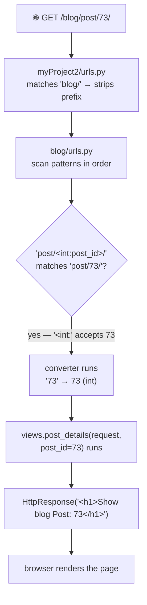
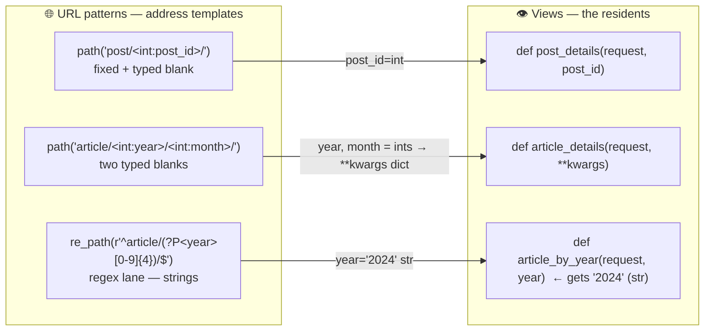

# 🚀 A009 — URL Parameters (`path`, `re_path`, `kwargs`)

`📖 Lecture A009` · `🎓 Track: Core Django` · `📶 Level: Beginner` · `✅ Status: Documented`

> [!NOTE]
> **About this chapter's sources:** built primarily from a **sixth real artifact** — the
> `myProject2/` project in this very folder whose `blog/` app demonstrates URL parameters
> in four flavors: `path()` converters, multi-segment captures, `re_path` regex matching,
> and a `**kwargs` view — every file below is quoted verbatim from disk. The command
> journal [`commands.txt`](../commands.txt) adds no new lines (A009, like A007/A008, was
> *file-editing*, not commands — the artifact is the record). The repo's own
> `ChaiAurCode/chaiaurDjango/chai/urls.py` (which already used `chai/<int:chai_id>/` in
> A002) provides the real-world echo. Django's official URL dispatcher docs fill detail
> (default converters, `reverse`) and are marked 📌. No transcript exists for A009.

---

## 🧭 What You Will Learn

- [ ] Read and write URL patterns that **capture values from the path** — `post/<int:post_id>/`
- [ ] Explain Django's **converter → keyword-argument contract** (a URL segment becomes a view parameter)
- [ ] Distinguish `path()` (typed, readable) from `re_path()` (regex, flexible, strings-only)
- [ ] Use `**kwargs` in a view to handle **multiple URL shapes** with one function
- [ ] Debug "the right page, wrong parameter" and `NoReverseMatch` failures

## 🎯 Why This Lecture Matters

Every URL so far has been a *fixed* string: `''`, `'about/'`, `'blog/'`. But real web
apps build URLs *out of data*: `/chai/3/`, `/user/adnan/`, `/article/2024/06/15/` —
the same page shape, a different value in the path each time. Without URL parameters
you'd be forced to fake it (`/chai/?id=3` and hand-parsing query strings) or create a
staggering number of routes. A009 gives URLs a **vocabulary**: one pattern
(`post/<int:post_id>/`) matches a *whole family* of URLs and hands the captured value to
your view as a plain Python argument.

This is the lecture that makes every "detail page" you've ever clicked click. The chai
app in this repository already ran the full pipeline on `chai/<int:chai_id>/` in A002 —
you just didn't yet know *why* that works. After A009 you'll be able to read any Django
URLconf (including Instagram-class ones) fluently, and you'll understand the seam that
A010 (templates) will plug into: the captured values are exactly the data a detail page
needs to render.

## ✅ Prerequisites

- [ ] **A007** — `path(route, view, name=…)`; the view contract (`request` in → response out); `include()` + `ROOT_URLCONF`
- [ ] **A008** — prefixes (`path('blog/', include('blog.urls'))`), name collisions, first-match-wins

### 📌 Recap — where A008 left us

A008's apps matched **fixed** segments (`''`, `'about/'`, `'blog/'`, `'shop/'`). A009's
`myProject2/` keeps the same wiring — one app `blog`, mounted at `/blog/` via `include`
— but the *app's own routes* now contain **variable segments**: square-bracket
placeholders like `<int:post_id>` that match any integer and pass it to the view. That
single addition (a placeholder in the pattern) is the entire new idea, and it cascades
into converters, `re_path`, and keyword arguments.

---

## 🏗️ The Artifact — A Blog That Reads URLs

Ground truth from `myProject2/` on disk (`__pycache__/` omitted):

```
A009_URL_Parameters_(path_re_path_kwargs)/
└── myProject2/
    ├── manage.py · db.sqlite3 · myProject2/ (config: settings·urls·wsgi·asgi)
    └── blog/                      ← the app (registered in INSTALLED_APPS, A006)
        ├── models.py              ← still a stub (data comes in a later lecture)
        ├── views.py               ← 4 views — each takes captured parameters
        └── urls.py                ← path() converters + re_path — the lecture's heart
```

The project's URLconf is the familiar A007/A008 shape (verbatim):

```python
urlpatterns = [
    path('admin/', admin.site.urls),
    path('blog/', include('blog.urls')),
]
```

**Explanation:** one app (`blog`), mounted at the `/blog/` prefix. Zero surprises.
Everything new lives *inside* `blog/urls.py` — the variable segments. The `db.sqlite3`
is 0 bytes and `models.py` still says `# Create your models here.`: A009 is purely about
**routing values**, not storing them.

## 🧠 The Core Idea — Converters Turn Segments Into Arguments

Here is the app's route table, verbatim:

```python
urlpatterns = [
    path('post/<int:post_id>/', views.post_details, name='post_details'),
    path('user/<str:username>/', views.user_profile, name='user_profile'),
    ...
]
```

And one of its views, verbatim:

```python
def post_details(request, post_id):
    return HttpResponse(f"<h1>Show blog Post: {post_id}</h1>")
```

**Read them together — this is the contract:**

| URL you visit | Pattern matched | Value sent to the view |
|---|---|---|
| `/blog/post/73/` | `post/<int:post_id>/` | `views.post_details(request, post_id=73)` |
| `/blog/post/abc/` | — *no match* (`<int:>` rejects non-integers) | **404** |
| `/blog/user/adnan/` | `user/<str:username>/` | `views.user_profile(request, username='adnan')` |

Three truths fall out of that table:

1. **`<int:post_id>` is a *typed placeholder*.** The segment must *look like* an int;
   if it doesn't, the pattern simply doesn't match (→ 404, and Django keeps trying the
   next pattern). This is validation for free.
2. **Django converts the captured text before calling the view.** `"73"` (a string
   from the URL) arrives at the view as `73` (a real Python `int`). `str` stays a
   string. **The converter decides the Python type.**
3. **The value arrives as a *keyword argument*.** `post_id=73` — not `*args`, not a
   manual parse. That's why the view signature *must* accept `post_id`: Django calls it
   with that keyword. Forget the parameter and Django raises a `TypeError` on the
   request — the "captured value → view keyword" handshake is non-negotiable.

> 🧠 **The one-line contract to memorize:** *every `<type:name>` in the pattern becomes
> a `name=typed_value` keyword argument the view receives.* Converters are how URLs
> speak Python.

### The converter family (📌 from Django docs)

| Converter | Matches | Arrives as | Example |
|---|---|---|---|
| `str` | any non-empty string, no `/` | `str` | `<str:username>` |
| `int` | zero or a whole number | `int` | `<int:post_id>` |
| `slug` | letters, numbers, `-`, `_` | `str` | `<slug:product>` |
| `uuid` | a UUID format | `uuid.UUID` | `<uuid:token>` |
| `path` | anything, **including `/`** | `str` | `<path:file_path>` |

`int` and `str` are the ones you'll use daily; the rest exist for specific shapes.
**The important habit:** always state a converter — a bare `<post_id>` (no `int:`) is
invalid and Django raises an error at startup, which is itself a useful safety net.

---

## 🔍 `re_path` — When Patterns Need Regex

The artifact's last route uses Django's older, more powerful tool (verbatim):

```python
re_path(r'^article/(?P<year>[0-9]{4})/$', views.article_by_year, name='article_by_year'),
```

**Explanation — `re_path` matches the whole path against a regular expression:**

| `path()` | `re_path()` |
|---|---|
| readable, self-documenting (`<int:year>`) | regex — powerful but terse (`(?P<year>[0-9]{4})`) |
| always converts via converters | **regex groups always arrive as strings** |
| the modern, preferred way | exists for patterns converters can't express |

Decode the regex slowly — it is the whole lecture in miniature:

```text
^                      start of the path
article/               literal text "article/"
(?P<year>[0-9]{4})     a NAMED GROUP: exactly 4 digits, captured as "year"
/                      literal slash
$                      end of the path
```

**The named group is the keyword:** `(?P<year>...)` is regex's way of saying "capture
this piece and call it `year`" — and Django maps that group *directly* onto the view
keyword. Visit `/blog/article/2024/` and Django calls:
`views.article_by_year(request, year='2024')`.

> [!IMPORTANT]
> **The type trap:** `path`'s `<int:year>` hands you an **`int`**; `re_path`'s
> `(?P<year>...)` hands you a **`str`**. Regex produces text — always. The artifact's
> view `article_by_year(request, year)` happily prints whatever it gets, which hides
> the difference; but the moment you compare `year == 2024` you'll learn it was
> `'2024'`. **Check your types when mixing `path` and `re_path`.**

### Why both exist in the same file (and don't collide)

Watch the ordering dance. `urlpatterns` scans top–down, and each family handles a
*different shape*:

| URL | Which pattern wins | Why |
|---|---|---|
| `/blog/article/2024/6/` | `path('article/<int:year>/<int:month>/')` | 2 segments — the `re_path` regex demands exactly 1 (`…/$`) |
| `/blog/article/2024/6/15/` | `path('article/<int:year>/<int:month>/<int:day>/')` | 3 segments — neither earlier pattern nor `re_path` matches |
| `/blog/article/2024/` | **`re_path`** | 1 segment — falls through the two multi-segment `path`s, hits the regex |

So unlike A008's duplicate-`''` bug, **nothing here is shadowed**: these routes serve
different URL *shapes*. The lesson is the A008 lesson in its positive form — patterns
must be unique **or** carefully ordered; here they're unique by shape, so order is
cosmetic.

## 🧺 One View, Many Shapes — the `**kwargs` story

Now the most instructive artifact: the same view serves **two** routes (verbatim):

```python
path('article/<int:year>/<int:month>/', views.article_details, name='article_details'),
path('article/<int:year>/<int:month>/<int:day>/', views.article_details, name='article_details'),
```

```python
# def article_details(request, year, month):
#     return HttpResponse(f"<h1>Article from {year} - {month}</h1>")

def article_details(request, **kwargs):
    return HttpResponse(f"<h1>Data: {kwargs}</h1>")
```

**Read the history on disk.** The commented-out lines are the developer's *first* try:
a view with an explicit `year, month` signature. It worked for the 2-segment route —
but the **3-segment route** (`…/<day>`) would call it with an extra `day=…` keyword,
and `TypeError: article_details() got an unexpected keyword argument 'day'`. Two
routes, two signatures → a conflict. The solution on the next lines: `**kwargs`, which
**swallows every captured keyword into a dict**, whatever the URL shape:

| URL visited | `kwargs` the view receives |
|---|---|
| `/blog/article/2024/6/` | `{'year': 2024, 'month': 6}` |
| `/blog/article/2024/6/15/` | `{'year': 2024, 'month': 6, 'day': 15}` |

> 🧠 **Captured values are keywords; `**kwargs` collects them all.** When one view must
> answer several URL shapes (2 fields, 3 fields), `**kwargs` is the flexible funnel.
> The cost — you give up named signature — is worth it exactly when shapes vary; when a
> view always gets the same fields, keep explicit parameters for clarity.

### A wrinkle worth naming: two routes, one `name=`

Both `article_details` routes share `name='article_details'`. It *works* (reverse
lookups like `` find a matching shape),
but it's fragile: two patterns claiming one name is exactly the ambiguity A008 warned
about. 📌 Prefer distinct names (`article_month` vs `article_day`) or a **single** route
using `<int:year>/<int:month>/<int:day>` *alone* — Django's default converters make the
"one canonical shape" approach cleaner than two overlapping entries.

---

## 🔄 The Journey — `/blog/post/73/` Through the Full Pipeline

Tie it all together with the pipeline you've built since A001:



**The same journey, step by step:**

| # | What happens | Component | Why |
|---|---|---|---|
| 1 | Browser requests `/blog/post/73/` | client | the user clicked/typed a dynamic link |
| 2 | `runserver` → middleware → `ROOT_URLCONF` loads `myProject2/urls.py` | pipeline (A001/A007) | every request starts at the project's table |
| 3 | `path('blog/', include('blog.urls'))` matches, strips `blog/` | project `urls.py` | A008's prefix stripping |
| 4 | `blog/urls.py` scans; `post/<int:post_id>/` matches `post/73/` | app `urls.py` | the first pattern whose *shape* fits |
| 5 | converter converts `"73"` → `73` (int) | `int` converter | **converters type the captured text** |
| 6 | Django calls `views.post_details(request, post_id=73)` | dispatcher | **the keyword-argument contract** |
| 7 | the view builds `HttpResponse("<h1>Show blog Post: 73</h1>")` | the view | captured value is now ordinary Python data |
| 8 | response travels back out to the browser | pipeline | A001 stages 9–10 |

> 🧠 **Every captured value is a keyword argument; every converter is a type-checker.**
> If step 5 fails (e.g. `post/abc/`), the pattern doesn't match — step 4 moves on, and
> eventually a 404 answers. If your view's signature doesn't accept `post_id`, step 6
> raises immediately. The three failure modes (404, `TypeError`, wrong content) each
> point at a different stage — the debugging table from A007, extended.

---

## 🧱 Important Vocabulary

*(New terms are registered in [`docs/MEMORY.md`](../docs/MEMORY.md) — the series-wide
glossary; the A007/A008 `path()`/`include()`/prefix terms live there too.)*

| Term | Simple meaning | Technical meaning | 🧷 Memory hook |
|---|---|---|---|
| **URL parameter** | a value embedded in the path | a variable segment like `<int:post_id>` that the dispatcher captures and passes to the view | the blank on the form letter |
| **Path converter** | the typed part of a placeholder | `<type:name>` — matches a segment shape, converts it, hands it as a keyword arg (`<int:post_id>` → `post_id=73`) | a bouncer who also translates |
| **Converter → keyword contract** | captured values become view keyword args | `path('post/<int:post_id>/', …)` calls `views.post_details(request, post_id=…)` — signature must match | the URL whispers, the view answers by name |
| **`re_path()`** | URL patterns written as regex | matches the full path against a regular expression; `(?P<name>…)` groups become string kwargs | `path`'s older, sharper-edged sibling |
| **Named regex group** | regex capture with a name | `(?P<year>[0-9]{4})` captures 4 digits as `year` — always a **string** | `(?P<name>pattern)` ⇒ `name` the keyword |
| **`**kwargs` view** | a view that accepts any captured keywords | `def view(request, **kwargs)` collects all URL-keyword arguments into a dict — one view, many shapes | the catch-all funnel |

---

## 💡 Real-World Analogy — The Ellipsis Address

Think of a URL pattern as an **address template with blanks**. `post/<int:post_id>/`
is the street "Post Street" with a *house number* blank that must be numeric:

- **The fixed parts** (`post/`, `about/`, `article/`) are the street names — literal,
  exact, the same for every house.
- **The blanks** (`<int:post_id>`, `<str:username>`) are the *variable* parts — the
  house number / apartment name that changes per resident.
- **The converter** (`int:`) is the **postal sorting rule**: it checks the slip is the
  right shape (digits only) and stamps the type on it (turns `"73"` into `73`). A
  letter addressed to `post/abc/` doesn't *match* the pattern → it goes to the dead
  letter office (404).
- **The view signature** is the **resident who only answers parcels addressed to them**
  — Django knocks and hands over `post_id=73`; a resident without that name on the
  door can't accept the parcel (`TypeError`).
- **`re_path`** is **registered mail with a strict address format** — a regex the
  post office uses when a plain house-number blank isn't enough (e.g. "*exactly* four
  digits").
- **`**kwargs`** is the resident who simply *lists whatever arrived* — "today's
  parcels: `{'year': 2024, 'month': 6, 'day': 15}`" — no matter how many fields a
  particular address had.

> ⚠️ **Where the analogy is exact:** the address template is *one pattern, many
> real addresses* — `/blog/post/1/`, `/blog/post/73/`, `/blog/post/9001/` all match
> `post/<int:post_id>/`. That's the entire point of URL parameters: **one blank on the
> map, infinitely many homes behind it**, each delivering its own value to the view.

---

## ❌ Common Beginner Mistakes

1. ❌ **Forgetting the converter (`path('post/<post_id>/', …)`).** *Why:* the angle
   brackets "look done". *Fix:* Django requires `<converter:name>`; a bare `<name>` is
   a startup error. Always write `int:`, `str:`, etc.

2. ❌ **Writing a view signature that doesn't accept the captured keyword.** *Why:* the
   URL side "compiles fine", so the view "should too". *Fix:* every `<type:name>`
   becomes `name=…` — the view must accept `name`. Mismatch → `TypeError` at request
   time. Keep the spelling identical in both files.

3. ❌ **Expecting `re_path` groups to arrive as `int`.** *Why:* the digits *look* like
   numbers. *Fix:* regex groups are **strings, always**. `year == 2024` is `False`;
   write `int(year)` or use `path('article/<int:year>/…')` when you want an int.

4. ❌ **Two routes with the same `name=`** (the artifact's `article_details` wrinkle).
   *Why:* it "works" for one shape. *Fix:* ambiguity is fragile — prefer distinct names
   or a single canonical pattern. (See the A008 name-collision lesson.)

5. ❌ **Assuming `<int:>` accepts `-3` or `007`.** *Why:* "int is int". *Fix:* `int`'s
   regex is `[0-9]+` — no sign, no leading zeros, no decimals. `007` doesn't match.
   (📌 detail from Django source; the practical rule: whole non-negative numbers only.)

6. ❌ **Hardcoding query strings (`/post/?id=73`) instead of path parameters.** *Why:*
   it avoids learning the syntax. *Fix:* path parameters are the canonical way to
   encode *identity* (`id`); query strings are for *options and filters* (`?sort=new`).
   The artifact's paths are the right shape.

7. ❌ **Using `**kwargs` everywhere "for flexibility".** *Why:* it silences TypeErrors.
   *Fix:* `**kwargs` is for genuinely variable shapes (as here); for fixed signatures,
   explicit parameters are clearer, self-documenting, and typo-catching. Reach for the
   funnel only when shapes truly vary.

## 🧠 Common Misconceptions

| ✅ Correct model | ❌ Misconception |
|---|---|
| `<int:post_id>` *converts and validates* — non-integers simply don't match (→ 404) | a non-integer "will be passed anyway" and the view must handle it |
| Captured values arrive as **keyword arguments** (`post_id=…`), matched by name | they arrive positionally or as one combined string |
| `re_path` named groups are **strings**; `path` converters are **typed** | regex groups are auto-typed like converters |
| One pattern serves **many URLs** — that's the point | each URL needs its own `path()` line |
| The converter's job ends at the view's door — the view gets a plain Python value | the view "re-parses" the URL or sees the original text |
| A URL parameter is a *path* segment, not a query string | `?key=value` and `<key>` are interchangeable (they're different mechanisms) |

> 🧠 **One sentence for the whole family:** *URLs are structured addresses with typed
> blanks; converters fill the blanks with Python values; the view answers by the
> keyword's name — and the URL never dictates the view's types, the converter does.*

---

## 🧪 Practical Example — Add a Parameterized Route (Extend the Artifact)

> [!NOTE]
> This is the same shape as the artifact's `post/<int:post_id>/`, applied to a new
> resource. Run it inside `myProject2/` to feel the whole contract click.

**Step 1 — a view that accepts a parameter** (`blog/views.py`, add below the others):

```python
def product_details(request, product_id):
    return HttpResponse(f"<h1>Product: {product_id}</h1>")
```

**Step 2 — a route with a typed converter** (`blog/urls.py`, add to `urlpatterns`):

```python
path('product/<int:product_id>/', views.product_details, name='product_details'),
```

**Step 3 — run and visit both a valid and an invalid URL:**

```bash
py .\manage.py runserver
# /blog/product/42/  →  "Product: 42"
# /blog/product/abc/ →  404 (the converter rejects non-integers)
```

**Explanation — read the three pieces as one contract:** the *view* declares it expects
`product_id` (step 1); the *pattern* declares it will deliver `product_id` typed as
`int` (step 2); the *dispatcher* reconciles them — matching the URL shape, converting
`"42"` → `42`, and calling `product_details(request, product_id=42)`. Any mismatch in
spelling or type is caught the moment the URL is hit (a `TypeError`), not silently.
Notice you did **not** touch the project's `urls.py` — the `blog/` prefix already routes
here, exactly as A007/A008 taught.

---

## 🎯 Interview Perspective

**Q1. Explain what `<int:post_id>` does — and what the view receives.** *(beginner)*

> **Strong answer:** "`<int:post_id>` is a path converter: it matches exactly one URL
> segment that is a non-negative integer, and Django converts the captured string to a
> Python `int`. The view is then called with `post_id` as a keyword argument —
> `views.post_details(request, post_id=73)`. A non-integer segment simply doesn't match,
> giving a 404."
>
> **Why it works:** names the mechanism (converter), the type coercion, the keyword
> delivery, and the non-match behavior — four facts most candidates give two of.

**Q2. `path` vs `re_path` — when do you use which?** *(conceptual)*

> **Strong answer:** "`path` with converters is the readable default — `<int:year>`
> states the shape and gives a typed value. `re_path` takes a full regex, which is
> powerful for shapes converters can't express, but its named groups always arrive as
> strings. I prefer `path` and reach for `re_path` only when a pattern genuinely needs
> regex (e.g. exact digit counts)."
>
> **Why it works:** a balanced judgment (preference + reason + one concrete caveat)
> instead of vague "regex is more powerful".

**Q3. What happens if the view's parameters don't match the URL's captured values?** *(practical)*

> **Strong answer:** "A `TypeError` at request time — e.g. 'missing required
> positional argument post_id' if I omit it, or 'unexpected keyword argument' if I
> spell it differently. There's no silent behavior: the dispatcher's keyword contract
> is strict, which is a good thing."
>
> **Why it works:** shows a precise mental model of the failure mode and frames the
> error as a feature.

**Q4. How would you serve both `/article/2024/6/` and `/article/2024/6/15/` with one view?** *(problem-solving)*

> **Strong answer:** "Route both shapes to the same view and accept `**kwargs`. Each
> captured value arrives as a keyword, so the 2-segment URL yields
> `{'year':…,'month':…}` and the 3-segment adds `day`. That's exactly what the artifact
> does. If the shapes are fixed and few, I'd give each route a distinct name to keep
> reverse lookups unambiguous."
>
> **Why it works:** solution + mechanism + the artifact's own pattern + a naming
> caveat — thorough and grounded.

**Q5. Why are path parameters better than query strings for a detail page?** *(why — judgment)*

> **Strong answer:** "Path parameters encode *identity* — `/post/73/` is the post
> itself, clean and shareable. Query strings encode options — `/posts/?sort=new`.
> Identities in the path also give Django's converter validation (`<int:>` → 404 for
> garbage), whereas a query string arrives as arbitrary text the view must validate
> itself."
>
> **Why it works:** draws the identity-vs-options distinction, which is the widely
> used mental model interviewers expect.

---

## 🔁 Active Recall

Retrieval builds memory — answer *in your head first*, then expand each answer.

**1. What does `/blog/post/73/` deliver to the view — exactly?** *(write the full call)*

<details><summary>Answer</summary>

After prefix stripping (`blog/` removed), the pattern `post/<int:post_id>/` matches
`post/73/`, the converter turns `"73"` → `73`, and Django calls
`views.post_details(request, post_id=73)`. Keyword `post_id`, type `int`, value `73`.
</details>

**2. Why does `<int:post_id>` reject `/blog/post/abc/`?**

<details><summary>Answer</summary>

The `int` converter only matches non-negative integer-shape segments (`[0-9]+`). `abc`
doesn't fit, so the pattern doesn't match, Django keeps scanning, and eventually a 404
is returned. No error is raised — it's a *non-match*.
</details>

**3. What is the ONE difference between how `path` and `re_path` deliver captured values?**

<details><summary>Answer</summary>

`path` converters coerce types (`<int:year>` → Python `int`); `re_path` named groups
always arrive as **strings** (`(?P<year>[0-9]{4})` → `'2024'`). Everything else about
the keyword-to-view handshake is identical.
</details>

**4. Why did the developer in the artifact replace `def article_details(request, year, month)` with `def article_details(request, **kwargs)`?**

<details><summary>Answer</summary>

Because the second route adds a `day` keyword: the explicit signature would raise
`TypeError: got an unexpected keyword argument 'day'` for the 3-segment URL. `**kwargs`
collects whatever keywords arrive, serving both the 2-segment and 3-segment shapes with
one view.
</details>

**5. Name the default converters and what each returns.**

<details><summary>Answer</summary>

`str` (string), `int` (integer), `slug` (letters/digits/`-`/`_`), `uuid` (`uuid.UUID`),
`path` (anything incl. `/`). The practical daily pair is `int` and `str`.
</details>

**6. Where does the URL pattern's converter live — app file or project file?**

<details><summary>Answer</summary>

In the **app's** `urls.py` — the project only holds the prefix `include()` (the `blog/`
mount). The converter and its keyword are entirely an app-level concern, exactly as
A007/A008 established.
</details>

**7. `re_path(r'^article/(?P<year>[0-9]{4})/$', …)` — decode it, piece by piece.**

<details><summary>Answer</summary>

`^` = start of path · `article/` = literal · `(?P<year>[0-9]{4})` = a named group that
captures exactly four digits as `year` · `/` = literal slash · `$` = end of path.
Matches exactly `/article/2024/` (one segment) and calls the view with
`year='2024'` (a string).
</details>

**8. What's the difference between a path parameter and a query string?**

<details><summary>Answer</summary>

Path parameters encode *identity* in the URL structure (`/post/<int:post_id>/`), get
typed conversion, and are shareable/clean. Query strings (`?sort=new`) encode options or
filters, arrive as raw text on `request.GET`, and need no route pattern at all.
</details>

---

## 📝 Quick Revision — A009 in Five Minutes

**The one-liner:** *one pattern, many URLs — `<type:name>` captures a typed value and
calls the view with `name=value` as a keyword argument.*

**The contract (write it from memory):**

```python
# urls.py — a converter captures + types; name flows to the view
path('post/<int:post_id>/', views.post_details, name='post_details')

# views.py — the view accepts the SAME keyword, typed by the converter
def post_details(request, post_id):
    return HttpResponse(f"<h1>Post {post_id}</h1>")
```

**Delivered:** `/blog/post/73/` → `views.post_details(request, post_id=73)` (int).

**`re_path` version:**

```python
re_path(r'^article/(?P<year>[0-9]{4})/$', views.article_by_year, name='article_by_year')
# → article_by_year(request, year='2024')   ← a STRING, always
```

**`**kwargs` version:**

```python
def article_details(request, **kwargs):   # serves 2- and 3-segment article URLs
    # {'year': 2024, 'month': 6}   or   {'year': 2024, 'month': 6, 'day': 15}
```

**Debugging by symptom:** 404 on a parameterized URL → converter rejected the value or
route shape is wrong · `TypeError` on request → view signature doesn't accept the
keyword · wrong content but 200 → check the *value's type* (int vs str) or which route
actually matched.

**Validation for free:** `<int:>` non-match = 404, no code in the view.

---

## 🧠 Final Mental Model — The Address Template

*What to see: one mental map of the whole lecture — the URL is a template, converters
type the blanks, keywords deliver values, `re_path` is the regex lane, `**kwargs` the
catch-all door.*



**Reading it aloud:** the *pattern* is a template with typed blanks; the *dispatcher*
matches, converts, and calls by keyword; the *view* either names the parameters it
wants (post_details) or catches everything (`**kwargs`) when shapes vary; `re_path`
uses a regex and therefore passes **strings** — the one type trap to remember. Three
lanes, one handshake: **converter → keyword → parameter.**

---

## ❓ FAQ

**Q1. Why did I get a 404 for `/blog/post/abc/` and not an error page?**
Because `<int:post_id>` *doesn't match* non-integers. A non-match just means Django
continues down `urlpatterns` and ultimately returns 404. That's validation for free —
the URL shape acts as a filter before your view ever runs.

**Q2. Should I always use `**kwargs` in views?**
No. `**kwargs` is a *funnel* for when a view serves several URL shapes (the artifact's
`article_details`). For a fixed signature, explicit parameters (`request, post_id`) are
clearer, self-documenting, and let Django flag typos. Reach for the funnel only when
shapes genuinely vary.

**Q3. `path` or `re_path` for a date like `/article/2024/6/`?**
`path` — `path('article/<int:year>/<int:month>/', ...)` is readable and gives you real
`int`s. Use `re_path` only when you need regex `path` can't express (e.g. exactly-four
digits, fixed prefixes). The artifact shows **both** working side by side — paths
convert, regex stays stringy.

**Q4. My view raised `TypeError: post_details() got an unexpected keyword argument 'post_id'`.**
It means the view *doesn't accept* the keyword the pattern sends. Check that the view's
parameter name **spells** `post_id` exactly as the pattern's `<int:post_id>`, and that
it isn't accidentally caught by a `*args`/global positional-only signature. The
dispatcher's handshake is strict by design.

**Q5. Can two apps both use `<int:post_id>`?**
Yes — apps are independent (A008). The captured keyword is local to each app's
URLconf and view. What must stay global are **route names** (prefix them), per the
A008 lesson.

**Q6. Does this connect to the chai app in `ChaiAurCode`?**
Directly. `chai/urls.py` contains `path('chai/<int:chai_id>/', views.chai_detail, ...)`
— the exact converter pattern this chapter explains; in A002 you saw it call
`views.chai_detail(request, chai_id=3)`. That's the whole contract, running in this
repository.

---

## 🏁 Learning Checkpoints

- [ ] **Checkpoint 1 — Read patterns:** I can explain `path('post/<int:post_id>/', …)` —
      fixed parts, typed blank, keyword name — *§🧠*
- [ ] **Checkpoint 2 — The contract:** I can state what `views.post_details(request, post_id=73)` receives and why `post/abc/` 404s — *§🧠*
- [ ] **Checkpoint 3 — `re_path` vs `path`:** I can decode `r'^article/(?P<year>[0-9]{4})/$'` and recall that regex groups arrive as strings — *§🔍*
- [ ] **Checkpoint 4 — `**kwargs`:** I can explain why the artifact's `article_details` uses `**kwargs` and what the commented-out lines show — *§🧺*
- [ ] **Checkpoint 5 — Defaults & debugging:** I can name the five default converters and map 404/`TypeError`/wrong-content to their stages — *§🧠 / §🔄*

---

## 🏋️ Exercises

- **Level 1 — Recall:** From memory, write a converter route (`path('product/<int:product_id>/', …)`) plus its view, then your own `re_path` with one named group. Check against the artifact files.
- **Level 2 — Understanding:** A classmate says `article_by_year` works "just like" `post_details`. Explain the one type difference (`str` vs `int`) and show a code line where it would bite.
- **Level 3 — Application:** In `myProject2/`, add a `user/<str:username>/` profile route that prints `"Profile of {username}"` (mimicking the artifact's `user_profile`), then a second route `product/<int:product_id>/` using §🧪. Visit both with valid and invalid values and record what happens — including the 404 and any `TypeError` if you rename the parameter.
- **Level 4 — Interview reasoning:** Answer aloud: *"Design a URL scheme for a blog with posts, monthly archives and per-day archives — using path converters, re_path only where needed, and one view for both archive shapes."* Then deliver the full §🎯 set.

---

## 🏁 Final Takeaways

1. **One pattern = a family of URLs.** `post/<int:post_id>/` serves `/post/1/` … `/post/9001/`.
2. **The converter is a type-checker + translator.** `int:` validates the shape *and* delivers a Python `int`; `str:` stays a string; non-matching values → 404.
3. **The handshake is by keyword.** Every `<type:name>` becomes `name=value` in the view call — spelling must match exactly, or you get a `TypeError`.
4. **`re_path` is the regex lane.** `(?P<year>…)` groups become keyword args **as strings** — the one type trap when mixing `path` and `re_path`.
5. **`**kwargs` is the shape-agnostic funnel.** It collects every captured keyword into a dict — the artifact's answer to serving both 2- and 3-segment archives.
6. **Order and shapes decide what matches.** A008's first-match rule holds; here the route families serve different shapes, so nothing is shadowed.
7. **Path params ≠ query strings.** Identity goes in the path (`/post/73/`); options go in the query (`?sort=new`).

---

## 🔄 Next Lecture Connection

The blog app now reads values from URLs — and responds with raw `<h1>` strings built by
hand in Python. That's the seam A010 — **Templates Folder Setup (Project Level)** —
fills: proper `templates/` directories at the project level, so views can hand captured
values (like `post_id`) to real HTML template files instead of f-strings. The
URL→view→parameter pipeline you just mastered is exactly the plumbing A010 will wire
into presentation. (Data **models** arrive after that — this series is building the
stack layer by layer, and routing values came first.)

---

<div class="doc-footer">

**Sources used:**

| Source | Role | Notes |
|---|---|---|
| `A009_URL_Parameters_(path_re_path_kwargs)/myProject2/` — sixth real artifact | **Primary** | `blog/views.py` + `blog/urls.py` quoted verbatim: four views (incl. the commented-out explicit `article_details` superseded by `**kwargs`), `path()` converters, two multi-segment routes with a shared `name=`, and a `re_path` regex route; project `urls.py` (single `blog/` include) and `settings.py` (`'blog'` registered) |
| [`commands.txt`](../commands.txt) | Context | No new lines — A009 was file-editing, not commands; the artifact outranks the journal |
| [A007 — Views & URLs Basics](../A007_Views_URLs_Basics/README.md) · [A008 — Multiple Apps](../A008_Multiple_Apps_with_Views_URLs_%28Blog_Shop_Example%29/README.md) | Context | `path()`/`include()`/prefix/name-collision foundations this chapter builds on |
| `ChaiAurCode/chaiaurDjango/chai/urls.py` | Context | The real `chai/<int:chai_id>/` converter seen in A002 — echoed in FAQ Q6 |
| Official Django docs (URL dispatcher, converters, reverse) | 📌 Supplementary | Default converter list and `reverse` details — flagged 📌 in place |

> 📌 **Scope note:** everything derived from the artifact is source-grounded; anything
> from Django's docs (default converters, `[0-9]+` int regex, reverse semantics) carries
> the 📌 badge. No transcript exists for A009 — declared per the documentation contract.
>
> **Navigation:** [← A008 · Multiple Apps with Views & URLs](../A008_Multiple_Apps_with_Views_URLs_%28Blog_Shop_Example%29/README.md) · [📚 Series Hub](../README.md) · [A010 · Templates Folder Setup (Project Level) →](../A010_Templates_Folder_Setup_Project_Level/)
>
> **Series:** [A001](../A001_Introduction_What_is_Django/README.md) ·
> [A002](../A002_MVT_Architecture_Explained/README.md) ·
> [A003](../A003_Install_Python_pip_Django_Virtual_Environment_Setup/README.md) ·
> [A004](../A004_Create_Django_Project/README.md) ·
> [A005](../A005_Django_Files_Folders/README.md) ·
> [A006](../A006_Django_startapp_Command_Explained/README.md) ·
> [A007](../A007_Views_URLs_Basics/README.md) ·
> [A008](../A008_Multiple_Apps_with_Views_URLs_%28Blog_Shop_Example%29/README.md) · **A009** ·
> [Hub](../README.md)

</div>
