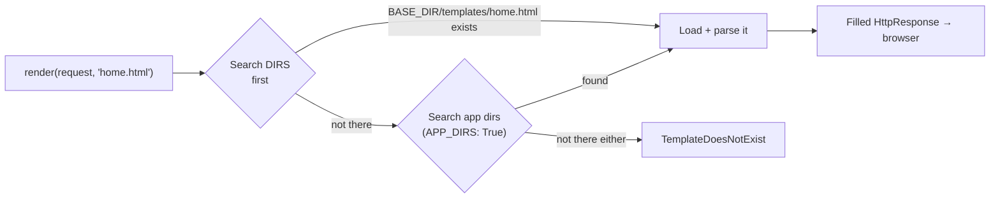
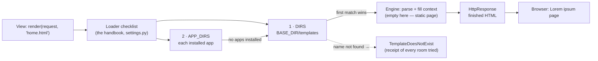

# 🚀 A010 — Templates Folder Setup (Project Level)

`📖 Lecture A010` · `🎓 Track: Core Django` · `📶 Level: Beginner` · `✅ Status: Documented`

> [!NOTE]
> **About this chapter's sources:** built primarily from a **seventh real artifact** — the
> `myProject3/` project in this very folder, the first artifact with **no app at all**: a
> project-level `templates/` folder, a `DIRS` edit in `settings.py`, and a config-level
> `views.py` that calls `render()` for the first time in this series. Every file below is
> quoted verbatim from disk. The command journal [`commands.txt`](../commands.txt) adds no
> new lines (A010, like A007–A009, was *file-editing*, not commands — the artifact is the
> record). The pristine default `settings.py` from A004's `myProject/` (same Django 6.1.1)
> provides an in-repo "before" for the diff. Django's official settings/templates docs fill
> detail (lookup order, `TemplateDoesNotExist`) and are marked 📌. No transcript exists for A010.

---

## 🧭 What You Will Learn

- [ ] Set up a **project-level `templates/` folder** and wire it into `settings.py` via `TEMPLATES['DIRS']`
- [ ] Explain the engine's **template lookup order** — `DIRS` first, then `APP_DIRS`
- [ ] Read and write a view that answers with **`render(request, 'home.html')`** instead of an `HttpResponse` string
- [ ] Trace a request from `/` through the dispatcher, the view, and the template engine to the browser
- [ ] Diagnose **`TemplateDoesNotExist`** — the classic failure when the wiring is off by one step

## 🎯 Why This Lecture Matters

Every page so far in this series has been built the hard way: `HttpResponse("<h1>…</h1>")` —
HTML hand-typed inside Python strings. It works for one line, and it dies quickly: no syntax
highlighting, no designer collaboration, no reuse, and quoting hell the moment markup grows.
Templates are the **T** of MVT — A002 introduced them conceptually (and the chai app already
used `render()` there), but every artifact you built yourself has answered with raw strings.
A010 is the lecture where *your own projects* finally answer with real HTML files.

The lecture's specific focus is the **setup plumbing** that makes one HTML file findable:
create a folder, edit one setting — and understand what the template engine does between the
view's `render()` call and the browser's pixels. Skip this understanding and you'll meet the
most common Django error of all time, `TemplateDoesNotExist`, with no idea which of the
*three* wiring points (folder location, `DIRS` value, template name string) is broken.

This is also the lecture that changes the *shape* of your projects: `myProject3/` has **no
apps** — a view, a URL, and a template hanging directly off the project. That's legal, common
for small sites, and the proof that views don't need an app to serve a page (A007's wiring
works at any level). The next seam is *placement*: templates that live **inside apps** —
the `APP_DIRS` lane this lecture only brushed — which is exactly A011's topic.

## ✅ Prerequisites

- [ ] **A004/A005** — the project skeleton: `settings.py`, `urls.py`, `BASE_DIR`, what `manage.py runserver` does
- [ ] **A007** — the three-file wiring: view → `urls.py` → `path(route, view, name=…)`; `ROOT_URLCONF`
- [ ] **A002** — the MVT picture: what a template *is* conceptually; `render()`'s three arguments (used, now examined)

### 📌 Recap — where A009 left us

A009's views read values *from the URL* but still answered with hand-built strings —
`HttpResponse(f"<h1>Show blog Post: {post_id}</h1>")`. Back in A007 you already saw the
clue: `dj1/blog/views.py` imported `render` and never called it — flagged then as
"templates are next." A010 pays that debt: `myProject3/` is a fresh project whose one view
does nothing but `return render(request, 'home.html')`. The new idea is not the view —
it's everything that makes `'home.html'` a *findable file*: a folder, a setting, and an
engine with a search order.

---

## 🏗️ The Artifact — A Project That Renders HTML

Ground truth from `myProject3/` on disk (`__pycache__/` omitted):

```
A010_Templates_Folder_Setup_Project_Level/
└── myProject3/
    ├── manage.py · db.sqlite3 (0 bytes)
    ├── templates/                ← NEW folder — the lecture's subject
    │   └── home.html             ← one plain HTML page
    └── myProject3/               ← the config package (no app beside it!)
        ├── settings.py           ← TEMPLATES['DIRS'] edited + import os added
        ├── urls.py               ← path('', views.home, name='home')
        └── views.py              ← NEW file — def home(): render(...)
```

Three silences are as loud as the code:

1. **No app.** `INSTALLED_APPS` is the untouched default six — no `blog`, nothing. The
   whole page lives at project level. Views never needed an app; A007's wiring works from
   the config package too.
2. **No template tags.** `home.html` is pure HTML — zero `{{ }}`, zero ``. The template
   language is *a later* lecture's topic; today the file is a static shell.
3. **No journal lines.** Like A007–A009, `commands.txt` is untouched — the project was
   created and edited on disk. The artifact outranks the journal.

The project's URLconf (verbatim — note it follows the scaffold docstring's own suggestion):

```python
from django.contrib import admin
from django.urls import path
from . import views

urlpatterns = [
    path('admin/', admin.site.urls),
    path('', views.home, name='home'),
]
```

**Explanation:** two firsts hide in plain sight. `from . import views` — a *relative* import,
because `views.py` now lives *inside the config package itself* (not in an app), so the
package imports its own sibling module. And `path('', views.home, name='home')` is exactly
line 9 of the generated `urls.py` docstring ("Add a URL to urlpatterns:
`path('', views.home, name='home')`") — the owner executed the scaffold's own instructions,
which is a lovely bit of on-disk evidence that the docstring is a *checklist*, not decoration.

And the view (verbatim — the entire file, 98 bytes):

```python
from django.shortcuts import render

def home(request):
    return render(request, 'home.html')
```

**Explanation:** the view contract is unchanged (A002: `request` in → response out). What's
new is the *answer*: no `HttpResponse`, no f-string — `render(request, 'home.html')` hands
the request and a template *name* to Django's template machinery, which returns a filled
`HttpResponse` for us. The import that sat unused in A007's artifact finally does its job.

## 🧠 The Core Idea — `DIRS` Teaches the Engine Where to Look

`'home.html'` is a **name, not a path**. The view never says where the file is. So *who*
finds it, and where does it look? The answer is the `TEMPLATES` setting — here it is
verbatim, with the two lines the owner added highlighted by their context:

```python
from pathlib import Path
import os                                # ← added by hand (the default has no os import)

# Build paths inside the project like this: BASE_DIR / 'subdir'.
BASE_DIR = Path(__file__).resolve().parent.parent

TEMPLATES = [
    {
        'BACKEND': 'django.template.backends.django.DjangoTemplates',
        'DIRS': [os.path.join(BASE_DIR, 'templates')],   # ← edited: default is []
        'APP_DIRS': True,                                # ← left at its default
        'OPTIONS': {
            'context_processors': [
                'django.template.context_processors.request',
                'django.contrib.auth.context_processors.auth',
                'django.contrib.messages.context_processors.messages',
            ],
        },
    },
]
```

**Explanation — the edit trio, proven against this repo's own A004 artifact.** A004's
`myProject/myProject/settings.py` (generated by the *same* Django 6.1.1) is the pristine
"before" picture, and it differs from this "after" in exactly three places:

| # | Edit | Default (A004's `myProject/`) | A010's `myProject3/` | Why it's needed |
|---|---|---|---|---|
| 1 | Create the folder | *(no `templates/` folder)* | `myProject3/templates/` with `home.html` | files must exist before they can be found |
| 2 | `import os` | absent | `import os` | `os.path.join` below needs the `os` module — without it, `settings.py` crashes at startup with `NameError` |
| 3 | `'DIRS': […]` | `'DIRS': []` | `'DIRS': [os.path.join(BASE_DIR, 'templates')]` | the loader searches `DIRS` first; an empty list = "nowhere extra to look" |

`BASE_DIR` is the project root the skeleton already computed for you
(`Path(__file__).resolve().parent.parent` — the folder containing `manage.py`). So
`os.path.join(BASE_DIR, 'templates')` builds an absolute path to
`myProject3/templates/`, *wherever the project lives on disk* — that's why the snippet
works on every machine instead of hardcoding `D:\...`.

> ⚠️ **Two honest notes on the artifact's style** (per the discrepancy rules):
> **(a)** `os.path.join(BASE_DIR, 'templates')` is the *legacy* idiom — most older
> tutorials (and the style this project follows) write it this way. The modern equivalent
> uses the `pathlib` object `BASE_DIR` already is: `BASE_DIR / 'templates'`. Both produce
> the same path; 📌 Django's current docs use the pathlib form. **(b)** The artifact's
> `settings.py` ends with a `MAILERS = {…}` block defining a console email backend.
> Django's core does **not** read a `MAILERS` setting — the built-in one is
> `EMAIL_BACKEND` (📌). It sits there inert and out of scope for this lecture; it's
> recorded here because the artifact is quoted verbatim and *silence about oddities*
> would break the honesty contract.

### The engine's two lookup locations

With the name `'home.html'` in hand, the template engine searches configured locations in
order and uses the **first match** (📌 the `DjangoTemplates` backend's loader behavior):

| Order | Location | Controlled by | Active here? |
|---|---|---|---|
| 1st | the directories listed in `DIRS` | your edit in `settings.py` | ✅ — `BASE_DIR/templates` |
| 2nd | each installed app's `templates/` subfolder, in `INSTALLED_APPS` order | `APP_DIRS: True` | ⚠️ technically yes, but *no app exists* — there is nothing to look in |



Two habits fall straight out of that diagram:

1. **`DIRS` is checked first** — project-level templates can therefore *override* an
   app's template of the same name. That's a feature (customize third-party app pages)
   and a footgun (accidentally shadowing) — remember first-match-wins from A008's URL
   table; the loader has the same rule.
2. **`APP_DIRS: True` with zero apps is a no-op** — in `myProject3/` the app search walks
   an empty registry. `DIRS` is doing *all* the work, which is exactly the point of a
   project-level setup.

### What `render()` actually does

`render(request, 'home.html')` (from `django.shortcuts`) is a three-step helper (📌
mechanics from the official docs; A002 gave you the three arguments — here's what happens
inside):

1. **Find** — the engine's loader resolves the name using the lookup order above.
2. **Parse & fill** — the file is read, compiled into a template, and its variables/tags
   are filled from a context. Here `render` is called with **no third argument**, so the
   context is empty — matching a template with no `{{ }}` placeholders to fill. The page
   is static *by design of both sides*.
3. **Wrap** — the finished HTML string is returned inside an `HttpResponse`
   (`Content-Type: text/html`), which the view hands back like any other response.

So `render()` never *was* magic — it's "find, fill, wrap" — and A010's contribution is
step 1: teaching the finder where to look.

### Why a *project-level* folder at all?

A002 registered the **letterhead & blank fields** model for template *inheritance*: shared
skeletons used by many pages. A project-level `templates/` is the disk home for exactly
that shared material — base layouts, navbars, error pages, homepages — content that
belongs to *the whole site*, not to one shop. App-specific templates (each app carrying
its own `templates/<app>/` subfolder, enabled by `APP_DIRS`) are the natural next step and
arrive in the very next lecture — A011, app-level setup. Project-level first, app-level
second: the shared print room before the private printers.

---

## 🔄 The Journey — `/` Through the Render Pipeline

Following the artifact's single route end to end (A007's journey, one station longer):

| Step | Actor | What happens |
|---|---|---|
| 1 | Browser → dev server | `GET /` arrives at `runserver` |
| 2 | Middleware | passes through the default layers (A001's security lanes) |
| 3 | `ROOT_URLCONF` | `myProject3.urls` is consulted (settings, verbatim: `ROOT_URLCONF = 'myProject3.urls'`) |
| 4 | `urlpatterns` | `path('', views.home, name='home')` — the empty route matches the bare `/` |
| 5 | View call | `views.home(request)` — imported from the config package via `from . import views` |
| 6 | `render()` | loader searches `DIRS` → finds `BASE_DIR/templates/home.html` |
| 7 | Engine | parses the HTML, fills an empty context (nothing to fill), builds the string |
| 8 | Response | `HttpResponse` with the finished HTML → browser renders Lorem ipsum |

> If step 6 fails — wrong folder name, typo'd `DIRS`, or a misspelled `'home.html'` — the
> journey stops there and Django raises **`TemplateDoesNotExist`**, whose error page
> (📌 in `DEBUG = True`) even lists *every location the loader tried*. Read that list
> before anything else; it usually names the exact misspelling for you.

### The file being served — `home.html`, verbatim

```html
<!DOCTYPE html>
<html lang="en">
<head>
    <meta charset="UTF-8">
    <meta name="viewport" content="width=device-width, initial-scale=1.0">
    <title>Lorem, ipsum.</title>
</head>
<body>
    <h1>Lorem ipsum dolor sit amet.</h1>
    <p>Lorem ipsum dolor sit amet, consectetur adipisicing elit. Similique, vero.</p>
</body>
</html>
```

**Explanation:** this is what the engine finds, parses, and returns *unchanged* — a
well-formed, valid HTML5 page with `charset` and `viewport` metas. It contains no DTL
syntax whatsoever: no `{{ variable }}`, no ``, no `` letterhead from
A002. Nothing in the file depends on Python, so "filling" it is a no-op. That silence is
the forward pointer: the moment a later lecture adds `{{ }}` placeholders, the empty
context from step 2 becomes the thing to upgrade — view passes data, template displays it.

---

## 🧱 Important Vocabulary

*(New terms are registered in [`docs/MEMORY.md`](../docs/MEMORY.md) — the series-wide
glossary; A002's `render()`/context/DTL terms live there too.)*

| Term | Simple meaning | Technical meaning | 🧷 Memory hook |
|---|---|---|---|
| **Project-level templates folder** | one `templates/` directory at the project root, shared by the whole site | a convention directory holding site-wide templates (layouts, home, error pages); found via `DIRS` | the building's central print room |
| **`TEMPLATES['DIRS']`** | the "look here too" list for the engine | a list of absolute template directories the `DjangoTemplates` loader searches **first**; default `[]` = nowhere extra | the signpost to the print room |
| **`APP_DIRS`** | the "also look inside apps" flag | `True` makes each installed app's `templates/` subfolder a lookup location, in `INSTALLED_APPS` order | also check every open shop's printer |
| **Template lookup order** | where the engine searches, in sequence | `DIRS` directories first, then app dirs; **first match wins** — so `DIRS` can shadow an app's template | first-match-wins, now for files |
| **Template engine / loader** | the machinery that finds, reads, and fills templates | the `DjangoTemplates` backend (`'BACKEND'` in `TEMPLATES`) and its loaders, which resolve a name to a file | the clerk of the print room |
| **`TemplateDoesNotExist`** | Django's "I looked everywhere; no file" error | the `LookupError` raised when no configured location contains the requested template name; the `DEBUG` page lists every location tried | sent to an empty room — the receipt lists every room checked |

---

## 💡 Real-World Analogy — The Central Print Room

Picture the project as the **mall building** from A001 — shops (apps) will move in later,
but today the building has a reception desk and one back-office room:

- **The project-level `templates/` folder** is the building's **central print room** —
  where the site-wide forms live: the homepage form, the generic letterhead, the "page not
  found" sheet. It serves the whole building, not one shop.
- **`TEMPLATES['DIRS']`** is the **signpost in the staff handbook** (`settings.py`) that
  tells every clerk *where* the print room is. An empty `DIRS` is a handbook with the
  print-room page blank — staff literally don't know the room exists.
- **`APP_DIRS: True`** is the standing rule *"also check inside every open shop for its own
  printer."* With no shops yet, the rule applies to an empty directory — harmless, ready
  for move-in day.
- **The view's `render(request, 'home.html')`** is the clerk at the desk who takes the
  visitor's request and the *form name* and walks the checklist: handbook room first
  (`DIRS`), then shop printers (`APP_DIRS`), **first match wins**.
- **The context** is the **fill-in brief** the clerk carries. Today the brief is empty —
  and the form has no blanks — so the sheet comes back exactly as printed.
- **`TemplateDoesNotExist`** is the clerk returning with a **receipt listing every room
  they checked** — and no sheet. Read the receipt; it names the miss.

> ⚠️ **Where the analogy is exact:** the *name* `'home.html'` travels while the *path*
> stays in the handbook. Move the print room (rename the folder) and only the signpost
> needs updating — no clerk, no visitor, and no form name changes. That decoupling
> (call by name, configure the search) is the entire design.

---

## ❌ Common Beginner Mistakes

1. ❌ **Creating the folder but not filling `DIRS`.** *Why:* the folder "looks installed".
   *Fix:* the engine only searches directories the handbook lists — the default `DIRS`
   is `[]`. `TemplateDoesNotExist` with an existing file means "wiring, not file".
2. ❌ **Filling `DIRS` but creating the folder in the wrong place.** *Why:* `settings.py`
   sits inside the config package, so "next to settings" feels natural. *Fix:* the artifact
   points at `BASE_DIR` — the folder **containing `manage.py`**. Inside the config package
   ≠ project root.
3. ❌ **Forgetting `import os` while using `os.path.join`.** *Why:* the `DIRS` line is
   copied from a tutorial, the import line missed. *Fix:* `NameError: name 'os' is not
   defined` at startup, before any URL is served. Prefer the modern spelling
   `BASE_DIR / 'templates'` and the whole problem disappears (📌).
4. ❌ **Re-including the folder in the name (`render(request, 'templates/home.html')`).**
   *Why:* the file *lives* in `templates/`, so the name "should" include it. *Fix:* `DIRS`
   already *ends at* the `templates/` directory — names inside are relative to it. The
   artifact says `'home.html'`, not `'templates/home.html'`.
5. ❌ **Naming the folder `template` (singular) or editing one project while serving
   another.** *Why:* typos feel invisible — Windows is case-insensitive. *Fix:* nothing in
   Django cares about the folder's *name* (the signpost decides), but every place must
   spell it identically; serve the project you edit (`runserver` prints which one).
6. ❌ **Expecting the static template to show data.** *Why:* the page "has a `{{ }}` in
   it" — but the artifact's `home.html` has none, and its `render` passes no context.
   *Fix:* static in, static out. Data needs *both* a context (view) and placeholders
   (template) — a later lecture's pairing.
7. ❌ **Shadowing an app's template by accident.** *Why:* `DIRS` wins, so a same-named
   file in the project folder silently overrides the app's. *Fix:* remember A008's
   first-match rule — it's now a file rule. Shadow on purpose (customization), never by
   coincidence.

## 🧠 Common Misconceptions

| ✅ Correct model | ❌ Misconception |
|---|---|
| `DIRS` **adds** locations and is searched **first**; `APP_DIRS` stays independently usable | setting `DIRS` disables app-template lookup (they're separate lanes, both checked) |
| The folder's name is **pure convention** — `DIRS` points wherever you choose | Django requires the folder to be named exactly `templates` |
| `render()` returns a real `HttpResponse` — a filled HTML string | `render()` "sends the file" or returns the raw file object |
| A template is a *file found by name* via the engine's search | the view opens the file by path itself (`open('templates/home.html')`) |
| `APP_DIRS: True` with **no apps** is harmless and does nothing | the artifact "must" have an app for templates to work |
| `TemplateDoesNotExist` names the *file it couldn't find* — and every place it looked | it's a vague "template missing" message with no debugging value |

> 🧠 **One sentence for the whole mechanism:** *views call templates by **name**; the
> handbook (`TEMPLATES`) tells the engine where **names** become **files** — `DIRS` first,
> app folders second, first match wins; the finished HTML comes back as an `HttpResponse`.*

---

## 🧪 Practical Example — Add an About Page (Extend the Artifact)

> [!NOTE]
> Same shape as the artifact's home route — one new file, one new view, one new line in the
> handbook's already-correct `DIRS`. Run it inside `myProject3/` to feel the pattern repeat.

**Step 1 — the new template** (`myProject3/templates/about.html`):

```html
<!DOCTYPE html>
<html lang="en">
<head>
    <meta charset="UTF-8">
    <title>About</title>
</head>
<body>
    <h1>About this site</h1>
    <p>Rendered from the project-level templates folder.</p>
</body>
</html>
```

**Step 2 — the view** (`myProject3/views.py`, add below `home`):

```python
def about(request):
    return render(request, 'about.html')
```

**Step 3 — the route** (`myProject3/urls.py`, add to `urlpatterns`):

```python
path('about/', views.about, name='about'),
```

**Step 4 — run and visit both pages:**

```bash
py .\manage.py runserver
# /        → home.html   (the artifact's original page)
# /about/  → about.html  (your new page — same folder, same engine)
```

**Explanation — read the four pieces as one pattern:** the *view* stays a two-liner
(step 2); the *route* follows the exact `path(route, view, name=…)` formula from A007
(step 3); and step 1 is *the only file that needed creating* — no folder change, no
settings change, because `DIRS` already ends at `templates/`. That's the payoff of the
setup lecture: **the plumbing is done once; every page after costs one file + one view +
one line.** Notice also that neither page needed an app — the config-package wiring from
the artifact scaled without complaint.

---

## 🎯 Interview Perspective

> [!IMPORTANT]
> Interview cards test *understanding*, not recitation.

**Q1. What is `TEMPLATES['DIRS']` and how is it different from `APP_DIRS`?** *(beginner)*

> **Strong answer:** "`TEMPLATES['DIRS']` is the list of extra directories the template
> loader searches — I put site-wide templates in `BASE_DIR/templates` and list that path
> there, and it's checked *first*. `APP_DIRS: True` is the separate flag that makes each
> installed app's own `templates/` subfolder searchable, in `INSTALLED_APPS` order. They're
> two lanes, not alternatives; and since `DIRS` wins, a same-named project template
> overrides an app's."
>
> **Why it works:** names both settings, states the order, and lands the override
> implication — the three facts interviewers listen for.

**Q2. Walk me through what `render()` does.** *(conceptual)*

> **Strong answer:** "It's a shortcut with three steps: the engine's *loader* resolves the
> template name against the configured locations — `DIRS` first, then app dirs; the
> template is parsed and its placeholders filled from the context I pass (empty if I omit
> the third argument); and the finished string comes back wrapped in an `HttpResponse` I
> return from the view. It's 'find, fill, wrap' — the only Django-provided step being the
> search, which settings configure."
>
> **Why it works:** replaces the vague "it renders HTML" with a mechanical, three-verb
> model — and connects it back to configuration rather than magic.

**Q3. Why would you put a `templates/` folder at project level instead of inside an app?** *(judgment)*

> **Strong answer:** "Project-level is for content owned by the *site*, not one component:
> base layouts, navbars, error pages, the homepage. It's also the simplest possible setup —
> the artifact I built has zero apps and still serves a real page. App-level templates
> (via `APP_DIRS`) belong to reusable components. I'd put a template at project level when
> more than one app will use it."
>
> **Why it works:** a placement rule with a reason, plus awareness that both levels
> coexist — not a rote "you always use apps".

**Q4. You get `TemplateDoesNotExist`. How do you debug it?** *(practical)*

> **Strong answer:** "It means the loader checked *every* configured location and found no
> match — so the failure is one of: the file doesn't exist, the name is misspelled, or the
> location isn't configured. In `DEBUG` mode the error page lists every directory it tried,
> so I read that list first — it immediately shows whether my `DIRS` path is wrong, the
> folder is in the wrong place, or the name in `render()` doesn't match the file."
>
> **Why it works:** treats the exception as *diagnostic output* rather than a dead end,
> and maps each symptom to its wiring point — exactly the layer-hunting habit A007 built.

---

## 🔁 Active Recall

Retrieval builds memory — answer *in your head first*, then expand each answer.

1. A view says `return render(request, 'home.html')` and the file exists at
   `myProject3/templates/home.html` — but the server shows `TemplateDoesNotExist`.
   What are the three most likely wiring failures?

<details><summary>Answer</summary>

(1) `'DIRS'` still `[]` — the folder was created but never registered in `settings.py`;
(2) the folder exists but in the wrong place — e.g. inside the config package instead of
`BASE_DIR` (next to `manage.py`); (3) the name doesn't match — file spelled differently
(`Home.html`, `home .html`) or the view asks for `'templates/home.html'` when `DIRS`
already ends at the folder. The `DEBUG` error page lists every directory tried — read it
to see which of the three you hit.</details>

2. What is the template lookup order, and who can it *shadow*?

<details><summary>Answer</summary>

For the `DjangoTemplates` engine: the directories in `DIRS` (in list order) first, then
each installed app's `templates/` subfolder in `INSTALLED_APPS` order — first match wins.
Because `DIRS` is searched first, a project-level template with the same name as an app's
template shadows (overrides) it — useful for customizing, dangerous by accident (A008's
first-match rule, now for files).</details>

3. In the artifact, `render()` is called with **two** arguments. What's the missing third,
   and what does its absence mean for the rendered page?

<details><summary>Answer</summary>

The third argument is the **context** — a dict whose keys become the template's variables
(A002). Omitted, it defaults to an empty context. `home.html` contains no `{{ }}`
placeholders, so there is nothing to fill: the engine returns the HTML unchanged. A
static-in/static-out page — legal, and exactly why the file needed no data channel.</details>

4. Why does `myProject3/` work with **no apps at all**? Name the two wiring points that
   make an app unnecessary here.

<details><summary>Answer</summary>

Because a view only needs to be *importable and routed*, not app-packaged: (1) the project
`urls.py` points directly at the config package's own `views.py` via `from . import views`
and `path('', views.home, name='home')` — no `include()` hop; (2) the template is found
via `DIRS` (project-level folder), not via an app's `templates/` folder. `APP_DIRS: True`
is simply a no-op with an empty `INSTALLED_APPS`.</details>

5. What does the default `'DIRS': []` mean — and what exactly did the artifact change it to?

<details><summary>Answer</summary>

`[]` = "search nowhere beyond the app folders" — a fresh project literally cannot find a
project-level template until you edit it. The artifact changed it to
`[os.path.join(BASE_DIR, 'templates')]` — an absolute path to the project-root folder,
built from `BASE_DIR` (the directory containing `manage.py`) so it works wherever the
project lives. Modern spelling: `BASE_DIR / 'templates'` (📌 pathlib).</details>

6. Why does the artifact's `settings.py` need `import os` at all — and what breaks without it?

<details><summary>Answer</summary>

Because the `DIRS` edit uses the legacy idiom `os.path.join(...)`, which needs the `os`
module — and the default settings scaffold only imports `pathlib.Path`. Without it,
`settings.py` raises `NameError: name 'os' is not defined` the moment Django loads the
settings — the server fails at startup, before serving any URL. (Switching to
`BASE_DIR / 'templates'` removes the need for the import entirely.)</details>

7. The A004 artifact (same Django 6.1.1) and this A010 artifact both have a `TEMPLATES`
   block. Diff them — which three things changed, and which stayed identical?

<details><summary>Answer</summary>

Changed: (1) `templates/` folder created with `home.html`; (2) `import os` added;
(3) `'DIRS': []` → `[os.path.join(BASE_DIR, 'templates')]`. Identical: `'BACKEND'`,
`'APP_DIRS': True`, the `OPTIONS.context_processors` list — the artifact's engine
configuration is otherwise the untouched default.</details>

8. Where in the eight-step `/` journey can each of these failures occur: 404 page,
   startup `NameError`, `TemplateDoesNotExist`?

<details><summary>Answer</summary>

404 page → steps 3–4: `ROOT_URLCONF`/`urlpatterns` didn't match the URL (or the server is
serving a different project). Startup `NameError` → before serving: `settings.py` itself
broken (missing `import os`) — no URL is ever answered. `TemplateDoesNotExist` → step 6:
the URL matched, the view ran, the loader searched `DIRS` + app dirs and found no file —
a wiring/naming problem, not a routing one. Three failures, three different stages — the
A007 debugging table, one station longer.</details>

---

## 📝 Quick Revision — A010 in Five Minutes

**The one-line setup:**

```python
# settings.py — teach the engine where the project's templates live
import os
TEMPLATES[0]['DIRS'] = [os.path.join(BASE_DIR, 'templates')]   # default: []
```

```python
# views.py — answer by name; the engine finds the file
from django.shortcuts import render

def home(request):
    return render(request, 'home.html')     # name, not path — no third arg = empty context
```

```python
# urls.py — the familiar A007 formula, at project level (no include needed)
path('', views.home, name='home')
```

**The lookup order (memorize):**

| Rank | Location | Set by |
|---|---|---|
| 1 | `DIRS` directories (in list order) | `TEMPLATES['DIRS']` in `settings.py` |
| 2 | app `templates/` folders (in `INSTALLED_APPS` order) | `APP_DIRS: True` |

**Seven-second rules:**

- `'home.html'` is a **name** — `DIRS` already ends at the folder; never write `'templates/home.html'`.
- The default project **cannot** find project-level templates until `DIRS` is filled.
- `DIRS` wins → project templates **shadow** same-named app templates (feature and footgun).
- No apps? Fine — `APP_DIRS` is a no-op; views can live in the config package (`from . import views`).
- `TemplateDoesNotExist` = wiring (folder/`DIRS`) or naming (file vs string) — the DEBUG
  page's "tried" list tells you which.
- Missing `import os` + `os.path.join` = `NameError` at startup; or just use `BASE_DIR / 'templates'`.

---

## 🧠 Final Mental Model — The Central Print Room



*One sentence to carry:* **a view calls a template by name; the handbook tells the engine
where names become files — `DIRS` first, app folders second, first match wins; the engine
finds, fills, and wraps; the response is an ordinary `HttpResponse`.** The print room
serves the whole building, the signpost lives in the handbook, and the clerk always shows
you the receipt when the room is empty.

---

## ❓ FAQ

**Q1. Why does the artifact use `os.path.join(BASE_DIR, 'templates')` when `BASE_DIR` is already a `Path`?**
A: Style, not necessity. `BASE_DIR / 'templates'` is the modern pathlib spelling and needs
no extra import; `os.path.join` is the idiom most tutorials (and this project) teach.
They build the identical path. Prefer pathlib in your own code (📌 Django's current docs do).

**Q2. If `APP_DIRS` is `True`, why doesn't Django also find `myProject3/templates/` automatically?**
A: Because `APP_DIRS` searches only *installed apps'* `templates/` subfolders — and
`myProject3/` has no apps. The project root is not an app; it's only searched because
*you* listed it in `DIRS`. (📌 DTL docs: `APP_DIRS` appends each app's `templates/` dir.)

**Q3. Does the folder have to be named `templates`, and does `DIRS` have to use `BASE_DIR`?**
A: Neither. The name is pure convention — `DIRS` can point at any directory (even several:
`'DIRS': [BASE_DIR / 'templates', BASE_DIR / 'more_templates']`, searched in list order).
`BASE_DIR` is simply the portable way to say "the project root" instead of hardcoding a
machine-specific path.

**Q4. My page renders but the server didn't restart — does settings.py hot-reload?**
A: `runserver`'s auto-reloader watches your project files, including `settings.py`, and
restarts itself on change (📌 dev-server behavior). Settings edits don't need a manual
restart during development — but a fresh `runserver` run is a fine habit after edits
*outside* the watched set.

**Q5. What about that `MAILERS` block in the artifact's `settings.py`?**
A: Honest answer: it's email-related configuration Django's core does not read — the
built-in setting is `EMAIL_BACKEND` (📌). It's inert for this lecture and quoted verbatim
because the artifact outranks our preferences. Expect email settings to be revisited when
a lecture covers email; the block is flagged, not silently copied.

**Q6. Do templates ever need `name=`-style reverse lookups like URLs do?**
A: Templates *reference* URLs by name — `` builds links from the `name=`
you gave each route (A002/A007), so template links survive URL restructuring. That's the
reverse direction: URLs find views by pattern; templates point *at* URLs by name. The
template *file* itself is still found by its file name via `DIRS`/`APP_DIRS`.

---

## 🏁 Learning Checkpoints

- [ ] **Checkpoint 1 — Setup:** I can create a project-level `templates/` folder and wire it with `TEMPLATES['DIRS']` (both `os.path.join` and `BASE_DIR / 'templates'` spellings) — *§Core Idea*
- [ ] **Checkpoint 2 — Lookup order:** I can recite the search order (`DIRS` → `APP_DIRS`, first match wins) and predict which file is served on a name collision — *§The engine's two lookup locations*
- [ ] **Checkpoint 3 — Render mechanics:** I can explain `render()` as find-fill-wrap, and say what changes when the third (context) argument is present — *§What `render()` actually does*
- [ ] **Checkpoint 4 — Journey:** I can trace `/` through all eight stations, and name the stage where a 404, a startup `NameError`, and a `TemplateDoesNotExist` each occur — *§The Journey*
- [ ] **Checkpoint 5 — Debugging:** Given a `TemplateDoesNotExist` page, I can read its "tried" list and classify the miss as folder/`DIRS`/name — *§Common Beginner Mistakes 1–4*
- [ ] **Checkpoint 6 — Extension:** I can add a new page to the artifact in three touches (file + view + route) without touching settings — *§Practical Example*

## 🏋️ Exercises

- **Level 1 — Recall:** Without notes: the two lookup locations in order; the default value of `'DIRS'`; the three arguments `render()` *can* take; what the artifact changed vs A004's default settings.
- **Level 2 — Understanding:** Explain to a rubber duck why `render(request, 'templates/home.html')` fails even though the file is right there. Then explain why the same string would work if `DIRS` pointed at `BASE_DIR` instead.
- **Level 3 — Application:** In `myProject3/`: add `contact.html` + a `contact` view + route, then visit `/contact/`. Now break it deliberately — rename the folder to `template/` and read the `TemplateDoesNotExist` page's tried-list aloud. Fix it with a `DIRS` edit *only* (folder stays renamed).
- **Level 4 — Interview reasoning:** A teammate proposes putting *every* template in the project folder "so there's one place to look." Argue both sides in three bullets each (override power + one lookup home vs. app encapsulation + reusability + shadowing accidents), then state your recommendation and when you'd revisit it.

## 🏁 Final Takeaways

1. **The T of MVT lands in your own projects.** A010 turns A002's concept into disk: a real `templates/` folder and a real `render()` call — no more HTML in Python strings.
2. **The setup is three touches, made visible by the diff:** folder at `BASE_DIR`, `import os`, `'DIRS': [os.path.join(BASE_DIR, 'templates')]` — provable against A004's pristine scaffold in this very repo.
3. **Views speak names; the handbook speaks paths.** `'home.html'` travels; `DIRS` decides where it lands. The decoupling is the design.
4. **Lookup order: `DIRS` first, app folders second, first match wins** — A008's URL rule, now a file rule; shadowing is a feature when intended, a bug by accident.
5. **Apps were never required for a page.** `myProject3/` serves a real HTML homepage with zero apps — the config package carried the view, `DIRS` carried the template.
6. **`TemplateDoesNotExist` is a map, not a wall** — in `DEBUG`, it lists every location tried; the missing file's wiring point is whichever entry looks wrong.
7. **The plumbing is done once.** Every future page costs one template + one view + one route; the engine needs no further introduction.

---

## 🔄 Next Lecture Connection

The pipeline now ends in a real file — but the file lives *only at project level*, and the
building's shops have started arriving: A011 — **App-Level Templates Setup (HTML
Integration)** (its folder is already in this repo) moves templates *inside* apps, walking
the `APP_DIRS` lane this lecture only brushed — each app carrying its own
`templates/<app>/` subfolder, and the lookup order you just memorized deciding who wins.
The artifact's other silence (no `{{ }}` placeholders, empty context) stays reserved for
the template-language lecture after that: *placement first, then vocabulary.* When you
open A011's `myProject4/`, predict it with this chapter's model: which lane will its
`blog/` and `shop/` pages use — and what happens if a name collides with `home.html`?

---

<div class="doc-footer">

**Sources used:**

| Source | Role | Notes |
|---|---|---|
| `A010_Templates_Folder_Setup_Project_Level/myProject3/` — seventh real artifact | **Primary** | `settings.py` (`import os` + `DIRS` edit + inert `MAILERS` block, quoted verbatim), config-level `urls.py` (`from . import views` + the scaffold docstring's own suggested route executed), 98-byte `views.py` (first executed `render()` in the series' own projects), and tag-free `templates/home.html` |
| `A004_Create_Django_Project/myProject/myProject/settings.py` | Evidence | Same-Django-6.1.1 pristine default (`DIRS: []`, no `import os`) — the in-repo "before" for the edit-trio diff |
| [`commands.txt`](../commands.txt) | Context | No new lines — A010 was file-editing, not commands; the artifact outranks the journal |
| [A002 — MVT Architecture](../A002_MVT_Architecture_Explained/README.md) · [A007 — Views & URLs Basics](../A007_Views_URLs_Basics/README.md) | Context | `render()`'s three arguments, the view contract, `path()`/`ROOT_URLCONF` wiring, and A007's unused-`render` clue this chapter pays off |
| Official Django docs (settings, templates topics) | 📌 Supplementary | Lookup order, `TemplateDoesNotExist` detail, `BASE_DIR / 'templates'` idiom, auto-reload behavior — flagged 📌 in place |

> 📌 **Scope note:** everything derived from the artifact and the A004 diff is
> source-grounded; general engine behavior (lookup order, DEBUG tried-list, auto-reload)
> comes from Django's docs and carries the 📌 badge. The artifact's legacy `os.path.join`
> style and unread `MAILERS` setting are flagged ⚠️, not silently endorsed. No transcript
> exists for A010 — declared per the documentation contract.
>
> **Navigation:** [← A009 · URL Parameters (`path`, `re_path`, `kwargs`)](../A009_URL_Parameters_%28path_re_path_kwargs%29/README.md) · [📚 Series Hub](../README.md) · [A011 · App-Level Templates Setup (HTML Integration) →](../A011_App_Level_Templates_Setup_HTML_Integration/)
>
> **Series:** [A001](../A001_Introduction_What_is_Django/README.md) ·
> [A002](../A002_MVT_Architecture_Explained/README.md) ·
> [A003](../A003_Install_Python_pip_Django_Virtual_Environment_Setup/README.md) ·
> [A004](../A004_Create_Django_Project/README.md) ·
> [A005](../A005_Django_Files_Folders/README.md) ·
> [A006](../A006_Django_startapp_Command_Explained/README.md) ·
> [A007](../A007_Views_URLs_Basics/README.md) ·
> [A008](../A008_Multiple_Apps_with_Views_URLs_%28Blog_Shop_Example%29/README.md) ·
> [A009](../A009_URL_Parameters_%28path_re_path_kwargs%29/README.md) · **A010** ·
> [Hub](../README.md)

</div>
