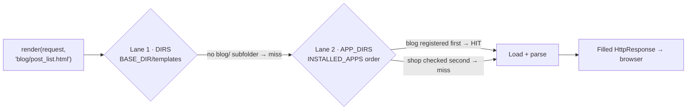
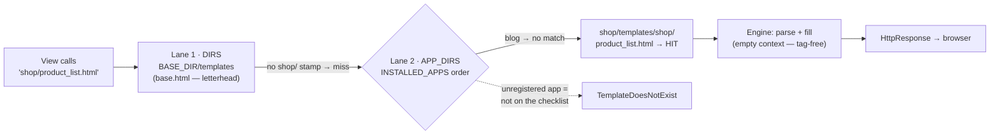

# 🚀 A011 — App-Level Templates Setup (HTML Integration)

`📖 Lecture A011` · `🎓 Track: Core Django` · `📶 Level: Beginner` · `✅ Status: Documented`

> [!NOTE]
> **About this chapter's sources:** built primarily from an **eighth real artifact** — the
> `myProject4/` project in this very folder, which runs **two apps** (`blog` + `shop`) and
> gives each one its own `templates/<app>/` subfolder: the app-level lane A010 only
> brushed. Every file below is quoted verbatim from disk. The command journal
> [`commands.txt`](../commands.txt) adds no new lines (the last entry is still A007's
> `django-admin --version` at line 25 — A011, like A007–A010, was *file-editing*; the
> artifact is the record). A010's `settings.py` provides the "before" for the diff.
> Django's official templates docs fill detail (namespacing rationale, lookup order) and
> are marked 📌. No transcript exists for A011.

---

## 🧭 What You Will Learn

- [ ] Create **app-level template folders** — `blog/templates/blog/`, `shop/templates/shop/` — and serve them via `APP_DIRS`
- [ ] Apply the **`<app>/` namespacing convention**: why the view says `'blog/post_list.html'`, not `'post_list.html'`
- [ ] Trace the engine's **two-lane lookup** (`DIRS` → app dirs) for a namespaced name, including the misses
- [ ] Explain why **app registration in `INSTALLED_APPS`** is a precondition for the `APP_DIRS` lane
- [ ] Distinguish a **shared project-level template** (`base.html`) from app-owned pages — and spot an *orphaned* one
- [ ] Add a new page to an existing app in three touches, without touching settings

## 🎯 Why This Lecture Matters

A010 gave the project a **central print room**: one `templates/` folder at the project
root, wired through `DIRS`. Fine for a homepage. But the moment a project runs *multiple
apps* — as `myProject4/` does — one shared folder becomes a name-collision minefield: what
happens when both `blog` and `shop` want a page called `post_list.html`, or — as A010
planted — when a project template collides with an app's `home.html`?

A011 answers with the industry-standard convention: **each app carries its own templates,
inside a subfolder named after the app**. `blog/templates/blog/post_list.html`. The
subfolder isn't decoration — it's the *namespace* that keeps two apps' files from
shadowing each other, exactly as A008's manual `blog-home` name prefixes kept two apps'
URL names distinct. Same disease, same cure, one level lower: files instead of routes.

This lecture also completes the lookup-order picture. A010's `APP_DIRS: True` was a
no-op — zero apps, empty registry. Here the registry has two entries, and the engine's
second lane finally has somewhere to look. After A011 you can read any real Django
project's template layout fluently, and you'll know precisely *which lane* served a page —
knowledge the next lecture (`A012`, managing HTML files) and template inheritance both
assume.

## ✅ Prerequisites

- [ ] **A008** — two apps in one project; `include()` prefixes; why duplicate names collide
- [ ] **A010** — the two-lane lookup (`DIRS` first, `APP_DIRS` second, first match wins); `render()` as find-fill-wrap; the print-room model
- [ ] **A006** — `startapp` + the *manual* `INSTALLED_APPS` registration step

### 📌 Recap — where A010 left us

A010's `myProject3/` had **zero apps**: the project-level `templates/` folder and `DIRS`
did all the work, and `APP_DIRS: True` searched an empty registry. The chapter closed
with a prediction exercise: *when the next artifact arrives with `blog/` and `shop/`
apps — which lane will their pages use, and what happens if a name collides with
`home.html`?* A011's `myProject4/` answers both: the pages ride the **`APP_DIRS` lane**
(in app-owned `templates/<app>/` subfolders), and the collision question never even
arises — because every call is namespaced by the app's own subfolder. The shared
`base.html` stays in the project-level room, just as the model predicted.

---

## 🏗️ The Artifact — Two Apps, Each Owning Its Pages

Ground truth from `myProject4/` on disk (`__pycache__/` omitted):

```
A011_App_Level_Templates_Setup_HTML_Integration/
└── myProject4/
    ├── manage.py · db.sqlite3 (0 bytes)
    ├── myProject4/               ← the config package
    │   ├── settings.py           ← 'blog' + 'shop' registered; DIRS now pathlib
    │   ├── urls.py               ← two includes: shop/ THEN blog/
    │   └── templates/            ← the DIRS lane (project level)
    │       └── base.html         ← ⚠️ rendered by nobody — see below
    ├── blog/                     ← app 1 (registered, A006)
    │   ├── views.py              ← def post_list → 'blog/post_list.html'
    │   ├── urls.py               ← path('', views.post_list, name='post_list')
    │   └── templates/
    │       └── blog/             ← the app's own namespaced subfolder
    │           └── post_list.html
    └── shop/                     ← app 2 (registered, A006)
        ├── views.py              ← def product_list → 'shop/product_list.html'
        ├── urls.py               ← path('', views.product_list, name='product_list')
        └── templates/
            └── shop/             ← its own namespaced subfolder
                └── product_list.html
```

Four observations set the lecture's agenda:

1. **Both apps are registered.** `INSTALLED_APPS` now ends with `'blog',` and `'shop',` —
   the manual A006 step, again done by hand. This registration is not just "switch the app
   on" — it's what puts each app *on the engine's search map* (the `APP_DIRS` lane walks
   `INSTALLED_APPS` order).
2. **Templates live in `templates/<app>/` subfolders.** Not `blog/templates/` flat —
   `blog/templates/blog/`. The doubled name is the namespace. That's the convention, and
   this chapter's core idea.
3. **The names are distinct.** `name='post_list'` vs `name='product_list'` — no shared
   `name=` anywhere in the project. A008's collision lesson, learned and applied.
4. **`DIRS` keeps the project lane open.** `base.html` sits in `myProject4/templates/` —
   the A010 print room, still wired (`'DIRS': [BASE_DIR / 'templates']`), still shared.
   Two lanes, both populated, one project.

> ⚠️ **Style note (diff vs A010):** `myProject4/settings.py` writes `'DIRS':
> [BASE_DIR / 'templates']` — the **modern pathlib spelling** A010 flagged as 📌. No
> `import os`, no `os.path.join`. The next-artifact prediction paid off: the owner's style
> evolved to the docs' current idiom. (The inert `MAILERS` block from A010's artifact
> appears here verbatim too — still unread by Django core, still flagged, still out of
> scope.)

The project's URLconf (verbatim — note the ordering):

```python
from django.contrib import admin
from django.urls import path, include

urlpatterns = [
    path('admin/', admin.site.urls),
    path('shop/', include('shop.urls')),
    path('blog/', include('blog.urls')),
]
```

**Explanation:** the A007/A008 shape — one row per app, each prefixed, each delegating via
`include()`. The prefixes don't overlap, so first-match-wins has nothing to bite on here;
but note `shop/` is listed **before** `blog/` — the owner's ordering, not a requirement
(the prefixes are disjoint, so either order serves identically). Ordering only matters
when routes overlap — A008's duplicate-`''` bug was that lesson; this file is its healthy
sibling.

Here is `blog/views.py`, verbatim (the entire file, 140 bytes):

```python
from django.shortcuts import render

# Create your views here.
def post_list(request):
    return render(request, 'blog/post_list.html')
```

And its sibling in `shop/views.py` (verbatim, 148 bytes):

```python
from django.shortcuts import render

# Create your views here.
def product_list(request):
    return render(request, 'shop/product_list.html')
```

**Read them together — the doubled name is the contract.** The view calls
`'blog/post_list.html'` — an app prefix, then the page name. And the file sits at
`blog/templates/blog/post_list.html` — the app's template folder, then *the same app
prefix*, then the page. The call and the disk layout rhyme. Why the ceremony? Because
without it, this exact project has a trap:

| Scenario | Flat folders | Namespaced folders |
|---|---|---|
| both apps want the same page name (e.g. a future `post_list.html` in each) | **collision** — the engine serves whichever app comes first in `INSTALLED_APPS`; the other silently gets the wrong page | no collision — `blog/post_list.html` and `shop/post_list.html` are *different names* |
| an app wants a name the project folder already owns (`home.html`) | `DIRS` wins (A010) — the app's page never renders | the shadow still exists — **but** the app can *choose* a distinct namespaced name to sidestep it |

Namespacing doesn't change the lookup *order* — A010's rules stand, `DIRS` still beats app
dirs. It changes the *names in play*: app files stop sharing one flat namespace and start
carrying their owner's label. A008 prefixed URL *names* (`blog-home`) for the same
reason; A011 prefixes template *files* (`blog/…`). One convention, applied to the second
collision-prone resource.

> 🧠 **The one-line convention to memorize:** *an app's templates live at
> `app/templates/<app>/page.html`, and every view calls them by the namespaced name —
> the `<app>/` prefix is the file-level equivalent of A008's `name=` prefixing.*

### The two-lane trace for `'blog/post_list.html'`

Following the engine (📌 `DjangoTemplates` loader; A010's order, now with populated lanes):



Step by step: `DIRS` is searched first — but `BASE_DIR/templates/` contains only
`base.html`, no `blog/` subfolder, so lane 1 **misses**. Lane 2 walks `INSTALLED_APPS`
(`blog` registered before `shop`): `blog`'s registration makes
`blog/templates/blog/post_list.html` a search location, and the namespaced name matches
the namespaced folder — **hit** on the first app checked (`shop` would have been checked
second and found nothing for a `blog/`-prefixed name).

One precondition hides in that trace: had `blog` **not** been in `INSTALLED_APPS`, lane 2
would never have looked in its folder — the `APP_DIRS` lane only walks *registered* apps.
A006's manual registration step matters twice: once to run the app at all, and once to put
its templates on the engine's map. Unregistered app + app-level template =
`TemplateDoesNotExist` — the same receipt-with-empty-rooms from A010, now caused by a
missing registry entry instead of a missing `DIRS` edit.

### Why both lanes stay open in this project

`myProject4/` deliberately runs **both lanes populated**: `base.html` in the project room
(`DIRS`), owned pages in each app (`APP_DIRS`). The division of labor is the point:

- **Project-level (`DIRS`)** — content the *whole site* shares: base layouts, letterheads,
  error pages. `base.html` ("Page Title" + a generic lorem body) is exactly such a shell.
- **App-level (`APP_DIRS`)** — pages *owned* by one component: `blog`'s post list,
  `shop`'s product list. They travel with the app; a future project reusing `blog` gets
  its templates for free.

A010 said it as "shared print room before private printers"; A011 is the day the private
printers get installed — while the shared room stays open for the letterhead.

---

## 🔄 The Journey — `/shop/` Through the Two-Lane Pipeline

A007/A010's journey, with the `include()` hop and the two-lane lookup (nine stations):

| Step | Actor | What happens |
|---|---|---|
| 1 | Browser → dev server | `GET /shop/` arrives at `runserver` |
| 2 | Middleware | passes through the default layers (A001's security lanes) |
| 3 | `ROOT_URLCONF` | `myProject4.urls` consulted (`settings.py` verbatim) |
| 4 | `urlpatterns` | `path('shop/', include('shop.urls'))` — first non-admin row; prefix strips |
| 5 | App URLconf | `shop/urls.py`: `path('', views.product_list, name='product_list')` matches the remainder |
| 6 | View call | `views.product_list(request)` — `from . import views` (app-level sibling) |
| 7 | `render()` | loader searches lane 1 (`DIRS`): `BASE_DIR/templates/` — no `shop/` folder → **miss** |
| 8 | Lane 2 | `INSTALLED_APPS` order → `shop/templates/shop/product_list.html` → **hit** |
| 9 | Response | engine parses the tag-free HTML (empty context), wraps in `HttpResponse` → browser shows "Product List" |

> `/blog/` rides the identical route with `post_list` swapped in — the two apps are
> deliberately symmetrical, which makes the *one asymmetry* stand out: in step 4, `shop/`
> is listed before `blog/`, while in `INSTALLED_APPS`, `blog` is registered before `shop`.
> Disjoint prefixes and disjoint names make both orderings harmless — the file is honest
> proof that order only matters when resources collide.

> If step 8 missed — say the view asked for `'product_list.html'` without the namespace —
> lane 1 would miss, lane 2 would find *no flat match* in either app folder, and Django
> would raise `TemplateDoesNotExist` listing both lanes' rooms. The namespaced call is
> what *aimed* lane 2 at the right folder.

### The pages being served — verbatim

`blog/templates/blog/post_list.html` (214 bytes):

```html
<!DOCTYPE html>
<html lang="en">
<head>
    <title>Lorem, ipsum.</title>
</head>
<body>
    <h1>Blog Page</h1>
    <p>Lorem, ipsum dolor sit amet consectetur adipisicing elit. Eum, quo.</p>
</body>
</html>
```

`shop/templates/shop/product_list.html` (321 bytes):

```html
<!DOCTYPE html>
<html lang="en">
<head>
    <meta charset="UTF-8">
    <meta name="viewport" content="width=device-width, initial-scale=1.0">
    <title>Product List</title>
</head>
<body>
    <h1>Product List</h1>
    <p>Lorem ipsum dolor sit amet consectetur adipisicing elit. Ea, maxime.</p>
</body>
</html>
```

And the project-level `myProject4/templates/base.html` (238 bytes):

```html
<!DOCTYPE html>
<html lang="en">
<head>
    <title>Page Title</title>
</head>
<body>
    <h1>Lorem ipsum dolor sit amet.</h1>
    <p>Lorem ipsum dolor sit amet consectetur, adipisicing elit. Ullam, voluptatem?</p>
</body>
</html>
```

**Explanation — three honest reads:**

- **All tag-free, again.** Zero `{{ }}`, zero `` across all three files — like A010's
  `home.html`, every page is static by design of both sides (no context passed, no
  placeholders present). The HTML-integration milestone is that *app-owned pages are now
  served through the standard lane*; the template-language lecture remains the one that
  makes them talk.
- **One meta asymmetry.** `shop`'s page declares `charset` and `viewport`; `blog`'s
  declares only a title (and `base.html` matches `blog`'s minimalism). Nothing breaks —
  browsers assume UTF-8 by default — but it's the kind of drift one *shared letterhead*
  exists to prevent: declare metas once in a base layout, inherit everywhere. That file
  is sitting in the room already.
- **`base.html` is an orphan.** No view in the project renders it — both views call their
  own namespaced pages; nothing calls `'base.html'`. It's *declared but unused*: the
  shared letterhead staged for the template-inheritance lecture, currently serving
  nobody. Knowing *that a shared template isn't referenced* is exactly the kind of layout
  literacy this lecture teaches. (The moment `` arrives, this file becomes
  the parent.)

> ⚠️ **Naming note:** `base.html` sits in the `DIRS` lane *unnamespaced* — correct for a
> project-shared file (the print room's own label). The convention distinguishes: project
> room files may be flat (`base.html`, `home.html`); app files must be namespaced
> (`blog/…`, `shop/…`). If `base.html` were ever moved *into an app*, it would have to
> move to `app/templates/app/base.html` and stay namespaced — A010's shadow rule applies
> that day.

---

## 🧱 Important Vocabulary

*(New terms are registered in [`docs/MEMORY.md`](../docs/MEMORY.md) — the series-wide
glossary; A010's `DIRS`/`APP_DIRS`/lookup-order terms live there too.)*

| Term | Simple meaning | Technical meaning | 🧷 Memory hook |
|---|---|---|---|
| **App-level templates folder** | an app's own `templates/` directory inside the app package | searched by the `APP_DIRS` lane when the app is registered; location = `app/templates/` | each shop's private printer |
| **`<app>/` namespacing convention** | putting app templates in a subfolder named after the app | `app/templates/<app>/page.html`; every `render()` call uses the namespaced name — prevents cross-app name collisions | label every form with the shop's name |
| **Namespaced template name** | the call-side half of the convention | `'blog/post_list.html'` — a relative path resolved against every configured location; the prefix aims the match | the call rhymes with the file |
| **Two-lane lookup (populated)** | both search locations active | `DIRS` (project) first, then registered apps' folders in `INSTALLED_APPS` order; first match wins | the checklist walks both rooms |
| **Registration precondition** | the `APP_DIRS` lane only walks registered apps | an unregistered app's template folder is invisible to the engine — the A006 step matters for templates too | not in the mall directory → its printer isn't on the checklist |
| **Orphaned template** | a staged file no view renders yet | present on disk, wired lane-wise, but referenced by no `render()` call — reserved (here: for inheritance) | letterhead printed; nobody's holding it |

---

## 💡 Real-World Analogy — Private Printers, Labeled Forms

The **mall model** extends (A010's central print room stays on the map):

- **Each app-level `templates/<app>/` folder** is a **shop's private printer**. `blog`
  owns one, `shop` owns one — installed the day the shops registered.
- **The `<app>/` subfolder** is the **shop's name stamped on every form** it prints. Two
  shops may both print a "daily list" — but one says *Blog — daily list*, the other
  *Shop — daily list*. No clerk ever grabs the wrong sheet, because the labels differ.
- **`INSTALLED_APPS` registration** is the **mall directory entry that puts the shop's
  printer on the clerk's checklist**. A shop that cut its shell (A006) but skipped the
  directory entry has a printer nobody's checklist includes — its forms are unreachable
  (`TemplateDoesNotExist`).
- **The clerk's checklist order** is unchanged from A010: central room first (`DIRS`),
  then printers shop-by-shop in directory order (`INSTALLED_APPS`). First labeled match
  wins — and `DIRS` can still shadow (feature and footgun).
- **`base.html` in the central room** is the **shared letterhead** — one copy, every shop
  may use it, owned by the building. Today it sits in its tray; the inheritance lecture
  is when the shops start printing *on* it.
- **`TemplateDoesNotExist`** remains the receipt — now it lists the central room *and*
  every registered shop's tray; an unregistered shop's tray isn't even on the list.

> ⚠️ **Where the analogy is exact:** the clerk never *knows* which shop's printer served a
> form — only that the label matched. Swap `blog`'s folder contents tomorrow and every
> `'blog/…'` call serves the new sheets with zero code change: ownership lives in the
> layout, not in the calls.

---

## ❌ Common Beginner Mistakes

1. ❌ **Creating `app/templates/` but skipping the `<app>/` subfolder.** *Why:* the first
   level "looks app-level". *Fix:* the convention is **two levels** — `blog/templates/blog/post_list.html`
   and calls say `'blog/post_list.html'`. The stamped label is the collision-prevention
   mechanism; the artifact's calls prove it on disk.
2. ❌ **Cutting an app's folder without registering the app in `INSTALLED_APPS`.** *Why:*
   registration "felt done" at `startapp`. *Fix:* unregistered shops aren't on the clerk's
   checklist — the A006 lesson rides along: an unregistered app's printer is invisible to
   `TemplateDoesNotExist`'s receipt.
3. ❌ **Calling by bare name (`render(request, 'post_list.html')`).** *Why:* the file is
   right there. *Fix:* `DIRS`'s central room is checked **first** — and only contains
   `base.html`. The clerk checks the central room, then registered shops, in directory
   order. Unstamped names can match the wrong shop; call by stamped name.
4. ❌ **Expecting app templates to work from an unregistered app.** *Why:* the folder
   exists, so "it should serve". *Fix:* the checklist is `DIRS`'s list, then
   `INSTALLED_APPS`'s registered apps in order. `blog` before `shop` on this disk — the
   A008 first-match rule, now shop-by-shop across apps.
5. ❌ **Serving one project while editing another.** *Why:* two folders, one terminal.
   *Fix:* `runserver` prints the serving settings module — confirm which mall is open.
6. ❌ **`base.html` in an app folder "so apps can find it".** *Why:* shared skeletons
   feel app-natural. *Fix:* A002's letterhead belongs to the *building*: the central room
   (`DIRS`) is where site-wide skeletons live; the shared copy shouldn't be stamped with
   one shop's name. The inheritance lecture is when shops print *on* it.
7. ❌ **Assuming `DIRS` and `APP_DIRS` are either/or.** *Why:* two flags, feels like a
   toggle. *Fix:* both stay on — A010's map rides along. The central room is checked
   first; registered shops follow in directory order. Shadowing stays a feature and a
   footgun.

## 🧠 Common Misconceptions

| ✅ Correct model | ❌ Misconception |
|---|---|
| App template lookup is **per registered app**, in `INSTALLED_APPS` order | all `templates/` folders are searched "simultaneously" with no order |
| `blog` is registered before `shop`, and that decides tie-breaks | folder order on disk has no effect on lookup |
| `DIRS`'s central room is checked **first** and can shadow | `APP_DIRS` disables project-level templates (or vice versa — both stay on) |
| Two levels: `app/templates/<app>/…`, calls say `'<app>/…'` | `app/templates/file.html` and a bare call are "the same thing" |
| `base.html` in `DIRS`'s room is *shared letterhead* — building-owned | shared skeletons "belong in whichever app needs them" |
| The artifact's two `urlpatterns` differ only in *prefix and stamp* | `blog` and `shop` wiring "must be different somehow" (they're identical stamps of one formula) |

> 🧠 **One sentence for the whole mechanism:** *templates are stamped with their shop's
> name; the clerk checks the building's central room first, then registered shops in
> directory order — first labeled match wins; the two app URLs are one formula with
> different stamps.*

---

## 🧪 Practical Example — Add a Shop Page (Extend the Artifact)

> [!NOTE]
> The app-edition of A010's three touches: one stamped file, one view, one route — no
> settings change, because `shop` is already registered and its printer is on the checklist.

**Step 1 — the stamped template** (`shop/templates/shop/about.html`):

```html
<!DOCTYPE html>
<html lang="en">
<head>
    <meta charset="UTF-8">
    <meta name="viewport" content="width=device-width, initial-scale=1.0">
    <title>About the Shop</title>
</head>
<body>
    <h1>About Shop</h1>
    <p>App-owned page, stamped and served via the APP_DIRS lane.</p>
</body>
</html>
```

**Step 2 — the view** (`shop/views.py`, add below `product_list`):

```python
def about(request):
    return render(request, 'shop/about.html')
```

**Step 3 — the route** (`shop/urls.py`, add to `urlpatterns`):

```python
path('about/', views.about, name='shop-about'),
```

**Step 4 — run and visit:**

```bash
py .\manage.py runserver
# /shop/         → product_list.html  (the artifact's original page)
# /shop/about/   → about.html         (your new page — same shop printer)
# /blog/         → post_list.html     (untouched — disjoint prefix, disjoint name)
```

**Explanation — three details do the convention's work:** the file is stamped
(`shop/templates/shop/about.html`), so the call is namespaced (`'shop/about.html'`) and
lane 2 aims straight at `shop`'s folder. The route's name is **prefixed** (`shop-about`,
A008's convention) because `blog` could grow its own about page tomorrow — two
`shop-about`/`blog-about` names never collide, just as the two stamped files never do.
And nothing touched `settings.py`: registration already happened once (A006), and that
single entry keeps serving every page the app will ever own. Compare the cost curve:
A010's setup was folder + `DIRS` + import; the app edition is *zero* setup, one stamp
forever.

---

## 🎯 Interview Perspective

> [!IMPORTANT]
> Interview cards test *understanding*, not recitation.

**Q1. Why do Django apps put templates in `templates/<app>/` instead of directly in `templates/`?** *(beginner)*

> **Strong answer:** "The `<app>/` subfolder is a namespace. Two apps can legitimately
> need a same-named page — if both dropped a flat `list.html`, the engine would serve
> whichever app comes first in `INSTALLED_APPS` and silently shadow the other. With
> `blog/list.html` and `shop/list.html` the names differ, so every `render()` call is
> unambiguous. Django doesn't force the subfolder — it's the convention the docs
> recommend."
>
> **Why it works:** names the failure mode (silent shadowing by registry order), the
> mechanism (namespace), and the honest caveat (convention, not enforcement).

**Q2. Walk me through how Django finds `'blog/post_list.html'`.** *(conceptual)*

> **Strong answer:** "Two lanes, in order. Lane 1: every directory in `TEMPLATES['DIRS']`
> — the engine looks for `blog/post_list.html` inside each; my project folder has only
> `base.html`, so that misses. Lane 2: `APP_DIRS` walks registered apps in
> `INSTALLED_APPS` order, checking `<app>/templates/blog/post_list.html` in each — `blog`
> is registered, its folder has exactly that path, hit. First match wins; had `blog` not
> been registered, lane 2 would never have looked and I'd get `TemplateDoesNotExist`."
>
> **Why it works:** recites the order *and* the precondition, and names the error — the
> three facts that separate "used render()" from "understood the loader".

**Q3. You've created `shop/templates/shop/page.html`, registered the app, and still get `TemplateDoesNotExist`. Where do you look?** *(practical)*

> **Strong answer:** "Three usual suspects: the call isn't namespaced (`'page.html'`
> instead of `'shop/page.html'` — it'll miss the stamped folder); the subfolder is missing
> the second level (`shop/templates/page.html`); or a typo makes call and file disagree.
> The `DEBUG` error page lists every location tried — I read that receipt and see exactly
> which room the clerk checked and which name it asked for. The mismatch is always
> visible in that list."
>
> **Why it works:** treats the receipt as diagnostic output (A010's habit) and maps each
> symptom to a convention violation.

**Q4. When do you put a template at project level vs inside an app?** *(judgment)*

> **Strong answer:** "Ownership decides. If the template belongs to one component and
> should travel with it — a post list, a product list — it's app-level and namespaced. If
> the whole site shares it — base layouts, error pages, letterheads — it's project-level
> in `DIRS`. My rule: app-owned pages are stamped; building-owned pages stay in the
> central room. And since `DIRS` wins, I keep project-level names distinctive so they
> never accidentally shadow an app's page."
>
> **Why it works:** a placement rule with a reason, plus the shadowing caveat — showing
> both lanes as one system rather than two tricks.

---

## 🔁 Active Recall

Retrieval builds memory — answer *in your head first*, then expand each answer.

1. The view says `render(request, 'blog/post_list.html')`. Name every location the engine
   checks, in order, and where the hit lands.

<details><summary>Answer</summary>

Lane 1: each directory in `TEMPLATES['DIRS']` — here `BASE_DIR/templates/`, which holds
only `base.html` (no `blog/` subfolder) → miss. Lane 2: registered apps in
`INSTALLED_APPS` order — `blog` first: `blog/templates/blog/post_list.html` → **hit**
(the namespaced call matches the namespaced folder). `shop` would have been checked
second and found nothing for a `blog/`-prefixed name. First match wins.</details>

2. Why does the convention use a doubled folder (`blog/templates/blog/`) instead of just
   `blog/templates/`?

<details><summary>Answer</summary>

The second level is the **namespace**. Without it, two apps could each own a flat
`post_list.html` and the engine would silently serve whichever app is registered first —
shadowing the other. With the stamped subfolder, `blog/post_list.html` and
`shop/post_list.html` are different names, so every call is unambiguous. It's the
file-level twin of A008's manual `name=` prefixing (`blog-home`). 📌 The official docs
recommend the subfolder for exactly this reason.</details>

3. What happens if `blog` is created but never added to `INSTALLED_APPS`, and a view calls
   `render(request, 'blog/post_list.html')`?

<details><summary>Answer</summary>

`TemplateDoesNotExist`. The `APP_DIRS` lane only walks **registered** apps, so `blog`'s
template folder is never searched; `DIRS` doesn't contain it either. The A006
registration step matters twice: once to run the app, once to put its templates on the
engine's map. The DEBUG receipt lists the rooms actually checked — the unregistered
shop's tray isn't even on it.</details>

4. In the artifact, `blog` is registered before `shop`, but the project `urls.py` lists
   `shop/` before `blog/`. Why is this asymmetry harmless — and when would it not be?

<details><summary>Answer</summary>

Both orderings are only tie-breakers for *collisions*, and this project has none: URL
prefixes are disjoint (`shop/` vs `blog/`), URL names are distinct (`product_list` vs
`post_list`), and template names are namespaced (`shop/…` vs `blog/…`). First-match-wins
has nothing to bite on. It would matter the moment resources overlap — A008's
duplicate-`''` routes were exactly that failure.</details>

5. The artifact's `settings.py` writes `'DIRS': [BASE_DIR / 'templates']` — how does this
   differ from A010's artifact, and what does the difference prove?

<details><summary>Answer</summary>

A010's artifact used the legacy idiom `os.path.join(BASE_DIR, 'templates')` (plus a
hand-added `import os`); this one uses the **modern pathlib spelling** `BASE_DIR /
'templates'` with no `os` involved — the 📌-flagged style A010 predicted. It proves the
style evolved between artifacts, and that both spellings build the same absolute path.
(The inert `MAILERS` block, by contrast, carried over verbatim — still unread by Django
core.)</details>

6. No view in `myProject4/` renders `base.html`. What is such a file called here, and why
   is it *not* a bug?

<details><summary>Answer</summary>

An **orphaned template** — declared but unreferenced. It sits in the `DIRS` lane, correctly
placed and reachable (a `render(request, 'base.html')` would find it), but no view calls
it yet. It's the shared letterhead staged for the template-inheritance lecture: when
`` arrives, `base.html` becomes the parent every app page builds on. Layout
literacy includes spotting which files are wired *and* which are staged.</details>

7. Trace the full nine-station journey of `GET /shop/` — which stations are identical to
   A010's `/` journey, and which are new?

<details><summary>Answer</summary>

Identical skeleton: middleware → `ROOT_URLCONF` → `urlpatterns` → view → `render` →
response (A007/A010). New: (a) station 4 **strips the `shop/` prefix** and hops into
`shop/urls.py` via `include()` (A007/A008's delegation); (b) station 5 matches the empty
route `''`; (c) the lookup is two-lane with a **populated** lane 2 — `DIRS` misses, then
`INSTALLED_APPS` order finds `shop/templates/shop/product_list.html`; (d) the served page
is *app-owned*, not project-owned.</details>

8. What would break — and what would still work — if `DIRS` were emptied to `[]` in this
   artifact?

<details><summary>Answer</summary>

Still works: both app pages (`/blog/`, `/shop/`) — they ride lane 2, which never touches
`DIRS`. Breaks: any *future* call to `'base.html'` (and any other project-level file) —
the central room would be off the checklist entirely, same as A010's default-state
lesson. The two lanes are independent: `APP_DIRS` does not need `DIRS`, and vice versa.
That independence is exactly why the artifact keeps both configured — app pages and the
shared letterhead are different jobs.</details>

---

## 📝 Quick Revision — A011 in Five Minutes

**The convention in one breath:**

```
blog/templates/blog/post_list.html          ← the file (two levels: templates/ + stamp/)
def post_list(request):
    return render(request, 'blog/post_list.html')   ← the call (namespaced name)
```

**The two-lane checklist (memorize):**

| Rank | Lane | Searched for | Active when |
|---|---|---|---|
| 1 | `DIRS` — project room (`BASE_DIR/templates/`) | the *full* namespaced name | `DIRS` non-empty |
| 2 | `APP_DIRS` — registered apps, in `INSTALLED_APPS` order | `<app>/templates/<namespaced name>` | app registered |

**Seven-second rules:**

- The doubled folder is the **namespace** — two apps' same-named pages never collide.
- Calls rhyme with files: `'blog/post_list.html'` ↔ `blog/templates/blog/post_list.html`.
- Registration is the **precondition** — unregistered app = invisible printer.
- First match wins, `DIRS` first: project templates can shadow app pages (feature/footgun).
- Distinct `name=`s (`post_list` vs `product_list`) — A008's rule held in this artifact.
- `base.html` is the orphaned letterhead: reachable, unrendered, staged for inheritance.
- Modern spelling arrived: `'DIRS': [BASE_DIR / 'templates']` — no `os.path.join`.

---

## 🧠 Final Mental Model — The Mall's Full Print Map



*One sentence to carry:* **every app stamps its pages with its own name; the clerk checks
the building's central room first, then registered shops in directory order; first labeled
match wins — and the letterhead waits in the central room for the day the shops print on
it.** Two lanes, both populated, one checklist, zero collisions.

---

## ❓ FAQ

**Q1. Is the `<app>/` subfolder required, or just recommended?**
A: Recommended, not enforced — Django will happily serve a flat `app/templates/page.html`
if the call says `'page.html'`. The convention exists because flat names collide across
apps (and with project-level files), and the docs recommend the subfolder for exactly that
reason (📌). The artifact follows it; production projects follow it; follow it.

**Q2. Does `APP_DIRS` search the config package's `templates/` too?**
A: No — `APP_DIRS` walks *registered apps only*, and `myProject4` (the config package) is
not in `INSTALLED_APPS`. The project room is reachable only through `DIRS` — which is
precisely why the artifact keeps `'DIRS': [BASE_DIR / 'templates']` even though both apps
have their own folders. Two lanes, two jobs.

**Q3. Both apps are registered and both have `templates/` folders — whose is checked first?**
A: The one **earlier in `INSTALLED_APPS`** — here `blog` (lines 41–42: `'blog',` then
`'shop',`). Order only decides ties; namespaced calls make ties impossible for app pages.
The `urls.py` listing `shop/` first is a separate list with separate rules (URL matching),
and its prefixes don't overlap — so the two orderings coexist harmlessly.

**Q4. Could `blog` render `base.html` from the project room?**
A: Yes — nothing scopes a template to its owning app. Any view may call
`render(request, 'base.html')`: lane 1 (`DIRS`) finds it. That's the print-room model:
the letterhead is building-owned, every shop may print on it. (The inheritance lecture
will make that the *normal* way pages get their chrome.)

**Q5. Why does `settings.py` still import nothing extra — no `os` — this time?**
A: Because the modern spelling needs no helper: `BASE_DIR` is already a `pathlib.Path`,
and `Path / 'templates'` builds the same absolute path `os.path.join` did. A010's
artifact needed `import os` *only* because it used the legacy idiom. Diff the two
artifacts' `DIRS` lines and you've seen the whole story.

**Q6. The `MAILERS` block again — still unread?**
A: Still unread. It's verbatim from disk (the honesty contract), identical to A010's
artifact, and Django's core still reads `EMAIL_BACKEND`, not `MAILERS` (📌). Flagged, not
endorsed — and now a small artifact-to-artifact continuity test: can you *predict* which
quirks will persist into `myProject5/`?

---

## 🏁 Learning Checkpoints

- [ ] **Checkpoint 1 — Convention:** I can create `shop/templates/shop/about.html` and call it with the correctly namespaced name, and explain why both levels exist — *§Core Idea*
- [ ] **Checkpoint 2 — Lookup trace:** I can trace `'blog/post_list.html'` through both lanes, naming each miss and the hit — *§The two-lane trace*
- [ ] **Checkpoint 3 — Precondition:** I can explain why an unregistered app's templates are invisible, and tie it to the A006 registration step — *§Core Idea*
- [ ] **Checkpoint 4 — Placement:** Given a new page, I can decide project-level vs app-level by *ownership*, and predict shadowing when names collide — *§Why both lanes stay open* · *§Misconceptions*
- [ ] **Checkpoint 5 — Diagnosis:** Given a `TemplateDoesNotExist` receipt listing both lanes, I can classify the miss (bare name / missing stamp / unregistered app / wrong lane) — *§Mistakes 1–4*
- [ ] **Checkpoint 6 — Artifact literacy:** I can diff A010's and A011's `settings.py` and name what changed (`pathlib DIRS`, two registrations) and what persisted (`MAILERS`, `APP_DIRS: True`) — *§Style note* · *§Recall 5*

## 🏋️ Exercises

- **Level 1 — Recall:** Without notes: the two lanes in order; the doubled-folder convention; the artifact's two view functions and their namespaced calls; which template is orphaned and why.
- **Level 2 — Understanding:** Explain to a rubber duck why `render(request, 'post_list.html')` *could* work today but is still wrong — name the collision it invites and the registry order that would decide it.
- **Level 3 — Application:** In `myProject4/`: add the shop about page (§Practical Example), then deliberately break it three ways — bare-name call, missing stamp folder, comment out `'shop'` in `INSTALLED_APPS` — reading the `TemplateDoesNotExist` receipt each time. Restore, confirm all three pages serve.
- **Level 4 — Interview reasoning:** A teammate proposes putting *everything* in one app's `templates/` folder "to keep it simple." Argue both sides in three bullets each (one checklist vs. false ownership + shadowing by registry order + reuse cost), then state your recommendation using the print-room model.

## 🏁 Final Takeaways

1. **The `APP_DIRS` lane is now live.** A010's no-op flag has two shoppers: registered apps walk the checklist in `INSTALLED_APPS` order.
2. **The stamp is the safety mechanism.** `templates/<app>/` + namespaced calls make cross-app collisions structurally impossible — A008's prefixing lesson, applied to files.
3. **Calls rhyme with files.** `'blog/post_list.html'` is the whole trick: the name *is* the layout.
4. **Both lanes stay open, on purpose.** Project room for the letterhead (`base.html`), private printers for owned pages — placement follows ownership.
5. **Registration is a precondition twice over.** A006's manual step runs the app *and* maps its templates; unregistered = invisible.
6. **Orderings only matter on collision.** Disjoint prefixes, distinct names, stamped folders — the artifact is the proof that `shop/`-first URLs and `blog`-first registration coexist peacefully.
7. **The modern spelling arrived.** `BASE_DIR / 'templates'` replaced `os.path.join` between artifacts — two spellings, one path; the 📌 prediction from A010 paid off.

---

## 🔄 Next Lecture Connection

Both template lanes are now installed and understood — the *placement* story is complete.
What's still missing is *management*: real sites don't hand-write three near-identical HTML
skeletons, and the artifact's own drift (shop declares `charset`/`viewport`; blog doesn't)
is exactly what shared layouts prevent. The next lecture — **A012 · Manage HTML Files**
(its folder is already in this repo) — takes the wheel: organizing, reusing, and
structuring the HTML across pages, which is where `base.html` — currently the mall's
orphaned letterhead — finally gets its job. The two-lane map you built today is the
ground it stands on: every page it manages will arrive through one of the two lanes you
can now trace blindfolded.

---

<div class="doc-footer">

**Sources used:**

| Source | Role | Notes |
|---|---|---|
| `A011_App_Level_Templates_Setup_HTML_Integration/myProject4/` — eighth real artifact | **Primary** | `settings.py` (`'blog'`+`'shop'` registered, pathlib `DIRS`, verbatim incl. the `MAILERS` block), project `urls.py` (`shop/` before `blog/`), both apps' views/urls/templates quoted verbatim — the namespaced `templates/<app>/` convention on disk, plus the orphaned `base.html` |
| `A010_Templates_Folder_Setup_Project_Level/myProject3/myProject3/settings.py` | Evidence | The "before": `os.path.join` legacy `DIRS`, zero apps — A011's diff shows the modern spelling arriving and both registrations added |
| [`commands.txt`](../commands.txt) | Context | No new lines (last entry remains A007's line 25) — A011 was file-editing; the artifact outranks the journal |
| [A010 — Templates Folder Setup](../A010_Templates_Folder_Setup_Project_Level/README.md) · [A008 — Multiple Apps](../A008_Multiple_Apps_with_Views_URLs_%28Blog_Shop_Example%29/README.md) · [A006 — startapp](../A006_Django_startapp_Command_Explained/README.md) | Context | The two-lane lookup this chapter populates; the name-collision disease/cure; the registration precondition |
| Official Django docs (templates topics, namespacing) | 📌 Supplementary | The `<app>/` subfolder recommendation, `APP_DIRS` search order, `TemplateDoesNotExist` tried-list — flagged 📌 in place |

> 📌 **Scope note:** everything derived from the artifact and the A010 diff is
> source-grounded; loader mechanics (search order, receipt contents, subfolder
> recommendation) come from Django's docs and carry the 📌 badge. The artifact's inert
> `MAILERS` block and its unreferenced `base.html` are flagged ⚠️, not silently endorsed.
> No transcript exists for A011 — declared per the documentation contract.
>
> **Navigation:** [← A010 · Templates Folder Setup (Project Level)](../A010_Templates_Folder_Setup_Project_Level/README.md) · [📚 Series Hub](../README.md) · [A012 · Manage HTML Files →](../A012_Manage_HTML_Files/README.md)
>
> **Series:** [A001](../A001_Introduction_What_is_Django/README.md) ·
> [A002](../A002_MVT_Architecture_Explained/README.md) ·
> [A003](../A003_Install_Python_pip_Django_Virtual_Environment_Setup/README.md) ·
> [A004](../A004_Create_Django_Project/README.md) ·
> [A005](../A005_Django_Files_Folders/README.md) ·
> [A006](../A006_Django_startapp_Command_Explained/README.md) ·
> [A007](../A007_Views_URLs_Basics/README.md) ·
> [A008](../A008_Multiple_Apps_with_Views_URLs_%28Blog_Shop_Example%29/README.md) ·
> [A009](../A009_URL_Parameters_%28path_re_path_kwargs%29/README.md) ·
> [A010](../A010_Templates_Folder_Setup_Project_Level/README.md) · **A011** ·
> [Hub](../README.md)

</div>
