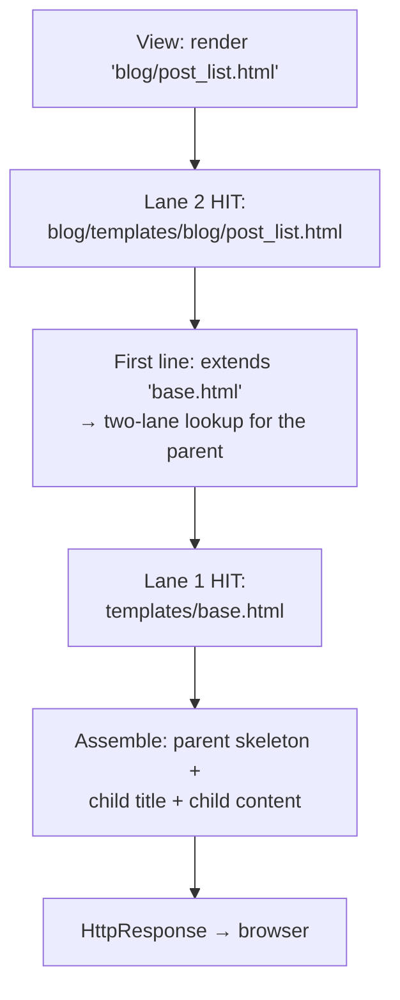
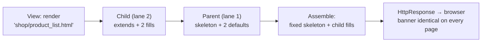

# 🚀 A012 — Manage HTML Files

`📖 Lecture A012` · `🎓 Track: Core Django` · `📶 Level: Beginner` · `✅ Status: Documented`

> [!NOTE]
> **About this chapter's sources:** built primarily from a **ninth real artifact** — the
> `myProject4/` project in this very folder. Every template below is quoted verbatim from
> disk, and every `.py` file (`views.py`, `urls.py`, `settings.py`, `apps.py`, `manage.py`)
> was diffed against A011's artifact: **byte-identical, zero Python changed** — this lecture
> is pure template-file work. The command journal [`commands.txt`](../commands.txt) adds no
> new lines (still A007's line 25 — file-editing again). Django's official template-inheritance
> docs supply the `` / `` mechanics and are marked 📌. No transcript
> exists for A012.

---

## 🧭 What You Will Learn

- [ ] Turn a standalone page into a **parent layout** with `` regions — and slim app pages into **children** that `` it
- [ ] Explain what a **block default** is, and what renders when a child doesn't override a block
- [ ] Trace how the engine resolves the **parent name** through the same two-lane lookup (cross-lane inheritance)
- [ ] Predict the two silent failures: **block-name typos** (no error, default shows) and **stray content outside blocks** (dropped)
- [ ] Decide what belongs in the parent vs the child — the ownership rule for shared HTML
- [ ] Add a new inheriting page in three touches, with zero settings and zero Python changes

## 🎯 Why This Lecture Matters

A011 ended with an honest observation: three near-identical full HTML skeletons, already
drifting — `shop`'s page declared `charset`/`viewport`, `blog`'s didn't. Multiply that by a
real site's twenty pages and you get the classic disease: one design tweak means twenty
edits, and the one you forget is the one users see.

A012 is the cure the artifact was staged for. A011's orphaned `base.html` — the shared
letterhead nobody rendered — finally gets its job: it becomes a **parent template** with two
named blanks (`title`, `content`), and both app pages become **children** that fill them.
The skeleton is now written once; pages supply only what differs.

This is also the lecture where an A002 idea comes true. A002 registered the *"Letterhead &
blank fields"* model for template inheritance — three lectures before any project template
existed. Today the blanks get filled for real. And it sets up A013 directly: notice what is
*still* missing — zero `{{ }}`, empty context. Structure first, data second.

## ✅ Prerequisites

- [ ] **A011** — the two-lane lookup, namespaced app templates, and the orphaned `base.html` this chapter adopts
- [ ] **A002** — template inheritance named as *"Letterhead & blank fields"* (`` + ``)
- [ ] **A010** — `DIRS` as the project-room signpost; `render()` as find-fill-wrap

### 📌 Recap — where A011 left us

A011's `myProject4/` ran two registered apps with tag-free namespaced pages, plus a
`base.html` staged in the project lane that **no view rendered** — an *orphaned template*,
reserved for inheritance. The chapter closed predicting exactly this lecture: shared
layouts, reuse, structure. A012's artifact answers with the same project, same URLs, same
views — and three rewritten HTML files.

---

## 🏗️ The Artifact — Same Project, Three Rewritten Templates

Ground truth from `myProject4/` on disk (`__pycache__/` omitted):

```
A012_Manage_HTML_Files/
└── myProject4/
    ├── manage.py · db.sqlite3 (0 bytes)
    ├── myProject4/               ← the config package
    │   ├── settings.py           ← byte-identical to A011's (see below)
    │   └── urls.py               ← byte-identical: shop/ THEN blog/
    ├── templates/                ← the DIRS lane (project level — outer root)
    │   └── base.html             ← 234 bytes: NOW a parent (two blocks)
    ├── blog/                     ← app 1 (registered)
    │   ├── views.py              ← byte-identical → 'blog/post_list.html'
    │   ├── urls.py               ← byte-identical
    │   └── templates/
    │       └── blog/
    │           └── post_list.html  ← 212 bytes: NOW a child (extends)
    └── shop/                     ← app 2 (registered)
        ├── views.py              ← byte-identical → 'shop/product_list.html'
        ├── urls.py               ← byte-identical
        └── templates/
            └── shop/
                └── product_list.html ← 221 bytes: NOW a child (extends)
```

**Zero-Python evidence:** all eight `.py` files were diffed against A011's artifact —
`blog/views.py`, `blog/urls.py`, `blog/apps.py`, `shop/views.py`, `shop/urls.py`,
`shop/apps.py`, `myProject4/urls.py`, `myProject4/settings.py` — **all identical, zero
diffs**. The URL table (`shop/` before `blog/`), the two view functions, the pathlib
`DIRS`, the registrations, even the inert `MAILERS` block: untouched. This lecture lives
entirely in the three `.html` files.

Here is the parent — `templates/base.html`, verbatim (234 bytes):

```html
<!DOCTYPE html>
<html lang="en">
<head>
    <title> My Django App </title>
</head>
<body>
    <h1>Lorem ipsum dolor sit amet.</h1>
    <hr>
    
</body>
</html>
```

Both children, verbatim. `blog/templates/blog/post_list.html` (212 bytes):

```html


 Blog Posts 


<h1> Posts List </h1>
<p>Lorem ipsum dolor, sit amet consectetur adipisicing elit. Libero, at?</p>

```

`shop/templates/shop/product_list.html` (221 bytes):

```html


 Shop posts 


    <h1> Shop Product </h1>
    <p>Lorem ipsum dolor sit amet consectetur adipisicing elit. Ea, maxime.</p>

```

Four observations set the lecture's agenda:

1. **The parent declares two blanks.** `` wraps a default
   (`My Django App`); `` wraps nothing (empty default). Everything
   outside the blocks is the fixed skeleton every child inherits verbatim.
2. **The children supply only differences.** Neither child repeats the doctype, `<head>`,
   or `<body>`. Each is three moves: claim the parent, fill `title`, fill `content`.
   The `charset`/`viewport` drift from A011 is gone — not by editing two files, but by
   deleting the duplication that allowed the drift.
3. **The byte counts tell the story.** Parent 234 bytes (up from A011's 238-byte
   standalone). Blog child 212 bytes (was 214 — same size, now *zero skeleton*). Shop
   child 221 bytes (was 321 — 100 bytes of skeleton deleted). Children shrink as the
   parent absorbs the shared shell.
4. **Both children cross lanes to reach the parent.** `blog/post_list.html` lives in lane 2
   (`APP_DIRS`) but names `"base.html"`, which lives in lane 1 (`DIRS`). The extends
   string resolves through the *same* two-lane lookup — inheritance is not a third
   mechanism.

> ⚠️ **Discrepancy note — `base.html` moved between artifacts:** A011's chapter (and its
> tree diagram) places `base.html` at `myProject4/myProject4/templates/base.html` — the
> *inner* config package. A012's artifact has it at `myProject4/templates/base.html` — the
> *outer* project root. But both artifacts' `settings.py` say `'DIRS':
> [BASE_DIR / 'templates']`, and `BASE_DIR` is the outer root (the folder containing
> `manage.py`) — so `DIRS` points at the **outer** `templates/` in both cases. That means
> in the A011 artifact, `DIRS` pointed at an `outer/templates/` that **did not exist on
> disk** — its `base.html` sat in a folder the engine never searched, doubly orphaned
> (unrendered *and* unfindable). A012's move puts the file where `DIRS` actually looks.
> Whether the owner moved it deliberately (fixing the wiring) or by accident while
> reorganizing, the teaching outcome is the same: A012's `base.html` is genuinely reachable
> via lane 1, which is the precondition for everything this chapter demonstrates. The A011
> chapter's tree is quoted as the owner left it — this note corrects the record without
> rewriting history.

**Explanation — what changed, file by file, against A011:**

- `base.html`: was a standalone page (`<title>Page Title</title>`, lorem heading + prose).
  Now a layout: the title wrapped in `` with a new default
  (`My Django App`), the body prose replaced by the fixed heading + `<hr>` plus an empty
  ``. Tag count goes 0 → 4: the artifact's first template tags.
- `blog` page: was a full skeleton (`<!DOCTYPE…>`, `<title>Lorem, ipsum.</title>`).
  Now a child: extends line + two block fills. Its visible content (`Posts List` heading,
  its paragraph) survives inside ``.
- `shop` page: was the longest skeleton (321 bytes, `charset`/`viewport` metas). Now a
  child (221 bytes): the metas went with the skeleton, the visible content preserved in
  blocks.

> ⚠️ **Honesty flag:** the `MAILERS` block from A010/A011 persists verbatim in this
> artifact's `settings.py` — still unread by Django core (`EMAIL_BACKEND` is the real
> setting, 📌). Three artifacts running, zero Python changed, quirk intact.

---

## 🧠 Core Idea — One Skeleton, Named Blanks, Filled Per Page

Three concepts carry the chapter. Each follows definition → analogy → why → how → example.

### 1. The parent: `` declares a named, overridable region

**Definition:** a `…` region marks part of a template as
*replaceable* — a named slot with a default (whatever sits between the tags).

**Analogy:** the letterhead's blank fields (A002's model, now real). The company name at
the top is pre-printed; the "RE:" line and body are blanks you fill per letter. `base.html`
is the letterhead: doctype, heading, `<hr>` pre-printed; `title` and `content` left blank.

**Why it exists:** without named blanks there are only two bad options — duplicate the
whole skeleton per page (A011's disease), or `` static fragments with no
per-page customization. Blocks give *structured* reuse: fixed parts fixed, varying parts
named.

**How it works:** the engine parses `base.html` into fixed text + two slots:

| Slot | Default on disk | Overridden by |
|---|---|---|
| `title` | ` My Django App ` | both children (`Blog Posts`, `Shop posts`) |
| `content` | *(empty)* | both children (their headings + prose) |

The rule: **a child that names a block replaces its default entirely** — the default
renders only if no child overrides it. The empty `content` default means "nothing shows
here unless a child fills it." The `title` default means "shows `My Django App` unless a
child says otherwise."

**Example:** a hypothetical third page that extends `base.html` but defines only
`` would render `<title> My Django App </title>` — the parent's default
showing through exactly where the child stayed silent. Defaults are fallback content, not
comments.

### 2. The child: `` claims a parent, blocks fill it

**Definition:** `` (📌, first line) tells the engine: render the
*parent*, but with this file's block fills swapped in for the parent's defaults.

**Why first line:** the engine must know the layout before reading fills — a child is
meaningless without its parent. Anything the child writes *outside* `` regions
is **silently dropped** (📌 — the most common beginner surprise; the parent owns the
skeleton, so stray child text has nowhere to go). The artifact's children obey this: every
line that matters sits inside a block.

**How it works — the render of `/blog/` in four steps:**



**The cross-lane point:** step C reuses the A011 lookup — `"base.html"` (flat name) is
checked against `DIRS` first, and `templates/base.html` hits immediately. A child in lane 2
inherits from a parent in lane 1 with no new machinery. (Had the parent lived in an app,
the name would be namespaced — e.g. `` — same lookup,
longer name.)

### 3. The ownership rule: parent holds the shared, children hold the different

**Definition:** what every page repeats goes in the parent; what makes a page *that page*
goes in the child.

**Applied to the artifact:**

| In the parent (shared) | In the children (per-page) |
|---|---|
| doctype, `<html>`, `<head>`, `<body>` | `` line |
| `<h1>Lorem ipsum…</h1>` + `<hr>` banner | `<title>` text per page |
| block *declarations* + defaults | block *fills* (headings + prose) |

**Why it matters:** the next design change (new banner text, a nav bar, a footer) touches
*one file*. Under A011's layout it touched every page. The ownership rule is DRY applied
to HTML — A001's *"one price tag per item"*, now with tags.

> 🧠 **One sentence for the mechanism:** *the parent prints the skeleton once with named
> blanks; each child names the parent and fills only its blanks; the extends string
> resolves through the same two lanes — structure written once, differences per page.*

---

## 🔄 The Journey — `/shop/` Through Parent + Child

A011's nine stations, with station 8 (the lane-2 hit) now opening a second act:

| Step | Actor | What happens |
|---|---|---|
| 1 | Browser → dev server | `GET /shop/` arrives at `runserver` |
| 2 | Middleware | passes through the default layers |
| 3 | `ROOT_URLCONF` | `myProject4.urls` consulted (byte-identical) |
| 4 | `urlpatterns` | `path('shop/', include('shop.urls'))` — prefix strips, hop into `shop/urls.py` |
| 5 | App URLconf | `path('', views.product_list, name='product_list')` matches the remainder |
| 6 | View call | `views.product_list(request)` — byte-identical view |
| 7 | `render()` | loader searches lane 1 (`DIRS`): no `shop/` folder → **miss** |
| 8 | Lane 2 | `INSTALLED_APPS` order → `shop/templates/shop/product_list.html` → **hit** |
| 9 | Extends | first line names `"base.html"` → lane 1 lookup → `templates/base.html` → **hit** |
| 10 | Assemble | parent skeleton + child `title` (`Shop posts`) + child `content` → full HTML |
| 11 | Response | engine wraps in `HttpResponse` → browser shows banner + `Shop Product` |

> Stations 1–8 are A011 verbatim — same URLs, same views, same lanes. The new stations
> are 9–10: the extends lookup and the assembly. Inheritance adds work *after* the child
> is found, never before. `/blog/` rides the identical route with its own fills.

### The assembled page — what the browser actually receives for `/shop/`

No file on disk contains this HTML — it is built per request from two files:

```html
<!DOCTYPE html>
<html lang="en">
<head>
    <title> Shop posts </title>      ← child's title fill
</head>
<body>
    <h1>Lorem ipsum dolor sit amet.</h1>  ← parent's fixed banner
    <hr>                                  ← parent's fixed rule
    <h1> Shop Product </h1>               ← child's content fill
    <p>Lorem ipsum dolor sit amet ...</p> ← child's content fill
</body>
</html>
```

**Explanation:** fixed lines come from `base.html`; the title and everything below the
`<hr>` come from the child. Two files in, one page out — and the banner is identical on
`/blog/` by construction, not by copy-paste.

---

## 🧱 Important Vocabulary

*(New terms are registered in [`docs/MEMORY.md`](../docs/MEMORY.md) — the series-wide
glossary; A002's inheritance term and A010/A011's lookup terms live there too.)*

| Term | Simple meaning | Technical meaning | 🧷 Memory hook |
|---|---|---|---|
| **Parent template** | the shared skeleton other pages build on | a template containing `` regions; never rendered directly here — reached via `` | the letterhead itself |
| **``** | the line where a child names its parent | must be the child's first tag (📌); its string resolves through the normal two-lane lookup | "print this on that letterhead" |
| **``** | a named, fillable region of the parent | `default` — declares the slot and its fallback content | a labeled blank field |
| **Block default** | what shows when a child stays silent | the content between `` and `` in the parent; replaced entirely when a child fills the block | the pre-printed line |
| **Child template** | a page that fills a parent's blanks | contains `` + `` fills; stray text outside blocks is dropped (📌) | the filled-in letter |
| **Cross-lane inheritance** | child and parent found in different lanes | e.g. lane-2 child extends a lane-1 parent — one lookup mechanism, two searches | two rooms, one checklist, twice |

> New terms must also be added to `docs/MEMORY.md` §2.

## 💡 Real-World Analogy — The Company Letterhead

One analogy, carried through: `base.html` is the company's **printed letterhead** — logo,
address line, and footer pre-printed on every sheet; two labeled blanks left open ("RE:"
line, body). Each department's letter (`blog`, `shop`) is a **filled-in sheet**: it never
reprints the logo — it names the letterhead ("print on company stock") and fills only its
blanks. Change the logo once at the printer, and every future letter carries the new one.
That is `` + ``: shared ink printed once, per-letter ink filled per
page. The block *default* is the faint pre-printed suggestion in the blank ("e.g. …") —
visible only when the writer leaves that field empty.

## ❌ Common Beginner Mistakes

1. ❌ **Misspelling a block name in the child** (``). *Why:* no error is
   raised — the parent's `content` default (here: empty) renders, and the misnamed block is
   ignored. *Fix:* block names are a silent contract; diff child names against the parent's
   declarations character by character.
2. ❌ **Writing content outside `` in the child.** *Why:* the skeleton feels like
   it needs "extra text around the blocks." *Fix:* the parent owns everything outside
   blocks — stray child text is dropped (📌). If it must show, put it inside a block or in
   the parent.
3. ❌ **`` not on the first line.** *Why:* adding a comment or HTML above it
   feels harmless. *Fix:* the engine needs the parent before anything else (📌) — extends
   first, always.
4. ❌ **Quoting the wrong parent name** (``). *Why:* the
   app-namespace habit from A011 over-applied. *Fix:* `base.html` lives in lane 1
   (project room), flat and unnamespaced — the extends string follows the *file's* lane,
   not the *child's*. Read the receipt: lane 1 tried, lane 2 tried, neither had that path.
5. ❌ **Editing the assembled HTML in the browser and wondering where the file is.**
   *Why:* View Source shows one page; disk holds two files. *Fix:* inheritance assembles
   per request — edit the parent for shared lines, the child for page lines.
6. ❌ **Duplicating the skeleton "just for this one special page."** *Why:* one page feels
   exceptional. *Fix:* that is A011's disease returning — add a third block to the parent
   instead; exceptions multiply.

## 🧠 Common Misconceptions

| ✅ Correct model | ❌ Misconception |
|---|---|
| `` reuses the **same two-lane lookup** — no third mechanism | inheritance has its own separate search system |
| An un-overridden block renders its **default** (possibly empty) | unfilled blocks render nothing / raise an error |
| Block-name mismatches fail **silently** (default shows) | every template mistake raises an error |
| Text outside blocks in a child is **dropped** | everything the child file contains appears |
| Parent holds the **shared**, children the **different** (DRY) | each page should be self-contained "to be safe" |
| `{{ }}` variables and inheritance are **independent** — this chapter has blocks, zero variables | blocks pass data / variables create structure |

> 🧠 **One sentence for the whole mechanism:** *the parent declares named blanks with
> defaults; children claim the parent first-line and fill only their blanks; the parent
> name resolves through the same two lanes — shared skeleton once, per-page fills.*

---

## 🧪 Practical Example — Add an Inheriting About Page (Extend the Artifact)

> [!NOTE]
> The A011 exercise, one rung up: same three touches (stamped file, view, route) — but the
> new file is a *child*, so it is shorter than any page before it. No settings change, no
> Python beyond one view + one route.

**Step 1 — the child template** (`shop/templates/shop/about.html`, new file):

```html


 About the Shop 


<h1>About Shop</h1>
<p>App-owned page, inheriting the shared banner.</p>

```

**Step 2 — the view** (`shop/views.py`, add below `product_list`):

```python
def about(request):
    return render(request, 'shop/about.html')
```

**Step 3 — the route** (`shop/urls.py`, add to `urlpatterns`):

```python
path('about/', views.about, name='shop-about'),
```

**Step 4 — run and visit:**

```bash
py .\manage.py runserver
# /shop/         → product_list.html + base.html  (artifact's page, assembled)
# /shop/about/   → about.html + base.html        (your new child, same banner)
# /blog/         → post_list.html + base.html    (untouched — disjoint everything)
```

**Explanation — what the convention buys this time:** the new file is ~7 lines with zero
skeleton — compare A011's ~12-line standalone about page. The route name stays prefixed
(`shop-about`, A008's rule) because `blog` could grow its own about page. And the banner
(`<h1>` + `<hr>`) arrives free: change it once in `base.html`, both shop pages *and* the
blog page update together. That single-edit propagation is the whole lecture in one
command.

---

## 🎯 Interview Perspective

> [!IMPORTANT]
> Interview cards test *understanding*, not recitation.

**Q1. What problem does template inheritance solve?** *(beginner)*

> **Strong answer:** "Duplication. Without it, every page repeats the full HTML skeleton —
> this project's pages already drifted (shop had meta tags, blog didn't). With a parent
> holding the skeleton and `` blanks, each page supplies only its differences.
> One layout edit propagates to every page."
>
> **Why it works:** names the disease (drift via duplication), the cure (single skeleton),
> and the payoff (one-edit propagation) — all visible in the artifact's byte counts.

**Q2. Walk me through what happens when the view renders `'shop/product_list.html'`.**
*(conceptual)*

> **Strong answer:** "Two lookups. First the normal two-lane search finds the child in
> lane 2 (`shop/templates/shop/product_list.html`). Then the child's first line names
> `'base.html'`, which resolves through the *same* lookup — lane 1 hits
> (`templates/base.html`). The engine renders the parent's skeleton with the child's
> `title` and `content` fills swapped in for the defaults."
>
> **Why it works:** shows inheritance as reuse of the known mechanism (not new magic),
> names both lanes and both hits, and ends at assembly.

**Q3. A page renders but shows the parent's default title instead of the child's. What
happened?** *(practical)*

> **Strong answer:** "Almost certainly a block-name mismatch — the child wrote
> `` or similar, so the parent's `title` block found no override and
> rendered its default. No error is raised; mismatches are silent. I diff the child's
> block names against the parent's declarations."
>
> **Why it works:** maps the symptom (default showing) to the silent-failure rule and
> gives the diagnostic move — the habit this chapter drills.

**Q4. When does content go in the parent vs the child?** *(judgment)*

> **Strong answer:** "Ownership. Repeated-on-every-page goes in the parent (doctype,
> banner, nav, footer, block declarations); unique-to-this-page goes in the child (its
> title text, its body). If I catch myself pasting the same HTML into a second child,
> that HTML belonged in the parent — possibly as a new block."
>
> **Why it works:** a decision rule plus its smell-test, grounded in DRY rather than
> recited syntax.

---

## 🔁 Active Recall

Retrieval builds memory — answer *in your head first*, then expand each answer.

1. The child says ``. How does the engine find the parent?

<details><summary>Answer</summary>

Through the same two-lane lookup (A011). `"base.html"` is checked against `DIRS` first —
`templates/base.html` hits in lane 1. Inheritance adds no new search mechanism; the
extends string is just another template name. (A namespaced parent like `"blog/base.html"`
would miss lane 1 and hit lane 2 — same checklist, longer name.)</details>

2. A child defines only `` and no `title` block. What renders in
`<title>`?

<details><summary>Answer</summary>

The parent's default: ` My Django App `. An un-overridden block renders whatever sits
between its `` and `` in the parent. Defaults are fallback
content — silence means "keep the pre-printed line."</details>

3. The child writes `` (typo). What renders — and is there an error?

<details><summary>Answer</summary>

The parent's `content` default (here: empty — a blank page body), and **no error**.
Block names are a silent contract: the misnamed block matches nothing and is ignored.
Symptom → diagnosis: "default showing where my fill should be" always means diff the
names.</details>

4. The child has a paragraph *between* its two `` fills, outside both. Does it
render?

<details><summary>Answer</summary>

No — stray text outside blocks in a child is **silently dropped** (📌). The parent owns
the skeleton; only block fills cross from child to page. Move the text inside a block or
into the parent.</details>

5. Trace `GET /shop/` stations 9–11. What is new versus A011's journey, and what is
byte-identical?

<details><summary>Answer</summary>

Byte-identical: stations 1–8 (URLs, views, both lanes — zero Python changed). New: station
9 (the extends line triggers a second lookup, lane-1 hit on `base.html`), station 10
(assembly: parent skeleton + child fills), station 11 (the response now carries the banner
plus page content — two files, one page).</details>

6. `base.html` moved from the inner config package (A011) to the outer root (A012). Why
does the move matter?

<details><summary>Answer</summary>

Because `DIRS` is `[BASE_DIR / 'templates']` and `BASE_DIR` is the outer root — so only
the outer `templates/` is ever searched. In A011's layout the file sat where the engine
never looked (doubly orphaned: unrendered and unfindable). The move puts it on the lane-1
checklist, which is the precondition for every `` in this
chapter.</details>

7. Shop's child is 221 bytes; A011's shop page was 321. Where did the 100 bytes go — and
why is the blog delta (~2 bytes) so much smaller?

<details><summary>Answer</summary>

Into the parent: doctype, head, body, and the meta tags now live once in `base.html`
instead of per page. Blog's delta is tiny because its A011 page was already minimal (no
metas) — the skeleton it shed was small. The lesson: inheritance savings scale with how
much skeleton each page carried.</details>

8. What is *still* missing from every template — and which lecture supplies it?

<details><summary>Answer</summary>

`{{ }}` variables and context data: all three files are still static (blocks shape
structure; no data flows). Views still call `render()` with no third argument. A013
(Templates 1: Basics & Variables — its folder already exists) supplies the data half:
context dictionaries flowing into `{{ }}` placeholders.</details>

---

## 📝 Quick Revision — A012 in Five Minutes

**The pattern in one breath:**

```
base.html:              default  +  
child:                    →  fill title  →  fill content
render('shop/page.html'): lane 2 finds child → extends string → lane 1 finds parent → assemble
```

**Seven-second rules:**

- Parent declares blanks with defaults; children fill them — silence keeps the default.
- `` is first line; its string uses the same two-lane lookup (cross-lane here).
- Stray child text outside blocks is dropped (📌); block-name typos fail silently (no error).
- Extends names follow the *parent's* lane: lane-1 parent → flat `"base.html"`.
- Ownership: shared skeleton in parent, per-page fills in children — one-edit propagation.
- Zero Python changed: same URLs, same views, same settings — structure only.
- Still static: zero `{{ }}` — data arrives in A013.

---

## 🧠 Final Mental Model — The Letterhead Press



*One sentence to carry:* **the parent is the letterhead press (skeleton + blanks, printed
once); each child is a filled-in sheet (extends + fills); the press name resolves through
the same two lanes — change the press, every letter updates.**

---

## ❓ FAQ

**Q1. Does the child need the full HTML skeleton "just in case"?**
A: No — that defeats the lecture. The parent supplies doctype through `</html>`; the
child supplies only fills. A child with a skeleton renders it *nowhere* (outside-block
text is dropped) — dead weight that misleads the next reader.

**Q2. Can a child extend a parent inside an app?**
A: Yes — same mechanism, namespaced name: `` would miss
lane 1 and hit lane 2. The extends string follows the parent's lane, not the child's.
Here the parent is project-level, so flat `"base.html"` is correct.

**Q3. Can parents chain (a child that is itself a parent)?**
A: Yes (📌 — beyond this artifact): a template can both `` a grandparent
and declare blocks for its own children. Real sites chain site → section → page. The
artifact stays two levels; the mechanism nests freely.

**Q4. Why do both children override *both* blocks? Could one skip `title`?**
A: It could — and the parent's ` My Django App ` default would show. The artifact
overrides both because each page wants its own tab text. Skipping is legal, not broken:
defaults are the mechanism for "most pages share this."

**Q5. The assembled page has two `<h1>`s (banner + page heading). Is that bad HTML?**
A: It is realistic-owner-HTML, not textbook HTML — the banner plus a per-page `<h1>` is
what the artifact's prose gives us. A real pass would demote one to `<h2>` or wrap the
banner in `<header>`. Flagged honestly; the inheritance teaching is unaffected.

**Q6. The `MAILERS` block again — still unread?**
A: Still unread — verbatim across three artifacts now (A010→A011→A012), and Django's
core still reads `EMAIL_BACKEND`, not `MAILERS` (📌). Flagged, not endorsed.

---

## 🏁 Learning Checkpoints

- [ ] **Checkpoint 1 — Parent:** I can convert a standalone page into a parent (fixed skeleton + `` regions with defaults) — *§Core Idea 1*
- [ ] **Checkpoint 2 — Child:** I can write a child (`` first line + fills) with nothing outside blocks — *§Core Idea 2*
- [ ] **Checkpoint 3 — Cross-lane trace:** I can trace `"base.html"` from a lane-2 child to the lane-1 hit, naming both lookups — *§Core Idea 2* · *§Journey 9–10*
- [ ] **Checkpoint 4 — Defaults:** I can predict what renders when a child skips a block (default shows, no error) — *§Core Idea 1* · *§Recall 2–3*
- [ ] **Checkpoint 5 — Silent failures:** I can diagnose a block-name typo and stray outside-block text from symptoms alone — *§Mistakes 1–2*
- [ ] **Checkpoint 6 — Ownership:** Given a new shared element, I can place it (parent vs child) and justify the edit count — *§Core Idea 3* · *§Practical Example*

## 🏋️ Exercises

- **Level 1 — Recall:** Without notes: the two block names; the extends string; which lane each file lives in; the two silent-failure rules; the three byte counts.
- **Level 2 — Understanding:** Explain to a rubber duck why `` needs no new lookup machinery — then explain why a typo'd block name raises no error while a typo'd extends name raises `TemplateDoesNotExist`.
- **Level 3 — Application:** In `myProject4/`: add the about child (§Practical Example), then (a) break it with a block-name typo and read the symptom, (b) add stray text outside blocks and confirm it vanishes, (c) change the banner `<h1>` once and confirm all three pages update. Restore.
- **Level 4 — Interview reasoning:** A teammate proposes one giant `base.html` with ten blocks "for flexibility." Argue both sides (reuse vs. cognitive load on every child author), then state your block-count rule using the letterhead model.

## 🏁 Final Takeaways

1. **Inheritance is reuse, not a new search.** `` strings resolve through the same two lanes — cross-lane here, same checklist.
2. **Parents declare blanks with defaults; silence keeps the default.** Un-overridden blocks render fallback content, never errors.
3. **Failures are silent — names are the contract.** Typo'd blocks and stray text vanish without errors; diff against the parent.
4. **Ownership decides placement.** Shared skeleton once in the parent; per-page fills in children — one-edit propagation.
5. **Zero Python changed.** Same URLs, views, settings across A011→A012 — structure managed purely in HTML files.
6. **Structure first, data second.** Zero `{{ }}` in all three files — blocks shape pages; A013's variables will fill them with data.
7. **The move mattered.** Outer-root `base.html` is where `DIRS` looks — A011's inner-path file was doubly orphaned; A012's is genuinely reachable.

---

## 🔄 Next Lecture Connection

Structure is managed — every page now assembles from parent + child. But every assembly is
still *static*: the same banner, the same headings, for every visitor. Real pages greet
users by name, list posts from a database, show prices that change. That needs the other
half of templates — `{{ }}` variables fed by view context dictionaries. The next lecture —
**A013 · Templates 1: Basics & Variables** (its folder is already in this repo, with a new
`myProject5/` artifact) — supplies it: the data half that turns managed structure into
living pages. The parent/child map you built today is the ground it fills: variables can
appear in parents, children, defaults, and fills alike.

---

<div class="doc-footer">

**Sources used:**

| Source | Role | Notes |
|---|---|---|
| `A012_Manage_HTML_Files/myProject4/` — ninth real artifact | **Primary** | All three templates quoted verbatim (parent 234B, blog child 212B, shop child 221B); all eight `.py` files diffed vs A011 — zero diffs; `base.html` at outer `templates/` (moved vs A011's inner path — discrepancy note) |
| `A011_App_Level_Templates_Setup_HTML_Integration/myProject4/` | Evidence | The "before": tag-free standalone pages (238/214/321B), inner-path orphaned `base.html`, identical Python — proves the lecture is pure template work |
| [`commands.txt`](../commands.txt) | Context | No new lines (last entry remains A007's line 25) — file-editing; the artifact outranks the journal |
| [A011](../A011_App_Level_Templates_Setup_HTML_Integration/README.md) · [A002](../A002_MVT_Architecture_Explained/README.md) · [A010](../A010_Templates_Folder_Setup_Project_Level/README.md) | Context | The two-lane lookup reused for extends; the *"Letterhead & blank fields"* model fulfilled; `DIRS`/find-fill-wrap grounding |
| Official Django docs (template inheritance) | 📌 Supplementary | `` first-line rule, block defaults/override semantics, stray-content behavior — flagged 📌 in place |

> 📌 **Scope note:** everything derived from the artifact and the A011 diff is
> source-grounded; inheritance mechanics (first-line rule, default semantics, dropped
> stray content) come from Django's docs and carry the 📌 badge. The `MAILERS` block is
> flagged ⚠️, not endorsed. No transcript exists for A012 — declared per the documentation
> contract.
>
> **Navigation:** [← A011 · App-Level Templates Setup](../A011_App_Level_Templates_Setup_HTML_Integration/README.md) · [📚 Series Hub](../README.md) · [A013 · Templates 1: Basics & Variables →](../A013_Templates_1_Basics_&_Variables/)
>
> **Series:** [A001](../A001_Introduction_What_is_Django/README.md) ·
> [A002](../A002_MVT_Architecture_Explained/README.md) ·
> [A003](../A003_Install_Python_pip_Django_Virtual_Environment_Setup/README.md) ·
> [A004](../A004_Create_Django_Project/README.md) ·
> [A005](../A005_Django_Files_Folders/README.md) ·
> [A006](../A006_Django_startapp_Command_Explained/README.md) ·
> [A007](../A007_Views_URLs_Basics/README.md) ·
> [A008](../A008_Multiple_Apps_with_Views_URLs_%28Blog_Shop_Example%29/README.md) ·
> [A009](../A009_URL_Parameters_%28path_re_path_kwargs%29/README.md) ·
> [A010](../A010_Templates_Folder_Setup_Project_Level/README.md) ·
> [A011](../A011_App_Level_Templates_Setup_HTML_Integration/README.md) · **A012** ·
> [Hub](../README.md)

</div>
