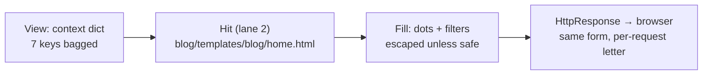

# 🚀 A013 — Templates 1: Basics & Variables

`📖 Lecture A013` · `🎓 Track: Core Django` · `📶 Level: Beginner` · `✅ Status: Documented`

> [!NOTE]
> **About this chapter's sources:** built primarily from a **tenth real artifact** — the
> `myProject5/` project in this very folder (fresh project, single `blog` app). The view
> (`blog/views.py`, 642 bytes) and the template (`blog/templates/blog/home.html`, 1229
> bytes) are quoted verbatim below; `settings.py`, both `urls.py` files, and `apps.py`
> were read and diffed against earlier artifacts. Every rendered-output claim was verified
> by rendering the artifact's exact template source with its exact context through Django
> 6.1.1's engine. The command journal [`commands.txt`](../commands.txt) adds no new lines
> (still A007's line 25 — file-editing again). Django's official template docs supply the
> dot-lookup order, escaping, and comment mechanics, marked 📌. No transcript exists.

---

## 🧭 What You Will Learn

- [ ] Pass data from a view with the **context dictionary** — `render()`'s third argument, finally non-empty
- [ ] Print values with **`{{ }}` variables**, and read lists, objects, and dicts through the single **dot syntax**
- [ ] Explain the engine's **dot-lookup order** (dict → attribute → index) and what a missing name renders
- [ ] Choose the right **comment syntax** — HTML vs `` vs `{# #}` — by where the text must (not) go
- [ ] Predict **auto-escaping** output, and use `safe`, `default`, `default_if_none` correctly
- [ ] Trace `/blog/` end to end: URL → view → context → lane-2 hit → filled page

## 🎯 Why This Lecture Matters

Every page so far has been *static*. A010's `render()` filled nothing. A011's pages carried
lorem ipsum. A012 assembled skeletons from two files — still lorem ipsum. The "fill" in
find-fill-wrap has been an empty promise for three lectures: the wrap worked, the find
worked, but there was never anything to fill *with*.

A013 supplies the missing half: **data**. The view builds a dictionary — a name, an age, a
skill list, an object, a nested blog dict, a `None` — and the template prints each through
`{{ }}` placeholders. Same project shape as before (one app, one route, one `render()`),
but the response now differs per context: change `"Adnan"` to `"Sara"` and the page
changes without touching HTML. Structure (A012) × data (A013) is what makes a template
*alive* — and the page title says it outright: `#1 Template Basic`. This is Templates 1;
A014 takes the filter baton from here.

## ✅ Prerequisites

- [ ] **A010** — `render()` as find-fill-wrap; the context was the "brief" (empty until now)
- [ ] **A011** — namespaced app templates; the lane-2 hit this chapter's page rides
- [ ] **A002** — the context dictionary named, and the DTL's three syntaxes listed

### 📌 Recap — where A012 left us

A012 managed *structure*: a parent skeleton with `` blanks, children filling
them, zero variables anywhere — all three files static, all `render()` calls context-free.
It closed with the exact prediction this artifact answers: *variables fed by view context
dictionaries*. A013's `myProject5/` is a fresh project (new name, one app, no inheritance —
a deliberate pedagogical reset), and its view passes the series' **first non-empty
context**: seven keys covering every value shape a template will ever meet.

---

## 🏗️ The Artifact — Fresh Project, First Living Page

Ground truth from `myProject5/` on disk (`__pycache__/` omitted):

```
A013_Templates_1_Basics_&_Variables/
└── myProject5/
    ├── manage.py · db.sqlite3
    ├── myProject5/               ← the config package
    │   ├── settings.py           ← standard: 'blog' registered, pathlib DIRS,
    │   │                            no outer templates/ on disk (lane 1 empty)
    │   └── urls.py               ← admin/ + path('blog/', include('blog.urls'))
    └── blog/                     ← the single app (registered)
        ├── views.py              ← 642 bytes: User class + home() + 7-key context
        ├── urls.py               ← path('', views.home, name='home')
        └── templates/
            └── blog/
                └── home.html     ← 1229 bytes: comments, {{ }} everywhere
```

The settings story in one paragraph: `'blog'` registered (line 40), `'DIRS':
[BASE_DIR / 'templates']` with **no outer `templates/` folder on disk** (lane 1
configured-but-empty — legal; the loader just finds nothing there), `'APP_DIRS': True`,
and the inert `MAILERS` block verbatim for the **fourth** artifact running (flagged ⚠️,
never endorsed — Django core reads `EMAIL_BACKEND`, 📌). The URL table is the minimal
two-file shape from A007: project strips `blog/`, app serves `''` as `home`.

Here is the view — `blog/views.py`, verbatim (642 bytes):

```python
from django.shortcuts import render
from datetime import datetime

# Create your views here.
class User:
    def __init__(self, name, age):
        self.name = name
        self.age = age

def home(request):
    context = {
        "name": "Adnan",
        "age": 23,
        "skills": ["python", "django", "React"],
        "user": User("Umar", 22),
        "blog": {
            "title": "Django Template Intro",
            "content": "<b>This is Bold</b>",
            "created_at": datetime(2026, 8, 25, 13, 10, 30)
        },
        "empty_value": None,
    }
    return render(request, "blog/home.html", context)
```

And the template — `blog/templates/blog/home.html`, verbatim (1229 bytes):

```html
<!doctype html>
<html lang="en">
  <head>
    <title>#1 Template Basic</title>
  </head>
  <body>
    <h1>Template Basic</h1>
    <! -- This is a 1st comment in HTML -->
     This is a 2nd comment in HTML 
    {# This is a 3rd comment in HTML #}
    <p>Lorem, ipsum dolor sit amet consectetur adipisicing elit. Eligendi, tempore!</p>
    <p>Lorem ipsum dolor sit amet.</p>

     Single Variable 
    <p> Name: {{name}} </p>
    <p> Age: {{age}} </p>

     List Access 
    <p>First skill: {{skills.0}}</p>
    <p>All skills: {{skills}}</p>

     Obj Attribute 
    <p>User name: {{user.name}}</p>
    <p>User age: {{user.age}}</p>

     Dict 
    <h2>Blog Information</h2>
    <p>Title: {{blog.title}}</p>
    <p>Content: {{blog.content}}</p>
    <p>Content: {{blog.content|safe}}</p>
    <p>Create At: {{blog.created_at}}</p>

     Default value 
    <p>Default Empty value: {{empty_value|default:"No value provided"}} </p>
    <p>Default Empty value: {{empty_value|default_if_none:"No Data"}} </p>
  </body>
</html>
```

Four observations set the lecture's agenda:

1. **The context is a seven-key tour of value shapes.** Plain values (`name`, `age`), a
   list (`skills`), an object (`user`), a nested dict (`blog` with a datetime inside), and
   a deliberate `None` (`empty_value`). Each key exists to teach one `{{ }}` behavior.
2. **The template is annotated with its own lesson plan.** Five `` section
   banners (*Single Variable*, *List Access*, *Obj Attribute*, *Dict*, *Default value*)
   divide the page — the owner labeled each teaching block in the file itself.
3. **Three comment syntaxes sit side by side** (lines 8–10): an HTML comment, a
   `` tag, and a `{# #}` tag — visibly different, functionally *not* the same.
   The verified render proves it.
4. **No inheritance at all.** No ``, no `` — a standalone page, on
   purpose. Structure (A012) steps aside so data takes the full stage; the two halves meet
   in real projects, taught separately here.
---

## 🧠 Core Idea — Data In, Placeholders Out

Three concepts carry the chapter. Each follows definition → analogy → why → how → example.
Every output claim below was verified by rendering the artifact's exact template with its
exact context through Django 6.1.1.

### 1. The context dictionary — the view's brief to the template

**Definition:** the third argument to `render(request, name, context)` — a plain dict whose
keys become the template's top-level names.

**Analogy — the evidence bag:** the view bags seven labeled items (`name`, `age`,
`skills`, `user`, `blog`, `empty_value`… plus the nesting inside `blog`) and hands the bag
to the clerk. The template never reaches past the view into Python — it opens only what
was bagged. Nothing bagged, nothing printable: that is why A010–A012's pages were static.

**Why a dict:** keys are the contract both sides share. The view chooses names; the
template uses them. Rename `"name"` to `"username"` in the view without touching HTML and
`{{name}}` goes silent (missing names render empty — §2). One object, two readers, names
as the handshake.

**How it works — the seven keys by shape:**

| Key | Python value | Shape taught |
|---|---|---|
| `name` | `"Adnan"` | plain string |
| `age` | `23` | plain number (prints as-is) |
| `skills` | `["python", "django", "React"]` | list (index + whole) |
| `user` | `User("Umar", 22)` | object with attributes |
| `blog` | `{"title": …, "content": "<b>This is Bold</b>", "created_at": datetime(2026,8,25,13,10,30)}` | nested dict incl. HTML string + datetime |
| `empty_value` | `None` | deliberate nothing (filter behavior) |

**Example:** change `"Adnan"` to `"Sara"` in `views.py`, reload — the page changes with
zero HTML edits. That single edit is the whole lecture's payoff: data flows one way
(view → template), and HTML stops hardcoding content.

### 2. `{{ }}` + the dot — one syntax for every shape, one lookup order

**Definition:** `{{ name }}` prints a top-level key. Dots walk *into* values —
`{{skills.0}}`, `{{user.name}}`, `{{blog.title}}` — with a single lookup order (📌):
**dict-key → attribute → list-index**, first hit wins; a miss renders the empty string
(`string_if_invalid` default, 📌 — silent, no error).

**Why one syntax:** the template author never declares types. `blog.title` works whether
`blog` is a dict, an object, or (failing both) a list — the engine tries each door in
order. Uniform dots keep templates readable; the order keeps them predictable.

**How it works — verified line by line against the artifact's render:**

| Template line | Lookup path | Verified output |
|---|---|---|
| `{{name}}` / `{{age}}` | top-level keys | `Adnan` / `23` |
| `{{skills.0}}` | list index 0 | `python` |
| `{{skills}}` | whole list, printed + escaped | `[&#x27;python&#x27;, &#x27;django&#x27;, &#x27;React&#x27;]` |
| `{{user.name}}` / `{{user.age}}` | object attributes | `Umar` / `22` |
| `{{blog.title}}` | dict key | `Django Template Intro` |
| `{{blog.content}}` | dict key, auto-escaped | `&lt;b&gt;This is Bold&lt;/b&gt;` (tags shown as text) |
| `{{blog.content\|safe}}` | escaping switched off | `<b>This is Bold</b>` (real bold) |
| `{{blog.created_at}}` | datetime, default format | `Aug. 25, 2026, 1:10 p.m.` |
| `{{empty_value\|default:"No value provided"}}` | `None` is false → fallback | `No value provided` |
| `{{empty_value\|default_if_none:"No Data"}}` | `None` specifically → fallback | `No Data` |

**The miss rule (📌):** a name with no match (`{{nickname}}`, `{{skills.9}}`,
`{{user.email}}`) renders as **empty string** — silently. Templates degrade; they never
crash on bad names. Debugging move: the page shows a blank where a value should be → the
key is misspelled, missing from context, or the dot path fails all three doors.

### 3. Comments + escaping + filters — the three supporting mechanics

**Three comment syntaxes, three fates (verified in the render):**

| Line in source | Syntax | In the served HTML? |
|---|---|---|
| `<! -- This is a 1st comment in HTML -->` | HTML comment (⚠️ note: `<! --` with a space — technically malformed; browsers tolerate it) | **yes, verbatim** — templates don't process HTML comments; visitors (View Source) can read it |
| ` … ` | DTL block comment (📌) | **no** — stripped server-side; section banners like `Single Variable` never reach the browser |
| `{# … #}` | DTL single-line comment (📌) | **no** — stripped server-side |

**Rule of thumb:** notes for *template authors* → `{# #}` / `` (never served);
notes that must survive to the browser (copyright, conditional markers) → HTML comments.
The artifact teaches this by seating all three side by side: only the first survives.

**Auto-escaping (📌):** every `{{ }}` value is HTML-escaped by default — `<` becomes
`&lt;`, quotes become `&#x27;`. Verified twice above: the list print and the unfiltered
`blog.content`. The `|safe` filter marks a value trusted (renders raw HTML) — correct here
(the owner wrote the `<b>`), dangerous on user input (XSS — A001's locked door, reopened
by hand). Rule: escape by default; `safe` only on content you authored or sanitized.

**`default` vs `default_if_none` (📌):** `default:"…"` fires on *any* false value (`None`,
`""`, `0`, `[]`, `False`); `default_if_none:"…"` fires *only* on `None`. The artifact
proves both fire on `None` — the difference only shows with `""` or `0` (A014's filter
lecture takes the comparison further).

> 🧠 **One sentence for the mechanism:** *the view bags labeled data in a context dict;
> dots walk into any shape through one lookup order; `{{ }}` prints escaped unless marked
> safe — bags in, printed page out.*

---

## 🔄 The Journey — `/blog/` With Data On Board

A007's two-file wiring, now with the third `render()` argument doing real work:

| Step | Actor | What happens |
|---|---|---|
| 1 | Browser → dev server | `GET /blog/` arrives at `runserver` |
| 2 | Middleware | passes through the default layers |
| 3 | `ROOT_URLCONF` | `myProject5.urls` consulted |
| 4 | `urlpatterns` | `path('blog/', include('blog.urls'))` — prefix strips, hop into `blog/urls.py` |
| 5 | App URLconf | `path('', views.home, name='home')` matches the remainder |
| 6 | View call | `views.home(request)` builds the 7-key context dict |
| 7 | `render()` | loader searches lane 1 (`DIRS` → outer `templates/`, **absent on disk** → miss) |
| 8 | Lane 2 | `INSTALLED_APPS` order → `blog/templates/blog/home.html` → **hit** |
| 9 | Fill | engine walks `{{ }}` + filters against the context (table in §Core Idea 2) |
| 10 | Response | assembled HTML wrapped in `HttpResponse` → browser shows `Adnan`, `Umar`, real bold |

> Stations 1–6 are the A007 shape with a new project name; 7–8 are the A011 lookup with
> lane 1 empty-by-absence; 9 is the lecture's new station — the fill finally fills.

### The rendered page — verified output (abridged to the teaching lines)

```html
<p> Name: Adnan </p>
<p> Age: 23 </p>
<p>First skill: python</p>
<p>All skills: [&#x27;python&#x27;, &#x27;django&#x27;, &#x27;React&#x27;]</p>
<p>User name: Umar</p>
<p>User age: 22</p>
<p>Title: Django Template Intro</p>
<p>Content: &lt;b&gt;This is Bold&lt;/b&gt;</p>
<p>Content: <b>This is Bold</b></p>
<p>Create At: Aug. 25, 2026, 1:10 p.m.</p>
<p>Default Empty value: No value provided </p>
<p>Default Empty value: No Data </p>
```

**Explanation:** twelve `{{ }}` prints, one context, zero errors. Note what is *absent*:
all five `` banners and the `{# #}` line left no trace (stripped
server-side); only the malformed HTML comment survives in the served source. Data in,
page out — the fill station working at last.

---

## 🧱 Important Vocabulary

*(New terms are registered in [`docs/MEMORY.md`](../docs/MEMORY.md) — the series-wide
glossary; A002's DTL terms and A010/A011's lookup terms live there too.)*

| Term | Simple meaning | Technical meaning | 🧷 Memory hook |
|---|---|---|---|
| **Context dictionary** | the labeled bag of data the view hands the template | third arg of `render()`; keys become top-level template names | the evidence bag |
| **`{{ }}` variable** | a print-this-value placeholder | outputs the resolved value, auto-escaped, as a string | the blank on the form |
| **Dot lookup order** | how dotted names resolve (one rule, every shape) | dict-key → attribute → list-index (📌); miss → empty string | try each door in order |
| **``** | a template-author note, never served | block comment stripped server-side (📌) | the margin note |
| **`{# #}`** | a one-line template-author note, never served | single-line comment stripped server-side (📌) | the sticky note |
| **Auto-escaping** | values print HTML-safe by default | `<`, `>`, quotes rendered as entities unless `safe` (📌) | ink that can't stain |
| **`safe` filter** | "I trust this HTML — render it raw" | marks a value exempt from escaping; owner-HTML only, never raw user input | the trusted stamp |

> New terms must also be added to `docs/MEMORY.md` §2.

## 💡 Real-World Analogy — The Form Letter

One analogy, carried through: the view is the **clerk** preparing a form letter, the
context is the **case file** (name, age, skills, user record, blog memo, one empty field),
and the template is the **pre-printed form** with blanks (`{{name}}`, `{{user.name}}`).
The clerk copies file values into blanks — never rewriting the form per case. Auto-escaping
is the clerk's habit of copying *literally* (a `<b>` in the file lands on the page as
visible text, not formatting — ink that can't stain). `|safe` is the supervisor's stamp:
"this memo's formatting is ours — print it live." `|default` is the printed fallback
("No value provided") that shows when a field comes back empty. Change the file, same form
prints a different letter — data flows one way, structure never moves.

## ❌ Common Beginner Mistakes

1. ❌ **Forgetting the context argument** (`render(request, "blog/home.html")`). *Why:*
   A010–A012 trained two-argument calls. *Fix:* no third arg → every `{{ }}` renders
   empty, silently. Blank page with correct skeleton = check the call first.
2. ❌ **Key-name mismatch** (`"username"` in the view, `{{name}}` in HTML). *Why:* the
   handshake is by exact string. *Fix:* misses render empty with no error — diff context
   keys against `{{ }}` names character by character.
3. ❌ **Writing `{{skills[0]}}` (Python brackets).** *Why:* Python habits. *Fix:* DTL uses
   dots only — `{{skills.0}}`. Brackets are a syntax error; dots walk every shape.
4. ❌ **Expecting an error for bad names** (`{{user.email}}` silently blank). *Why:* most
   languages raise on missing attributes. *Fix:* DTL degrades to empty string by design
   (📌) — blank spot on the page means trace the dot path door by door.
5. ❌ **`|safe` on user input.** *Why:* it "fixes" escaped HTML instantly. *Fix:* `safe`
   reopens the XSS door Django locked (A001) — use it only on owner-authored/sanitized
   strings, like this artifact's hardcoded `<b>`.
6. ❌ **Hiding secrets in HTML comments.** *Why:* "it's just a comment." *Fix:* HTML
   comments ship to every visitor (verified: line 8 survives in the render) — author notes
   belong in `{# #}` / ``.

## 🧠 Common Misconceptions

| ✅ Correct model | ❌ Misconception |
|---|---|
| Context flows **one way** (view → template); templates never call back into views | templates can query the view or database directly |
| Dots try **dict → attribute → index** in order, first hit wins | dots mean "attribute access" only |
| Missing names render **empty string**, silently — by design | typos raise errors |
| `{{ }}` output is **escaped by default**; `safe` is opt-out per value | printed HTML renders live unless escaped explicitly |
| `default` fires on **any false** value; `default_if_none` only on `None` | the two filters are interchangeable |
| `` / `{# #}` never reach the browser; **HTML comments always do** | all comments behave the same |

> 🧠 **One sentence for the whole mechanism:** *the view bags data in a context dict;
> dots resolve any shape through one ordered lookup; `{{ }}` prints escaped unless
> stamped safe — blanks filled per request, skeleton untouched.*

---

## 🧪 Practical Example — Add a Second Living Page (Extend the Artifact)

> [!NOTE]
> The A011/A012 exercise, one rung up: same three touches (stamped file, view, route) —
> but the new file prints *data*, so it needs a fourth: context keys in the view.

**Step 1 — the template** (`blog/templates/blog/about.html`, new file):

```html
<!doctype html>
<html lang="en">
  <head><title>About</title></head>
  <body>
    <h1>About {{name}}</h1>
    <p>Second skill: {{skills.1}}</p>
    <p>Writer: {{user.name}}, age {{user.age}}</p>
  </body>
</html>
```

**Step 2 — the view** (`blog/views.py`, add below `home` — reuse the same shapes):

```python
def about(request):
    context = {
        "name": "Adnan",
        "skills": ["python", "django", "React"],
        "user": User("Umar", 22),
    }
    return render(request, "blog/about.html", context)
```

**Step 3 — the route** (`blog/urls.py`, add to `urlpatterns`):

```python
path('about/', views.about, name='blog-about'),
```

**Step 4 — run and visit:**

```bash
py .\manage.py runserver
# /blog/         → home.html + full context   (artifact's page)
# /blog/about/   → about.html + small context (your page — same dots, fewer keys)
```

**Explanation — what the convention buys this time:** the template names only keys the
view bags — add `{{age}}` without bagging `"age"` and it prints empty (the miss rule,
live). The route name stays prefixed (`blog-about`, A008's rule). And the page proves the
lecture's thesis once more: same dots, different bag, different letter from the same form
family.

---

## 🎯 Interview Perspective

> [!IMPORTANT]
> Interview cards test *understanding*, not recitation.

**Q1. How does data get from a view into a template?** *(beginner)*

> **Strong answer:** "As the third argument to `render()` — a context dict. Its keys
> become the template's top-level names, and `{{ }}` prints them. Change a value in the
> view, reload, the page changes with zero HTML edits — one-way flow, names as the
> handshake."
>
> **Why it works:** names the vehicle (context dict), the syntax (`{{ }}`), the direction
> (one-way), and the payoff — all demonstrated by the artifact.

**Q2. How does `{{blog.title}}` resolve — and what if `blog` were an object, not a
dict?** *(conceptual)*

> **Strong answer:** "Through the dot-lookup order: dict-key first, then attribute, then
> list-index — first hit wins. `blog` here is a dict, so the key hits. If it were an
> object with a `title` attribute, the dict door would miss and the attribute door would
> hit — same template, no change. Misses everywhere render empty string, silently."
>
> **Why it works:** recites the order, shows shape-independence (the point of one syntax),
> and lands on the silent-miss rule.

**Q3. The page shows `<b>This is Bold</b>` as visible text instead of bold. Why — and
when is the fix dangerous?** *(practical)*

> **Strong answer:** "Auto-escaping: `{{ }}` HTML-escapes by default, so the tags print
> as text. `|safe` renders them live — correct here because the string is owner-authored.
> It is dangerous on user input because it reopens XSS — `safe` only on content you wrote
> or sanitized."
>
> **Why it works:** maps symptom to mechanism, gives the fix, and states the security
> boundary — the judgment interviewers probe.

**Q4. `default` vs `default_if_none` — when do they differ?** *(judgment)*

> **Strong answer:** "`default` fires on any false value — `None`, `''`, `0`, `[]`.
> `default_if_none` fires only on `None`. The artifact can't show the difference (both
> fire on `None`); it appears with `''` or `0` — an empty search box should keep
> `default_if_none` (user typed nothing, don't overwrite) while a missing setting wants
> `default`."
>
> **Why it works:** states both trigger conditions precisely, admits the artifact's limit,
> and gives a real decision case.

---

## 🔁 Active Recall

Retrieval builds memory — answer *in your head first*, then expand each answer.

1. The view calls `render(request, "blog/home.html")` with no context. What renders in
every `{{ }}` — error or output?

<details><summary>Answer</summary>

Empty output, no error. Every name misses (nothing bagged) and misses render as empty
string. Symptom → diagnosis: correct skeleton with all blanks empty means check the third
`render()` argument first.</details>

2. Trace `{{user.name}}` through the dot-lookup doors. Which door hits — and what would
`{{user.0}}` do?

<details><summary>Answer</summary>

Dict door: `User` isn't a dict — miss. Attribute door: `user.name` exists (`"Umar"`) —
hit. `{{user.0}}`: dict miss, attribute `0` miss, index miss (not a list) — renders empty,
silently.</details>

3. The served HTML contains the `<! -- … -->` line but none of the five ``
banners. Why?

<details><summary>Answer</summary>

Different syntaxes, different fates: HTML comments are plain text the engine passes
through (visible in View Source); `` blocks and `{# #}` are stripped
server-side and never served. Author notes → DTL comments; browser-visible notes → HTML
comments.</details>

4. `{{blog.content}}` shows tags as text; `{{blog.content|safe}}` shows bold. Explain both
— and state when `safe` is forbidden.

<details><summary>Answer</summary>

Auto-escaping escapes `{{ }}` output by default (`<` → `&lt;`); `|safe` marks the value
trusted so it renders raw. Forbidden on unsanitized user input — it reopens the XSS door
(A001). Safe here only because the string is owner-hardcoded.</details>

5. Both `default` and `default_if_none` fire on `empty_value` (`None`). Name a value where
they differ, and say which fires.

<details><summary>Answer</summary>

`""` (or `0`, `[]`, `False`): `default` fires (any false value); `default_if_none` does
not (only `None`). On `None` both fire — the artifact's case, which hides the difference
A014's filter survey will pin down.</details>

6. `{{blog.created_at}}` renders `Aug. 25, 2026, 1:10 p.m.` — no format code in the
template. Where did the format come from?

<details><summary>Answer</summary>

Django's default datetime formatting (📌 — locale-aware `DATE_FORMAT`/`DATETIME_FORMAT`
machinery). The template printed the raw object; the engine formatted it. Custom shapes
(`Y-m-d`, times, `timesince`) belong to the `date` filter family — A014's territory.</details>

7. `{{skills}}` renders `[&#x27;python&#x27;, …]` — ugly. What happened, and what is the
proper fix (not a filter)?

<details><summary>Answer</summary>

Printing a whole list stringifies Python's `repr` (quotes included), then escaping encodes
the quotes. It was included to prove escaping, not as a pattern. The proper fix is
iteration (`` — A014/A015 territory): loop and print each item, never the raw
list.</details>

8. Lane 1 (`DIRS`) points at an `outer/templates/` that doesn't exist — yet the page
renders. Why is that legal, and which lane serves?

<details><summary>Answer</summary>

A configured-but-missing lane is just a miss, not an error — the loader checks, finds
nothing, moves on. Lane 2 serves (`blog/templates/blog/home.html` via `APP_DIRS`). Same
lesson as A011's doubly-orphaned `base.html`, inverted: missing lanes fail soft; the
checklist walks on.</details>

---

## 📝 Quick Revision — A013 in Five Minutes

**The pattern in one breath:**

```
view:   context = {"name": "Adnan", "user": User(...), "blog": {...}} → render(req, "blog/home.html", context)
page:   {{name}} → Adnan · {{user.name}} → Umar · {{blog.title}} → dict key · {{x|default:"…"}} → fallback
lookup: {{a.b}} tries dict-key → attribute → index; miss → "" (silent)
```

**Seven-second rules:**

- Context is the third `render()` arg — no bag, all blanks empty (silently).
- Dots walk any shape; one order (dict → attr → index); misses render `""`.
- `{{ }}` escapes by default; `|safe` only on owner-authored strings.
- `default` = any false; `default_if_none` = only `None`.
- `` / `{# #}` never served; HTML comments always served.
- Datetimes self-format (`Aug. 25, 2026, 1:10 p.m.`); custom formats are filters (A014).
- Never print a whole list — iterate (upcoming); the ugly `&#x27;` render proves why.

---

## 🧠 Final Mental Model — The Form Letter Assembly



*One sentence to carry:* **the view bags labeled data, the lane-2 page supplies the
form, dots copy file-into-blank through one ordered lookup with silent misses — change
the bag, the letter changes, the form never moves.**

---

## ❓ FAQ

**Q1. Can the template compute — call functions, do arithmetic in `{{ }}`?**
A: Deliberately little (📌). Dots can read attributes and even call zero-argument methods,
but there is no `{{ a + b }}` or `{{ f(x) }}` — logic belongs in the view, presentation in
the template. The artifact computes nothing: every `{{ }}` only reads bagged data.

**Q2. Where do `|safe`, `|default` come from — are they variables?**
A: No — they are *filters* (`{{ value|name:"arg" }}`, 📌): small engine-side transforms
applied at print time. This chapter uses three; A014 surveys the text/number/date
families (`upper`, `length`, `date`, `truncatechars`…) on richer data.

**Q3. Why does the HTML comment have a space (`<! --`)? Is that valid?**
A: Strictly, no — valid HTML comments open with `<!--` (no space). Browsers tolerate the
spaced form and render it as a comment, which is why the verified output still carries it.
Flagged honestly: the owner's bytes are quoted verbatim; write `<!--` in your own files.

**Q4. The `User` class lives in `views.py` — is that normal?**
A: Pedagogically yes, architecturally no. Real models live in `models.py` backed by the
database (future lectures); defining `User` beside the view keeps this chapter's focus on
where the class was defined.

**Q5. `{{blog.created_at}}` formatted itself — can I control the shape?**
A: Yes — with the `date` filter (`{{blog.created_at|date:"Y-m-d"}}`, 📌), surveyed in
A014. Bare `{{ }}` on a datetime uses Django's default format; filters reshape it per
page without touching the view.

**Q6. The `MAILERS` block again — still unread?**
A: Still unread — verbatim for the fourth artifact running (A010→A013), and Django core
still reads `EMAIL_BACKEND`, not `MAILERS` (📌). Flagged, not endorsed — the streak
continues until an artifact drops it.

---

## 🏁 Learning Checkpoints

- [ ] **Checkpoint 1 — Context:** I can pass a multi-shape context dict as `render()`'s third arg and predict each `{{ }}` output — *§Core Idea 1–2*
- [ ] **Checkpoint 2 — Dot lookup:** I can resolve any `{{a.b}}` through dict → attribute → index, and predict silent misses — *§Core Idea 2* · *§Recall 2*
- [ ] **Checkpoint 3 — Comments:** I can choose HTML vs `` vs `{# #}` by where the text must (not) appear — *§Core Idea 3* · *§Recall 3*
- [ ] **Checkpoint 4 — Escaping:** I can predict escaped vs `safe` output and state the XSS boundary — *§Core Idea 3* · *§Recall 4*
- [ ] **Checkpoint 5 — Defaults:** I can choose `default` vs `default_if_none` from the falsiness of the value — *§Core Idea 3* · *§Recall 5*
- [ ] **Checkpoint 6 — End-to-end trace:** I can trace `/blog/` URL → context → lane-2 hit → filled page, naming the empty lane — *§Journey*

## 🏋️ Exercises
- **Level 2 — Understanding:** Explain to a rubber duck why `{{skills}}` prints `&#x27;` entities but `{{skills.0}}` prints clean text — then why `{{blog.content}}` and `{{blog.content|safe}}` differ on identical input.
- **Level 3 — Application:** In `myProject5/`: add the about page (§Practical Example), then (a) drop a key from its context and confirm the silent blank, (b) add `{{user.email}}` and confirm the miss rule, (c) swap `default`/`default_if_none` onto `""` and record which fires. Restore.
- **Level 4 — Interview reasoning:** A teammate proposes building HTML strings in the view (`"<b>" + title + "</b>"`) and marking them `safe` "to keep templates simple." Argue both sides (view-side control vs XSS surface + logic-in-presentation), then state your rule using the form-letter model.

## 🏁 Final Takeaways

1. **Context is the fill.** The third `render()` arg bags every printable name — three lectures of empty briefs end here.
2. **One dot order for every shape.** Dict → attribute → index; miss → `""`, silently. Shape-independence is the feature.
3. **Escaped by default, `safe` by stamp.** Identical input, two outputs — and a security boundary on the stamp.
4. **`default` ≠ `default_if_none`.** Any-false vs only-`None` — the artifact hides the gap; falsiness reveals it.
5. **Comments have fates.** DTL comments never serve; HTML comments always do — choose by audience.
6. **Whole-list prints are diagnostics, not patterns.** `&#x27;` soup proves escaping; iteration (coming) is the fix.
7. **Missing lanes fail soft.** `DIRS` points nowhere, lane 2 serves — the checklist walks on.

---

## 🔄 Next Lecture Connection

Data flows — single values print, dots walk shapes, filters reshape at print time. But
this chapter used exactly three filters (`safe`, `default`, `default_if_none`) on one
page's data. Real pages need the full shelf: uppercasing names, counting skills,
truncating long posts, formatting dates per locale, joining lists with commas. The next
lecture — **A014 · Templates 2: Filters (Text, Numbers, Date)** (its folder is already in
this repo) — surveys that shelf: the text/number/date filter families applied to richer
context, where `{{blog.created_at|date:"Y-m-d"}}` finally answers Recall 6 properly. The
context-and-dots map you built today is the ground every filter stands on: filters
transform *resolved values at print time* — resolve first (this chapter), reshape second
(next).

<div class="doc-footer">

**Sources used:**

| Source | Role | Notes |
|---|---|---|
| `A013_Templates_1_Basics_&_Variables/myProject5/` — tenth real artifact | **Primary** | `blog/views.py` (642B, 7-key context + `User` class) and `blog/templates/blog/home.html` (1229B, 12 `{{ }}` prints + 3 comment syntaxes) quoted verbatim; `settings.py`/`urls.py`/`apps.py` read for config (single `blog` registration, pathlib `DIRS` with no outer dir, minimal URL table) |
| `A012_Manage_HTML_Files/myProject4/` | Evidence | The "before": zero `{{ }}`, context-free `render()` — proves the fill station is new |
| [`commands.txt`](../commands.txt) | Context | No new lines (last entry remains A007's line 25) — file-editing; the artifact outranks the journal |
| [A012](../A012_Manage_HTML_Files/README.md) · [A010](../A010_Templates_Folder_Setup_Project_Level/README.md) · [A011](../A011_App_Level_Templates_Setup_HTML_Integration/README.md) · [A002](../A002_MVT_Architecture_Explained/README.md) | Context | Structure-vs-data split; find-fill-wrap with the brief finally filled; lane-2 lookup; DTL three-syntaxes origin |
| Official Django docs (templates: variables, dot lookup, escaping, comments, `default`/`safe`) | 📌 Supplementary | Lookup order, `string_if_invalid`, comment stripping, escaping semantics, filter triggers — flagged 📌 in place |
| Verified render via Django 6.1.1 engine | Verification | All 12 outputs + comment fates + datetime format confirmed by rendering artifact bytes with artifact context |

> 📌 **Scope note:** everything derived from the artifact and its verified render is
> source-grounded; lookup/escaping/comment/filter mechanics come from Django's docs and
> carry the 📌 badge. The `MAILERS` block, the `<! --` spacing, and the in-`views.py`
> `User` class are flagged ⚠️, not endorsed. No transcript exists for A013 — declared per
> the documentation contract.
>
> **Navigation:** [← A012 · Manage HTML Files](../A012_Manage_HTML_Files/README.md) · [📚 Series Hub](../README.md) · [A014 · Templates 2: Filters (Text, Numbers, Date) →](../A014_Templates_2_Filters_Text_Numbers_Date/README.md)
>
> **Series:** [A001](../A001_Introduction_What_is_Django/README.md) ·
> [A002](../A002_MVT_Architecture_Explained/README.md) ·
> [A003](../A003_Install_Python_pip_Django_Virtual_Environment_Setup/README.md) ·
> [A004](../A004_Create_Django_Project/README.md) ·
> [A005](../A005_Django_Files_Folders/README.md) ·
> [A006](../A006_Django_startapp_Command_Explained/README.md) ·
> [A007](../A007_Views_URLs_Basics/README.md) ·
> [A008](../A008_Multiple_Apps_with_Views_URLs_%28Blog_Shop_Example%29/README.md) ·
> [A009](../A009_URL_Parameters_%28path_re_path_kwargs%29/README.md) ·
> [A010](../A010_Templates_Folder_Setup_Project_Level/README.md) ·
> [A011](../A011_App_Level_Templates_Setup_HTML_Integration/README.md) ·
> [A012](../A012_Manage_HTML_Files/README.md) · **A013** ·
> [Hub](../README.md)

</div>
