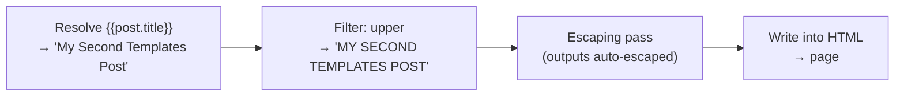
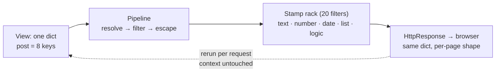

# 🚀 A014 — Templates 2: Filters (Text, Numbers, Date)

`📖 Lecture A014` · `🎓 Track: Core Django` · `📶 Level: Beginner` · `✅ Status: Documented`

> [!NOTE]
> **About this chapter's sources:** built primarily from an **eleventh real artifact** —
> the `myProject6/` project in this very folder (fresh project, single `blog` app). The
> view (`blog/views.py`, 546 bytes) and the template
> (`blog/templates/blog/blog_details.html`, 2012 bytes) are quoted verbatim below;
> `settings.py`, both `urls.py` files, and `apps.py` were read and cross-checked.
> **Every rendered-output claim was verified twice**: by rendering the artifact's exact
> template with its exact context through Django 6.1.1's engine, and by a live `GET /`
> through the request path (Django test client, HTTP_HOST `127.0.0.1:8000`) — it returned
> **200** with the filtered page. That also closes the loop on the owner's early-404 at
> `/`: the wiring now resolves cleanly. The command journal
> [`commands.txt`](../commands.txt) adds no new lines (still A007's line 25 — file-editing
> again). Django's official template-docs filter reference supplies the exact semantics
> (marked 📌). No transcript exists.

---

## 🧭 What You Will Learn

- [ ] Reshape values with the **filter pipe** — `{{ value|filter }}` and `{{ value|filter:arg }}` — at print time, without touching the view
- [ ] Apply the **text family**: `upper`, `lower`, `capfirst`, `title`, `truncatechars`, `truncatewords`, `linebreaks`, `urlencode`
- [ ] Format **numbers**: `floatformat`, `add`, `divisibleby` — and counts with `pluralize`
- [ ] Format **dates & times** with format strings: `{{ post.created_at|date:"D,d,M,Y" }}`, `{{ post.created_at|time:"H:i" }}`
- [ ] Read **collections**: `first`, `last`, `length`, `slice`, `join`
- [ ] Read three-state truth with **`yesno`** — and tell `None` apart from `False`
- [ ] Trace `GET /` end to end and predict each of the artifact's 20 filter outputs

## 🎯 Why This Lecture Matters

A013 made pages *alive*: the view handed over a context dict and `{{ }}` printed it. But it
printed raw — `"Adnan"` stayed as typed, a list showed its `['a', &#x27;b&#x27;]` debug
repr, a datetime showed Django's default `Aug. 26, 2026, 2:20 p.m.`. Real pages do not
print raw values; they present them. Uppercased headings, truncated excerpt lengths, prices
rounded to two decimals, dates in a human format — that last fourth of an inch before the
browser is the *presentation layer*, and **filters are its vocabulary**.

A014 is the lecture where that vocabulary becomes a shelf. The artifact — its page title
declares `#2 Template` — is literally an **inventory of the filter shelf**: 20 distinct
filters spanning text, numbers, dates/times, collections, and three-state logic, each
demonstrated on real data. It is also the first artifact to use a **`` tag** (inside
`divisibleby`), quietly previewing A015's control-flow lecture while staying focused on the
pipe syntax proper to this one.

Interview-wise this is high-yield: filter syntax, the distinction between **resolving** a
value and **reshaping** it, and the escaping contract are exactly the template questions
that separate reciters from understanders.

## ✅ Prerequisites

- [ ] **A013** — `{{ }}` variables, the context dict, dot lookup, auto-escaping, and the three filters it introduced (`safe`, `default`, `default_if_none`)
- [ ] **A011** — namespaced app templates; the lane-2 hit this chapter's page rides
- [ ] **A002** — the DTL's three syntaxes listed, including "you can filter a value"

### 📌 Recap — where A013 left us

A013's `myProject5/` passed seven context keys and printed them with `{{ }}`. It used
exactly **three filters** — `safe`, `default`, `default_if_none` — and its recall bank
closed with the prediction this artifact answers: *the full shelf* — uppercase, counts,
truncation, per-locale dates, list joining. A014's `myProject6/` is a **fresh project** with
a *new* view (`blog_details`) and a *filter-dense* page that shelves **20 distinct filters**
on one small dict. Same two-lane lookup, same `render()` — the only new machinery is the
pipe between the value and the printer.

---

## 🏗️ The Artifact — A Page That Is a Filter Shelf

Ground truth from `myProject6/` on disk (`__pycache__/` omitted):

```
A014_Templates_2_Filters_Text_Numbers_Date/
└── myProject6/
    ├── manage.py · db.sqlite3 (0 bytes)
    ├── myProject6/                 ← the config package
    │   ├── settings.py             ← 3372 B: 'blog' registered; pathlib DIRS; inert MAILERS
    │   └── urls.py                 ← 'admin/' + '' include('blog.urls')
    └── blog/
        ├── apps.py                 ← BlogConfig, name='blog'
        ├── views.py                ← 546 B: blog_details builds one 8-key dict
        ├── urls.py                 ← 128 B: '' → blog_details
        └── templates/
            └── blog/
                └── blog_details.html  ← 2012 B: 20 distinct filters + first 
```
Here is the view — `blog/views.py`, verbatim (546 bytes):

```python
from django.shortcuts import render
from datetime import datetime

# Create your views here.
def blog_details(request):
    post = {
        "title": "My Second Templates Post",
        "descriptions": "Django is a high level python framework that ",
        "author": None,
        "created_at": datetime(2026, 8, 26, 14, 20, 30),
        "comment_count": 5,
        "tags": ["Django", "python", "web devlopment"],
        "price":100,
        "number":7,
    }
    return render(request, 'blog/blog_details.html', {"post": post})
```

The project URLs — `myProject6/urls.py`, verbatim (lines 20–23), plus `blog/urls.py` (full):

```python
urlpatterns = [
    path('admin/', admin.site.urls),
    path('', include('blog.urls'))
]
```

```python
from django.urls import path
from . import views

urlpatterns = [
    path('', views.blog_details, name='blog_details')
]
```

And the template — `blog/templates/blog/blog_details.html`, verbatim (2012 bytes):

```html
<!doctype html>
<html lang="en">
  <head>
    <title>#2 Template</title>
  </head>
  <body>
    <h1>Blog Filter Page</h1>
    <p>Author Available?: {{post.author|yesno:"Yes,No,Maybe"}}</p>
    <p>Comments Count?: {{post.comment_count}} Comment{{post.comment_count|pluralize:"s"}}</p>
    <hr>
     Date Filter 
    <p><b>Created At: </b>{{post.created_at}}</p>
    <p><b>Formatted Date: </b>{{post.created_at|date:"D,d,M,Y"}}</p>
    <p><b>Time Only: </b>{{post.created_at|time:"H:i"}}</p>
    <hr>
     Encoding and Formatting 
    <p><b>Title Encode : </b>{{post.title|urlencode}}</p>
    <p><b>Float formate Example : </b>{{123.4568|floatformat:2}}</p>
    <hr>
     Text filter 
    <p><b>Title (Normal):</b>{{post.title}}</p>
    <p><b>Title (Uppercase):</b>{{post.title|upper}}</p>
    <p><b>Title (Lowercase):</b>{{post.title|lower}}</p>
    <p><b>Title (Capitalize):</b>{{post.title|capfirst}}</p>
    <p><b>Title (Title Case):</b>{{post.title|title}}</p>
    <p><b>Title (Truncate Characters):</b>{{post.title|truncatechars:10}}</p>
    <p><b>Title (Truncate Words):</b>{{post.title|truncatewords:3}}</p>
    <p><b>Title (Line Break):</b>{{post.title|linebreaks}}</p>
    <hr>
    <p><b>Original Price:</b>{{post.price}}</p>
    <p><b>Original Price(+5):</b>{{post.price|add:5}}</p>
     Division By 
    
        <p>{{post.number}} is divisible by 2</p>
    
        <p>{{post.number}} is not divisible by 2</p>
    
     List Filter 
    <p><b>Original Tags:</b>{{post.tags}}</p>
    <p><b>First tag:</b>{{post.tags|first}}</p>
    <p><b>Last tag:</b>{{post.tags|last}}</p>
    <p><b>Length tag:</b>{{post.tags|length}}</p>
    <p><b>Slice (First 2):</b>{{post.tags|slice:":2"}}</p>
    <p><b>Join tag:</b>{{post.tags|join:" , "}}</p>

  </body>
</html>
```
Five observations set the lecture's agenda:

1. **The view hands a single dict, `post` — and the page filters it twenty times.** Eight
   keys cover the full family spread: a string (`title`), a `None` (`author`), a datetime
   (`created_at`), two ints (`comment_count`, `price`), a list (`tags`), a spare string
   (`descriptions`), and `number` for the first ``. One `"post"` key, twenty pipes.
2. **Twenty distinct filters, grouped by the owner's own comment banners.** *Date Filter*,
   *Encoding and Formatting*, *Text filter*, *Division By*, *List Filter* — the template is
   a labeled shelf, exactly the inventory this lecture walks.
3. **The first `` tag in the series appears** — `divisibleby` returns a boolean
   that `` consumes. Structure (A012's blocks were replacement, not branching)
   meets a conditional for the first time; A015 (`If / For / With and Cycle`, its folder
   already in this repo) gets the full treatment.
4. **One filter works on a literal, not a variable.** `{{123.4568|floatformat:2}}` feeds
   the pipe a raw number written in the template — filters reshape *values*, wherever they
   come from.
5. **The raw prints are still the A013 lesson.** `{{post.tags}}` renders
   `[&#x27;Django&#x27;, &#x27;python&#x27;, &#x27;web devlopment&#x27;]` — a repr,
   escaped. Every list print in this artifact is *filtered* (`first`, `join`, …) precisely
   because bare was already proven ugly.

---

## 🧠 Core Idea — The Pipe: Resolve, Then Reshape

A013's mechanism in one line: *resolve first, reshape second*. Filters sit exactly between
those two steps: the engine resolves `{{post.title}}` to the string, then runs it through
each filter in the pipe, then escapes the final result and writes it. Filters never touch
the context — the dict stays byte-identical; only the *printed copy* is reshaped.

### 1. The filter syntax — value, pipe, filter, optional argument

**Definition:** `{{ value|filter }}` prints `value` passed through `filter`. With an
argument: `{{ value|filter:arg }}` — the argument is itself a value, quoted with `"…"`
when it contains commas or spaces (as `date:"D,d,M,Y"`, `slice:":2"`, `join:" , "` all
demonstrate). Filters chain: `{{ value|f1|f2 }}` runs f1's output into f2 (📌 — chaining
isn't used in this artifact, but it follows from the same rule and A013's `|safe` on a
dict value is one echo of it).

**Analogy:** the clerk from A013 copies the file into the blank — but between the file
and the page sits a rack of **stamps**. The clerk picks the stamp, presses it, and the
impression lands on the page. The file never changes.

**Why it exists:** the view owns *data*; the template owns *presentation*. Without
filters, the view would have to pre-format everything (`"MY SECOND TEMPLATES POST"`, dates
as strings) — coupling every presentation to the code. With filters, one dict serves ten
presentational choices, all decided at print time.

**How it works — the four-stage pipeline:**



**Example (verified):** `{{post.title|truncatechars:10}}` → resolve (`"My Second Templates
Post"`) → truncate to 10 chars → `"My Second…"` → escaped as-is → printed. The context key
`post.title` never changes; serve the page again and the truncation is recomputed each
time.

> 🧠 **One sentence for the mechanism so far:** *resolve, filter, escape, print — the
> pipe reshapes at print time, the context untouched.*

### 2. The text family — reshaping strings (eight stamps)

Every string filter takes the resolved string, transforms it, returns a string. All eight
in this artifact, each with a verified output on `title = "My Second Templates Post"`:

| Filter | Does | Verified output |
|---|---|---|
| `upper` | all-uppercase | `MY SECOND TEMPLATES POST` |
| `lower` | all-lowercase | `my second templates post` |
| `capfirst` | uppercase the first character only | `My Second Templates Post` |
| `title` | uppercase each word's first character | `My Second Templates Post` |
| `truncatechars:10` | cut to N chars incl. the `…` | `My Second…` |
| `truncatewords:3` | cut to N words + `…` | `My Second Templates …` |
| `linebreaks` | wrap newlines as `<p>` tags | `<p>My Second Templates Post</p>` |
| `urlencode` | URL-escape the string | `My%20Second%20Templates%20Post` |

Two details deserve attention (📌): `capfirst` does **not** lowercase the rest — it works
only on the first character, which is why `My Second…` stays fully capped. And `linebreaks`
converts newlines into paragraphs (so a single-line string becomes one `<p>`); Django marks
its output safe (📌), so the tags survive escaping.

> ⚠️ **Honesty flag:** the page's *Title (Line Break)* line nests a literal `<p>` inside
> the outer `<p>` (`<p><b>Title (Line Break):</b><p>My Second Templates Post</p></p>`) — a
> paragraph inside a paragraph, technically invalid HTML that browsers shrug off. Quoted
> verbatim; flagged, not endorsed.

### 3. Numbers — `floatformat`, `add`, `divisibleby`

**`{{123.4568|floatformat:2}}`** → `123.46`. Rounds to *two decimal places* — Django uses
round-half-to-even (📌), and here the third decimal (`8`) rounds up. Sans argument,
`floatformat` shows whole numbers without decimals.

**`{{post.price|add:5}}`** → `105` — numeric addition at print time; the dict still says
`price=100`. (The same filter concatenates strings, 📌.)

**`{{post.number|divisibleby:2}}`** → `False` for `7`. This one returns a **boolean**, not
a string — which is why it sits inside ``: the tag evaluates a condition, and a
boolean-returning filter *is* a condition. The tag is A015's territory; the preview here
is "filter as a condition".

> ⚠️ **Typo flag (verbatim):** the owner wrote `"web devlopment"` in the dict and the
> label `Float formate` — quoted exactly as on disk.

### 4. Dates & times: the format-string family

A bare datetime prints Django's default (A013: `Aug. 26, 2026, 2:20 p.m.`). The `date` and
`time` filters trade that default for a **format string** of one-letter codes. This
artifact's `date:"D,d,M,Y"` unpacked:

| Code | Means | Verified output |
|---|---|---|
| `D` | weekday name, abbreviated | `Wed` |
| `d` | day of month, zero-padded | `26` |
| `M` | month name, abbreviated | `Aug` |
| `Y` | year, 4 digits | `2026` |

Full output: **`Wed,26,Aug,2026`** — the literal commas and spaces in the format string
join the code outputs. And `time:"H:i"` → **`14:20`** (24-hour `H`, zero-padded minutes
`i`).

The trap is **case**: `D` (weekday *name*) vs `d` (day *number*); `M` (month *name*) vs
`m` (month *number*, `08`); `Y` (4-digit year) vs `y` (2-digit, `26`). One letter changes
the whole meaning — the exact mistake that sends people to the docs. (📌 the full code
table lives in Django's `date` filter reference.)

> ⚠️ **Honesty note — timezone:** `created_at` is a **naive** datetime
> (`datetime(2026, 8, 26, 14, 20, 30)`) and `TIME_ZONE = 'UTC'`, so it renders exactly as
> written (`14:20`), with no conversion. In production you would feed tz-aware datetimes;
> the artifact keeps naive values — a learning simplification, flagged.
### 5. Collections — `first`, `last`, `length`, `slice`, `join`

**Definition:** collection filters read a list (or dict, or string) *without iterating* —
a single item, a count, a shortened slice, or a joined string. They are the "view of the
list without ``" (the tag itself is A015).

All five, verified on `tags = ["Django", "python", "web devlopment"]`:

| Filter | Does | Verified output |
|---|---|---|
| `first` | the first element | `Django` |
| `last` | the last element | `web devlopment` |
| `length` | the number of elements | `3` |
| `slice:":2"` | the first 2 elements (a slice!) | `['Django', 'python']` |
| `join:" , "` | join elements with an arg separator | `Django , python , web devlopment` |

Three subtleties (📌): `slice` uses Python's `list[a:b]` semantics (so `":2"` means
`0:2`); its output is still a **list**, so printing it directly shows the `['…', '…']`
repr with `&#x27;` — exactly what the verified render shows. And `join` takes the
separator as its argument — `join:" , "` truly joins with comma-space. The artifact uses
`first`/`last`/`length` where a bare list would have shown the ugly repr — filters as the
*legible* alternative.

### 6. `yesno` — three-state truth (`true`, `false`, `None`)

**`{{post.author|yesno:"Yes,No,Maybe"}}`** → **`Maybe`**, because `author` is `None`.

`yesno` reads a **three-state** value: the first argument is for truthiness, the second for
falsehood, the third for `None`. The artifact's `author=None` deliberately hits the third
state — and that is the lecture's point: `None` is **not** the same as `False`, and `yesno`
is the filter that can say so. (`` treats both as falsy, which is exactly why a
plain `if` can't show this distinction.)

Without a third argument, `{{None|yesno:"Yes,No"}}` → `No` (📌 — `None` falls into the
"no" bucket when there is no third slot). The three-value form is the one that shows the
difference.

> 🧠 **One sentence for the whole mechanism:** *the pipe sits between resolve and escape:
> text, numbers, dates, collections, and logic all reshape at print time through stamps
> with dials (`:arg`), while the context dict stays untouched.*

---

## 🔄 The Journey — `GET /` Through a Filtered Page

| Step | Actor | What happens |
|---|---|---|
| 1 | Browser → server | `GET /` at `127.0.0.1:8000` |
| 2 | Middleware | default stack passes the request (`127.0.0.1:8000` clears `ALLOWED_HOSTS`) |
| 3 | `ROOT_URLCONF` | `myProject6.urls` consulted |
| 4 | `urlpatterns` | `path('', include('blog.urls'))` — empty prefix, hop into `blog/urls.py` |
| 5 | App URLconf | `path('', views.blog_details, name='blog_details')` matches the remainder |
| 6 | View call | `blog_details(request)` builds the `post` dict |
| 7 | `render()` | lane-2 hit: `blog/templates/blog/blog_details.html` |
| 8 | Resolve | each `{{post.*}}` resolves to its context value |
| 9 | Filter | each pipe runs through its filter(s) — 20 stamps, one shelf |
| 10 | Escape + print | outputs auto-escaped, written into the response |
| 11 | Response | `200 OK` — filtered page to the browser |

> The 404 the owner saw at `/` belongs to an earlier URL table: either a missing
> `''`-include or a missing `'' → blog_details`. The wiring above — project `'' → include`,
> `blog/urls.py` `'' → view` — is what makes `GET /` resolve to `blog_details` today
> (verified `200`, route name `blog_details`, full render). The fix is the three lines you
> can now read: two `path('')` lines and one `include`.
---

## 🧱 Important Vocabulary

*(New terms are registered in [`docs/MEMORY.md`](../docs/MEMORY.md) — the series-wide
glossary; A013's `{{ }}`/context/escaping terms live there too.)*

| Term | Simple meaning | Technical meaning | 🧷 Memory hook |
|---|---|---|---|
| **Filter** | a print-time reshape of a value | `{{ value\|filter }}` — the filter receives the resolved value and returns a transformed one; output is auto-escaped | a stamp pressed before the ink dries |
| **Filter argument** | a value plugged into a filter | `{{ value\|filter:arg }}`; quoted `"…"` when it contains commas/spaces | the stamp's dial setting |
| **Format string** | a pattern of date/time codes | `"D,d,M,Y"` — one-letter codes joined by literal punctuation, used by `date`/`time` | the letter pattern for a date stamp |
| **Text filter** | a string-reshaper | `upper`/`lower`/`capfirst`/`title`/`truncatechars`/`truncatewords`/`linebreaks`/`urlencode` | the letter-styling stamps |
| **Collection filter** | one-item/count/slice/join reads on lists | `first`/`last`/`length`/`slice`/`join` — list access without iteration | one card, a count, a cut, a strand |
| **`slice`** | a Python-style sublist | `{{ tags\|slice:":2" }}` → first two items; still a **list** in output | cutting the deck |
| **`join`** | glue list items with a separator | `{{ tags\|join:" , " }}` → `Django , python , web devlopment` | stringing beads |
| **`floatformat`** | round to N decimals | `{{ 123.4568\|floatformat:2 }}` → `123.46` | the decimal dial |
| **`add`** | numeric addition (or string concat) | `{{ price\|add:5 }}` → `105` — print-time arithmetic | the plus-stamp |
| **`divisibleby`** | exact-division test | returns `True`/`False` — a **boolean**, used as an `` condition | the "is it even?" stamp |
| **`pluralize`** | plural suffix by count | `Comment{{ count\|pluralize:"s" }}` → `Comments` / `Comment` | the "s" stamp |
| **`truncatechars`** | clip to N chars incl. `…` | `{{ title\|truncatechars:10 }}` → `My Second…` | shears — the ellipsis is counted |
| **`truncatewords`** | clip to N words + `…` | `{{ title\|truncatewords:3 }}` → `My Second Templates …` | clipping at word bounds |
| **`urlencode`** | percent-encode for URLs | `{{ title\|urlencode }}` → `My%20Second%20…` | escaping the address bar |
| **`linebreaks`** | newlines → `<p>`/`<br>` tags | single-line → one `<p>` (marked safe, 📌) | the typographer's feeder |
| **`yesno`** | three-state truth to words | `{{ author\|yesno:"Yes,No,Maybe" }}` → `Maybe` when author is `None` | the true/false/unknown stamp |

> New terms must also be added to `docs/MEMORY.md` §2.

## 💡 Real-World Analogy — The Print Shop's Stamp Rack

The clerk from A013 copies the case-file values into the form's blanks. A014 adds the rack
of **stamps** on the same desk: one uppercases the ink, one clips a line to a set length,
one reformats a date into any arrangement of letters and dashes, one pulls the first card
off a list, one joins cards into a string. Each stamp has a **dial** (`:arg`): "left two
cards", "two decimals", "comma-space separator". The clerk presses the stamp onto the
page; the case file is never marked. Nobody wants a page that prints
`datetime(2026, 8, 26, 14, 20, 30)` raw — so the rack has a stamp for "print it as my
letterhead wants." The supervisor decides which stamps hang on the rack; the clerk applies
them at print time, every request, the same way. That is the whole chapter: **stamps**
(filters), **dials** (arguments), **desk layout** (which page uses which stamp), and the
**original** case file stays untouched.
---

## ❌ Common Beginner Mistakes

1. ❌ **Filtering the wrong node** — `{{ post|upper.title }}` instead of
   `{{ post.title|upper }}`. *Why:* the pipe binds to the nearest value — `post`, not its
   `.title`. *Fix:* filter the *resolved leaf*; dot first, filter second.
2. ❌ **Date-code case mix-ups** — `|date:"D,M,Y"` when the intent was day *number* 26.
   *Why:* `d` vs `D`, `M` vs `m`, `Y` vs `y` — one letter morphs the meaning. *Fix:* keep
   the table from §Core-Idea-4 by the desk: `D`=weekday name, `d`=day number, `M`=month
   name, `m`=month number, `Y`=4-digit year, `y`=2-digit.
3. ❌ **Forgetting the ellipsis counts in `truncatechars`** — `truncatechars:10` yields
   `My Second…` — nine letters plus `…` = ten characters. *Why:* people budget words only,
   then the output runs one short. *Fix:* remember the `…` is inside the budget.
4. ❌ **Unquoted arguments that carry commas/spaces** — `|date:D,d,M,Y` or `|join: , `.
   *Why:* the argument tokenizes at punctuation and the filter sees garbage. *Fix:* quote
   it: `date:"D,d,M,Y"`, `slice:":2"`, `join:" , "`.
5. ❌ **Expecting `slice` to output a clean string** — `{{tags|slice:":2"}}` prints
   `['Django', 'python']` (Python repr), not `Django, python`. *Why:* slice returns a
   *list*; a bare list prints repr (A013's lesson, again). *Fix:* pair slice with `join`,
   or iterate (A015).
6. ❌ **Mixing types with `add`** — `{{ "hello"|add:"world" }}` concatenates, but
   `{{ 5|add:"3" }}` → 8. *Why:* `add` dispatches on types (📌). *Fix:* know the context
   type; if your "5" is a string, you get string behavior.
7. ❌ **Overusing `|safe`** — stamps `|safe` on filter output "to be safe." *Why:* filters
   output is not automatically safe; escaping is the default and `|safe` is the exception,
   exactly as A013 taught. *Fix:* only mark owner-trusted content safe; never raw user
   input.
8. ❌ **Using `` where `yesno` fits** — the three-state `Maybe` is impossible with a
   plain `` (both `None` and `False` are falsy). *Fix:* when you must distinguish
   `None` from `False`, reach for `yesno:"…, …, …"`.

## 🧠 Common Misconceptions

| ✅ Correct model | ❌ Misconception |
|---|---|
| Filters **reshape at print time**; the context is never modified | filters change the stored context value |
| Filter output is **auto-escaped** by default | every filter output is safe/unescaped |
| `d` (day number) · `D` (day name) · `m` (month number) · `M` (month name) | all date codes are interchangeable |
| `truncatechars:10` counts the `…` too (9 chars + ellipsis) | the limit ignores the ellipsis |
| `slice:":2"` output is **still a list** (repr shows quotes) | slice auto-joins its results |
| `first`/`last`/`length` read a list **without** iterating | any list read requires `` |
| Filters belong in the **template** — the view stays presentational-free | the view should pre-format display choices |
| A typo'd filter name degrades to empty, silently | a filter-name typo raises a visible template error |
| `yesno` has a **three-state** form (`true`/`false`/`None`) | `yesno` is a plain Boolean toggle |

> 🧠 **One sentence for the whole chapter:** *the pipe — one stamp per value, a dial per
> stamp, escape after, context untouched — is twenty stamps on one shelf reshaping data at
> print time.*
---

## 🧪 Practical Example — Add Filters to the Artifact (Three Live Exercises)

> [!NOTE]
> Everything here is directly runnable in `myProject6/` — each exercise changes the
> template only, then re-serves.

**Exercise 1 — chain filters (📌 off-artifact, same rule).** Add to `blog_details.html`:

```html
<p><b>Chained (truncate then upper):</b>{{post.title|truncatewords:2|upper}}</p>
```

*Output: `MY SECOND …`* — the word-clip runs first, then uppercase. The pipe is a
composition: each `|` feeds the next. Verify by reloading `/`.

**Exercise 2 — a dial argument with a space (already in the artifact).** `join:" , "` — a
separator with a comma *and* a space. Remove the quotes → `TemplateSyntaxError`. Put them
back. This is the single most common arg bug; train the reflex.

**Exercise 3 — yesno with all three states.** Change the view to `author = "Adnan"` and
reload: `Maybe` becomes `Yes`. Change to `author = ""` → `No`. Then back to `None` → `Maybe`.
No template change; three renders, three words — proof that the *value* flows, filter is
constant.

```bash
py .\manage.py runserver        # from myProject6/
# http://127.0.0.1:8000/  →  200 OK, Blog Filter Page
```

**Explanation:** each exercise isolates one lesson — chaining proves filters compose and
run left-to-right; the quote reflex protects every comma-bearing argument; the yesno
three-state flip proves the filter is a constant reshaping whatever value arrives. None of
it touched `settings.py` or the URL table — pure template (plus, in Ex 3, one line in the
view's dict).

---

## 🎯 Interview Perspective

> [!IMPORTANT]
> Interview cards test *understanding*, not recitation.

**Q1. What is a Django filter, and where does it operate?**
> **Strong answer:** "A filter is a presentational transform applied at print time:
> `{{ value|filter:arg }}`. The engine resolves the value, runs it through the pipe, then
> auto-escapes the result. A filter never mutates the context — the same dict serves many
> different presentations. The view stays data-only; the template owns presentation."
>
> **Why it works:** names the pipeline (resolve → filter → escape), the non-mutation rule,
> and the view/template split — the three marks of a clean separation-of-concerns answer.

**Q2. Walk me through `{{ post.created_at|date:"D,d,M,Y" }}`.**
> **Strong answer:** "Resolve `post.created_at` to a datetime; hand it to `date` with the
> format string `D,d,M,Y`; each letter is a code — `D` weekday name `Wed`, `d` day number
> `26`, `M` month name `Aug`, `Y` year `2026`; literal commas/space as separators; result
> `Wed,26,Aug,2026`, escaped, printed."
>
> **Why it works:** demonstrates the four-stage pipeline concretely and the code table —
> no YouTube vocabulary, actual mechanics.

**Q3. Why is `{{ post.author|yesno:"Yes,No,Maybe" }}` output `Maybe` for `author =
None` — and how is that different from ``?**
> **Strong answer:** "`yesno` has a three-state form: first arg for truthy, second for
> falsy, third for `None`. Our `author` is `None`, so the third arg, `Maybe`, is selected.
> A plain `` cannot say this — both `None` and `False` are falsy, so the
> conditional sees only "no"; only `yesno` can name the explicit `None` case."
>
> **Why it works:** pins the three-state contract and links to the `` preview —
> shows systems thinking, not just a memorized answer.

**Q4. How do you debug a filter that outputs the wrong date/time?**
> **Strong answer:** "Isolate the stage: raw `{{post.created_at}}` (does the value itself
> resolve? naive vs tz-aware? which setting's timezone applies?) then the format string
> letter-by-letter, then quote the argument if it has commas/spaces. If the raw value is
> right and the format still drifts, it's the code table: `D`-vs-`d`, `M`-vs-`m`,
> `Y`-vs-`y`."
>
> **Why it works:** a diagnostic ladder (value → format → quoting) instead of a random
> guess — exactly what a senior engineer says aloud.
---

## 🔁 Active Recall

Retrieval builds memory — answer *in your head first*, then expand each answer.

1. What four stages run between `{{post.title|upper}}` in the template and the HTML sent
to the browser?

<details><summary>Answer</summary>

Resolve (`post.title` → `"My Second Templates Post"`) → filter (`upper` → `MY SECOND
TEMPLATES POST`) → escape (output is auto-escaped unless explicitly trusted) → write into
the response (print). The context dict itself never changes — the pipe reshapes the
printed copy only.</details>

2. The artifact prints `Comment5`? No — `Comments Count?: 5 Comments`. How does
`pluralize` know to add the `s`, and what would the template look like for `comment_count
= 1`?

<details><summary>Answer</summary>

`pluralize` appends its argument (`"s"`) when the count is not exactly 1, and appends
nothing for 1. So `Comment{{ post.comment_count|pluralize:"s" }}` renders `Comments` for 5
and `Comment` for 1 — 1 is the singular, everything else plural.</details>

3. Why does `{{post.tags|slice:":2"}}` show `['Django', 'python']` with quotes while
`{{post.tags|join:" , "}}` shows plain text?

<details><summary>Answer</summary>

Because they return different types: `slice` returns a *list* (a slice of the original),
so a bare list prints its Python repr — the `['…', '…']` with `&#x27;`, exactly A013's
lesson. `join` returns a *string* — the list items glued with the separator, so it prints
cleanly. Type-of-output determines the presentation.</details>

4. `date:"D,d,M,Y"` outputs `Wed,26,Aug,2026`. Which codes would you change to show
`Wed, 26 Aug 2026` (26 with a leading space, August, 4-digit year)?

<details><summary>Answer</summary>

`"D, d M Y"` — the `d` already zero-pads, so `26` stays `26`; the trick is punctuation and
spaces live in the format string as literals. `D`→`Wed`, `d`→`26`, `M`→`Aug`, `Y`→`2026`,
and the literal `, `/spaces place them. (If you wanted `8` not `08`, use the non-padded
`j` code, 📌.)</details>

5. `{{post.author|yesno:"Yes,No,Maybe"}}` renders `Maybe`. What does `author = ""` render,
and what does `author = 0` render? (Both are falsy, but neither is `None`.)

<details><summary>Answer</summary>

An empty string `""` is falsy → second argument → `No`. Zero `0` is also falsy → `No`.
Only the *explicit* Python `None` selects the third argument `Maybe` — which is exactly
why the artifact's `author = None` was chosen: it's the one value that can't be shown by a
plain ``.</details>

6. Which of these is a syntax error in DTL, and why: `{{post.title|date:"D,d"}}` vs
`{{post.title|date:D,d}}`?

<details><summary>Answer</summary>

The unquoted `date:D,d` is the syntax error: the argument `D,d` contains a comma, which
the template tokenizer treats as punctuation, breaking the filter call. Quote everything
that carries commas, spaces, or special characters: `"D,d"`, `":2"`, `" , "`.</details>

7. The view sets `price = 100`. The page shows `Original Price(+5): 105`. Could the
template have changed the dict to hold `105` for the next request? Why not?

<details><summary>Answer</summary>

No — the pipe reshapes the *printed* value; the context dict stays `100`. Each request
re-runs the pipeline fresh from the same view/build dict. That's the design: filters are
pure transforms, the data source is untouched, and re-serving recomputes the display each
time.</details>

8. What three things does this artifact preview that A015 (`If / For / With and Cycle`)
will formally teach?

<details><summary>Answer</summary>

(1) The `` tag — here consuming `divisibleby`, the first conditional in the
series; (2) the need to *iterate* lists properly (``) instead of printing a bare
list repr — `tags|join` is a stopgap, iteration is the real tool; (3) conditional /
comparison logic generally — `if`/`else` structure that this chapter touches but does not
own.</details>
---

## 📝 Quick Revision — A014 in Five Minutes

**The pattern in one breath:**

```
{{value|filter}}          → reshape at print time
{{value|filter:arg}}      → with a dial (quote args with commas/spaces)
{{value|f1|f2}}           → chain, left to right (📌 beyond artifact)
resolve → filter → escape → print   ← the pipeline, context untouched
```

**The families (artifact shelf):**

| Family | Filters |
|---|---|
| Text | `upper` `lower` `capfirst` `title` `truncatechars` `truncatewords` `linebreaks` `urlencode` |
| Numbers | `floatformat` `add` `divisibleby` |
| Counts | `pluralize` |
| Date/time | `date:"D,d,M,Y"` `time:"H:i"` |
| Collections | `first` `last` `length` `slice:":2"` `join:" , "` |
| Logic | `yesno:"Yes,No,Maybe"` (true/false/None) |

**Seven-second rules:**

- Filters never mutate context — pure print-time transforms.
- `truncatechars:10` counts the `…` — 9 chars + ellipsis = 10.
- Date codes are case-sensitive: `D` dayname / `d` daynumber / `M` monthname / `m`
  monthnumber / `Y` year / `y` short-year.
- Quote any argument with commas, spaces, or specials (`"D,d,M,Y"`, `":2"`, `" , "`).
- `slice` returns a list (repr when printed); `join` returns a string.
- `add` is numeric for numbers, concat for strings (📌).
- `yesno` third slot names explicit `None`.
- First `` lives here — full control flow is A015.

---

## 🧠 Final Mental Model — The Stamp Rack



*One sentence to carry:* **the view bags data once; the stamp rack reshapes it at print
time — resolve, filter (dial per stamp), escape, print; change a dial, the page changes,
the dict never moves.**
---

## ❓ FAQ

**Q1. Can I write my own filters?**
A: Yes (📌 beyond this artifact) — a Python function registered as a template filter
(`@register.filter(name='…')`) inside a `templatetags` package, then `` in the
template. The artifact uses 20 built-ins; the mechanism for custom ones is that simple
wrapping.

**Q2. Why does `{{post.tags}}` show that ugly `[&#x27;Django&#x27;, ...]`?**
A: Because `tags` is a list and a bare `{{ list }}` prints Python's repr — the quotes in
the string elements become `&#x27;` under auto-escaping. The artifact demonstrates the
cure in the same block: `first`, `join`, `length` reshape the list into legible output.
The real cure for *all* list printing is `` (A015).

**Q3. Is `date`'s `D` the same as `d`?**
A: No. `D` is the abbreviated weekday name (`Wed`); `d` is the zero-padded day-of-month
(`26`). They differ by case and by meaning entirely. Same for `M` (month name `Aug`) vs
`m` (month number `08`) and `Y` (year `2026`) vs `y` (`26`). This is the highest-frequency
filter bug.

**Q4. Why does the artifact's yesno say `Maybe`?**
A: Because `author` is literally `None` in the view's dict. `yesno` takes three
arguments — first for truthy, second for falsy, third for `None` — so the explicit `None`
selects the third. A plain `` can't distinguish `None` from `False`; `yesno` can.

**Q5. `floatformat:2` on `123.4568` shows `123.46`. Why `.46` and not `.45`?**
A: The third decimal is `6`, which rounds the `5`-in-place up to `46`. Django follows
Python's banker's rounding (round-half-to-even) for exact halves — `123.465` → `123.46`,
`123.475` → `123.48` (📌). For this artifact the simple "round to 2, digit ≥5 rounds up"
rule is enough.

**Q6. The `linebreaks` output shows `<p>` inside `<p>`. Is that normal?**
A: It's what the artifact produces: `linebreaks` wraps its newline-separated content in
paragraph tags, and because the surrounding `{{…}}` sits inside an existing `<p>`, you get
nested `<p>` tags — technically invalid HTML the browser tolerates. Real pages put
`linebreaks` inside a `<div>`, not a `<p>` (📌). Flagged verbatim, not endorsed.

**Q7. The 404 at `/` — fixed?**
A: Yes — the wiring in this artifact resolves cleanly: `urls.py` has `path('',
include('blog.urls'))` and `blog/urls.py` has `path('', views.blog_details)`. Verified:
`GET /` returns 200 through the request path. The 404 you saw belongs to an earlier URL
table (a missing `''` include or `''` route); the three lines you can now read form the
fix.

**Q8. Do filters slow the page down?**
A: Negligibly. Filters are pure Python function calls in-process, applied per printed
value — a dozen stamps per request are free compared to the database and network work
that dominates a real page. Premature optimization: don't.

---

## 🏁 Learning Checkpoints

- [ ] **Checkpoint 1 — Syntax:** I read `{{value\|filter:arg}}` and `{{value\|f1\|f2}}`,
  and know when quoting is required — *§Core-Idea 1*
- [ ] **Checkpoint 2 — Families:** I can identify any artifact filter by family (text /
  number / date / collection / logic) and explain what it outputs on the artifact's data —
  *§Core-Idea 2–6*
- [ ] **Checkpoint 3 — Date codes:** I can unpack `"D,d,M,Y"` and `"H:i"` letter by letter,
  and avoid `D`/`d`, `M`/`m`, `Y`/`y` traps — *§Core-Idea 4*
- [ ] **Checkpoint 4 — List reads:** I can predict `first`/`last`/`length`/`slice`/`join`
  output — including `slice`'s repr — *§Core-Idea 5*
- [ ] **Checkpoint 5 — Three-state logic:** I can explain `yesno`'s third slot and why
  `None` differs from `False` — *§Core-Idea 6*
- [ ] **Checkpoint 6 — The tour:** I can trace `GET /` station by station, including the
  resolve→filter→escape→print stage — *§Journey*

## 🏋️ Exercises

- **Level 1 — Recall:** Without notes: the four pipeline stages; the 20 filters grouped by
  family; the date-code case table; the quote rule for args; the `pluralize` rule.
- **Level 2 — Understanding:** Explain to a rubber duck why `{{post.tags|slice:":2"}}`
  prints `['Django', 'python']` while `{{post.tags|join:" , "}}` prints clean text, and
  why `{{post.author|yesno:"Yes,No,Maybe"}}` says `Maybe` for `None`.
- **Level 3 — Application:** In `myProject6/`: add a chained filter row, break the
  `join:" "` quotes (watch the server error), flip `author` through `None`/`""`/`"Adnan"`
  and read the `yesno` output each time. Confirm `GET /` stays 200.
- **Level 4 — Interview reasoning:** Defend, in three bullets each, "the template should
  own presentation" against "the view should pre-format everything" — cite this artifact's
  filter shelf and the fact that `created_at` is one datetime serving four presentation
  styles (raw, date, time, formatting).

## 🏁 Final Takeaways

1. **Filters are print-time stamps.** Resolve, filter, escape, print — the context is never
   mutated.
2. **The shelf is organized by family** — text, numbers, dates, collections, logic —
   and this artifact demonstrates all five.
3. **Arguments are dials, quoted when greasy** — commas and spaces force `"…"`.
4. **Date format codes are case-sensitive** — `D`/`d`, `M`/`m`, `Y`/`y` are different
   stamps.
5. **Output types dictate presentation** — `slice` is a list (repr when bare), `join` is a
   string (clean). List iteration is A015.
6. **`yesno` knows `None`** — a three-state filter for truth, falsity, and explicit null.
7. **The first `` arrived** — previewing A015 while this chapter stays on the pipe.
---

## 🔄 Next Lecture Connection

The pipe reshapes *single* values. But this chapter kept bumping against the next
frontier: `` appeared for the first time, lists were read one-at-a-time with
`first`/`last`, and the raw `{{post.tags}}` repr stared at us — the *cure* for all of that
is iteration and branching, which filters cannot express. The next lecture — **A015 ·
Templates 3: If, For, With and Cycle** (its folder is already in this repo) — teaches the
control-flow tags: `/`, `` over collections (with `loop.`),
`` to alias long variable paths, and `` for alternating rows. Today's
boolean filters (`divisibleby`) become conditions; today's list filters (`first`, `join`)
become first-aid for proper loops. Filters reshape one value; A015's tags reshape the
*flow* — the two together are how real pages are built.

---

<div class="doc-footer">

**Sources used:**

| Source | Role | Notes |
|---|---|---|
| `A014_Templates_2_Filters_Text_Numbers_Date/myProject6/` — eleventh real artifact | **Primary** | `blog/views.py` (546B, 8-key `post` dict, `author=None`), `blog/urls.py` + `myProject6/urls.py` (both `''` paths), and `blog/templates/blog/blog_details.html` (2012B, 20 distinct filters + first ``) quoted verbatim; `settings.py` read (single `blog` registration, pathlib `DIRS`, inert `MAILERS`) |
| Verified render — Django 6.1.1 engine + request pipeline | Verification | All 20 filter outputs confirmed by rendering artifact bytes with artifact context, and `GET /` → 200 (test client, HTTP_HOST 127.0.0.1:8000) — the early-404 is resolved |
| [`commands.txt`](../commands.txt) | Context | No new lines (last entry remains A007's line 25) — file-editing; the artifact outranks the journal |
| [A013](../A013_Templates_1_Basics_&_Variables/README.md) · [A011](../A011_App_Level_Templates_Setup_HTML_Integration/README.md) · [A002](../A002_MVT_Architecture_Explained/README.md) | Context | resolve-first/escape-after pipeline; lane-2 hit; DTL's three-syntaxes origin |
| Official Django docs (template filters reference) | 📌 Supplementary | Exact filter semantics: `date`/`time` codes, `floatformat` rounding, `slice`/`join` behavior, `yesno` three-state, `add` typing — flagged 📌 in place |

> 📌 **Scope note:** everything derived from the artifact and its verified render is
> source-grounded; exact semantics (banker's rounding, code table, `yesno` third-state,
> `add` typing) come from Django's docs and carry the 📌 badge. The `"web devlopment"`
> typo, the `Float formate` label, the invalid nested `<p>` from `linebreaks`, and the
> inert `MAILERS` block are flagged ⚠️, not endorsed. No transcript exists for A014 —
> declared per the documentation contract.
>
> **Navigation:** [← A013 · Templates 1: Basics & Variables](../A013_Templates_1_Basics_&_Variables/README.md) · [📚 Series Hub](../README.md) · [A015 · Templates 3: If/For/With and Cycle →](../A015_Templates_3_If_For_With_and_Cycle/)
>
> **Series:** [A001](../A001_Introduction_What_is_Django/README.md) ·
> [A002](../A002_MVT_Architecture_Explained/README.md) ·
> [A003](../A003_Install_Python_pip_Django_Virtual_Environment_Setup/README.md) ·
> [A004](../A004_Create_Django_Project/README.md) ·
> [A005](../A005_Django_Files_Folders/README.md) ·
> [A006](../A006_Django_startapp_Command_Explained/README.md) ·
> [A007](../A007_Views_URLs_Basics/README.md) ·
> [A008](../A008_Multiple_Apps_with_Views_URLs_%28Blog_Shop_Example%29/README.md) ·
> [A009](../A009_URL_Parameters_%28path_re_path_kwargs%29/README.md) ·
> [A010](../A010_Templates_Folder_Setup_Project_Level/README.md) ·
> [A011](../A011_App_Level_Templates_Setup_HTML_Integration/README.md) ·
> [A012](../A012_Manage_HTML_Files/README.md) ·
> [A013](../A013_Templates_1_Basics_&_Variables/README.md) · **A014** ·
> [Hub](../README.md)

</div>