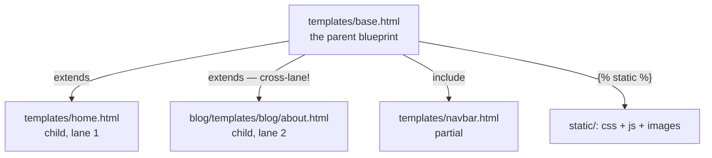
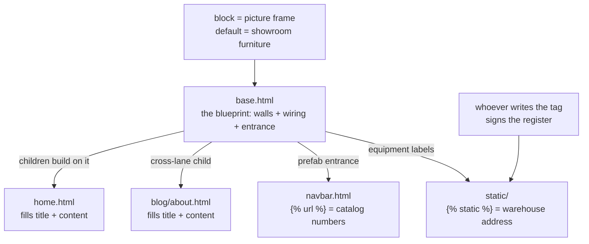

# 🚀 A016 — Templates 4: Inheritance, Static Files

`📖 Lecture A016` · `🎓 Track: Core Django` · `📶 Level: Beginner` · `✅ Status: Documented`

> [!NOTE]
> **About this chapter's sources:** built primarily from a **thirteenth real artifact** —
> the `myProject8/` project in this very folder (fresh project, single `blog` app, plus a
> real `static/` tree). The parent (`templates/base.html`, 505 B), both children (outer
> `templates/home.html`, 572 B, and app-level `blog/templates/blog/about.html`, 168 B),
> the included partial (`templates/navbar.html`, 144 B), both `urls.py` files,
> `views.py` (195 B), and `settings.py` (3413 B — whose one non-default line is
> `STATICFILES_DIRS`) are quoted verbatim below. The static assets (`style.css` 308 B,
> `scripts.js` 73 B, `logo.png` 24,890 B — valid PNG, magic bytes `89 50 4E 47`) were
> read **and served** during verification. **Every rendered-output claim was verified
> twice**: by rendering the artifact's exact templates through Django 6.1.1's engine
> (17/17 assertions), and by a live `GET` through the request path (Django test client,
> HTTP_HOST `127.0.0.1:8000`) — `GET /blog/` → **200** (10 content assertions),
> `GET /blog/about/` → **200** (7), all three static assets → **200 byte-identical**
> (`logo.png` 24,890 B, `image/png`), `GET /` → **404** (the `blog/` prefix again),
> `GET /admin/` → **302** → login 200. The on-disk `db.sqlite3` is **0 bytes**
> (gitignored) — reported honestly. The command journal
> [`commands.txt`](../commands.txt) adds no new lines (still A007's line 25 —
> file-editing again). Django's official template-inheritance and static-files docs
> supply the exact semantics (marked 📌). No transcript exists.

---

## 🧭 What You Will Learn

- [ ] Factor a whole site's HTML into **one parent** (`base.html`) with **``** slots, and let pages fill them with **``**
- [ ] Use **block defaults** — the parent ships content ("My Title") that shows only when a child skips the block
- [ ] Bolt a shared piece into the parent with **``** (the `navbar.html` partial) — and know precisely how it differs from inheritance
- [ ] Reverse **named URLs** with **``** so the menu never hardcodes a path
- [ ] Serve CSS/JS/images: **`STATIC_URL`**, **`STATICFILES_DIRS`**, `` + `` — and why the artifacts' styles finally leave the template
- [ ] Trace the **two-lane template lookup** again — an *app-level* child (`blog/about.html`) inheriting an *outer* parent (`base.html`)
- [ ] Predict the failure the artifact's own files prove: a child using `` **without ``** dies at parse time

## 🎯 Why This Lecture Matters

A013 gave pages a voice (`{{ }}`), A014 a styling desk (filters), A015 a brain (control
flow). But look at what every artifact page so far is *made of*: one standalone HTML file
carrying its own `<html>`, `<head>`, menu, and footer. The moment the series has two
pages (A008's blog *and* shop, A012's home *and* about), that shell is **copy-paste** —
change the menu on one page and the other silently drifts. This artifact is the first
whose pages are **children of one parent**: the shell is written exactly once in
`base.html`, and each page only fills the slots that differ. A012 *used* this pattern on
the ninth artifact without naming its moving parts; A016 is the lecture that names them.

The second half of the title is the other half of the same debt. Every page so far
carried **zero CSS, zero JS, zero images** — presentation lived in inline `style="…"`
attributes (A015's striped table) or nowhere at all. Real pages load stylesheets,
scripts, and pictures from a **static files** directory, and Django serves them through
a small, very specific chain: the `staticfiles` app, `STATIC_URL`, `STATICFILES_DIRS`,
the `` tag library, and the `` tag. Miss any one link and
the browser asks for `/static/css/style.css` and gets a **404**. The artifact wires the
whole chain correctly — and this chapter proves it end to end, byte for byte.

Interview-wise, this pairing is a single standard question — *"explain template
inheritance and static files"* — and the artifact hands you the perfect answer: one
parent, two children (one in each template lane, deliberately), an included partial with
reversed URLs, and three static assets served with correct content types. The subtle
traps — loads don't inherit, block content is verbatim text, static only serves in
`DEBUG` without extra setup — are exactly what separates a rehearsed answer from a real
one.

## ✅ Prerequisites

- [ ] **A012 — Manage HTML Files** — inheritance *in practice*: the ninth artifact's `base.html` parent, `` children, cross-lane parent lookup. This chapter names and systematizes what A012 demonstrated
- [ ] **A010 / A011** — the two template lanes: project-level `DIRS` (`templates/` next to `manage.py`) and app-level `APP_DIRS` (`blog/templates/blog/`); A016's children deliberately live one per lane
- [ ] **A008** — URL prefixes and `include()`; the `blog/` prefix mounts this app, and the navbar's reversed links depend on those named patterns
- [ ] **A013** — the DTL syntax baseline: `{{ }}`, `` tags, dot lookup, auto-escaping
- [ ] 📌 Basic HTML forms/`onclick` — needed only to read the artifact's inert login form and alert button

### 📌 Recap — where A015 left us

A015's `myProject7/` page could *think*: it forked on `blogs.1.is_feature`, walked the
list with ``, striped rows with `` — and it did it all inside **one
self-contained file**, `blog_list.html`, carrying its own `<title>`, `<h1>`, and table
markup. Its *style* lived in inline `style="background-color:…"` attributes. A015's own
next-lecture connection called this out: the shell was a "copy-pasted page skeleton
waiting to be shared," and the inline styles were due to "leave the template and live in
a proper `static/` place."

A016's `myProject8/` pays both promises. The shell is shared: `base.html` holds the
`<html>`/`<head>`/nav/footer **once**; `home.html` and `about.html` inherit it. The
styles move out: a real `static/` tree (css, js, images) wired through
`STATICFILES_DIRS` and the `` tag. Same two-lane lookup, same `render()` —
the new machinery is a **blueprint, two kinds of slots, and a props warehouse**.

---
## 🏗️ The Artifact — A Family of Templates + a Props Warehouse

Ground truth from `myProject8/` on disk (sizes from `Get-ChildItem`; the 0-byte
`db.sqlite3` and `__pycache__/` noted but omitted from the tree):

```
A016_Templates_4_Inheritance_Static_Files/
└── myProject8/
    ├── manage.py · db.sqlite3 (0 bytes, gitignored)
    ├── myProject8/                 ← the config package
    │   ├── settings.py             ← 3413 B: 'blog' + staticfiles; DIRS=[BASE_DIR/'templates'];
    │   │                              STATIC_URL='static/'; STATICFILES_DIRS=[BASE_DIR/'static'];
    │   │                              inert MAILERS (⚠️ carried over)
    │   └── urls.py                 ← 838 B: 'admin/' + 'blog/' include('blog.urls')   ← the prefix
    ├── templates/                  ← project-level lane (DIRS) — the family home
    │   ├── base.html               ← 505 B: the PARENT — title block w/ default, css+js via
    │   │                              , , content block, footer
    │   ├── home.html               ← 572 B: CHILD #1 — extends base; title+content blocks; img via
    │   │                              ; inert login form; onclick button
    │   └── navbar.html             ← 144 B: PARTIAL —  + 
    ├── static/                     ← the props warehouse (STATICFILES_DIRS)
    │   ├── css/style.css           ← 308 B
    │   ├── js/scripts.js           ← 73 B (showAlert())
    │   └── images/logo.png         ← 24,890 B (valid PNG, magic 89 50 4E 47)
    └── blog/
        ├── apps.py                 ← BlogConfig, name='blog'
        ├── views.py                ← 195 B: home → 'home.html' (lane 1), about → 'blog/about.html' (lane 2)
        ├── urls.py                 ← 161 B: '' → home, 'about/' → about (both named)
        └── templates/blog/
            └── about.html          ← 168 B: CHILD #2 — extends base FROM THE APP LANE
```

Two structural facts to notice before reading any file. First, the outer `templates/`
folder is **back** — A012 moved it to project level, A013/A014/A015 shipped projects
without it, and this artifact declares `'DIRS': [BASE_DIR / 'templates']` *and* actually
ships the folder. Second, the family is deliberately **split across both lanes**: the
parent and one child sit in `DIRS` (lane 1), the second child sits in the app (lane 2)
— and still inherits the lane-1 parent. That is A012's cross-lane lesson, now
load-bearing.

Here is the routing — `myProject8/urls.py`, verbatim minus its docstring (838 B):

```python
from django.contrib import admin
from django.urls import path, include

urlpatterns = [
    path('admin/', admin.site.urls),
    path('blog/', include('blog.urls'))
]
```

A008's prefix again: everything this app serves lives under **`/blog/`** — including the
navbar's two reversed links. `blog/urls.py` (161 B) and `blog/views.py` (195 B),
verbatim:

```python
from django.urls import path
from . import views

urlpatterns = [
    path('', views.home, name='home'),
    path('about/', views.about, name='about'),
]
```

```python
from django.shortcuts import render

# Create your views here.
def home(request):
    return render(request, 'home.html')

def about(request):
    return render(request, 'blog/about.html')
```

Two views, two lanes: `home` asks for `'home.html'` — found in lane 1 (`DIRS`) — while
`about` asks for `'blog/about.html'` — found in lane 2 (`APP_DIRS` inside the `blog`
app). Neither view passes a context argument: unlike A013–A015, these pages carry **no
`{{ }}` data at all**. This artifact is pure *structure* — inheritance, an include, and
static references, with no variables to fill. In `settings.py` (3413 B) exactly one
non-default line was added beyond the A013–A015 baseline — the warehouse declaration:

```python
# Static files (CSS, JavaScript, Images)
# https://docs.djangoproject.com/en/6.1/howto/static-files/

STATIC_URL = 'static/'
STATICFILES_DIRS = [BASE_DIR / 'static']
```

`'django.contrib.staticfiles'` was already in `INSTALLED_APPS` (a `startproject`
default); `TEMPLATES` declares `'DIRS': [BASE_DIR / 'templates']` (lane 1) with
`'APP_DIRS': True` (lane 2); and the inert `MAILERS` block rides along for the fourth
artifact in a row (⚠️ — nothing in this project sends email).

---
## 🧠 Core Idea — The Family: One Blueprint, Many Slots

### The parent — `templates/base.html`, verbatim (505 B)

```html
<!DOCTYPE html>
<html lang="en">
<head>
    <title>  My Title  </title>
    
    <link rel="stylesheet" href="">
</head>
<body>
    
    <div class="content">
        
        
    </div>

    <footer>
        <p>&copy; 2023 My Website. All rights reserved.</p>
    </footer>

    <script src=""></script>
</body>
</html>
```

Read it as a *blueprint*, not a page. Four load-bearing moves:

1. **` My Title `** — a named *slot* with a **default**.
   Whatever a child puts inside its own `` replaces the slot's
   contents; a child that skips the block gets the shipped default (`My Title`).
2. **`` + ``** — the parent links the
   stylesheet (in `<head>`) and the script (end of `<body>`) *itself*, so **every child
   inherits the styling and the `showAlert()` wiring for free**.
3. **``** — a *composition* seam: that file's rendered
   content is pasted in at render time, identical on every page.
4. **``** — an *empty-default* slot: children must fill
   it or the page body is blank (nothing ships inside).

### Child #1 — `templates/home.html`, verbatim (572 B)

```html



 Home Page 


    <h1>Welcome to Home Page</h1>
    <p>This is the home page.</p>
    

    <form method="post">
        
        <input type="text" name="username" placeholder="Username">
        <input type="password" name="password" placeholder="Password">
        <button type="submit">Login</button>
    </form>

    <button onclick="showAlert()">Click Me</button>

```

Three facts worth pausing on. **`` is the first meaningful
line** — a child template may only contain blocks and top-level tags, so a child is
*nothing but slot-filling*. **The child re-loads ``** because it uses
`` itself — for the `` — and **loads do not travel through
inheritance** (proved by a parse-time crash in Core Idea 7). And the login form's
`` plus the `onclick="showAlert()"` button are the artifact's
"it's-alive" props: the CSRF token requires a *request context* to render (in a bare
engine render it warns and emits nothing — verified; through the live client the hidden
input is present), and `showAlert` only exists because the parent loads
`scripts.js`.

### The partial — `templates/navbar.html`, verbatim (144 B)

```html
<nav>
    <ul>
        <li><a href="">Home</a></li>
        <li><a href="">About</a></li>
    </ul>
</nav>
```

Two `` reversals: instead of hardcoding `/blog/` and `/blog/about/`, the
partial *names the view* and Django computes the path from `urlpatterns` at render time.
Change the prefix tomorrow and the menu still works — A007's `name=` lesson, now
load-bearing inside a shared partial. Verified rendered output:

```html
<nav>
    <ul>
        <li><a href="/blog/">Home</a></li>
        <li><a href="/blog/about/">About</a></li>
    </ul>
</nav>
```

### Child #2 — `blog/templates/blog/about.html`, verbatim (168 B)

```html


About Page


    <h1>About Us</h1>
    <p>This is the about page.</p>

```

This child is the artifact's quiet stunt: it lives in the **app lane**
(`blog/templates/blog/`) yet extends a parent from the **project lane**
(`templates/base.html`). The lookup order makes it work — `DIRS` (lane 1) is searched
*first*, and `"base.html"` exists there, so the app child finds the outer blueprint.
A012 demonstrated the same cross-lane hit; here it is structural, not incidental.

### Who loads what — the family's dependency table

| File | Role | Tags used | Needs its own ``? |
|---|---|---|---|
| `base.html` | parent | ``, ``, `` | ✔ (line 5) |
| `home.html` | child, lane 1 | ``, ``, ``, `` | ✔ (line 2) |
| `about.html` | child, lane 2 | ``, `` only | — no static use |
| `navbar.html` | included partial | `` | — `url` is a built-in |

Note the economy: `about.html` uses no static tags, so it carries no load — the
parent's stylesheet still applies to it through inheritance. Loads are *per-file*, but
**inheritance is per-render**: whatever the parent loads and links, every child
receives.

### 1. `` + `` — the blueprint and its slots

**Definition:** template inheritance is one template (the *parent*) declaring named
slots with `…`, and other templates (the *children*)
claiming those slots with their own `` after a single
``. At render time the child's blocks are grafted into the
parent's skeleton — the parent's non-block structure always wins; the child contributes
*only* its blocks.



**Why it exists:** the copy-paste alternative guarantees drift — two pages with two
menus means every nav change is made twice, eventually once. Inheritance makes the
shell **single-source**: the artifact's `<head>`, nav, and footer exist in exactly one
file, no matter how many children appear.

**How it works, mechanically:** when `render(request, 'home.html')` meets a template
whose first node is ``, the engine collects the child's `` nodes
by name, then renders the *parent*, swapping each named slot for the child's version —
or keeping the parent's content where the child stayed silent. The response you saw for
`GET /blog/` is the parent's 21 lines wearing the child's two blocks.

**Common confusion:** "which file writes `<html>`?" Only the parent's. A child with its
own `<html>` outside a block either loses it (text outside blocks is ignored) or
double-wraps the page. Children hold blocks — nothing else.

### 2. Block defaults — the shipped "My Title"

` My Title ` ships content *inside* the slot. Both of
this artifact's children override the title, so the default never appears on a routed
page — but it is not decoration: render the parent **alone** and it surfaces. Verified,
exact:

| Rendered | `<title>` content (repr) | Why |
|---|---|---|
| `base.html` alone | `'  My Title  '` | default stands |
| `home.html` — child content `' Home Page '` | `'  Home Page  '` | child content replaces the default; the base's own spaces still wrap the slot |
| `about.html` — child content `About Page` | `' About Page '` | same, single spaces — all from the base side |

Two lessons hide in those reprs. First, the default is a *real rendering path* — skip a
block and the page still ships. Second, **block content is verbatim text**: the child
wrote ` Home Page ` with surrounding spaces and they were printed, while the base's
spaces around the *block tag* wrap every title. Hence `<title>  Home Page  </title>`
(double spaces) versus `<title> About Page </title>` (single) — cosmetic, verified, and
a favorite gotcha.

### 3. `` — composition, not inheritance

`` renders another template *in place*, with the current
context. It is not a slot: the parent doesn't declare it and children can't override it
— every page inheriting this base gets *the same* nav. Rule of thumb:
**inheritance for the skeleton, includes for repeated organs.** How does the include
resolve? Through the same two-lane lookup as any template: `"navbar.html"` has no
`blog/` prefix, so lane 1 (`DIRS`) finds it in the outer `templates/`.

### 4. `` — name the view, not the path

`` asks the URL dispatcher: *which pattern is named `home`?* The answer
is `path('', views.home, name='home')` mounted under the `blog/` prefix → `/blog/`.
Reversal happens at render time, so the partial ships zero hardcoded paths (verified
output in the previous section). ⚠️ The names are **flat** — no `app_name`/namespace is
declared — fine in a single-app artifact, a collision risk the day two apps both define
`home` (📌 namespaces: add `app_name = 'blog'` and reverse as ``).

### 5. Static files — the warehouse chain, wired end to end

**Definition:** *static files* are assets the server ships byte-for-byte — CSS, JS,
images — not generated, not routed through a view. Django's dev chain has four links:

1. **`'django.contrib.staticfiles'`** in `INSTALLED_APPS` — the app (a `startproject`
   default) that teaches `runserver` to serve static while `DEBUG = True`.
2. **`STATICFILES_DIRS = [BASE_DIR / 'static']`** — *the one line the owner added*: it
   names the project's own asset folders the finders should search.
3. **`STATIC_URL = 'static/'`** — the URL *prefix* the browser asks for (already the
   default).
4. **`` + ``** — the tag that *joins*
   prefix to path: rendered as `/static/css/style.css`.

Verified end to end through the live request path:

| Asset on disk | `` renders | Live `GET` | Served as |
|---|---|---|---|
| `static/css/style.css` (308 B) | `/static/css/style.css` | **200** | `text/css` |
| `static/js/scripts.js` (73 B) | `/static/js/scripts.js` | **200** | `text/javascript` |
| `static/images/logo.png` (24,890 B) | `/static/images/logo.png` | **200** | `image/png`, byte-identical |

Break any one link and the page *still* returns 200 — only the asset 404s (unstyled
page, dead button, broken-image icon). That is why static bugs are silent: the HTML is
fine; the missing thing is a second request away. 📌 In production this dev-serving
switches off — `collectstatic` gathers assets into `STATIC_ROOT` for the web server;
beyond this lecture's scope.

### 6. Cross-lane inheritance — the app child reaches out

`blog/about.html` extends `"base.html"` with no path prefix — so the engine runs the
lookup: lane 1 (`DIRS = [BASE_DIR / 'templates']`) is searched *first* → hit. The app
lane is never consulted for that name. (The `about` *page itself* was found in lane 2,
because the view asked for `'blog/about.html'` — the `blog/` prefix in the template
name routes that lookup into the app.) The lookup order A010/A011 established is
exactly what keeps this split family coherent.

### 7. Loads don't inherit — the crash the artifact predicts

`home.html` re-loads `` even though its parent already did. Not
superstition — each file is compiled *separately*, and a tag library loaded in the
parent is not visible while the child's own `` is being compiled.
Verified:

```

→ TemplateSyntaxError: Invalid block tag on line 1: 'static', expected 'endblock'.
  Did you forget to register or load this tag?
```

**Rule: whoever writes the tag, loads the tag.** `about.html` needs no load (it writes
no static tags); `navbar.html` needs none (`url` is a built-in).

### One-sentence mechanism recap

A child renders by *grafting its blocks into the parent's skeleton*; the parent's
`` organs render identically on every page; `` recomputes paths
from names; `` joins a URL prefix to a warehouse path that
`STATICFILES_DIRS` declared; and each file that writes a loaded tag must load it
itself.

---
## 🔄 The Journey — `GET /blog/` Through a Family of Templates

```mermaid
flowchart LR
    R["GET /blog/ arrives"] --> U["myProject8/urls.py<br>'blog/' include → blog/urls.py"]
    U --> V["views.home(request)<br>render(request, 'home.html')"]
    V --> L["lane-1 lookup (DIRS)<br>templates/home.html"]
    L --> X["child compiles:<br>2 blocks + its own {% load static %}"]
    X --> P["parent renders:<br>base.html grafted with child's blocks"]
    P --> N["{% include %} navbar.html<br>{% url %} → /blog/, /blog/about/"]
    N --> S["{% static %} stamps URLs:<br>css · js · logo.png"]
    S --> W["200: family HTML<br>with asset URLs"]
    W --> A2["browser fetches assets<br>staticfiles serves 200 ×3"]
```



Verified end to end (test client, HTTP_HOST `127.0.0.1:8000`):

| # | Request | Result | Proof |
|---|---|---|---|
| 1 | `GET /blog/` | **200** | 10 content assertions: `<title>…Home Page`, css/js/logo URLs, both reversed nav links, `<h1>`, csrf hidden input, `onclick`, footer |
| 2 | `GET /blog/about/` | **200** | 7 assertions: `<title>…About Page`, "About Us", *same* nav, *same* css/js/footer — the same parent, rendered twice |
| 3 | `GET /static/css/style.css` | **200** | 308 B · `text/css` |
| 4 | `GET /static/js/scripts.js` | **200** | 73 B · `text/javascript` |
| 5 | `GET /static/images/logo.png` | **200** | 24,890 B · `image/png` · byte-identical |
| 6 | `GET /` | **404** | `blog/` prefix only — A008/A015's deliberate root-404 |
| 7 | `GET /admin/` | **302** → login **200** | admin mounted; on-disk `db.sqlite3` is 0 bytes (gitignored) — a real login would need `migrate` (⚠️ honest limit) |

Reading the table as the lecture: rows 1–2 are **the same parent rendered twice** —
child blocks differ, everything else identical; that is inheritance *measured*, not
asserted. Rows 3–5 are the **warehouse chain delivering** — prefix from `STATIC_URL`,
path from `STATICFILES_DIRS`, URLs stamped by ``. Row 6 is the **URL
prefix** by design. Row 7 is mounted-but-unmigrated admin, documented honestly.

One more observation: the HTML that ships for `/blog/` carries the *union* of the
family — base's `<head>`, static links, and footer; the include's nav with reversed
hrefs; home's two filled blocks. Nothing in that response says which file contributed
which line. Children are assembled server-side into ordinary pages; the reader of the
HTML cannot see the inheritance — and that invisibility is the point.

## 🧱 Important Vocabulary

| Term | Simple meaning | Technical meaning | 🧷 Memory hook |
|---|---|---|---|
| Template inheritance | one frame, many pages | a parent declares `` slots; children `` it and fill the slots | 🧷 blueprint & furnished rooms |
| `` | "build me on that frame" | the child's first tag names the parent; only blocks may follow | 🧷 the foundation stamp |
| `` | a named slot | overridable region; renders the child's version or the parent's default | 🧷 an empty picture frame |
| Block default | shipped filler | content inside the parent's block, used when no child overrides | 🧷 showroom furniture |
| `` | paste-in piece | renders another template in place, with the current context | 🧷 prefab wall |
| Partial | reusable organ | small template (nav, card) included, never extended | 🧷 one organ, many bodies |
| `` | the door by its name | reverses a URL-pattern name to a path at render time | 🧷 room number, not street address |
| `` | unlock a tag toolbox | loads a template-tag library *for this file* | 🧷 the toolbox sign-in sheet |
| `` | warehouse address | joins `STATIC_URL` + asset path into a URL | 🧷 the warehouse's street sign |
| `STATIC_URL` | public prefix | the URL prefix for static assets (`static/`) | 🧷 storefront address |
| `STATICFILES_DIRS` | the warehouse list | project folders the static finders search (dev) | 🧷 warehouse inventory list |
| Cross-lane inheritance | child in lane 2, parent in lane 1 | an app template extends a `DIRS` template via lookup order | 🧷 the tenant borrowing the lobby |

> These terms are registered in `docs/MEMORY.md` §2 as well.

## 💡 Real-World Analogy — The Franchise Restaurant

A franchise brand writes **one construction blueprint**: load-bearing walls, wiring,
plumbing, the standard entrance — that is `base.html` (skeleton, stylesheet, script,
nav, footer). Each outlet is **built on the blueprint** (``) but furnishes
its own dining room (``) and hangs its own sign above the door
(``); rooms the franchisee skips keep the **showroom furniture**
(block defaults). The entrance sign is **prefab** — ordered once, hung identically at
every outlet (``) — and it is ordered by **catalog number**, not by
describing a street corner (``). The equipment comes from the **central
warehouse** (`static/`): the blueprint lists which warehouses to stock from
(`STATICFILES_DIRS`), the brand's address scheme says where deliveries arrive
(`STATIC_URL`), and every item carries its warehouse label (``) — label it
wrong and the appliance never arrives (the silent 404). And the rule every franchisee
learns the hard way: **whoever uses warehouse equipment must sign the warehouse
register themselves** (``) — the blueprint's signature does not
transfer.

## ❌ Common Beginner Mistakes

1. **Writing `<html>`/`<head>` in the child** — the parent already owns the skeleton;
   the child's extra shell is ignored (text outside blocks) or nests inside a slot
   (invalid HTML). → Children contain ``, ``s — nothing
   structural.
2. **Forgetting `` in a file that uses ``** — verified
   crash: `TemplateSyntaxError: Invalid block tag … 'static'`. The parent's load does
   not help the child. → Whoever writes the tag, loads the tag.
3. **Hardcoding `/static/css/style.css` or `/blog/about/` in HTML** — works until the
   prefix or `STATIC_URL` changes; then every page breaks at once. → `` and
   `` everywhere.
4. **Expecting `STATICFILES_DIRS` alone to serve files** — `runserver` serves static in
   `DEBUG` *because* `django.contrib.staticfiles` is installed. Remove the app (or set
   `DEBUG = False`) and the 200s become 404s. → Keep the chain whole; 📌 production
   needs `collectstatic`.
5. **Declaring `STATIC_URL` but not `STATICFILES_DIRS`** — `` builds the
   URL fine, but the finder has nowhere to look → the asset 404s while the page renders
   200. The silent failure this chapter keeps warning about.
6. **Assuming a child must override every block** — a child that skips `title` gets
   `My Title`; one that skips `content` ships an empty body. Defaults are features, not
   accidents.
7. **Fighting the "double-spaced" title** — block content is verbatim text; the child's
   `' Home Page '` plus the base's own spacing print as-is (verified: `'  Home Page
   '`). Trim inside the block, not in the parent.

## 🧠 Common Misconceptions

| ✅ Django/DTL IS … | ❌ It is NOT … |
|---|---|
| Inheritance is *grafting child blocks into the parent's render* | a literal include of the whole parent file into the child |
| `` is *composition* — identical on every page | an overridable slot; children cannot change an include's content |
| Block defaults are a real rendering path | dead fallback code that "never runs" |
| Loads are per-file (compile-time) | inherited at render time from the parent |
| `` computes a URL from settings | a file read, a copy, or a check that the asset exists |
| Dev static serving = the `staticfiles` app + `DEBUG = True` | a feature of `STATIC_URL` or of the URLconf |
| `` reads `urlpatterns` at render time | a path frozen at project creation |
| The two-lane lookup is deterministic (`DIRS` first) | a search that "picks whatever matches, by luck" |

## 🧪 Practical Example — Extend the Artifact (Three Live Exercises)

All three run against `myProject8/` as it stands — template edits plus, for Exercise 2,
two one-line Python additions.

### Exercise 1 — give the footer a slot (block with a default)

In `base.html`, replace the hard-coded footer line with:

```html
    <footer>
        <p>&copy; 2023 My Website. All rights reserved.</p>
    </footer>
```

Reload: both pages still show the © line — the **default** now does the work. Then add
to `about.html` only:

```html
About — a page of the myProject8 demo.
```

`/blog/about/` shows the new line; `/blog/` keeps the default. One parent change, both
children upgraded — the copy-paste tax avoided.

### Exercise 2 — a third child that needs the warehouse

Create `templates/contact.html`:

```html



Contact Page


    <h1>Contact Us</h1>
    
    <p>Write to us — this page exists to prove the load rule.</p>

```

Wire it: `blog/urls.py` gains `path('contact/', views.contact, name='contact')`;
`views.py` gains `def contact(request): return render(request, 'contact.html')`.
Then the deliberate experiment: delete the `` line and reload —
`TemplateSyntaxError: … 'static'` — the exact crash verified in Core Idea 7. Put the
load back; `GET /blog/contact/` → 200 with the logo URL `/static/images/logo.png`.

### Exercise 3 — namespace the URLs (the collision cure, 📌)

In `blog/urls.py` add `app_name = 'blog'` above `urlpatterns`, and change the partial
to `` / ``. Reload both pages — identical
output, but now the names cannot collide with another app's `home`. This is the
📌-marked cure for the flat-name risk flagged in Core Idea 4.

## 🎯 Interview Perspective

> [!IMPORTANT]
> Interview cards test *understanding*, not recitation.

**Q: "What is template inheritance and why use it?"**
A: One parent template declares `` slots; children start with
`` and fill only the slots that differ — at render, the child's
blocks are grafted into the parent's skeleton. It makes the shell single-source: nav,
`<head>`, and footer exist once, so a menu change is one edit, not N. I can trace a
family where the same parent rendered two pages differing in exactly two blocks —
composition, not coincidence.

**Q: "`` vs ``?"**
A: `extends` is page-level: one child fills the parent's *slots* (per-page variation).
`include` is organ-level: the same fragment pasted identically everywhere (nav, footer —
no per-page variation). The artifact shows both at once — its navbar is *included* by
the parent (no child can change it), its title is a *block* (every child does change
it).

**Q: "How does Django find static files?"**
A: In dev: the `staticfiles` app (installed) + `runserver` + `DEBUG = True` serve assets
that the *finders* locate — project folders listed in `STATICFILES_DIRS` plus each
app's `static/` subfolder. `` builds the URL by joining `STATIC_URL` with
the asset path. Drop the `STATICFILES_DIRS` line and the URL still renders but the
finder 404s — the page looks fine, the asset is missing. 📌 Production flips to
`collectstatic` gathering everything into `STATIC_ROOT`.

**Q: "Why does a child template repeat ``?"**
A: Loads are per-file, compile-time. Each template compiles separately; a library
loaded in the parent is not visible to the child's own tags. I've reproduced the crash:
use `` without a load and Django raises `TemplateSyntaxError: Invalid block
tag 'static'` at parse time — before any rendering happens.

**Q: "Why `` instead of hardcoding `/blog/about/`?"**
A: Reverse by name — the dispatcher computes the path from `urlpatterns` at render, so
renaming prefixes or moving apps never breaks the menu. The artifact's two nav links
render `/blog/` and `/blog/about/` purely from `name='home'` / `name='about'`. Flag the
caveat unprompted: flat names collide across apps — `app_name` plus `blog:home` is the
scalable form.

## 🔁 Active Recall

Answer from memory first, then expand each `<details>`.

1. Which file owns `<html>`, the stylesheet link, and the footer — and what do the
   children own?

<details><summary>Answer</summary>

`base.html` — the parent — owns the skeleton: `<html>`, `<head>`, the ``
css/js links, the `` nav, the footer. The children own *only their
blocks*: `home.html` fills `title` + `content`; `about.html` fills the same two. At
render the child's blocks are grafted into the parent's skeleton — one parent, rendered
twice in the artifact with different blocks.

</details>

2. What prints if a child skips the ``? Where did that show up in
   verification?

<details><summary>Answer</summary>

The parent's default — `My Title`. Verified by rendering `base.html` *alone*: the title
came out `'  My Title  '`. On the routed pages the default never shows because both
children override the block — but the path is real, which is why defaults are features,
not dead code.

</details>

3. What exactly does `` do that a block cannot — and what
   can a child never do to the nav?

<details><summary>Answer</summary>

`include` renders the named template *in place*, with the current context —
composition, not a slot. Because the include lives in the parent, every child gets the
same nav; no child can override or vary it. Blocks are the per-child mechanism;
includes are the identical-everywhere mechanism.

</details>

4. Name the four links of the dev static chain in order — and what breaks, visually, if
   link 2 is missing?

<details><summary>Answer</summary>

(1) `django.contrib.staticfiles` installed; (2) `STATICFILES_DIRS` naming the project's
asset folders; (3) `STATIC_URL = 'static/'` prefix; (4) `` +
`` stamping URLs. Without link 2 the page still renders
200, the URL is still written into the HTML, but the finder has nowhere to look → the
asset request 404s → unstyled page, broken image, dead button. Silent by design.

</details>

5. The verified title reprs were `'  Home Page  '` and `' About Page '`. Explain both
   from the source files alone.

<details><summary>Answer</summary>

Block content is verbatim text. The base writes
`<title>  …  </title>` — its own spaces wrap the *slot*,
so every title gets one space on each side. `home.html`'s block content is
`' Home Page '` (spaces of its own) → the double-spaced repr. `about.html`'s content is
`About Page` (none) → the single-spaced repr. Nothing is "cleaned up" — every space is
printed from source.

</details>

6. Why can `blog/about.html` (app lane) extend `base.html` (project lane) — and which
   lane wins if both had a `base.html`?

<details><summary>Answer</summary>

`` resolves its parent through the normal lookup: `DIRS` (lane 1) first,
then the app's `APP_DIRS`. `base.html` exists in lane 1 → found there, even from an
app-lane child. If both lanes had a `base.html`, lane 1 wins — deterministic order, not
luck. (The `about` *page* itself was found in lane 2 because the view asked for the
`'blog/about.html'` prefixed name.)

</details>

7. A teammate deletes `home.html`'s `` "because base already loads
   it". What happens, exactly — and when?

<details><summary>Answer</summary>

Parse-time failure, before any render: `TemplateSyntaxError: Invalid block tag on line
1: 'static' …` — verified by compiling exactly that child. Loads are per-file; the
parent's load serves only the parent's own `` calls. The child writes its
own ``, so it needs its own sign-in.

</details>

## 📝 Quick Revision — A016 in Five Minutes

| Concept | One line | Artifact proof |
|---|---|---|
| `` | child names the parent, fills slots | `home.html` / `about.html`, line 1 |
| `` | named slot; child's version or parent's default | `title` + `content` in `base.html` |
| Block default | shipped filler when no child overrides | `'  My Title  '` on the parent-alone render |
| `` | identical organ on every page | navbar in `base.html`, line 9 |
| `` | name → path, at render | `` → `/blog/` |
| `` | per-file toolbox sign-in | base line 5 + home line 2; crash without it |
| `` | `STATIC_URL` + asset path | `/static/css/style.css` in the `<head>` |
| `STATICFILES_DIRS` | the warehouse list | `[BASE_DIR / 'static']` — the one added line |
| Cross-lane extends | app child → `DIRS` parent | `about.html` finds `base.html` in lane 1 |
| Two-lane lookup | `DIRS` first, then `APP_DIRS` | `home` (lane 1) + `blog/about.html` (lane 2) |

Verified numbers to memorize: `/blog/` → **200** (10 assertions) · `/blog/about/` →
**200** (7) · css/js/png → **200**, byte-identical · `/` → **404** · `/admin/` →
**302**.

## 🧠 Final Mental Model — The Franchise



One sentence to carry: **the parent owns the shell, children own their blocks,
includes own the organs, `` owns the paths, and `` owns the
addresses — with `STATICFILES_DIRS` owning the inventory and every file owning its own
loads.**

## ❓ FAQ

**Q1. Can a child extend another child?**
A: Yes — inheritance chains: `child_a.html` extends `base.html`, `child_b.html` extends
`child_a.html`, and blocks keep overriding down the line (a block in a middle child can
even declare its *own* default). The artifact stops at two levels; 📌 multi-level chains
are the same grafting rule applied repeatedly.

**Q2. Does `` see the view's context?**
A: Yes — includes render with the current context, so an included partial can read the
same context the page reads. (There is also an `` form to pass
extra values — 📌 beyond the artifact.)

**Q3. My page returns 200 but the CSS 404s — where do I look?**
A: Walk the chain: is `django.contrib.staticfiles` installed? Is `DEBUG = True` (dev
serving)? Is the folder in `STATICFILES_DIRS`? Is `STATIC_URL` prefixed? Does the
template `` before using ``? In this artifact every link
is verified — remove any one and only the asset dies, never the page.

**Q4. Do I really need `` in *every* file that uses ``?**
A: Yes — that is the load rule, and it is verified: strip it from `home.html` (or any
child) and compilation raises `TemplateSyntaxError` before a single byte renders. The
parent's load covers the parent's tags only.

**Q5. What is `STATIC_ROOT` — the artifact never sets it?**
A: 📌 Correct, and by design: `STATIC_ROOT` is the *destination* for `collectstatic` in
production; dev serving via `runserver` never uses it. The artifact is a dev artifact —
its chain is `STATIC_URL` + `STATICFILES_DIRS` + the `staticfiles` app.

**Q6. Why does the login form carry `` if nothing handles the POST?**
A: ⚠️ It's an educational prop — the artifact wires the token (rendered as the hidden
`csrfmiddlewaretoken` input through the live client, verified) but defines no POST
view; submitting does nothing useful. The token is right; the handling is a future
lecture.

**Q7. The page 200s in curl/test-client checks, but my *browser* shows unstyled
content and a dead button — where's the bug?**
A: Not in Django — in your **port**. This series reuses `8000`, so a stale `runserver`
from an earlier chapter's project (`myProject6`/`myProject7`) can still own the port
while you *think* you're testing `myProject8` — and the browser tab may also hold the
old server's page or cached asset 404s. Fix: stop the old server (`Ctrl+C` in its
window, or `Stop-Process -Id (Get-NetTCPConnection -LocalPort 8000 -State Listen).OwningProcess`),
start the right one (`py manage.py runserver` from `myProject8/`), then **hard-refresh**
(`Ctrl+F5`). Verify like this chapter did: `GET /blog/` → 200 plus the three `/static/…`
assets → 200 — if all four are 200, any remaining wrongness lives in the browser tab,
not the project.

## 🏁 Learning Checkpoints

- [ ] **Checkpoint 1 — The family:** I can draw `base.html` → `home.html`/`about.html`/`navbar.html` and say which lines each contributes — *§Core Idea 1*
- [ ] **Checkpoint 2 — Defaults:** I can predict all three `<title>` renderings (repr-precise) and explain the spaces — *§Core Idea 2*
- [ ] **Checkpoint 3 — Include vs extends:** I can say what no child can ever change (the include) and what every child does change (the blocks) — *§Core Idea 3*
- [ ] **Checkpoint 4 — The static chain:** I can name the four dev links in order and predict the *silent* 404 when any breaks — *§Core Idea 5*
- [ ] **Checkpoint 5 — Lanes:** I can trace why an app-lane child finds a `DIRS` parent, and which lane wins a name clash — *§Core Idea 6*
- [ ] **Checkpoint 6 — The load rule:** I can state when the missing `` dies (parse time) and reproduce the exact error — *§Core Idea 7*

## 🏋️ Exercises

- **Level 1 — Recall:** List the four links of the dev static chain; quote the two
  verified title reprs; say which artifact file carries no `` and why.
- **Level 2 — Understanding:** Explain to a peer why the same parent can render two
  pages with different titles and contents but identical navs, css, and footer — using
  the words *graft*, *slot*, *organ*.
- **Level 3 — Application:** Do all three Practical-Example exercises on
  `myProject8/`: the footer slot, the `contact.html` child (including the deliberate
  load-crash experiment), and the `blog:` namespace — then re-verify
  `GET /blog/contact/` → 200 yourself.
- **Level 4 — Interview reasoning:** A reviewer proposes replacing the include with a
  `` + child overrides "for flexibility". Argue what that trades away
  (identical nav everywhere; one nav change per release), when a block *is* right
  (per-page nav variation), and how `app_name` changes the partial's tags.

## 🏁 Final Takeaways

1. **Inheritance is grafting.** The child renders as its blocks inside the parent's
   skeleton — the parent's structure always wins.
2. **Block defaults are a real path.** Skip a block, ship the default (`My Title`);
   both children here override it, but the parent-alone render proves the path.
3. **Includes are organs, blocks are rooms.** The nav is identical everywhere *because*
   it's included; titles/contents differ *because* they're blocks.
4. **`` keeps the menu honest** — paths computed from names at render; ⚠️ flat
   names invite collisions, `app_name` is the cure (📌).
5. **The static chain is four links** — `staticfiles` app + `STATICFILES_DIRS` +
   `STATIC_URL` + ``/`` — and it fails *silently* (asset
   404, page 200).
6. **Loads don't inherit.** Whoever writes the tag, loads the tag — verified by a
   parse-time `TemplateSyntaxError`.
7. **The lanes compose.** An app-lane child extends a `DIRS` parent because lane 1 is
   searched first — A010–A012's lookup order, now structural.
8. **The page lives at `/blog/`** — the root 404s by design (A008/A015), and the
   artifact's admin is mounted but unmigrated (0-byte db, ⚠️ honest limit).

---

## 🔄 Next Lecture Connection

The family now shares one shell and the pages finally wear real styles — but two doors
in the artifact are still painted on. The **login form** (`method="post"`,
``, verified hidden input) has no POST handler; the **admin** is
mounted yet its 0-byte `db.sqlite3` has no tables. Both point at the same frontier:
storing and submitting *data* — Django's forms and database layer — so the next
lecture's folder will appear with it. What this chapter leaves behind is the shell
every future page will inherit: one `base.html`, slots waiting to be filled, and a
warehouse of styles one `` away.

---
<div class="doc-footer">

**Sources used:**

| Source | Role | Notes |
|---|---|---|
| `A016_Templates_4_Inheritance_Static_Files/myProject8/` — thirteenth real artifact | **Primary** | `templates/base.html` (505 B), `templates/home.html` (572 B), `templates/navbar.html` (144 B), `blog/templates/blog/about.html` (168 B) quoted verbatim; `blog/views.py` (195 B), both `urls.py` (838 B / 161 B), `settings.py` (3413 B) read — `STATICFILES_DIRS` is the one non-default line; `static/` assets read (css 308 B, js 73 B, logo.png 24,890 B valid PNG) |
| Verified render — Django 6.1.1 engine + request pipeline | Verification | 17/17 engine assertions (incl. parent-alone default `'  My Title  '`, title reprs, cross-lane render, csrf-empty bare render) AND live `GET`s: `/blog/` 200 (10 assertions), `/blog/about/` 200 (7), three static assets 200 byte-identical, `/` 404, `/admin/` 302 → login 200, via test client (HTTP_HOST `127.0.0.1:8000`) |
| [`commands.txt`](../commands.txt) | Context | No new lines (last entry remains A007's line 25) — file-editing; the artifact outranks the journal |
| [A012](../A012_Manage_HTML_Files/README.md) · [A015](../A015_Templates_3_If_For_With_and_Cycle/README.md) · [A010](../A010_Templates_Folder_Setup_Project_Level/README.md) · [A011](../A011_App_Level_Templates_Setup_HTML_Integration/README.md) · [A008](../A008_Multiple_Apps_with_Views_URLs_%28Blog_Shop_Example%29/README.md) · [A007](../A007_Views_URLs_Basics/README.md) | Context | Inheritance in practice; the promised shell + static migration; the two lanes; URL prefixes; named URLs |
| Official Django docs (template inheritance · static files) | 📌 Supplementary | ``/`` mechanics, include semantics, `STATIC_URL`/`STATICFILES_DIRS`/finders, `collectstatic`/`STATIC_ROOT`, namespaces — flagged 📌 in place |

> 📌 **Scope note:** everything derived from the artifact and its verified render is
> source-grounded; inheritance mechanics, static-finder behavior, `collectstatic`, and
> namespaces come from Django's docs and carry the 📌 badge. The inert `MAILERS` block,
> the hard-coded `© 2023` footer, the flat (namespace-less) `` names, the
> inert login form (no POST handler), and the mounted-but-unmigrated admin (0-byte
> `db.sqlite3`) are flagged ⚠️, not endorsed — and the title's verbatim whitespace is
> documented, not fixed. No transcript exists for A016 — declared per the
> documentation contract.
>
> **Navigation:** [← A015 · Templates 3: If, For, With and Cycle](../A015_Templates_3_If_For_With_and_Cycle/README.md) · [📚 Series Hub](../README.md) · [A017 · Templates 5: Advanced Tags →](../A017_Templates_5_Advanced_Tags/README.md)
>
> **Series:** [A001](../A001_Introduction_What_is_Django/README.md) ·
> [A002](../A002_MVT_Architecture_Explained/README.md) ·
> [A003](../A003_Install_Python_pip_Django_Virtual_Environment_Setup/README.md) ·
> [A004](../A004_Create_Django_Project/README.md) ·
> [A005](../A005_Django_Files_Folders/README.md) ·
> [A006](../A006_Django_startapp_Command_Explained/README.md) ·
> [A007](../A007_Views_URLs_Basics/README.md) ·
> [A008](../A008_Multiple_Apps_with_Views_URLs_%28Blog_Shop_Example%29/README.md) ·
> [A009](../A009_URL_Parameters_%28path_re_path_kwargs%29/README.md) ·
> [A010](../A010_Templates_Folder_Setup_Project_Level/README.md) ·
> [A011](../A011_App_Level_Templates_Setup_HTML_Integration/README.md) ·
> [A012](../A012_Manage_HTML_Files/README.md) ·
> [A013](../A013_Templates_1_Basics_&_Variables/README.md) ·
> [A014](../A014_Templates_2_Filters_Text_Numbers_Date/README.md) ·
> [A015](../A015_Templates_3_If_For_With_and_Cycle/README.md) · **A016** ·
> [Hub](../README.md)

</div>
