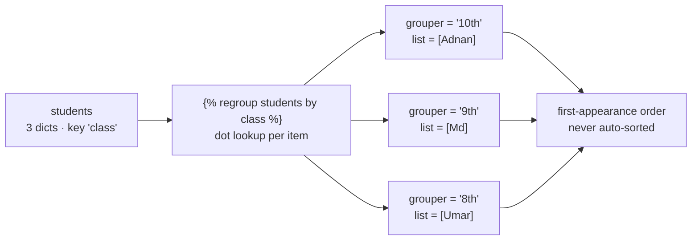
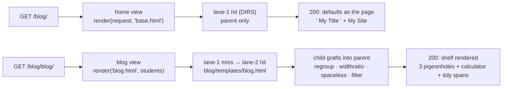
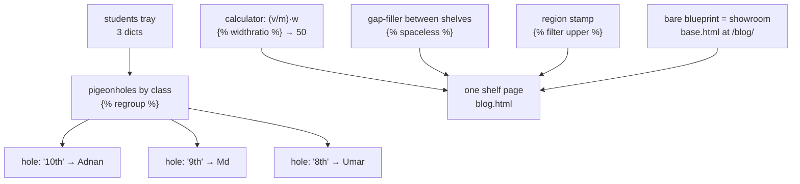

# 🚀 A017 — Templates 5: Advanced Tags

`📖 Lecture A017` · `🎓 Track: Core Django` · `📶 Level: Beginner` · `✅ Status: Documented`

> [!NOTE]
> **About this chapter's sources:** built primarily from a **fourteenth real artifact** —
> the `myProject9/` project in this very folder (fresh project, single `blog` app). The
> advanced-tags page (`blog/templates/blog.html`, 865 B) and the parent it extends
> (`templates/base.html`, 279 B) are quoted verbatim below; `blog/views.py` (369 B —
> including the unusual `home` view that renders **the parent directly**), both
> `urls.py` files, and `settings.py` (3371 B — `STATIC_URL` only, **no**
> `STATICFILES_DIRS`, and no `static/` folder shipped) were read and cross-checked.
> **Every rendered-output claim was verified twice**: by rendering the artifact's exact
> templates with its exact context through Django 6.1.1's engine (13/13 assertions,
> plus exact reprs quoted below), and by a live `GET` through the request path (Django
> test client, HTTP_HOST `127.0.0.1:8000`) — `GET /blog/` → **200** (the parent's
> defaults *as the whole page*), `GET /blog/blog/` → **200** (13/13 content assertions,
> regroup order included), `GET /` → **404** (the `blog/` prefix yet again), `GET
> /admin/` → **302** (0-byte db, gitignored). The command journal
> [`commands.txt`](../commands.txt) adds no new lines (still A007's line 25 —
> file-editing again). Django's official `regroup`/`widthratio`/`spaceless`/`filter`
> reference supplies the exact semantics (marked 📌). No transcript exists.

---

## 🧭 What You Will Learn

- [ ] Sort a list *inside the template* with **``** — and walk the groups with `group.grouper` + nested ``/`group.list`
- [ ] Know regroup's honest limits — **first-appearance order, not sorting** — and what happens to a missing grouper
- [ ] Compute a ratio in markup with **``** — `(50/100)·100 = 50`, exactly
- [ ] Collapse **pure inter-tag whitespace** with **``** — and know which spaces it never touches
- [ ] Stamp a *whole region* with one filter via **` … `** — the region form of A014's pipe
- [ ] Reuse the **pipe** (`|lower`, `|add:" 1"`) per value — and contrast *region vs value* application
- [ ] See the two-lane lookup split the family again — `base.html` (lane 1) vs `blog.html` (lane 2, **un-namespaced**) — and render the **parent directly as a page** of pure defaults

## 🎯 Why This Lecture Matters

The template arc so far: A013 gave pages a voice (`{{ }}`), A014 a styling desk
(filters), A015 a brain (control flow), A016 a shared skeleton and a static warehouse.
One family of tools is still missing — the **specialist tags**: the DTL's answer to
"reshape a *list* (regroup), compute a *ratio* (widthratio), tidy *inter-tag markup*
(spaceless), apply one filter to a *whole region* (`filter`)". Individually small, these
four appear in every mature Django codebase — regroup especially is the standard answer
to "group these rows by category *without* writing a view-side loop".

This artifact is also a structural lesson disguised as a tag shelf. Its `home` view
renders **`base.html` directly** — a parent template served as a complete page, meaning
what the browser sees is *nothing but defaults* (`My Title`, `My Site`). A016's
"showroom furniture" becomes the whole showroom. And the family splits across the lanes
one more time — `base.html` in `DIRS`, `blog.html` in the app — but this time the child
ships **un-namespaced** (`blog/templates/blog.html`, not `blog/templates/blog/blog.html`),
a departure from A011's namespace convention flagged ⚠️ below.

One honesty note before the shelf: A016's next-lecture connection pointed at
**forms and the database layer** (the artifact's "painted-on doors"). The actual
fourteenth artifact went *deeper into the template language* instead — the doors stay
painted on. Per the documentation contract, that prediction is corrected in A016's
footer and recorded here.

Interview-wise: `` is a classic "do you know the template language beyond
if/for" probe, and `` vs the pipe is the conceptual question that
distinguishes someone who memorized filters from someone who understood *scope of
application*.

## ✅ Prerequisites

- [ ] **A016** — ``/`` mechanics, block defaults, the two lanes, the load rule (this artifact inherits from a `DIRS` parent and re-runs the lane split)
- [ ] **A014** — the pipe (`|lower`, `|add`) — A017's `` is its region form
- [ ] **A015** — nested `` over list-of-dicts, dot lookup (A013) — `students.0.class` style resolution is regroup's fuel
- [ ] **A008** — URL prefixes (`blog/` mounts the app; the advanced page lives at `/blog/blog/`)
- [ ] 📌 Basic HTML nesting (`div`/`span`) — needed to read the spaceless example

### 📌 Recap — where A016 left us (and one honest correction)

A016's `myProject8/` gave the series its shared shell: `base.html` with title/content
slots, two children per lane, `` nav, `` reversals, and a real
`static/` warehouse. Its next-lecture connection pointed at **forms and the database
layer** — the artifact's painted-on doors. The actual artifact went one shelf further
into the **template language** instead: four specialist tags. The doors stay shut (the
0-byte `db.sqlite3` and POST-less login of *A016* — and the POST-less, model-less pages
here — keep that frontier honest); the prediction is corrected in A016's footer.

A017's `myProject9/` is a **smaller** family: `base.html` (279 B — a *bare* blueprint:
title + content slots, no css/js/nav/footer), one child (`blog.html`), and **no static
tree at all** — this artifact's `settings.py` declares `STATIC_URL` but **no**
`STATICFILES_DIRS`, and no `static/` folder ships. Its base does carry
`` — with **no** `` tags anywhere: an *inert load*
(harmless — loads only unlock; they don't demand use).

---
## 🏗️ The Artifact — A Specialist Tag Shelf (Served From Both Lanes)

Ground truth from `myProject9/` on disk (sizes from `Get-ChildItem`; 0-byte
`db.sqlite3` and `__pycache__/` noted but omitted):

```
A017_Templates_5_Advanced_Tags/
└── myProject9/
    ├── manage.py · db.sqlite3 (0 bytes, gitignored)
    ├── myProject9/                 ← the config package
    │   ├── settings.py             ← 3371 B: 'blog' + staticfiles; DIRS=[BASE_DIR/'templates'];
    │   │                              STATIC_URL='static/' but NO STATICFILES_DIRS (⚠️ + honest:
    │   │                              no static/ tree ships); inert MAILERS (⚠️ fifth artifact running)
    │   └── urls.py                 ← 838 B: 'admin/' + 'blog/' include('blog.urls')   ← the prefix
    ├── templates/                  ← lane 1 (DIRS) — the bare blueprint
    │   └── base.html               ← 279 B: parent — title block w/ default ` My Title `,
    │                                  inert , content block w/ default <h1>My Site</h1>
    └── blog/
        ├── apps.py                 ← BlogConfig, name='blog'
        ├── views.py                ← 369 B: home → 'base.html' DIRECTLY; blog → 3-student list
        ├── urls.py                 ← 158 B: '' → home, 'blog/' → blog
        └── templates/
            └── blog.html           ← 865 B: the advanced-tag shelf (⚠️ un-namespaced — no blog/ folder)
```

Two structural facts to notice. First, the **mount point doubles the name**: the
project mounts the app at `blog/`, and the advanced page's own pattern is `'blog/'` —
so the shelf lives at **`/blog/blog/`** (prefix + pattern both "blog"). Second, the
child **departs from A011's namespace convention**: it ships as
`blog/templates/blog.html` (lane 2, un-namespaced) instead of
`blog/templates/blog/blog.html`. The view asks for `'blog.html'` — lane 1 misses (only
`base.html` lives there), lane 2 hits. Fine in a one-file artifact; the A011-convention
collision risk (two apps, both shipping `blog.html`) is flagged ⚠️, not endorsed.

Here is the routing and the two views — `blog/urls.py` (158 B) and `blog/views.py`
(369 B), verbatim:

```python
from django.urls import path
from . import views

urlpatterns = [
    path('', views.home, name='home'),
    path('blog/', views.blog, name='blog'),
]
```

```python
from django.shortcuts import render

# Create your views here.
def home(request):
    return render(request, 'base.html')

def blog(request):
    students_list = [
        {"name":"Adnan", "class":"10th"},
        {"name":"Md", "class":"9th"},
        {"name":"Umar", "class":"8th"},
    ]
    return render(request, 'blog.html', {'students':students_list})
```

The **`home` view is the structural stunt**: it renders `'base.html'` — the *parent* —
directly. What the browser receives at `/blog/` is the blueprint *as the whole page*:
default title (` My Title `) and default content (`My Site`). A016's "showroom
furniture" is now the entire showroom. The `blog` view builds the context — a 3-item
list of dicts (`students`), which the shelf's regroup will pigeonhole.

In `settings.py` (3371 B) the static half of A016's chain is *absent*:

```python
# Static files (CSS, JavaScript, Images)
# https://docs.djangoproject.com/en/6.1/howto/static-files/

STATIC_URL = 'static/'
```

`'django.contrib.staticfiles'` still sits in `INSTALLED_APPS` (a `startproject`
default) and `` still appears in `base.html` (line 5) — but **nothing
uses ``** and no `static/` folder ships. Consistent, verifiable, and a neat
carries neither risk.

---
## 🧠 Core Idea — The Shelf: Four Specialists Over One Bare Blueprint

### The parent — `templates/base.html`, verbatim (279 B)

```html
<!DOCTYPE html>
<html lang="en">
<head>
    <title> My Title </title>
    
</head>
<body>
    <div class="content">
        
        <h1>My Site</h1>
        
    </div>
</body>
</html>
```

A016's blueprint, stripped to studs: two slots, **no css/js/nav/footer**, and one
structural difference that matters for the repr lesson — the spaces this time live
**inside** the block defaults (` My Title `, `\n        <h1>…`), not around the *tags*.
So a child that replaces the whole block replaces **all** of it, spaces included:

| Rendered | `<title>` content (repr) | Why |
|---|---|---|
| `base.html` alone (or `GET /blog/`!) | `' My Title '` | default content ships with its own spaces |
| `blog.html` (child content `Blog Page`) | `'Blog Page'` | child content replaces the *entire* block — exact, no stray spaces |

A016's base wrote `<title>  … </title>` (spaces around the *tag* — every
title inherited them); A017's base writes `<title> … </title>` (spaces only
*inside* the default). Same tag, opposite repr behavior — now you can derive both from
source.

Also note the **inert ``** (line 5): no `` tag exists
anywhere in the family, yet the load renders harmlessly — verified. Loads unlock
toolboxes; they don't require using them.

### The child — `blog/templates/blog.html`, verbatim (865 B)

```html


Blog Page


<h1>Blog Us</h1>

<ul>
    
        <li>Class {{ group.grouper }}
            <ul>
                
                    <li>{{ student.name }}</li>
                
            </ul>
        </li>
    
</ul>

<p>
    Progress:  %
</p>


<div>
    <span> This is a </span>
    <span> spaceless example</span>
</div>



    <p>This is a upper case filter example</p>



<p>
    {{ student.name|lower }} is in class {{ student.class|add:" 1" }}
</p>


```

Five mechanisms on one page, top to bottom: **regroup** (a list reshaped into labeled
groups), **widthratio** (a computed ratio), **spaceless** (inter-tag whitespace
collapse), **filter** (one filter stamped over a region), and a plain **pipe loop**
(A014's `lower`/`add` back for a walk-on). Each gets its section below. (⚠️ The
`<h1>Blog Us</h1>` and the "This is a upper case" wording are the artifact's own text —
quoted verbatim, not corrected.)

### 1. `` — pigeonhole the list, then walk the holes

**Definition:** `` walks the
`students` list, groups all items sharing the same `class` value, and binds the result
to `grouped_students` — a list of *group objects*, not students. Each group object
carries exactly two things: **`group.grouper`** (the shared value — the hole's label)
and **`group.list`** (every item that landed in that hole).



**Why it exists:** grouping in the view means Python loops and a dict of dicts in
`views.py` — logic. `` moves *presentation grouping* into the template,
where it belongs (A013's structure-vs-data divide), keeping the view a data provider.

**How it works, mechanically:** for each item, the tag resolves the `by`-expression
(`class` → dict lookup, dot-lookup order A013) and appends the item to the group keyed
by that value. Two consequences the docs are explicit about (📌): groups appear in
**first-appearance order** — *"`regroup` does not order the data"* — and a missing
grouper value collects those items under `None`-as-label. In this artifact the three
`class` values are all distinct, so the verified response shows exactly three
pigeonholes in list order:

```html
<li>Class 10th <ul><li>Adnan</li></ul></li>
<li>Class 9th  <ul><li>Md</li></ul></li>
<li>Class 8th  <ul><li>Umar</li></ul></li>
```

**Common confusion:** expecting alphabetical groups. If you want `8th, 9th, 10th`,
sort the list first (in the view, or 📌 `dictsort`/``-style tools) —
regroup *pigeonholes*, it does not sort. Second: `group.grouper` is the *value*
(`10th`), not the variable name (`class`).

### 2. `` — the markup calculator

`` computes `(value / max_value) × max_width` — here
`(50/100)·100` — and prints the **rounded integer**. Verified: the response ships
`Progress: 50 %`.

The tag's origin story is width *for bars*: `` inside a `style="width: …%"`. It doubles as the DTL's only built-in
ratio computation — the honest warning: it is **integer-rounded and only multiply-add
free**; anything fancier belongs in the view (or a custom filter). Interview shorthand:
*widthratio = (a/b)·c, rounded*; per-value formatting beyond that is A014's filter
shelf.

### 3. `` — collapse the gaps *between* tags only

` … ` removes whitespace that consists **only of
whitespace** and sits **between two tags** (`</span>`↔`<span>`, `<div>`↔`<span>`).
Spaces that touch text are untouched. Verified, exact:

```html
<!-- source -->
<div>
    <span> This is a </span>
    <span> spaceless example</span>
</div>
<!-- rendered -->
<div><span> This is a </span><span> spaceless example</span></div>
```

` This is a ` and ` spaceless example` keep their spaces (they are *text*); the
newlines+indent between the tags vanish. Why it exists: readable source (indented,
one-tag-per-line) without shipping kilobytes of whitespace to the browser. Common
confusion: expecting it to trim inside text, or to unwrap lines between attributes —
neither happens (📌).

### 4. ` … ` — one filter over a whole region

The `` tag applies a filter to **everything between itself and its end tag**
— text *and* tags:

```html

    <p>This is a upper case filter example</p>

<!-- rendered -->
<P>THIS IS A UPPER CASE FILTER EXAMPLE</P>
```

Verified exactly: even the `<p>` becomes `<P>` (HTML tags are case-insensitive, so the
page still renders — but the bytes really were uppercased). This is the **region form**
of A014's pipe: `{{ value|upper }}` stamps one value; `` stamps a
whole block. You can chain them (``) 📌. Rule of thumb:
pipe for *a value*, `filter` for *a region you didn't want to pipe piecemeal*.

### 5. The pipes walk on — `|lower` and `|add:" 1"`

The final loop is A014's shelf in action, one pipe per value:

```html
{{ student.name|lower }} is in class {{ student.class|add:" 1" }}
```

Verified, in list order: `adnan is in class 10th 1` · `md is in class 9th 1` ·
`umar is in class 8th 1`. `|lower` downcases; `|add` *concatenates* strings (`"10th" +
" 1"`). Note what `add` quietly demonstrates: the DTL can glue a literal argument to a
resolved value at print time — useful, and exactly as far as template "logic" should go.

### 6. Parent as page, lanes split, inert load — the structural leftovers

Three structural facts make this artifact more than a tag shelf:

1. **The parent rendered directly** — `home`'s `render(request, 'base.html')` serves the
   blueprint with *no child*: what ships at `/blog/` is pure defaults (` My Title `,
   `<h1>My Site</h1>`). Blocks are not just for children — they are the parent's own
   default content, and that content *is* a page if nothing overrides it.
2. **The lanes split again** — `base.html` lives in `DIRS` (lane 1), `blog.html` in
   `APP_DIRS` (lane 2); the child's `` resolves across the
   lane boundary exactly as A016's app-level `about.html` did (lane 1 searched first).
3. **The child is un-namespaced** (⚠️) — `blog/templates/blog.html`, not
   `blog/templates/blog/blog.html`. A011's convention exists so two apps can each ship
   a same-named template without collision; this artifact opts out. Safe alone, a trap
   at scale.

### One-sentence mechanism recap

Regroup pigeonholes a list into `grouper`+`list` groups (in first-appearance order),
widthratio computes and rounds a ratio, spaceless collapses pure inter-tag whitespace,
`` stamps one filter across a region while pipes stamp single values — and
the whole shelf renders as a child of a bare blueprint that can also stand on its own
as a page of defaults.

---
## 🔄 The Journey — `GET /blog/` Through a Bare Blueprint and Its Shelf



Verified end to end (test client, HTTP_HOST `127.0.0.1:8000`):

| # | Request | Result | Proof |
|---|---|---|---|
| 1 | `GET /blog/` | **200** | the *parent as page*: `<title> My Title </title>` repr `' My Title '`, `<h1>My Site</h1>` — defaults only |
| 2 | `GET /blog/blog/` | **200** | 13/13 content assertions: `Blog Page` title (exact), `Blog Us` h1, `Class 10th/9th/8th` in list order with `Adnan/Md/Umar`, `Progress: 50 %`, the spaceless span block, the `<P>THIS IS A…</P>` region, `10th 1/9th 1/8th 1` |
| 3 | `GET /` | **404** | `blog/` prefix only — A008's deliberate root-404, third artifact running |
| 4 | `GET /admin/` | **302** | admin mounted; 0-byte db (gitignored) — the honest unmigrated limit |

The two responses are the lecture in miniature. Row 1 proves **defaults are content**
— a parent template is a valid page with no child in sight. Row 2 proves the **shelf
works end to end**: the regroup's first-appearance order (`10th` → `9th` → `8th`, never
sorted), the widthratio's rounded `50`, the spaceless block collapsed byte-for-byte as
the Core-Idea repr shows, the filter region uppercased *including its tags*, and the
A014 pipes gluing `add:" 1"` — all inside a child grafted across lanes onto a blueprint
that, one route over, stands alone.

## 🧱 Important Vocabulary

| Term | Simple meaning | Technical meaning | 🧷 Memory hook |
|---|---|---|---|
| `` | pigeonhole a list | groups items sharing a `by`-resolved value; binds a list of group objects | 🧷 the mailroom's pigeonholes |
| `group.grouper` | the hole's label | the shared value the group was keyed by | 🧷 the label taped to the hole |
| `group.list` | the hole's contents | all items whose grouper matched | 🧷 the mail inside |
| First-appearance order | no sorting | groups appear in the order their label first appeared; regroup never sorts (📌) | 🧷 queue order, not phone-book order |
| `` | the calculator | `(value/max_value)·max_width`, integer-rounded | 🧷 the office's ratio stamper |
| `` | gap filler | strips pure-whitespace runs between two adjacent tags only | 🧷 closes shelf gaps, never labels |
| `` | the region stamp | applies one filter to the whole block content (text and tags) | 🧷 stamp everything in the box |
| Pipe vs region | value vs scope | `{{ x\|upper }}` formats one value; `` formats a region | 🧷 one page vs the whole folder |
| Inert load | signed, unused | `` with no tags used — harmless, renders fine | 🧷 toolbox signed out, never opened |
| Un-namespaced child | lane 2, no folder | `blog/templates/blog.html` instead of `blog/templates/blog/blog.html` (⚠️) | 🧷 a shop sign without the shop's street |

> These terms are registered in `docs/MEMORY.md` §2 as well.

## 💡 Real-World Analogy — The Mailroom's Pigeonholes

A busy **mailroom** receives one mixed tray of letters (`students`) and sorts it into
**pigeonholes by recipient label** (``) — each hole gets a
**label** (`grouper`) and whatever landed in it (`group.list`). The clerk processes the
tray *in order*, so the holes hang in **first-appearance order** — the mailroom never
re-alphabetizes the wall; if you want that, sort the tray before it arrives. The
office's **calculator** (`widthratio`) stamps `(50/100)·100 = 50` onto a progress
sheet, always rounding to whole numbers. The **gap-filler** (`spaceless`) closes the
empty spaces *between shelves* — it never trims the words written *on* the labels. The
**region stamper** (``) stamps every sheet in a box at once — labels
included (`<p>` → `<P>`). And the room's **model showroom** (`base.html` alone at
`/blog/`) displays the blueprint's default furniture with nothing furnished at all.

## ❌ Common Beginner Mistakes

1. **Expecting `` to sort** — it pigeonholes in first-appearance order;
   `10th → 9th → 8th` here is *list order*, verified. Want alphabetical? Sort the list
   in the view first (or 📌 `dictsort` the right way) — regroup won't do it.
2. **Reading `group.grouper` as the variable name** — it is the *value* (`10th`), not
   `class`. And `group.list` is the members — not the students directly. The nested
   `` exists for a reason.
3. **Forgetting the `as` binding** — `` without
   `as grouped_students` is a syntax error; the tag's whole job is to bind the grouped
   list to a name.
4. **Believing `` trims your text** — ` This is a ` kept its spaces,
   verified. It only collapses pure-whitespace runs *between two tags*; text-adjacent
   spaces and attribute spacing are untouchable.
5. **Assuming `` skips markup** — the `<p>` really became `<P>`
   (verified). It's harmless here because HTML is case-insensitive, but the region
   form stamps *everything* — attributes, tags, text.
6. **Using `` for money or precision math** — it integer-rounds
   (`(a/b)·c`). Percentages for bars: perfect. Pricing: belongs in the view or a model.
7. **Shipping un-namespaced app templates at scale** — `blog/templates/blog.html`
   works solo (verified) but collides the day a second app ships its own `blog.html`
   (⚠️ A011's convention exists for this).
8. **Rendering the parent directly by accident** — `render(request, 'base.html')` is
   legal (it's this artifact's `home`), but what ships is *only defaults*. If your page
   looks mysteriously empty, check whether you meant to render the child.

## 🧠 Common Misconceptions

| ✅ Django/DTL IS … | ❌ It is NOT … |
|---|---|
| regroup = pigeonholing in first-appearance order | sorting, or a replacement for `order_by`/`sorted()` |
| `group.grouper` = the shared *value* | the field name, or a list of values |
| `group.list` = all items of that group | a pagination of the original list |
| spaceless = inter-tag whitespace only | a general whitespace/text trimmer |
| `` = a pipe with a region scope | a replacement for chaining pipes on one value (`{{ x\|a\|b }}` still wins there) |
| `widthratio` = `(a/b)·c` rounded to int | a general math or money formatter |
| parent templates are valid render targets | children-only documents (defaults are content — verified at `/blog/`) |
| inert `` = harmless | dead code that breaks rendering (verified: it renders) |

## 🧪 Practical Example — Extend the Artifact (Three Live Exercises)

All three run against `myProject9/` as it stands — template edits plus, for Exercise 3,
one URL addition.

### Exercise 1 — make regroup prove it doesn't sort

Change the view's list order to `9th, 8th, 10th` (Md, Umar, Adnan) and reload
`/blog/blog/`: the pigeonholes now hang `9th → 8th → 10th` — **first-appearance
order**, not alphabetical. Then sort the list in the view (`students_list.sort(key=lambda
s: s['class'])`) and reload: `8th → 9th → 10th`. Same template, two orders — the
sorting belongs to the data, the pigeonholing to the template.

### Exercise 2 — a duplicate class, and the hole that collects two

Add a fourth student `{"name":"Sameer", "class":"10th"}` to `students_list`. Reload:
the `10th` hole now contains **both** `Adnan` and `Sameer`, while `9th` and `8th` keep
one each — and because `10th` appeared first, it still heads the list. That is
`group.list` doing its job: non-adjacent duplicates would collect into the same hole
too (try moving Sameer to the end of the list and watch `10th` still hold both).

### Exercise 3 — a second page that reuses the shelf

Add a "progress board": create `blog/templates/progress.html` extending
`templates/base.html`, with `` for one student and a second
`` by `name` instead of `class`. Wire it
(`path('progress/', views.progress, name='progress')` +
`def progress(request): return render(request, 'progress.html', {'students':
students_list})`) and mount it at `/blog/progress/` (inside the existing prefix).
Verify `GET /blog/progress/` → 200 with `Progress: 75 %` — the shelf tags are generic;
only the data changes. (Watch the lane split: your new file is lane-2, the parent it
extends is lane-1 — the same cross-lane extend as `blog.html`.)

## 🎯 Interview Perspective

> [!IMPORTANT]
> Interview cards test *understanding*, not recitation.

**Q: "Group 50 products by category — do you do it in the view or the template?"**
A: Both answers are defensible; the strong one names the trade-off. The template's
`` keeps the view a data provider and is exactly for *presentation
grouping* — but it pigeonholes in first-appearance order and does not sort. If the
grouping is semantic (categories with real meaning), I'd often group via the ORM/
Python for stable, ordered data and keep the template dumb; `` is my tool
when the grouping is purely presentational. I can show it on a real artifact: three
students, three holes, `10th → 9th → 8th` in list order.

**Q: "What does `` do with items whose group key is missing?"**
A: They collect together under a `None` grouper (📌) — the docs call this out. So the
template never crashes on a missing key; it labels the unlabeled. Worth knowing before
you render `group.grouper` raw.

**Q: "`` — what exactly does it remove?"**
A: Whitespace runs that contain *only* whitespace and sit *between two tags*. Text-
adjacent spaces survive — I verified the artifact: `<span> This is a </span><span>
spaceless example</span>` keeps its inner spaces while the inter-tag newlines vanish.

**Q: "`` vs `{{ x\|upper }}`?"**
A: Scope. The pipe formats one value; `` applies one filter chain to an
entire region — text and tags (I've seen `<p>` become `<P>` byte-for-byte). Pipes
chain per-value; `` takes a chain too (`upper|linebreaks`), but it's about
*not piping ten values piecemeal*.

**Q: "What does `{{ a|add:" 1" }}` really do?"**
A: `add` concatenates strings/lists — here `"10th" + " 1"`. It's the DTL's glue, not
arithmetic beyond what `+` means for the operand types. For real math,
`` (ratios) or view-side computation.

## 🔁 Active Recall

Answer from memory first, then expand each `<details>`.

1. What two things live inside each object that `` produces — and which
   did the artifact print as the hole's label?

<details><summary>Answer</summary>

`group.grouper` — the shared value the group was keyed by (`10th`, `9th`, `8th`) — and
`group.list` — every item sharing it. The artifact printed the label with
`Class {{ group.grouper }}` and walked members with a nested
``.

</details>

2. In what order did the groups render, and who decides that order?

<details><summary>Answer</summary>

`10th → 9th → 8th` — the order of first appearance in the list, because regroup
pigeonholes without sorting (📌 "`regroup` does not order the data"). The view's list
order decides; sort the list first if the wall must be alphabetical.

</details>

3. `` printed what, and why "rounded" matters?

<details><summary>Answer</summary>

`50` — `(50/100)·100`, integer-rounded. The rounding is why widthratio is for
percentages/bar widths, not money or precision: `widthratio 1 3 100` prints `33`, not
`33.33`.

</details>

4. What exactly did `` remove from the div — and what did it keep?

<details><summary>Answer</summary>

Removed: the newline+indent runs *between* `<div>`↔`<span>` and the two `</span>`↔`<span>`
tags — pure whitespace between adjacent tags. Kept: every space touching *text*
(` This is a `, ` spaceless example`). Verified byte-exact:
`<div><span> This is a </span><span> spaceless example</span></div>`.

</details>

5. What did `` change that a pipe on the text alone wouldn't?

<details><summary>Answer</summary>

It uppercased the *entire region* — including the `<p>` tags, which came out `<P>…</P>`
(verified byte-for-byte). A pipe on the inner text alone would have left the tags alone;
the filter tag has a region scope, like a stamp over the whole box.

</details>

6. Why does `/blog/` show `My Site` while `/blog/blog/` shows the shelf — same
   `base.html`, two results?

<details><summary>Answer</summary>

`/blog/` (`home`) renders `base.html` *directly* — the parent as page, so the browser
gets pure defaults (`' My Title '` repr, `<h1>My Site</h1>`). `/blog/blog/` (`blog`)
renders the child, whose blocks override those defaults; the child grafts across lanes
(child lane-2, parent lane-1). Defaults are content — with no child, they are the page.

</details>

7. Name the three ⚠️-flagged quirks of this artifact a reviewer should catch.

<details><summary>Answer</summary>

(1) The un-namespaced child — `blog/templates/blog.html` instead of
`blog/templates/blog/blog.html` (A011's collision convention, departed from);
(2) the inert `` in `base.html` — no `` anywhere, and no
`STATICFILES_DIRS`/`static/` tree in settings; (3) the artifact's own typos ("Blog Us",
"a upper case") quoted verbatim, not corrected. (Plus the carried-over inert `MAILERS`
block — fifth artifact running.)

</details>

## 📝 Quick Revision — A017 in Five Minutes

| Concept | One line | Artifact proof |
|---|---|---|
| `` | pigeonhole a list by a resolved value | `students` → three holes |
| `group.grouper` / `group.list` | the hole's label / the hole's contents | `Class 10th` → `[Adnan]` |
| First-appearance order | regroup never sorts | `10th → 9th → 8th`, list order |
| `` | `(v/m)·w`, integer-rounded | `50 100 100` → `50` |
| `` | strips pure inter-tag whitespace | spans joined, inner spaces kept |
| `` | one filter across a region | `<P>THIS IS A…</P>` |
| `|lower` / `|add:" 1"` | value pipes (A014 returns) | `adnan is in class 10th 1` |
| Parent as page | defaults are content | `GET /blog/` → `' My Title '` + `My Site` |
| Two-lane split | child lane-2, parent lane-1 | `blog.html` extends `base.html` across lanes |
| Inert load | `` without use renders fine | base line 5, no `` anywhere |

Verified numbers to memorize: `/blog/` → **200** (defaults as page) · `/blog/blog/` →
**200** (13/13 assertions) · `/` → **404** · `/admin/` → **302** · regroup order
`10th → 9th → 8th` · widthratio `50` · title reprs: default `' My Title '`, child exact
`'Blog Page'`.

## 🧠 Final Mental Model — The Mailroom



One sentence to carry: **regroup pigeonholes in arrival order, widthratio computes and
rounds, spaceless closes only shelf gaps, `` stamps whole regions while
pipes stamp single values — and a blueprint left unfurnished is itself a complete
page.**

## ❓ FAQ

**Q1. Can `` group by more than one level (like class *and* section)?**
A: Not in one tag — `by` takes one expression. Chain regroups 📌 (regroup by A, then
inside each group regroup by B), or do nested grouping in the view. The artifact uses
the single level.

**Q2. Does `` change the original list?**
A: No — it builds a new structure bound to the `as` name; `students` is untouched (the
artifact proves it: the final loop still walks the *original* list).

**Q3. My groups are in a weird order — is that a bug?**
A: No — first-appearance order (📌). The wall reflects the tray's arrival order. Sort
the list in the view if the wall must be alphabetical.

**Q4. Can `` do math on a region?**
A: No — it applies *filters* (rendering transforms). Ratios go through
``; anything else belongs in the view or a custom filter (📌).

**Q5. Why is the advanced page at `/blog/blog/` — is that a mistake?**
A: It's the artifact's own wiring: the app is *included* at the `blog/` prefix
(A008/A016) *and* its pattern is named `'blog/'`. Prefix + pattern both "blog" —
verified 200. A naming smell, not a routing error; ⚠️ flagged, not endorsed.

**Q6. Why does `` appear in `base.html` with no `` tags?**
A: An inert load — harmless, verified rendering. Contrast A016's lesson: a load *with*
use but no warehouse (missing `STATICFILES_DIRS`) silently 404s assets. Here there is
no use at all, so nothing can break.

**Q7. The browser shows unstyled content / a stale page on `127.0.0.1:8000` — again?**
A: Same port trap as A016's FAQ Q7: a stale `runserver` from an earlier chapter's
project owning port 8000, or a cached tab. Stop the old server
(`Stop-Process -Id (Get-NetTCPConnection -LocalPort 8000 -State Listen).OwningProcess`),
run `py manage.py runserver` from `myProject9/`, then hard-refresh (`Ctrl+F5`).
Server-side truth for this artifact: `GET /blog/` → 200, `GET /blog/blog/` → 200.

## 🏁 Learning Checkpoints

- [ ] **Checkpoint 1 — Pigeonholes:** I can write `` and walk it with `group.grouper` + nested `for` over `group.list` — *§Core Idea 1*
- [ ] **Checkpoint 2 — Order honesty:** I can state and demonstrate regroup's first-appearance order and where sorting belongs — *§Core Idea 1, Exercise 1*
- [ ] **Checkpoint 3 — The calculator:** I can compute any `widthratio` triple by hand, including the rounding — *§Core Idea 2*
- [ ] **Checkpoint 4 — Whitespace scope:** I can predict exactly which spaces spaceless removes (inter-tag only) — *§Core Idea 3*
- [ ] **Checkpoint 5 — Scope of a stamp:** I can choose pipe vs `` and predict what the filter tags (`<P>`) — *§Core Idea 4–5*
- [ ] **Checkpoint 6 — Structure:** I can explain the parent-as-page route, the cross-lane extend, and the inert load — *§Core Idea 6*

## 🏋️ Exercises

- **Level 1 — Recall:** List the four specialist tags on the shelf with their one-line
  semantics; quote the regroup order and the widthratio output.
- **Level 2 — Understanding:** Explain to a peer why regroup-in-template vs
  group-in-view is a *structure-vs-data* decision (A013's divide), and what each side
  gives up.
- **Level 3 — Application:** Do all three Practical-Example exercises: re-order the
  list (order proof), add the duplicate student (hole collection), and build
  `progress.html` with its own regroup + widthratio, mounted at `/blog/progress/`.
- **Level 4 — Interview reasoning:** A teammate wants to replace the view's
  `students_list` with a queryset and keep ``. What changes (attribute
  access vs dict keys, ordering via `order_by`), what stays (pigeonhole mechanics), and
  where would you now sort — and why does the artifact's first-appearance lesson
  suddenly become an `order_by` lesson?

## 🏁 Final Takeaways

1. **Regroup pigeonholes; it never sorts.** `` yields
   `grouper` + `list` objects in first-appearance order — verified `10th → 9th → 8th`.
2. **Grouping is a presentation concern in the DTL** — the view stays a data provider
   (A013's divide), and the *original* list is untouched.
3. **`widthratio` is `(a/b)·c`, integer-rounded** — `50 100 100` → `50`; perfect for
   bar widths, wrong for money.
4. **Spaceless closes only shelf gaps** — pure-whitespace runs between two adjacent
   tags; text-adjacent spaces are untouchable (verified byte-exact).
5. **`` is the pipe's region form** — one chain stamped across a whole
   block, tags included (`<p>` → `<P>`, verified).
6. **Defaults are content** — a parent rendered directly (`/blog/`) is a complete page
   of defaults (`' My Title '`, `My Site`); the block-default lesson reaches its
   logical end.
7. **The lanes keep composing** — child (lane 2, un-namespaced ⚠️) extends parent
   (lane 1) across the boundary; the inert load proves loads can exist without use.
8. **The port-8000 trap repeats** — stale servers and cached tabs are the series'
   recurring operational bug, not a Django one (FAQ Q7).

---

## 🔄 Next Lecture Connection

The template shelf is now complete — variables (A013), filters (A014), control flow
(A015), inheritance + static (A016), and the specialist tags (A017). What the artifact
*doesn't* have is anything to be dynamic about: no models, no forms, no persistence —
the 0-byte `db.sqlite3` is still an empty promise, and A016's painted-on doors (the
POST-less login, the unmigrated admin) remain shut. That frontier — **models, the ORM,
and forms** — is where the series must go next, and the next folder is already dropped
in the repo: **A018 · Bootstrap in Django** (styling the shell the templates built).
The data frontier stays honestly pending until its folder arrives; when it does, the
regroup lesson becomes an `order_by` lesson and the pigeonholes become querysets.

---
<div class="doc-footer">

**Sources used:**

| Source | Role | Notes |
|---|---|---|
| `A017_Templates_5_Advanced_Tags/myProject9/` — fourteenth real artifact | **Primary** | `blog/templates/blog.html` (865 B) and `templates/base.html` (279 B) quoted verbatim; `blog/views.py` (369 B — incl. `home` rendering the parent directly), both `urls.py` (838 B / 158 B), `settings.py` (3371 B — `STATIC_URL` only, no `STATICFILES_DIRS`, no static tree) read and cross-checked |
| Verified render — Django 6.1.1 engine + request pipeline | Verification | 13/13 engine assertions + exact reprs (`'Blog Page'`, `' My Title '`, widthratio `'50'`, spaceless block, `<P>…</P>`, lower/add pairs) AND live `GET`s: `/blog/` 200 (defaults as page), `/blog/blog/` 200 (13/13 assertions + regroup order), `/` 404, `/admin/` 302, via test client (HTTP_HOST `127.0.0.1:8000`) |
| [`commands.txt`](../commands.txt) | Context | No new lines (last entry remains A007's line 25) — file-editing; the artifact outranks the journal |
| [A016](../A016_Templates_4_Inheritance_Static_Files/README.md) · [A014](../A014_Templates_2_Filters_Text_Numbers_Date/README.md) · [A015](../A015_Templates_3_If_For_With_and_Cycle/README.md) · [A011](../A011_App_Level_Templates_Setup_HTML_Integration/README.md) · [A008](../A008_Multiple_Apps_with_Views_URLs_%28Blog_Shop_Example%29/README.md) | Context | Block defaults + lanes; the pipes (`lower`/`add`) as region-vs-value prelude; nested loops + truthiness; the namespace convention (departed from, ⚠️); URL prefixes |
| Official Django docs (`regroup` · `widthratio` · `spaceless` · `filter` tags) | 📌 Supplementary | Grouper/None-collection semantics, "regroup does not order the data", widthratio rounding, spaceless inter-tag scope, filter chains — flagged 📌 in place |

> 📌 **Scope note:** everything derived from the artifact and its verified render is
> source-grounded; regroup's first-appearance/None semantics, widthratio's rounding,
> spaceless's inter-tag scope, and filter chains come from Django's docs and carry the
> 📌 badge. The un-namespaced child (`blog/templates/blog.html`), the `/blog/blog/`
> double-name URL, the inert `` with no static tree, the inert
> `MAILERS` block (fifth artifact running), and the artifact's own wording ("Blog Us",
> "a upper case") are flagged ⚠️, not endorsed — and the 0-byte `db.sqlite3` /
> POST-less pages keep the forms-and-database frontier honestly pending (A016's
> prediction corrected in its footer). No transcript exists for A017 — declared per
> the documentation contract.
>
> **Navigation:** [← A016 · Templates 4: Inheritance, Static Files](../A016_Templates_4_Inheritance_Static_Files/README.md) · [📚 Series Hub](../README.md) · [A018 · Bootstrap in Django →](../A018_Bootstrap_in_Django/README.md)
>
> **Series:** [A001](../A001_Introduction_What_is_Django/README.md) ·
> [A002](../A002_MVT_Architecture_Explained/README.md) ·
> [A003](../A003_Install_Python_pip_Django_Virtual_Environment_Setup/README.md) ·
> [A004](../A004_Create_Django_Project/README.md) ·
> [A005](../A005_Django_Files_Folders/README.md) ·
> [A006](../A006_Django_startapp_Command_Explained/README.md) ·
> [A007](../A007_Views_URLs_Basics/README.md) ·
> [A008](../A008_Multiple_Apps_with_Views_URLs_%28Blog_Shop_Example%29/README.md) ·
> [A009](../A009_URL_Parameters_%28path_re_path_kwargs%29/README.md) ·
> [A010](../A010_Templates_Folder_Setup_Project_Level/README.md) ·
> [A011](../A011_App_Level_Templates_Setup_HTML_Integration/README.md) ·
> [A012](../A012_Manage_HTML_Files/README.md) ·
> [A013](../A013_Templates_1_Basics_&_Variables/README.md) ·
> [A014](../A014_Templates_2_Filters_Text_Numbers_Date/README.md) ·
> [A015](../A015_Templates_3_If_For_With_and_Cycle/README.md) ·
> [A016](../A016_Templates_4_Inheritance_Static_Files/README.md) · **A017** ·
> [Hub](../README.md)

</div>
