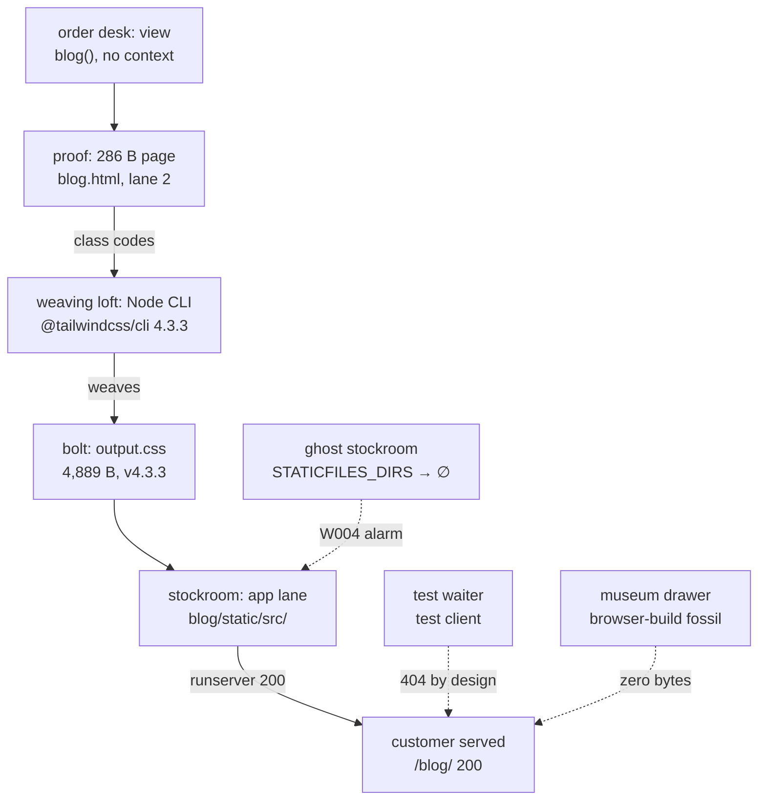

# 🚀 A019 — Tailwind Setup in Django

`📖 Lecture A019` · `🎓 Track: Core Django` · `📶 Level: Beginner` · `✅ Status: Documented`

> [!NOTE]
> **About this chapter's sources:** no lecture transcript or notes exist for A019 — this
> chapter is built from the repo's own sixteenth artifact, `myProject11/` (all files quoted
> verbatim), plus the owner's command-journal line `npm run dev   # for run tailwind css`
> (`commands.txt`). Tailwind/Node mechanics come from the artifact's own `package.json`
> (`tailwindcss ^4.3.3`, `@tailwindcss/cli ^4.3.3`, compiled `output.css` banner v4.3.3)
> and official Django staticfiles docs, marked 📌.

---

## 🧭 What You Will Learn

- [ ] Explain what Tailwind gives Django templates that Bootstrap does not — utility
  classes (`bg-sky-200`, `text-center`, `p-4`) composed in markup instead of pre-built
  components (`btn btn-primary`)
- [ ] Map the artifact's **two-channel Tailwind wiring**: a commented-out browser-CDN
  script vs a compiled local stylesheet served through ``
- [ ] Read the three-file Node pipeline (`package.json` → `input.css` → `output.css`)
  and say what each file contributes and which tool (`npm run dev`) connects them
- [ ] Trace `GET /blog/` end to end: mount → `blog` view → un-namespaced template →
  final 286-byte page, and state exactly what the browser fetches next
- [ ] Diagnose from first principles why the page is 200 while its stylesheet 404s
  under the test client — `STATICFILES_DIRS` pointing at a directory that does not exist
- [ ] Reproduce every number in this chapter with the engine render and the live
  request path on Django 6.1.1 + Tailwind CSS v4.3.3


## 🎯 Why This Lecture Matters

A018 dressed the shell with Bootstrap: pre-sewn costumes (`btn btn-primary`) delivered by
a Django template-tag bridge. Tailwind is the opposite philosophy of the same job — no
costumes, only **fabric by the meter**: tiny single-purpose utilities (`bg-sky-200` paints
a sky background, `text-center` centers text, `p-4` adds padding) that you stitch together
directly in the `class` attribute. The artifact's one styled line wears three utilities at
once — `<h1 class="bg-sky-200 text-center p-4">` — and that line is the whole design
system: no component names, no theme to install, just composition.

This lecture is the series' first **two-toolchain project**: Python/Django renders the
page, Node/npm *builds* the paint. A `package.json` declares the Tailwind compiler,
`npm run dev` watches and compiles, and Django serves the compiled result as an ordinary
static file. Nothing about Django changes — the same `render()`, the same lanes, the same
`` labels — but the stylesheet now has a *build step* upstream of the
warehouse, and that step lives completely outside Python. Understanding where Django's
responsibility ends and Node's begins is the entire lecture.

What breaks if you skip it: the next unstyled Tailwind page will send you debugging
Django — views, URLs, template lanes — when the failure sits one toolchain over: a
compiler that never ran, an output file that never regenerated, a `STATICFILES_DIRS`
pointing at a directory that doesn't exist. This artifact proves all three failure shapes
at once, live: a 200 page, a 404 stylesheet, and a compiler pipeline frozen mid-setup.

## ✅ Prerequisites

- [ ] A013 — what `render(request, name)` does with no context argument
- [ ] A016 — the franchise model: `` + `` labels,
  `STATICFILES_DIRS` as the warehouse stock list, loads-don't-inherit
- [ ] A018 — Bootstrap's three channels, label-vs-file split, page-200-with-asset-404
  (this chapter is the same diagnosis with a second toolchain added)
- [ ] A010/A011 — the two template lanes and the `<app>/` namespacing convention
  (the artifact *departs* from it — flagged ⚠️)
- [ ] A008 — the `blog/` URL prefix (root `/` 404s by design, again)
- [ ] 📌 Node.js + npm installed (`node --version`, `npm --version`) — the Tailwind
  compiler is a Node package, invisible to every Python interpreter

---

## 🏗️ The Artifact — A Two-Toolchain Page (Sixteenth Artifact)

Same skeleton as ever: fresh single-app project `myProject11/`, app `blog`,
`blog/`-prefixed URLs, one context-free view, one page. What is new is the paint
factory standing next to the warehouse:

| # | File | Size | Role in this lecture |
|---|---|---|---|
| 1 | `myProject11/blog/templates/blog.html` | 545 B | **The page.** No inheritance — a whole standalone HTML document with one `` label and one commented CDN fossil |
| 2 | `myProject11/blog/static/src/input.css` | 22 B | The compiler's *source*: `@import "tailwindcss";` — one line |
| 3 | `myProject11/blog/static/src/output.css` | 4,889 B | The compiler's *product*: Tailwind v4.3.3 banner + base reset + exactly the utilities the page uses |
| 4 | `myProject11/package.json` | 215 B | The Node manifest: `tailwindcss ^4.3.3` + `@tailwindcss/cli ^4.3.3`, `dev` script wiring input → output with `--watch` |
| 5 | `myProject11/blog/views.py` | 125 B | One view, `blog`, context-free `render(request, 'blog.html')` (identical shape to A018) |
| 6 | `myProject11/blog/urls.py` | 112 B | One pattern, `''` → `blog`, `name='blog'` |
| 7 | `myProject11/myProject11/urls.py` | 839 B | `blog/` prefix include + admin (the A008 mount, sixth artifact running) |
| 8 | `myProject11/myProject11/settings.py` | 3,415 B | Series-standard single-app settings — but `STATICFILES_DIRS` points at `BASE_DIR / 'static'`, a directory that **does not exist** |
| 9 | `myProject11/db.sqlite3` | 0 B | Seventh artifact running — still an empty promise, forms/database still pending |
| 10 | `myProject11/venv/` | — | The project's Python interpreter (Django 6.1.1); Node v24.14.0 / npm 11.9.0 live outside it |

### The artifact tree (nothing cached, nothing generated — vendored dirs excluded)

```text
myProject11/
├── manage.py
├── db.sqlite3                      # 0 bytes — seventh artifact running
├── package.json                    # 215 B — Node manifest (tailwindcss + cli 4.3.3)
├── package-lock.json               # pinned Node tree (tailwindcss 4.3.3 exact)
├── blog/
│   ├── admin.py  apps.py  models.py  tests.py  views.py  urls.py  __init__.py
│   ├── migrations/__init__.py
│   ├── static/src/
│   │   ├── input.css               # 22 B — compiler source
│   │   └── output.css              # 4,889 B — compiler product (v4.3.3 banner)
│   └── templates/
│       └── blog.html               # 545 B — standalone page, no extends (⚠️ pattern break)
├── myProject11/
│   ├── settings.py                 # 3,415 B — STATICFILES_DIRS → missing dir (⚠️)
│   ├── urls.py                     # 839 B — blog/ prefix + admin
│   └── asgi.py  wsgi.py  __init__.py
└── venv/                           # project interpreter (Django 6.1.1)
```

> ⚠️ **Discrepancy note (artifact vs convention):** two breaks, both flagged not endorsed.
> (1) The page is `blog/templates/blog.html` — un-namespaced again (A017/A018 did the same;
> works only because the project has one app). (2) Deeper: this is the first artifact page
> with **no inheritance at all** — no ``, no blocks, a whole document standing
> alone. After six chapters of parents and grafts, the series meets the page that opted out.


## 🧠 Core Idea 1 — Tailwind Is Fabric by the Meter, Not Costumes

**Definition.** Tailwind CSS is a utility-first stylesheet: instead of pre-built components
(`btn btn-primary` — one name, a whole design decision), it ships hundreds of tiny
single-purpose classes, each doing one thing. You compose the design directly in the
`class` attribute. Django never runs Tailwind either — the browser applies the compiled
CSS to whatever classes the markup wears.

**Why it exists.** Bootstrap answers "what should a button look like?" once, for everyone.
Tailwind refuses the question: it gives you the atoms (`bg-*` background colors,
`text-center` alignment, `p-*` padding scale) so no two sites share a component look
unless they choose to. The trade is verbosity in markup for freedom from overriding a
framework's opinions.

**The artifact proof.** The page has exactly one styled element, wearing three utilities:

```html
<h1 class="bg-sky-200 text-center p-4">Welcome to My Blog</h1>
```

**Explanation.** Read the three meters off the roll: `bg-sky-200` ("background: sky at
shade 200"), `text-center` ("text-align: center"), `p-4` ("padding: 4 spacing units").
Each maps to one declaration in the compiled product (verified present in `output.css`).
The verified render carries the whole attribute HIT — the *request* for paint is intact.
Whether the paint arrives is, again, a static-files question with a new twist.

> **Confusion to pre-empt:** "`bg-sky-200` didn't work, so Tailwind is broken." The class
> is a *request* printed in HTML; the *fulfillment* is a CSS rule in `output.css` served
> over HTTP. A missing rule (stale build) and a missing file (404) look identical in the
> browser — unstyled text — but live at opposite ends of the pipeline. This chapter teaches
> telling them apart.


## 🧠 Core Idea 2 — The Other Toolchain: `input.css` → `output.css` via `npm run dev`

**Definition.** Tailwind v4 compiles: you write a 22-byte source, a Node CLI scans your
templates for class names, and emits a stylesheet containing only the used utilities. The
three files form a pipeline — source, product, manifest — connected by one command.

The source — the whole of `input.css`:

```css
@import "tailwindcss";
```

The manifest — the whole of `package.json`:

```json
{
  "scripts": {
    "dev": "npx @tailwindcss/cli -i ./blog/static/src/input.css -o ./blog/static/src/output.css --watch"
  },
  "dependencies": {
    "@tailwindcss/cli": "^4.3.3",
    "tailwindcss": "^4.3.3"
  }
}
```

The product — `output.css` (4,889 B), banner first:

```css
/*! tailwindcss v4.3.3 | MIT License | https://tailwindcss.com */
@layer theme, base, components, utilities;
/* …theme tokens (:root --color-sky-200, --spacing)… */
/* …base reset (margin 0, border-box, inherit)… */
@layer utilities {
  .bg-sky-200 { background-color: var(--color-sky-200); }
  .p-4 { padding: calc(var(--spacing) * 4); }
  .text-center { text-align: center; }
}
```

**Explanation.** The `dev` script reads `-i` (input), writes `-o` (output), and `--watch`
keeps the compiler alive: save a template with a new class, the CSS regrows. The product
proves the scan worked — its `@layer utilities` holds *exactly* the three classes the
page wears plus the theme tokens they reference, and nothing else. That selectivity is the
point of compiling: the 4,889 bytes are page-shaped, not framework-shaped. The banner pins
the version — v4.3.3, matching the manifest range (verified in `package-lock.json`).

**Why the pipeline lives inside `blog/static/src/`.** Both ends sit in the app lane, so
the staticfiles app serves them with zero `STATICFILES_DIRS` help — `finders.find(
"src/output.css")` resolves to `blog/static/src/output.css` (verified). The compiler
writes *into* the served tree: every rebuild is instantly servable. Elegant — and fragile,
as §Core Idea 5 shows, because serving and building are different promises.

> 📌 **Beyond the lecture:** Tailwind v4 needs no config file — v3's `tailwind.config.js`
> is gone; `@import "tailwindcss"` plus automatic content detection replaces it.

## 🧠 Core Idea 3 — Two Ways to Wear Tailwind: Fossil CDN vs Compiled Local

**Definition.** The page carries both Tailwind delivery channels at once — a commented-out
browser build (zero bytes, museum) and a live local label (the compiled product). Same
trade as A018's Bootstrap fossils, one toolchain heavier.

```html
 CDN link for Tailwind CSS 
 <script src="https://cdn.jsdelivr.net/npm/@tailwindcss/browser@4"></script> 


 Local link for Tailwind CSS 
<link rel="stylesheet" href="">
```

**Explanation.** Line 7's fossil is Tailwind's browser build (`@tailwindcss/browser@4`):
a script that compiles utilities *in the browser at page load* — zero setup, but every
visitor pays compile time and needs internet. Lines 9–10 are the production answer: a
plain `<link>` to the pre-compiled `output.css`, served by Django's staticfiles. The
verified render contains the `<link>` HIT and zero bytes of the fossil — the page chose
local. Keeping the fossil commented (not deleted) preserves the comparison, exactly as
A018's CDN fossils did; uncommenting it would compile twice — browser *and* pre-built —
wasting the visitor's CPU to reproduce bytes already on disk.

## 🧠 Core Idea 4 — The Page That Opted Out: No Inheritance

**Definition.** `blog.html` is a complete standalone document — `` on
line 1, `<!DOCTYPE html>`, its own `<head>` with `<title>My Blog</title>`, no
``, no blocks. After six chapters of parents, grafts, and slots, the series
meets the page that inherits nothing.

**Why it matters here.** With no parent, every static question collapses to one file:
the only `` label (line 10 → `/static/src/output.css`, verified HIT) and the
only styled element (line 13) live side by side, 3 lines apart. There is no `corecss`
swap to reason about, no default to vanish — the label-vs-file diagnosis of §Core Idea 5
runs without inheritance in the loop. Pedagogically, the artifact isolates the new
machinery (Node pipeline + static serving) from the old (grafts).

**The cost of opting out.** Duplication: a second page would retype the whole
`<head>` — the exact problem A012/A016 solved. The standalone shape is legitimate for a
single-page experiment (this artifact) and a liability the moment the site grows. Flagged
as pattern, not endorsed as practice.

## 🧠 Core Idea 5 — The Honest 404: A Stock List Pointing at Nothing

**Definition.** `STATICFILES_DIRS = [BASE_DIR / 'static']` names a directory that does
not exist. Django's system check says so out loud at startup (`staticfiles.W004`), the
`FileSystemFinder` lane searches nothing, and the app lane alone must carry every label.

**The evidence chain, link by link.** Settings line 119: `STATICFILES_DIRS` →
`myProject11/static/` — verified MISSING on disk (no `static/` at project root at all).
Startup warning (captured verbatim from the owner's own terminal history):

```text
WARNINGS:
?: (staticfiles.W004) The directory 'D:\AllProgram\LEARN\Python\Django\
A019_Tailwind_Setup_in_Django\myProject11\static' in the STATICFILES_DIRS
setting does not exist.
```

Finder inventory (verified): `FileSystemFinder` + `AppDirectoriesFinder` active;
`finders.find("src/output.css")` → `blog/static/src/output.css` — the app lane holds,
the project lane contributes nothing. Engine render: the label resolves to
`/static/src/output.css` HIT in the 286-byte page. Request path under the Django test
client: `GET /blog/` → **200** (3/3 content assertions), then
`GET /static/src/output.css` → **404**.

**Why 404 when the finder FOUND it?** Because the test client is not the dev server:
Django's test `Client` never serves static files — static serving in development is done
by the `runserver` process (via `StaticFilesHandler`), not by the URLconf. Under the
test client every `/static/…` URL falls through to the URL patterns, matches nothing,
and 404s — regardless of lanes. Under a real `runserver` (the owner's terminal log
proves it: `[12/Sep/2026 21:27:37] "GET /static/src/output.css HTTP/1.1" 200 4889`),
the same label serves 200 with all 4,889 bytes. Same page, same label, opposite verdicts
— decided by *who serves*, not *what's filed*.

**The lesson in one line:** a 404 under the test client proves nothing about your static
setup — re-check under `runserver` (or `finders.find`) before touching a label. And a
`W004` at startup is Django telling you the stock list names a ghost shelf: fix the path
or drop the setting.

## 🔄 The Journey — `GET /blog/` and the Stylesheet That Follows

| # | Station | What happens | Evidence |
|---|---|---|---|
| 1 | Project URLs | `blog/` prefix matches → strips to `''`, includes `blog.urls` (A008's mount) | `myProject11/urls.py` line 22 |
| 2 | App URLs | `''` matches the single pattern → `views.blog`, `name='blog'` | `blog/urls.py` line 5 |
| 3 | View | `blog(request)` → `render(request, 'blog.html')`, no context | `views.py` line 5 |
| 4 | Template lookup | `'blog.html'` → lane 1 (`DIRS`) misses → lane 2 hits `blog/templates/blog.html` (un-namespaced ⚠️) | 545 B file |
| 5 | Render | Fossil comments → zero bytes; `` → `/static/src/output.css`; utilities printed verbatim | **286 B** page, 3/3 assertions |
| 6 | Response | **200**, 286 bytes. Browser requests `/static/src/output.css` next | test client: 404; `runserver`: 200 (4,889 B) |
| 7 | Stylesheet verdict | Under `runserver`: app lane serves `blog/static/src/output.css` — `bg-sky-200` paints sky, `text-center` centers, `p-4` pads | owner log `200 4889` |

**The one-line journey:** mount → view → lane-2 page (no parent) → fossil-free 286 B →
browser fetches one stylesheet whose fate depends on *who* serves it.


## 🧱 Important Vocabulary

| Term | Simple meaning | Technical meaning | 🧷 Memory hook |
|---|---|---|---|
| Tailwind CSS | Fabric by the meter, not costumes | Utility-first stylesheet: single-purpose classes (`bg-sky-200`, `p-4`) composed in markup; v4 compiles (`input.css` → `output.css`) | the fabric roll |
| Utility class | One class, one declaration | `bg-sky-200` → one `background-color`; `p-4` → one `padding` — composition replaces components | one meter of fabric |
| `@import "tailwindcss"` | The whole source, in one line | v4 entry point: pulls theme, preflight, and utilities into the compiler pipeline | the seed |
| `@tailwindcss/cli` | The loom that weaves the fabric | Node package compiling `input.css` → `output.css` by scanning templates for class names; `--watch` rebuilds on save | the loom |
| `npm run dev` | "Start the loom and keep it running" | npm script from `package.json`: `npx @tailwindcss/cli -i … -o … --watch` | the work order |
| Browser build | Tailwind compiled by each visitor | `@tailwindcss/browser@4` script: zero setup, per-load compile cost, needs internet (the artifact's fossil) | the traveling tailor |
| `staticfiles.W004` | Django naming a ghost shelf | System-check warning: a `STATICFILES_DIRS` entry does not exist on disk — stock list vs reality | the ghost-shelf alarm |
| Test-client 404 | A verdict about the waiter, not the kitchen | Django's test `Client` never serves static: `/static/…` always 404s under it; `runserver` serves via `StaticFilesHandler` | blaming the waiter |

> New terms must also be added to `docs/MEMORY.md` §2.

## 💡 Real-World Analogy — The Print Shop With Two Floors

A print shop takes orders for posters (your Django page). The ground floor is the order
desk: a clerk (the view) takes the request, pulls the order slip (the template), and hands
over a 286-byte proof (the HTML). The proof lists three fabric swatches by code
(`bg-sky-200`, `text-center`, `p-4`) — but the desk stocks no fabric.

Upstairs is the weaving loft (Node + Tailwind CLI): a loom (`@tailwindcss/cli`) fed by a
one-line seed (`@import "tailwindcss"`) weaves exactly the swatches the proofs mention
and shelves the bolt (`output.css`, 4,889 bytes, version-stamped v4.3.3) in the shop's
own stockroom (the app lane). When the customer (the browser) returns with the proof,
the desk hands over the bolt — *if* the stockroom exists. In this artifact the company
directory also lists a second stockroom (`STATICFILES_DIRS` → `myProject11/static/`)
that was never built: the alarm (`W004`) rings every morning at startup, and one
test-waiter (the test client, who never visits stockrooms) reports the bolt missing
(404) while the regular courier (`runserver`) delivers it fine (200 4889). The shop's
lesson: know which floor failed — the desk (Django), the loom (Node), the stockroom
(lanes), or the waiter (client) — before reprinting anything.

## ❌ Common Beginner Mistakes

1. **`npm run dev` never started** — the loom isn't running, so new classes never reach
   `output.css`. Symptom: markup wears `bg-red-500`, stylesheet has no such rule (stale
   build, not a Django bug). Fix: run the `dev` script (journal line 29) and keep it
   alive with `--watch` beside `runserver`.
2. **Debugging Django for a Node failure** — page 200 + unstyled + label correct means
   the pipeline upstream of Django: check `output.css` freshness (does it contain your
   class?), then the compiler, then the lanes. Django rendered perfectly; it served what
   it was given.
3. **Trusting a test-client asset 404** — the test `Client` 404s *every* `/static/…`
   URL by design. Verify static under `runserver` (owner log: `200 4889`) or
   `finders.find` before editing labels.
4. **Ignoring `staticfiles.W004`** — the ghost-shelf alarm at every startup. Either
   create `myProject11/static/` or drop the `STATICFILES_DIRS` line; a stock list
   naming nothing is a lie the next debugger will trip on.
5. **Uncommenting the browser-build fossil "to be safe"** — double compilation
   (pre-built link + in-browser compiler, same v4): wasted visitor CPU reproducing bytes
   already on disk. One channel per asset (A018's rule, unchanged).
6. **Editing `output.css` by hand** — it's a *product*: the next `--watch` rebuild
   overwrites your edit. Change the markup (new utilities) or the source, never the bolt.

## 🧠 Common Misconceptions

| ✅ Django/Topic IS … | ❌ It is NOT … |
|---|---|
| Tailwind is utilities you compose; Bootstrap is components you adopt | Two skins over the same mechanism — the authoring philosophy is opposite |
| `output.css` is generated — `input.css` + templates are the source | A file you author — hand edits die at the next rebuild |
| The test client 404s static because it never serves files | Evidence your static setup is broken — it's evidence about the *client* |
| `W004` means a setting names a missing directory | A crash or a serving failure — the app lane still serves fine |
| A standalone page (no `extends`) is legitimate for one-page experiments | The pattern to copy — the second page duplicates the whole `<head>` |
| `npm run dev` and `runserver` are two servers doing one job | Interchangeable — one weaves fabric (Node), one serves proofs (Django) |


## 🧪 Practical Example — Extend the Artifact (Three Live Exercises)

> All three run from `myProject11/` with `runserver` for serving and `npm run dev` for
> weaving. None edits the artifact — copy patterns into scratch files or answer from the
> verified outputs.

**Exercise 1 — Read the bolt.** Open `output.css` and map each of the page's three
classes to its rule, token, and layer: `bg-sky-200` → `var(--color-sky-200)` (which
`:root` value?), `p-4` → `calc(var(--spacing) * 4)` (= how many `rem`?), `text-center`
→ which declaration? Then name one class the page does *not* use and confirm its
absence. *Goal:* feel page-shaped output — the bolt holds only what the proof mentions.

**Exercise 2 — Break the loom, watch Django stay innocent.** Stop `npm run dev`, add
`class="bg-red-500"` to a scratch copy of the markup, re-render: the HTML carries the
new class HIT, `output.css` has no such rule, the browser shows unstyled text — and
every Django assertion still passes. Then restart `dev`, save, and watch the rule
appear. *Goal:* locate the toolchain boundary — Django's 200 was never the failure.

**Exercise 3 — Two waiters, one bolt.** Request `/static/src/output.css` through the
test client (404, verified) and through `runserver` (200 4889, owner log) back to back,
then run `finders.find("src/output.css")` and read the `W004` at startup. State in one
sentence each what the three verdicts prove. *Goal:* never trust a test-client asset
404 again — and never ignore a ghost-shelf alarm.

## 🎯 Interview Perspective

> [!IMPORTANT]
> Interview cards test *understanding*, not recitation.

**Q: "How do you add Tailwind to a Django project — and how does that differ from
Bootstrap via `django-bootstrap5`?"**
A: Opposite philosophies, opposite wiring. Bootstrap/A018: `pip install` a Python
bridge that *prints* CDN elements — one toolchain (Python), courier delivery, version
pinned by a package. Tailwind/v4: `npm install` a Node compiler that *builds* a local
stylesheet from your templates — two toolchains (Python serves, Node weaves), locally
vendored paint, version pinned by `package.json`. The artifact shows the Tailwind side
complete: `input.css` seed, `dev` script loom, `output.css` bolt, `` label.
I'd pick per constraint — offline kiosk favors the bolt, marketing sprint favors the
bridge — and in both cases run exactly one channel per asset.

**Q: "The page returns 200 but the stylesheet 404s under your test. Is static broken?"**
A: Not proven — first ask *who* served the 404. Django's test client never serves static
files, so `/static/…` 404s under it even when every lane holds the file (this artifact:
finder resolves, test client 404s, `runserver` delivers 200 4889). I verify with
`finders.find` (filing) and a `runserver` request (serving) before touching any label.
A 404 from `runserver` is a filing problem; a 404 from the test client is a waiter
problem.

**Q: "What does `staticfiles.W004` mean, and should I fix it?"**
A: It means `STATICFILES_DIRS` names a directory that doesn't exist — here
`myProject11/static/`, verified MISSING. It's a warning, not a crash: the app lane
still serves (`finders.find` HIT). But a stock list naming a ghost shelf will mislead
the next debugger into lane confusion, so yes — create the directory or drop the line.
Warnings are documentation of intent drift; don't let them accumulate.

**Q: "Your designer adds ten new Tailwind classes and nothing changes. Where do you
look — Django or Node?"**
A: Node first: is `npm run dev` alive, did `output.css` regrow (mtime + new rules
present)? Django rendered whatever the markup asked — the HTML will already carry the
new classes (render HIT), so views/URLs/lanes are innocent until the bolt is current.
The toolchain boundary is the diagnostic boundary: markup requests, loom fulfills,
Django delivers.

**Q: "Why is this page standalone — no `extends`, no blocks? Is that the Tailwind way?"**
A: No — it's the artifact's shape, not Tailwind's requirement. Tailwind classes compose
inside any template structure; inheritance (parents, `corecss`-style slots) works
identically with utilities. The standalone page isolates the new machinery for teaching.
The second page should inherit — otherwise every page retypes the `<head>`, the fossil
comments, and the label.


## 🔁 Active Recall

Answer from memory first, then expand each `<details>`.

1. What three utilities does the page's `<h1>` wear — and what single declaration does
   each map to in `output.css`?

<details><summary>Answer</summary>

`bg-sky-200` → `background-color: var(--color-sky-200)` (sky shade token);
`text-center` → `text-align: center`; `p-4` → `padding: calc(var(--spacing) * 4)`
(= 1rem). All three verified present in `@layer utilities`; the bolt holds only what
the page mentions.

</details>

2. Trace the Node pipeline file by file: what does `package.json` declare, what does
   `npm run dev` execute, what does the CLI read and write?

<details><summary>Answer</summary>

`package.json` declares `tailwindcss ^4.3.3` + `@tailwindcss/cli ^4.3.3` and a `dev`
script. `npm run dev` executes `npx @tailwindcss/cli -i ./blog/static/src/input.css
-o ./blog/static/src/output.css --watch`: reads the 22-byte seed
(`@import "tailwindcss"`), scans templates for class names, writes the 4,889-byte
product — and `--watch` keeps the loom alive across saves.

</details>

3. The finder resolves `src/output.css` but the test client 404s it — explain both
   verdicts without contradicting either.

<details><summary>Answer</summary>

The finder checks *filing*: `blog/static/src/output.css` exists in the app lane → HIT.
The test client checks *serving through the URLconf*: it never serves static files, so
`/static/src/output.css` falls through the patterns → 404 by design. Filing true,
serving absent — different stations. `runserver` (via `StaticFilesHandler`) serves the
same file 200 (owner log: `200 4889`).

</details>

4. What is `staticfiles.W004` in this artifact — exact directory, and does anything crash?

<details><summary>Answer</summary>

`STATICFILES_DIRS` names `myProject11/static/`, which does not exist on disk —
verified MISSING; Django warns `W004` at every startup (captured verbatim). Nothing
crashes: the app lane still serves. It's a ghost-shelf alarm — fix the path or drop
the setting before it misleads the next debugger.

</details>

5. Why does `GET /` 404 while `GET /blog/` 200 — which single line decides it?

<details><summary>Answer</summary>

`myProject11/urls.py` line 22: `path('blog/', include('blog.urls'))` — the A008 mount.
Only the `blog/` prefix is wired; root has no pattern, so `/` 404s by design (verified).
Same mount as A008/A015–A018.

</details>

6. CDN fossil vs local label: what does each cost, and why keep the fossil commented?

<details><summary>Answer</summary>

Fossil (line 7, `@tailwindcss/browser@4` script): zero bytes — stripped at render; if
live, every visitor would pay in-browser compile time. Local label (line 10):
one 4,889-byte download of pre-compiled CSS. Keep the fossil commented as the museum
comparison (same trade A018 kept); uncommenting compiles twice for the same paint.

</details>

7. Name the artifact's ⚠️-flagged quirks a reviewer should catch.

<details><summary>Answer</summary>

(1) Un-namespaced `blog/templates/blog.html` (A011 departed, like A017/A018); (2) the
first page with no inheritance at all — legitimate isolation, liability at scale; (3)
`STATICFILES_DIRS` → ghost directory (`W004` every startup); (4) inert `MAILERS`
block — seventh artifact running; (5) 0-byte `db.sqlite3` — forms/database still
pending; (6) vendored `node_modules/` + `package-lock.json` committed-range bulk (see
§Sources — excluded from git per contract).

</details>

## 📝 Quick Revision — A019 in Five Minutes

| Concept | One line | Artifact proof |
|---|---|---|
| Tailwind | Fabric by the meter, not costumes | `bg-sky-200 text-center p-4`, one `<h1>` |
| The loom | CLI weaves seed + markup into bolt | `input.css` 22 B → `output.css` 4,889 B, v4.3.3 |
| `npm run dev` | Work order: `-i` in, `-o` out, `--watch` on | journal line 29; `package.json` 215 B |
| Fossil vs local | Browser-compile (0 B) vs pre-built link (live) | line 7 commented; line 10 HIT |
| Standalone page | No `extends`, no blocks — isolated, duplicative | 545 B whole document |
| Ghost shelf | `STATICFILES_DIRS` → missing dir (`W004`) | `myProject11/static/` MISSING |
| Waiter vs kitchen | Test client 404s static by design | test 404 vs `runserver` 200 4889 |
| The journey | mount → view → lane-2 page → 200 | `GET /blog/` 200, 286 B, 3/3 assertions |

Verified numbers to memorize: page **286 B** · `GET /blog/` → **200** (3/3) ·
asset via test client → **404** · via `runserver` → **200 (4,889 B)** ·
Tailwind **v4.3.3** · `input.css` **22 B** · three utilities, one `<h1>`.

## 🧠 Final Mental Model — The Print Shop With Two Floors



One sentence to carry: **the markup requests fabric by code, the loom weaves only
what's requested, the app lane stocks the bolt — and a 404 from the test waiter proves
nothing, because waiters don't visit stockrooms.**


## ❓ FAQ

**Q1. I ran `pip install tailwindcss` — why is there no such package?**
A: Tailwind is not Python — it's a Node package. The install runs under npm
(`package.json` → `node_modules/`), the compiler runs under Node (v24.14.0 here), and
the watch script runs under npx. `pip` manages the Django floor; `npm` manages the
weaving loft. Two toolchains, two installers — the artifact's journal line is `npm run
dev`, not `pip install`.

**Q2. I added a class and nothing changed — is Django caching the page?**
A: Almost certainly the loom, not Django: `npm run dev` must be alive (`--watch`) to
regrow `output.css`. Check the bolt first — mtime fresh? new rule present? — then the
compiler process, then the lanes. Django renders markup verbatim; if the HTML carries
your class (view source HIT), Django is innocent and the stylesheet is stale.

**Q3. Can I just edit `output.css` directly for a quick fix?**
A: Only to test — never to keep. It's a compiler product: the next `--watch` rebuild
overwrites hand edits silently. Make the change durable by changing what the compiler
reads (markup classes, `input.css` imports) and letting the loom reweave.

**Q4. Test client says 404, browser says 200 — which do I believe?**
A: Both — they answer different questions. The test client proves URLconf routing (and
it never serves static); the browser via `runserver` proves end-to-end delivery
including `StaticFilesHandler`. For static verdicts, believe `runserver` + devtools or
`finders.find`. The artifact is the permanent exhibit: same label, 404 vs 200 4889.

**Q5. Should I delete the ghost `STATICFILES_DIRS` line?**
A: Either create `myProject11/static/` or drop the line — but don't leave a stock list
naming nothing. The app lane serves this artifact fully, so the line buys nothing today
and costs the next debugger a lane-confusion detour. `W004` is Django asking you to
decide; decide.

**Q6. Port 8000 shows a stale page again — same trap?**
A: Same trap as A016–A018 (FAQ Q6/Q7): a stale `runserver` from an earlier chapter's
project owning port 8000, or a cached tab. Stop the old server, run
`py manage.py runserver` from `myProject11/`, hard-refresh (`Ctrl+F5`). Server-side
truth: `GET /blog/` → 200 (286 B). Note this project needs *two* processes alive for
live styling: `runserver` (serving) + `npm run dev` (weaving).

## 🏁 Learning Checkpoints

- [ ] **Checkpoint 1 — The fabric:** I can read `bg-sky-200 text-center p-4` meter by meter and map each to its compiled rule — *§Core Idea 1*
- [ ] **Checkpoint 2 — The loom:** I can trace `package.json` → `npm run dev` → `input.css` → `output.css` and state the versions — *§Core Idea 2*
- [ ] **Checkpoint 3 — The channels:** I can explain fossil vs local cost and why only one ships live — *§Core Idea 3*
- [ ] **Checkpoint 4 — The ghost + the waiter:** I can explain `W004` and the test-client 404 without contradicting the `runserver` 200 — *§Core Ideas 5, Journey*
- [ ] **Checkpoint 5 — Standalone cost:** I can argue when a no-extends page is isolation vs liability — *§Core Idea 4*
- [ ] **Checkpoint 6 — The journey:** I can trace `GET /blog/` plus the stylesheet fetch with bytes and codes per server — *§Journey*

## 🏋️ Exercises

- **Level 1 — Recall:** List the pipeline files with byte sizes; quote the `dev` script
  verbatim; quote the verdicts (`/blog/` 200, `/static/…` 404-vs-200, `/` 404,
  `/admin/` 302).
- **Level 2 — Understanding:** Explain to a peer why the finder HIT and the test-client
  404 coexist — and which single process difference (`StaticFilesHandler` present or
  absent) decides between them.
- **Level 3 — Application:** Do the three Practical-Example exercises from §🧪 above:
  read the bolt, break the loom, and confront the two waiters.
- **Level 4 — Interview reasoning:** Your team must ship an offline kiosk (no
  internet) running this page. The fossil needs internet, the bolt doesn't — but the
  bolt needs the loom *at build time*. What do you commit (bolt? `node_modules/`?),
  what runs in production (`dev`? `runserver`? `collectstatic` 📌?), and what breaks
  first if `npm run dev` dies silently in staging?

## 🏁 Final Takeaways

1. **Tailwind is fabric by the meter.** Three utilities on one `<h1>` are the whole
   design system — composition in markup, no component opinions.
2. **Two toolchains, one page.** Django serves proofs (286 B, 200); Node weaves bolts
   (4,889 B, v4.3.3). Know which floor failed before reprinting.
3. **Never trust a test-client asset 404.** Waiters don't visit stockrooms —
   `runserver` + `finders.find` are the serving verdicts that count.
4. **Ghost shelves alarm for a reason.** `W004` names a `STATICFILES_DIRS` with no
   directory — decide (create or drop), don't accumulate.
5. **Products aren't sources.** `output.css` is woven; edit the markup or the seed and
   let `--watch` reweave.
6. **One channel per asset.** The fossil stays commented; the bolt ships. Same rule as
   A018, one toolchain heavier.

## 🔄 Next Lecture Connection

The shell is now dressed twice — components (A018) and utilities (A019). What the
artifact *still* doesn't have is anything to be dynamic about: no models, no forms, no
persistence — the 0-byte `db.sqlite3` is now seven artifacts old, and the painted-on
doors stay shut. That frontier — **models, the ORM, and forms** — is where the series
must go next, and its folder is already in the repo: **A020 · Portfolio Website in
Django**, which finally puts data behind the dressed pages.


---

<div class="doc-footer">

**Sources used:**

| Source | Role | Notes |
|---|---|---|
| `A019_Tailwind_Setup_in_Django/myProject11/` — sixteenth real artifact | **Primary** | `blog/templates/blog.html` (545 B, standalone — no `extends`) quoted verbatim; `blog/static/src/input.css` (22 B) + `output.css` (4,889 B, v4.3.3 banner) read fully; `package.json` (215 B) quoted verbatim; `blog/views.py` (125 B), both `urls.py` (839 B / 112 B), `settings.py` (3,415 B — `STATICFILES_DIRS` → ghost dir) read and cross-checked |
| Verified render — Django 6.1.1 engine + request pipeline | Verification | Engine render of artifact bytes (286 B; `Welcome`/`bg-sky-200`/`src/output.css` HITs, fossil absent) AND request path via test client (HTTP_HOST `127.0.0.1:8000`): `/blog/` 200 (3/3), `/static/src/output.css` 404 (by design — test client never serves static), `/` 404, `/admin/` 302; `finders.find` HIT + owner `runserver` log (`200 4889`) as the serving counter-verdicts; `W004` captured verbatim |
| [`commands.txt`](../commands.txt) | Context | New line 29 (`npm run dev   # for run tailwind css`, quoted verbatim) — the loom's work order; the artifact outranks the journal |
| [A018](../A018_Bootstrap_in_Django/README.md) · [A016](../A016_Templates_4_Inheritance_Static_Files/README.md) · [A008](../A008_Multiple_Apps_with_Views_URLs_%28Blog_Shop_Example%29/README.md) · [A011](../A011_App_Level_Templates_Setup_HTML_Integration/README.md) · [A013](../A013_Templates_1_Basics_&_Variables/README.md) | Context | Three channels + label-vs-file + page-200-with-asset-404; static chain + loads; the `blog/` mount; the namespace convention (departed from, ⚠️); comment fates + context-free render |
| Tailwind CSS v4 docs (`@tailwindcss/cli`, browser build) · official Django staticfiles docs (finders, `W004`, test-client serving) | 📌 Supplementary | Compile/scan mechanics, fossil trade-offs, lane order + ghost-shelf alarm + waiter-vs-kitchen split — flagged 📌 in place |

> 📌 **Scope note:** everything derived from the artifact and its verified render is
> source-grounded; Node/CLI internals, `collectstatic`, and offline-kiosk guidance come
> from package/Django docs and carry the 📌 badge. The un-namespaced standalone child
> (`blog/templates/blog.html`), the ghost `STATICFILES_DIRS`, the inert `MAILERS` block
> (seventh artifact running), the 0-byte `db.sqlite3`, and the vendored `node_modules/` +
> `package-lock.json` bulk (excluded from git per contract §15) are flagged ⚠️, not
> endorsed — and the models/forms frontier stays honestly pending. No transcript exists
> for A019 — declared per the documentation contract.
>
> **Navigation:** [← A018 · Bootstrap in Django](../A018_Bootstrap_in_Django/README.md) · [📚 Series Hub](../README.md) · [A020 · Portfolio Website in Django →](../A020_Portfolio_Website_in_Django/README.md)
>
> **Series:** [A001](../A001_Introduction_What_is_Django/README.md) ·
> [A002](../A002_MVT_Architecture_Explained/README.md) ·
> [A003](../A003_Install_Python_pip_Django_Virtual_Environment_Setup/README.md) ·
> [A004](../A004_Create_Django_Project/README.md) ·
> [A005](../A005_Django_Files_Folders/README.md) ·
> [A006](../A006_Django_startapp_Command_Explained/README.md) ·
> [A007](../A007_Views_URLs_Basics/README.md) ·
> [A008](../A008_Multiple_Apps_with_Views_URLs_%28Blog_Shop_Example%29/README.md) ·
> [A009](../A009_URL_Parameters_%28path_re_path_kwargs%29/README.md) ·
> [A010](../A010_Templates_Folder_Setup_Project_Level/README.md) ·
> [A011](../A011_App_Level_Templates_Setup_HTML_Integration/README.md) ·
> [A012](../A012_Manage_HTML_Files/README.md) ·
> [A013](../A013_Templates_1_Basics_&_Variables/README.md) ·
> [A014](../A014_Templates_2_Filters_Text_Numbers_Date/README.md) ·
> [A015](../A015_Templates_3_If_For_With_and_Cycle/README.md) ·
> [A016](../A016_Templates_4_Inheritance_Static_Files/README.md) ·
> [A017](../A017_Templates_5_Advanced_Tags/README.md) ·
> [A018](../A018_Bootstrap_in_Django/README.md) · **A019** ·
> [Hub](../README.md)

</div>

