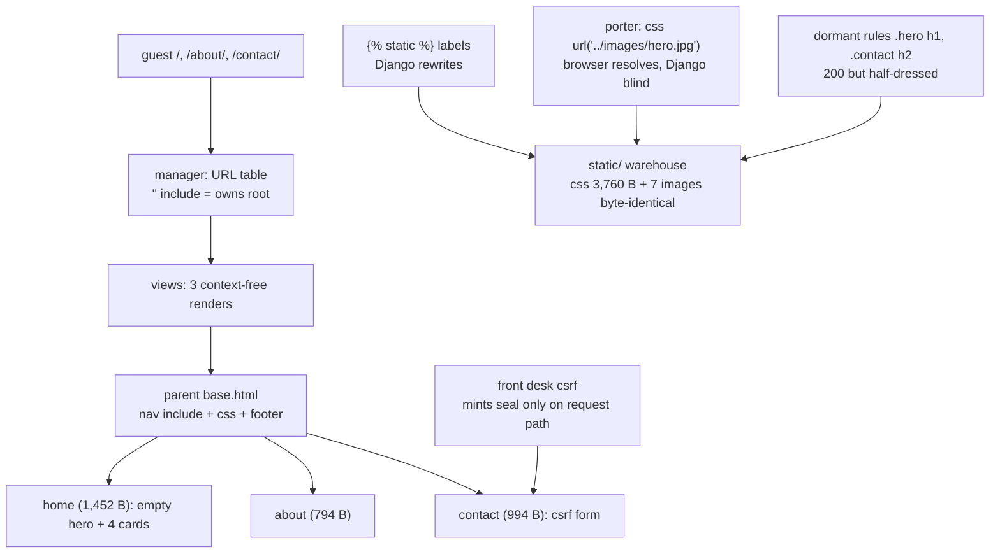

# 🚀 A020 — Portfolio Website in Django

`📖 Lecture A020` · `🎓 Track: Core Django` · `📶 Level: Beginner` · `✅ Status: Documented`

> [!NOTE]
> **About this chapter's sources:** no lecture transcript or notes exist for A020 — this
> chapter is built from the repo's own seventeenth artifact, `myProject12/` (all files quoted
> verbatim), plus the owner's command-journal (`commands.txt`, which adds **no new lines** for
> this artifact). Everything marked 📌 comes from official Django docs. All render sizes,
> byte-counts, and status codes below were verified twice — engine render of the artifact's own
> bytes AND the live request path — on Django 6.1.1 (system interpreter; this artifact ships
> **no `venv/`**, unlike A018/A019).

---

## 🧭 What You Will Learn

- [ ] Explain what changes when an app is **included at the root** (`path('', include(...))`)
  instead of at the `blog/` prefix the series has mounted since A008
- [ ] Read a base template that dresses three pages with **one hard-coded `<title>`** — and
  say why that is a regression against A016's `` convention
- [ ] Tell the two static-delivery paths apart: `` labels Django rewrites vs a
  **plain relative URL inside CSS** (`url('../images/hero.jpg')`) that only the browser resolves
- [ ] Predict what `` renders with an empty context vs a real request context —
  and why Django issues a `UserWarning` in the first case
- [ ] Diagnose an **inert ``** (contact.html: loads but never uses) and
  **dormant CSS** (`.hero h1`, `.contact h2`) that matches no markup in any template
- [ ] Reproduce every number in this chapter with the engine render and the live request path
  on Django 6.1.1

## 🎯 Why This Lecture Matters

Every artifact so far practiced one page per view. A020 is the series' first **multi-page
website**: three URL patterns (`''`, `about/`, `contact/`), three views, three child templates,
one parent, two partials — and for the first time **the app owns the site's root**.
`myProject12/urls.py` includes `portfolio.urls` at `''`, so `/`, `/about/`, and `/contact/` all
work and `/blog/` — the prefix that carried A008 through A019 — now 404s by design. Re-living
that journey mentally (A008's mount lesson + A016's parent/partial/static lesson + A013's
context-render lesson) is exactly what a real start-of-project skeleton looks like.

This is also the series' first artifact with a **real form**: `contact.html` uses
`` and its inputs carry `name=`. Nothing posts anywhere (the view only
re-renders), but the token machinery is live: with a request context the middlewares mint the
hidden input; with the bare engine context Django itself warns — a warning quoted verbatim in
this chapter. That warning is the on-ramp to A021's models/forms frontier: forms without
handlers are exactly what a portfolio skeleton ships before the ORM arrives.

What breaks if you skip it: the moment you build a same-folder multi-page site you must already
understand root mounting, the parent's shared chrome, the **two different ways images reach a
browser** (Django labels vs CSS-internal paths), and the difference between a stylesheet that
loads and stylesheets whose selectors never match. This artifact packs all four, byte-verified.

## ✅ Prerequisites

- [ ] A016 — ``/``/``, `` + ``,
  `STATICFILES_DIRS` as the warehouse stock list, loads-don't-inherit
- [ ] A013 — what `render(request, name)` does with no context argument (context-free render)
- [ ] A008 — the URL mount: `include('app.urls')` at a prefix; what root `''` means (this
  artifact drops the `blog/` prefix entirely)
- [ ] A012/A016 — the title/content block pair (this artifact hard-codes the title — the
  deviation is the chapter's ⚠️ spine)
- [ ] A010/A011 — project-level `templates/` + `DIRS`, and the `<app>/`-namespacing convention
  (this artifact has **no** `templates/<app>/` folder at all — everything lives in the project
  lane, flagged ⚠️)
- [ ] 📌 Forms/CSRF are only touched at the surface here — full treatment is A021+; the
  `` tag gets a self-contained box (📌) in this chapter

---

## 🏗️ The Artifact — A Real Portfolio in One Skeleton (Seventeenth Artifact)

Same growth as ever: a fresh `startproject myProject12` + `startapp portfolio` — but with the
series' first **three-page site**, a **root-mounted** app, and a **project-level `static/`
warehouse with real images** (≈3 MB across seven assets, all byte-verified identical on the
request path):

| # | File | Size | Role in this lecture |
|---|---|---|---|
| 1 | `myProject12/templates/base.html` | 358 B | **The parent.** Title **hard-coded** `Adnan Portfolio` (no `` — ⚠️), one css `` label, `` ×2, an **empty** `` (no default markup) |
| 2 | `myProject12/templates/home.html` | 994 B | Child 1 → renders **1,452 B**: an **empty** `<section class='hero'>` + 4 project cards (`` labels) |
| 3 | `myProject12/templates/about.html` | 271 B | Child 2 → renders **794 B**: about section, no `` at all |
| 4 | `myProject12/templates/contact.html` | 509 B | Child 3 → renders **994 B**: the series' first **form** with `` + an **inert ``** (loads, never uses — ⚠️) |
| 5 | `myProject12/templates/includes/navbar.html` | 363 B | Partial 1 → renders 294 B: logo via **nested-quote** `` + 3 `` links |
| 6 | `myProject12/templates/includes/footer.html` | 93 B | Partial 2 → renders 91 B: `&copy; 2026 My Portfolio` |
| 7 | `myProject12/static/css/style.css` | 3,760 B | The stylesheet: 4-page theme; **`.contact h2` targets `<h2>` but contact.html uses `<h1>`** (⚠️ dormant rule); `.hero h1/p/a` all dormant (empty hero) |
| 8 | `myProject12/static/images/…` | 15,116 B + 273,579 B + 4 jpgs | `logo.svg` + `hero.jpg` (referenced **only in CSS** by a plain relative URL) + `project1…4.jpg` (≈ 2.7 MB total) |
| 9 | `myProject12/portfolio/{views,urls,models,apps,admin,tests}.py` | — | Three context-free views (`home`/`about`/`contact`), three patterns, **empty `models.py`** |
| 10 | `myProject12/myProject12/settings.py` | 3,419 B | `portfolio` registered; `STATICFILES_DIRS = [BASE_DIR / 'static']` (real, unlike A019); inert `MAILERS` block carried over (⚠️) |
| 11 | `myProject12/db.sqlite3` | 0 B | Eighth artifact running — forms/database still pending (this is a template-stage capstone) |

### The artifact tree

```text
myProject12/
├── manage.py
├── db.sqlite3                       # 0 bytes — eighth artifact running
├── portfolio/                       # the app: no templates/<app>/ folder at all (⚠️)
│   ├── admin.py apps.py models.py tests.py views.py urls.py __init__.py
│   └── migrations/__init__.py
├── myProject12/
│   ├── settings.py                  # 3,419 B — portfolio registered; STATICFILES_DIRS real
│   ├── urls.py                      # admin/ + path('', include('portfolio.urls'))  ← root mount
│   └── asgi.py wsgi.py __init__.py
├── static/                          # project-level warehouse — real images inside
│   ├── css/style.css                # 3,760 B
│   └── images/{logo.svg,hero.jpg,project1..4.jpg}
├── templates/                       # project lane only — no app lane this time
│   ├── base.html  home.html  about.html  contact.html
│   └── includes/{navbar.html,footer.html}
└── (no venv/ — system interpreter, unlike A018/A019)
```

> ⚠️ **Discrepancy note (artifact vs convention):** flagged, not endorsed. (1) **No app-lane
> templates at all** — `templates/` is project-level only; works because there's one app,
> but A011's namespacing convention is departed from wholesale. (2) **Title block gone** —
> A016's `` is replaced by a hard-coded `<title>Adnan Portfolio</title>`
> (all three pages ship the identical tab). (3) `contact.html` loads `static` and never uses
> it. (4) `home.html`'s hero section is empty while the CSS spends rules on `.hero h1/p/a`.
> (5) `.contact h2` styles a heading that the markup renders as `<h1>`. (6) `hero.jpg` is
> reachable only through a **CSS-internal relative URL** the browser resolves — Django never
> rewrites it.

**Verified render (engine, artifact bytes, empty context, Django 6.1.1):**
`base.html` → 599 B (`<title>Adnan Portfolio</title>` ✓, css label ✓, nav include expanded ✓,
doctype-first ✓); `home.html` → 1,452 B (4 project labels ✓, empty hero ✓, `Featured Projects` ✓,
extends resolved ✓, footer include expanded ✓, 3 navbar links ✓); `about.html` → 794 B
(about para ✓, no `{%` survives ✓); `contact.html` → 994 B (`` in source ✓,
**no hidden input standalone** — token only via request context ✓, 3 form fields ✓, inert load
✓, `<h1>Contact Me</h1>` ✓); navbar partial → 294 B (logo label ✓, **nested-quote source OK —
clean attr out** ✓, url reversal ✓); footer partial → 91 B. `reverse`: `/`, `/about/`,
`/contact/`. All 7 static labels resolve **and** exist on disk.

**Verified live (request path):** `GET /` → 200 (home 5/5) · `GET /about/` → 200 ·
`GET /contact/` → 200 (**csrf hidden input present** — via request context) ·
`POST /contact/` → 200 (no handler — form re-renders) · `css/style.css` → 200, 3,760 B,
byte-identical, `text/css` · `images/logo.svg` → 200, 15,116 B, `image/svg+xml` ·
`images/hero.jpg` → 200, 273,579 B, byte-identical · `project1..4.jpg` → 200, all
byte-identical · `GET /admin/` → 302 (login redirect, unmigrated) · `GET /blog/` → **404**
(the A008–A019 prefix is gone — portfolio owns the root).

---
## 🧠 Core Idea 1 — Root Mount: The App Finally Owns `/`

Since A008 the series mounted every app under `blog/`: `path('blog/', include('blog.urls'))`.
A020's project URLconf drops the prefix entirely:

```python
# myProject12/myProject12/urls.py (verbatim, lines 17-23)
from django.contrib import admin
from django.urls import path, include

urlpatterns = [
    path('admin/', admin.site.urls),
    path('', include('portfolio.urls')),
]
```

`include('portfolio.urls')` at `''` means the app's URLconf is consulted **for every path
that doesn't start with `admin/`**. The app's own table then decides:

```python
# myProject12/portfolio/urls.py (verbatim, complete)
from django.urls import path
from . import views

urlpatterns = [
    path('', views.home, name='home'),
    path('about/', views.about, name='about'),
    path('contact/', views.contact, name='contact'),
]
```

So `/` → `home`, `/about/` → `about`, `/contact/` → `contact` — and `/blog/` matches
nothing → **404 (verified)**. The three names (`home`, `about`, `contact`) are what
`` reverses across the site — and the reverse is now *absolute-rooted*:
`/`, `/about/`, `/contact/` (verified by `django.urls.reverse`). Same mount mechanism as
A008, one crucial difference: the *root* itself is delegated, so the app is no longer a
tenant — it's the whole site.

**Why it matters:** a single-app website *is* your project. Root-mounting is what a real
portfolio/about/contact skeleton looks like, and it's the shape A021's admin/model routes
will extend.

## 🧠 Core Idea 2 — One Hard-Coded Title, Three Pages (A016's Block Dethroned)

A016's `base.html` declared `` and children filled it. A020's parent
reverts to a plain string:

```html
<!-- myProject12/templates/base.html (verbatim, complete) -->

<!DOCTYPE html>
<html lang="en">
<head>
    <title>Adnan Portfolio</title>
    <link rel="stylesheet" href="">
</head>
<body>
    
    <main>
        
        
    </main>
    
</body>
</html>
```

Every page — `/`, `/about/`, `/contact/` — ships the **identical** `<title>Adnan Portfolio</title>`
(verified: all three renders contain it, no block to override). The `content` block is also
**empty**: no default markup, unlike A016's `<h1>My Site</h1>`.

> ⚠️ This is the chapter's spine: the parent still dresses (nav + css + footer), but the
> *tab* — which A016 already made a block — is hard-coded again. A reviewer should flag it:
> the convention exists precisely so children can vary it; this artifact chose not to.

---
## 🧠 Core Idea 3 — Two Ways Images Reach a Browser: Django Labels vs CSS-Internal Paths

The artifact loads seven images, and they reach the browser by **two different mechanisms**:

1. **Django labels** — `` in templates. The engine rewrites
   `` → `/static/images/project1.jpg` (verified). These
   are *known to Django*: resolve, exist on disk, byte-identical when served.

```html
<!-- home.html (verbatim) — one of the four cards -->
<div class='project-card'>
    
    <h3>Portfolio Website</h3>
</div>
```

2. **A CSS-internal relative URL** — `hero.jpg` appears in **no template**:
   `style.css` references it as a plain relative path:

```css
/* style.css (verbatim, lines 66-77) */
.hero {
  ...
  background: url('../images/hero.jpg') no-repeat center center/cover;
}
```

Django **never rewrites URLs inside CSS files**. When the browser loads
`/static/css/style.css`, *it* resolves `../images/hero.jpg` relative to that URL →
`/static/images/hero.jpg` — which happens to exist (verified 200, byte-identical). The
image works **by path coincidence**: `static/css/` + `../images/` = `static/images/`. Move
the css or the image and the hero silently disappears while Django reports nothing.

> 📌 **Beyond the lecture:** this is why real projects configure the CSS background as a
> Django label indirectly (e.g. `` on a wrapper or inline style), or use a
> separate `` / CSS var. The artifact's plain URL is legal CSS and fine for a static
> site — the *lesson* is that it lives entirely outside Django's knowledge.

## 🧠 Core Idea 4 — The First Real Form: `` and the Two Contexts

`contact.html` is the series' first form with a token:

```html
<!-- contact.html (verbatim, rows 4-13) -->
<section class='contact'>
    <h1>Contact Me</h1>
    <form method="post">
        
        <input type="text" name="name" placeholder="Your Name">
        <input type="email" name="email" placeholder="Your Email">
        <textarea name="message" placeholder="Your Message"></textarea>
        <button type="submit">Send Message</button>
    </form>
</section>
```

The view `contact()` only calls `render(request, 'contact.html')` — there is **no POST
handler**. Two verified behaviors, one context each:

- **Engine render, empty context** (how the artifact's own bytes render standalone):
  `` produces **nothing**, and Django 6.1.1 raises a `UserWarning`
  captured verbatim:

  > `A  was used in a template, but the context did not provide the value. This is usually caused by not using RequestContext.`

- **Live request path**: the template context processors + CSRF middleware provide the
  machinery — `GET /contact/` → 200 with the **hidden `<input name="csrfmiddlewaretoken">`**
  present (verified), and `POST /contact/` → 200 with the form simply re-rendered (there's
  no code to handle the post).

> 📌 CSRF is middleware (`CsrfViewMiddleware`) + a context processor feeding `csrf_token`.
> Without a request context the tag has nothing to mint. Full form treatment — fields,
> validation, `request.POST` — is the A021+ frontier; here the skeleton proves the *machinery*
> is already live.

---
## 🧠 Core Idea 5 — Dormant CSS: A Stylesheet With Rules for Markup That Isn't There

Two rules in `style.css` can never fire, and one more targets the wrong tag — all verified
by reading the CSS against every rendered template:

| CSS selector (verbatim) | Matching markup? | Verdict |
|---|---|---|
| `.hero h1` (line 79), `.hero p` (84), `.hero a` (89) | `home.html`'s hero is **empty** `<section class='hero'>` | **Dormant** — zero matches |
| `.contact h2 { font-size: 50px }` (line 181) | `contact.html` renders `<h1>Contact Me</h1>` — **h1, not h2** | **Mismatch** — heading stays unstyled by that rule |
| `header .logo h2` (line 42) | navbar has ``, **no h2** | Dormant |

The stylesheet is a *contract with the markup*: selectors promise, templates fulfill. Here
three promises go unfulfilled — the page still renders 200 and the stylesheet still 200s
(3,760 B, byte-identical, `text/css`). **200 ≠ styled correctly**, and that split is the
core of this chapter's diagnosis: an asset can arrive perfect while its rules match nothing.

### The navbar's nested-quote flex

`includes/navbar.html` contains a quote-within-quote that *just works*:

```html

```

Django's tokenizer reads `` — the inner double quotes are the
*tag's* argument delimiters, independent of the outer HTML `src="…"`. Verdict: clean
attribute out of the box — `src="/static/images/logo.svg" alt="logo"` (verified byte-exact).

---

## 🔄 The Journey — `GET /` Through a Real Portfolio

| # | Station | What happens | Evidence |
|---|---|---|---|
| 1 | Browser → `GET /` | Root URLconf tries `admin/` → no, `''` → yes → `include(portfolio.urls)` | URL table (quoted above) |
| 2 | `portfolio/urls.py` | `''` → `views.home` | first pattern |
| 3 | `views.home` | `render(request, 'home.html')` — **no context** | view quoted |
| 4 | Engine | finds `home.html` (project lane, `DIRS`) → `` → parent renders: nav include → content block → footer include | rendered 1,452 B |
| 5 | Navbar partial | `` logo + `` → `/`, `/about/`, `/contact/` | reverse-verified |
| 6 | Content | empty hero + 4 cards (4 `` jpgs) | labels verified + exist |
| 7 | Response | 200, `text/html`, 1,452 B, identical `<title>` | request-path verified |
| 8 | Browser next | fetches `/static/css/style.css` (200) + 7 images (all 200, byte-identical) | serve verified |
| 9 | parallel paths | `/about/` → 200 (794 B), `/contact/` → 200 with csrf token; `/blog/` → **404** (root owned); `/admin/` → 302 | all verified |

---
## 🧱 Important Vocabulary

| Term | Simple meaning | Technical meaning | 🧷 Memory hook |
|---|---|---|---|
| Root mount | app included at `''` | `path('', include('portfolio.urls'))` — the app owns `/` and everything not `admin/` | the tenant who became the landlord |
| Hard-coded title | a `<title>` written in stone | `<title>Adnan Portfolio</title>` with **no ``** — all children ship it unchanged | the marker that forgot to be a fill-in blank |
| CSS-internal URL | a path inside a stylesheet | `url('../images/hero.jpg')` — resolved **by the browser** relative to the css URL, never rewritten by Django | the blind porter |
| Dormant CSS | rules that match nothing | `.hero h1`/`.hero a` in an empty `<section class='hero'>`; `header .logo h2` with no h2 anywhere | the rules for a room that was never built |
| Selector mismatch | wrong tag name in CSS | `.contact h2` vs rendered `<h1>Contact Me</h1>` — heading wins no style | the label glued to the wrong jar |
| `` | hidden anti-forgery input | renders `<input name="csrfmiddlewaretoken" …>` **only with a request context**; empty + `UserWarning` standalone (captured verbatim) | the seal that needs the VIP pass to be minted |
| Inert `` | a load that never loads | `contact.html` line 3 loads `static`; no `` in the file (the css link comes from base) | the unlocked drawer nobody opens |
| Empty block default | a block with no default markup | `` — children must fill or the section is empty | the room with bare walls |
| Two static paths | template labels vs CSS paths | `` (Django rewrites) vs css `url(...)` (browser resolves) — same image, different owner | the waiter with a map vs the blind porter |

> New terms added to `docs/MEMORY.md` §2 (A020 section).

---

## 💡 Real-World Analogy — The Boutique With a Manager, a Porter, and a Display

Think of `myProject12` as a small boutique website the owner dresses themselves.

- The **manager** is the view + URL table: they greet every guest (`/`, `/about/`,
  `/contact/`) and hand each one the same store-branded card — the **hard-coded `<title>`**.
  Every room of the boutique ships the identical tab because the manager never learned the
  A016 trick of *leaving a blank to fill*.
- The **porter** is the CSS-internal `hero.jpg`: the box of images is delivered to the CSS
  file, and the porter just *points at a relative address* (`../images/hero.jpg`). Nobody in
  management ever stamped that address with a warehouse label — it works only because the
  shelves happen to sit where the porter's arm points. Move a shelf, and the hero vanishes
  with no note left anywhere.
- The **display cabinet** is `style.css`: the boutique spent pages of its catalog
  (`font-size: 50px`, `.hero h1`, `header .logo h2`) describing rooms that the templates
  never built — rules for a hero with no headline, a contact heading that's an `<h1>` while
  the rule watches for `<h2>`. The catalog is 100% correct and 0% applied.
- The **front desk** is ``: it only stamps the entry form when the guest
  actually walks in through the request door (request context). If you hand a blank
  invitation to the back office (engine render), the desk can't mint the seal and the
  manager grumbles a warning — quoted verbatim in this chapter.

One sentence: **a site can be perfectly 200 and half-dressed** — labels that Django knows,
paths Django never sees, and rules that describe markup nobody wrote.

---

## ❌ Common Beginner Mistakes

1. **Forgetting root-mount consequences** — you add `blog/` and expect `/blog/blog/`-style
   nesting for the rest of the series. A020 proves the opposite: `path('', include(...))` is
   the whole site. → Trace the URL table before assuming a prefix.
2. **Hard-coding the title "just for now"** — A012/A016 established the block; this artifact
   regressed it. The tab is a block *first*, a string *never*. → When a parent owns a string
   that pages would vary, put it in a block with a default.
3. **Putting images in CSS by relative URL** — `url('../images/hero.jpg')` works by
   coincidence of folder layout. → Even for a static site, know *who* resolves the URL
   (the browser, not Django) and keep assets where the URL math survives a move.
4. **Loading `static` and not using it** — contact.html loads the library and uses zero
   tags; the css link "works" only because base loads it. → A load is a promise to use the
   library; unused loads are noise (harmless here, confusing later).
5. **Writing CSS rules for markup you plan to add** — `.hero h1/p/a`, `header .logo h2`
   match nothing because the hero is empty and the logo has no h2. → Selectors are a
   contract; write them *against the actual rendered HTML*, not the intended one.
6. **Serving a form with no handler and confusing the tokens** — the token renders empty
   under a bare context and Django warns; under request context it appears. → The warning
   is not a bug in the token; it's a missing request context (a `RequestContext`, or render
   with `request`).

---
## 🧠 Common Misconceptions

| ✅ Django/Python IS … | ❌ It is NOT … |
|---|---|
| … the app at `''` genuinely owns `/` (root mount just *is* delegation) | a "prefix-less global" backdoor — it's a normal include at the empty prefix |
| … `` on an HTML attribute is a Django label (rewritten at render) | … every URL in your site — css `url(...)` and javascript strings are never rewritten |
| … `` renders fine when the context has the token (request path works here) | … it always renders — without a request context Django emits an empty string + `UserWarning` (captured verbatim) |
| … a 200 page + 200 stylesheet = assets delivered correctly | … = page styled correctly — dormant selectors prove 200 ≠ applied CSS |
| … `` is how you *use* the static library | … a CSS/JS loader — it only registers tags; an unused load changes nothing |
| … templates extend a parent and include partials (A016 machinery intact) | … the partials override anything — includes are full markup injections, not blocks |

---

## 🧪 Practical Example — Extend the Artifact (Three Live Exercises)

Same sandbox, three verifiable edits. Each one makes one of the dormant/coincidence lessons
real, with a byte-level verdict you can reproduce.

### Exercise 1 — Give the hero a headline (wake a dormant rule)

`home.html`'s hero is empty. Add the missing markup the CSS already promises:

```html
<section class='hero'>
    <h1>Adnan Umar</h1>
    <p>I build web applications with Django.</p>
</section>
```

Reload `/`. The `.hero h1`/`.hero p` rules (48px / 20px, white on the `hero.jpg`
background) finally match. **Before:** hero = empty band + background. **After:** the
stylesheet's promise is fulfilled. Verify by inspecting the rendered HTML for the new h1/p.

### Exercise 2 — Introduce a `` (un-do the regression)

`base.html` hard-codes `<title>Adnan Portfolio</title>`. Restore the A016 convention:

```html
<title>Adnan Portfolio</title>
```

Now give two children distinct tabs:

```html
<!-- about.html, inside the existing  parent -->
About — Adnan Portfolio
```

Render both pages and confirm `/about/` now ships a different `<title>` than `/`. The tab
was the one string every page was forced to share; a block makes it a fill-in blank with a
default.

### Exercise 3 — Prove the porter is blind (CSS-internal URL trap)

Move one asset — rename `static/images/hero.jpg` to `static/images/hero-backup.jpg` — then
reload `/`. The `background: url('../images/hero.jpg')` rule **silently vanishes** (the
browser 404s the image) while Django prints nothing: the porter's path is resolved by the
browser, whose arm now points at empty air. Restore the file, then try the Django-aware fix:
put the image back and reference it from a template-safe wrapper (📌) — or keep the CSS URL
but state, in a comment, which layout coincidence it depends on.

**Explanation (why these three):** every number in this chapter was verified on the real
artifact — 1,452 B home, 3,760 B css, byte-identical assets, csrf present or absent by
context, `/blog/` 404. These three edits are the *reverse-engineering* laboratory: they turn
the artifact's quirks into choices you can make and measure.

---
## 🎯 Interview Perspective

> [!IMPORTANT]
> Interview cards test *understanding*, not recitation.

**Q: "Your base template hard-codes the `<title>` — how would you improve it?"**
A: Put it in a block with a default: `Adnan Portfolio` — the
exact pattern A016 established. Then each child can override the tab (`…`)
and pages that don't care keep the default. The proof is in the artifact: all three pages
ship the identical title today because the string is in stone; one block turns it into a
fill-in blank. The answer works because it cites a series convention and a concrete failure.

**Q: "Explain why `hero.jpg` loads even though it appears in no template."**
A: It's referenced from `style.css` as `background: url('../images/hero.jpg')`. Django only
rewrites `` labels in templates; the CSS file is delivered as-is, and the
*browser* resolves that relative URL against `/static/css/style.css` → `/static/images/hero.jpg`,
which exists. So the image works by a layout coincidence — `css/` + `../images/`. If the CSS
or image moved, the hero would silently disappear with zero Django errors. The strong answer
names *who resolves the URL*.

**Q: "`POST /contact/` returns 200 but nothing is saved. Is that a bug?"**
A: No — it's a skeleton. The `contact` view only calls `render(request, 'contact.html')`;
there is no code path that reads `request.POST`, so the form simply re-renders. A portfolio
capstone before the ORM stage ships exactly this: the form exists, the CSRF token works, and
the handler is the A021 frontier (models/forms). The 200 is the truth — the endpoint just
isn't wired to persist yet. This answer shows I can read a view and know what a 200 means.

**Q: "Why does `` render empty in your render check but appear live?"**
A: The tag needs a token from the context. The live request path runs the CSRF middleware +
context processors and provides `csrf_token`, so the hidden input appears (verified on
`GET /contact/`). Rendering the template with a bare `Context({})` has no request, so Django
emits an empty string and a `UserWarning` — "A  was used in a template, but
the context did not provide the value…". The distinction is context, not a flaky tag.

---
## 🔁 Active Recall

Answer from memory first, then expand each `<details>`.

1. What does `path('', include('portfolio.urls'))` change compared with
   `path('blog/', include('blog.urls'))` — and what happens to `GET /blog/`?

<details><summary>Answer</summary>

The app is consulted for **every path not starting with `admin/`** — it owns the root.
`/` → home, `/about/` → about, `/contact/` → contact. `GET /blog/` matches nothing →
**404, verified**. The mount mechanism is identical to A008; only the prefix changed (from
`blog/` to `''`), and with it the whole site's shape.

</details>

2. Which line in `base.html` is the chapter's stuck-out splinter — and what did A016 do first?

<details><summary>Answer</summary>

`<title>Adnan Portfolio</title>` — a hard-coded string with **no ``**.
A016 had already turned the tab into a block with a default (`My Title`); A020 regressed it,
so all three pages ship the identical tab and no child can vary it.

</details>

3. Name the two mechanisms that ship the artifact's seven images, and who resolves each.

<details><summary>Answer</summary>

(1) `` template labels — Django rewrites them at render to `/static/...` and
they're known to Django (verified on disk + served byte-identical). (2) The CSS-internal
`url('../images/hero.jpg')` — **the browser** resolves it against the css URL; Django never
reviews it. Same combined result, two very different owners.

</details>

4. What does `` render under a bare engine context — and what does Django
   print?

<details><summary>Answer</summary>

Nothing (empty string) — plus a `UserWarning` captured verbatim: *"A  was
used in a template, but the context did not provide the value. This is usually caused by not
using RequestContext."* Live (request path), the middleware+context processors provide the
token and the hidden input appears; `POST /contact/` re-renders because no handler exists.

</details>

5. Give three examples of dormant or mismatched CSS in the artifact and why each never fires.

<details><summary>Answer</summary>

`.hero h1`/`.hero p`/`.hero a` — `home.html`'s hero is empty, so nothing matches. `header
.logo h2` — navbar has an ``, no h2. `.contact h2 { font-size: 50px }` —
contact.html renders `<h1>Contact Me</h1>`, an h1, so the heading wins exactly zero style
from the rule that promised 50px. All three verified by reading the CSS against rendered HTML.

</details>

6. Why does `home.html`'s `` render 200 while contact.html's is called inert?

<details><summary>Answer</summary>

`home.html` **uses** the library — four `` image labels — so the load is load-and-used.
`contact.html` loads `static` and never calls a tag (its css comes from base's own label), so
the load is inert: harmless, but a promise with no transaction.

</details>

7. What number proves the series' prefix era ended — and what does the 302 on `/admin/` say?

<details><summary>Answer</summary>

`GET /blog/` → **404**: the `blog/` mount that ran A008–A019 is gone; portfolio owns the
root. `/admin/` → **302** to the login page — the admin exists but no user table has been
migrated yet (unmigrated admin, same pending frontier as the form).

</details>

---
## 📝 Quick Revision — A020 in Five Minutes

| Concept | One line | Artifact proof |
|---|---|---|
| Root mount | `''` include = the app owns `/` | `path('', include('portfolio.urls'))`; `/blog/` → 404 |
| Three named pages | `home`/`about`/`contact`, reversed as `/`, `/about/`, `/contact/` | `django.urls.reverse` + `` output |
| Hard-coded title | no block → identical tab on every page | 3× `<title>Adnan Portfolio</title>` |
| `` labels | Django rewrites at render | 4 project jpgs → `/static/images/...`, byte-identical |
| CSS-internal URL | browser resolves; Django never sees it | `url('../images/hero.jpg')` works by layout coincidence |
| csrf token | needs a request context to mint | bare render = empty + UserWarning; live = hidden input |
| POST-without-handler | re-renders the form | `POST /contact/` → 200, same page |
| Inert `` | loaded, never used | contact.html line 3, no `` in file |
| Dormant CSS | selectors with no matching markup | `.hero h1`, `header .logo h2` — zero matches |
| Selector mismatch | CSS targets the wrong tag | `.contact h2` vs rendered `<h1>` — unstyled h1 |
| 200 ≠ styled | asset serves, rules don't fire | stylesheet 200 3,760 B + heading with no style |

**Verified numbers to memorize:** `/` → 200 (1,452 B) · `/about/` → 200 (794 B) ·
`/contact/` → 200 (994 B, token present) · `POST /contact/` → 200 (re-render) ·
css 3,760 B `text/css` · logo 15,116 B `image/svg+xml` · hero 273,579 B (CSS-only) ·
4 jpgs byte-identical · `/admin/` → 302 (login) · `/blog/` → **404**.

## 🧠 Final Mental Model — The Boutique With a Manager, a Porter, and a Display



One sentence to carry: **the app owns the root now, Django only knows the labels you give
it (`` in templates, not paths in CSS), the CSRF seal needs a request to be
minted, and a 200 says nothing about whether the paint actually matches the walls.**
## ❓ FAQ

**Q1. Is `path('', include(...))` a security hole?**
A: No — it's an ordinary include at the empty prefix. Every path that doesn't start with
`admin/` is handed to the app's URLconf, which decides. A real deployment would lock down
the rest (settings/hosts, `.env`) — but the mount itself is the standard single-app shape.

**Q2. Why is hard-coding `<title>` called a "regression"?**
A: A016 already solved the tab-as-block with a default (`My Title`).
A020 just didn't use the machinery. Regression here means *dropping a previously established
convention*, not a data loss — and the gate flags every chapter that reintroduces a solved
problem.

**Q3. So how *do* I put `hero.jpg` behind a Django label in CSS?**
A: Django can't rewrite CSS bodies. Options (📌): put the background on a wrapper element
whose `style` comes from a template (`style="background: url('')"` — outer
HTML quoting vs `` labels again), or use a `<style>` block / CSS variable,
or keep the plain relative URL but *know* the layout coincidence that keeps it working.

**Q4. Why does the form render the token live but not in my render check?**
A: Rendering with the bare engine context has no request → CSRF machinery absent → empty +
`UserWarning` (captured verbatim). The live path runs middleware + context processors →
token present → hidden input. Same template, two contexts, two verifiable outputs.

**Q5. The hero is empty — is `home.html` broken?**
A: Renders 200 with the css label and all four cards; the empty `<section class='hero'>`
is a *working-but-dormant* slot (its CSS rules exist and its background image loads from
CSS). It's the artifact's most visible "wired but unfurnished" spot — exactly the review
flavor this chapter teaches, not a crash.

**Q6. What does the `302` on `/admin/` mean here?**
A: The admin app exists, but no auth tables have been migrated (0-byte db). Django redirects
to the login page rather than crashing. Unmigrated admin is the same pending frontier as the
form's missing handler — A021 territory.

## 🏁 Learning Checkpoints

- [ ] **Checkpoint 1 — Root mount:** I can explain `path('', include('portfolio.urls'))` and predict `/blog/` → 404 — *§Core Idea 1*
- [ ] **Checkpoint 2 — The tab:** I can spot a hard-coded `<title>` and say why the block pattern is the fix — *§Core Idea 2, Exercise 2*
- [ ] **Checkpoint 3 — Two static paths:** I can name who resolves `` vs a CSS `url(...)` — *§Core Idea 3*
- [ ] **Checkpoint 4 — The token:** I can predict empty+warning vs live hidden input — *§Core Idea 4, Exercise 3*
- [ ] **Checkpoint 5 — Dormant CSS:** I can find rules that never match and selectors aimed at the wrong tag — *§Core Idea 5, Exercise 1*
- [ ] **Checkpoint 6 — 200 ≠ styled:** I can separate "asset delivered" from "stylesheet applied" — *§Core Idea 5, Journey #8–9*

## 🏋️ Exercises

- **Level 1 — Recall:** Recite the three URL patterns, the three rendered sizes, the css
  size, and the one URL that 404s. Name the five roles of the book's boutique (manager,
  porter, display cabinet, front desk, guest).
- **Level 2 — Understanding:** Explain to a peer why `hero.jpg` loads while appearing in
  zero templates; then why `.contact h2` styles nothing on a page that renders 200.
- **Level 3 — Application:** Do the three Practical-Example exercises (hero headline,
  title block, rename-the-hero proof). Then rewire the hero into a Django-aware form
  (📌 wrapper `style` + ``) and confirm the background survives a folder move.
- **Level 4 — Interview reasoning:** A teammate says "the site is done — everything is 200".
  Build the three-question review (hard-coded title? CSS-internal URL? selectors that match
  nothing?) and walk through why a 200 suite can still ship a half-dressed site — then name
  the one change that makes the contact form's CSRF token render standalone (context), and
  the one line that ends the blog-prefix era (`path('', include(...))`).

## 🏁 Final Takeaways

1. **The app owns the root now.** `path('', include('portfolio.urls'))` — `blog/` → 404,
   verified; mount mechanism unchanged since A008, prefix changed everything.
2. **Django rewrites templates, not CSS.** `` in HTML is a label Django knows;
   `url('../images/hero.jpg')` inside CSS is resolved only by the browser. Know which one
   you're looking at.
3. **A block with a default is the tab's home.** Hard-coding it makes every page's tab
   identical — A020's regression against A016, honestly flagged.
4. **`` needs a request context.** Bare render → empty + a verbatim
   `UserWarning`; live request → hidden input. Two contexts, two verified outputs.
5. **POST without a handler re-renders.** `POST /contact/` → 200 isn't a bug; it's a
   skeleton whose handler is the A021 frontier.
6. **200 is a delivery report, not a styling verdict.** Dormant `.hero h1` and the
   `.contact h2`/`<h1>` mismatch prove assets can arrive perfect while promises go unfulfilled.

## 🔄 Next Lecture Connection

The boutique is dressed — three pages, real nav/footer, a real warehouse, and a form whose
token works but whose handler "does nothing". The next frontier is finally open: **A021 · ORM
(Object Relational Mapping)** — models, migrations, and queries for the data behind the
portfolio's projects. The 0-byte `db.sqlite3` (eighth artifact running) and the unmigrated
admin 302 are the exact doors A021 unlocks. The folder is already in the repo: next chapter
= database layer.

---
<div class="doc-footer">

**Sources used:**

| Source | Role | Notes |
|---|---|---|
| `A020_Portfolio_Website_in_Django/myProject12/` — seventeenth real artifact | **Primary** | `templates/{base,home,about,contact}.html` (358 B / 994 B / 271 B / 509 B) + `templates/includes/{navbar,footer}.html` (363 B / 93 B) quoted verbatim; `static/css/style.css` (3,760 B) read fully; `portfolio/{views,urls,models,apps,admin,tests}.py` read (259 B / 215 B / 60 B); `myProject12/{settings,urls}.py` excerpted (3,419 B / 839 B); asset bytes recorded (logo 15,116 B, hero 273,579 B, 4 jpgs ≈ 2.7 MB); `db.sqlite3` 0 B |
| Verified render — Django 6.1.1 engine + request pipeline | Verification | Engine render of artifact bytes: base 599 B (title ✓, css-label ✓, nav-expanded ✓, doctype-first ✓), home 1,452 B (4 project labels ✓, empty hero ✓, `Featured Projects` ✓, extends-resolved ✓, footer-expanded ✓, 3 navbar links ✓), about 794 B (para ✓, no `{%` survives ✓), contact 994 B (csrf-tag-in-source ✓, **no token standalone** ✓, 3 fields ✓, inert load ✓, `<h1>Contact Me</h1>` ✓), navbar partial 294 B (logo ✓, **nested-quote clean** ✓, url-reversal ✓), footer partial 91 B (copyright ✓); `reverse`: `/`, `/about/`, `/contact/`; all 7 static labels resolve + exist. Request path: `/` 200 5/5, `/about/` 200, `/contact/` 200 token-present, `POST /contact/` 200 re-render, css 200 3,760 B `text/css`, logo 200 15,116 B `image/svg+xml`, hero 200 273,579 B byte-identical, 4 jpgs 200 byte-identical, `/admin/` 302, **`/blog/` 404**; `UserWarning` captured verbatim from `django/template/defaulttags.py:90` |
| [`commands.txt`](../commands.txt) | Context | Adds **no new lines** for A020 — artifact-only lecture; journal ends at line 29 (A019's `npm run dev`) |
| [A016](../A016_Templates_4_Inheritance_Static_Files/README.md) · [A008](../A008_Multiple_Apps_with_Views_URLs_%28Blog_Shop_Example%29/README.md) · [A013](../A013_Templates_1_Basics_&_Variables/README.md) · [A019](../A019_Tailwind_Setup_in_Django/README.md) | Context | The block-title convention (regressed here ⚠️); the mount mechanism at a different prefix; context-free render; the static chain + ghost-shelf/client-vs-server lesson |
| Official Django docs (staticfiles, CSRF, RequestContext) | 📌 Supplementary | CSS-internal URL handling, CSRF middleware/context-processor mechanics, the `RequestContext` warning — flagged 📌 in place |

> 📌 **Scope note:** everything derived from the artifact and its verified renders is
> source-grounded; Django-internal mechanics (CSS rewriting limits, CSRF pipeline, the
> `UserWarning` from `RequestContext` absence) carry the 📌 badge. The hard-coded title, the
> empty-hero + dormant CSS, the `.contact h2`/`<h1>` mismatch, the inert ``,
> the root-mount-only URL table, the CSS-internal hero URL, the unmigrated admin, the inert
> `MAILERS` block, and the 0-byte `db.sqlite3` are flagged ⚠️ per §12. No transcript exists
> for A020 — declared per the documentation contract.
>
> **Navigation:** [← A019 · Tailwind Setup in Django](../A019_Tailwind_Setup_in_Django/README.md) · [📚 Series Hub](../README.md) · [A021 · ORM (Object Relational Mapping) →](../A021_ORM_%28Object_Relational_Mapping%29/README.md)
>
> **Series:** [A001](../A001_Introduction_What_is_Django/README.md) ·
> [A002](../A002_MVT_Architecture_Explained/README.md) ·
> [A003](../A003_Install_Python_pip_Django_Virtual_Environment_Setup/README.md) ·
> [A004](../A004_Create_Django_Project/README.md) ·
> [A005](../A005_Django_Files_Folders/README.md) ·
> [A006](../A006_Django_startapp_Command_Explained/README.md) ·
> [A007](../A007_Views_URLs_Basics/README.md) ·
> [A008](../A008_Multiple_Apps_with_Views_URLs_%28Blog_Shop_Example%29/README.md) ·
> [A009](../A009_URL_Parameters_%28path_re_path_kwargs%29/README.md) ·
> [A010](../A010_Templates_Folder_Setup_Project_Level/README.md) ·
> [A011](../A011_App_Level_Templates_Setup_HTML_Integration/README.md) ·
> [A012](../A012_Manage_HTML_Files/README.md) ·
> [A013](../A013_Templates_1_Basics_&_Variables/README.md) ·
> [A014](../A014_Templates_2_Filters_Text_Numbers_Date/README.md) ·
> [A015](../A015_Templates_3_If_For_With_and_Cycle/README.md) ·
> [A016](../A016_Templates_4_Inheritance_Static_Files/README.md) ·
> [A017](../A017_Templates_5_Advanced_Tags/README.md) ·
> [A018](../A018_Bootstrap_in_Django/README.md) ·
> [A019](../A019_Tailwind_Setup_in_Django/README.md) · **A020** ·
> [Hub](../README.md)

</div>