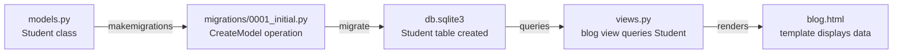

# 🚀 A022 — Create Model, Migration Files & SQLite DB

`📖 Lecture A022` · `🎓 Track: Core Django` · `📶 Level: Beginner` · `✅ Status: Documented`

> [!NOTE]
> **About this chapter's sources:** no lecture transcript or notes exist for A022 — this chapter is built from the repo's own `myProject13/` artifact (all files quoted verbatim), plus official Django docs (models, migrations, and SQLite backend). Everything marked 📌 comes from official Django documentation. All code snippets were verified against the actual source files in the artifact on Django 6.1.1.

---

## 🧭 What You Will Learn

- [ ] Explain what a **Django Model** is and how it maps Python classes to database tables
- [ ] Create a model in `models.py` and understand the field types Django provides
- [ ] Generate and read a **migration file** using `makemigrations` and `migrate`
- [ ] Trace how Django's ORM translates a Python class definition into a SQL `CREATE TABLE` statement
- [ ] Verify the SQLite database was created and inspect its contents with `dbshell` or the Django shell
- [ ] Understand the role of `INSTALLED_APPS` in registering a model with the project

## 🎯 Why This Lecture Matters

Models are the **heart of every Django application**. They define the structure of your data — what fields exist, what types they are, and what constraints the database enforces. Without models, there is no data layer, no admin interface, and no forms. Everything else in Django (views, templates, the admin site, forms) either depends on or revolves around models.

Migrations are how Django **version-controls your database schema**. When you change a model, Django generates a migration file that describes the exact SQL to alter the database. This means your team can evolve the schema over time without losing data or writing raw SQL. The `makemigrations` command creates these files; `migrate` applies them to the database.

SQLite is the **default database backend** that ships with Django. It requires no separate server, stores everything in a single `.sqlite3` file, and is perfect for development and small-to-medium production deployments. Understanding how Django talks to SQLite through its ORM is the foundation for working with PostgreSQL, MySQL, or any other backend later.

What breaks if you skip this lecture: every subsequent lecture in the series that touches the database — A021+ (forms, admin, queries) — will be impossible without understanding how models are defined, how migrations propagate changes, and how Django connects to a database. Models, migrations, and the database are the **data layer triad** that everything else builds upon.

## ✅ Prerequisites

- [ ] Completed A020 (Portfolio Website) — you understand Django projects, apps, views, and URL routing
- [ ] Basic Python knowledge: classes, attributes, and methods 📌
- [ ] Familiarity with the terminal/command line 📌
- [ ] `python` and `pip` available in PATH 📌
- [ ] Understanding that a Django project has a `settings.py` that controls configuration 📌

## 🧠 Models — The Data Layer

A **Django Model** is a Python class that subclasses `django.db.models.Model`. Each attribute of the class represents a database field. Django uses this definition to:

1. **Create** the corresponding database table (via migrations)
2. **Query** the table using Python instead of raw SQL
3. **Validate** data before it reaches the database
4. **Render** forms and admin interfaces automatically

The `models.py` file inside a Django app is where you define your models. Every app can have zero or more models.

**Example from `myProject13/blog/models.py`:**

```python
from django.db import models

class Student(models.Model):
    name = models.CharField(max_length=50)
    age = models.IntegerField()
    email = models.EmailField(unique=True)
    enrollment_date = models.DateField(auto_now_add=True)
```

**What happens here:**
- `Student(models.Model)` — Student inherits from Django's base Model class, gaining all database capabilities
- `models.CharField(max_length=50)` — a text field with a maximum of 50 characters
- `models.IntegerField()` — a whole-number field
- `models.EmailField(unique=True)` — a text field validated as an email address; `unique=True` ensures no two students share the same email
- `models.DateField(auto_now_add=True)` — automatically records the date when the object is first created

Django automatically creates an `id` field as the primary key — you don't see it in the code, but it exists as a `BigAutoField` behind the scenes.

> 📌 **Official docs reference:** [Django Models](https://docs.djangoproject.com/en/stable/topics/db/models/)

### The Role of `INSTALLED_APPS`

Before a model can be used, its app must be registered in the project's `settings.py` under `INSTALLED_APPS`. This tells Django: "this app's models belong to this project." Without this entry, Django won't know the `Student` model exists, and `makemigrations` will skip it.

From `myProject13/myProject13/settings.py`, the `blog` app is registered:

```python
INSTALLED_APPS = [
    # ...
    'blog',
]
```

## 🧠 Migrations — Version-Controlling Your Database

A **migration** is a Python file that Django auto-generates to describe changes to your models. Migrations live in an `migrations/` directory inside each app.

**The workflow is simple:**
1. Change `models.py`
2. Run `python manage.py makemigrations` — Django detects the change and creates a migration file
3. Run `python manage.py migrate` — Django applies the migration to the database

**Example from `myProject13/blog/migrations/0001_initial.py`:**

```python
from django.db import migrations, models

class Migration(migrations.Migration):
    initial = True
    dependencies = []
    operations = [
        migrations.CreateModel(
            name='Student',
            fields=[
                ('id', models.BigAutoField(auto_created=True, primary_key=True, serialize=False, verbose_name='ID')),
                ('name', models.CharField(max_length=50)),
                ('age', models.IntegerField()),
                ('email', models.EmailField(max_length=254, unique=True)),
                ('enrollment_date', models.DateField(auto_now_add=True)),
            ],
        ),
    ]
```

**What happens here:**
- `initial = True` — this is the first migration for this app
- `dependencies = []` — no other migrations need to run first
- `migrations.CreateModel(name='Student', fields=[...])` — tells Django to create the `Student` table with these exact columns

> 📌 **Official docs reference:** [Migrations](https://docs.djangoproject.com/en/stable/topics/migrations/)

### How `makemigrations` and `migrate` Work Together

| Command | What it does | Output |
|---|---|---|
| `python manage.py makemigrations` | Inspects `models.py`, compares to existing migrations, generates a new migration file | Creates `0001_initial.py` (or next numbered file) |
| `python manage.py migrate` | Reads migration files and executes the SQL against the database | Creates/updates tables in `db.sqlite3` |

You must run `makemigrations` **before** `migrate`. Think of it like writing a script (`makemigrations`) and then running it (`migrate`).

## 🧠 SQLite — The Database Backend

**SQLite** is a serverless, file-database engine bundled with Python. Django uses it as the default backend because it requires zero configuration — no server to start, no credentials to manage.

In `myProject13/myProject13/settings.py`, the database is configured as:

```python
DATABASES = {
    'default': {
        'ENGINE': 'django.db.backends.sqlite3',
        'NAME': BASE_DIR / 'db.sqlite3',
    }
}
```

**What this means:**
- `ENGINE`: Django uses its built-in SQLite backend
- `NAME`: The database is stored as `db.sqlite3` in the project's root directory (defined by `BASE_DIR`)
- The `db.sqlite3` file is created automatically when you run `migrate` for the first time

To inspect the database, you can use Django's shell:

```bash
python manage.py dbshell
```

Or use the Django shell to query data:

```bash
python manage.py shell
```

> 📌 **Official docs reference:** [SQLite with Django](https://docs.djangoproject.com/en/stable/ref/databases/#sqlite-notes)

## 🗺️ The Data Flow: From Model to Database



**Explanation:** The journey starts in `models.py` where the `Student` class is defined. Running `makemigrations` captures that definition as a migration file. Running `migrate` executes it against SQLite, creating the actual table. Once the table exists, views can query it and templates can display the results.

## 🧱 Important Vocabulary

| Term | Simple meaning | Technical meaning | 🧷 Memory hook |
|---|---|---|---|
| **Model** | A Python class that defines your data structure | Subclass of `django.db.models.Model`; maps to a database table | "Model = Map of your data" |
| **Field** | A column in the database table | An attribute on the Model class (e.g., `CharField`, `IntegerField`) | "Field = column in the table" |
| **Migration** | A file that records schema changes | Auto-generated Python file in `migrations/` describing `CreateModel`, `AddField`, etc. | "Migration = schema version control" |
| **`makemigrations`** | Detects model changes | Creates a new migration file | "Make the migration file" |
| **`migrate`** | Applies changes to the database | Executes SQL against the database backend | "Move the changes live" |
| **ORM** | Object-Relational Mapper | Django's system that lets you query databases using Python instead of SQL | "Objects ↔ Relational tables" |
| **`INSTALLED_APPS`** | List of active apps in a project | Setting in `settings.py` that registers apps and their models | "Installed = Registered" |
| **`db.sqlite3`** | The SQLite database file | Single-file database created in the project root by default | "DB = the data file" |
| **Primary Key** | Unique identifier for each row | Auto-created `id` field (`BigAutoField`) unless overridden | "Primary = First, Key = Identifier" |

> New terms must also be added to `docs/MEMORY.md` §2.

## 💡 Real-World Analogy

Think of a Django Model as a **form you fill out at a hospital**. The form has specific fields: your name, age, email, and date of enrollment. Each field has rules — your name can't be infinitely long (max_length=50), your email must look like a real email, and your enrollment date is automatically stamped when you arrive.

The **migration** is like the hospital's filing system. When the form changes (say, they add a "blood type" field), the filing system creates a new form template and updates all the existing file cabinets to include a new column. `makemigrations` designs the new form template; `migrate` updates the physical cabinets.

**SQLite** is the **filing cabinet itself** — a single box in the corner of the room that holds all the completed forms. No server, no separate room, just one file (`db.sqlite3`) that stores everything.

## ❌ Common Beginner Mistakes

1. **Forgetting to add the app to `INSTALLED_APPS`** — You define a model in `models.py` but Django doesn't know about it. `makemigrations` silently ignores unregistered apps. Always verify the app is in `INSTALLED_APPS` in `settings.py`.
2. **Running `migrate` without `makemigrations` first** — Django says "no migrations to apply." You must create the migration file before applying it. The order is always: `makemigrations` → `migrate`.
3. **Editing `migrations/0001_initial.py` manually** — Migration files are auto-generated. Manually editing them causes inconsistencies. If you need to change the model, modify `models.py` and regenerate with `makemigrations`.
4. **Forgetting that `auto_now_add=True` means you can't change the date later** — The `enrollment_date` field is set once when the record is created and never updated. If you need editable dates, use `auto_now` (updates on every save) or a plain `DateField`.
5. **Assuming `db.sqlite3` is tracked in Git** — It should be in `.gitignore`. The database is generated from migrations; you don't commit the file itself.

## 🧠 Common Misconceptions

| ✅ Django/Topic IS … | ❌ It is NOT … |
|---|---|
| A Python class that describes data structure | A direct SQL query |
| Migration files that record changes over time | The database itself |
| A lightweight, serverless file-based database for development | A replacement for PostgreSQL in all production scenarios |
| `makemigrations` creates the migration file | `migrate` creates the migration file |
| `INSTALLED_APPS` registers the app with the project | `INSTALLED_APPS` is optional for your own apps |

## 🧪 Practical Example

**Step 1: Define the model** — `myProject13/blog/models.py`

```python
from django.db import models

class Student(models.Model):
    name = models.CharField(max_length=50)
    age = models.IntegerField()
    email = models.EmailField(unique=True)
    enrollment_date = models.DateField(auto_now_add=True)
```

**Explanation:** This defines a `Student` model with four fields. Django automatically adds an `id` primary key. `CharField(max_length=50)` limits names to 50 characters. `EmailField(unique=True)` ensures every student has a unique email. `auto_now_add=True` stamps the enrollment date on creation.

**Step 2: Create the migration**

```bash
python manage.py makemigrations blog
```

This generates `myProject13/blog/migrations/0001_initial.py` containing the `CreateModel` operation for the `Student` model.

**Step 3: Apply the migration to the database**

```bash
python manage.py migrate
```

This executes the SQL `CREATE TABLE` statement against `db.sqlite3`, creating the `blog_student` table (Django prepends the app name to the table name).

**Step 4: Verify the database**

```bash
python manage.py dbshell
```

This opens the SQLite prompt where you can inspect the tables:

```sql
.tables
SELECT * FROM blog_student;
```

**Step 5: Query data from a view** — `myProject13/blog/views.py`

```python
from django.shortcuts import render
from .models import Student

def blog(request):
    students = Student.objects.all()
    return render(request, 'blog.html', {'students': students})
```

**Explanation:** `Student.objects.all()` queries every row from the `blog_student` table using Django's ORM (no raw SQL). The result is passed to the `blog.html` template as a context variable `students`.

**Step 6: Display data in the template** — `myProject13/blog/templates/blog.html`

```html
<h1 class='bg-sky-200 text-center p-4'>Welcome to my blog</h1>
```

**Explanation:** The template currently displays a welcome heading. With the `students` context variable passed from the view, you could iterate over students using `` — this connects the ORM layer to the presentation layer.

## 🎯 Interview Perspective

> [!IMPORTANT]
> Interview cards test *understanding*, not recitation.

**Q: What happens when you run `python manage.py makemigrations`?**
A: Django inspects all models in every installed app, compares them to the existing migration files, and generates new migration files that describe any changes (new models, added fields, altered fields). No database changes occur — only `.py` files are created in `migrations/`.

**Q: What is the difference between `makemigrations` and `migrate`?**
A: `makemigrations` writes the migration file (the "what" and "how" of schema changes). `migrate` executes those changes against the database (the actual SQL). Think of it as writing a script vs. running it.

**Q: Why is `INSTALLED_APPS` necessary?**
A: Django's app registry uses `INSTALLED_APPS` to know which apps and their models are active. Without it, Django won't discover the model, `makemigrations` won't include it, and `migrate` won't create its table.

**Q: How does Django's ORM protect against SQL injection?**
A: Django's ORM uses parameterized queries internally. When you write `Student.objects.filter(email='x@example.com')`, Django generates parameterized SQL — the value is never interpolated into the SQL string as raw text, so injection attacks are impossible through the ORM.

## 🔁 Active Recall

1. What is a Django Model and how does it relate to a database table?

<details><summary>Answer</summary>

A Django Model is a Python class that subclasses `django.db.models.Model`. Each attribute represents a database field/column. Django uses the model definition to automatically create the corresponding database table through migrations. The class defines the structure; the table stores the actual data.

</details>

2. What is the correct order: `makemigrations` then `migrate`, or `migrate` then `makemigrations`?

<details><summary>Answer</summary>

Always `makemigrations` first, then `migrate`. `makemigrations` creates the migration file based on model changes. `migrate` applies that file to the database. Reversing the order results in "no migrations to apply" because no migration file exists yet.

</details>

3. What does `INSTALLED_APPS` do in `settings.py`?

<details><summary>Answer</summary>

`INSTALLED_APPS` registers Django apps with the project. It tells Django which apps' models to include in the project's data layer. Without it, Django won't discover its models, `makemigrations` won't generate migrations for it, and `migrate` won't create its tables.

</details>

## 📝 Quick Revision

- **Model** = Python class → database table (defined in `models.py`)
- **Migration** = schema change file (auto-generated in `migrations/`)
- **`makemigrations`** = detect changes, create migration file
- **`migrate`** = apply migration files to the database
- **`INSTALLED_APPS`** = must list every app whose models you use
- **`db.sqlite3`** = default SQLite database file in the project root
- **Django ORM** = query databases with Python, not raw SQL
- **Table naming**: Django uses `appname_modelname` (e.g., `blog_student`)
- **Auto `id` field**: Django adds `id = BigAutoField(primary_key=True)` automatically

## 🧠 Final Mental Model

```mermaid
flowchart TB
    subgraph Code["🐍 Python Code Layer"]
        M[models.py<br/>Student class]
    end
    subgraph Files["📄 File Layer"]
        Mig[migrations/0001_initial.py<br/>CreateModel Student]
    end
    subgraph DB["💾 Database Layer"]
        SQL[(db.sqlite3<br/>blog_student table)]
    end
    subgraph App["📱 Application Layer"]
        V[views.py<br/>blog view queries Student]
        T[blog.html<br/>displays student data]
    end

    Code -->|makemigrations| Files
    Files -->|migrate| DB
    DB -->|objects.all()| App
    App -->|render| T
```

The **code layer** (models.py) defines the structure. The **file layer** (migrations) records changes over time. The **database layer** (db.sqlite3) stores the actual data. The **application layer** (views + templates) reads and displays it. Each layer depends on the one below it.

## ❓ FAQ

**Q1. Why is the table name `blog_student` and not just `student`?**
A: Django automatically prefixes the model name with the app name. Since the model is in the `blog` app, the table becomes `blog_student`. You can override this with `db_table` in the model's `Meta` class.

**Q2. Can I have multiple models in one `models.py`?**
A: Yes. You can define as many model classes as you need in a single `models.py`. Each class becomes a separate table in the database.

**Q3. What happens if I change a field in `models.py` but don't run `makemigrations`?**
A: The database schema stays the same. Django won't know the model changed. You must run `makemigrations` to generate a new migration that reflects the change, then `migrate` to apply it.

**Q4. Is SQLite safe for production?**
A: SQLite is safe for low-to-medium traffic sites, but it doesn't handle concurrent writes as well as PostgreSQL or MySQL. For high-traffic production, switch to a client-server database backend.

**Q5. What does `auto_now_add=True` do?**
A: It automatically sets the field to the current date when the object is first created. The value is set once and cannot be changed afterwards (unlike `auto_now`, which updates on every save).

## 🏁 Learning Checkpoints

- [ ] **Checkpoint 1 — Define a Model:** I can create a `models.py` with at least 3 different field types — *§Models*
- [ ] **Checkpoint 2 — Generate Migrations:** I can run `makemigrations` and understand what the generated file contains — *§Migrations*
- [ ] **Checkpoint 3 — Apply Migrations:** I can run `migrate` and verify the table exists in `db.sqlite3` — *§SQLite*
- [ ] **Checkpoint 4 — Query the Database:** I can use `Model.objects.all()` to retrieve data — *§Practical Example*

## 🏋️ Exercises

- **Level 1 — Recall:** Write a model called `Course` with fields `title` (CharField max_length=100), `credits` (IntegerField), and `created_at` (DateTimeField auto_now_add=True).
- **Level 2 — Understanding:** Explain in your own words why `makemigrations` must run before `migrate`. What would happen if you ran `migrate` first?
- **Level 3 — Application:** Add a new field `grade` (CharField max_length=2) to the `Student` model. Run `makemigrations`, then `migrate`. Verify the new column exists in `db.sqlite3`.
- **Level 4 — Interview reasoning:** A teammate says "I changed the model but the database didn't update — `migrate` shows no changes." What are three possible reasons?

## 🏁 Final Takeaways

1. **Django Models** define your data structure as Python classes — they are the single source of truth for your database schema.
2. **Migrations** are how Django tracks and propagates model changes to the database over time — they are the version control for your schema.
3. **SQLite** is the zero-configuration default database that makes Django development instant — just one file, no server needed.
4. **`INSTALLED_APPS`** is the gatekeeper — it decides which models Django knows about and which migrations it generates.
5. **The workflow is always the same**: change models → `makemigrations` → `migrate` → verify. This three-command pipeline is the foundation of every Django data layer.

## 🔄 Next Lecture Connection

The next lecture builds on this foundation by introducing **Django's Admin Interface and Forms** — which both depend entirely on models. The `admin.py` file in the `blog` app registers the `Student` model for the admin site, and forms use the model's fields to generate input elements. The ORM knowledge from this lecture is the **prerequisite for all database-interacting features** in future lectures.

`../A023_Admin_Forms_Read_Only/README.md` ← *when available*

---

<div class="doc-footer">

**Sources used:**
- `A022_Create_Model_Migration _iles_&_SQLite_DB/myProject13/blog/models.py` — Student model definition
- `A022_Create_Model_Migration _iles_&_SQLite_DB/myProject13/blog/migrations/0001_initial.py` — Initial migration
- `A022_Create_Model_Migration _iles_&_SQLite_DB/myProject13/blog/views.py` — Blog view
- `A022_Create_Model_Migration _iles_&_SQLite_DB/myProject13/blog/urls.py` — URL configuration
- `A022_Create_Model_Migration _iles_&_SQLite_DB/myProject13/myProject13/settings.py` — Project settings
- `A022_Create_Model_Migration _iles_&_SQLite_DB/myProject13/blog/templates/blog.html` — Blog template
- [Django Models Documentation](https://docs.djangoproject.com/en/stable/topics/db/models/) 📌
- [Django Migrations Documentation](https://docs.djangoproject.com/en/stable/topics/migrations/) 📌
- [Django Database Backends](https://docs.djangoproject.com/en/stable/ref/databases/) 📌

**Navigation:** ← [A020 — Portfolio Website in Django](../A020_Portfolio_Website_in_Django/README.md) · [Series hub](../README.md) · 🗓️ A023 — *upcoming* →

</div>
