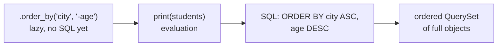
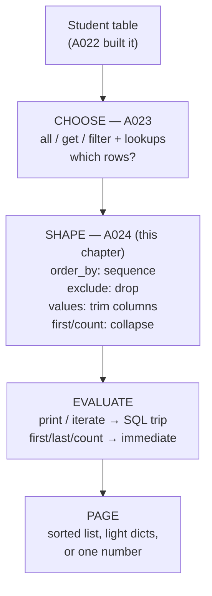

# 🚀 A024 — Retrieve Data from Database Table

`📖 Lecture A024` · `🎓 Track: Core Django` · `📶 Level: Beginner` · `✅ Status: Documented`

> [!NOTE]
> **About this chapter's sources:** no lecture transcript or notes exist for A024 — this chapter is built from the repo's own `commands.txt` (six new ORM result-shaping journal lines: `order_by()`, chained `filter()`, `exclude()`, `values()`, `values_list()`, `first()/last()/count()`), the A022 `myProject13/` artifact (the `Student` model whose rows these queries read), and official Django docs (QuerySet API reference). Everything marked 📌 comes from official Django documentation. All code snippets were verified against the journal entries and the Django ORM reference.

---

## 🧭 What You Will Learn

- [ ] Explain what **result shaping** means and how it differs from filtering (A023's job)
- [ ] Sort rows with `order_by()` — ascending, descending (`-`), and multi-field ordering
- [ ] Chain `filter()` calls and combine filtering with ordering in one line
- [ ] Exclude rows with `exclude()` and say exactly how it differs from "not filter"
- [ ] Trim columns with `values()` / `values_list()` and name what each returns
- [ ] Pull single answers with `first()`, `last()`, and `count()`
- [ ] Trace how each Python call translates into a SQL `ORDER BY` / `SELECT` clause 📌

## 🎯 Why This Lecture Matters

A023 taught you how to *choose the rows*. But raw chosen rows are rarely what a page needs. A leaderboard must be **sorted**. A table widget needs **only two columns**, not whole objects. A dashboard badge needs **a number** ("42 students"), not a list. That is this lecture's job: **shaping the result after the rows are chosen**.

The mental shift is small but critical: `filter()` answers *"which rows?"*; `order_by()`, `exclude()`, `values()`, `first()/count()` answer *"in what order, in what shape, and how many?"* Every real view you will ever write combines both — `Student.objects.filter(city="Delhi").order_by("name")` is the shape of production Django code: choose, then shape.

What breaks if you skip this lecture: your queries will always return whole unsorted objects. You will sort in Python (slow, memory-hungry), loop to count (wasteful), and pass fat objects to templates that only need two fields. The database can do all of this in one trip — this lecture teaches you to let it.

## ✅ Prerequisites

- [ ] Completed A022 — you know what the `Student` model is and that `migrate` created its table
- [ ] Completed A023 — you can use `all()`, `get()`, `filter()` and field lookups (`__gt`, `__startswith`)
- [ ] Can open `py manage.py shell` and import `from blog.models import Student`
- [ ] Basic Python: lists, tuples, dictionaries, negative indexing (`[-1]`) 📌

## 🧠 Recap: Where A024 Starts

> **From [A023](../A023_ORM_QuerySet_All_Get_and_Filter/README.md):** a QuerySet is a *lazy* collection — `filter()` chooses rows, `get()` takes exactly one object, lookups (`__gt`, `__startswith`) become SQL `WHERE`. Nothing hits the database until you iterate or print.

A024 keeps that machinery and adds the second half of every read query: **ordering** (which row comes first), **exclusion** (which rows to drop), **projection** (which columns to keep), and **reduction** (collapse the set to one object or one number). The journal's six new lines each demonstrate exactly one of these — quoted verbatim below.

## 🧠 Ordering with `order_by()` — Sorted on the Database, Not in Python

**Definition:** `order_by()` returns a *new* QuerySet sorted by the named field(s). Ascending is the default; prefix a field with `-` for descending. It translates directly to SQL `ORDER BY` 📌 — the database sorts, Python just receives the ordered rows.

**Why it exists:** pages need sorted data (leaderboards, alphabetical directories, newest-first feeds). Sorting in the database uses its indexes and avoids loading every row into Python memory just to reorder.

**The journal's ascending lines (quoted verbatim):**

```python
### Ascending
students = Student.objects.all().order_by("name")
print(students)

students = Student.objects.all().order_by("age")
print(students)
```

**Explanation:** the first query returns every student ordered A→Z by `name`; the second orders youngest→oldest by `age`. `print()` forces evaluation (A023's laziness rule) — the `ORDER BY` runs at that moment. Note the result is still a QuerySet of full `Student` objects — ordering changes *sequence*, never *shape*.

**The journal's descending line (quoted verbatim):**

```python
### Descending
students = Student.objects.all().order_by("-age")
>>> print(students)
```

**Explanation:** the `-` prefix flips to oldest→youngest. The stray `>>>` is the journal owner's shell prompt leaking into the notes — the real command is `print(students)`. (Same `>>>` artifact appeared in A023's journal lines.)

**The journal's multi-field line (quoted verbatim):**

```python
students = Student.objects.all().order_by("city", "-age")
```



> 💡 **Insight:** `order_by()` never filters and never trims — same rows, same columns, different sequence. If your page shows the right rows in the wrong order, the missing call is `order_by()`, not another `filter()`.

## 🧠 Chaining — Choose, Then Shape, in One Line

**Definition:** QuerySet methods return QuerySets, so calls chain left-to-right: each link narrows or reshapes what the previous link produced. Filtering and ordering compose freely in a single expression.

**The journal's chain line (quoted verbatim):**

```python
students = Student.objects.filter(city="Delhi").filter(age__gte = 18).order_by("name")
```

**Explanation, link by link:**
1. `filter(city="Delhi")` — keep only Delhi rows (`WHERE city = 'Delhi'`).
2. `.filter(age__gte = 18)` — of those, keep age ≥ 18 (AND logic — A023's chaining rule; the second `filter()` narrows, never widens).
3. `.order_by("name")` — sort the survivors A→Z.

One database trip, one ordered list: Delhi adults, alphabetical. This single line is the **shape of production query code** — choose (`filter`), then shape (`order_by`). Reading it as *choose first, shape last* keeps intent clear.

> ⚠️ **Warning:** chaining `filter()` after `order_by()` keeps the ordering — `order_by()` does not "lock" the set against further filtering. Only evaluation (`print`, iteration, slicing) freezes the trip to the database.

## 🧠 `exclude()` — The Rows You Don't Want

**Definition:** `exclude()` returns a QuerySet of every row that does **not** match the given conditions — SQL `NOT` 📌. It is the mirror of `filter()`.

**The journal's line (quoted verbatim):**

```python
students = Student.objects.exclude(city="Delhi")
```

**Explanation:** every student whose city is anything *except* Delhi. Still a lazy QuerySet of full objects — evaluation happens on `print()` / iteration, exactly as with `filter()`.

**Why `exclude()` instead of "filter for everything else"?** Because "everything else" is often unlistable — you know the one city to drop, not the fifty to keep. `exclude()` says the *negative* directly. It also composes: `filter(age__gte=18).exclude(city="Delhi")` reads as "adults, except Delhi" — a sentence no single `filter()` can express without enumerating every other city.

> 🧠 **Remember this:** `filter()` keeps matches; `exclude()` drops matches. Both return QuerySets; both lazy; both chain. When the condition describes what you *don't* want, `exclude()` is the honest verb.

**Explanation:** sort by `city` A→Z first; *within* each city, oldest first. Multi-field ordering is a tiebreaker chain — the second field only matters where the first ties. The SQL is `ORDER BY city ASC, age DESC` 📌.

## 🧠 `values()` and `values_list()` — Trim the Columns

**Definition:** these two methods change the *shape* of results from full model objects to lightweight per-row containers carrying only the named fields — SQL `SELECT name, city` instead of `SELECT *` 📌. Use them when the page needs fields, not objects.

**The journal's lines (quoted verbatim):**

```python
students = Student.objects.values("name", "city")

students = Student.objects.values_list("name", flat="True")
```

**Explanation — `values()`:** returns a QuerySet of **dictionaries**, one per row: `{"name": "Asha", "city": "Delhi"}`. The template or view reads `row["name"]` — no model instance is built, less memory, faster trip.

**Explanation — `values_list()`:** returns a QuerySet of **tuples**: `("Asha", "Delhi")`. With a single field plus `flat=True`, it flattens further to a plain list of values: `["Asha", "Ravi", …]` instead of `[("Asha",), ("Ravi",)]`.

> ⚠️ **Discrepancy note:** the journal writes `flat="True"` — the *string* `"True"`. The documented call is `flat=True` — the *boolean* 📌. Any non-empty string is truthy in Python, so `flat="True"` happens to flatten exactly like `flat=True` today. Write the boolean anyway: the string form works by accident, not by contract, and a future reader will misread it as intentional.

| Call | Returns per row | Use when… |
|---|---|---|
| `filter(...)` / `all()` | Full `Student` object | you need methods, saving, or many fields |
| `.values("name", "city")` | `dict` (`{"name": …, "city": …}`) | the template needs a few named fields |
| `.values_list("name", "city")` | `tuple` (`("Asha", "Delhi")`) | order matters, names don't |
| `.values_list("name", flat=True)` | single value (`"Asha"`) | exactly one field — dropdowns, name lists |

> 💡 **Insight:** `values()`/`values_list()` are about *weight*. A table widget showing names and cities has no business building full `Student` objects with emails and dates attached. Trim at the query, not in the template.

## 🧠 `first()`, `last()`, `count()` — Collapse to One Answer

**Definition:** these three *evaluate immediately* and return a single non-QuerySet answer: `first()` the first object (or `None`), `last()` the last object (or `None`), `count()` the integer row count. 📌

**The journal's line (quoted verbatim):**

```python
similar that first(), last(), count() etc
```

**Explanation:** the owner compressed three methods into one note — "similar" meaning *similarly terminal*: each ends the chain with one answer instead of a set. Concretely:

```python
oldest = Student.objects.order_by("-age").first()   # one Student, or None
newest = Student.objects.order_by("-age").last()    # one Student, or None
total = Student.objects.filter(city="Delhi").count()  # int, e.g. 42
```

**Explanation:** `first()`/`last()` respect the current ordering — pair them with an explicit `order_by()`, or "first" means database-default order (undefined in practice 📌). They return `None` on an empty set — no exception, unlike `get()` (A023). `count()` runs `SELECT COUNT(*)` 📌 — the database counts without shipping rows to Python, which is why `len(students)` on a big set is wasteful by comparison.

> 🧠 **Remember this:** `get()` = "exactly one, or explode" (A023). `first()` = "the winner, or `None`". `filter().count()` = "how many, as a number". Three different questions, three different verbs — reaching for `get()` when you mean `first()` is the A023→A024 graduation test.


## 🧱 Important Vocabulary

| Term | Simple meaning | Technical meaning | 🧷 Memory hook |
|---|---|---|---|
| Result shaping | Deciding order, columns, and size of results | `order_by` / `values` / `first` / `count` applied after row selection | the plating after the cooking |
| `order_by()` | Sort the rows | Appends SQL `ORDER BY`; `-` = descending; multi-field = tiebreakers 📌 | the librarian shelving A→Z |
| Chaining | Linking query calls in one line | Each method returns a QuerySet the next method consumes; one SQL trip on evaluation | the assembly line |
| `exclude()` | Drop the matching rows | `NOT` the conditions; lazy QuerySet like `filter()` 📌 | the bouncer's deny list |
| `values()` | Keep only named columns as dicts | `SELECT` the named fields; rows become `dict`s, not model instances 📌 | the photocopy of two columns |
| `values_list()` | Keep only named columns as tuples | Like `values()` but rows are `tuple`s; `flat=True` unwraps single-field rows 📌 | the plain list, no labels |
| `first()` / `last()` | The winning row, or `None` | Evaluates now; honors current ordering; empty set → `None`, never an exception 📌 | the gold medalist |
| `count()` | How many rows, as a number | Runs `SELECT COUNT(*)`; no row data crosses to Python 📌 | the headcount, not the parade |

> New terms must also be added to `docs/MEMORY.md` §2.

## 💡 Real-World Analogy

The school office keeps one master register (the table). A023 taught the clerk to *pull the right pages* (Delhi students). A024 is what the clerk does next: **sort the pages alphabetically** (`order_by`), **set aside the Delhi pile's opposite** (`exclude`), **photocopy just names and cities** (`values`), and **report "42 students" to the principal** (`count`) instead of wheeling the whole register upstairs. Same register, four different deliveries — the office never confuses *choosing pages* with *preparing the delivery*.

## ❌ Common Beginner Mistakes

1. **Sorting in Python after fetching** — `sorted(students, key=...)` loads every row then sorts in memory. *Why it happens:* Python sorting is familiar. *Fix:* `order_by()` — the database sorts with indexes before shipping anything.
2. **Using `len()` to count a QuerySet** — evaluates and builds every object just to count them. *Fix:* `.count()` — one `SELECT COUNT(*)`, zero objects built.
3. **Using `get()` where `first()` belongs** — `get(age=30)` explodes when two students share the age. *Fix:* if "the first match is fine", write `filter(age=30).first()` and handle `None`.
4. **Passing full objects to a two-column template** — works, but ships emails and dates the page never shows. *Fix:* `values("name", "city")` — trim at the query.
5. **Writing `flat="True"` (string)** — works by truthiness accident. *Fix:* `flat=True` (boolean) — write the contract, not the coincidence.
6. **Expecting `order_by()` to filter or `filter()` to sort** — each does one job. Missing order means a missing `order_by()`, not a stronger `filter()`.
## 🧠 Common Misconceptions

| ✅ It IS … | ❌ It is NOT … |
|---|---|---|
| `order_by()` sorts rows in the database (`ORDER BY`) | a Python-side sort, or a filter |
| `exclude()` returns all rows *not* matching (lazy QuerySet) | `filter()` with inverted Python logic, or an immediate list |
| `values()` returns dicts with only the named fields | full objects with hidden fields |
| `values_list(flat=True)` returns a flat list of single values | a list of 1-tuples (that's `flat=False`) |
| `first()` returns `None` on empty sets | an exception like `get()` raises |
| `count()` runs `SELECT COUNT(*)` without fetching rows | `len()` on an evaluated QuerySet |

## 🧪 Practical Example

Every line below is quoted verbatim from the journal's new A024 lines, in journal order:

```python
from blog.models import Student  # the A022 model; its table already migrated

# Ascending order — alphabetical, then by age
students = Student.objects.all().order_by("name")
print(students)

students = Student.objects.all().order_by("age")
print(students)

# Descending order — oldest first (>>> is the owner's shell prompt leaking in)
students = Student.objects.all().order_by("-age")
```python
# Multi-field — city A-Z, then oldest-first within each city
students = Student.objects.all().order_by("city", "-age")

# Chain — Delhi adults, alphabetical: choose, then shape
students = Student.objects.filter(city="Delhi").filter(age__gte = 18).order_by("name")

# Exclude — everyone except Delhi
students = Student.objects.exclude(city="Delhi")

# Trim — dicts with two keys; then a flat list of names
students = Student.objects.values("name", "city")

students = Student.objects.values_list("name", flat=True)  # journal wrote flat="True" (string); boolean is the contract 📌

# Collapse — one object or one number (journal: "similar that first(), last(), count() etc")
oldest = Student.objects.order_by("-age").first()
total = Student.objects.filter(city="Delhi").count()
```

**Explanation:** the statements walk the full result-shaping toolkit in dependency order — sort (asc → desc → multi), choose-then-shape chain, drop (`exclude`), trim (`values`/`values_list`), collapse (`first`/`count`). Each evaluates lazily on `print()`/use except the last two lines, which evaluate immediately by design. Nothing here creates rows or tables — A024 only *reads and reshapes*; A022 built the table, A023 chose rows from it.

## 🎯 Interview Perspective

> [!IMPORTANT]
> Interview cards test *understanding*, not recitation.

**Q1. What's the difference between `filter()` and `order_by()`?**
*Strong answer:* `filter()` chooses *which* rows (`WHERE`); `order_by()` chooses *sequence* (`ORDER BY`). Same rows either way for `order_by()` — it never adds or drops records. *Why it works:* proves the choose-vs-shape split, the chapter's core idea.

**Q2. When would you use `exclude()` instead of `filter()`?**
*Strong answer:* when the condition describes what to *drop* and the keep-set is unlistable — `exclude(city="Delhi")` vs enumerating fifty cities. They compose: `filter(adults).exclude(Delhi)` reads as a sentence. *Why it works:* shows negative selection as a first-class verb, not inverted logic.

**Q3. `values()` vs `values_list()` — and what does `flat=True` do?**
*Strong answer:* both trim to named columns; `values()` yields dicts, `values_list()` yields tuples; with one field, `flat=True` unwraps to plain values for dropdowns. *Why it works:* exact shape knowledge — the kind of detail that distinguishes users from guessers.

**Q4. Why is `.count()` better than `len()` on a QuerySet?**
*Strong answer:* `count()` runs `SELECT COUNT(*)` — the database counts, zero rows cross to Python. `len()` evaluates the whole set, builds every object, then counts. On large tables the difference is memory and time. *Why it works:* connects the Python call to the SQL and the cost.

**Q5. `get()` vs `first()` — which survives an empty table?**
*Strong answer:* `first()` returns `None`; `get()` raises `DoesNotExist`. And on multiple matches, `get()` raises `MultipleObjectsReturned` while `first()` hands you the winner. Use `get()` for "exactly one must exist", `first()` for "give me the top one if any". *Why it works:* the A023→A024 graduation test in one answer.

print(students)
```

## 🔁 Active Recall

Answer from memory first, then expand each answer below.

1. What four questions does result shaping answer that filtering doesn't?

<details><summary>Answer</summary>

In what order (`order_by`), which rows to drop (`exclude`), which columns to keep (`values`/`values_list`), and collapse to one answer (`first`/`last`/`count`). Filtering answers *which rows*; shaping answers *sequence, shape, size*.
</details>

2. What does the `-` in `order_by("-age")` do, and where does the sort happen?

<details><summary>Answer</summary>

Descending order (oldest first). The database sorts (`ORDER BY age DESC`); Python receives already-ordered rows.
</details>

3. In `order_by("city", "-age")`, when does the second field matter?

<details><summary>Answer</summary>

Only as a tiebreaker — where `city` ties, oldest first. Multi-field ordering is a left-to-right tiebreaker chain.
</details>

4. What does `filter(city="Delhi").filter(age__gte=18)` mean — AND or OR?

<details><summary>Answer</summary>

AND. Each chained `filter()` narrows the previous result. (A023's chaining rule, reused here before the `order_by` shapes it.)
</details>

5. How does `exclude()` differ from `filter()`, and is it lazy?

<details><summary>Answer</summary>

`exclude()` keeps rows that do *not* match (SQL `NOT`); `filter()` keeps rows that do. Both return lazy QuerySets and both chain.
</details>

6. `values("name", "city")` returns what per row — and `values_list("name", flat=True)`?

<details><summary>Answer</summary>

`values()` → dicts (`{"name": …, "city": …}`). `values_list()` with one field + `flat=True` → plain values (`"Asha"`, not `("Asha",)`).
</details>

7. Why is `flat="True"` (string) wrong even though it works?

<details><summary>Answer</summary>

It works by truthiness accident (any non-empty string is truthy). The contract is the boolean `flat=True` — write the contract, not the coincidence.
</details>

8. `first()` on an empty set returns what — and how does `count()` avoid fetching rows?

<details><summary>Answer</summary>

`first()` (and `last()`) return `None` — no exception, unlike `get()`. `count()` runs `SELECT COUNT(*)` so the database counts without shipping row data to Python.
</details>

## 📝 Quick Revision

| Call | Returns | SQL footprint 📌 | Empty-set behavior |
|---|---|---|---|
| `order_by("name")` / `("-age")` | Ordered QuerySet, full objects | `ORDER BY` | empty QuerySet |
| `filter(..).filter(..)` | Narrowed QuerySet (AND) | `WHERE … AND …` | empty QuerySet |
| `filter(..).order_by(..)` | Narrowed + sorted QuerySet | `WHERE … ORDER BY …` | empty QuerySet |
| `exclude(..)` | Complement QuerySet | `WHERE NOT (…)` | all rows (if none match) |
| `values("a", "b")` | QuerySet of `dict`s | `SELECT a, b` | empty QuerySet |
| `values_list("a", flat=True)` | QuerySet of plain values | `SELECT a` | empty QuerySet |

## 🧠 Final Mental Model



Choose (A023), then shape (A024), then evaluate — three verbs, one trip to the database.

## ❓ FAQ

**Q1. Does `order_by()` hit the database immediately?**
A: No — it's lazy like `filter()`. The `ORDER BY` runs when you evaluate (`print`, iterate, slice). Chain freely, pay once.

**Q2. Can I `order_by()` before `filter()`?**
A: Yes — `order_by("name").filter(city="Delhi")` works and keeps the ordering. Convention reads choose-first-shape-last, but correctness doesn't depend on it.

**Q3. Why did the journal print `>>> print(students)` with a prompt?**
A: The owner pasted shell output into the notes — `>>>` is the interactive prompt leaking in, same as in A023's lines. The command is `print(students)`.

**Q4. `values()` broke my template's `{{ student.get_age }}` — why?**
A: `values()` rows are dicts, not `Student` objects — no methods, no model behavior. Either use `row["age"]` or go back to full objects when you need methods.

**Q5. Should `exclude()` and `filter()` be mixed in one chain?**
A: Yes — `filter(age__gte=18).exclude(city="Delhi")` is idiomatic: choose the broad set, drop the exception. Read it as a sentence.


## 🏁 Learning Checkpoints

- [ ] **Checkpoint 1 — Sort:** I can order any QuerySet ascending, descending, and multi-field and name the SQL each produces — *§Ordering*
- [ ] **Checkpoint 2 — Chain:** I can write a filter→filter→order_by line and explain each link — *§Chaining*
- [ ] **Checkpoint 3 — Exclude & trim:** I can drop rows with `exclude()` and trim columns with `values()`/`values_list()`, naming each return shape — *§exclude / values*
- [ ] **Checkpoint 4 — Collapse:** I can pick `first()` vs `get()` vs `count()` for a stated need and predict the empty-set behavior — *§first/last/count*

## 🏋️ Exercises

- **Level 1 — Recall:** Write the query for "all students sorted by city A→Z, then age oldest-first." Which call, which arguments?
- **Level 2 — Understanding:** Explain why `Student.objects.filter(city="Delhi").count()` is cheaper than `len(Student.objects.filter(city="Delhi"))`. What SQL does each run?
- **Level 3 — Application:** Using the journal's rows: get Delhi adults (`age__gte=18`) sorted by name, but return only `name` dicts. Write it as one chained line.
- **Level 4 — Interview reasoning:** A view passes full `Student` objects to a template that shows only names. It works — why is it still wrong, and what two changes (query + template access) fix it?

## 🏁 Final Takeaways

1. `filter()` chooses rows; `order_by()`, `exclude()`, `values()`, `first()/count()` **shape** them — order, drop, trim, collapse.
2. Chaining composes choose-then-shape in one lazy line; the database does the work on evaluation — one trip.
3. `exclude()` is the honest verb for negative selection; `values()`/`values_list()` trim weight to dicts/tuples.
4. `first()` returns the winner or `None`; `count()` counts without fetching — never `len()` a big set, never `get()` where `first()` belongs.

## 🔄 Next Lecture Connection

A024 completes the **read side** of the data layer triad (A022 built the table, A023 chose rows, A024 shaped results). The natural next lecture presents these shaped results — wiring QuerySets into views and templates so sorted lists, trimmed dicts, and counts reach the page.

---

<div class="doc-footer">

**Sources used:** repo's own `commands.txt` (six new A024 result-shaping journal lines — `order_by` asc/desc/multi, chained `filter`+`order_by`, `exclude`, `values`, `values_list`, `first()/last()/count()` — quoted verbatim), A022 `myProject13/` artifact (the `Student` model these queries read), [Django QuerySet API reference](https://docs.djangoproject.com/en/stable/ref/models/querysets/) 📌, [Django `order_by` / `exclude` / `values` docs](https://docs.djangoproject.com/en/stable/ref/models/querysets/#order-by) 📌
**Navigation:** ← [A023 — ORM QuerySet All/Get/Filter](../A023_ORM_QuerySet_All_Get_and_Filter/README.md) · [Series hub](../README.md) · 🗓️ A025 — *upcoming* →

</div>
