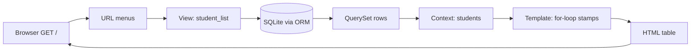

# A025 · Display Table Data in Django Template

> **Django Lecture Series** — Chapter A025 · Artifact `myProject14` · Database → View → Template

| ← Previous | 📚 Series | Next → |
|---|---|---|
| [A024 · Retrieve Data from Database Table](../A024_Retrieve_Data_from_Database_Table/README.md) | [Hub](../README.md) | [A026 · Django Admin & Superuser](../A026_Django_Admin_%26_Superuser/README.md) |

---

We have a model (**A022**), we can query it (**A023**), and we can pull rows into a view (**A024**). One link is missing: turning those Python objects into something a human can *see*. This chapter closes the loop — the full data pipeline from a SQLite table to an HTML table on screen.

**The one-sentence version:** the view asks the database for rows, hands them to the template inside the context, and a `` loop stamps one `<tr>` per row.

---

## 📜 The Journal — What We Typed

Everything this chapter teaches was driven by the series journal (tail shown):

```console
students = Student.objects.values_list("name", flat="True")

similar that first(), last(), count() etc

Student.objects.create(name="Umar", age=23, city="Delhi")

# Create super upser
py .\manage.py createsuperuser    admin admin  admin@123
```

No new installs, no new settings — this lecture is pure *plumbing*: connecting things that already exist.

## 🏗️ The Artifact — `myProject14`

The finished product is a Django project whose page is a real data table:

```text
A025_Display_Table_Data_in_Django_Template/
└── myProject14/
    ├── manage.py
    ├── db.sqlite3                  <- the shelf where rows live
    ├── myProject14/
    │   ├── settings.py             <- portfolio registered in INSTALLED_APPS
    │   └── urls.py                 <- includes portfolio.urls
    ├── templates/
    │   └── base.html               <- the letterhead (A012)
    └── portfolio/
        ├── models.py               <- the Student model (A022)
        ├── views.py                <- queryset -> context
        ├── urls.py                 <- the app menu
        └── templates/portfolio/
            └── student_list.html   <- TODAY: the table
```

Three ingredients, all already familiar: a **model** (A022), a **view with a QuerySet** (A023–A024), and an **app-level template** (A011). Today they meet.

## 🗄️ Where the Data Lives — the `Student` Model

The rows we will display come from the model created back in A022. Here is the real file, verbatim:

```python
from django.db import models

# Create your models here.
class Student(models.Model):
    name = models.CharField(max_length=100)
    age = models.IntegerField()
    city = models.CharField(max_length=100)

    def __str__(self):
        return self.name
```

Each class attribute becomes a column; each saved instance becomes a row — A002's class→table, object→row rule, now paying off. Django's written receipt for that table is the migration:

```python
# Generated by Django 6.1.1 on 2026-09-14 07:26

from django.db import migrations, models


class Migration(migrations.Migration):

    initial = True

    dependencies = [
    ]

    operations = [
        migrations.CreateModel(
            name='Student',
            fields=[
                ('id', models.BigAutoField(auto_created=True, primary_key=True, serialize=False, verbose_name='ID')),
                ('name', models.CharField(max_length=100)),
                ('age', models.IntegerField()),
                ('city', models.CharField(max_length=100)),
            ],
        ),
    ]
```

Nothing here is new — the point is the direction of travel: **model → migration → table → QuerySet → template**. Today is the last hop.

## 👁️ The View — Handing Rows to the Template

The view is the middleman. Here is the whole file — four working lines:

```python
from django.shortcuts import render
from .models import Student

# Create your views here.
def student_list(request):
    students = Student.objects.all()
    return render(request, 'portfolio/student_list.html', {'students':students})
```

| Line | What it does | Series callback |
|---|---|---|
| `from .models import Student` | Imports the model class so the view can query it | A022 — the model lives one folder over |
| `students = Student.objects.all()` | Builds the QuerySet — "give me every row" | A023/A024 — `all()` is the simplest manager call |
| `{'students': students}` | Packs the QuerySet into the **context** dictionary | A013 — context is the view→template data bridge |
| `render(request, ..., context)` | Finds the template, fills it, wraps it in a response | A010 — find → fill → wrap |

> 💡 **Notice what the view does NOT do:** it never writes a single HTML tag. Splitting "get data" (Python) from "show data" (template) is the MVT contract from A002, finally paying off with real data.

## 🔗 The URL Chain — How `/` Finds This View

Two menus cooperate, exactly as in A007–A008. The project menu first:

```python
"""
URL configuration for myProject14 project.

The `urlpatterns` list routes URLs to views. For more information please see:
    https://docs.djangoproject.com/en/6.1/topics/http/urls/
Examples:
Function views
    1. Add an import:  from my_app import views
    2. Add a URL to urlpatterns:  path('', views.home, name='home')
Class-based views
    1. Add an import:  from other_app.views import Home
    2. Add a URL to urlpatterns:  path('', Home.as_view(), name='home')
Including another URLconf
    1. Import the include() function: from django.urls import include, path
    2. Add a URL to urlpatterns:  path('blog/', include('blog.urls'))
"""
from django.contrib import admin
from django.urls import path, include

urlpatterns = [
    path('admin/', admin.site.urls),
    path('', include('portfolio.urls')),
]
```

The key line: `path('', include('portfolio.urls'))` — everything except `admin/` is handed to the app. Inside the app:

```python
from django.urls import path
from . import views

urlpatterns = [
    path('', views.student_list, name="student_list"),
]
```

| Hop | File | Decision |
|---|---|---|
| 1 | `myProject14/urls.py` | empty path → `include('portfolio.urls')` — the app owns the root |
| 2 | `portfolio/urls.py` | empty route → `views.student_list`, named `student_list` |

So `http://127.0.0.1:8000/` — the empty path — lands on `student_list`. One page, one route: the simplest possible menu.

## 🎨 The Template — Where Rows Become `<tr>`s

The star of the chapter, verbatim:

```html
<!DOCTYPE html>
<html lang="en">
<head>
    <title>Portfolio</title>
</head>
<body>
    <h1>Student Data</h1>
    
        <table>
            <thead>
                <tr>
                    <th>Name</th>
                    <th>Age</th>
                    <th>City</th>
                </tr>
            </thead>
            <tbody>
                
                    <tr>
                        <td>{{ student.name }}</td>
                        <td>{{ student.age }}</td>
                        <td>{{ student.city }}</td>
                    </tr>
                
            </tbody>
        </table>
    
        <p>No student data available.</p>
    
</body>
</html>
```

Four things are happening, and each is an old friend wearing new data:

### 1. The guard — `` / ``

A015's `if` tag, now fed by a real QuerySet. An empty QuerySet is *falsy*, so a first visit with no rows falls straight to the `` branch: **"No student data available."** That is the **empty state** — a page that says "nothing yet" instead of showing a blank or broken table.

### 2. The fixed frame — `<thead>`

The column headers `Name / Age / City` are **hand-written HTML**, outside the loop. Django does not inspect your model and invent headers — you write them once. (Change the model later, and this row is yours to update.)

### 3. The stamp — ``

A015's `for` tag doing its real job: the engine walks the QuerySet row by row and stamps one `<tr>`…`</tr>` block per row, with that row's values in the `<td>` cells. Two rows in the table → two `<tr>` blocks in the HTML. The page grows with the data and **no code changes**.

### 4. The dot — `{{ student.name }}`

A013's variable resolution, now hitting a real model object. `student` is a `Student` instance; `.name` is an **attribute lookup** — the first rule of the dot. `{{ student.age }}` and `{{ student.city }}` work identically. Because the model defines `__str__` returning `self.name`, even a bare `{{ student }}` would print the name.

> 🧠 **Remember this:** the loop variable name (`student`) is yours to choose — it just has to match what you use inside the loop. The context key (`students`) is the **contract** between view and template: rename it on one side and you must rename it on the other.

## 🔄 The Journey of a Request — `/`

Every station of the full pipeline, in order:

| # | Station | What happens | Chapter |
|---|---|---|---|
| 1 | Browser | `GET http://127.0.0.1:8000/` | A001 |
| 2 | `myProject14/urls.py` | empty path → `include('portfolio.urls')` | A007 |
| 3 | `portfolio/urls.py` | empty route → `views.student_list` | A007 |
| 4 | `views.py` | `Student.objects.all()` builds a QuerySet | A023 |
| 5 | SQLite | the ORM runs `SELECT … FROM portfolio_student` and fetches the rows | A022 |
| 6 | `views.py` | rows packed into the context as `students` | A013 |
| 7 | template loader | finds `portfolio/student_list.html` in the app lane | A011 |
| 8 | template engine | `` passes → `` stamps one `<tr>` per row | A015 |
| 9 | Browser | a complete HTML table renders | — |



## 🧠 The Mental Model — From the Kitchen to the Dining Table

The series' restaurant has been building toward this meal:

| Series stage | Restaurant | Lecture |
|---|---|---|
| Model defines the dish | the pantry is stocked, the recipe card written | A022 |
| QuerySet picks and shapes | the cook selects and plates the order | A023–A024 |
| **Template serves the plate** | **the plate reaches the dining table — the customer finally sees food** | **A025** |

And one more twist that makes it honest: every refresh is a **fresh order**. The waiter (view) walks back to the kitchen (ORM/SQLite), re-plates the dish (re-renders the template), and brings it out again. The page is not a live feed — it is a fresh snapshot per request.

## 🧱 Important Vocabulary

| Term | Simple meaning | Technical meaning | Memory hook |
|---|---|---|---|
| Empty state | what a page shows when there is no data | the ``/`` (or ``) branch rendering a friendly "nothing yet" message | no food? show the menu, not an empty plate |
| Loop variable | the row "in hand" during each pass of `` | the per-iteration name bound to each element of the context sequence (`student`) | one plate per pass |
| Context key | the label the view packs data under | the dictionary key (`students`) the template must use to reach the data | the label on the box |
| Row stamping | one loop pass → one `<tr>` | the template engine emitting a table-row block per QuerySet element | cookie cutter for rows |
| Hard-coded header | hand-written `<th>` labels | static HTML outside the loop; not derived from the model | printed once on the letterhead |
| Server-rendered snapshot | the page is rebuilt per request | each GET re-runs the view and re-renders; no live push | fresh order every visit |

## ❌ Common Beginner Mistakes

1. **Building HTML strings inside the view.** `html += "<tr>" + s.name + "</tr>"` works but throws away the entire point of templates — MVT exists so Python fetches and templates show. If you are concatenating tags in `views.py`, stop.
2. **Looping in the view instead of the template.** Passing `{'names': [s.name for s in students]}` strips the template of access to whole objects — pass the QuerySet itself and let the template decide what to show.
3. **Printing `{{ students }}` directly.** You get the raw repr — `<QuerySet [<Student: Umar>, …]>` — ugly, autoescaped, and not a table. Use the loop.
4. **Forgetting `` or ``.** Instant `TemplateSyntaxError` — Django's unclosed-block check is strict (A015).
5. **Singular/plural confusion.** `for students in students` then `{{ students.name }}` silently resolves the *QuerySet*, not the row — the dot lookup fails quietly (A013's silent-miss rule) and cells render blank.
6. **Hard-coding rows "just to see it work".** The moment real data flows, the fakes stay baked in. Empty table? Fix the data (create rows), never the template.
7. **Putting the template in the wrong lane.** It must be `portfolio/templates/portfolio/student_list.html` (A011's doubled folder). In the project-level `templates/` it would also load here — but then it is shared infrastructure, not app property (A012's ownership rule).

## 🧠 Common Misconceptions

| ❌ Misconception | ✅ Reality |
|---|---|
| "Django reads my model and generates the table headers" | Headers are your hand-written `<th>`s. Django fills *cells*; you own the frame. |
| "The `` loop re-queries the database on every pass" | The QuerySet was evaluated once in the view; the loop iterates an in-memory result. |
| "The page updates live when the database changes" | It is a snapshot per request. Refresh = re-query = updated table. No push, no auto-refresh. |
| "`` is required before a loop" | Looping an empty QuerySet simply renders nothing. The guard exists to show an intentional empty state. |
| "Templates are a Python dialect" | DTL is its own mini-language with a deliberate feature freeze — logic lives in Python (A015). |
| "One table on the page needs one template" | Templates compose: `` and inheritance (A012) build pages from pieces. |

> 📌 **Beyond the artifact:** the template uses ``/`` for its empty state. DTL also offers a dedicated `` clause inside `` that does the same job in one block — worth knowing, not used here.

## 🧪 Practical Example — Make the Table Grow

The journal already stocked the shelf:

```console
>>> Student.objects.create(name="Umar", age=23, city="Delhi")
```

> ⚠️ The journal line runs in `py manage.py shell` (A024). Also note the journal's next line — `# Create super upser` [sic] *createsuperuser* — belongs to the **next** lecture (A026); it is quoted in the tail only because the journal is one running notebook.

Now watch the pipeline work, end to end:

1. `py manage.py runserver` → open `http://127.0.0.1:8000/`
2. The table shows **one row**: Umar · 23 · Delhi — straight from `db.sqlite3`
3. In another terminal: `py manage.py shell`, then `Student.objects.create(name="Aisha", age=21, city="Lahore")`
4. Refresh the browser → **two rows**. No code changed — only the data.
5. Delete both rows in the shell (`Student.objects.all().delete()` — 📌) and refresh → the `` branch: **"No student data available."**

That round-trip — create, refresh, see; empty, refresh, see — *is* the whole chapter.

## 🎯 Interview Perspective

**Q1. How do you display database records in a Django template?** — The view runs a QuerySet (`Student.objects.all()`), passes it in the context dictionary to `render()`, and the template iterates it with ``, stamping one HTML block per record. Fetch in Python, show in template.

**Q2. Why keep the data-fetching and the HTML in separate files?** — Separation of concerns (MVT/DRY): designers can edit markup without touching Python; logic changes never risk breaking layout. The context dictionary is the only contract between them.

**Q3. What does your page show when the queryset is empty?** — Whatever the `` (or ``) branch says. An empty QuerySet is falsy, so a guarded template shows an intentional "no data" message instead of a blank table.

**Q4. How does `{{ student.name }}` actually resolve?** — `student` is the loop variable bound to each model instance; the dot performs an attribute lookup first. If it misses, DTL falls back to dict-key then index, rendering empty on total failure (A013).

**Q5. I added a row to the database but the page did not change. Why?** — The page is a snapshot rendered at request time. Refresh: the view re-queries and re-renders. Plain Django has no live push.

## 🔁 Active Recall

Close the chapter and answer from memory. Reveal only after you have committed to an answer.

<details><summary>1. Name the three cooperating files that put the table on screen, and each one's job.</summary><p><code>portfolio/urls.py</code> (menu → view), <code>views.py</code> (QuerySet → context), <code>student_list.html</code> (loop → rows). The project <code>urls.py</code> routes into the app first.</p></details>

<details><summary>2. What is the context key in this chapter, and what does it hold?</summary><p><code>students</code> — it holds the QuerySet returned by <code>Student.objects.all()</code>.</p></details>

<details><summary>3. How many <code>&lt;tr&gt;</code> blocks does the finished HTML contain if the table has 5 students?</summary><p>Six: five body rows from the loop, plus one header row in <code>&lt;thead&gt;</code>.</p></details>

<details><summary>4. Which A013 lookup rule does <code>{{ student.city }}</code> exercise?</summary><p>Attribute lookup — the first rule of the dot, because <code>student</code> is a model instance.</p></details>

<details><summary>5. Why is the <code></code> guard there at all — wouldn't the loop alone be fine?</summary><p>The loop alone renders nothing for an empty set; the guard adds an intentional, friendly empty state via <code></code>.</p></details>

<details><summary>6. You rename the context key to <code>all_students</code> in the view. What must change in the template?</summary><p>The loop: <code></code>. The context key is the view↔template contract.</p></details>

<details><summary>7. Where are the column headers <em>not</em> coming from?</summary><p>Not from Django or the model — the <code>&lt;th&gt;</code> labels are hand-written HTML outside the loop.</p></details>

<details><summary>8. True or false: the <code></code> loop hits SQLite once per row.</summary><p>False. The QuerySet was evaluated once in the view; the loop iterates the in-memory result.</p></details>

## 📝 Quick Revision

| # | Fact |
|---|---|
| 1 | Pipeline: model → QuerySet → context → template loop → `<tr>`s |
| 2 | View = `objects.all()` + `render(request, 'portfolio/student_list.html', {'students': students})` |
| 3 | Route: project `include('portfolio.urls')` → app `path('', views.student_list)` |
| 4 | Template anatomy: `` … `` … `{{ student.name }}` … `` … `` empty state |
| 5 | Headers are hand-written `<th>`s; cells are looped `<td>`s |
| 6 | Empty QuerySet is falsy; every request re-renders a fresh snapshot |

## 🧠 Final Mental Model — Django in One Breath

A022 stocked the pantry (model), A023–A024 cooked and plated the order (queries → QuerySet), and A025 serves the plate on the dining table: the view hands the rows to a template whose `` loop stamps one `<tr>` per row — and every refresh sends the waiter back to the kitchen for a fresh plate.

## 🏁 Learning Checkpoints

- [ ] I can name the three cooperating files and each one's job
- [ ] I can trace `GET /` through both URL menus to `student_list`
- [ ] I can explain what `objects.all()` returns and how it reaches the template
- [ ] I can read `student_list.html` and separate Django tags from plain HTML
- [ ] I can predict exactly what the page shows with zero rows
- [ ] I can add a row from the shell and make it appear by refreshing

## 🏋️ Exercises

**Level 1 — Recall.** Without looking: what is the context key? The loop variable? How many `<td>` cells per row — and why that number?

**Level 2 — Understanding.** Predict the HTML (row count) for a table with 0, 1, and 3 students. What changes in each case — and what never changes?

**Level 3 — Application.** In `views.py`, change `objects.all()` to `objects.order_by("-age")` (A024) and refresh. Then restrict it with `filter(city="Delhi")`. Two lines of Python, template untouched — explain why that works.

**Level 4 — Interview reasoning.** A teammate starts building the table with string concatenation inside `views.py`. Make the two-minute case for moving that HTML into a template, using MVT, DRY, and the context contract as your arguments.

## 🏁 Final Takeaways

- The last hop of the pipeline is the template loop: **QuerySet in, `<tr>`s out**
- The view fetches and packs — it never writes HTML; that split is MVT's whole point
- Context keys are contracts between view and template — rename them together
- Guard the table with ``/`` so empty data gets a designed page, not a blank one
- `<th>` headers are hand-written; `<td>` cells are stamped per row
- Every request re-runs the pipeline: the refresh button is your "live update"
- Nothing new was installed or configured — this chapter is pure connection of A022 + A023/A024 + A011/A015

## ❓ FAQ

**Do I need `` around every loop?** — No. A loop over an empty QuerySet renders nothing; the guard buys you a designed empty state. 📌 DTL also offers `` inside `` for one-branch empty handling.

**Can I show the whole QuerySet with `{{ students }}`?** — Technically yes; you get the autoescaped repr (`<QuerySet […]>`), not a table. Use the loop.

**Why does the template live at `portfolio/templates/portfolio/`?** — A011's namespaced app lane: the doubled folder prevents cross-app filename collisions and keeps app templates app-owned.

**Does Django pick the `<th>` names from the model fields?** — No. Headers are static HTML; cells are dynamic. Keep them in sync by hand — or use the admin (A026), which *does* generate columns from the model.

**Is there a way to auto-refresh the page when data changes?** — Not in plain server-rendered Django. Refresh — or reach for HTMX/WebSockets, which are far beyond this lecture.

## 📚 Sources

| Source | Role |
|---|---|
| `commands.txt` journal — the `Student.objects.create(...)` line and tail | **Primary** — how the shelf got stocked |
| `myProject14/` — `models.py`, `views.py`, both `urls.py`, `student_list.html`, `0001_initial.py` | **Primary** — every code block quoted verbatim |
| Django docs — tutorial part 3 (views, render, context) | 📌 Background alignment |
| Django docs — built-in template tags (`for … empty`, `forloop.counter`, `all().delete()`) | 📌 Flagged supplements not in the artifact |

---

| ← Previous | 📚 Series | Next → |
|---|---|---|
| [A024 · Retrieve Data from Database Table](../A024_Retrieve_Data_from_Database_Table/README.md) | [Hub](../README.md) | [A026 · Django Admin & Superuser](../A026_Django_Admin_%26_Superuser/README.md) |

> **Next up — A026 · Django Admin & Superuser:** the journal already typed `py .\manage.py createsuperuser`. The rows you created by hand in the shell are about to get a point-and-click control room.

