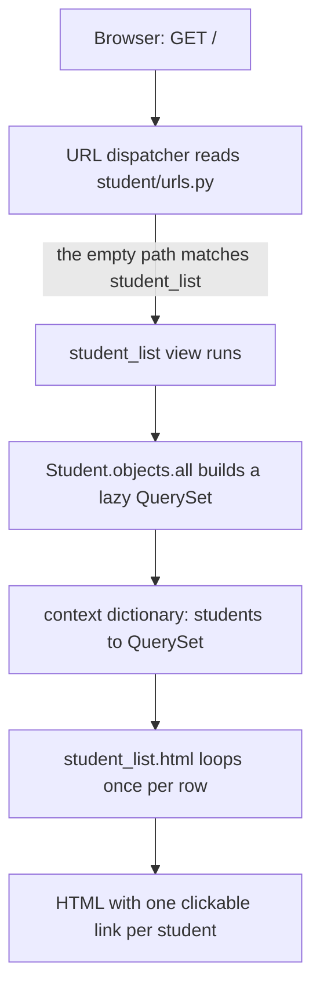
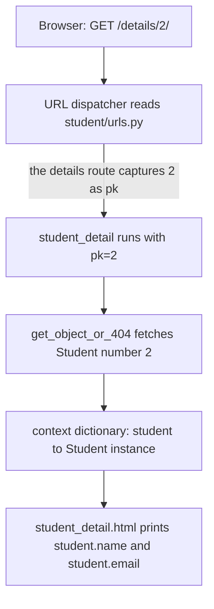
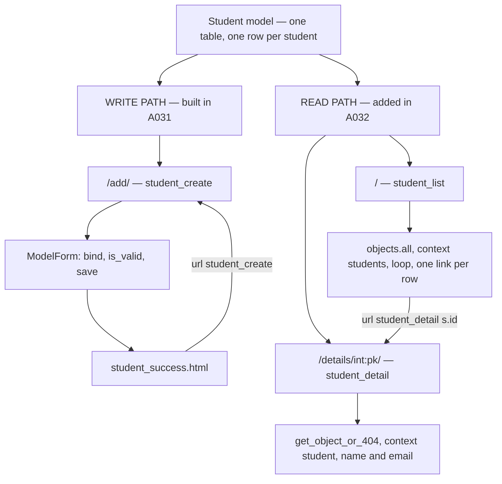

# 🚀 A032 — Django ModelForms Read

`📖 Lecture A032` · `🎓 Track: Core Django` · `📶 Level: Intermediate` · `✅ Status: Documented`

> [!NOTE]
> **About this chapter's sources:** No lecture transcript exists in the folder. The chapter is built from the **A032 state of the `myProject18/` artifact** — the same `student` app as A031, now extended for the *read* half of CRUD: a **list view** (`Student.objects.all()` → context `students`), a **detail view** (`get_object_or_404(Student, pk=pk)`), a **three-route URL menu**, and two new templates. Every file reference below is quoted verbatim from the on-disk artifact.
>
> 📌 **Where the code came from:** the A032 changes were authored as an **update to A031's project** (A031's `urls.py` had a single route; this one has three). Following the series' snapshot convention — A026 and A027 each carry their own copy of `myProject15` — those bytes are copied into this folder as `myProject18/`, so the chapter is self-contained. All paths below are this lecture's copy.
>
> **Verified twice**, as always: engine render of the artifact's templates **and** the live request path (`/` 200 · `/add/` 200 · `/details/1/` 200 · `/details/999999/` 404 · `/nope/` 404) on Django 6.1.1, plus `reverse()` resolution of all three URL names and a read of the real database (3 rows).
>
> This lecture builds directly on [A031 — Django ModelForms Create](../A031_Django_ModelForms_Create/README.md).

---

## 🧭 What You Will Learn

- [ ] How to read **all** rows from a table and render them as a list (the read half of CRUD)
- [ ] How to read **one specific** row identified by a value in the URL
- [ ] How `get_object_or_404()` turns "row not found" into a clean 404 instead of a crash
- [ ] How a template builds a **link to another record** with ``
- [ ] Why A031's single `''` route became three routes (`add/`, `''`, `details/<int:pk>/`)
- [ ] How pieces you already know (QuerySet → context → template loop → URL tag) compose into a two-page read flow

## 🎯 Why This Lecture Matters

A031 taught the **write** path: a form collects data, `is_valid()` checks it, `form.save()` files one new row. That is only half of CRUD. A database nobody can read from is a filing cabinet with the drawers welded shut.

A032 adds the **read** path — and with it, the first time the series builds a multi-page flow where **one page links to another record**. That link is where beginners get hurt: they hard-code `/details/1/` (A031 shipped exactly that bug in its success template), and the moment a route changes, every link in the project rots. This lecture shows the durable way: a **named route**, a **dynamic URL segment**, and a template tag that resolves the URL at render time.

The skills here unlock everything that follows: A033 (editing a record) needs the same "fetch one row by `pk`" machinery, and any real app — a blog, a shop, a dashboard — is a list page linking to detail pages.

## ✅ Prerequisites

- [ ] A `ModelForm` and the create flow — bind → `is_valid()` → `save()` (covered in A031)
- [ ] QuerySets: `all()`, `get()`, `filter()`, and why `get()` can raise (covered in A023)
- [ ] Displaying a QuerySet in a template: context key → `` loop → one row per item (covered in A025)
- [ ] URL converters: `path('blog/<int:year>/', …)` and what the view receives (covered in A009)
- [ ] `pk`, `get_object_or_404()`, and `` (covered in A030)

## 🧠 ModelForms Read in Django

### The Architecture

```
myProject18/                       ← project root (manage.py lives here)
├── manage.py
├── myProject18/                   ← config package (settings, urls, wsgi, asgi)
│   ├── settings.py                ← INSTALLED_APPS includes 'student'
│   ├── urls.py                    ← includes student.urls at ''
│   ├── wsgi.py
│   └── asgi.py
├── student/                       ← the app
│   ├── models.py                  ← Student model (name, age, email)        — unchanged since A031
│   ├── forms.py                   ← StudentForm (ModelForm)                 — unchanged since A031
│   ├── views.py                   ← THREE views: create · list · detail    ← A032 adds two
│   ├── urls.py                    ← THREE routes: add/ · '' · details/<int:pk>/  ← A032 rewrites
│   ├── admin.py                   ← still empty — Student not registered
│   ├── apps.py                    ← StudentConfig
│   ├── migrations/
│   │   └── 0001_initial.py        ← creates student_student table (no new migrations in A032)
│   └── templates/
│       ├── student_form.html      ← the add form, {{ form.as_p }}           — A031
│       ├── student_success.html   ← confirmation; link now         ← A032 fixed A031's bug
│       ├── student_list.html      ← NEW: all students, one clickable row each
│       └── student_detail.html    ← NEW: one student's fields
└── db.sqlite3                     ← SQLite database (3 rows at time of writing)
```

**The shape of the change in one line:** A031's app could *write and confirm*. A032's app can *list and look up* — and the confirmation page finally links somewhere that cannot rot.

> [!IMPORTANT]
> **No schema change.** `models.py`, `forms.py`, `admin.py`, `settings.py`, and the migration are byte-identical to A031. A032 adds **views, routes, and templates only** — a read path over the same table. That is why no `makemigrations`/`migrate` appears in this lecture.

### The Two Read Views

The entire read layer is two functions. Quoted verbatim from `student/views.py`:

```python
from django.shortcuts import render, get_object_or_404
from .forms import StudentForm
from .models import Student


# Create your views here.
def student_create(request):
    form = StudentForm()
    if request.method == 'POST':
        form = StudentForm(request.POST)
        if form.is_valid():
            form.save()
            return render(request, 'student_success.html')  # Redirect to a success page or another view
    else:
        form = StudentForm()

    return render(request, 'student_form.html', {'form': form})


def student_list(request):
    students = Student.objects.all()
    return render(request, 'student_list.html', {'students': students})


def student_detail(request, pk):
    student = get_object_or_404(Student, pk=pk)
    return render(request, 'student_detail.html', {'student': student})
```

**Explanation — the import line (line 1):**
- `render` — unchanged from A031.
- `get_object_or_404` — **new here**. It is the read-path shorthand for "fetch one row; if it isn't there, answer 404 instead of throwing a server error."
- `from .models import Student` — **new here**. A031's views imported only the *form*; `student_create` never touched the model directly because `form.save()` did that for it. A read view has no form, so it talks to the model itself.

**Explanation — `student_list` (lines 22–24):**
- `students = Student.objects.all()` — one QuerySet holding every row. `objects` is the **manager** (A023), `all()` is "the whole register" (A023's glossary). Nothing has hit the database *yet* — a QuerySet is lazy (A023); the SQL runs when the template iterates it.
- `{'students': students}` — the **context dictionary** (A013). The key `students` is a contract: the template must ask for that exact name. Misspell it and the page renders *empty without an error* — the silent-failure trap from A002/A013.
- `render(...)` — the same three-part job as A002: find the template, fill its blanks with the context, wrap the result in an `HttpResponse`.

**Explanation — `student_detail` (lines 27–29):**
- `def student_detail(request, pk)` — the view now takes a **second parameter**. Where does it come from? Not the query string, not the POST body: the **URL itself**. The route `details/<int:pk>/` (below) captures the number, converts it to `int`, and passes it in as the keyword argument `pk`. Name mismatch between route and function means a `TypeError`, so the two are a pair.
- `get_object_or_404(Student, pk=pk)` — shorthand for:

```python
# what you would write by hand — get_object_or_404() is the safe shorthand
from django.http import Http404

try:
    student = Student.objects.get(pk=pk)   # raises if zero or many rows match (A023)
except Student.DoesNotExist:
    raise Http404("No Student matches the given query.")
```

- Why this matters: `/details/999999/` is a *perfectly valid URL shape*. Without the guard, `Student.objects.get()` raises `DoesNotExist`, Django turns that into **HTTP 500 (Internal Server Error)**, and the visitor sees a crash page — for what is really just "there is no student 999999." `get_object_or_404` converts "no such row" into **HTTP 404 (Not Found)**, the same behaviour the chai app's detail view has (A002).
- `{'student': student}` — the context key is **singular** because it holds one object. Note the deliberate pattern: `students` (plural, list) vs `student` (singular, one row). Matching the noun to the count is a small habit that prevents a whole class of confusion.

### How the Read Pipeline Works

Both read views follow the *same three-beat rhythm*: **fetch → pack into context → render**. What you should see in the diagram is that the view is the narrow waist — everything left of it is routing, everything right of it is presentation.



1. **Route** — the dispatcher matches the request path against `urlpatterns` and picks exactly one view. No match means 404 before any view code runs.
2. **Fetch** — the view asks the ORM for data. This beat is the only one that touches the database, and (because QuerySets are lazy) it may not touch it until step 4.
3. **Pack** — the view builds the context dictionary. This is the *contract* with the template: keys out one side, `{{ }}` names in the other.
4. **Render** — `render()` loads the template, walks the QuerySet row by row, and returns HTML wrapped in an `HttpResponse`.

The same rhythm, one row at a time:



> [!TIP]
> **Why the rhythm is worth memorising:** every read page you will ever write — a blog index, a product grid, a user profile — is this same four-beat shape. Once the rhythm is automatic, writing a new read page is a five-minute job of filling in the blanks: *which query, which context key, which template.*

Notice what is **absent** compared with A031's create view: no `request.method` branch, no form object, no `is_valid()`, no `csrf_token`, no `save()`. A read view never changes state, so none of the write-path machinery applies. That difference is the whole distinction between the "R" and the "C" in CRUD.

### The URL Menu

Quoted verbatim from `student/urls.py`:

```python
from django.urls import path
from . import views

urlpatterns = [
    path('add/', views.student_create, name='student_create'),
    path('', views.student_list, name='student_list'),
    path('details/<int:pk>/', views.student_detail, name='student_detail'),
]
```

**The three routes:**

| Request path | Route pattern | View that handles it | URL name |
|---|---|---|---|
| `/` | `''` | `student_list` | `student_list` |
| `/add/` | `add/` | `student_create` | `student_create` |
| `/details/2/` | `details/<int:pk>/` | `student_detail` with `pk=2` | `student_detail` |

The project root mounts this table at the site root, exactly as in A031:

```python
# myProject18/urls.py
path('', include('student.urls')),
```

**What changed, and why the create view had to move.** A031 had a single route: `path('', views.student_create, name='student_create')` — the create form *was* the homepage. A032 needs a homepage that lists records, so **the empty path becomes the list** and the create form is pushed to `add/`.

> [!IMPORTANT]
> **One path, one view.** If both `student_list` and `student_create` claimed `''`, the first one in the list would win and the second would be unreachable — a **dead route**. That is precisely the bug dissected in A008's artifact, where two `path('')` entries left one route shadowed forever. Giving each view its own address is not a style preference; it is required.

**The contract is the `name=`, not the path.** The strings `student_list`, `student_create`, and `student_detail` are what the templates refer to. The paths (`''`, `add/`, `details/<int:pk>/`) are free to change as long as the names stay put — which is exactly how A032 fixes A031's hard-coded link without touching the template's intent.

Verified resolution — Django's `reverse()` turns each name back into a path:

```text
reverse('student_list')                  -> /
reverse('student_create')                -> /add/
reverse('student_detail', args=[1])      -> /details/1/
```

**Anatomy of the detail route** — `details/<int:pk>/` is three parts:

1. `details/` — a literal segment the visitor must type (or that the list page links to).
2. `<int:pk>` — a **dynamic segment**. The `<int:…>` converter (A009) matches digits only and hands Python an `int`; `pk` is the name the captured value is passed under.
3. `/` — the trailing slash Django's `APPEND_SLASH` expects.

Because the converter is `int`:

| Request | What happens | Why |
|---|---|---|
| `/details/2/` | view runs with `pk=2` | digits match `<int:pk>` |
| `/details/abc/` | **404** — no route matches | `int` refuses letters |
| `/details/2` (no slash) | **301 redirect** to `/details/2/` | `APPEND_SLASH` (📌, same behaviour as A007's `/about` case) |
| `/details/2/extra/` | **404** | nothing left over may match |

> [!WARNING]
### The List Template

Quoted verbatim from `student/templates/student_list.html`:

```html
<!DOCTYPE html>
<html lang="en">
<head>
    <title>All Student Data</title>
</head>
<body>
    <h1>All Student Data</h1>
    <a href="">Add New Student</a>
    <ul>
        
        <li>
            <a href="">{{ s.name }} - {{ s.email }}</a>
        </li>
        
    </ul>
</body>
</html>
```

**Explanation — the load-bearing lines:**

- Line 8: `<a href="">Add New Student</a>` — a **named-URL link**, no path typed by hand. This is the exit door onto A031's write path, and it survives any route rename.
- Line 10: `` — the loop (A015) walks the context key `students`, the exact name the view packed the QuerySet under. The loop variable `s` *is* the row in hand for each pass (A025's "one plate per pass").
- Line 12: `` — **the heart of this lecture**: `` **with an argument** (A030 registered the tag; the argument form is new here). Django resolves the name `student_detail`, sees its route needs one `pk`, and uses `s.id` as that value — producing a real path like `/details/2/`.
  - `s.id` is the auto-generated primary-key attribute. `models.py` declares no `id` field; Django adds one (`BigAutoField`) at migration time. `s.pk` is an alias of `s.id`.
- Line 12 (rest): `{{ s.name }} - {{ s.email }}` — variable lookup on the row (A013). Dots try **attribute** first, so `s.name` is attribute access, not dict-key lookup.
- The proof it works — the rendered page, three rows, each pointing at its own record:

```html
<a href="/details/1/">Adnan - adnan@test.com</a>
<a href="/details/2/">Umar - umar@test.com</a>
<a href="/details/3/">Md - md@test.com</a>
```

> [!NOTE]
> **What the list omits:** `age` — the model has it; this template does not render it. That is the artifact's choice, not a Django limitation (adding a column is a one-line edit; see the exercises).

### The Detail Template

Quoted verbatim from `student/templates/student_detail.html`:

```html
<!DOCTYPE html>
<html lang="en">
<head>
    <title>Student Details</title>
</head>
<body>
    <h1>Student Details</h1>
    <p><strong>Name:</strong> {{ student.name }}</p>
    <p><strong>Email:</strong> {{ student.email }}</p>
    <a href="">Back to Student List</a>
</body>
</html>
```

**Explanation:**

- Lines 8–9: `{{ student.name }}` and `{{ student.email }}` — the **singular** context key (one object, no loop) with plain attribute lookups.
- Line 10: `` — the return path, again by name. Note the symmetry: the list links *into* details; the detail links *back out* to the list. Two templates, two named routes, zero hand-written paths.
- **Only `name` and `email` appear — not `age`.** Both read templates ignore the third field, which makes "add `age`" a perfect first exercise: you must touch exactly one template, and nothing else.
### What Changed Since A031

This is the "A031 update" the chapter documents — the exact delta between A031's snapshot and A032's:

| File | A031 state | A032 state | Evidence |
|---|---|---|---|
| `student/urls.py` | **1 route:** `path('', views.student_create, …)` | **3 routes:** `add/` · `''` · `details/<int:pk>/` | `git diff`; `reverse()` resolves all three |
| `student/views.py` | 1 view; imports `render` only | 3 views; imports `render, get_object_or_404` **and** `Student` | `git diff`; live requests |
| `student/templates/student_success.html` | `<a href="/">` — hard-coded | `<a href="">` — named | 1-line `git diff` |
| `student/templates/student_list.html` | *did not exist* | new — 399 bytes | new file; renders 487 bytes |
| `student/templates/student_detail.html` | *did not exist* | new — 317 bytes | new file; renders 265 bytes |
| `student/models.py` | `Student(name, age, email)` | **unchanged** (262 bytes) | byte-identical |
| `student/forms.py` | `StudentForm` + `clean_age()` | **unchanged** (448 bytes) | byte-identical |
| `student/admin.py` | empty | **unchanged** (66 bytes) | byte-identical |
| `myProject18/settings.py` | `INSTALLED_APPS`, `DIRS`, `MAILERS` … | **unchanged** (3,418 bytes) | byte-identical |
| `student/migrations/` | `0001_initial.py` | **unchanged** — no new migration | byte-identical; no schema change |

**Read the table as a lesson:** A032 bought an entire read interface for the price of **two views, three routes, and two templates**. No model change, no migration, no settings edit, no dependency. That is what "the view is the narrow waist" means in practice — a new page is usually glue, not schema.

### Bugs Still Live in the Artifact

Per the contract's §12, the artifact's defects are named rather than silently repaired. All three were re-verified during this chapter's writing.

> [!CAUTION]
> **Bug 1 — inherited from A031, still fatal:** `student/forms.py` line 13 raises `forms.ValidationError(...)`, but the module only imported `ModelForm` from `django.forms` — the name `forms` does not exist. **Verified:** POSTing `age=15` to `/add/` raises `NameError: name 'forms' is not defined` and Django answers **HTTP 500** — the user sees a crash page instead of the intended "Age must be 18 or older." message. Fix: `from django.forms import ModelForm, ValidationError` (then `raise ValidationError(...)`), or import from `django.core.exceptions`. The database row count was unchanged (3) — the failure happens before any save.

> [!WARNING]
> **Bug 2 — inherited from A031, now more visible:** `student_create` ends its success path with `return render(request, 'student_success.html')` rather than `redirect(...)`. Rendering after a POST breaks the **PRG pattern**: pressing F5 on the confirmation page re-submits the same POST and files a duplicate student. A032 makes this worse in practice, because the success page now sits next to a list page that will happily show you the duplicate. Fix: `return redirect('student_list')`.

> [!NOTE]
> **Observation 3 — a design gap, not a bug:** the success page still offers only "Add Another Student" (linking to `student_create`). Now that a list page exists, landing the user on the **list** after a successful create is the natural flow — one line plus the `redirect()` above (📌 beyond the artifact).

Also still absent, carried over from A031 (📌): no `app_name` namespace in `student/urls.py`; no `base.html`/template inheritance; `Student` is not registered in the (empty) `admin.py`; and `settings.py` still carries the unused `TEMPLATES['DIRS']` entry plus the inert `MAILERS` block from earlier lectures.

### Admin & Migrations

Nothing to do in A032 — and that is the point worth registering:

- **No new migration.** The read path reads the existing `student_student` table. Migrations describe *schema*; A032 changed no schema.
- **No admin change.** `student/admin.py` remains empty, so the rows you see on `/` are not visible in `/admin/` (the model was never registered — A026/A027's lesson waiting to be applied).

```bash
# only needed if you run this snapshot yourself, because db.sqlite3 is git-ignored
py manage.py migrate            # create the empty student_student table
py manage.py runserver          # then visit / — the list is empty until you add rows
```

> [!NOTE]
## 🧱 Important Vocabulary

| Term | Simple meaning | Technical meaning | 🧷 Memory hook |
|---|---|---|---|
| **List view** | A page that shows *many* rows | A view that fetches a QuerySet (`Model.objects.all()`) and packs it under one context key for a `` loop to stamp out (📌 Django's generic `ListView` is the class-based equivalent) | the catalogue drawer |
| **Detail view** | A page that shows *one* row | A view taking a URL-supplied identifier (`def student_detail(request, pk)`), fetching exactly one object, and packing it under a singular context key (📌 cf. `DetailView`) | the one book, fetched by number |
| **Detail route** | The address of one record | A path pattern whose dynamic segment carries the identifier — `details/<int:pk>/` — so the *same* view serves every row | the call-slip slot |
| **`` with an argument** | A link that knows which record it points to | `` — the URL name plus the value for its dynamic segment; resolved at render time from the URLconf | ordering by catalog number, one title filled in |
| **`s.id`** | A row's own number | The auto-generated primary-key attribute Django adds to every model (`BigAutoField`); `s.pk` is an alias of it | every row wears a badge number |

> [!NOTE]
> Terms you should already own (registered earlier, not repeated here): `objects` manager, `all()`, lazy QuerySet (A023) · context key, loop variable, row stamping (A025) · `pk`, `get_object_or_404()`, ``, PRG pattern (A030) · URL converter `<int:…>` (A009).

## 💡 Real-World Analogy

**A032 is the reading room of the library that A023 first described.** A031 built the acquisitions desk — a form (the declaration slip) that files one new book. A032 opens the public side of the same building:

- **The list page is the catalogue drawer.** `Student.objects.all()` pulls out the whole register (A023's word for it — "the whole register"), and the `` loop lays one index card per student in the drawer. Each card is legible (`{{ s.name }} - {{ s.email }}`) and, crucially, **carries a call number** — the `/details/<n>/` link.
- **The detail page is the call slip.** You do not hand the librarian a card; you hand her a *number*. `<int:pk>` is the number box, `get_object_or_404` is the walk to the shelf, and the template prints what came back: name, email.
- **The 404 is "no such call number."** `/details/999999/` is a perfectly well-formed request for shelf space that does not exist. The catalogue (URLconf) can't help you; the shelf (database) is empty there. "Not found" is the honest answer — not a building-wide alarm.
- **The named route is the cross-reference system.** A031's confirmation page pointed at `/` by literally spelling a location; A032's links name the *destination* (`student_detail`) and let Django compute the address. When the shelves get rearranged, a card catalogue by name still works.

## ❌ Common Beginner Mistakes

1. **Hand-writing a record's URL** — `<a href="/details/1/">` instead of ``. It works today and rots tomorrow: change the route and every link 404s. A031's artifact shipped exactly this class of bug in its success template (`href="/"`), which A032 then fixed. → Always link by **name**; let Django compute the path.
2. **Fetching one row with `get()` and no error handling** — `Student.objects.get(pk=pk)` raises `DoesNotExist` for a missing row, and Django turns that into **500**. Visitors who mistype a URL should meet a 404, not a traceback. → Use `get_object_or_404()`.
3. **Putting two views on the same path** — leaving create at `''` *and* adding the list at `''`. Only the first route can ever match; the second is a **dead route** (the exact bug A008 dissected). → One path per view; move one of them (`add/`).
4. **Letting the route's capture name drift from the view's parameter name** — route says `<int:pk>` but the view is `def student_detail(request, id)`. Django passes `pk` as a keyword argument, the function does not accept it, and you get a `TypeError`. → Keep the names identical.
5. **Assuming the view's context key and the template's variable are unrelated** — the view packs `students`; the template asks for `student`. Django reports **nothing**: `` over a missing name is an empty loop, so you get a blank page with a 200 status. → Match the key exactly; a mysteriously empty page is a naming bug, not a data bug.
6. **Trusting the order of an unordered QuerySet** — `objects.all()` has no promised ordering. It looks sorted by id here only because SQLite returns rows in insertion order. → Add `order_by(...)` when order matters (A024).

## 🧠 Common Misconceptions

| ✅ Django/topic IS … | ❌ It is NOT … |
|---|---|
| The same *kind* of object — a read view is an ordinary function view, like the create view | A different species of view. Only the body differs: no form, no `request.method` branch, no `save()` |
| `` resolved at **render time** from the URLconf's names | A string you can hand-write safely — hand-written paths are the classic rot bug |
| `get_object_or_404()` returning a model instance when the row exists | A "safer `get()`" that silences errors — failure still raises (`Http404`), it just raises the *right* error |
| The row identifier being part of the **URL path** (`/details/2/`) | A query string (`/details/?id=2`) — either can work, but a path segment is what the `path()` converter reads |
| A QuerySet being **lazy** — the SQL runs when the template iterates it | A snapshot taken when `all()` is called; nothing is fetched until the rows are consumed |
## 🧪 Practical Example

**Goal:** add a second read page — `/adults/` — listing only students aged 18+, **without writing a new template**.

```python
# student/views.py — a new read view. Same rhythm: fetch → pack → render.
def student_adults(request):
    students = Student.objects.filter(age__gte=18).order_by('name')  # A023 filter + A024 order_by
    return render(request, 'student_list.html', {'students': students})   # SAME template, same key
```

```python
# student/urls.py — one new line in the menu
path('adults/', views.student_adults, name='student_adults'),
```

**Explanation:**
- `filter(age__gte=18)` — the "choose" half of A023's contract: only rows whose `age` is at least 18.
- `order_by('name')` — A024's "shape" half: alphabetical, so the example's effect is visible.
- **`render(request, 'student_list.html', {'students': …})`** — the payoff. The template was written against the *key* `students`, not against a particular query, so any QuerySet packed under that key renders correctly. **The context key is the interface.** No new template, no new HTML, no CSS work.
- `path('adults/', views.student_adults, name='student_adults')` — a fourth route; note it does **not** touch `''` or `details/…`, so nothing is shadowed.

**Verified output** — the same template, a different QuerySet, and the proof that ordering took effect (Md, id 3, now renders *before* Umar, id 2):

```html
<a href="/details/1/">Adnan - adnan@test.com</a>
<a href="/details/3/">Md - md@test.com</a>
<a href="/details/2/">Umar - umar@test.com</a>
```

And the cheap summary queries, for a future `/stats/` page (📌 — no such route exists in the artifact):

```text
Student.objects.count()                        -> 3
Student.objects.filter(age__gte=18).count()    -> 3
Student.objects.order_by("-age").first()       -> Md
```

> [!TIP]
> **The lesson:** the expensive part of a read page is deciding *which rows* and *what shape* — the template work is usually already done. Because `student_list.html` loops over whatever it is handed, an entire family of list pages costs one view and one route each.

## 🎯 Interview Perspective

> [!IMPORTANT]
> Interview cards test *understanding*, not recitation.

**Q1. Walk me through what happens when a user clicks a row on the list page.**
A: The row's `href` was produced by ``, so it is a concrete path such as `/details/2/`. The browser issues `GET /details/2/`. `CommonMiddleware` sees the path already ends in `/`, so no `APPEND_SLASH` redirect is needed. The URL dispatcher walks `urlpatterns`, matching `details/<int:pk>/`, converting `"2"` to the integer `2`, and calling `student_detail(request, pk=2)`. The view calls `get_object_or_404(Student, pk=2)`; if a row exists, it is packed as `student` and `student_detail.html` renders; if not, `Http404` is raised and the visitor gets a 404 page.

**Q2. Why did A031's single route have to change?**
A: Because A031 mounted the create view at the app root (`path('', …)`), and the root is the natural address for a list page. Django matches **one** route per request — the first that fits — so leaving both on `''` would create a dead route (A008's bug). The list took `''`; create moved to `add/`. Each view needs its own address.

**Q3. What does `get_object_or_404()` give you that `Model.objects.get()` does not?**
A: The correct *status code* for the situation. `get()` raises `Student.DoesNotExist` on zero matches, which Django reports as **500 Internal Server Error** — a server fault — even though the client asked for a row that simply isn't there. `get_object_or_404()` raises `Http404`, which Django reports as **404 Not Found**. Same lookup, honest HTTP semantics. (It also handles `ValueError` from malformed values.)

**Q4. How does the template know which record each link points to?**
A: From the loop variable. Inside ``, `s` is the current row; `s.id` is that row's primary key. `` supplies that value to the named route's dynamic segment and Django computes the final path at render time. Nothing about the URL is hard-coded in the template, which is why renaming or moving routes does not break the links.

**Q5. Is a read view fundamentally different from a write view?**
## 🔁 Active Recall

Answer from memory first, then expand each `<details>`.

1. What are A032's two read views, and what does each pack into the context?

<details><summary>Answer</summary>

`student_list` packs `{'students': Student.objects.all()}` — a QuerySet, plural key. `student_detail` packs `{'student': get_object_or_404(Student, pk=pk)}` — one instance, singular key. Both then `render()` a template.
</details>

2. Why did the create view move from `''` to `add/`?

<details><summary>Answer</summary>

The list page needs the app root. Django matches one route per request (first match wins), so two views cannot share `''` — the shadowed one becomes a dead route. A032 rewrote `urls.py` as three routes: `add/` → create, `''` → list, `details/<int:pk>/` → detail.
</details>

3. What does `get_object_or_404()` do that `Student.objects.get()` does not?

<details><summary>Answer</summary>

It converts "no such row" into HTTP **404** instead of an unhandled `DoesNotExist` (which Django reports as **500**). It wraps the `get()` call in a try/except for `DoesNotExist` (and `ValueError`) and raises `Http404`. On success it returns the model instance exactly like `get()`.
</details>

4. Trace `/details/2/` end-to-end — name every hop.

<details><summary>Answer</summary>

(1) `` on the list page produced `/details/2/`. (2) Browser sends `GET /details/2/`. (3) URL dispatcher matches `details/<int:pk>/`, converts `"2"` → `int 2`. (4) `student_detail(request, pk=2)` runs. (5) `get_object_or_404(Student, pk=2)` queries the table. (6) Result packed as `student`. (7) `student_detail.html` renders `{{ student.name }}` / `{{ student.email }}`. (8) HTML returns as an `HttpResponse`.
</details>

5. How does `` know which path to build?

<details><summary>Answer</summary>

It looks up the **name** `student_detail` in the URLconf at render time, sees that its pattern has one dynamic segment (`<int:pk>`), and substitutes the supplied value (`s.id`) — producing e.g. `/details/2/`. That is why the template contains no hand-written path and survives a route rename.
</details>

6. What happens on `/details/abc/` — and why?

<details><summary>Answer</summary>

**404**, before any view code runs. The `<int:…>` converter only matches digits, so the dispatcher finds no matching pattern. It is a *routing* failure, not a database lookup failure — the database is never consulted.
</details>

7. Which files did A032 change, and which did it leave untouched?

<details><summary>Answer</summary>

Changed: `student/urls.py` (3 routes), `student/views.py` (+2 read views, +`get_object_or_404`/`Student` imports), `student_success.html` (hard-coded `/` → ``), and two new templates (`student_list.html`, `student_detail.html`). Untouched, byte-identical: `models.py`, `forms.py`, `admin.py`, `settings.py`, and the migration — hence no `makemigrations`/`migrate`.
</details>

8. Why does the same `student_list.html` work for a filtered, re-ordered QuerySet?

<details><summary>Answer</summary>

Because the template couples to the **context key**, not to the query behind it. `student_list.html` only knows "loop over `students`, print `s.name` / `s.email`" — so whether the view passes `Student.objects.all()`, a filtered `filter(city="Delhi")`, a re-ordered `order_by("-age")`, or a fully chained A024 query, the loop renders whatever rows arrive, in whatever order they arrive. Choosing and shaping happen in the view (A023/A024); displaying happens in the template (A025). Change the query, keep the template.
</details>

## 📝 Quick Revision

| Concept | Code | Purpose |
|---|---|---|
| Read the whole table | `students = Student.objects.all()` | Fetch every row (lazy QuerySet) |
| Read one row safely | `student = get_object_or_404(Student, pk=pk)` | One row or **404** — never a 500 |
| List view | `def student_list(request): return render(request, 'student_list.html', {'students': students})` | Fetch → pack → render, no form |
| Detail view | `def student_detail(request, pk): …` | `pk` arrives **from the URL** |
| List route | `path('', views.student_list, name='student_list')` | The app root |
| Create route | `path('add/', views.student_create, name='student_create')` | Moved off `''` so the list can own it |
| Detail route | `path('details/<int:pk>/', views.student_detail, name='student_detail')` | Dynamic segment = which record |
| Row loop | ` … ` | One pass per row |
| Link to a record | `` | Named URL **with an argument** |
| Read a field | `{{ student.name }}` | Attribute lookup on the instance |
| Why 404, not 500 | `Http404` vs `DoesNotExist` | Honest HTTP status codes |
| Files changed | urls + views + 2 templates + 1 link | No model, no migration, no settings |

---

## 🧠 Final Mental Model

One app, one table, **two doors** — and the same four-beat rhythm behind each. What to see in the diagram: the write path A031 built on the left, the read path A032 added on the right, and the named-URL links holding the two halves together.



- **One table, two reading styles** — all rows (`/`) or one row by number (`/details/2/`).
- **The identifier travels in the path**, captured by `<int:pk>` and handed to the view as `pk`.
- **The context key is the contract** — `students` (plural) for lists, `student` (singular) for one row.
- **Links are named, never spelled** — `` resolves at render time, so routes can move without rotting a template.
- **"Row not found" is a 404, not a crash** — `get_object_or_404` is the difference between an honest answer and a traceback.
## ❓ FAQ

**Q1. My list page is blank, but the view looks right. What is wrong?**
A: Almost always a **context-key mismatch**. The view packs `{'students': …}` and the template asks for `{{ student }}` (or ``). Django does not raise: a missing name in a `` is simply an empty loop, and a missing `{{ name }}` renders as nothing (A013's silent-failure rule). Compare the two strings character by character before suspecting the database.

**Q2. Why does `/details/2` redirect while `/details/abc/` returns 404?**
A: Two different mechanisms. `/details/2` *does* match a route after a slash is appended, so `CommonMiddleware` issues a **301** to `/details/2/` (`APPEND_SLASH`, on by default — verified). `/details/abc/` cannot be rescued by a slash, because the `<int:pk>` converter refuses letters, so nothing matches and the dispatcher returns **404**.

**Q3. Do I need `makemigrations`/`migrate` for these new pages?**
A: No. A032 added views, routes, and templates — no model change, so the schema is untouched. Migrations track *database structure*; pages are code. (If you run this snapshot yourself, you *do* need `migrate` once — only because the snapshot ships without its git-ignored `db.sqlite3`.)

**Q4. How do I control the order the students appear in?**
A: Add `order_by` to the query (A024). Verified on the real data: `Student.objects.all()` returns Adnan, Umar, Md (insertion order, which SQLite happens to give but Django never promises), while `Student.objects.filter(age__gte=18).order_by('name')` returns **Adnan, Md, Umar** — same template, different order. Changing the order is a one-line view change, never a template change.

**Q5. Why is `get_object_or_404` imported from `django.shortcuts` rather than `django.http`?**
A: Because it is a *view-writing convenience*, like `render`, so Django groups it with the other shortcuts. `Http404` — the exception it raises — does live in `django.http`, and that is what you import if you write the lookup by hand.

**Q6. Both templates repeat the whole HTML skeleton. Shouldn't there be a `base.html`?**
A: Yes, in a real project — that is A016's inheritance pattern, and A031's artifact already broke the series convention by using standalone pages (📌 flagged, not fixed here). Consolidating four standalone templates behind one `base.html` is a good refactor *and* a good exercise, but it is not part of this lecture's artifact.

## 🏁 Learning Checkpoints

- [ ] **Checkpoint 1 — The read rhythm:** I can name the three beats (fetch → pack into context → render) and write a list view from a blank file — *§How the Read Pipeline Works*
- [ ] **Checkpoint 2 — Detail by URL:** I can write a detail view whose `pk` parameter comes from a `<int:pk>` route, and explain where the value enters the request — *§The Two Read Views*
- [ ] **Checkpoint 3 — 404 not 500:** I can explain what `get_object_or_404()` converts, and what a bare `objects.get()` would do to the visitor — *§The Two Read Views*
- [ ] **Checkpoint 4 — Named links:** I can link from a loop to each row's own page with `` and explain why hand-writing `/details/1/` is a bug waiting to happen — *§The List Template*
- [ ] **Checkpoint 5 — Route hygiene:** I can explain why two views cannot share `''`, and rewrite a three-view route table without creating a dead route — *§The URL Menu*
## 🏋️ Exercises

- **Level 1 — Recall:** Name the three beats of a read view. What does `get_object_or_404()` return on success, and what does it raise on failure? Which route pattern captures a record id, and what is the captured value's Python type? What are the context keys the two read views use?
- **Level 2 — Understanding:** Why did the create view have to move off `''`? Why does the same `student_list.html` render correctly for `objects.all()` *and* for `filter(age__gte=18).order_by('name')`? Why is "no such row" a 404 rather than a 500 — and what would a bare `objects.get(pk=pk)` do to the visitor? Why is `/details/abc/` a *routing* failure rather than a database failure?
- **Level 3 — Application:**
  1. **Add `age`** to both read templates (one line each) and confirm the detail page now shows all three fields.
  2. **Add an `/adults/` page** exactly as in the Practical Example, then confirm Md renders before Umar.
  3. **Add a `/stats/` page** showing the total number of students using `count()` (A024) — one view, one route, a three-line template.
  4. **Fix both inherited bugs** and prove it: import `ValidationError` correctly, then POST an under-18 age and confirm you now see a form error instead of a 500; switch the success path to `redirect('student_list')` and confirm F5 no longer files a duplicate.
  5. **Order the list** with `order_by('name')` and verify the change came from the view, not the template.
- **Level 4 — Interview reasoning:** A junior colleague writes `<a href="/details/1/">` throughout the list template and uses `Student.objects.get(pk=pk)` in the detail view. Walk through both failures they will hit over the next month (link rot when you add a URL prefix; a 500 whenever a visitor mistypes an id), explain what each fix is, and then explain *why* A032 needed no migration even though it added two entire pages. Finally: a colleague reports "my list page is blank with a 200 status" — give your first three diagnostic steps in order.

---

## 🏁 Final Takeaways

1. **The read path is a rhythm:** fetch → pack into context → render. Every read page you write follows it.
2. **Two shapes of read:** `objects.all()` for many rows, `get_object_or_404()` for exactly one.
3. **`get_object_or_404()` makes "not found" honest:** a mistyped id returns 404, not a 500 traceback — the difference between an HTTP answer and a server fault.
4. **The identifier travels in the URL path:** `details/<int:pk>/` captures it, the view's parameter (`pk`) receives it, and those two names must match or you get a `TypeError`.
5. **Link by name, never by hand:** `` is resolved at render time; A031's hard-coded `href="/"` was the same rot bug, fixed here.
6. **One path, one view:** the list took `''`, so create moved to `add/`. Two views sharing a path means one of them is a dead route (A008's lesson, applied).
7. **The context key is the interface:** because `student_list.html` binds to the key `students` rather than to a query, any QuerySet packed under that key renders — the `/adults/` example needed no new HTML.
8. **A new page is usually glue, not schema:** two views, three routes, two templates — and zero migrations, because nothing about the table changed.

## 🔄 Next Lecture Connection

A032 leaves the app with a record you can *view* at `/details/<pk>/`. The obvious next want is to *change* it — and the next lecture, **A033 — Django ModelForms Update (Edit) Data**, is already set up by the pieces this chapter put in place:

- **The identifier is available.** The detail route's `<int:pk>` capture gives a view everything it needs to name the row being edited — the same route family, a sibling path such as `edit/<int:pk>/`.
- **The form is reusable as-is.** A031's `StudentForm` does not care whether it creates or edits; only the way you *construct* it changes.
- **The one new idea is `instance=`.** Hand a `ModelForm` an existing object (`StudentForm(request.POST, instance=student)`) and `form.save()` **updates** that row instead of inserting a new one. Create and update are the same code with a different constructor call.
- **The read templates become the entry point.** A row's detail page is the natural place for an "Edit" link — built, of course, with ``.

📌 Continuation: [A033 — Django ModelForms Update (Edit) Data](../A033_Django_ModelForms_Update_%28Edit%29_Data/) — *chapter not yet written; the folder exists.*

---

<div class="doc-footer">

**Sources used:** the A032 state of the `myProject18/` artifact (Django 6.1.1) — `student/views.py` (`student_create` unchanged; `student_list` = `Student.objects.all()` → context `students`; `student_detail(request, pk)` = `get_object_or_404(Student, pk=pk)` → context `student`; imports gained `get_object_or_404` and `Student`), `student/urls.py` (three routes — `add/` · `''` · `details/<int:pk>/`; still no `app_name`), `student/templates/student_list.html` (loop + ``), `student/templates/student_detail.html`, and `student/templates/student_success.html` (the single-line fix: hard-coded `/` → ``) — plus the **byte-identical unchanged** files that prove the scope: `student/models.py` (262 B), `student/forms.py` (448 B), `student/admin.py` (66 B), `myProject18/settings.py` (3,418 B), `student/migrations/0001_initial.py` (636 B).

The A032 delta was authored as an **update to A031's project**; following the series' snapshot convention (A026 and A027 each carry `myProject15`), those bytes are copied into this folder as `myProject18/` — 20 files, `db.sqlite3` absent because it is git-ignored.

**Verified twice** while writing: engine render of the artifact's templates (`student_list.html` 487 B with three `/details/N/` links; `student_detail.html` 265 B with name + email) **and** the live request path on `runserver` (`/` 200 · `/add/` 200 770 B · `/details/1/` 200 265 B · `/details/999999/` 404 · `/nope/` 404 · every list row linking to its own record), with the artifact's real `MIDDLEWARE` installed — so `APPEND_SLASH` was genuinely exercised (`/details/2` → **301** `/details/2/`; `/details/abc/` → **404**; `/details/2/extra/` → **404**) — plus `reverse()` resolution of all three URL names (`/`, `/add/`, `/details/1/`) and a direct read of the database (3 rows: Adnan/20, Umar/22, Md/25). The Practical Example's context-key reuse was verified the same way: `filter(age__gte=18).order_by('name')` rendered **Adnan, Md, Umar** through the unchanged template.

**Flagged per §12 (named, not silently repaired):** the `forms.ValidationError` `NameError` in `student/forms.py` → HTTP 500 on any under-18 POST (re-verified live; row count unchanged at 3); `render()` instead of `redirect()` after a successful save (breaks the PRG pattern); and the carried-over absences — no `app_name` namespace, no `base.html` inheritance, `Student` unregistered in the empty `admin.py`, unused `TEMPLATES['DIRS']` entry, inert `MAILERS` block.

No lecture transcript exists in the folder — the chapter is built from the on-disk artifact and official Django documentation (📌 marks everything beyond it).

**Navigation:** ← [A031 — Django ModelForms Create](../A031_Django_ModelForms_Create/README.md) · [Series hub](../../README.md) · [A033 — Django ModelForms Update (Edit) Data →](../A033_Django_ModelForms_Update_%28Edit%29_Data/)

</div>
