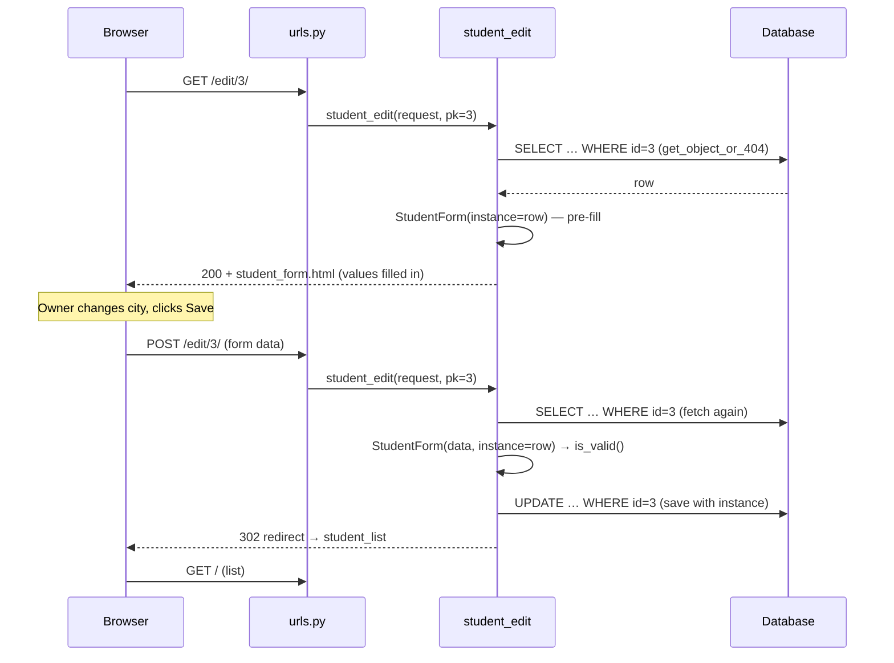

`3# 🔗 A033 — Django ModelForms: Update (Edit) Data

> **Series:** Django Lectures · **Chapter:** A033 · **Status:** ✅ Documented
> **Artifact:** `myProject18` — the project built in [A031](../A031_Django_ModelForms_Create/README.md), **evolved in place** by this lecture's diff. The edit feature lives there, not in a new folder.

## 🧭 What You Will Learn

By the end of this chapter you will be able to:

- Explain why **editing** reuses the exact same `ModelForm` class that **creating** uses
- Use the one keyword that switches a form from *insert mode* to *update mode*: **`instance=`**
- Wire an edit route that carries a **primary key in the URL** (`edit/<int:pk>/`)
- Fetch the right row safely with `get_object_or_404` before showing the form
- Add an **Edit link** to every row of a list page using `` with an argument
- Trace a full **GET → form → POST → save → redirect** round trip
- Know what SQL `form.save()` runs in each mode (`INSERT` vs `UPDATE`)

## 🎯 Why This Lecture Matters

A030–A032 gave you the **Create** and **Read** halves of CRUD. Real applications are not write-once: people mistype emails, students change cities, prices get corrected. If your only tool is `form.save()` on a blank form, your answer to "fix a typo" is *delete the row and re-create it* — which destroys the row's identity, its relations, and its history.

This lecture adds the **U** of CRUD with a surprisingly small diff. That smallness is the lesson: Django's design (form bound to model, model bound to table) means *updating* is not a new subsystem — it is the same form, handed a record to remember. Once you see `instance=`, you understand why every "Edit" button on every Django site is this same round trip.

> 💡 **Insight:** Create and Edit are not two features. They are **one form with two modes**. The mode is decided entirely by whether the form is handed an `instance`.

## ✅ Prerequisites

| You need | From |
|---|---|
| `Student` model + `StudentForm` (ModelForm) | [A031 — ModelForms Create](../A031_Django_ModelForms_Create/README.md) |
| Rendering `{{ form.as_p }}` and the POST/`is_valid()`/`save()` loop | [A031](../A031_Django_ModelForms_Create/README.md) |
| Reading rows into a `` table | [A032 — ModelForms Read](../A032_Django_ModelForms_Read/README.md) |
| URL parameters & the converter→argument contract (`<int:pk>` → `pk`) | [A009 — URL Parameters](../A009_URL_Parameters_%28path_re_path_kwargs%29/README.md) |
| `get_object_or_404` | [A009](../A009_URL_Parameters_%28path_re_path_kwargs%29/README.md), reused in [A031](../A031_Django_ModelForms_Create/README.md) |

## 📜 The Source: A Git-Diff Journal

> ⚠️ **Source-honesty note (docs contract §12):** Every chapter so far could quote `commands.txt` as its journal. **A033 has no new journal lines** — nothing was installed, no command changed. This lecture's source material is a **git diff**: four files in `myProject18` changed to add the edit feature. Those changed files, quoted verbatim below, are the primary source — exactly as `commands.txt` was for A003/A024.

The diff, in words:

| # | File | Change |
|---|---|---|
| 1 | `student/views.py` | **New view `student_edit`** (with `instance=`) |
| 2 | `student/urls.py` | New route `edit/<int:pk>/` named `student_edit` |
| 3 | `student/templates/student_list.html` | New **Edit** column + link per row |
| 4 | `student/templates/student_success.html` | Exit door retargeted: "View All Students" instead of back-to-form |

## 🏗️ The Artifact: `myProject18`, Evolved

```text
myProject18/
├── manage.py
├── myProject18/          # config package
│   ├── settings.py       # unchanged since A031
│   └── urls.py           # unchanged: includes student.urls
└── student/
    ├── models.py         # Student — unchanged
    ├── forms.py          # StudentForm — unchanged
    ├── urls.py           # ➕ edit/<int:pk>/ route
    ├── views.py          # ➕ student_edit view
    └── templates/
        ├── student_form.html      # unchanged — reused by edit!
        ├── student_list.html      # ➕ Edit column
        └── student_success.html   # 🔀 door retargeted
```

**Two files the diff does *not* touch are the most important ones:** `models.py` and `forms.py`. Editing needs no new model, no new form class, no migration. If a feature needs zero new tables and zero new form classes, it is pure *wiring* — and wiring is cheap.

The two pillars being reused (from A031):

```python
# student/models.py — unchanged
class Student(models.Model):
    name = models.CharField(max_length=100)
    age = models.IntegerField()
    city = models.CharField(max_length=100)
    email = models.EmailField()

    def __str__(self):
        return self.name
```

```python
# student/forms.py — unchanged
class StudentForm(forms.ModelForm):
    class Meta:
        model = Student
        fields = ["name", "age", "city", "email"]
```

## 🧠 The One Keyword: `instance=`

The whole lecture is one keyword used in **two places** inside a view you already know:

| Mode | Form construction | What `save()` does |
|---|---|---|
| **Create** (A031) | `StudentForm(request.POST)` — no instance | `INSERT` a new row |
| **Edit** (A033) | `StudentForm(request.POST, instance=student)` — with instance | `UPDATE` that row |

```python
# student/views.py — the new student_edit view (verbatim, owner diff +16/-2)
from django.shortcuts import render, get_object_or_404, redirect
from .forms import StudentForm
from .models import Student

def student_edit(request, pk):
    student = get_object_or_404(Student, pk=pk)
    if request.method == 'POST':
        form = StudentForm(request.POST, instance=student)
        if form.is_valid():
            form.save()
            return redirect('student_list')  # Redirect to the student list view after successful edit
    else:
        form = StudentForm(instance=student)

    return render(request, 'student_form.html', {'form': form})
```

Line by line, why each piece exists:

1. **`student = get_object_or_404(Student, pk=pk)`** — fetch *before* touching the form. If the row doesn't exist, the user gets a 404, never a half-built form. Contrast with `student_detail` (A032): exactly the same first line. Fetching safely is a habit, not a per-view invention.
2. **`form = StudentForm(instance=student)`** (GET branch) — build an **unbound form pre-filled** from the row. The browser shows the current values, not blanks. This is the user-visible proof that edit mode is on.
3. **`form = StudentForm(request.POST, instance=student)`** (POST branch) — bind the submitted data **onto the same row**. Without `instance=`, this exact line would create a *duplicate* row (the classic beginner bug — covered in Mistakes below).
4. **`return redirect('student_list')`** — after a successful save, **redirect by URL name**, not `render`. Two reasons: the browser's address bar shows the list URL (refresh-safe), and a refresh won't re-POST the edit. Note the contrast with A031's create view, which `render`s the success page directly.

> 💡 **Insight:** The `student_create` and `student_edit` views share one template (`student_form.html`) and one form class (`StudentForm`). They differ only in whether an `instance` is handed in. **Same form, two modes.**

## 🔗 The Edit Route Carries an ID

```python
# student/urls.py — full file, verbatim (owner diff +1)
from django.urls import path
from . import views

urlpatterns = [
    path('add/', views.student_create, name='student_create'),
    path('', views.student_list, name='student_list'),
    path('details/<int:pk>/', views.student_detail, name='student_detail'),
    path('edit/<int:pk>/', views.student_edit, name='student_edit'),
]
```

The new route reuses the **converter→argument contract** from A009: `<int:pk>` in the pattern becomes the `pk` argument of `student_edit(request, pk)`. Compare with `details/<int:pk>/` right above it — the two routes are twins; one reads, one reads-then-writes. Both fail closed on a bad id because the view fetches with `get_object_or_404`.

> [!NOTE]
> `redirect` had to be *imported* for this to work: the owner diff changes line 1 of `views.py` from `from django.shortcuts import render, get_object_or_404` to `from django.shortcuts import render, get_object_or_404, redirect`. A missing import is the single most common reason this exact code throws `NameError` on first try.

## 🧵 The Wiring: One Link Per Row, One Door Retargeted

```html
<!-- student/templates/student_list.html — the Edit column (verbatim, owner diff) -->
<a href="">{{ s.name }} - {{ s.email }}</a> |
<a href="">Edit</a>
```

Each row now has **two doors**: view and edit. The `` tag reverses the route with that row's id — no hardcoded URLs, so renaming the pattern later breaks nothing.

```html
<!-- student/templates/student_success.html — the retargeted door (verbatim, owner diff) -->
<h2>Student Added Successfully</h2>
<a href="">Student List</a>
```

The success page is shared: after *editing*, landing here with a "Student List" door makes sense; landing on a door that points back to the blank add-form does not. Small change, real UX reasoning.

## 🔄 The Edit Round Trip (GET → Form → POST → Save → Redirect)

Trace what happens when the owner clicks **Edit** on student #3:



Two things beginners miss in this diagram:

1. **The row is fetched twice** — once per request. HTTP is stateless (A001): the POST knows nothing about the GET. Each request re-fetches by `pk`, so each request is independently safe.
2. **The last response is a 302, not a 200.** After `redirect('student_list')`, the browser issues a fresh GET for the list. That is the **Post/Redirect/Get pattern**: refresh the page and you refresh a harmless GET, never a duplicate POST.

## 🗄️ What SQL Actually Runs

| Step | ORM call | SQL |
|---|---|---|
| Fetch (GET + POST) | `get_object_or_404(Student, pk=3)` | `SELECT … FROM student_student WHERE id = 3` |
| Save, edit mode | `StudentForm(data, instance=row).save()` | `UPDATE student_student SET … WHERE id = 3` |
| Save, create mode (A031) | `StudentForm(data).save()` | `INSERT INTO student_student (…) VALUES (…)` |

Same `.save()` method, different SQL — the `instance` decides. Say it back to yourself: **no instance → INSERT; instance → UPDATE.** That one sentence is the entire lecture compressed.

## 🧱 Vocabulary

| Term | Simple meaning | Technical meaning | Memory hook |
|---|---|---|---|
| `instance=` | "Edit *this* record" | The `ModelForm` keyword that binds the form to an existing model object | The mode switch: absent = blank form, present = pre-filled form |
| Pre-filled (initial) form | A form showing current values | An unbound form constructed with `instance=`, rendering the row's data as initial values | The GET branch shows, the POST branch saves |
| `redirect()` | "Go to this page now" | Returns HTTP 302 pointing at a URL name; the browser follows with a fresh GET | After POST, redirect — never render success directly |
| Post/Redirect/Get | Refresh-safe saving | Pattern: POST handles data, then 302s to a GET page, so refresh can't re-submit | Save → send away → show |
| `` with argument | A link built from a route | Template tag reversing a named URL pattern, filling converters from arguments | `` = one link per row |

## ❌ Common Mistakes

1. **Forgetting `instance=` on POST → duplicate row.** The edit "works" (no error!) but creates a *new* student instead of updating. Hardest to notice because nothing crashes. *Rule: if the view fetched a row, both form constructions must carry `instance=`.*
2. **Forgetting `instance=` on GET → blank form.** The edit page looks exactly like the add page. If your edit form opens empty, check the `else:` branch first.
3. **`NameError: redirect`** — using `redirect()` without adding it to the `django.shortcuts` import. The owner diff shows the import change on line 1; copy it exactly.
4. **Hardcoding `/edit/3/` in the template** instead of ``. Breaks the moment the pattern is renamed. A032 already taught `` for detail links — the Edit link follows the same rule.
5. **`render` after POST instead of `redirect`.** Refresh re-submits the edit (browser warning: "Confirm form resubmission"). `redirect` is one import and one line — always use it after a successful write.

## 🧠 What Edit Is / Is Not

| ✅ Edit is | ❌ Edit is not |
|---|---|
| The same `StudentForm`, handed a row via `instance=` | A second form class |
| An `UPDATE … WHERE id = …` on save | A delete + re-create |
| A route carrying the row's `pk` (`edit/<int:pk>/`) | A route with no identifier |
| A pre-filled GET + a validating POST + a redirect | A single request |
| Needing zero migrations (no model change) | A schema change |

## 💡 Real-World Analogy

> 🏫 **The school register correction.** The class register already has "Asha, age 20". The teacher doesn't tear out the page and rewrite the whole register (delete + re-create). She opens the *same form*, finds Asha's line (`pk=3`), corrects `20 → 21`, signs, and closes the book. `instance=` is "open to Asha's line first".

## 🎯 Interview Perspective

| # | Question | Strong answer |
|---|---|---|
| 1 | How do you edit an existing object with a ModelForm? | Fetch it (`get_object_or_404(Model, pk=…)`), then pass it as `instance=` to the form **in both branches**: unbound on GET (pre-fill), bound on POST (update). Then `form.save()` issues `UPDATE`, and `redirect()` to a safe page. |
| 2 | What happens if you forget `instance=` on POST? | `form.save()` runs `INSERT` — a silent duplicate, no error. The classic edit bug. |
| 3 | Why `redirect` after a successful edit? | Post/Redirect/Get: the 302 turns the follow-up into a harmless GET, so refresh can't re-submit the form. |
| 4 | How does the template build one Edit link per row? | `` — reverses the `edit/<int:pk>/` pattern, filling `pk` from each row's id. |
| 5 | Does editing need a migration? | No — no model/field change, only view + URL + template. Migrations track schema, not views. |

## 🔁 Active Recall

Test yourself — answers hidden:

<details><summary>1. What single keyword switches a ModelForm from insert to update mode?</summary>

`instance=` — pass the fetched row object. Absent = INSERT, present = UPDATE.

</details>

<details><summary>2. Why must `instance=` appear in BOTH branches?</summary>

GET without it renders a blank form; POST without it saves a duplicate. Each request builds its own form object, so each needs the binding.

</details>

<details><summary>3. What does `edit/&lt;int:pk&gt;/` give the view that `edit/` alone cannot?</summary>

The row's identity. The converter captures the pk and passes it as the `pk` argument, so the view can fetch exactly that row.

</details>

<details><summary>4. Why fetch with `get_object_or_404` instead of `Student.objects.get`?</summary>

Bad or deleted ids return a clean 404 page instead of a 500 crash.

</details>

<details><summary>5. What SQL does `form.save()` run in edit mode vs create mode?</summary>

Edit (with instance): `UPDATE … WHERE id = …`. Create (no instance): `INSERT INTO …`.

</details>

<details><summary>6. After a successful POST, what should the view return and why?</summary>

`redirect('student_list')` — a 302 so the browser GETs a safe page (Post/Redirect/Get); refresh then can't duplicate the write.

</details>

<details><summary>7. How does each table row get its own correct Edit link?</summary>

`` inside the `` loop — one URL per row, pk filled from that row.

</details>

<details><summary>8. The edit feature needed no migration — why?</summary>

Migrations track model/schema changes. This diff changed only view logic, URLconf, and templates — no fields added or altered.

</details>

## 📝 Quick Revision

| Idea in one line |
|---|
| Edit = same `StudentForm`, handed the row via `instance=`. |
| `edit/<int:pk>/` carries the row's identity from link → view. |
| `get_object_or_404` fetches safely (404, not 500). |
| GET builds unbound form with `instance=` → pre-filled page. |
| POST builds bound form with `instance=` → `UPDATE`, never `INSERT`. |
| `redirect()` after save → refresh-safe (Post/Redirect/Get). |
| `` → one correct Edit link per row. |
| No model change → no migration. |

## 🏁 Learning Checkpoints

- [ ] I can state the mode rule: no instance → INSERT, instance → UPDATE.
- [ ] I can explain why `instance=` is needed in both GET and POST branches.
- [ ] I can trace `edit/3/` from list link → URLconf → view → template → redirect.
- [ ] I can name the three pieces every edit needs: pk route, fetch, `instance=`.
- [ ] I know the silent-duplicate bug (missing `instance=` on POST) and how to spot it.

## 🏋️ Exercises

- **Level 1 — Recall:** Without looking: write the four diff rows (file + change) from memory.
- **Level 2 — Understanding:** Explain to a friend why the GET and POST branches construct *different* form objects but *both* need `instance=`.
- **Level 3 — Application:** Add a "Cancel" link on the edit page that returns to the list without saving. (Hint: a plain link to `` — no view change needed.)
- **Level 4 — Interview reasoning:** A teammate's "edit" creates duplicates instead of updating. List your debugging checks in order (URL pk? fetch? `instance=` on POST? `save()`? redirect?).

## 🧠 Final Mental Model

```
LIST (/ → student_list)
  │  each row:  → /edit/3/
  ▼
EDIT (/edit/<pk>/ → student_edit)
  │  get_object_or_404 → row
  ├─ GET:  StudentForm(instance=row)      → pre-filled page
  └─ POST: StudentForm(data, instance=row) → valid? UPDATE + redirect : re-show
```

Three nouns, one verb: **route carries the pk, fetch finds the row, `instance=` binds the form** — and the form does the rest.

## ❓ FAQ

**Q: Can one view handle both add and edit?**
Yes — branch on whether a pk was passed (`pk=None` → create; pk given → fetch + `instance=`). The owner's diff keeps them separate for clarity, which is the right teaching order.

**Q: Why `pk` and not `id` in the URL?**
`pk` is Django's generic name for "whatever the primary key field is" (usually `id`). `get_object_or_404(Student, pk=3)` keeps working even if the key field is ever renamed.

**Q: What if two users edit the same row at once?**
Last save wins — plain `form.save()` has no conflict detection. Real apps add locking or version fields; that is beyond this lecture (📌).

**Q: Where does the form's data go on a failed POST?**
Back to the same edit template with the user's input + error messages preserved — because the POST branch re-renders the *bound* form (with `instance=`) instead of redirecting.

## 🏁 Final Takeaways

1. **One form, two modes** — `instance=` is the entire difference between INSERT and UPDATE.
2. The pk travels **URL → view argument → fetch → form**; lose it anywhere and editing breaks.
3. `get_object_or_404` + `redirect` make the round trip safe at both ends.
4. No schema change means no migration — views and URLs evolve freely.
5. The silent duplicate (missing `instance=` on POST) is the bug to fear; the checklist above catches it.

## 🔄 Next Lecture Connection

A033 completes the **U** in CRUD: Create (A031) → Read (A032) → **Update (this chapter)**. One letter remains: **Delete**. [A034 — ModelForms Delete](../A034_Django_ModelForms_Delete_Data/) closes the loop with the same pk-route + fetch + confirm pattern, minus the form.

---

## 📚 Sources Used

| Source | Role |
|---|---|
| Owner's uncommitted diff in `myProject18` (4 files) | **Primary source** — quoted verbatim above |
| [A031 — ModelForms Create](../A031_Django_ModelForms_Create/README.md) | `Student`/`StudentForm`, POST loop, `save()` = INSERT |
| [A032 — ModelForms Read](../A032_Django_ModelForms_Read/README.md) | List/detail reading, `` links |
| [A009 — URL Parameters](../A009_URL_Parameters_%28path_re_path_kwargs%29/README.md) | Converter→argument contract |
| Official Django docs (Forms, ModelForms, `redirect`, `get_object_or_404`) | 📌 Supplementary semantics (two-branch pattern, PRG, 404-vs-500) |

**Navigation:** ← [A032 — ModelForms Read](../A032_Django_ModelForms_Read/README.md) · 📚 [Series Hub](../README.md) · [A034 — ModelForms Delete](../A034_Django_ModelForms_Delete_Data/) →
