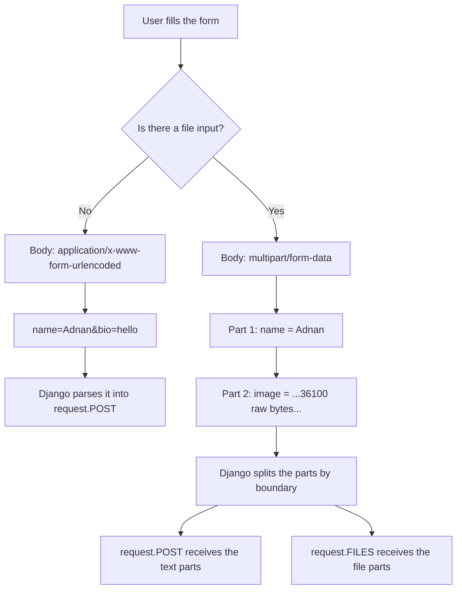

# 🚀 A038 — File & Image Upload

`📖 Lecture A038` · `🎓 Track: Core Django` · `📶 Level: Intermediate` · `✅ Status: Documented`

> [!NOTE]
> **About this chapter's sources:** No lecture transcript exists in the folder. The chapter is
> built from two primary sources: **(1)** the owner's command journal `commands.txt`, whose only
> new line for this lecture is `pip install Pillow` (line 91 — the dependency an `ImageField`
> refuses to work without), and **(2)** the `myProject22/` artifact — a Django 6.1.1 project with
> an `accounts` app holding a `Profile` model, a `ProfileForm` ModelForm, two views, three
> templates, one migration and one **real uploaded image** already sitting in `media/profiles/`.
> Every file quoted below is reproduced verbatim from that artifact.
>
> This chapter was **verified live**, not just read: the artifact was booted, both pages were
> requested, a real image was uploaded end-to-end (302 → success message), a filename collision
> was triggered, and a row was deleted to see whether its file survived. The transcript of those
> runs appears in the "Live verification" callout. Anything supplementary to the artifact is
> marked 📌.
>
> This lecture builds directly on [A029 — HTML Forms, POST, CSRF Token & Validation](../A029_HTML_Forms_POST_CSRF_Token_&_Validation/README.md)
> (the POST/`request.POST` half of a request) and [A037 — Django Authentication: User Signup, Login & Restrict Pages](../A037_Django_Authentication_User_Signup_Login_&_Restrict_Pages/README.md)
> (the artifact it is the direct successor of — `myProject21` → `myProject22`).

---

## 🧭 What You Will Learn

- [ ] Why a file upload is a *different kind of HTTP request* — and what `enctype="multipart/form-data"` actually changes
- [ ] How `FileField` and `ImageField` store a file's **path in the database** and its **bytes on disk**
- [ ] Why `ImageField` hard-requires Pillow, and exactly what Django raises when it is missing
- [ ] The division of labour between `MEDIA_ROOT` (a filesystem path) and `MEDIA_URL` (a web address)
- [ ] How to bind a file to a ModelForm with `ProfileForm(request.POST, request.FILES)`
- [ ] How to serve uploaded media during development with `static()` — and why that helper is DEBUG-only
- [ ] How `{{ profile.image.url }}` turns a stored path into a working ``
- [ ] The upload failure modes no tutorial mentions: collisions, orphans, `.url` on a blank field, unvalidated content, media in version control

## 🎯 Why This Lecture Matters

Every lecture so far has moved **text** — a name, an age, a message, a password. Text is cheap,
small, and fits happily inside a URL-encoded request body. A file is none of those things: it is
binary, potentially enormous, and cannot be safely represented as `name=value&name2=value2`.

This is the lecture where the request body itself changes shape. That single change cascades
through every layer of the stack: the HTML form needs a new attribute, Django needs a parser to
split the body into parts, the view needs a **second** data source (`request.FILES`) alongside
`request.POST`, the ORM needs a field type that stores a *pointer* rather than content, and the
project finally needs two settings it has never needed before (`MEDIA_ROOT`, `MEDIA_URL`) plus a
URL route to serve the bytes back out.

Practically every real application is "CRUD plus files" — avatars, resumes, product photos, CSV
imports, invoices. If you can build this lecture's `Profile` uploader, you can build the file half
of any of them. Skip it and you will spend your first real project debugging three symptoms that
look like bugs but are actually design: *"the form says Image is required"*, *"the image saves but
shows as a broken icon"*, and *"my uploads vanished when I deployed."* This chapter makes those
three impossible.

## ✅ Prerequisites

- [ ] HTML forms, POST, ``, `request.POST.get()` — A029
- [ ] ModelForms: `class Meta`, `fields`, `is_valid()`, `form.save()` — A031
- [ ] Creating models and running `makemigrations` / `migrate` — A022, A027
- [ ] Template inheritance (``, ``) — A012, A016
- [ ] The messages framework (`messages.success` / `messages.error`) — A035
- [ ] `settings.py` and `urls.py` wiring, `include()` — A007
- [ ] 📌 Comfort running one terminal command to install a Python package (A003)

---

## 🧠 The Three-Part Problem — Why Files Are Not "Just Another Field"

A text upload and a file upload fail in completely different places. It is worth naming the three
independent problems before solving any of them, because beginners tend to solve one, assume the
other two are free, and then feel like Django is being arbitrary.

| # | The problem | Naive hope | The actual answer |
|---|---|---|---|
| **1** | **Encoding** — a file's bytes cannot be safely packed into `key=value&key2=value2` | "I'll just add a `FileField`" | The form must switch to `enctype="multipart/form-data"` so the browser sends a **multipart** body |
| **2** | **Storage** — a 4 MB JPEG does not belong in a database column | "The database will handle it" | The **bytes** go to a folder (`MEDIA_ROOT` + `upload_to`); the **database stores only the resulting path string** |
| **3** | **Delivery** — the browser needs a URL to fetch the bytes | "It will show up automatically" | Django needs `MEDIA_URL` plus a route mapping that URL prefix to the folder |

Here is where each problem lives in this lecture's artifact. Notice that the three problems map to
three **different files** — which is exactly why they are so easy to half-solve:

```text
Problem 1  Encoding  →  accounts/templates/accounts/upload_profile.html  (enctype="multipart/form-data")
Problem 2  Storage   →  accounts/models.py + myProject22/settings.py     (ImageField(upload_to='profiles/') + MEDIA_ROOT)
Problem 3  Delivery  →  myProject22/settings.py + myProject22/urls.py    (MEDIA_URL + static() route)
                        accounts/templates/accounts/view_profile.html      ({{ profile.image.url }})
```

**The mental shift:** in A031–A037 the model column *was* the data. Here the model column is a
**receipt** — proof of where the data lives — while the data itself lives in a folder. Grasping
that split is the whole lecture.

### The two request bodies, side by side

Before any Django code, look at what the browser actually sends. This is the reason `request.POST`
alone can never work for a file:



Read the bottom branch twice. A multipart body is a **container of labelled parts**, and Django's
parser deliberately routes those parts into **two separate objects**. Nothing in Django ever merges
them for you. That is why almost every real-world upload bug is really "the file landed somewhere
my view was not looking."

---

## 🧠 1 — `enctype` — The One Attribute Nothing Else Can Fix

### The concept

An HTML `<form>` has always had a default way of packing its fields into a request body:
`application/x-www-form-urlencoded`. In that format everything is squeezed into a string of
`key=value` pairs joined by `&`, with special characters percent-encoded. It is perfect for text
and **physically incapable** of carrying a JPEG, because there is no way to say "these next
40,000 bytes are raw binary and not part of my keys or values."

`enctype` (encoding type) is the form's instruction to the browser: *use a different packaging*.
Setting it to `multipart/form-data` makes the browser build a **MIME multipart body** — a sequence
of independent, explicitly-labelled chunks (a "boundary" string separates them). Text fields become
small text parts; a file input becomes a part containing the file's raw bytes and its original
filename.

Django's `MultiPartParser` then walks those parts and splits them: text parts → `request.POST`,
file parts → `request.FILES`. **Both of those are consequences of the attribute.** Without
`enctype`, there are no file parts, so `request.FILES` is empty — and Django's form validation
reports it exactly as it would report a field you simply never filled in.

### The artifact's form, verbatim

`accounts/templates/accounts/upload_profile.html`:

```html


    <h2>Upload Profile</h2>
    <form method="post" enctype="multipart/form-data">
        
        {{ form.as_p }}
        <button type="submit">Upload</button>
    </form>

```

**Explanation of the load-bearing lines:**

- `method="post"` — a file upload is always a POST. A GET request has no body, and a file lives in
  the body. (Technically a GET *may* have a body, but browsers never generate one from a form.)
- `enctype="multipart/form-data"` — **the line this entire lecture hangs on.** Delete it and the
  page still renders, the button still submits, and the upload silently fails validation.
- `` — unchanged from A029. Uploads get no CSRF exemption; the token is still
  required or the POST is rejected with 403.
- `{{ form.as_p }}` — renders the *fields* only. It does **not** render the surrounding `<form>`
  tag, so Django cannot inject `enctype` for you. This is why writing the tag by hand and using
  `as_p` together is the normal pattern.

### What the browser actually renders

Requesting `/upload/` from the live artifact returned this form (only the CSRF value trimmed):

```html
<form method="post" enctype="multipart/form-data">
    <input type="hidden" name="csrfmiddlewaretoken" value="…">
    <p>
    <label for="id_name">Name:</label>
    <input type="text" name="name" maxlength="100" required id="id_name">
    </p>
    <p>
    <label for="id_image">Image:</label>
    <input type="file" name="image" accept="image/*" required id="id_image">
    </p>
    <button type="submit">Upload</button>
</form>
```

Two details are worth noticing, because they come from `ImageField` rather than from any code the
---

## 🧠 2 — `ImageField` vs `FileField` — A Path Stored, Bytes Relocated

### The concept

`FileField` is Django's "there is a file involved" field, and its single most important property is
what it *does not* do: it does not put the file in the database. When a form carrying a file is
saved, Django hands the bytes to a **storage backend** (by default
`django.core.files.storage.FileSystemStorage`), which writes them into a folder, and then writes
the file's **relative path** into the database column. That column is a `varchar`. Always has been.

`ImageField` is a `FileField` with an extra promise bolted on: *the thing at this path is a real,
loadable image*. To keep that promise Django needs a library that can actually decode image files
— and that library is **Pillow**. Hence the journal's line 91, `pip install Pillow`.

### From the artifact

`accounts/models.py` — quoted verbatim, comments included:

```python
from django.db import models

# Create your models here.
class Profile(models.Model):
    name = models.CharField(max_length=100)
    image = models.ImageField(upload_to='profiles/')

    def __str__(self):
        return self.name
```

Three things are doing real work here:

- `upload_to='profiles/'` — the sub-folder **inside** `MEDIA_ROOT` where the bytes land. It is not
  a URL, not an absolute path, and not a filename. Django joins it with the sanitised original
  filename. (📌 It also accepts `strftime` patterns like `'uploads/%Y/%m/'` to bucket files by
  date, or a callable for fully custom naming — neither is used in this lecture.)
- `ImageField` rather than `FileField` — buys the Pillow-backed "is this really an image?" check.
- `__str__` — unrelated to uploading, but it is why the admin *would* render rows readably if the
  model were registered (it is not — see the artifact notes at the end).

The migration was generated by Django, not written by hand — proof that this is an ordinary schema
change:

```python
# Generated by Django 6.1.1 on 2026-09-17 08:28

# accounts/migrations/0001_initial.py
class Migration(migrations.Migration):
    initial = True
    dependencies = []
    operations = [
        migrations.CreateModel(
            name='Profile',
            fields=[
                ('id', models.BigAutoField(auto_created=True, primary_key=True, serialize=False, verbose_name='ID')),
                ('name', models.CharField(max_length=100)),
                ('image', models.ImageField(upload_to='profiles/')),
            ],
        ),
    ]
```

Note that `upload_to` is part of the migration state. Changing it later is a migration; the old
files are **not** moved. That is a preview of the orphan problem in §7.

### Why Pillow is a hard dependency, not a nice-to-have

Django ships no image decoder. It refuses to pretend otherwise. With `ImageField` present and
Pillow missing, Django's system checks fail with a first-class error (this is Django 6.1's exact
wording, read from `django/db/models/fields/files.py`):

```text
fields.E210: Cannot use ImageField because Pillow is not installed.
    HINT: Get Pillow at https://pypi.org/project/Pillow/ or run command
          "python -m pip install Pillow".
```

That check fires on `manage.py check`, `makemigrations`, `migrate`, `runserver` — anything that
runs the check framework. In the development environment used to verify this chapter the versions
are:

```text
django 6.1.1
Pillow 12.3.0
Python 3.14.6
```

### What the promise actually buys you (live-verified)

The "is it an image?" promise is enforced on the **form** field, which is where user input arrives.
Two probes, both run against the artifact's real `ProfileForm`:

```text
real PNG valid? True {}
fake image valid? False
  {"image": [{"message": "Upload a valid image. The file you uploaded was either not an image or
              a corrupted image.", "code": "invalid_image"}]}
```

The second probe uploaded `b'this is not an image'` with the filename `evil.webp` and the content
type `image/webp` — a text file wearing an image disguise. Django opened it with Pillow, failed to
decode it, and rejected the form with error code `invalid_image`.

This is the single most important security fact in the lecture:

> [!IMPORTANT]
> **Extension and content type are attacker-controlled strings. Only the decoded content is
> evidence.** `evil.webp` *looked* like an image by name and by MIME type and was still rejected,
> because Django asked Pillow to actually open it. A `FileField` would have accepted the same
> bytes without complaint — that is the difference `ImageField` is worth installing for.

owner wrote:

- `type="file"` — the widget Django picks for a file field.
- `accept="image/*"` — a browser-side hint that only images should be offered in the file picker.
  📌 This is a **convenience, not a security control** — it filters the file dialog; it stops
  nothing. Real validation happens server-side (see §2).

`maxlength="100"` on the text input comes from `CharField(max_length=100)` — the form field
mirrors the model field. `required` on both inputs appears because neither model field allows
blank. That is the same model→form derivation chain you met in A031, now extended to files.

> [!WARNING]
> **The classic failure, reproduced.** Posting the form without choosing a file produced this in
> the live run:
>
> ```html
> <ul class="errorlist" id="id_image_error"><li>This field is required.</li></ul>
> <input type="file" name="image" accept="image/*" required aria-invalid="true"
>        aria-describedby="id_image_error" id="id_image">
> ```
>
> "This field is required" is the message you see when `enctype` is missing, when the user truly
> picked no file, and when the field name in the form does not match the field name in the form
> class. Three different causes, one message. When you meet it, check `enctype` first.
---

## 🧠 3 — `MEDIA_ROOT` and `MEDIA_URL` — Bytes on Disk vs Address on the Web

### The concept

This is the pair of settings that trips up more beginners than anything else in the lecture,
because both have "media" in the name and both are needed, yet they describe two different worlds:

| Setting | Answers | Lives in | Example value from the artifact |
|---|---|---|---|
| `MEDIA_ROOT` | *Where on the filesystem do the bytes go?* | The server's disk (Python's `os`/`pathlib` world) | `D:\AllProgram\...\myProject22\media` |
| `MEDIA_URL` | *What URL prefix does the browser use to fetch them?* | The web (Django's URL world) | `/media/` |

`MEDIA_ROOT` is never seen by a browser. `MEDIA_URL` never touches the disk. Django is the only
thing that knows both, and its whole job in the middle is to translate one into the other.

The artifact sets them at the very bottom of `myProject22/settings.py` — the last two lines of the
file, which is the conventional place for them:

```python
# myProject22/settings.py — verbatim (final two lines)
MEDIA_URL = '/media/'
MEDIA_ROOT = os.path.join(BASE_DIR, 'media')
```

And the resolved value at runtime, read from the live artifact:

```text
MEDIA_URL  = '/media/'
MEDIA_ROOT = 'D:\\AllProgram\\LEARN\\Python\\Django\\A038_File_&_Image_Upload\\myProject22\\media'
```

Two small observations on that snippet:

- `os.path.join(BASE_DIR, 'media')` is the classic idiom, and it is why `import os` had to be
  present near the top of `settings.py`. 📌 The rest of this same file uses the newer pathlib style
  (`BASE_DIR / 'templates'` in `TEMPLATES['DIRS']`, `BASE_DIR / 'static'` in `STATICFILES_DIRS`).
  Both work; modern Django writes `MEDIA_ROOT = BASE_DIR / 'media'`. The artifact mixing them is a
  fossil of following different tutorials in different years, not a bug.
- `MEDIA_URL = '/media/'` **must end with a slash** — the storage machinery concatenates it with
  the relative file name, and a missing slash produces broken URLs like `/mediaprofiles/x.webp`.

### Where the bytes actually go

The full journey, using this artifact's real values, one file at a time:


Everything after `disk: …` in the top branch and everything in the bottom branch are the
**consequences of the settings** in this section. Follow the arrow labelled `MEDIA_URL + stored
path`: that is the entire delivery mechanism. Change `MEDIA_URL` and every stored path stays valid
while every generated URL changes — because a URL is computed at render time, never stored.

### The two-settings checklist

> [!TIP]
> When setting up media in any Django project, verify all four of these, in this order:
>
> 1. `MEDIA_URL` exists and ends with `/`.
> 2. `MEDIA_ROOT` exists and points **outside** `STATIC_ROOT` (media is user data; static is code
>    you ship — mixing them means one `collectstatic` can wipe uploads).
> 3. `MEDIA_URL` is distinct from `STATIC_URL`.
> 4. In development, the `static()` route from §5 is wired **and** `DEBUG=True`.

> [!WARNING]
> **`MEDIA_URL` alone serves nothing.** It is a string. It becomes usable only when something maps
> it to a view. In this artifact that mapping is the three-line block in `myProject22/urls.py`
> (next section). Without it, `{{ profile.image.url }}` still renders a perfectly correct
> `/media/profiles/…` path — and every one of those URLs returns **404**. A correct URL to a page
> that does not exist looks exactly like a broken image. That is failure mode #2 from the chapter
> intro.

---

## 🧠 4 — The Two Halves: `request.POST` **and** `request.FILES`

### The concept

By the time your view runs, Django has *already* parsed the multipart body and already split it in
two. Your job is simply to hand **both halves** to the form. Miss the second half and everything
looks fine until validation, where the file field reports "This field is required."

Think of the form as a machine with two intake slots, and `ModelForm.__init__` takes them in a fixed
order:

```text
ProfileForm(data, files)
             │      └── request.FILES → the binary parts
             └───────── request.POST  → the text parts
```

That order — **data first, files second** — is not a convention you can swap. `data` is the first
positional parameter of `BaseForm.__init__`, and `files` is the second.

### The artifact's view, verbatim

`accounts/views.py`:

```python
from django.shortcuts import render, redirect
from .forms import ProfileForm
from .models import Profile
from django.contrib import messages

# Create your views here.
def upload_profile(request):
    if request.method == 'POST':
        form = ProfileForm(request.POST, request.FILES)
        if form.is_valid():
            form.save()
            messages.success(request, 'Profile uploaded successfully!')
            return redirect('view_profile')
        else:
            messages.error(request, 'Error uploading profile. Please try again.')
    else:
        form = ProfileForm()
    return render(request, 'accounts/upload_profile.html', {'form': form})

def view_profile(request):
    profiles = Profile.objects.all()  
    return render(request, 'accounts/view_profile.html', {'profiles': profiles})
```

**Line-by-line, with attention on what is new versus what A029/A031 already taught:**

- `if request.method == 'POST':` — unchanged A029 pattern: one view, two branches.
- `ProfileForm(request.POST, request.FILES)` — **the new line.** Everything about the upload
  depends on this single expression. `request.POST` carries `name`; `request.FILES` carries the
  bytes of `image`. Both are needed for `is_valid()` to be meaningful.
- `form.is_valid()` — unchanged, but now doing more work: the `ImageField` form field has opened
  the uploaded bytes with Pillow and rejected them if they are not a real image (verified in §2).
- `form.save()` — unchanged call, new meaning. For a text ModelForm this is one INSERT; for a file
  it is two operations: **storage writes the bytes, then the row is written with the resulting
  path**. Here is where `upload_to='profiles/'` finally gets applied (§7 shows the exact name that
  landed).
- `messages.success(...)` + `return redirect('view_profile')` — unchanged A035/A031 pattern
  (Post/Redirect/Get). This view deliberately sends the user to the gallery, not back to the form:
  a freshly uploaded image is more useful to *look at* than to re-upload.
- `else: messages.error(...)` — fires when validation fails. Live-verified: this message renders in
  `base.html`'s message loop and the user stays on the form with their text input preserved and the
  image error displayed.
- `else: form = ProfileForm()` — the GET branch: an unbound, empty form.
- `profiles = Profile.objects.all()` — the read half. Same `objects.all()` + context pattern as
  A025/A032; here the rows carry file pointers.

> [!NOTE]
> **`request.FILES` is populated only on POST with `multipart/form-data`.** On a GET it is empty; on
> a POST without the right `enctype` it is empty; on a POST with a JSON or urlencoded body it is
> empty. An empty `request.FILES` is not an error state — it is simply a request that carried no
> file parts, and Django faithfully reports the form's file fields as unfilled.

### The form, verbatim

`accounts/forms.py` — the whole file:

```python
from django import forms
from .models import Profile

class ProfileForm(forms.ModelForm):
    class Meta:
        model = Profile
        fields = ['name', 'image']
```

There is nothing file-specific in this file. That is the point of a ModelForm: `model = Profile`
plus `fields = ['name', 'image']` is enough for Django to build a `CharField` for `name` and an
**`ImageField`** *form* field for `image`, with the right widget, the right `accept="image/*"` hint,
the right requiredness, and Pillow-backed validation. No `forms.FileField()` was declared anywhere.
A031 taught the derivation; here it silently produces a file input.

### The URL wiring, verbatim

`accounts/urls.py`:

```python
from django.urls import path
from . import views

urlpatterns = [
    path('upload/', views.upload_profile, name='upload_profile'),
    path('profile/', views.view_profile, name='view_profile')
]
```

`myProject22/urls.py` — the project URLconf, including the media route dissected in the next
section:

```python
from django.contrib import admin
from django.urls import path, include
from django.conf import settings
from django.conf.urls.static import static

urlpatterns = [
    path('admin/', admin.site.urls),
    path('', include('accounts.urls')),
]

if settings.DEBUG:
    urlpatterns += static(settings.MEDIA_URL, document_root=settings.MEDIA_ROOT)
```

Because the app is mounted at `''`, its routes are served at the project root — verified live:

```text
reverse('upload_profile') = /upload/
reverse('view_profile')   = /profile/
```

 The app URLconf has no `app_name`, so the templates reverse bare names
(``) — the same convention A029–A037 followed.

---

## 🧠 5 — Serving the Bytes: `static()` and Its DEBUG-Only Nature

### The concept

Storing the file is §3's job. *Serving* it — answering `GET /media/profiles/x.webp` with the actual
bytes — is a separate concern, and Django's honest answer is: **"not my job in production."**

In production a real web server (nginx, Apache), a CDN, or object storage serves media, because that
is what they are built and tuned for. Django's `runserver` is a development toy and makes no attempt
to be a file server. So Django ships a stop-gap for exactly one scenario — **DEBUG mode on your own
machine** — and names it after that limitation: `django.conf.urls.static.static()`.

Its implementation (read from the installed Django 6.1.1) is shorter than the paragraph above, and
the first branch is the whole lesson:

```python
def static(prefix, view=serve, **kwargs):
    if not prefix:
        raise ImproperlyConfigured("Empty static prefix not permitted")
    elif not settings.DEBUG or urlsplit(prefix).netloc:
        # No-op if not in debug mode or a non-local prefix.
        return []
    return [
        re_path(
            r"^%s(?P<path>.*)$" % re.escape(prefix.lstrip("/")), view, kwargs=kwargs
        ),
    ]
```

- `if not settings.DEBUG … return []` — **the helper returns an empty list of routes outside DEBUG.**
  It disarms itself. That is why the artifact's `if settings.DEBUG:` guard around it is technically
  redundant: even unguarded, `static()` would contribute nothing in production. The guard is still
  the documented style and is harmless — it makes the intent readable in `urls.py` alone.
- `urlsplit(prefix).netloc` — the helper also refuses responsibility for a *remote* prefix. Point
  `MEDIA_URL` at `https://cdn.example.com/media/` and `static()` returns `[]`, because Django is not
  going to proxy another host. 📌 This is the seed of the production answer.
- `view=serve` — `django.views.static.serve`, the actual byte-streaming view.
- The regex escapes `MEDIA_URL`, strips its leading slash, and captures everything after it into a
  `path` group.

### What the artifact's route does, live

The route exists only because `DEBUG = True`, and the file it serves is the real one already sitting
in the artifact's media folder. Requested through the live stack:

```text
GET /media/profiles/maulana_azad_img.webp
  → status 200 | content-type image/webp | bytes 36100
```

The delivery loop, closed. A URL under `MEDIA_URL`, resolved by the injected `serve` route, streaming
36,100 bytes off the disk at `MEDIA_ROOT`. The storage class reported by the ORM for that row was
`FileSystemStorage` — the default backend, the one whose `MEDIA_ROOT` this route was pointed at.

> [!CAUTION]
> **Django's own documentation is blunt about `serve()`: it is "grossly inefficient and insecure."**
> It performs no authentication, no range-request optimisation, and no caching directives, and it
> ties up a Python worker per download. It is acceptable for exactly one user: you, on `127.0.0.1`,
> while developing. Deploying with the `static()` route live is one of the most common ways real
> Django sites leak every file they hold — including uploads nobody intended to be public.
>
> 📌 The production shapes of this problem — nginx `location`/`alias` blocks, WhiteNoise for small
> sites, S3/GCS-backed storage classes, signed URLs for private files — are out of this lecture's
> scope. But the fourth chapter-intro failure mode ("my uploads vanished when I deployed") is almost
> always this section: `DEBUG=False`, therefore no media route at all, therefore 404 on every image
> that worked perfectly on the developer's machine.

### Why the settings and the route must agree

`static()` builds its regex from `settings.MEDIA_URL` and its `document_root` from
`settings.MEDIA_ROOT`. Point them at different folders or prefixes and nothing raises an error —
you simply get 404s, or worse, a route that serves a *different* directory than the one uploads
land in. This is the one place in Django where two unrelated settings are wired together by string
concatenation, with no validation. Treat them as a matched pair.
---

## 🧠 6 — Reading Uploads Back: `{{ profile.image.url }}` and the `FieldFile` API

### The concept

The database stored a bare relative path — `profiles/maulana_azad_img.webp`. That string is useless
to a browser. What the browser needs is `/media/profiles/maulana_azad_img.webp`.

Django bridges the gap without storing a URL anywhere: when you access `profile.image`, you do not
get a string. You get a **`FieldFile`** — a lazy wrapper that knows its storage backend and can
compute a URL on demand. `.url` is a *property*, not a column. It is calculated as
`storage.url(stored_path)` → `MEDIA_URL + stored_path`, fresh on every render.

That design decision is why you can move a project from local disk to S3 by changing settings and
**no data at all**: the stored paths stay valid; only the computed URL prefix changes.

### The artifact's template, verbatim

`accounts/templates/accounts/view_profile.html`:

```html


    <h2>View Profile</h2>
    
    <ul>
        
            <li>{{ profile.name }} <br>
                 
            </li>
        
    </ul>

```

The render, live from the artifact — note the `src`:

```html
<ul>

        <li>Adnan <br>
            
        </li>

</ul>
```

`{{ profile.name }}` is an A013-style dot lookup on a normal column. `{{ profile.image.url }}` is a
dot lookup that **calls a property on a `FieldFile`**. Both look identical in a template, which is
what makes the second one surprising the first time.

And `accounts/templates/accounts/base.html`, verbatim — the shared frame that makes this page two
lines longer than it looks:

```html
<!DOCTYPE html>
<html lang="en">
<head>
    <meta charset="UTF-8">
    <title>Django File & Image Upload</title>
</head>
<body>
    <a href="">Upload Profile</a> |
    <a href="">View Profile</a>

    <hr>
    
        <ul>
            
                <li>{{ message }}</li>
            
        </ul>
    

    
    
</body>
</html>
```

This is A012/A016 inheritance plus the A035 message loop, doing exactly what those lectures promised:
one frame, two pages, and a place for `messages.success`/`messages.error` to appear.

### The `FieldFile` toolbox

Everything the ORM hands you for a file column. Only `.url` is used in this artifact; the rest is
📌 reference you will need the moment uploads become editable or deletable.

| Access | Returns | Live value for the artifact's row |
|---|---|---|
| `profile.image` | a `FieldFile` instance | `<ImageFieldFile: profiles/maulana_azad_img.webp>` |
| `.name` | the stored **relative path** (what is in the DB) | `'profiles/maulana_azad_img.webp'` |
| `.url` | `MEDIA_URL` + `.name` | `'/media/profiles/maulana_azad_img.webp'` |
| `.path` | absolute filesystem path (`MEDIA_ROOT` + `.name`) | `D:\...\myProject22\media\profiles\maulana_azad_img.webp` |
| `.size` | size in bytes, read from storage | `36100` |
| `.storage` | the backend instance | `FileSystemStorage` |
| `.open()` / `.read()` / `.close()` | file-like access to the bytes | 📌 |
| `.delete(save=True)` | deletes the file *and* updates the row | 📌 |
| `.save(name, content)` | writes new bytes under a new name | 📌 |

> [!WARNING]
> **`.url` on an empty file field raises `ValueError`.** If a model allows a blank file
> (`FileField(blank=True)`), then some rows have no file, and `{{ row.file.url }}` on one of them
> crashes the whole template with `ValueError: The 'file' attribute has no file associated with
> it.` — one bad row taking down the page for every row. The guard is a template condition:
>
> ```html
> 
>     
> 
>     <span>No image uploaded yet</span>
> 
> ```
>
> This artifact escapes the trap by accident of design: `models.ImageField(upload_to='profiles/')`
> has `blank=False`, so `required: True` on the form (live-verified) means every saved row is
> guaranteed to have a file. **The moment you add `blank=True` to that field, the guard above becomes
> mandatory** — and one unguarded page will start returning 500s on rows created long after you
> stopped looking.

📌 Two smaller points on this template: `width="100" height="100"` are HTML attributes that force a
square regardless of the image's aspect ratio (CSS `object-fit`/`max-width` is the modern approach),
and there is no `alt` attribute on the `` — a one-word accessibility gap worth fixing in any
real project. `ImageField` can also populate `width_field`/`height_field` model columns
automatically if you need the pixel dimensions queryable without opening the file.
---

## 🧠 7 — One Upload, End to End — With the Surprises It Produces

### The artifact's real, stored row

The `myProject22` artifact came with exactly one upload already made. Read from the live database,
every value as the ORM reports it:

```text
count = 1
id=1  name='Adnan'  image.name='profiles/maulana_azad_img.webp'
      image.url='/media/profiles/maulana_azad_img.webp'   size=36100
      image.path=D:\...\myProject22\media\profiles\maulana_azad_img.webp  (exists = True)
      storage=FileSystemStorage
```

Three facts sit in that block, and each one is a lecture in miniature:

1. `image.name` is **`profiles/…`** — the `upload_to` prefix from `models.py` is *part of the stored
   value*. The database column literally contains the sub-folder.
2. `image.name` is **not** a URL and `image.url` is **not** in the database. One is stored, the other
   computed.
3. `image.path` exists on disk. The row and the bytes are two separate objects that happen to agree.

### The live verification run

Rather than trust the code, the whole flow was exercised end-to-end. Below is the actual output of
that run, then what each line proves:

```text
POST /upload/ (name=ProbeRow, real PNG)         → status 302 | redirect to /profile/
                                                  row count 2 | names ['Adnan', 'ProbeRow']
                                                  new row: image.name='profiles/probe.png'
                                                           image.url='/media/profiles/probe.png'
                                                  file on disk = True | bytes = 101

POST /upload/ (same filename 'probe.png' again) → status 302
                                                  second stored name = 'profiles/probe_IBTliwB.png'

POST /upload/ with follow=True                  → final status 200
                                                  redirect chain [('/profile/', 302)]
                                                  success message rendered? True

row.delete()                                    → file still on disk? True

cleanup                                         → rows now 1 | remaining ['Adnan']
                                                  media/profiles = ['maulana_azad_img.webp']
```

What each measurement establishes:

- **`status 302 | redirect to /profile/`** — the happy path, and Post/Redirect/Get doing its job. A
  refresh after this lands on the gallery, not a re-POST.
- **`image.name='profiles/probe.png'`** — the `upload_to` prefix is applied by the **storage**, at
  save time. The form's cleaned value was still the bare `'probe.png'` (verified separately); the
  sub-folder appears only when the bytes hit the disk. That is why a wrong `upload_to` shows up as a
  wrong *stored path*, never as a form error.
- **`probe.png` → `probe_IBTliwB.png`** — the surprise that catches everyone. Django **never
  overwrites** an existing file. When the target name is taken, `Storage.get_available_name()` asks
  `get_alternative_name()`, whose implementation (read from the installed Django) is:

  ```python
  def get_alternative_name(self, file_root, file_ext):
      """Return an alternative filename, by adding an underscore and a random 7
      character alphanumeric string (before the file extension, if one exists)."""
      return "%s_%s%s" % (file_root, get_random_string(7), file_ext)
  ```

  Underscore plus a random 7-character string, before the extension — exactly what the run produced.
  **Practical consequence:** you can never assume "same filename = same file." Two users who both
  upload `avatar.png` get two rows pointing at two different files, and neither overwrites the
  other. Deleting by guessing a filename is impossible; you must go through the stored path.
- **`success message rendered? True`** — following the redirect shows "Profile uploaded
  successfully!" from the message loop in `base.html`. The message survived the redirect because it
  lives in the session (A035's whole mechanism).
- **`row.delete() → file still on disk? True`** — **the biggest trap in the lecture, proved.**
  Deleting a model instance does *not* delete its file. Django has no idea whether the file is
  shared, referenced elsewhere, or meant to outlive the row, so it does nothing. Every deleted
  profile leaves an orphan in `media/profiles/` forever, growing silently.

> [!IMPORTANT]
> **Orphans are a design decision you must make explicitly, not a bug Django forgot.** Two common
> answers:
>
> ```python
> # Option 1 — delete the file yourself, when you know it is safe
> profile.image.delete(save=False)   # remove the bytes first
> profile.delete()                   # then the row
>
> # Option 2 — accept orphans, sweep them up later
> #   (a management command comparing media/ contents against the DB)
> ```
>
> The same logic applies to **replacing** an image: an edit form that swaps the picture writes a new
> file and leaves the old one behind. Nothing warns you. Storage only ever grows.
### Artifact observations

Recorded honestly, in the style this series uses for real artifacts — these are properties of the
material, not invented criticism:

| # | Observation | Consequence |
|---|---|---|
| 1 | `accounts/admin.py` is still the bare stub. Live: `admin.site._registry` = `['Group', 'User']` — **`Profile` is not registered.** | Uploads cannot be browsed, searched, or cleaned up in the admin. The model's `__str__` (written, and correct) is never used. One line — `admin.site.register(Profile)` from A027 — would fix it. |
| 2 | `STATICFILES_DIRS = [BASE_DIR / 'static']` but no `static/` folder exists on disk. Live check: `staticfiles.W004: The directory '…\myProject22\static' in the STATICFILES_DIRS setting does not exist.` | A recurring fossil inherited from A010 onward — this project uses **no** static assets, so the entry travelled with the tutorial. Harmless but noisy: every `check`/`migrate`/`runserver` prints it. |
| 3 | `settings.py` ends with `MAILERS = {...}`; 📌 the real setting is `EMAIL_BACKEND`, and `MAILERS` is not a Django setting at all. Live: `has EMAIL_BACKEND = False`. | Inert configuration. Irrelevant here (no email in this lecture), but it is the same inert block A010→A037 carried. |
| 4 | `MEDIA_ROOT` uses `os.path.join(BASE_DIR, 'media')` while `DIRS`/`STATICFILES_DIRS` use pathlib (`BASE_DIR / '…'`). | Cosmetic inconsistency; both resolve identically. Modern style is pathlib throughout. |
| 5 | `accounts/urls.py` has no `app_name`. | Templates reverse bare names. Consistent with A029–A037; becomes a real problem only when two apps share a route name. |
| 6 | `view_profile` is completely public — no `@login_required`, no ownership check. | Anyone who knows `/profile/` sees every uploaded image. A037 already taught the fix (`@login_required(login_url='login')`). Worth naming because "media is public by default" is a genuine, easily-forgotten property of this design. |
| 7 | No size, dimension, or content policy beyond `ImageField`'s "is it decodable?" check. Live settings: `FILE_UPLOAD_MAX_MEMORY_SIZE = 2621440` (2.5 MB), `DATA_UPLOAD_MAX_MEMORY_SIZE = 2621440`, `FILE_UPLOAD_PERMISSIONS = 420` (`0o644`). | The two `…MAX_MEMORY_SIZE` values only decide *where* Django buffers a file (memory vs. a temp file) — they are **not** an upload ceiling. A 500 MB "image" is accepted if Pillow can decode it. Real limits are a production concern (📌). |
| 8 | `FileField`'s `max_length` defaults to **100** (verified in Django's source: `kwargs.setdefault("max_length", 100)`). | The stored path `profiles/maulana_azad_img.webp` is 30 characters — comfortable. But `upload_to='profiles/'` (9) plus a long original filename can exceed 100, and backends that enforce column width will truncate or error. Worth knowing before a user uploads `2026-annual-report-final-revised-v3.pdf`. |
| 9 | `.gitignore` contains `**/media/*` (owner-edited in this chapter's commit; previously `*/media/*`). | **Uploaded bytes are never committed.** The media folder arrives in git as structure only; each developer's uploads stay local, and the `db.sqlite3` that references them is ignored too. Consistent — but a fresh clone has rows pointing at files it does not have. |

Observations 6–9 are the ones to carry into a real project. 1–5 are inherited fossils of the
tutorial sequence.

📌 **Two small platform notes** verified along the way, both worth knowing when you write code
against this API: Django's test client takes uploads **inside its data dict**
(`client.post(url, {'name': x, 'image': f})`) — there is no `files=` keyword, and extra keywords
silently become WSGI environ entries; and the form itself knows it needs multipart —
`ProfileForm().is_multipart()` returns `True` (📌 the programmatic twin of `enctype`, useful when a
`<form>` tag is generated by a mixin rather than typed by hand).
---

## 🧱 Important Vocabulary

| Term | Simple meaning | Technical meaning | 🧷 Memory hook |
|---|---|---|---|
| **`enctype`** | How the browser packages the body | The `<form>` attribute selecting the request encoding; must be `multipart/form-data` whenever a file input is present | The parcel's packing method |
| **`multipart/form-data`** | A body made of labelled chunks | A MIME encoding where each field/file is an independent part separated by a boundary string | A box of sealed envelopes, not one long list |
| **`request.FILES`** | The file half of a POST | A `MultiValueDict` holding the file parts of a multipart body; empty for GET, urlencoded, or non-multipart POSTs | The second intake slot |
| **`FileField`** | A column that points at a file | `models.FileField` — stores a relative path string; the bytes are written by a storage backend | The coat-check ticket |
| **`ImageField`** | A `FileField` that must be a real image | Subclass of `FileField` that requires Pillow and validates by decoding the upload | The ticket with a photo check |
| **Pillow** | The image library Django leans on | Third-party package providing the decoder `ImageField` validates with; missing → `fields.E210` | The x-ray machine |
| **`upload_to`** | Which sub-folder the bytes go in | Storage-level prefix (string, `strftime` pattern, or callable) joined with the sanitised original filename | The shelf label |
| **`MEDIA_ROOT`** | Where uploads live on disk | Absolute filesystem path used by `FileSystemStorage` | The warehouse address |
| **`MEDIA_URL`** | The web prefix for uploads | URL prefix joined with the stored relative path to build public URLs; must end with `/` | The warehouse's street sign |
| **`FileSystemStorage`** | The default storage backend | `django.core.files.storage.FileSystemStorage` — reads/writes files under `MEDIA_ROOT` | The default warehouse |
| **`FieldFile`** | The object a file column returns | Lazy wrapper exposing `.name`, `.url`, `.path`, `.size`, `.storage`, `.delete()` | The ticket that can fetch |
| **`{{ image.url }}`** | Prints where to find the file | Property computed at render time as `storage.url(name)` = `MEDIA_URL + name`; **never stored in the DB** | Calculating the address from the shelf label |
| **Filename collision suffix** | A renamed duplicate | `get_alternative_name()` returns `root_<random 7 chars>ext`, so an upload never overwrites an existing file | The duplicate gets a serial number |
| **Orphan file** | Bytes with no row | A file left in `MEDIA_ROOT` after its model instance is deleted or its image replaced — Django never cleans up | The unclaimed coat |
| **`static()` helper** | The dev-only media route | `django.conf.urls.static.static(prefix, document_root=…)` — returns `[]` unless `DEBUG` is on and the prefix is local | A temporary signpost |
| **Live verification** | Running it, not reading it | Exercising the artifact end-to-end and recording the observed values as evidence | This chapter's method |

> New terms must also be added to `docs/MEMORY.md` §2.

## 💡 Real-World Analogy

**A coat check at a theatre, not a filing cabinet.**

- The **coat** is the uploaded file — bulky, shaped however it is shaped, and impossible to fold
  into a ticket.
- **`MEDIA_ROOT`** is the **cloakroom behind the counter**: the physical room where coats actually
  hang. Customers never see it, and its address means nothing outside the building.
- **`upload_to='profiles/'`** is the **rack** inside that room — the label that says *which rail*
  your coat goes on. Racks keep a busy cloakroom from being a heap.
- **The ticket** is the database column. It is a small printed slip bearing a *relative* location —
  `rack 3, hook 12` — not the coat, and not the street address. Handing someone a ticket is handing
  them a **path**, which is precisely what `Profile.image` contains.
- **A collision** is what happens when hook 12 already holds somebody's coat. A careless attendant
  would hang yours on top (that is an overwrite, and one customer loses a coat). Django's attendant
  instead moves you to a free hook and writes the new hook number on your ticket: `probe_IBTliwB`.
  Two identical-looking coats, two different hooks, nobody robbed.
- **`MEDIA_URL`** is the **public door** the customer uses to reclaim the coat. `FieldFile.url`
  is what happens when the counter staff look at your ticket and translate "rack 3, hook 12" into a
  sign that says "go to the counter on the left." The translation happens fresh every time; the
  ticket is never reissued when the signage changes.
- **Deleting the row without deleting the file** is throwing away the ticket and leaving the coat
  hanging. The cloakroom has no way to know the coat is abandoned — it just keeps filling up. Every
  `media/` folder that has been growing for three years is a cloakroom full of unclaimed coats.
- **`static()`** is the **festival-weekend temporary sign** the venue tapes up so people can find the
  cloakroom at all. It works while the doors are open to the public (`DEBUG=True`) and while the rack
  is in this building. In production a professional signage company (nginx / a CDN / object storage)
  does this job, and the taped-up sign is taken down.
- **`enctype`** is you telling the attendant *how* you are handing the coat over. If you mime it
  instead of handing it across the counter, the coat never leaves your arm — the attendant writes
  "no coat received" (that is `This field is required.`) and you argue about it for an hour.

The analogy's load-bearing insight: **at this cloakroom the ticket and the coat are separate
objects, and Django only manages the ticket.** Everything the chapter warns about follows from that
one sentence.
## ❌ Common Beginner Mistakes

1. **Forgetting `enctype="multipart/form-data"`** — the page renders, the button submits, and the
   form comes back saying `This field is required.` for the image. Nothing about the failure points
   at the attribute, which is why it costs people hours. It is not a Django setting, a view bug, or a
   ModelForm problem — it is one HTML attribute, and no other change can substitute for it.

2. **Binding only `request.POST`** — `ProfileForm(request.POST)` compiles, runs, and validates the
   text field. The file field is reported missing, exactly as if the user had chosen nothing. The fix
   is one argument: `ProfileForm(request.POST, request.FILES)`. If your upload "works except the
   image", this is the line to look at.

3. **Putting the file in the database as bytes** — `BinaryField` exists, so it *is* technically
   possible, and it is a trap: every query that touches the table drags megabytes through the DB
   driver, backups balloon, and you lose the entire storage ecosystem (`sendfile`, range requests,
   CDNs). Files go to storage; the database keeps the path. That is why Django's field is named
   `FileField`, not `FileBlobField`.

4. **Adding `MEDIA_URL`/`MEDIA_ROOT` and expecting the images to appear** — the settings make the
   path *addressable in principle*. Without the `static()` route in `urls.py` (or a real web server
   in production), every `{{ image.url }}` resolves to a 404 and renders as a broken icon.

5. **Assuming a filename is a stable identifier** — the live run showed `probe.png` becoming
   `probe_IBTliwB.png`. Two users uploading `avatar.png` produce two files. Any code that deletes,
   replaces, or links a file by its original client-supplied name is broken; always go through the
   stored path in `image.name`.

6. **Expecting `instance.delete()` to remove the file** — live-verified: the file survives. Deleting
   10,000 profiles leaves 10,000 orphaned images. This is not a Django oversight; ownership of the
   bytes is deliberately left to you. Decide explicitly (delete the file first, or sweep orphans
   later) and write it down.

7. **Trusting the file extension or `content_type`** — a text file named `evil.webp` with
   `Content-Type: image/webp` was rejected *only* because `ImageField` asked Pillow to decode it. If
   you swap in a plain `FileField` "to also allow PDFs", you have removed the only content check in
   the pipeline and must add your own validation.

8. **Using `{{ profile.image.url }}` on a field that can be blank** — the moment `blank=True`
   appears on that model field, an empty row raises `ValueError` and takes the whole page down with
   it. Wrap it: `…`.

9. **Deploying with `DEBUG = True` and the `static()` route live** — Django's own docs call that
   view "grossly inefficient and insecure". It authenticates nothing, so it will serve private
   uploads to anyone who guesses a path. The opposite failure is equally common: flipping
   `DEBUG = False` and *never* configuring nginx or object storage, so every image 404s in
   production while working perfectly locally.

10. **Calling `ImageField` a security feature** — it verifies *decodability*, nothing else. No size
    ceiling, no dimension cap, no virus scan, no image re-encoding (📌 re-encoding with Pillow is
    what strips embedded metadata and defuses malformed-image exploits), and no access control.
    Uploaded files are public by default in this design: `view_profile` in the artifact is reachable
    by anyone.

## 🧠 Common Misconceptions

| ✅ Django's file handling IS … | ❌ It is NOT … |
|---|---|
| A **path** stored in the database | The file's bytes stored in the database |
| `MEDIA_ROOT` (disk) and `MEDIA_URL` (web) as two separate things | One setting that does both jobs |
| `request.FILES` for the binary parts, `request.POST` for the text parts | `request.POST` carrying files too |
| `ImageField` = `FileField` + a Pillow-decoded validation | An upload security/size/audit system |
| URLs computed at render time from the stored path | URLs stored alongside the file in the DB |
| `static()` a DEBUG-only, self-disarming dev helper | A production media server |
| A filename collision producing a renamed duplicate | Django overwriting the earlier file |
| Storage never deleting bytes when a row is deleted | `delete()` cleaning up files as well |
| `upload_to` applied by the storage at save time | `upload_to` validated at form time |
| `enctype` an HTML form attribute | A Django side setting you can configure in Python |
| `ImageField` requiring Pillow (`fields.E210` if absent) | Working out of the box like `CharField` |
## 🧪 Practical Example

The artifact already *is* the complete upload path. What it does not do is clean up after itself or
guard its gallery. Both gaps are worth closing here, because they are the two things every real
project adds immediately.

### Part 1 — Delete a profile **and** its file (📌 beyond the artifact)

```python
# accounts/views.py — 📌 not present in the artifact
from django.shortcuts import get_object_or_404, redirect
from .models import Profile

def delete_profile(request, pk):
    """Delete a row AND the bytes it points at.

    Order matters: remove the file while the row still exists, because
    `instance.delete()` does NOT touch storage (live-verified).
    """
    profile = get_object_or_404(Profile, pk=pk)
    if request.method == 'POST':
        profile.image.delete(save=False)   # 1. remove the bytes
        profile.delete()                   # 2. then remove the row
        return redirect('view_profile')
    return render(request, 'accounts/confirm_delete.html', {'profile': profile})
```

**Explanation of the load-bearing lines:**

- `get_object_or_404(Profile, pk=pk)` — the A032 pattern: an unknown `pk` produces a 404, not a 500.
- `profile.image.delete(save=False)` — `FieldFile.delete()` removes the file from storage.
  `save=False` says "do not write the model back to the database yet" — pointless work when the very
  next line deletes the row anyway.
- `profile.delete()` — removes the row. On its own it would have left the image orphaned.
- The `POST` guard — a destructive action must never be reachable by a GET, or a link preview bot
  will happily delete your users' data.

### Part 2 — Guard the gallery and the `.url` call (📌)

```html
<!-- accounts/templates/accounts/view_profile.html — 📌 guarded version -->

    <li>{{ profile.name }} <br>
        
            
        
            <span>No image uploaded yet</span>
        
    </li>

```

**Explanation:** the `` is what makes this template safe the moment `blank=True` is added to
the model field — without it, a single empty row raises `ValueError: The 'file' attribute has no
file associated with it.` and kills the page. The `alt` attribute costs one word and is the
difference between a gallery a screen reader can describe and one it cannot.

### Part 3 — Prove it yourself in the shell (📌)

The fastest way to build intuition for this lecture is to inspect a real `FieldFile` by hand:

```bash
py .\manage.py shell
```

```python
from accounts.models import Profile
p = Profile.objects.first()

p.image            # <ImageFieldFile: profiles/maulana_azad_img.webp>
p.image.name       # 'profiles/maulana_azad_img.webp'   ← what is in the DB
p.image.url        # '/media/profiles/maulana_azad_img.webp'  ← computed
p.image.path       # 'D:\\...\\myProject22\\media\\profiles\\maulana_azad_img.webp'
p.image.size       # 36100
p.image.storage    # <django.core.files.storage.FileSystemStorage ...>
```

Every one of those values was reproduced live in this chapter. Notice that `.url` and `.path` differ
by more than a prefix — one is a **web address**, the other a **filesystem path**, and mixing them up
is a classic source of `FileNotFoundError` (`open(p.image.url)` never works) or a stale absolute path
committed into code.
## 🎯 Interview Perspective

> [!IMPORTANT]
> > Interview cards test *understanding*, not recitation.

**Q1. Where does an uploaded file actually go when you call `form.save()`?**
A: Two places, in order. First the storage backend (by default `FileSystemStorage`) writes the bytes
into `MEDIA_ROOT` joined with `upload_to` and the sanitised filename — renaming on collision if
needed. Then Django INSERTs the row, storing only the **relative path** (`profiles/maulana_azad_img.webp`)
in the `varchar` column. The database never holds the bytes, and the URL is never stored at all — it
is computed at render time as `MEDIA_URL + name`.

**Q2. Why is `enctype="multipart/form-data"` mandatory, and what exactly breaks without it?**
A: A form's default encoding is `application/x-www-form-urlencoded`, which serialises everything as
percent-encoded `key=value` pairs and has no way to represent raw binary. `multipart/form-data`
makes the browser emit a body of boundary-separated parts. Django's `MultiPartParser` splits those
parts into `request.POST` (text) and `request.FILES` (files). Remove the attribute and no file parts
are sent, so `request.FILES` is empty and the file field fails validation with `This field is
required.` — the same message as an untouched field, which is why it is such a confusing bug.

**Q3. Why does `ImageField` require Pillow, and what error do you get without it?**
A: `ImageField` promises that the stored file is a decodable image, and Django ships no image
decoder. Pillow supplies it. Without Pillow, Django's check framework fails with `fields.E210:
Cannot use ImageField because Pillow is not installed.` plus the hint to run
`python -m pip install Pillow` — which is exactly the line in this lecture's command journal. Any
`check`, `makemigrations`, `migrate`, or `runserver` surfaces it.

**Q4. What is the difference between `MEDIA_ROOT` and `MEDIA_URL`?**
A: `MEDIA_ROOT` is an **absolute filesystem path** — where the bytes live on the server's disk.
`MEDIA_URL` is a **URL prefix** — how a browser reaches them. `MEDIA_ROOT` is never seen by a client;
`MEDIA_URL` never touches the disk. `FieldFile.url` exists to translate one into the other, and that
translation happens on every render, which is why migrating from local disk to S3 requires no data
migration.

**Q5. Why does Django never serve uploaded media in production?**
A: Because `django.views.static.serve()` is documented as "grossly inefficient and insecure" — no
authentication, no range requests, no caching, one Python worker tied up per download. Django gives
you `static()` purely as a DEBUG convenience; the source literally returns `[]` when `DEBUG` is off.
Production media belongs to nginx/Apache, a CDN, or object storage with signed URLs.

**Q6. Two users both upload `avatar.png`. What does Django store?**
A: Two different files. `Storage.get_available_name()` never overwrites: on collision it calls
`get_alternative_name()`, which returns `<root>_<random 7 chars><ext>`. The live run produced
`profiles/probe_IBTliwB.png`. Two rows, two distinct paths, no data loss — and the practical
consequence that a client-supplied filename can never be used as an identifier.

**Q7. Deleting a model instance — what happens to its file?**
A: Nothing. `instance.delete()` removes the row only. Django cannot know whether the file is shared
or meant to outlive the row, so cleanup is your responsibility: `instance.file.delete(save=False)`
before deleting, or a periodic sweep of `MEDIA_ROOT` against the database. Replacing an image on an
edit form orphans the old file the same way.

**Q8. Is `ImageField` enough validation for user uploads?**
A: No. It verifies only that Pillow can decode the bytes — which usefully defeats a text file renamed
`evil.webp` (live-verified: rejected with the `invalid_image` error code). But it does not limit size
(the two `…MAX_MEMORY_SIZE` settings only choose memory vs. temp-file buffering, both 2.5 MB here),
does not cap dimensions, does not scan for malware, and does not re-encode the image to strip
metadata and defuse malformed-file exploits. Re-encoding with Pillow is the standard hardening step,
and access control is entirely separate — the artifact's `view_profile` is public.
---

## 🔁 Active Recall

Answer from memory first, then expand each `<details>`.

1. Why does a file upload need `enctype="multipart/form-data"` when a text form does not?

<details><summary>Answer</summary>

The default encoding, `application/x-www-form-urlencoded`, can only represent percent-encoded text
`key=value` pairs — it has no way to carry raw binary. `multipart/form-data` sends a body of
boundary-separated parts, so a file becomes its own part of raw bytes plus a filename. Django's
`MultiPartParser` then routes text parts into `request.POST` and file parts into `request.FILES`.
</details>

2. What error do you get from `ImageField` when Pillow is not installed, and why does it happen?

<details><summary>Answer</summary>

`fields.E210: Cannot use ImageField because Pillow is not installed.` — raised by Django's check
framework on any `check`/`makemigrations`/`migrate`/`runserver`. `ImageField` promises the file is a
decodable image and Django ships no image decoder, so Pillow is a hard dependency. The journal line
`pip install Pillow` is exactly this requirement.
</details>

3. A user uploads `avatar.png`. You inspect the row and find `image.name = 'profiles/avatar_Ab3xY9z.png'`.
Explain every part of that string.

<details><summary>Answer</summary>

`profiles/` is the `upload_to` value from `models.py`, applied by the storage at save time.
`avatar` is the sanitised original filename. `_Ab3xY9z` is the collision suffix — `get_alternative_name()`
appends an underscore plus a random 7-character string when the target name already exists, so an
existing file is never overwritten. `.png` is the original extension. The whole string is a
**relative path**; the URL is computed later as `MEDIA_URL + this`.
</details>

4. What is the difference between `MEDIA_ROOT` and `MEDIA_URL`, and which one goes into the database?

<details><summary>Answer</summary>

Neither goes into the database. `MEDIA_ROOT` is an absolute filesystem path (where bytes are
written); `MEDIA_URL` is a URL prefix (how a browser fetches them). The database stores only the
relative path — `profiles/avatar.png` — and `FieldFile.url` computes `MEDIA_URL + path` on every
render.
</details>

5. Which two arguments must a file-aware ModelForm receive, in what order?

<details><summary>Answer</summary>

`ProfileForm(request.POST, request.FILES)` — data first, files second, matching
`BaseForm.__init__(data, files)`. Passing only `request.POST` compiles and runs but reports the file
field as empty.
</details>

6. Why does `django.conf.urls.static.static()` do nothing in production?

<details><summary>Answer</summary>

Its source returns `[]` when `not settings.DEBUG`, and also when the prefix has a netloc (a remote
host). It is deliberately self-disarming: it exists only as a development convenience. Production
needs a real web server, CDN, or object storage — Django considers its own `serve()` view "grossly
inefficient and insecure."
</details>

7. You delete a `Profile` row. What happens to the image file on disk, and what should you do about it?

<details><summary>Answer</summary>

Nothing happens — the file remains (live-verified). Django cannot know whether the file is shared or
meant to outlive the row, so it deliberately does not touch storage. Handle it explicitly:
`profile.image.delete(save=False)` before `profile.delete()`, or sweep orphans later with a
management command. Replacing an image orphans the old file the same way.
</details>

8. Does `ImageField` protect you from a malicious upload? Name what it does and does not do.

<details><summary>Answer</summary>

It asks Pillow to decode the upload, so a text file renamed `evil.webp` and sent with
`Content-Type: image/webp` is rejected (`invalid_image`) — content is checked, not the
attacker-controlled name or MIME type. It does **not** limit size, cap dimensions, scan for malware,
or re-encode the image to strip metadata and defuse malformed-file exploits, and it provides no
access control. Uploads are public by default in this design.
</details>

9. Why does `{{ profile.image.url }}` sometimes raise `ValueError`, and what is the fix?

<details><summary>Answer</summary>

When the field can be blank (`blank=True`), some rows have no associated file, and `.url` raises
`ValueError: The 'file' attribute has no file associated with it.` — crashing the whole template for
every row. Fix it with a guard: ``.
This artifact avoids it because `ImageField(upload_to='profiles/')` is `blank=False`, so the form
marks it `required`.
</details>

10. What does the database column actually contain, in one sentence?

<details><summary>Answer</summary>

A `varchar` holding the file's **relative path** under `MEDIA_ROOT` (`profiles/maulana_azad_img.webp`)
— a receipt pointing at the bytes, not the bytes themselves, and not a URL.
</details>
---

## 📝 Quick Revision

**The five-file checklist — an upload needs all five or it fails somewhere:**

| File | What must be there | Forget it and… |
|---|---|---|
| `models.py` | `ImageField(upload_to='profiles/')` | no column, no upload UI, `makemigrations` says no changes |
| `settings.py` | `MEDIA_URL`, `MEDIA_ROOT`, Pillow installed | `fields.E210`, or `AttributeError`/`ImproperlyConfigured` at save time |
| `template` (form) | `<form method="post" enctype="multipart/form-data">` | `This field is required.` on the file field |
| `views.py` | `Form(request.POST, request.FILES)` | same error — the file never reaches the form |
| `urls.py` | `static(MEDIA_URL, document_root=MEDIA_ROOT)` when `DEBUG` | images render as broken icons (404 on every `/media/…`) |

**The two-worlds table:**

| | Disk world | Web world |
|---|---|---|
| Setting | `MEDIA_ROOT` | `MEDIA_URL` |
| Example | `D:\...\myProject22\media` | `/media/` |
| Combined with | `upload_to` + filename | stored relative path |
| Reached via | `FieldFile.path` | `FieldFile.url` |
| Seen by | the server only | the browser only |

**The four "surprises", with their causes:**

| Surprise | Cause |
|---|---|
| `probe.png` stored as `probe_IBTliwB.png` | `get_alternative_name()` = `root + '_' + random 7 chars + ext` |
| Deleting the row leaves the file | Django never touches storage on `delete()` |
| `.url` on an empty field raises `ValueError` | no stored name to build a URL from — guard with `` |
| Images work locally, 404 in production | `static()` returns `[]` unless `DEBUG` — nginx/CDN does the job there |

**Commands used in this lecture:**

```bash
pip install Pillow                      # journal line 91 — required by ImageField
py .\manage.py makemigrations           # generates the ImageField column
py .\manage.py migrate                  # creates the table
py .\manage.py shell                    # inspect FieldFile attributes by hand
py .\manage.py runserver                # serve the form and the media route (DEBUG only)
```

**The one-line summary:** *the database stores a receipt, the disk stores the bytes,
`MEDIA_URL + path` computes the address, and every cleanup is yours.*

---

## 🧠 Final Mental Model

One upload, every concept in this chapter, in the order they fire:

```text
        USER PICKS A FILE
                │
                ▼
  ┌─────────────────────────────┐
  │ <form method="post"         │   ← mistake #1 lives here:
  │   enctype="multipart/…">    │      without enctype, request.FILES stays empty
  └──────────────┬──────────────┘
                 │ multipart body: text parts + file parts
                 ▼
  ┌─────────────────────────────┐
  │ Django MultiPartParser      │   ← splits ONE body into TWO objects
  └───────┬──────────────┬──────┘
          │              │
   request.POST     request.FILES     ← mistake #2: bind both, data then files
          └──────┬───────┘
                 ▼
  ┌─────────────────────────────┐
  │ ProfileForm(request.POST,   │
  │             request.FILES)  │
  └──────────────┬──────────────┘
                 ▼
  ┌─────────────────────────────┐
  │ is_valid()                  │   ← ImageField → Pillow decodes the bytes
  └──────────────┬──────────────┘      (evil.webp → invalid_image)
                 ▼
  ┌─────────────────────────────┐
  │ form.save()                 │
  └───────┬──────────────┬──────┘
          │              │
          ▼              ▼
  ┌───────────────┐  ┌──────────────────────────────┐
  │ FileSystem-   │  │ DB row: image =              │
  │ Storage       │  │ 'profiles/maulana_azad_…'    │  ← a RECEIPT, not the file
  │ MEDIA_ROOT +  │  └──────────────┬───────────────┘
  │ upload_to +   │                 │
  │ safe filename │                 │  (collision → _7chars suffix)
  └───────┬───────┘                 │
          │                         │
          ▼                         ▼
  ┌───────────────┐        ┌──────────────────────────┐
  │ media/profiles│        │ {{ profile.image.url }}  │  ← computed, never stored
  │ /maulana_…webp│◄───────│ = MEDIA_URL + image.name │
  └───────────────┘        └──────────────┬───────────┘
          │                               │
          │  bytes                        │  address
          ▼                               ▼
  ┌────────────────────────────────────────────────────┐
  │ static(MEDIA_URL, document_root=MEDIA_ROOT)        │  ← DEBUG-only route
  │        ▼ 404 in production without nginx/CDN       │
  └────────────────────────────────────────────────────┘

  THE THREE THINGS DJANGO DOES NOT DO FOR YOU:
    • delete the file when the row is deleted     → orphan
    • guard .url on a blank field                 → ValueError, page dies
    • validate content beyond "Pillow can open it"→ your policy, your problem
```

If you can redraw this diagram from memory — including the three boxes at the bottom — you
understand file uploads in Django.
---

## ❓ FAQ

**Q1. Can I store files in the database instead?**
A: Technically yes — `BinaryField` (or a Base64 text column) works. Practically, no: every query
drags the bytes through the driver, backups and replication balloon, and you lose the entire storage
ecosystem (serving via the web server, range requests, CDNs, lifecycle policies on object storage).
Django's design — path in the DB, bytes in storage — exists for exactly this reason.

**Q2. Why is my form saying "This field is required" when I *did* choose a file?**
A: Three causes, in order of likelihood. (1) `enctype="multipart/form-data"` missing, so no file
parts were sent. (2) The view bound only `request.POST`, so `request.FILES` never reached the form.
(3) The input's `name` attribute does not match the form field's name. All three produce identical
text, which is why it is worth checking in that order.

**Q3. Do I need `if settings.DEBUG:` around the `static()` call?**
A: Not for correctness — `static()` returns `[]` by itself when `DEBUG` is `False`, and also for a
remote prefix. The guard is the documented style and makes the DEBUG-only intent readable in
`urls.py`, so it is worth keeping even though it is technically redundant.

**Q4. How do I serve private uploads (only the owner may see them)?**
A: Do not put them under `MEDIA_URL`. Keep them somewhere unreachable by URL and stream them through
a view that checks `request.user` before returning a `FileResponse` — or use short-lived signed URLs
if you are on object storage (📌). Out of this lecture's scope, but the artifact's public
`view_profile` is exactly the shape of the problem.

**Q5. Where do uploaded files live while the request is being handled?**
A: In memory if the file is smaller than `FILE_UPLOAD_MAX_MEMORY_SIZE` (2,621,440 bytes = 2.5 MB
here), otherwise in a temporary file on disk. `MemoryFileUploadHandler` and
`TemporaryFileUploadHandler` do this, and `FILE_UPLOAD_TEMP_DIR` can relocate the temp area (📌).
**These are buffering thresholds, not upload limits** — a 200 MB image that Pillow can decode still
passes.

**Q6. Can I rename a file after it is uploaded?**
A: Not by renaming it on disk — the database would still hold the old relative path. Use
`instance.image.save(new_name, content)`, which re-writes through storage, or assign
`instance.image.name` and save. Either way you must deal with the old file yourself, because storage
will not. Writing a callable for `upload_to` (e.g. `user_<id>/<uuid4>.jpg`) is the cleaner answer: it
gets the name right at the moment of upload.

**Q7. What happens if two users upload files with the same name at the same instant?**
A: Django checks name availability and then writes. `FileSystemStorage` is not atomic across that
check-and-write, so in a rare race one upload can clobber the other's bytes. Practical mitigations:
an `upload_to` callable that generates UUID-based names (no collisions by construction), or object
storage with guaranteed-unique keys. 📌 Worth knowing before building a multi-user file service on
the default backend.

**Q8. Why is `.gitignore` ignoring `media/`?**
A: Because uploaded bytes are user data, not source code — large, binary, often private, and already
accounted for by the database receipts. The artifact's `.gitignore` uses `**/media/*`, so the folder
structure can exist in a clone while its contents never do. The consequence to be aware of: a fresh
clone has rows pointing at files that are not there (`db.sqlite3` is ignored too, so normally you get
neither).

---

## 🏁 Learning Checkpoints

- [ ] **Checkpoint 1 — The request:** I can explain why `enctype="multipart/form-data"` is required and predict the exact error when it is missing — *§1*
- [ ] **Checkpoint 2 — The fields:** I can say what `FileField` stores, what `ImageField` adds, why Pillow is a hard dependency, and what `fields.E210` means — *§2*
- [ ] **Checkpoint 3 — The settings:** I can distinguish `MEDIA_ROOT` from `MEDIA_URL`, reproduce the artifact's values, and explain why a URL is never stored in the database — *§3*
- [ ] **Checkpoint 4 — The view and form:** I can write the two-argument binding `Form(request.POST, request.FILES)` and explain what each argument carries — *§4*
- [ ] **Checkpoint 5 — The route:** I can explain what `static()` does, why its source returns `[]` outside DEBUG, and what replaces it in production — *§5*
- [ ] **Checkpoint 6 — Reading back:** I can name five `FieldFile` attributes, reproduce `{{ image.url }}` from a stored name, and guard `.url` on a blank field — *§6*
- [ ] **Checkpoint 7 — The traps:** I can explain the collision suffix, the orphaned file, and the two `…MAX_MEMORY_SIZE` settings — *§7*
---

## 🏋️ Exercises

- **Level 1 — Recall:** Write out the five-file checklist from memory (models, settings, form
  template, view, urls) and state what breaks when each is missing. Name five `FieldFile` attributes
  and what each returns.

- **Level 2 — Understanding:** The artifact's `view_profile` is public, `Profile` is not registered
  in the admin, and deleting a row leaves its file behind. For each, explain *why Django behaves that
  way* rather than just what to change. Then explain why `ImageField` rejects `evil.webp` but a plain
  `FileField` would accept the same bytes.

- **Level 3 — Application:** Extend `myProject22`: (a) register `Profile` in `accounts/admin.py` and
  confirm rows appear using `__str__`; (b) add the delete view from §Practical Example with a
  confirmation template, then prove the file disappears from `media/profiles/`; (c) change `upload_to`
  to a callable storing `profiles/<uuid4>.<ext>` and describe what changed in the database column;
  (d) add a `` guard, then set the model field to `blank=True` and prove the
  `ValueError` you are now protected from.

- **Level 4 — Interview reasoning:** A colleague proposes saving uploads as Base64 in a `TextField`
  "so the whole record is in one place and backups are simple". Argue the case against it: query cost,
  database size and replication, loss of the storage abstraction, inability to serve via the web
  server or a CDN, and the connection pool as a bottleneck. Then describe the migration path to
  object storage — what changes in `settings.py`, what changes in the database, and why the answer to
  the second part is "nothing".

---

## 🏁 Final Takeaways

1. A file upload is a **different HTTP request**: the form must use
   `enctype="multipart/form-data"`, and Django's parser splits that one body into `request.POST` and
   `request.FILES`. Bind both — `ProfileForm(request.POST, request.FILES)`.
2. `FileField` stores a **relative path string**, never the bytes. `ImageField` is that plus a
   Pillow-decoded "is it really an image?" check — and Pillow is therefore a hard dependency
   (`fields.E210` without it).
3. `MEDIA_ROOT` is where bytes land on disk; `MEDIA_URL` is the web prefix. The database stores
   neither a URL nor an absolute path, which is why changing storage backends needs no data migration.
4. `upload_to` is applied by the storage **at save time**, producing values like
   `profiles/maulana_azad_img.webp` — and a filename collision never overwrites: Django appends
   `_<7 random chars>` (live-verified: `probe.png` → `probe_IBTliwB.png`).
5. `FieldFile.url` computes a URL on every render (`MEDIA_URL + name`); it is not data. On a field
   that can be blank it raises `ValueError`, so guard it with ``.
6. `static()` is a **DEBUG-only, self-disarming** development route — its source returns `[]` when
   `DEBUG` is off. Production media belongs to nginx, a CDN, or object storage with signed URLs.
7. **Django does not clean up after you.** Deleting a row, or replacing an image, leaves the old file
   on disk forever (live-verified). Deleting the file is an explicit decision you make, either at the
   call site or in a periodic sweep.
8. `ImageField` validates *decodability*, not policy: no size ceiling, no dimension cap, no malware
   scan, no re-encoding, no access control. Size limits, content policy, and privacy are yours to add
   — and `view_profile` being public in this artifact is the reminder.

## 🔄 Next Lecture Connection

This chapter gave the project its first **user-supplied binary data** — and with it, its first
*collection* that grows without bound. `view_profile` renders **every** `Profile` row in one flat
`` loop, which is fine for one row and untenable for ten thousand.

The natural next step is **controlling how much of a collection you show at once**: the `Paginator`
class, `page_obj` in the context, page links in the template, and the URL parameter convention
(`?page=2`) that makes paging bookmarkable — turning `objects.all()` from "everything" into "the
current slice", and finally making a growing gallery usable.
---

<div class="doc-footer">

**Sources used:** `myProject22/` artifact (Django 6.1.1, Python 3.14.6, Pillow 12.3.0) — `accounts/models.py` (`Profile`: `name`, `ImageField(upload_to='profiles/')`, `__str__`), `accounts/forms.py` (`ProfileForm`, `fields = ['name', 'image']`), `accounts/views.py` (`upload_profile`, `view_profile`), `accounts/urls.py` (`upload/`, `profile/`), `accounts/migrations/0001_initial.py` (generated 2026-09-17 08:28), `accounts/templates/accounts/base.html` · `upload_profile.html` · `view_profile.html`, `accounts/admin.py` (stub — `Profile` unregistered), `myProject22/settings.py` (`MEDIA_URL`, `MEDIA_ROOT`, `STATICFILES_DIRS` ghost shelf, inert `MAILERS`, `INSTALLED_APPS` including `accounts`), `myProject22/urls.py` (`include('accounts.urls')` plus the `if settings.DEBUG` + `static(...)` media route), and `media/profiles/maulana_azad_img.webp` (36,100 bytes — the artifact's real upload). The owner's command journal `commands.txt`, whose only new line for this lecture is `pip install Pillow` (line 91), quoted verbatim.

**Live verification:** all behaviour was exercised against the artifact rather than inferred — `GET /upload/` and `GET /profile/` (200), a real multipart POST (302 → `/profile/`, row written, file on disk), a same-name collision (→ `profiles/probe_IBTliwB.png`), a followed redirect (success message rendered), an instance delete (file survived on disk), a fake-image rejection (`invalid_image`), `run_checks()` (`staticfiles.W004`), and the full `FieldFile` surface of the artifact's stored row. The probe ran from a temporary script outside the artifact and cleaned up after itself, leaving the row count and `media/profiles/` contents unchanged.

**Documentation sources:** error messages and source strings (`fields.E210` and its hint, `get_alternative_name`, `static()`, the `FileField` `max_length` default) were read directly from the installed Django 6.1.1 source; general behaviour cross-checked against official Django documentation (`FileField`/`ImageField`, managing media files, the `static()` helper, file storage, upload handlers).

**Beyond the artifact (📌):** the delete view, the `` guard, `upload_to` callables, `width_field`/`height_field`, alternative storage backends, production media strategies, signed URLs, re-encoding as hardening, upload-handler thresholds, and the private-media pattern. The **cloakroom/coat-check analogy** is original to this chapter — no lecture transcript existed to conflict with it.

**Navigation:** ← [A037 — Django Authentication: User Signup, Login & Restrict Pages](../A037_Django_Authentication_User_Signup_Login_&_Restrict_Pages/README.md) · [Series hub](../README.md) · [A039 — Django Pagination](../A039_Django_Pagination/README.md) →

</div>