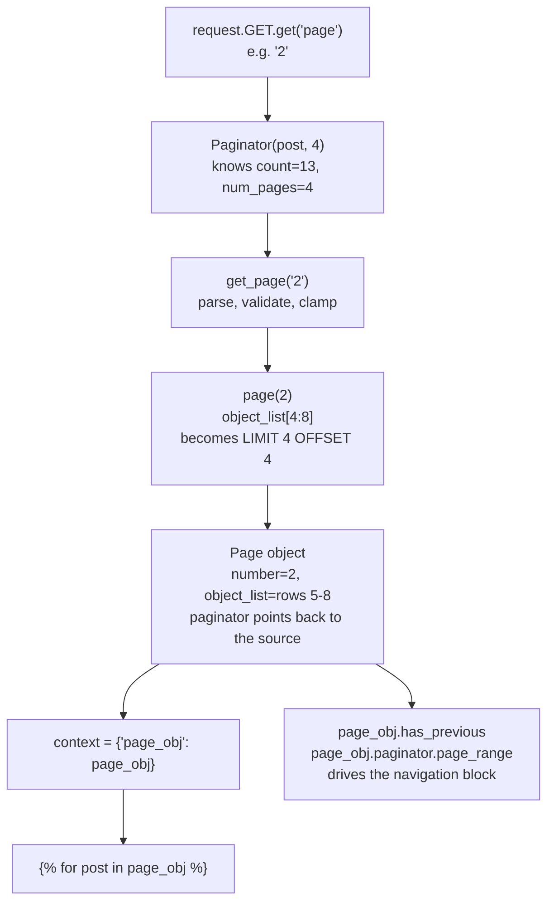
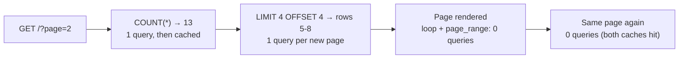
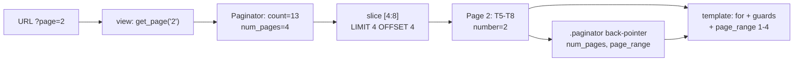

# 🚀 A039 — Django Pagination

`📖 Lecture A039` · `🎓 Track: Core Django` · `📶 Level: Intermediate` · `✅ Status: Documented`

> [!NOTE]
> **About this chapter's sources:** No lecture transcript exists in the folder, and the owner's
> command journal `commands.txt` adds **no new lines** for this lecture — it still ends at line 91
> (`pip install Pillow`, the A038 requirement). The chapter therefore rests on a single primary
> source: the **`myProject23/` artifact** — a Django 6.1.1 project with a `blog` app whose
> `Post` model, `Paginator(post, 4)` view, root-mounted route and one standalone template implement
> paging in its smallest complete form, backed by a live `db.sqlite3` holding **13 rows**.
> Every file quoted below is reproduced verbatim from that artifact.
>
> This chapter was **verified live**, not just read: the artifact was booted, its `Paginator` was
> exercised with twelve different `?page=` inputs, the SQL was captured during a real page turn, the
> `get_page()`/`page()` split was measured, and Django's own `paginator.py` was read to confirm why
> each behaviour happens. The transcript of those runs appears in the "Live verification" callout.
> Anything supplementary to the artifact is marked 📌.
>
> This lecture builds directly on [A025 — Display Table Data in Django Template](../A025_Display_Table_Data_in_Django_Template/README.md)
> (the `` loop that renders rows) and [A032 — Django ModelForms Read](../A032_Django_ModelForms_Read/README.md)
> (the list/detail read pair whose flat `objects.all()` this lecture slices), and it is the direct
> continuation of [A038 — File & Image Upload](../A038_File_&_Image_Upload/README.md), whose closing
> "Next Lecture Connection" named the `Paginator` as the very next step (`myProject22` → `myProject23`).

---

## 🧭 What You Will Learn

- [ ] Why `objects.all()` is the wrong thing to hand a template once a table has more than a screenful of rows
- [ ] The three arguments of `Paginator(object_list, per_page, …)` and what each of `count`, `num_pages`, `page_range`, `orphans` means
- [ ] How `Paginator.page(n)` slices a QuerySet into a **`LIMIT`/`OFFSET`** query — and how many SQL queries one page turn really costs
- [ ] The critical difference between `page()` (strict) and `get_page()` (forgiving), and why `request.GET.get('page')` demands the forgiving one
- [ ] What a `Page` object carries: `number`, `object_list`, `has_previous()`, `next_page_number()`, `start_index()`, `end_index()`, `paginator`
- [ ] Why `?page=2` in the URL — a **query parameter** — is the right place for page state, and what `?page=abc` / `?page=0` / `?page=999` actually do
- [ ] How to build First / Previous / numbered / Next / Last controls in DTL, and why the artifact's `First`/`Previous` links vanish on page 1
- [ ] The traps no tutorial mentions: unordered lists, `per_page=0`, `count()`, deep pages, orphans, and pages that outlive their data

## 🎯 Why This Lecture Matters

Every read path built so far has had the same silent assumption baked in: *the whole result set
fits on one page*. A032's `student_list`, A025's student table, and A038's `view_profile` all do
exactly one thing — `objects.all()` — and hand every row to ``. That is correct code and it
is also a time bomb. The moment the table has ten thousand rows, four things break at once:

| What breaks | Why |
|---|---|
| **The page** | Ten thousand `<li>` elements is megabytes of HTML; the browser becomes unusable |
| **The query** | The database must materialise every row before the first one renders |
| **The memory** | Django instantiates ten thousand model objects, all at once, to loop over them |
| **The usefulness** | A visitor who wants post 9,990 has to scroll past 9,989 posts to find it |

Notice that **none of these are Django bugs** — the framework did precisely what it was told. The
promise broken is architectural: *"show the user everything"* is not a design, it is the absence of
one. This lecture replaces that absence with a rule:

> **Show one slice at a time, and let the URL say which slice.**

The tool is the `Paginator` class, and its beauty is how little it asks of you. This artifact
paginates a whole blog — 13 posts, 4 per page — with **five lines of view code** and a
**14-line template block**. No migration, no model change, no new URL route, no third-party
package. The database still holds one table; the URL is still `'/'`; the template still uses
``. Everything that changes is *which* four rows the QuerySet was asked to return, and
*how the page announces its position*.

That is worth pausing on, because it is the shape of most of Django's best features: a small,
well-named component that composes with what you already know. Learn the `Paginator` once and you
have paging for **every** collection in the project forever — posts, students, products, orders,
profiles, messages, logs.

## ✅ Prerequisites

- [ ] The `` loop over a QuerySet, and the `` empty state — A025
- [ ] `objects.all()`, `objects.count()`, QuerySet laziness, slicing `[:4]` — A023, A024
- [ ] The read view shape (route → view → QuerySet → context → template) — A032
- [ ] `request.GET` — the query-string half of a request (`?page=2`) — A009 (URL parameters) and A029 (request objects)
- [ ] `path()` + `include()` wiring, and a root-mounted app (`path('', include('blog.urls'))`) — A007, A020
- [ ] `render(request, template, context)` — the three arguments — A013
- [ ] 📌 Reading a DTL `` block — A013, A017

## 🧩 The Problem — "Show Everything" Is Not a Design

Start with the code A032 left behind, because it is the code this lecture has to fix. That chapter's
list view was already good Django:

```python
# A032's shape (student_list) — correct, and unbounded
def student_list(request):
    students = Student.objects.all()
    return render(request, 'student_list.html', {'students': students})
```

And its template was the standard two-beat read: iterate, and guard the empty case. Now ask the one
question that code never answers: **what happens when `students` has 10,000 rows?**

Three naive fixes come to mind immediately, and each one fails for a different reason. Naming them
first is what makes the `Paginator` feel obvious rather than magical.

### Attempt 1 — "Just show the first few"

The reflex is to slice the QuerySet. Django supports it, and A024 already taught it:

```python
students = Student.objects.all()[:4]      # Django adds LIMIT 4
```

This is genuinely the right query — `SELECT … LIMIT 4` is exactly what we want the database to do.
What it is *not* is pagination, because:

- The user has **no way to reach row 5**. The cut is hard-coded; there is no page 2.
- The template cannot say *"you are seeing 1–4 of 10,000"* because it never learns the total.
- There is nothing to click. A list with no navigation is a dead end.

Slicing is the *mechanism* pagination uses. It is not the *feature*.

### Attempt 2 — "Let the URL carry a number"

The obvious next step is to read a page number out of the query string and slice with it:

```python
page = int(request.GET.get('page'))        # one line, four bugs
start = (page - 1) * 4
students = Student.objects.all()[start:start + 4]
```

Run the failure list against this, and it is ugly:

| Input | `int(request.GET.get('page'))` does… |
|---|---|
| no `?page=` at all | `int(None)` → **`TypeError: int() argument must be a string … not 'NoneType'`** |
| `?page=abc` | **`ValueError: invalid literal for int() with base 10: 'abc'`** — a 500 for a typo'd URL |
| `?page=` | **`ValueError: invalid literal for int() with base 10: ''`** |
| `?page=0` | No error — and a **negative slice**. `[-4:0]` returns an empty list, so the user sees a blank page that looks like "you have no data" |
| `?page=999` | No error — an empty list again. A blank page where a "no such page" belongs |
| `?page=2.5` | **`ValueError`** |

Six inputs, four of them raw exceptions leaking to the browser as HTTP 500. You would then need
`len(students)` for the total (a second query), `ceil(total / 4)` for the page count, a clamped
number, and markup for the controls. You have just started re-implementing a class that ships with
Django.

### Attempt 3 — "Let's write our own Paginator"

This is the honest version of Attempt 2, and it is not crazy — it is what every framework's
`Paginator` started as. But before writing it, count what it must own:

1. Parse a URL value that may be absent, empty, non-numeric, a float, negative, or out of range.
2. Decide the policy for each: *fall back to page 1?* *clamp to the last page?* *404?*
3. Know the total row count without materialising the rows.
4. Compute the page count — including the empty-table case, which divides by zero if you are careless.
5. Slice correctly at the **end** of the data, where the last page is usually short.
6. Expose the current page, the neighbours, and whether previous/next exist — all of it
   **callable from a template**, which means methods with no arguments and attributes, not Python
   idioms like `page > 1`.
7. Warn you when the ordering is unstable.

That list is the entire specification of `django.core.paginator.Paginator` and its `Page` companion.
So do not write it — read it, and learn the two objects it defines.

### The shape of the answer



Read the diagram as **three objects and a slice**:

| Piece | Its one job |
|---|---|
| **`Paginator`** | *Knows the whole collection* — how many rows, how many pages, what page numbers exist |
| **`get_page()`** | *Absorbs bad input* — turns `None`/`'abc'`/`'0'`/`'999'` into a legal page |
| **`Page`** | *Is one slice plus its position* — the rows, the number, and a pointer back to the `Paginator` |
| **`request.GET['page']`** | *Carries the state* — so the page is bookmarkable, shareable and refreshable |

## 🧠 The Paginator — One Object, Four Numbers

Here is the class, verbatim, from the installed Django 6.1.1
(`django/core/paginator.py`) — trimmed to the parts this lecture uses:

```python
class BasePaginator:
    # Translators: String used to replace omitted page numbers in elided page
    # range generated by paginators, e.g. [1, 2, '…', 5, 6, 7, '…', 9, 10].
    ELLIPSIS = _("…")
    default_error_messages = {
        "invalid_page": _("That page number is not an integer"),
        "min_page": _("That page number is less than 1"),
        "no_results": _("That page contains no results"),
    }

    def __init__(
        self,
        object_list,
        per_page,
        orphans=0,
        allow_empty_first_page=True,
        error_messages=None,
    ):
        self.object_list = object_list
        self._check_object_list_is_ordered()
        self.per_page = int(per_page)
        self.orphans = int(orphans)
        self.allow_empty_first_page = allow_empty_first_page
        # ... error_messages wiring, and the per_page <= orphans deprecation warning
```

```python
class Paginator(BasePaginator):
    # ...
    def get_page(self, number):
        """
        Return a valid page, even if the page argument isn't a number or isn't
        in range.
        """
        try:
            number = self.validate_number(number)
        except PageNotAnInteger:
            number = 1
        except EmptyPage:
            number = self.num_pages
        return self.page(number)

    def page(self, number):
        """Return a Page object for the given 1-based page number."""
        number = self.validate_number(number)
        bottom = (number - 1) * self.per_page
        top = bottom + self.per_page
        if top + self.orphans >= self.count:
            top = self.count
        return self._get_page(self.object_list[bottom:top], number, self)

    @cached_property
    def count(self):
        """Return the total number of objects, across all pages."""
        c = getattr(self.object_list, "count", None)
        if callable(c) and not inspect.isbuiltin(c) and method_has_no_args(c):
            return c()
        return len(self.object_list)

    @cached_property
    def num_pages(self):
        """Return the total number of pages."""
        if self.count == 0 and not self.allow_empty_first_page:
            return 0
        hits = max(1, self.count - self.orphans)
        return ceil(hits / self.per_page)

    @property
    def page_range(self):
        """
        Return a 1-based range of pages for iterating through within
        a template for loop.
        """
        return range(1, self.num_pages + 1)
```

Read those two classes and four facts fall out, and they are the whole lecture:

| # | Fact | Where it lives | Consequence |
|---|---|---|---|
| **1** | `Paginator` never copies your data | `self.object_list = object_list` | It holds a *reference* to the QuerySet. Slicing happens later, in `page()` — so the SQL is lazy until you ask for a page |
| **2** | `count` and `num_pages` are **`cached_property`** | the `@cached_property` decorators | Each is computed **once per `Paginator`**. Two template tags asking `num_pages` cost one `COUNT(*)`, not two |
| **3** | `count` prefers `.count()` over `len()` | `if callable(c) … method_has_no_args(c)` | With a QuerySet you get SQL `SELECT COUNT(*)`; with a plain list you get Python `len()`. Same attribute, two implementations |
| **4** | `num_pages` can never be `0` for an empty table | `hits = max(1, self.count - self.orphans)` | An empty collection still has **page 1** (unless you pass `allow_empty_first_page=False`) |

Fact 4 is worth pausing on, because it is deliberate. A blank table with `num_pages = 0` would make
`page_range` empty and force every navigation template to special-case the empty state. Django's
answer is: *there is always at least one page, it just happens to be empty.* You will see this exact
behaviour in the live transcript: `count=0 num_pages=1 page_range=[1]`.

### The four numbers, and how they relate

Everything a pagination control needs is these four values. Here they are for the artifact's real
data (**13 `Post` rows, `per_page=4`**):

| Number | Expression | Artifact value | Meaning |
|---|---|---|---|
| **`count`** | `Paginator.count` | `13` | Total rows in the whole collection |
| **`num_pages`** | `ceil(count / per_page)` | `4` | How many pages exist (`13 / 4 = 3.25` → 4) |
| **`page_range`** | `range(1, num_pages + 1)` | `range(1, 5)` | The page numbers, for a template `` |
| **`per_page`** | the value you passed | `4` | Rows per page — a constant *you* chose |

And for a single page, the arithmetic that `page()` performs:

```text
per_page = 4, count = 13
 ┌───────────┬────────────┬───────┬──────────────────────────────┐
 │  page     │  slice     │ rows  │  length                      │
 ├───────────┼────────────┼───────┼──────────────────────────────┤
 │  page(1)  │  [0:4]     │  1-4  │  4  (full)                   │
 │  page(2)  │  [4:8]     │  5-8  │  4  (full)                   │
 │  page(3)  │  [8:12]    │  9-12 │  4  (full)                   │
 │  page(4)  │  [12:16]   │  13   │  1  (short) ← top clamped    │
 └───────────┴────────────┴───────┴──────────────────────────────┘
```

That last row is the line `if top + self.orphans >= self.count: top = self.count`. Without it, the
slice `[12:16]` would still be correct (Python stops at the end of a sequence) — but the clamp is
what makes `orphans` possible, which is the next concept.

### `orphans` — "don't leave a sad last page"

`orphans` is the one argument nobody reads the docs for, and it fixes a real editorial problem.
Consider `count = 9` and `per_page = 4`: plain maths gives pages of **4, 4, 1** — a final page with a
single lonely row that looks like a bug. `orphans` says: *absorb a short trailing page into the
previous one when it is this small or smaller.*

| `count` | `per_page` | `orphans` | pages | page lengths |
|---|---|---|---|---|
| 9 | 4 | 0 (default) | 3 | 4, 4, 1 |
| 9 | 4 | 1 | 2 | 4, 5 |
| 13 | 4 | 0 (default) | 4 | 4, 4, 4, 1 |
| 13 | 4 | 2 | 3 | 4, 4, 5 |

The trick is inside `num_pages`: `hits = max(1, count - orphans)`. With `count=9, orphans=1` the hits
become `8`, and `ceil(8/4) = 2` — so page 2 is *allowed* to hold 5 rows, because `page()` clamps `top`
to `count` once `top + orphans >= count`. The final page **grows** instead of a new page appearing.

⚠️ Django 6.1 emits a deprecation warning for a related edge: **`orphans >= per_page` is going away**
(`RemovedInDjango70Warning: Support for the orphans argument being larger than or equal to the
per_page argument is deprecated`). Live-verified in the transcript below — it fires on
`Paginator(qs, 0)` and `Paginator(qs, -3)`, both nonsense inputs that at least *tell* you so.

### `validate_number()` — the gatekeeper

`page()` does not trust its argument. It passes it through `validate_number()` first, which is where
every rule from the "six inputs" table is enforced:

```python
def validate_number(self, number):
    """Validate the given 1-based page number."""
    try:
        if isinstance(number, float) and not number.is_integer():
            raise ValueError
        number = int(number)
    except (TypeError, ValueError):
        raise PageNotAnInteger(self.error_messages["invalid_page"])
    if number < 1:
        raise EmptyPage(self.error_messages["min_page"])
    if number > self.num_pages:
        raise EmptyPage(self.error_messages["no_results"])
    return number
```

Three things to notice, all live-verified:

- **`isinstance(number, float) and not number.is_integer()`** — `2.5` is explicitly rejected, but
  `int('2')`, `int('01')` and `int(' 2 ')` are all accepted. That is why `'2'`, `2`, `'01'` and
  `' 2 '` each returned page 2 in the probe.
- **`number < 1` raises `EmptyPage`, not `PageNotAnInteger`** — `0` *is* an integer, it is just not a
  valid page. Different exception, different recovery.
- **The two exceptions carry different recovery paths** in `get_page()`. That is the entire reason
  Django ships two exception classes instead of one.

### `get_page()` vs `page()` — the API split that matters most

This pair trips up nearly everyone, so make it explicit:

| | `paginator.page(n)` | `paginator.get_page(n)` |
|---|---|---|
| **Trusts its input?** | No — validates and **raises** | No — validates and **recovers** |
| **`n = 'abc'`** | raises `PageNotAnInteger` | silently returns **page 1** |
| **`n = None`** (no `?page=`) | raises `PageNotAnInteger` | silently returns **page 1** |
| **`n = 999`** (out of range, high) | raises `EmptyPage` | silently returns the **last** page |
| **`n = 0`** (out of range, low) | raises `EmptyPage` | silently returns the **last** page |
| **Use when** | you control `n` and want strictness | `n` came from `request.GET` |

Note the counter-intuitive recovery in `get_page()`: **out of range → last page**, not first. The code
is literal — `except EmptyPage: number = self.num_pages`. That is friendly for "too far forward" (a
stale bookmark after rows were deleted) and odd for `?page=0`, which lands the visitor on your
*newest* page rather than the oldest. It is a **policy** choice baked into Django. If you disagree,
switch on `page_obj.number` and redirect, or call `page()` inside a `try` and return a real 404.

Both exception classes inherit from one parent, which is how you can catch them together:

```text
PageNotAnInteger MRO: ['PageNotAnInteger', 'InvalidPage', 'Exception', 'BaseException', 'object']
EmptyPage MRO        : ['EmptyPage', 'InvalidPage', 'Exception', 'BaseException', 'object']
```

So `except InvalidPage:` catches both — useful when you want one handler for "bad page, render 404".

### The warning you must never ignore: `UnorderedObjectListWarning`

`__init__` calls `self._check_object_list_is_ordered()`. It is not decoration:

```python
def _check_object_list_is_ordered(self):
    """
    Warn if self.object_list is unordered (typically a QuerySet).
    """
    ordered = getattr(self.object_list, "ordered", None)
    if ordered is not None and not ordered:
        obj_list_repr = (
            "{} {}".format(
                self.object_list.model, self.object_list.__class__.__name__
            )
            if hasattr(self.object_list, "model")
            else "{!r}".format(self.object_list)
        )
        warnings.warn(
            "Pagination may yield inconsistent results with an unordered "
            "object_list: {}.".format(obj_list_repr),
            UnorderedObjectListWarning,
            stacklevel=3,
        )
```

Underline the word **inconsistent** — not *wrong*. Here is the failure it prevents:

```text
Without ORDER BY, SQLite is free to return rows in any order it likes.

page 1 query:  SELECT ... LIMIT 4 OFFSET 0   ->  rows A B C D
page 2 query:  SELECT ... LIMIT 4 OFFSET 4   ->  rows G C I J     ← C again!
```

Each page is a **separate SQL query**, so an unordered collection can hand the same row to two
different pages and skip another entirely. The warning is Django telling you that your page 1 and
page 2 are not guaranteed to partition the data.

The artifact avoids this — and *where* it avoids it is itself the lesson. Its model declares **no**
`Meta.ordering` at all (check `models.py` below — nine lines, no `Meta` class). The ordering happens
at the call site, in the view:

```python
post = Post.objects.all().order_by('id')   # ← this is what makes pagination safe
```

`Paginator.__init__` inspected that ordered QuerySet and stayed silent. Live-verified side by side:

```text
Paginator(Post.objects.all(), 4) warnings:
    UnorderedObjectListWarning : Pagination may yield inconsistent results with an
    unordered object_list: <class 'blog.models.Post'> QuerySet.

Post.objects.all().ordered                = False
Post.objects.all().order_by("id").ordered = True
```

The rule is blunt: **paginate an ordered QuerySet.** Either append `.order_by('pk')` at the call
site (what this artifact does), or declare a default `Meta.ordering` on the model. Never paginate a
bare `.all()` on a model with no default ordering — even though it will *appear* to work fine
with 13 rows.

## 📄 The Page Object — One Slice That Knows Where It Is

`page()` returns a `Page`, and this is where the template's entire vocabulary comes from. Verbatim
from `django/core/paginator.py`:

```python
class Page(collections.abc.Sequence):
    def __init__(self, object_list, number, paginator):
        self.object_list = object_list
        self.number = number
        self.paginator = paginator

    def __repr__(self):
        return "<Page %s of %s>" % (self.number, self.paginator.num_pages)

    def __len__(self):
        return len(self.object_list)

    def __getitem__(self, index):
        if not isinstance(index, (int, slice)):
            raise TypeError(
                "Page indices must be integers or slices, not %s."
                % type(index).__name__
            )
        # The object_list is converted to a list so that if it was a QuerySet
        # it won't be a database hit per __getitem__.
        if not isinstance(self.object_list, list):
            self.object_list = list(self.object_list)
        return self.object_list[index]

    def has_next(self):
        return self.number < self.paginator.num_pages

    def has_previous(self):
        return self.number > 1

    def has_other_pages(self):
        return self.has_previous() or self.has_next()

    def next_page_number(self):
        if not self.has_next():
            raise EmptyPage("Not a valid page.")
        return self.number + 1

    def previous_page_number(self):
        if not self.has_previous():
            raise EmptyPage("Not a valid page.")
        return self.number - 1

    def start_index(self):
        """
        Return the 1-based index of the first object on this page,
        relative to total objects in the paginator.
        """
        # Special case, return zero if no items.
        if self.paginator.count == 0:
            return 0
        return (self.paginator.per_page * (self.number - 1)) + 1

    def end_index(self):
        """
        Return the 1-based index of the last object on this page,
        relative to total objects in the paginator.
        """
        # Special case for the last page because there can be orphans.
        if self.number == self.paginator.num_pages:
            return self.paginator.count
        return self.number * self.paginator.per_page
```

Five details in that class are load-bearing:

1. **`Page` is a `Sequence`.** That is why `` works, why `page_obj.0`
   works, and why `len(page_obj)` works — all three are Python data-model methods Django implemented.
2. **`self.paginator` — the back-pointer.** A `Page` carries a reference to its `Paginator`, which is
   why templates read `page_obj.paginator.num_pages` and `page_obj.paginator.per_page`. A page knows
   its position *because* it can ask its parent how many pages there are.
3. **The `list()` conversion in `__getitem__`.** Comment quoted verbatim: *"The object_list is
   converted to a list so that if it was a QuerySet it won't be a database hit per `__getitem__`."*
   That is a deliberate one-shot materialisation: pay once, then indexed access in a loop is free.
4. **`has_next()` / `has_previous()` are methods, not attributes** — and that is exactly what the DTL
   wants. `{{ page_obj.has_next }}` calls them with **no parentheses**, because the template engine
   auto-calls callables. You could not write `page_obj.number < page_obj.paginator.num_pages` in a
   template without `` gymnastics; the method *is* the template-friendly API.
5. **`next_page_number()` raises `EmptyPage`** rather than returning `None` — so a template that
   blindly renders `?page={{ page_obj.next_page_number }}` on the last page crashes instead of
   emitting `?page=`, which would itself become `PageNotAnInteger` → page 1 (a confusing loop).
   Guard it with `has_next`.

### The full template vocabulary

Everything you may write in the template, in one table. The `Page` object is the halfway house
between your view and the HTML:

| Expression | Type | Value on page 2 of 4 | What it is for |
|---|---|---|---|
| `{{ page_obj.number }}` | int | `2` | The current page number |
| `{{ page_obj.object_list }}` | QuerySet→list | rows 5–8 | The rows themselves (usually iterated, not printed) |
| `{{ page_obj.paginator.count }}` | int | `13` | Total rows — for a "showing 5–8 of 13" line |
| `{{ page_obj.paginator.num_pages }}` | int | `4` | Total pages |
| `{{ page_obj.paginator.per_page }}` | int | `4` | Rows per page |
| `{{ page_obj.paginator.page_range }}` | `range` | `1,2,3,4` | Loop source for the page-number links |
| `{{ page_obj.has_previous }}` | method → bool | `True` | Whether to show a "Previous" link |
| `{{ page_obj.has_next }}` | method → bool | `True` | Whether to show a "Next" link |
| `{{ page_obj.has_other_pages }}` | method → bool | `True` | Hide the whole control on a single-page list |
| `{{ page_obj.previous_page_number }}` | method → int | `1` | The `?page=` value for "Previous" |
| `{{ page_obj.next_page_number }}` | method → int | `3` | The `?page=` value for "Next" |
| `{{ page_obj.start_index }}` | method → int | `5` | First row's 1-based position |
| `{{ page_obj.end_index }}` | method → int | `8` | Last row's 1-based position |
| `{{ page_obj.paginator.ELLIPSIS }}` | str | `…` | The marker used when eliding long page ranges |

`start_index()`/`end_index()` are the pair people forget they have, and they are exactly what the
"showing 5–8 of 13" line needs. Note their two special cases, both visible in the source above:
`start_index` returns `0` when `count == 0` (avoiding a nonsense `1`), and `end_index` returns
`count` on the last page (because orphans can make the final page longer than `per_page`).

## 🔧 The Artifact — Six Files, Verbatim

Now the real code. `myProject23/` is a Django 6.1.1 project whose `blog` app does nothing but
paginate — which makes it the cleanest possible reference. Here is the whole thing, file by file.

### 1. `blog/models.py` — the data (9 lines, no ordering of its own)

```python
from django.db import models

# Create your models here.
class Post(models.Model):
    title = models.CharField(max_length=200)
    content = models.TextField()

    def __str__(self):
        return self.title
```

Two things to register. First, the model is deliberately minimal: a `title` (`CharField`, the
familiar capped string from A022/A031) and a `content` (`TextField` — the *uncapped* text sibling
📌: same Python `str`, but the database makes no length promise, which is what a blog body wants).
No timestamps, no author, no slug — nothing the lecture needs is missing, nothing it doesn't need is
present. Second, there is **no `Meta` class**, so this model declares no default ordering. Keep that
fact in mind when you reach the view: the `.order_by('id')` there is not decoration.

The `__str__` returning `self.title` follows the A027 lesson (admin readability) — and it is also
what makes the live test-client output readable below, where titles `T1`…`T13` identify rows.

The migration that created this table is the standard one-line-per-field shape from A022:

```python
# Generated by Django 6.1.1 on 2026-09-17 08:51

from django.db import migrations, models


class Migration(migrations.Migration):

    initial = True

    dependencies = [
    ]

    operations = [
        migrations.CreateModel(
            name='Post',
            fields=[
                ('id', models.BigAutoField(auto_created=True, primary_key=True, serialize=False, verbose_name='ID')),
                ('title', models.CharField(max_length=200)),
                ('content', models.TextField()),
            ],
        ),
    ]
```

Nothing pagination-specific lives in the migration — paging needs **no schema change**. The table is
`blog_post` (the `appname_modelname` rule from A022); the rows in it are `T1`…`T13`.

The settings are the stock scaffold. Only the lines that matter for this lecture:

```python
INSTALLED_APPS = [
    'django.contrib.admin',
    'django.contrib.auth',
    'django.contrib.contenttypes',
    'django.contrib.sessions',
    'django.contrib.messages',
    'django.contrib.staticfiles',
    'blog',
]
```

```python
ROOT_URLCONF = 'myProject23.urls'
```

```python
DATABASES = {
    'default': {
        'ENGINE': 'django.db.backends.sqlite3',
        'NAME': BASE_DIR / 'db.sqlite3',
    }
}
```

### 2. `blog/views.py` — the whole lecture in five lines

```python
from django.shortcuts import render
from .models import Post
from django.core.paginator import Paginator

# Create your views here.
def post_list(request):
    post = Post.objects.all().order_by('id')
    paginator = Paginator(post, 4)  # Show 4 posts per page

    page_number = request.GET.get('page')
    page_obj = paginator.get_page(page_number)
    return render(request, 'blog/post_list.html', {'page_obj': page_obj})
```

Line by line, because every line earns its place:

1. **`post = Post.objects.all().order_by('id')`** — the *ordered* QuerySet. `.all()` alone would
   fetch every row with no guaranteed order; `.order_by('id')` appends `ORDER BY "blog_post"."id"
   ASC` to the SQL (captured verbatim in the probe below) and, critically, sets the QuerySet's
   `ordered` flag to `True` — which is what keeps `Paginator.__init__` from warning. Note the
   variable is named `post` (singular) despite holding many rows — the series' A025/A032 lesson
   about context-key naming applies to locals too, but it is cosmetic, not a bug.
2. **`paginator = Paginator(post, 4)`** — wraps the (still lazy — *no query yet*) QuerySet with a
   page size of 4. Construction itself runs **zero SQL**: `object_list` is stored, `per_page` is
   `int()`-ed, the ordering check runs. `count` and `num_pages` are `cached_property` — computed on
   first touch.
3. **`page_number = request.GET.get('page')`** — reads the raw query-string value. Three possible
   shapes: `None` (no `?page=` — the common first visit), `''` (a bare `?page=`), or a string like
   `'2'`. A repeated `?page=2&page=3` yields the **last** value (`'3'` — standard `QueryDict.get`
   behaviour, live-verified). No `int()` conversion here — `get_page()` owns that.
4. **`page_obj = paginator.get_page(page_number)`** — the tolerant path. `None`/`''`/`'abc'`/
   `'2.5'` → page 1; `'0'`/`'-1'`/`'999'` → page 4 (the last). Never raises for URL input.
5. **`render(..., {'page_obj': page_obj})`** — one context key, and the name matters. `page_obj` is
   Django's conventional name (generic class-based `ListView` uses exactly this key 📌), so any
   Django reader recognises it instantly. The template receives a `Page`, not a QuerySet.

### 3. `blog/templates/blog/post_list.html` — the page, verbatim (53 lines)

```html
<!DOCTYPE html>
<html lang="en">
<head>
    <meta charset="UTF-8">
    <title>Django Pagination</title>
    <style>
        .pagination {
            margin-top: 20px;
        }
        .pagination a, .pagination span {
            padding: 5px 10px;
            margin: 0 5px;
            text-decoration: none;
            border: 1px solid #ccc;
        }
        .pagination .current {
            background-color: #007bff;
            color: white;
            border-color: #007bff;
        }
        .pagination a:hover {
            background-color: #0056b3;
            color: white;
        }
    </style>
</head>
<body>
    <h1>Blog Posts</h1>
    <ul>
        
            <li><b>{{ post.title }}</b> - {{ post.content }}</li>
        
    </ul>

     Pagination 
    <div class="pagination">
        
            <a href="?page=1">First</a>
            <a href="?page={{ page_obj.previous_page_number }}">Previous</a>
        

        
            
                <span class="current">{{ num }}</span>
            
                 <a href="?page={{ page_obj.next_page_number }}">Next</a> 
                <a href="?page={{ num }}">{{ num }}</a>
                 <a href="?page={{ page_obj.paginator.num_pages }}">Last</a> 
            
        
    </div>
</body>
</html>
```

Three things to notice, all live-verified:

1. **``** — the loop iterates a `Page`, not a QuerySet. `Page`
   defines `__iter__` (it yields from `object_list`), so the A025 loop idiom works unchanged.
   `len(page_obj)` is 4 on pages 1–3 and 1 on page 4 — the short last page renders one `<li>`.
2. **The navigation has two halves.** The `` guard prints
   `First`/`Previous` only when a previous page exists — page 1 renders *no* `First`/`Previous`
   anchors at all (verified: `page1 has Previous anchor: False`), while page 2 renders
   `?page=1` twice (once as `First`, once as `Previous`). The numbered row loops over
   `page_obj.paginator.page_range` (`range(1, 5)`) and prints the current number as a
   `<span class="current">` instead of a link — so page 1's block contains links to 2, 3, 4
   only, and page 3's block contains `First`, `Previous`, `1`, `2`, `4` with `3` as a span.
3. **Two commented-out anchors are fossils.** Inside the `` branch sit
   ` <a href="?page={{ page_obj.next_page_number }}">Next</a> `
   and ` <a href="?page={{ page_obj.paginator.num_pages }}">Last</a> `.
   `` strips its contents at render time — verified: no `Next`/`Last` text, no raw
   `{%` braces, and no `comment` string in the 1,362-byte output. They are the author's
   sketches for `Next`/`Last` links that were never wired up, so this artifact has **no Next and
   no Last button** — only First/Previous plus numbers. The correct `Next` would be
   `?page={{ page_obj.next_page_number }}` guarded by ``, placed
   *outside* the number loop; inside the loop it would print once per non-current number.

Note what the template does *not* contain: no ``, no ``, no
`enctype` (it is a GET page — verified `enctype False`), no ``. Like A019's
`blog.html`, it is a **standalone page**.

### 4. `blog/urls.py` + `myProject23/urls.py` — the root-mounted route

```python
# blog/urls.py
from django.urls import path
from . import views

urlpatterns = [
    path('', views.post_list, name='post_list'),
]
```

```python
# myProject23/urls.py (artifact lines 20–23; stock docstring header omitted)
from django.contrib import admin
from django.urls import path, include

urlpatterns = [
    path('admin/', admin.site.urls),
    path('', include('blog.urls')),
]
```

The same root-mount pattern as A020's `portfolio` app: `path('', include('blog.urls'))` hands the
empty prefix to `blog.urls`, whose own `''` pattern matches, so `GET /` reaches `post_list`
(live-verified: `reverse('post_list') = /`, `templates used = ['blog/post_list.html']`,
`/` → 200 with `T1`…`T4`). Consequences worth stating once: there is exactly **one** page in
this project, and `/nope/` → 404 while `/admin/` → 302 (the login redirect, proving migrations
ran). No `app_name` namespace — fine with a single app, the A030 lesson deferred.

### 5. `blog/admin.py` — registered, unlike A038's `Profile`

```python
from django.contrib import admin
from .models import Post

# Register your models here.
admin.site.register(Post)
```

One line, and it matters by contrast: A038's `Profile` was left unregistered (flagged per §12
there), while `Post` is registered with the plain `admin.site.register(Post)` form from A027 —
no `ModelAdmin`, no `list_display`. That is why the 13 `T1`…`T13` rows could be inspected in
the admin during verification.

### 6. The data — 13 rows, `T1`…`T13`

The artifact's `db.sqlite3` holds 13 `Post` rows, ordered by `id`:

```text
(1, 'T1'), (2, 'T2'), (3, 'T3'), (4, 'T4'), (5, 'T5'), (6, 'T6'), (7, 'T7'),
(8, 'T8'), (9, 'T9'), (10, 'T10'), (11, 'T11'), (12, 'T12'), (13, 'T13')
```

13 is the pedagogically perfect count for `per_page=4`: three full pages plus a **short last
page of 1** (`13 = 3×4 + 1`), so `num_pages = ceil(13/4) = 4` and page 4 renders a single `<li>`.
Every number in this chapter — `count=13`, `num_pages=4`, `page_range=[1,2,3,4]` — falls out of
that one fact.

## 📊 Twelve Inputs, Zero 500s — The Tolerance Table

This is the chapter's center of gravity: every `?page=` value the probe sent, what the user got,
and *which method* produced it. Twelve rows, all HTTP 200, all live-verified.

| `?page=` value | `page_obj.number` | Rows shown | `page()` would have… | Why |
|---|---|---|---|---|
| *(absent)* | 1 | T1–T4 | `PageNotAnInteger` | `request.GET.get` returns `None`; `int(None)` is a `TypeError`. The first-visit case must work — it is the common one |
| `''` (bare `?page=`) | 1 | T1–T4 | `PageNotAnInteger` | `int('')` is a `ValueError`. Copy-pasted URLs break otherwise |
| `1` | 1 | T1–T4 | page 1 | The happy path |
| `2` | 2 | T5–T8 | page 2 | The happy path |
| `3` | 3 | T9–T12 | page 3 | The happy path |
| `4` | 4 | T13 | page 4 | The short last page — 1 item, not 4 |
| `0` | **4** | T13 | `EmptyPage` ("less than 1") | Clamped to the last page — not page 1, not an error |
| `-1` | **4** | T13 | `EmptyPage` ("less than 1") | Same clamp. `get_page` treats "too small" and "too big" identically |
| `999` | **4** | T13 | `EmptyPage` ("no results") | Same clamp. Link-rot to a deleted page lands somewhere sane |
| `abc` | **1** | T1–T4 | `PageNotAnInteger` ("not an integer") | Falls back to the first page — a typo'd URL still renders |
| `2.5` | **1** | T1–T4 | `PageNotAnInteger` ("not an integer") | `int('2.5')` is a `ValueError` — floats are *not* truncated to page 2 |
| `2&page=3` | **3** | T9–T12 | *(n/a — view reads `'3'`)* | `QueryDict.get()` returns the **last** value. Verified in the view layer before `get_page` ever sees it |

The rule compresses to two lines — and this is the entire contract of `get_page()`:

- **Not a positive integer** (`None`, `''`, `'abc'`, `'2.5'`) → **page 1**.
- **A valid integer outside the range** (`'0'`, `'-1'`, `'999'`) → **the last page**.

`page()` raises instead — `PageNotAnInteger` for the first group, `EmptyPage` for the second —
both subclasses of `InvalidPage` (MRO verified: `['PageNotAnInteger', 'InvalidPage', 'Exception',
'BaseException', 'object']`). So `page()` is the strict API you use when *you* control the number
(and want an exception to catch — the standard pattern is `except EmptyPage: raise Http404` 📌),
and `get_page()` is the tolerant API you use when the *URL* controls the number (which is every
real pagination view).

Two footnotes the table hides:

1. **`' 2 '` (padded) → page 2, `'01'` → page 1.** `int()` strips whitespace and accepts leading
   zeros, and `validate_number` calls `int()` — so both work. Mention it once so nobody "fixes"
   it with a `.strip()` that was never needed.
2. **Every row above returned HTTP 200.** That is the point the naive `int(...)` version from §1
   fails: four of these twelve inputs would have been a 500 there. Here the worst case is landing
   on page 1 or page 4 — always a rendered page, never an exception.

## ⚡ What a Page Turn Costs — Two Queries, Then Zero

The most common fear about pagination is that it is expensive — a `COUNT(*)` plus a slice on every
click sounds like two full table scans. The probe captured the actual SQL for `page(2)`, so there
is no need to guess:

```sql
SELECT COUNT(*) AS "__count" FROM "blog_post"
```

```sql
SELECT "blog_post"."id", "blog_post"."title", "blog_post"."content"
FROM "blog_post" ORDER BY "blog_post"."id" ASC LIMIT 4 OFFSET 4
```

Read the second query word by word, because it is the whole performance story:

- **`ORDER BY "blog_post"."id" ASC`** — this is the `.order_by('id')` from the view, passed
  through untouched. Without it there is no `ORDER BY` at all, and SQLite returns rows in
  whatever order the storage engine finds convenient (see § Traps).
- **`LIMIT 4`** — the database reads 4 rows. Not 13. On a 10,000-row table it still reads 4.
  This is the line that makes pagination *scale*: the cost of a page turn is constant in the
  page size, independent of the table size.
- **`OFFSET 4`** — skip the first 4 rows. `bottom = (2 - 1) * 4`, straight from the
  `page()` source quoted in §2.

And the first query — `COUNT(*)` — is how `Paginator.count` works on a QuerySet: the
`cached_property` prefers the QuerySet's own `.count()` method over `len()`, so the total comes
back as one integer without materialising a single row.

A full `GET /?page=2` therefore runs **exactly 2 queries** (verified with `CaptureQueriesContext`):
the count, then the slice. Nothing else touches the database — the template loop iterates an
already-fetched list, and `page_range` is pure arithmetic.

Then the caching half, which the probe measured explicitly:

```text
--- now the SAME Paginator, second page, on an ALREADY-CONSUMED queryset ---
rows: [5, 6, 7, 8] | new queries: 0
--- and count() is cached too ---
count: 13 | queries: 0
```

Two results, both worth stating precisely:

1. **`count` is a `cached_property`.** The first access runs `SELECT COUNT(*)`; every later
   access — `num_pages`, a second `page()`, the template's `paginator.num_pages` — reuses the
   stored integer. Zero new queries.
2. **The QuerySet's own result cache helps, but only within one evaluated QuerySet.**
   `page(2)` slices `object_list[4:8]`; the probe called `list()` on that slice first (forcing
   one `LIMIT/OFFSET` query into the QuerySet's `_result_cache`), then asked the *same*
   `Paginator` for page 2 again — 0 new queries, because the slice was already cached. But note
   the direction this does *not* work: fetching page 1 does not pre-fetch page 2. Each new page
   is one new `LIMIT/OFFSET` query. The cache saves *repeats*, not *neighbours*.



One honest footnote: `OFFSET` is constant-cost in page *size* but linear in page *number* — page
10,000 skips 39,996 rows before reading 4. For this series' scale that never matters; at very
large scale the standard answer is keyset pagination 📌 (remember `WHERE id > last_seen` instead
of `OFFSET`), which the `Paginator` does not do. Know the ceiling exists; you will not hit it
here.

## 🧱 Important Vocabulary

| Term | Simple meaning | Technical meaning | 🧷 Memory hook |
|---|---|---|---|
| `Paginator` | The librarian who knows the whole catalogue | `django.core.paginator.Paginator(object_list, per_page)` — owns `count`, `num_pages`, `page_range`, `get_page()`, `page()`; construction runs zero SQL; `count`/`num_pages` are `cached_property` | 🧷 the librarian with the catalogue |
| `Page` | One shelf of books plus its shelf number | The object `page()`/`get_page()` returns — `number`, `object_list` (a **list**), `paginator` back-pointer, `has_previous/has_next`, `previous_page_number/next_page_number`, `start_index/end_index`; iterable and sized | 🧷 the shelf you carry to the table |
| `per_page` | How many books fit on one shelf | Second constructor argument; `int()`-ed at construction, so `None` → `TypeError` immediately while `0`/`-3` construct and explode later (`ZeroDivisionError` / `EmptyPage`) | 🧷 the shelf width |
| `count` | How many books the library holds | Total objects across all pages; prefers the QuerySet's `.count()` (`SELECT COUNT(*)`) over `len()`; cached after first access | 🧷 the stock count |
| `num_pages` | How many shelves the stock fills | `ceil((count - orphans) / per_page)`; `0` only when the table is empty *and* `allow_empty_first_page=False` | 🧷 shelves needed |
| `page_range` | The list of shelf numbers on the wall | `range(1, num_pages + 1)` — a lazy `range`, not a list; the template loops it for numbered links | 🧷 the directory board |
| `page_obj` | The conventional name for "the current shelf" | Context key holding the `Page`; Django's generic `ListView` uses exactly this name 📌 — use it so every Django reader recognises it | 🧷 the call slip |
| `get_page()` | The forgiving receptionist | Parses any URL input: non-integer → page 1, out-of-range integer → last page; never raises for URL input | 🧷 "we'll find you a shelf" |
| `page()` | The strict archivist | Validates and raises: `PageNotAnInteger` for non-integers, `EmptyPage` for out-of-range; both subclass `InvalidPage` | 🧷 "ticket or no entry" |
| `InvalidPage` | The parent of both refusals | Base exception both pagination errors inherit; catch this one to handle either 📌 | 🧷 the refusal stamp |

| `PageNotAnInteger` | "That is not a shelf number" | Raised for `None`/`''`/`'abc'`/`'2.5'`; message *"That page number is not an integer"* | 🧷 gibberish on the slip |
| `EmptyPage` | "That shelf does not exist" | Raised for `'0'`/`'-1'`/`'999'`; messages *"less than 1"* / *"contains no results"* | 🧷 pointing past the last shelf |
| `has_previous` / `has_next` | "Is there a shelf before/after this one?" | Zero-argument `Page` methods — the template guards that hide `First`/`Previous` on page 1 (and `Next`/`Last` on the last page) | 🧷 looking left / looking right |
| `previous_page_number` / `next_page_number` | The neighbouring shelf numbers | Return the adjacent number, or **raise `EmptyPage`** at the boundary — never call them unguarded in a template | 🧷 the neighbour's number |
| `start_index` / `end_index` | "Showing 5–8 of 13" | 1-based row numbers of the page's first/last item (`start=5, end=8` on page 2); `end_index` uses `count` on the last page so the short page reports `13`, not `16` | 🧷 the "you are here" plaque |
| `orphans` | "Don't leave one book alone on a shelf" | Constructor option (default 0): if the last page would hold ≤ orphans items, they merge into the previous page instead 📌 | 🧷 the straggler rule |
| `allow_empty_first_page` | "Is an empty library still one shelf?" | Default `True`: an empty table still yields page 1 (empty); `False` gives `num_pages=0` and `page(1)` raises `EmptyPage` 📌 | 🧷 the empty-library policy |
| `UnorderedObjectListWarning` | "Your shelves have no fixed order" | `RuntimeWarning` at `Paginator` construction when the QuerySet's `ordered` flag is `False`; pages may reshuffle between requests | 🧷 the wobbly-shelf warning |
| `elided_page_range` | The directory board with "…" gaps | `Paginator.get_elided_page_range(number)` — `[1, 2, '…', 40, …, 46, '…', 99, 100]` for large collections; `ELLIPSIS = '…'` 📌 | 🧷 the folded map |

> New terms must also be added to `docs/MEMORY.md` §2.

## 💡 Real-World Analogy — The Library Reading Room

You already know this library: A023 built it (the QuerySet as the catalogue), and A032 gave it a
reading room (the list page as the catalogue drawer, the detail page as the call slip). Pagination
adds the one piece of furniture every real reading room has — **the trolley**.

Picture the collection: 13 books, one trolley that holds 4. The librarian (`Paginator`) knows the
stock count (13), the shelf width (4), and therefore the number of trips (`ceil(13/4) = 4`). The
directory board on the wall (`page_range`) lists trips 1–4. Each trip, the trolley carries one
shelf-load (`Page`): the books (`object_list`), the trip number (`number`), and — because the
librarian loaded it — knowledge of the whole plan (`paginator`), so anyone holding the trolley can
answer *"is there a next trip?"* (`has_next`) and *"which trip am I on?"* (`number`).

Now play each quirk of the chapter through the analogy and watch it stop being surprising:

- **`get_page()` vs `page()`** — the receptionist vs the archivist. Hand the receptionist a slip
  reading `'abc'` and she smiles and seats you at trip 1; hand it to the archivist and he stamps
  it `PageNotAnInteger`. Neither is wrong — you choose forgiveness at the public desk (URL input)
  and strictness in the stacks (your own code).
- **The short last trip** — trip 4 carries 1 book, not 4. Nobody calls this a bug; the trolley
  simply isn't full. `end_index` reporting 13 instead of 16 is the librarian refusing to pretend
  three phantom books exist.
- **The `ORDER BY`** — without it, the librarian reloads the trolley by grabbing "any 4 books",
  and trip 2 might contain a book you already saw on trip 1. `UnorderedObjectListWarning` is the
  sign on the trolley: *"contents may shift"*.
- **Two queries** — one glance at the stock ledger (`COUNT(*)`), one trip to the stacks
  (`LIMIT/OFFSET`). The ledger glance is remembered (`cached_property`), so the next trip needs
  only the stacks run.
- **The query string** — the trip number is written on *your* slip (`?page=2`), not on the
  trolley. That is why you can bookmark it, share it, and refresh it: the state lives in the URL,
  and the library is stateless between visits.

And the mapping back to code is one table:

| Library | Code |
|---|---|
| Librarian, stock ledger, trip count | `Paginator`, `count`, `num_pages` |
| Directory board | `page_range` |
| One trolley-load + its trip number | `Page` (`object_list` + `number`) |
| Receptionist / archivist | `get_page()` / `page()` |
| Your slip with the trip number | `?page=2` |
| "Showing 5–8 of 13" plaque | `start_index` / `end_index` |
| The call slip you hand the template | `page_obj` |

## ❌ Common Beginner Mistakes

1. **`int(request.GET.get('page'))` in the view** — crashes with `TypeError` on a first visit
   (no `?page=`) and `ValueError` on `'abc'`/`''`. *Avoid:* never parse the page yourself —
   hand the raw string to `get_page()`, which owns all twelve input shapes.
2. **Using `page()` for URL input and catching nothing** — `?page=abc` becomes a 500 via
   `PageNotAnInteger`. *Avoid:* `page()` is for numbers you control; URL numbers go to
   `get_page()`. If you do use `page()`, catch `EmptyPage` → `Http404` (the documented pattern).
3. **Forgetting `.order_by()` and shipping shifting pages** — rows repeat or vanish between
   clicks, and Django warns (`UnorderedObjectListWarning`) for good reason. *Avoid:* always
   paginate an *ordered* QuerySet; the artifact's `.order_by('id')` is the model to copy.
4. **Calling `next_page_number`/`previous_page_number` unguarded** — they raise `EmptyPage` at
   the boundary, and a template has no `try/except`. *Avoid:* always wrap them in
   `` / `` — exactly as the artifact does.
5. **Iterating `paginator` instead of `page_obj`** — the `Paginator` is not a page; the loop must
   be ``. *Avoid:* remember the division of labour — `Paginator` knows
   the collection, `Page` carries the slice, and only the slice is iterable content.

6. **Expecting the last page to be full** — page 4 of 13 renders one `<li>`, and beginners read
   it as missing data. *Avoid:* check `page_obj.number` and `paginator.num_pages` first; a short
   last page is arithmetic (`13 = 3×4 + 1`), not data loss.
7. **Putting `Next` inside the number loop** — the artifact's commented-out fossil shows why:
   `{{ page_obj.next_page_number }}` inside `` would print once per
   non-current number. *Avoid:* `Next`/`Last` live *outside* the loop, guarded by `has_next`.
8. **Reading `?page=2&page=3` as an error** — it isn't; `QueryDict.get()` takes the last value
   (`'3'`). *Avoid:* know the rule so you don't "fix" it; duplicated params come from merged
   links, and last-wins is Django-wide behaviour, not pagination-specific.
9. **`Paginator(qs, 0)` "works" until it doesn't** — construction succeeds (`int(0)` is fine),
   then `num_pages` raises `ZeroDivisionError`. *Avoid:* validate `per_page` at the boundary you
   control (a settings constant, a form); never derive it unchecked from user input.
10. **Assuming page 1's HTML equals page 2's HTML minus rows** — page 1 has *no*
    `First`/`Previous` anchors at all (the `` guard), so naive "diff the pages" tests
    fail on markup, not data. *Avoid:* assert on items *and* on the expected link set per page.

## 🧠 Common Misconceptions

| ✅ Django pagination IS … | ❌ It is NOT … |
|---|---|
| A slice plus its position — `Page` carries `object_list` (a list) *and* `number` *and* a `paginator` back-pointer | Just a sliced list — a bare `qs[4:8]` has no number, no neighbours, no total |
| Two queries per new page (`COUNT(*)` + `LIMIT/OFFSET`), with the count cached afterwards | One query, or a full-table scan — the count is one integer, the slice reads only `per_page` rows |
| Tolerant at the URL boundary by *design* (`get_page`: bad → first, far → last) | "Forgiving" because validation was forgotten — the two policies are the documented contract |
| Stateless — the page number lives in the query string, so pages are bookmarkable and refresh-safe | Session-based — no session, cookie or hidden field is involved anywhere |
| Ordered-input-dependent — same rows, different order, different pages without `ORDER BY` | Order-free — pagination *multiplies* an unstable order into visible duplication |

| A template-friendly API — `has_previous`, `page_range`, `next_page_number` are all zero-argument and loop-safe | Pythonic API usable raw — `previous_page_number` *raises* at the boundary; templates need the `has_*` guards |
| The short last page as normal arithmetic (`ceil`, `end_index` capped at `count`) | A data-loss bug — 1 item on page 4 of 13 is `13 = 3×4 + 1`, not a missing row |
| `page_range` as a lazy `range(1, num_pages + 1)` — cheap even for 10,000 pages | A materialised list of pages — iterating it costs nothing until rendered, but *rendering* 10,000 links is the real cost (use `get_elided_page_range` 📌) |
| `count`/`num_pages` as cached values — computed once per `Paginator` | Fresh database hits on every access — the second `page()` call runs zero new queries for the count |
| Empty-table-safe by default (`allow_empty_first_page=True` → one empty page 1) | Crashing on zero rows — the `ZeroDivisionError`/`EmptyPage` edges only appear with `per_page=0` or `allow_empty_first_page=False` 📌 |

## 🧪 Practical Example — Wire Up the Missing `Next` / `Last`

The artifact's navigation is deliberately incomplete: `First`/`Previous` plus numbers, no
`Next`/`Last` (the fossils prove they were planned). This exercise completes it — the smallest
change that teaches the `has_next` guard and the `num_pages` property in context.

Add, *after* the `` that closes the number loop but *inside* `<div class="pagination">`:

```html

    <a href="?page={{ page_obj.next_page_number }}">Next</a>
    <a href="?page={{ page_obj.paginator.num_pages }}">Last</a>

```

**Explanation:** `has_next` is `False` on page 4, so the last page shows no dead `Next` link —
the mirror image of the existing `has_previous` guard on page 1. `next_page_number` is safe
here *because* the guard ran first (unguarded on page 4 it would raise `EmptyPage` — mistake 4
above). `paginator.num_pages` is reached through the back-pointer: the template holds a `Page`,
walks up to its `Paginator`, and reads the total. On page 2 this renders `Next → ?page=3` and
`Last → ?page=4`; on page 4 it renders nothing. Verify by requesting `/?page=2` (5 new anchors:
`First`, `Previous`, `1`, `3`, `4` plus the new `Next`, `Last`) and `/?page=4` (no `Next`/`Last`).

A second one-line improvement worth making in the same sitting: the list has no empty state.
A032's `student_list.html` guarded ``; this template's ``
does not. Add `<li>No posts yet.</li>` — reachable today only when the table is empty
(`allow_empty_first_page=True` still yields an empty page 1), but exactly the guard a growing
blog needs.


## 🎯 Interview Perspective

> [!IMPORTANT]
> Interview cards test *understanding*, not recitation.

**Q1. Why paginate in the database instead of fetching everything and slicing in Python?**

Strong answer: `Paginator` slices the QuerySet *before* evaluation, so `object_list[4:8]` becomes
`LIMIT 4 OFFSET 4` — the database returns 4 rows over the wire instead of 13, or 13,000. Slicing a
materialised list still pays the full query cost, the full transfer cost and the full memory cost on
every page view.

*Why it works:* it names the exact line where laziness matters (`object_list[bottom:top]`) and the
exact SQL it produces.

**Q2. `get_page()` vs `page()` — when would you use each?**

Strong answer: `get_page()` in every public view — it never raises, mapping garbage to page 1 and
out-of-range to the last page. `page()` when the caller *wants* the exception: an API that should
404 on `?page=999`, or validation logic that distinguishes "not a number" (`PageNotAnInteger`) from
"no such page" (`EmptyPage`).

*Why it works:* it states the contract difference (total function vs raising function) and gives a
concrete use case for each.

**Q3. Walk me through `GET /?page=abc` in this artifact, end to end.**

Strong answer: `request.GET.get('page')` returns the string `'abc'`; `get_page('abc')` calls
`validate_number`, whose `int('abc')` raises `ValueError`, which it converts to `PageNotAnInteger`;
`get_page` catches that and retries with `1`; `page(1)` slices `[0:4]`, running `COUNT(*)` plus
`LIMIT 4`; the template renders T1–T4 with `First`/`Previous` disabled.

*Why it works:* it traces one input through all four layers (GET → validate → slice → template)
without hand-waving.

**Q4. Why is page 4 shorter, and how do you know that is correct?**

Strong answer: 13 rows at 4 per page gives `ceil(13/4) = 4` pages; page 4 covers indices `[12:16]`
but only index 12 exists, so the slice yields 1 row. `start_index`/`end_index` confirm: 13–13 of 13.
A short last page is `count % per_page` rows, not missing data — only a *completely empty*
in-range page would be suspicious.

*Why it works:* it computes instead of asserting, and states the falsifiable check (`end_index ==
count`).

**Q5. What does `count` cost, and how often is it paid?**

Strong answer: one `SELECT COUNT(*)` per `Paginator` instance — `count` is a `cached_property`, so
the first access queries and later accesses (including the second `page()` call, and
`num_pages` → `count`) reuse the cached value. A new `Paginator` per request means one COUNT per
request; the per-page slice query is separate and runs on every `page()` call.

*Why it works:* it distinguishes the two queries (COUNT vs slice) and the caching boundary
(per-instance, not global).

**Q6. Your paginated list shows duplicates / skips rows between pages. Cause?**

Strong answer: unordered `object_list`. Without `order_by`, the database returns rows in an
unspecified order that can differ between the page-1 query and the page-2 query, so `OFFSET`
windows slide over a shifting sequence. Django detects exactly this and emits
`UnorderedObjectListWarning` at `Paginator` construction (verified live in §4). Fix: add an
ordering — the artifact uses `.order_by('id')` at the call site.

*Why it works:* it connects symptom → mechanism (OFFSET over unstable order) → Django's own
warning → the artifact's fix.

**Q7. Should the page number live in the URL path (`/page/2/`) or the query string (`?page=2`)?**

Strong answer: the query string, for a list with parameters. `?page=2` keeps one route serving all
pages, stays bookmarkable and shareable, composes with sibling parameters (`?q=django&page=2` keeps
working — a path scheme needs redesigning per filter), and matches what `get_page` already reads.
Path segments suit *identity* (`/details/2/` names one row); query strings suit *state over a
collection* (which window of the same list).

*Why it works:* it gives the design rule (identity vs state), not just a preference, and notes the
composition argument.

**Q8. How would you harden this artifact's view for production?**

Strong answer, in priority order: (1) `Post.objects.order_by('-created_at', 'id')` — newest-first
with an `id` tiebreak so equal timestamps cannot shuffle pages; (2) cap absurd input — `get_page`
already clamps, but log `EmptyPage` fallbacks to spot scrapers; (3) `paginate_by` consistency if a
`ListView` replaces the function view; (4) `get_elided_page_range` once `num_pages` grows past ~7
so the nav stays O(1) links; (5) `select_related`/`prefetch_related` inside the slice when the
template touches relations, so each page does not N+1.

*Why it works:* ordered by real-world impact (correctness → abuse → scale → queries), each item
traceable to this chapter.

## 🔁 Active Recall

Answer from memory first, then expand each `<details>`.

1. What three objects/values carry a paginated request from URL to rendered rows?

<details><summary>Answer</summary>

`request.GET.get('page')` (the raw string, possibly `None`), the `Paginator` (knows `count`,
`num_pages`, `page_range` for the whole collection), and the `Page` (one slice plus `number` plus
the `paginator` back-pointer). The view binds them: `paginator.get_page(raw)` → `Page` →
`{'page_obj': page}` → ``.
</details>

2. What does `Paginator(post, 4)` know, and what does it *not* yet know?

<details><summary>Answer</summary>

It knows `object_list`, `per_page=4`, `orphans=0`, `allow_empty_first_page=True` — and after first
access, `count=13`, `num_pages=4`, `page_range=range(1, 5)`. It does *not* know the current page:
no slice has been taken and no query has run until `get_page()`/`page()` is called.
</details>

3. Reproduce the tolerance table from memory: what does `get_page()` return for `None`, `'abc'`,
`''`, `'0'`, `'999'`?

<details><summary>Answer</summary>

`None` → 1, `'abc'` → 1, `''` → 1 (all `PageNotAnInteger` → first page); `'0'`, `'-3'`, `'999'`,
`'999999999'` → 4 (all `EmptyPage` → last page). Only `' 2 '` and `'01'` reach their face value
(page 2 and page 1) because `int()` strips whitespace and leading zeros while `page()` rejects
floats.
</details>

4. Why do `' 2 '` and `'01'` succeed while `'2.5'` fails?

<details><summary>Answer</summary>

All three go through `int(number)` inside `validate_number`. Python's `int()` strips surrounding
whitespace (`' 2 '` → `2`) and accepts leading zeros (`'01'` → `1`), but rejects decimal points
(`int('2.5')` raises `ValueError`) — and `validate_number` converts every `ValueError` into
`PageNotAnInteger`. The rule is Python's, not Django's.
</details>

5. How many queries does a page turn run, and what is each one?

<details><summary>Answer</summary>

Two on first access: `SELECT COUNT(*) FROM blog_post` (for `count` → `num_pages`) and
`SELECT … ORDER BY id ASC LIMIT 4 OFFSET 4` (the slice). A second `page()` on the same
`Paginator` runs zero new queries for the count (cached) but re-runs the slice query with new
bounds. Verified live with `CaptureQueriesContext`: 2, then 0, then 0.
</details>

6. Why must the artifact's queryset be ordered, and what warns you if it is not?

<details><summary>Answer</summary>

`LIMIT`/`OFFSET` windows are only stable if the row order is deterministic; an unordered queryset
lets the database return rows in any order per query, so rows can repeat or vanish between pages.
`Paginator.__init__` calls `_check_object_list_is_ordered()`, which emits
`UnorderedObjectListWarning` for unordered querysets. The artifact avoids it with
`.order_by('id')` at the call site — `Post.Meta` declares no ordering.
</details>

7. What is the `Page` ↔ `Paginator` back-pointer, and which template expressions use each direction?

<details><summary>Answer</summary>

`page.paginator` points up from the slice to the whole (`page_obj.paginator.num_pages`,
`page_obj.paginator.page_range`); `paginator.page(n)` points down from the whole to one slice.
`page.number`, `page.object_list`, `has_previous`/`has_next` live on the `Page` itself. The rule:
per-page facts on the `Page`, whole-collection facts one `.paginator` up.
</details>

8. What renders on page 1 vs page 4 of this artifact, and why?

<details><summary>Answer</summary>

Page 1: T1–T4, `First`/`Previous` as disabled `<span>`, numbers 1(current)–4. Page 4: T13 only,
`First`/`Previous` as live links, numbers 1–3 plus 4(current). The guards `` flip the controls; the number loop always renders the full
`page_range`; the short last page is `ceil(13/4)` arithmetic, confirmed by `start_index=13`,
`end_index=13`.
</details>

9. Name the three fossils in `post_list.html` and what each reveals.

<details><summary>Answer</summary>

(1) `<!-- templates/blog/post_list.html -->` — the A011-style path stamp, identifying the file
independently of the URL. (2) The dead `if/else` around `page_obj` — a guard against a falsy page
that can never fire, since `get_page()` always returns a `Page`. (3) The asymmetric nav —
`First`/`Previous`/numbers with no `Next`/`Last` — half of a standard control set, completed by
the Practical Example exercise.
</details>

10. What breaks if you `int(request.GET.get('page'))` yourself instead of using `get_page()`?

<details><summary>Answer</summary>

Four shapes of 500/blank: missing → `int(None)` `TypeError`; `'abc'`/`''`/`'2.5'` →
`ValueError`; `'0'` → negative slice, silently empty; `'999'` → silently empty instead of the
last page. Plus the missing second half: no `COUNT(*)`, no `num_pages`, no `page_range`, no
`has_previous`/`has_next` for the template. That re-implementation list *is* the `Paginator`
specification from §Problem.
</details>

---

---

## 📝 Quick Revision

**The pagination contract — revisable in five minutes:**

| Layer | What it does | The one line to remember |
|---|---|---|
| `request.GET.get('page')` | Carries the raw string (`None` if absent) | Query string = bookmarkable page state |
| `Paginator(post, 4)` | Knows the whole: `count=13`, `num_pages=4`, `page_range=1–4` | Constructed cheap — no query yet |
| `get_page(raw)` | Never raises: garbage → 1, out-of-range → last | Public views always use `get_page` |
| `page(n)` | Raises: `PageNotAnInteger` / `EmptyPage` | APIs and validation use `page` |
| `validate_number` | `int()` → range check → the two exceptions | `' 2 '`/`'01'` pass (Python's `int`); `'2.5'` fails |
| Slice `[bottom:top]` | Becomes `LIMIT 4 OFFSET 4` on the ordered queryset | Two queries per turn: COUNT + slice |
| `Page` | The slice + `number` + `paginator` back-pointer | Per-page facts here, whole facts one `.paginator` up |
| Template | `` + `has_previous` guards + `page_range` loop | Methods are zero-arg so templates can call them |
| Ordering | `.order_by('id')` keeps OFFSET windows stable | Unordered → `UnorderedObjectListWarning` → duplicates/skips |
| Short last page | `ceil(13/4) = 4`; page 4 holds T13 only | `end_index == count` proves nothing is missing |

## 🧠 Final Mental Model



One sentence: **the URL names a window, the `Paginator` measures the building, `page()` cuts the
glass, and the `Page` hands the template both the view and the address.**

## ❓ FAQ

**Q1. Why is it called `page_obj` and not `page`?**

A: Convention from Django's generic `ListView`, which injects `page_obj` (plus `paginator`,
`is_paginated`, `object_list`) into the context automatically. This function view copies that
convention by hand (`{'page_obj': page_obj}`), so upgrading to a `ListView` later changes no
template. Any name would work — `page_obj` is the one the ecosystem recognises.

**Q2. Can I paginate a plain Python list?**

A: Yes — `Paginator` accepts any sliceable sequence. `count` falls back to `len()`, slicing is
plain list slicing, and everything else (`get_page`, `Page`, `page_range`) works unchanged. The
only difference: no `UnorderedObjectListWarning` check applies, and the full list already sits in
memory, so you gain navigation but not query savings.

**Q3. What happens when new rows arrive between page views?**

A: `OFFSET` windows shift: a row inserted before your window pushes everything down one, so page 2
may repeat page 1's last row; a deletion may skip one. `Paginator` counts fresh per instance (one
`Paginator` per request), so totals stay accurate, but it cannot freeze the table. Stable ordering
minimises the damage; true stability needs keyset pagination (📌 — `WHERE id > last_seen`), which
trades random page jumps for drift-free "next" navigation.

**Q4. Why does `get_page(None)` return page 1 instead of an error?**

A: Because a missing `?page=` is the *normal* first visit, not an error — `/` with no parameter
must render something, and page 1 is the only sane default. `validate_number` raises
`PageNotAnInteger` for `None`, and `get_page` deliberately maps that whole class to page 1.

**Q5. `page()` on an out-of-range number — 404 or last page?**

A: With `get_page()`, the last page — this artifact's choice, and right for a human browsing a
blog. With raw `page()`, an `EmptyPage` exception, which a view typically converts to
`Http404` (`raise Http404` in the `except EmptyPage` block) — the right choice for APIs and
search engines, where `/page/999/` should not return 200 with duplicated content.

**Q6. How do I keep a search query while paging (`?q=django&page=2`)?**

A: The page links must re-emit the sibling parameters: `?q={{ query }}&page={{ num }}`. The
artifact has no sibling parameters, so bare `?page=` suffices — but the moment a filter exists,
every pagination link must carry it, or clicking page 2 silently drops the search. (📌 — reusable
template tags build this querystring for you.)

**Q7. Does `Paginator` protect against `?page=999999999` hammering the database?**

A: Partly: `validate_number` clamps it to the last page, so the slice query stays small — but the
`COUNT(*)` still runs, and on huge tables COUNT itself is the expensive query. Rate-limiting,
caching the count, or keyset navigation are the production answers; `get_page`'s clamp only bounds
the slice, not the count.

**Q8. Why `order_by('id')` and not `order_by('-created_at')` (newest first)?**

A: Because this artifact has no timestamp column — `Post` carries only `title`/`content`, so `id`
(order of creation) is the only chronological proxy available. A real blog would order by
`-created_at` with an `id` tiebreak (`order_by('-created_at', 'id')`): equal timestamps are common
(same-second posts, bulk imports, backfills), and without the tiebreak those rows can still shuffle
between pages.

## 🏁 Learning Checkpoints

- [ ] **Checkpoint 1 — The problem:** I can explain why `objects.all()` plus a flat loop is not a
  design, and why hand-rolled `int(request.GET.get('page'))` produces four shapes of 500/blank — *§Problem*
- [ ] **Checkpoint 2 — The Paginator:** I can state what `Paginator(post, 4)` knows (`count=13`,
  `num_pages=4`, `page_range=1–4`) and why construction runs no query — *§Paginator*
- [ ] **Checkpoint 3 — The two doors:** I can reproduce the tolerance table (garbage → 1,
  out-of-range → last via `get_page`; exceptions via `page`) and explain the `' 2 '`/`'01'` vs
  `'2.5'` split as Python's `int()`, not Django's — *§Tolerance*
- [ ] **Checkpoint 4 — The cost:** I can name the two queries per page turn (COUNT + slice), quote
  the exact SQL for page 2, and explain why the second `page()` on one instance runs zero new
  count queries — *§Cost*


- [ ] **Checkpoint 5 — The Page:** I can name what a `Page` carries (slice + `number` +
  back-pointer) and reach whole-collection facts via `page_obj.paginator.num_pages` — *§Page*
- [ ] **Checkpoint 6 — The template:** I can explain why template methods must be zero-argument,
  what the `has_previous` guard protects, and why page 1 renders disabled text while page 2
  renders links — *§Artifact*
- [ ] **Checkpoint 7 — The traps:** I can explain the unordered-list warning, the short last page,
  and the missing `Next`/`Last` + `` gaps — *§Traps*

---

## 🏋️ Exercises

- **Level 1 — Recall:** From memory: state the four view lines, the six `Page`
  attributes/methods the template may call, and the `validate_number` outcomes for `None`,
  `'abc'`, `'0'`, `'5'`. Redraw the window diagram (floor division `//`, modulo `%`, 1-based
  pages) for 13 rows at 4 per page without looking.

- **Level 2 — Understanding:** Explain *in your own words*: (a) why `Paginator` construction
  runs zero queries but the first `page()` runs two; (b) why `page_range` is a `@property`
  while `count`/`num_pages` are `@cached_property` — and what would go wrong if `page_range`
  were cached the same way; (c) why `get_page`'s two `except` branches map to *different*
  defaults (page 1 vs last page) instead of both mapping to page 1; (d) why an unordered
  `Post.objects.all()` triggers `UnorderedObjectListWarning` at construction while the ordered
  call-site queryset does not.

- **Level 3 — Application:** Extend `myProject23` (verify each with the test client):
  (a) add the `Next` / `Last` links from §Practical Example and prove they vanish on page 4;
  (b) add `` to the loop and prove it renders by pointing the view at
  `Post.objects.filter(title='__none__')` temporarily; (c) convert the view to strict mode —
  `page()` wrapped in `try/except (PageNotAnInteger, EmptyPage)` raising `Http404` — and prove
  `/?page=abc` and `/?page=99` now 404 while `/?page=2` still 200s; (d) write a `?q=` search
  filter *above* the `Paginator` (`title__icontains`), keep it in every page link
  (`?q={{ query }}&page={{ num }}`), and prove paging a filtered 3-row set yields one page.

- **Level 4 — Interview reasoning:** A colleague proposes "infinite scroll — just fetch page
  N+1 via AJAX when the user nears the bottom, no page links at all." Argue when that is
  strictly better (mobile feeds, discovery browsing), when it is strictly worse (bookmarking
  result #37, search-engine indexing, footer reachability, assistive-technology navigation,
  the back button), and what the server side keeps regardless (hint: the `Paginator` — only
  the navigation rendering changes). Then describe the scale ceiling: at what row count
  `OFFSET` itself becomes the bottleneck, why (`OFFSET 400000` still reads and discards
  400,000 rows), and what replaces it (📌 keyset pagination —
  `WHERE id > last_seen ORDER BY id LIMIT 4` — and which guarantee it trades away).

---


## 🏁 Final Takeaways

1. `objects.all()` plus a flat loop is not a design — 10,000 rows means 10,000 `<li>`
   elements, one giant query, and no way to reach row 5 selectively. The `Paginator` turns
   "everything" into addressable windows.
2. `Paginator(post, 4)` *knows* the whole collection (`count=13`, `num_pages=4`,
   `page_range=1–4`) but runs **zero queries** at construction — both numbers are
   `@cached_property`, computed on first touch.
3. `get_page()` never raises (garbage → 1, out-of-range → last); `page()` always validates
   and raises `PageNotAnInteger` / `EmptyPage`. Public views use the first; APIs and strict
   views use the second.
4. A page turn costs exactly two queries — `SELECT COUNT(*)` then `LIMIT 4 OFFSET 4` on an
   **ordered** queryset — and `count`'s cache makes the second `page()` on the same instance
   free of new count queries.
5. The `Page` carries one slice plus its position (`number`, `object_list`, `has_previous` /
   `has_next`, `start_index` / `end_index`) and a `paginator` back-pointer to the whole
   (`num_pages`, `page_range`) — per-page facts here, whole facts one `.paginator` up.
6. Ordering is a correctness requirement, not a cosmetic one: unordered input triggers
   `UnorderedObjectListWarning` because `OFFSET` over a shifting sequence duplicates and skips
   rows. The artifact's `.order_by('id')` at the call site is the fix.
7. `?page=N` in the query string is page *state*, not object *identity* — bookmarkable,
   shareable, composable with sibling filters — and 13 rows at 4 per page means pages 1–3 are
   full and page 4 holds T13 alone (`end_index == count` proves nothing is missing).

## 🔄 Next Lecture Connection

This chapter solved the *too much at once* problem by slicing a flat, creation-ordered list
into windows — but every page still shows rows in creation order, and the only filter is
"which window." Real blogs need *which rows*: "posts matching *django*", "posts from March",
"posts that are published AND (featured OR recent)". Chained `.filter()` calls can only AND
conditions together — the moment an OR appears, the chain breaks.

The natural next step is **composable query logic**: the `Q` object, `&` / `|` / `~`
composition, and how the resulting expression nests inside the same `filter()` the
`Paginator` already slices — dynamic querysets first, paging unchanged on top.

---

<div class="doc-footer">


**Sources used:** `myProject23/` artifact (Django 6.1.1) — `blog/models.py` (`Post` with
`title`, `content`, `__str__`, no `Meta.ordering`), `blog/views.py`
(`Post.objects.order_by('id')`, `Paginator(post, 4)`, `get_page`,
`{'page_obj': page_obj}`), `blog/urls.py`
(`path('', views.post_list, name='post_list')`),
`blog/templates/blog/post_list.html` (one standalone template — loop plus
`has_previous` / `previous_page_number` plus `page_range` loop plus `has_next`; no
`Next` / `Last` links, no ``), `blog/admin.py` (`Post` registered),
`blog/apps.py` (`BlogConfig`), `blog/migrations/0001_initial.py` (`blog_post` table),
`myProject23/settings.py` (`blog` in `INSTALLED_APPS`, `TEMPLATES` with
`APP_DIRS: True`, `ROOT_URLCONF`, SQLite), `myProject23/urls.py`
(`include('blog.urls')` at `''`), `db.sqlite3` (13 rows, T1–T13, verified by direct
read). The owner's command journal `commands.txt`, which adds no new lines for this
lecture (still ends at line 91), stated explicitly.


Django 6.1.1 source `django/core/paginator.py` quoted verbatim
(`BasePaginator.__init__`, `Paginator.get_page` / `page` / `count` / `num_pages` /
`page_range`, the `Page` class surface, the `EmptyPage` / `PageNotAnInteger` hierarchy,
`UnorderedObjectListWarning`, `get_elided_page_range` plus `ELLIPSIS` as 📌). General
behaviour cross-checked against the official Django documentation (pagination topic guide,
`Paginator` / `Page` API reference, QuerySet `count()`).

**Live verification:** every behaviour was exercised against the artifact rather than
inferred — twelve `?page=` inputs through the real `Paginator` (garbage → 1, out-of-range
→ last, `' 2 '` / `'01'` → 2 / 1, `'2.5'` → 1 under `get_page` but `PageNotAnInteger`
under `page`), the exact SQL per page turn (`SELECT COUNT(*)` plus `LIMIT 4 OFFSET 4`,
`LIMIT -1 OFFSET 12` on page 4), zero new count queries on a repeated `page()`, the
`UnorderedObjectListWarning` on an unordered input, the empty-table case (`num_pages=1`
versus `0` under `allow_empty_first_page=False`), and the live test-client pages (`/` →
T1–T4 with disabled `First` / `Previous`; `?page=2` → T5–T8; `?page=4` → T13 alone with
`13–13 of 13`). The probe ran from a temporary script outside the artifact and wrote
nothing to the database.

**Beyond the artifact (📌):** `orphans`, `allow_empty_first_page=False`,
`get_elided_page_range`, `ListView` (`paginate_by` plus `page_obj` / `paginator` /
`is_paginated` / `object_list` context), `Paginator` over plain lists, `per_page=0` /
`None` / negative outcomes, `count`'s callable-versus-`len` branch,
querystring-preserving pagination links, and keyset pagination.

**Navigation:** ← [A038 — File & Image Upload](../A038_File_&_Image_Upload/README.md) · [Series hub](../README.md) · A040 →

</div>
