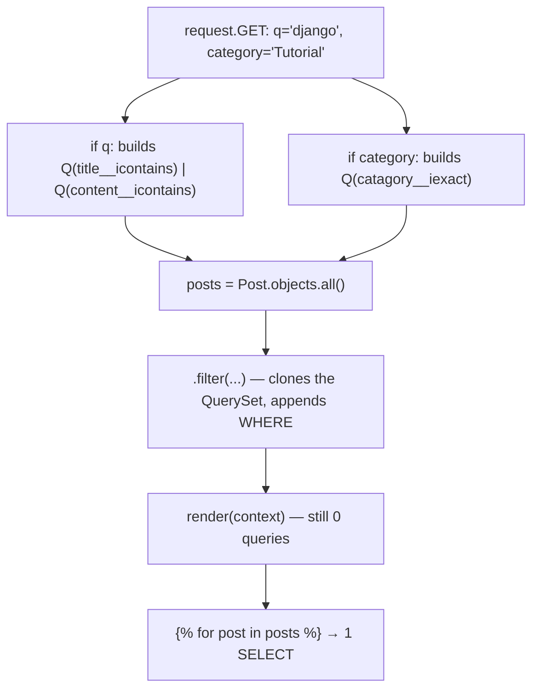
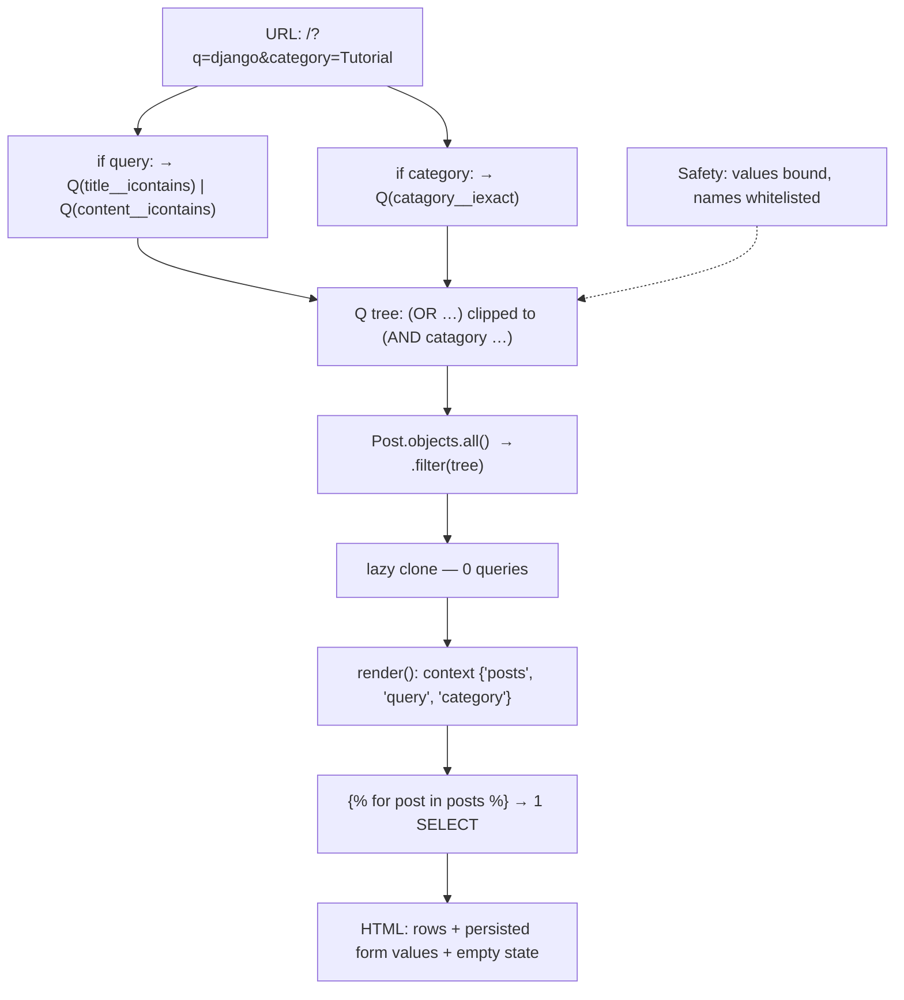

# 🚀 A040 — Dynamic QuerySets with Q Objects

`📖 Lecture A040` · `🎓 Track: Core Django` · `📶 Level: Intermediate` · `✅ Status: Documented`

> [!NOTE]
> **About this chapter's sources:** No lecture transcript exists in the folder, and the owner's
> command journal `commands.txt` adds **no new lines** for this lecture — it still ends at its
> 54th line, `pip install Pillow` (the A038 requirement). The chapter therefore rests on a single primary
> source: the **`myProject24/` artifact** — a Django project whose `blog` app holds one `Post`
> model, one view (`post_list`) that composes a **dynamic** QuerySet out of two `request.GET`
> parameters (`q`, `category`), one standalone template carrying a GET search form, a root-mounted
> route, and a live `db.sqlite3` holding **5 posts**. Every file quoted below is reproduced
> verbatim from that artifact.
>
> The scaffold is Django 5.2.4 (per `settings.py`'s docstring and the migration header); the live
> verification below ran it under **Django 6.1.1 / Python 3.14.6**, and no observed behaviour
> differs.
>
> This chapter was **verified live**, not just read: the artifact was booted, its view was
> exercised with eighteen different query strings, the SQL behind every arm of the `Q()` tree was
> captured (`LIKE '%django%' … OR …`, `AND catagory LIKE 'Tutorial'`), a SQL-injection payload was
> fired at the search box, the `FieldError` for a bogus keyword was reproduced, QuerySet
> immutability and query counts were measured, and Django's own `Q`/`Query` code paths were walked
> to confirm *why* each behaviour happens. The measurements appear in the "Live verification"
> tables. Anything supplementary to the artifact is marked 📌.
>
> This lecture builds directly on [A023 — ORM QuerySet All/Get/Filter](../A023_ORM_QuerySet_All_Get_and_Filter/README.md)
> and [A024 — Retrieve Data from a Database Table](../A024_Retrieve_Data_from_Database_Table/README.md)
> (the lookups and the chaining this chapter assembles *at runtime*), on
> [A025 — Display Table Data in Django Template](../A025_Display_Table_Data_in_Django_Template/README.md)
> (the `` loop that renders the rows), and on
> [A029 — HTML Forms, POST, CSRF Token & Validation](../A029_HTML_Forms_POST_CSRF_Token_&_Validation/README.md)
> (the GET form and `request.GET.get()`). It is the direct continuation of
> [A039 — Django Pagination](../A039_Django_Pagination/README.md), whose closing "Next Lecture
> Connection" named composable query logic — the `Q` object — as the very next step
> (`myProject23` → `myProject24`).

---

## 🧭 What You Will Learn

- [ ] Why a fixed `objects.all()` view cannot answer a search box, and why the two obvious chained-filter fixes (`filter(a=x, b=x)`, `filter(a=x) | filter(b=x)`) each fail differently
- [ ] What a `django.db.models.Q` object *is* — an expression **value**, not a QuerySet — and why `filter()` accepts it
- [ ] The three connectors: `|` (OR), `&` (AND), `~` (NOT), plus `^` (XOR) — and Python's precedence trap (`&` binds tighter than `|`)
- [ ] How to compose a query **incrementally** with `if` guards, starting from `objects.all()` and ending with no `WHERE` clause at all when no filter was supplied
- [ ] The exact SQL each arm produces — `LIKE '%django%' ESCAPE '\'` inside parentheses, `AND catagory LIKE 'Tutorial'` — and why one render costs exactly one query
- [ ] Why the parameter values are injection-proof while an f-string query is not (verified with `' OR 1=1 --`)
- [ ] The lookup pairings that belong in a search box: `icontains` for free text, `iexact` for a fixed vocabulary, `__in` for multi-select — plus the **SQLite `LIKE` case-insensitivity trap** that will bite you on PostgreSQL
- [ ] The artifact's two real bugs — the form posts `catagory` while the view reads `category`, and the template compares an **undefined** `catagory` variable — and the smallest correct fix
- [ ] What a dynamic queryset still owes you: keeping `?q=` alive on pagination links (A039), whitelisting user-supplied *field names*, and the leading-wildcard index cost 📌

## 🎯 Why This Lecture Matters

A039 taught the `Paginator` to answer one question: **which window** of rows do you want? This
lecture teaches a different and harder question: **which rows**? Those are not the same problem,
and the second one is the one every real application actually has. Every search box, every
category dropdown, every "filter by status / date / author / price" sidebar, every admin-style
filter panel on the internet is this lecture plus styling.

The trouble is that Django's default query tool — keyword arguments to `.filter()` — can only ever
say **AND**. Every keyword you add narrows the result set. That is exactly right for "Tutorial
posts **and** containing *django*", and exactly wrong for "posts whose *title* contains *django*
**or** whose *content* contains *django*", which is what a single search box must mean. There is no
keyword spelling for that OR. Table the difference:

| Question a user asks | Keyword filter can express it? |
|---|---|
| "posts in the *Tutorial* category" | ✅ `filter(catagory='Tutorial')` |
| "posts in *Tutorial* containing *django*" | ✅ `filter(catagory='Tutorial', title__icontains='django')` |
| "posts matching *django* **in the title or the content**" | ❌ no keyword form exists |
| "posts that are *Tutorial* **or** *News*" | ✅ only as `catagory__in=[…]`; no general OR |
| "posts **not** in *Tech*" | ✅ `exclude(catagory='Tech')`, but complex negations break down |
| "(featured **or** recent) **and** published" | ❌ the moment OR nests inside AND, keywords are hopeless |

The `Q` object is Django's answer, and it is a small, exact idea: a **condition you can hold in a
variable**. Once a condition is a value, you can combine it with other conditions using Python's
own `|`, `&` and `~` operators, store it, pass it around, build it up in a loop, and hand the
finished expression to `.filter()` — which accepts it alongside (or instead of) plain keywords.

The artifact proves how little this costs. Its whole view is **six lines of query logic** and it
implements a two-field search plus a category filter, with no SQL, no `raw()`, and no third-party
package. The database is untouched — a dynamic queryset needs **no migration**, because nothing
about the schema changed; only the `WHERE` clause is assembled at request time.

That is the shape of the lesson: the feature that makes search possible is not a new table and not
a new library, it is *a new kind of value in the view layer*.

## ✅ Prerequisites

- [ ] `objects.all()`, `objects.filter()`, `objects.count()` and the `field__lookup=value` syntax — A023
- [ ] Chaining filters, `exclude()`, `values()`/`values_list()`, and the fact that a QuerySet is **lazy** — A024
- [ ] The read view shape (route → view → QuerySet → context → template) and the `` loop — A025, A032
- [ ] `request.GET.get('name')` — the query-string half of a request, and why a GET form needs no `` — A009, A029
- [ ] `render(request, template, context)` and `{{ }}` dot lookups — A013
- [ ] `path()` + `include()` wiring and a root-mounted app — A007, A020
- [ ] 📌 Python's operator precedence for `&`, `|`, `~` (and that they are *overloadable methods*, not just logic gates)

## 🧩 The Problem — One Query Cannot Answer Every Question

Start from where A039 stopped, because the artifact in this folder is that project one lecture
later. A039's view was fixed:

```python
# A039's shape (myProject23) — correct, and completely static
def post_list(request):
    post = Post.objects.all().order_by('id')
    paginator = Paginator(post, 4)
    page_obj = paginator.get_page(request.GET.get('page'))
    return render(request, 'blog/post_list.html', {'page_obj': page_obj})
```

Every visitor, on every request, gets the same rows in the same order — the only thing the URL can
change is *which slice* of them appears. Now add the form that every blog eventually grows: a text
box named `q` and a category dropdown. The URL becomes `/?q=django&category=Tutorial`, and the view
has to turn **two arbitrary strings** into one `WHERE` clause. Three attempts follow, and each one
teaches something the `Q` object exists to solve.

### Attempt 1 — "Just pass both keywords to `filter()`"

The reflex, and the one nearly everybody writes first:

```python
# WRONG for a search box: AND, not OR
posts = Post.objects.filter(
    title__icontains=query,
    content__icontains=query,
)
```

Two keyword arguments in one `.filter()` call are joined with **AND** — that is the documented
semantic, and A024 already met it. So this query means "the title contains *django* **and** the
content contains *django*". For the artifact's row `Django Basics` — title `'Django Basics'`,
content `'Learn Django step by step'` — that happens to be true. But a post titled `'Deploying
Django'` whose body says `'Here is how'` would be **invisible**, and a search for a word that
appears in only one of the two fields silently returns nothing. The user sees an empty page and
concludes the search is broken. It is not broken; it is answering a different question.

The lesson: **`filter(a=x, b=x)` is an AND, and AND is the wrong connective for "search everywhere".**

### Attempt 2 — "Build the SQL myself"

The second reflex, born of frustration, is to reach for string interpolation — often via `raw()` or
`extra()`:

```python
# WRONG: never interpolate user input into SQL
posts = Post.objects.raw(
    f"SELECT * FROM blog_post WHERE title LIKE '%{query}%' OR content LIKE '%{query}%'"
)
```

This "works" for the happy path and is a **SQL-injection hole** for everything else. The artifact's
own view was probed with the classic payload:

```text
GET /?q=' OR 1=1 --
rows returned: 0      ← the string was searched for, not executed
```

An f-string version of the same query would have returned **every row**, because the payload closes
the quote and makes the `WHERE` clause true for the whole table — a toy consequence on a 5-row blog,
but the same mechanism reads `auth_user.password` on a real schema. Django's ORM exists largely so
that this class of bug is impossible: values are always **bound parameters**, never text spliced
into SQL. 📌 That is why the generated SQL for the probe shows the payload *inside* the pattern
(`LIKE %' OR 1=1 --%`) while the executed statement carries a placeholder and the value travels
separately.

The lesson: **the OR has to be expressible in the ORM, or people will leave the ORM.**

### Attempt 3 — "OR the QuerySets themselves"

There *is* an OR available on QuerySets, and it is worth naming precisely because it is not the
answer this lecture teaches:

```python
# Legal, and it really does produce OR — but it stops composing here
posts = Post.objects.filter(title__icontains=query) | Post.objects.filter(content__icontains=query)
```

Django documents `|` on QuerySets, and it produces `OR` SQL just like a `Q` tree.
Three things make it the wrong tool for dynamic views:

1. **It cannot be mixed back into a chain cleanly.** `(qs_a | qs_b).filter(catagory='Tutorial')`
   works, but the moment the *second* filter also contains an OR, you are union-ing querysets that
   each need their own OR — the code multiplies.
2. **It is a QuerySet-level operator.** You are combining *result sets*, not *conditions*, so you
   cannot build the condition first, inspect it, log it, or store it in a variable before any
   QuerySet exists.
3. **Combining querysets has documented restrictions** around `order_by`, `values()` and
   annotations that simply do not apply to conditions.

The lesson: **OR belongs to the condition, not to the result set.**

### The shape of the answer

What all three attempts were missing is a data type for *conditions*. Django ships one:

```python
from django.db.models import Q

posts = Post.objects.filter(
    Q(title__icontains=query) | Q(content__icontains=query)
)
```

`Q(title__icontains=query)` is a **condition object**. `|` builds a new condition object meaning
"either side is true". `.filter()` accepts it exactly where it accepts keywords. That is the whole
idea — everything else in this chapter is consequence.

## 🧠 Q Objects — Filters That Are Values

### Definition first

`Q` is Django's class for a **boolean condition over a table's columns**. It lives in
`django.db.models` and is imported explicitly:

```python
from django.db.models import Q
```

A `Q` instance stores a **tree of lookups**, not rows and not SQL. Asking Django to print one shows
exactly that tree — this is the real output from the artifact's shell, not a sketch:

```text
Q(title__icontains='django')                      <Q: (AND: ('title__icontains', 'django'))>
Q(title__icontains='django') | Q(content__...)    <Q: (OR: ('title__icontains', 'django'), ('content__icontains', 'django'))>
Q(title__icontains='django') & Q(catagory='Tech') <Q: (AND: ('title__icontains', 'django'), ('catagory', 'Tech'))>
~Q(catagory='Tech')                               <Q: (NOT (AND: ('catagory', 'Tech')))>
Q()                                               <Q: (AND: )>
```

Three attributes hold that tree, and knowing them makes the printed form readable:

```text
Q(title__icontains='django').children   == [('title__icontains', 'django')]
Q(title__icontains='django').connector  == 'AND'
Q(title__icontains='django').negated    == False
```

- **`children`** — the leaves (lookup tuples) and/or nested `Q` nodes.
- **`connector`** — how the children combine: `'AND'` (the default) or `'OR'`.
- **`negated`** — whether the whole node is wrapped in `NOT`.

So `Q` is not "a filter" in the sense of "a finished query". It is an **expression node**, the same
kind of object A023's keyword arguments are converted into internally: `.filter()` builds a `Q` out
of its `**kwargs` before handing it to the query compiler. Writing `Q(...)` yourself just gives you
that object *before* it reaches `.filter()` — which is the entire point, because an object can be
**combined, stored and reused**.

> [!IMPORTANT]
> **A `Q` is not a QuerySet.** It has no `.objects`, it never touches the database, and printing it
> runs zero SQL (verified: `hasattr(Q(...), 'objects')` is `False`). It becomes a `WHERE` clause only
> when a QuerySet method — `.filter()`, `.exclude()`, `.get()` — receives it.

### The eight lines worth memorising

```python
from django.db.models import Q

Q(field__lookup=value)          # one condition
Q(a=1) & Q(b=2)                 # AND  → both must be true
Q(a=1) | Q(b=2)                 # OR   → either may be true
~Q(a=1)                         # NOT  → must not be true
Q(a=1) ^ Q(b=2)                 # XOR  → exactly one must be true 📌
Q()                             # the identity: filters nothing
Q(a=1) & Q(b=2) | Q(c=3)        # ⚠️ binds as  Q(a=1) & (Q(b=2) | Q(c=3))
qs.filter(Q(a=1) | Q(b=2), c=3) # Q OR-tree AND'd with the keyword c=3
```

Everything else about `Q` is a consequence of those lines. Each operator returns a **new** `Q`
(verified: after `q1 | q2`, `q1` is still `<Q: (AND: ('title__icontains', 'django'))>`), so `Q`
objects are safe to keep in module constants or reuse across calls.

### What each connector compiles to

This is the heart of the lecture — the same four rows as SQL, captured from the artifact's database.
The `Q` on the left, the `WHERE` clause on the right:

| Python | SQL shape (SQLite, verbatim from the log) |
|---|---|
| `filter(catagory='Tech')` | `WHERE "blog_post"."catagory" = 'Tech'` |
| `filter(Q(title__icontains='django') \| Q(content__icontains='django'))` | `WHERE ("blog_post"."title" LIKE '%django%' ESCAPE '\' OR "blog_post"."content" LIKE '%django%' ESCAPE '\')` |
| `filter(Q(title__icontains='django') & Q(catagory='Tech'))` | `WHERE ("blog_post"."title" LIKE '%django%' ESCAPE '\' AND "blog_post"."catagory" = 'Tech')` |
| `filter(~Q(catagory='Tech'))` | `WHERE NOT ("blog_post"."catagory" = 'Tech' AND "blog_post"."catagory" IS NOT NULL)` |
| `filter(Q(catagory='Tech') ^ Q(title__icontains='a'))` 📌 | `WHERE (("blog_post"."catagory" = 'Tech' OR "blog_post"."title" LIKE '%a%' ESCAPE '\') AND 1 = (CASE WHEN "blog_post"."catagory" = 'Tech' THEN 1 ELSE 0 END + CASE WHEN "blog_post"."title" LIKE '%a%' ESCAPE '\' THEN 1 ELSE 0 END))` |

Four facts fall out of that table, and each one is worth its own line:

1. **The OR tree is parenthesised.** `WHERE (… OR …)` — Django never lets the OR leak out and
   swallow a sibling `AND`. That is why nesting works.
2. **`~Q` adds a `IS NOT NULL` guard.** `NOT (catagory = 'Tech')` alone would be three-valued logic
   (`NULL = 'Tech'` is unknown, not false), and SQL's `NOT unknown` is still unknown — so a row with
   `catagory = NULL` would vanish from both `filter(catagory='Tech')` *and* `~Q(catagory='Tech')`.
   Django writes the extra `IS NOT NULL` so the negated set is the true complement. The artifact's
   model is `blank=True, null=True`, so this is not theoretical.
3. **`icontains` becomes `LIKE '%…%' ESCAPE '\'`.** The `%`-wildcards on both sides are what make it
   a "contains" search, and the explicit `ESCAPE` clause is how Django keeps a literal `%` or `_` in
   the user's text from being treated as a wildcard.
4. **XOR exists but is expensive** 📌 — it compiles to a `CASE WHEN … THEN 1 ELSE 0 END` sum compared
   against 1. Useful; not free. The artifact does not use it.

### Picture the composition

The view builds a *condition*, hands it to a QuerySet, and only the template's `` turns the
result into rows. Nothing in the middle touches the database:



Read it as: **two independent `if` guards feed one chain**, and the SQL appears only at the last box.
That is the pattern the next section composes, line by line.

## 🧱 Building the Query Incrementally — the `if`-Guard Pattern

A dynamic queryset has a shape, and it is always the same three beats:

1. **Start from everything.** `posts = Post.objects.all()` — the unfiltered QuerySet that is
   *also* the correct answer when the user supplied no filters.
2. **Guard each parameter.** `if query:` … `if category:` — never trust that a parameter exists, and
   never assume it is non-empty.
3. **Hand the composed queryset to `render()`.** One context key, one template loop.

### The artifact's view, verbatim

Six lines of query logic, and every one of them is load-bearing:

```python
from django.shortcuts import render
from .models import Post
from django.db.models import Q

def post_list(request):
    query = request.GET.get('q') # serach keyword
    category = request.GET.get('category') # category filter

    posts = Post.objects.all()

    #Search using Q objects
    if query:
        posts = posts.filter(
            Q(title__icontains=query) |
            Q(content__icontains=query)
        )

    # Filter by category
    if category:
        posts = posts.filter(catagory__iexact=category)

    return render(request, 'blog/post_list.html', {
        'posts': posts,
        'query': query,
        'category': category,
    })
```

Line by line:

1. **`query = request.GET.get('q')`** — the raw string or `None`. No `int()`, no cleaning: the value
   is only ever used as a *pattern*, never as SQL text.
2. **`category = request.GET.get('category')`** — note the *name split*, which matters later: the
   parameter read here is `category` (British-ish spelling with `e`), while the model field is
   `catagory` (the author's spelling, carried into the migration). The two are different strings and
   Django never connects them for you.
3. **`posts = Post.objects.all()`** — the starting point. If both guards are skipped, this is what
   renders: all 5 rows, **zero `WHERE` clauses** (verified).
4. **`if query:`** — a **truthiness** test, not `is not None`. An absent key gives `None` (falsy), a
   bare `?q=` gives `''` (falsy), and only a non-empty string runs the filter. `?q=   ` (a space) is
   *truthy*, so it does run a filter — the `' '` pattern simply matches every row whose title
   contains a space (verified: 5 rows).
5. **`Q(title__icontains=query) | Q(content__icontains=query)`** — the OR arm: title **or** content.
   The `|` is Python's bitwise-or *operator*, which `Q` implements as "combine as OR" (`__or__`).
6. **`posts = posts.filter(...)`** — reassigning the same name is idiomatic and safe: `.filter()`
   returns a **new, cloned QuerySet** and leaves the old one untouched (verified: a derived queryset
   left the original `base` still counting 5). Nothing has executed yet.
7. **`posts.filter(catagory__iexact=category)`** — the second, independent guard. The lookup is
   `iexact` (case-insensitive equality) because a category is a **fixed vocabulary**, not free text:
   `Tech` should match `tech`, but `Techno` must not, and there are no partial matches to want.
8. **`{'posts', 'query', 'category'}`** — three context keys: the rows, and the two inputs the
   template echoes back into the form so the user's search *persists* after submit (A029's
   "django repopulates the form" habit).

### Why the guards must be independent

The urge to "clean this up" into one expression is strong, and it is wrong:

```python
# WRONG: an empty parameter now nukes the result set
posts = Post.objects.filter(
    Q(title__icontains=query) | Q(content__icontains=query),
    catagory__iexact=category,          # ← also fires when category is None/''
)
```

Two failures in one line: `icontains=None` raises `ValueError: Cannot use None as a query value`
(verified), and `catagory__iexact=''` matches only rows whose category is exactly the empty string —
of which there are **none** in the artifact (verified: `catagory__iexact=''` → 0 rows). The
single-expression style is only correct in a `Form`-validated view, where a missing field arrives as
a cleaned default. With raw `request.GET`, one `if` per parameter is the pattern.

### The composed SQL

Each guard appends one clause, and Django **ANDs clauses from separate `.filter()` calls** — so two
guards produce one round trip, not two. This is the exact statement the artifact ran for
`/?q=django&category=Tutorial`:

```sql
SELECT "blog_post"."id", "blog_post"."title", "blog_post"."content", "blog_post"."catagory"
FROM "blog_post"
WHERE (("blog_post"."title" LIKE '%django%' ESCAPE '\'
        OR "blog_post"."content" LIKE '%django%' ESCAPE '\')
       AND "blog_post"."catagory" LIKE 'Tutorial' ESCAPE '\')
```

Read the parentheses: the OR arm is a **unit**, and the category is `AND`ed to it. That nesting is
the whole reason a dynamic filter panel works — and it is exactly the nesting that keywords alone
cannot express.

### What one render costs

`render()` itself runs **no queries** — the queryset is lazy and is not evaluated until something
consumes it. The template's `` consumes it once, so a filtered page is **exactly one
`SELECT`** (verified with `CaptureQueriesContext`: 1 query for `/?q=django&category=Tutorial`, and 1
query for `/`). Forgetting this is how the N+1 trap starts: touching `post.author.name` inside that
loop runs *one more query per row* (📌 `select_related` is the fix).

## 🔍 Lookups That Belong in a Dynamic Query

A dynamic query is only as good as the **lookups** it chooses. The lookup is the part after `__` in
`field__lookup=value`, and picking the wrong one is how a search box ends up case-sensitive, or a
category dropdown starts matching substrings. The artifact uses exactly two, and both choices are
correct:

| Field | Lookup used | Why that one |
|---|---|---|
| `title`, `content` | `icontains` | free text — the user may type any case, and should match a *part* of the field |
| `catagory` | `iexact` | fixed vocabulary — `Tech` must match `tech` but must **not** match `Techno` |

### The lookup → SQL map (verified on this artifact)

| Lookup | SQL emitted | Artifact probe result |
|---|---|---|
| `exact='Tech'` | `"catagory" = 'Tech'` | case-**sensitive**: `exact='tech'` → **0 rows** |
| `iexact='TECH'` | `"catagory" LIKE 'TECH' ESCAPE '\'` | case-insensitive: → **1 row** (`ReactJS vs Angular`) |
| `contains='dj'` | `"title" LIKE '%dj%' ESCAPE '\'` | matched `Django Basics` — **and** matched for `'DJANGO'` too (see the trap below) |
| `icontains='django'` | `"title" LIKE '%django%' ESCAPE '\'` | 1 row |
| `istartswith='dj'` | `"title" LIKE 'dj%' ESCAPE '\'` | prefix, case-insensitive |
| `in=['Tech','News']` | `"catagory" IN ('Tech', 'News')` | 3 rows: `AI News`, `ReactJS vs Angular`, `Tech World` |
| `isnull=True` | `"catagory" IS NULL` | 0 rows — every artifact row has a category |

Two subtleties hide in that table:

1. **`iexact` goes through `LIKE`, not `=`** — and Django writes an `ESCAPE` clause even when the
   pattern has no wildcard. That is not decoration: it is how a literal `%` in user input stays
   literal. Probe: `catagory__iexact='50%'` compiles to `LIKE '50\%' ESCAPE '\'` — the `%` is
   escaped, so it searches for a category literally named `50%` instead of matching every category
   that starts with `50`.
2. **`__in` is the right shape for multi-select**, and it is what turns a *list* of categories into
   one clause. The view side of that is `request.GET.getlist('category')` — verified on
   `?category=Tech&category=News`: `.get()` returns only the **last** value (`'News'`), while
   `.getlist()` returns `['Tech', 'News']`. A single-select dropdown wants `.get()`; a
   `<select multiple>` or a row of checkboxes wants `.getlist()`.

### ⚠️ The SQLite trap: `contains` is *also* case-insensitive here

This one is important enough to be its own subsection, because it produces the worst kind of bug —
one that works on your laptop and fails in production:

```text
SQLite probe:
Post.objects.filter(title__contains='DJANGO')  →  ['Django Basics']   ← matched!
Post.objects.filter(title__contains='django')  →  ['Django Basics']
```

On SQLite, `contains` and `icontains` both compile to `LIKE`, and **SQLite's `LIKE` is
case-insensitive for ASCII by default**. So on SQLite the two lookups behave identically, and a view
written with `contains` "works" — until the project moves to PostgreSQL, where `contains` compiles to
`LIKE` (case-sensitive) and `icontains` compiles to `ILIKE`. The search box that matched `Django`
when the user typed `django` suddenly returns nothing.

📌 The rule that survives the move: **always write the lookup you actually mean.** If case does not
matter, write `icontains`/`iexact` — never rely on the backend being forgiving. Django's
documentation is explicit that `contains` is case-sensitive on PostgreSQL/MySQL and that SQLite
treats `LIKE` as case-insensitive; the difference is a backend detail, not a Django promise.

### 📌 Performance footnote: leading wildcards cannot use an index

`icontains` compiles to `LIKE '%django%'`. A B-tree index on `title` can be used to answer
`LIKE 'django%'` (a prefix search) because the index is sorted left-to-right — but a pattern that
*starts* with `%` gives the planner nothing to seek on, so it degrades to a full scan. Two
consequences worth knowing before the table grows:

- Prefix search (`istartswith`) is index-friendly; infix search (`icontains`) is not.
- Full-text search at scale belongs to a dedicated tool (`SearchVector`/`SearchQuery` with a
  `GinIndex` on PostgreSQL, or an external engine). `Q`-based `icontains` is the right tool for a
  blog and the wrong tool for a million-row catalogue.

## 🔧 The Artifact — Six Files, Verbatim

### 1. `blog/models.py` — three fields, and a spelling that will matter

```python
from django.db import models

class Post(models.Model):
    title = models.CharField(max_length=200)
    content = models.TextField()
    catagory = models.CharField(max_length=100,blank=True,null=True)

    def __str__(self):
        return self.title
```

Read the third field name twice: **`catagory`**, not `category`. The typo is *consistent* — it is
spelled that way in the model, in the migration, in the template's loop (`{{ post.catagory }}`) and
in the view's lookup (`catagory__iexact`) — so the *database* side works perfectly. It breaks only
where a human wrote the other spelling: `request.GET.get('category')` in the view and
`<select name="catagory">` in the template. That mismatch is the artifact's real bug, dissected in
§3 below and fixed in §Practical Example.

Two more facts about the model, both from A022's rules: `CharField` needs `max_length` (200 here),
and `blank=True, null=True` on `catagory` means the column accepts an empty string *and* a SQL
`NULL` — which is why `~Q(catagory=…)` grew that `IS NOT NULL` guard earlier. There is **no
`Meta`** class at all: no ordering, no constraints, no verbose names.

### 2. `blog/migrations/0001_initial.py` — the table this lecture queries

```python
# Generated by Django 5.2.4 on 2025-10-03 08:49

from django.db import migrations, models


class Migration(migrations.Migration):

    initial = True

    dependencies = [
    ]

    operations = [
        migrations.CreateModel(
            name='Post',
            fields=[
                ('id', models.BigAutoField(auto_created=True, primary_key=True, serialize=False, verbose_name='ID')),
                ('title', models.CharField(max_length=200)),
                ('content', models.TextField()),
                ('catagory', models.CharField(blank=True, max_length=100, null=True)),
            ],
        ),
    ]
```

This chapter adds **no migration**: a dynamic queryset changes the `WHERE` clause, never the schema.
The table name is `blog_post` (the `appname_modelname` rule from A022), and the scaffold version
stamp is 5.2.4.

### 3. The data — 5 rows, three categories

The artifact's `db.sqlite3` holds exactly five posts, read straight out of the shell:

| id | title | content | catagory |
|---|---|---|---|
| 1 | `Django Basics` | `Learn Django step by step` | `Tutorial` |
| 2 | `AI News` | `Latest AI trends in 2025` | `News` |
| 3 | `ReactJS vs Angular` | `Comparison article` | `Tech` |
| 4 | `Python Advanced` | `Learn advanced Python` | `Tutorial` |
| 5 | `Tech World` | `Technology updates worldwide` | `News` |

Five rows is a *deliberate* pedagogical size: every probe below can be checked by eye, and the data
was chosen so the OR arm is testable — `Django Basics` matches *django* in **both** title and
content, `Python Advanced` matches *learn* in **content only**, and `Tech World` matches *tech* in
**title only**. Those three rows are the proof that the OR is real; a title-only filter would hide
row 4, a content-only filter would hide row 5, and an AND filter would hide both.

### 4. `myProject24/settings.py` — stock, with only `blog` added

```python
INSTALLED_APPS = [
    'django.contrib.admin',
    'django.contrib.auth',
    'django.contrib.contenttypes',
    'django.contrib.sessions',
    'django.contrib.messages',
    'django.contrib.staticfiles',
    'blog',
]
```

```python
ROOT_URLCONF = 'myProject24.urls'

TEMPLATES = [
    {
        'BACKEND': 'django.template.backends.django.DjangoTemplates',
        'DIRS': [BASE_DIR / 'templates'],
        'APP_DIRS': True,
        'OPTIONS': {
            'context_processors': [
                'django.template.context_processors.request',
                'django.contrib.auth.context_processors.auth',
                'django.contrib.messages.context_processors.messages',
            ],
        },
    },
]
```

Three things to notice, all relevant to the bugs later:

- **`APP_DIRS: True`** is what makes `blog/templates/blog/post_list.html` discoverable — A011's
  app-level template lane, unchanged.
- **`DIRS: [BASE_DIR / 'templates']` points at a folder that does not exist** — a fossil carried in
  from A010's project-level template lecture. Harmless (Django ignores a missing dir), and notably
  it does **not** raise a system-check warning here: `manage.py check` on this artifact reports
  *"System check identified no issues (0 silenced)."* (unlike A038/A039, whose `STATICFILES_DIRS`
  ghosts produced `staticfiles.W004`).
- **No `string_if_invalid` is configured**, so an undefined template variable renders as the empty
  string (`''`) rather than raising. That default is exactly why the template's `catagory` bug is
  *silent* — it is worth remembering as the reason template typos never crash.

### 5. `blog/templates/blog/post_list.html` — the form, verbatim (35 lines)

```html
<!DOCTYPE html>
<html>
<head>
    <title>Django Search & Filter</title>
</head>
<body>
    <h1>Search & Filter Example</h1>

    <form method="get" class="search-form">
        <input type="text" name="q" placeholder="Search..." value="{{ query }}">

        <select name="catagory">
            <option value="">All Categories</option>
            <option value="Tech" selected>Tech</option>
            <option value="News" selected>News</option>
            <option value="Tutorial" selected>Tutorial</option>
        </select>

        <button type="submit">Search</button>
    </form>

    <ul>
        
            <li>
                <h2>{{ post.title }}</h2>
                <p>{{ post.content }}</p>
                <p><strong>Category:</strong> {{ post.catagory }}</p>
            </li>
        
            <li>No posts found.</li>
        
    </ul>

</body>
</html>
```

The page is a **standalone** template (like A019/A039's): no ``, no ``,
no `` — a **GET** form needs no CSRF token, because A029's rule is about
state-changing POSTs, and a search only reads. Four things are worth pointing at:

1. **`<form method="get">` with no `action`** — the form submits back to the *same* URL (`/`), and
   the browser appends the inputs as a query string: `/?q=django&catagory=Tech`. That is the whole
   mechanism by which a search box becomes a URL (and why the result is bookmarkable).
2. **`value="{{ query }}"`** — verified live: rendering `/?q=django` produces
   `value="django"`, so the user's term survives the round trip. Without this context key, every
   search would blank the box.
3. **`selected`** — the guard that should mark the current
   category in the dropdown… and **never fires**. See the bug below.
4. **The loop body prints `post.content` in full** — with real posts that would dump article bodies
   into a list page; the correct shape is a truncated snippet (`{{ post.content|truncatewords:20 }}`
   📌, A014's filter). Also note `` **is** present — verified live: 0-match searches render
   `<li>No posts found.</li>` — which is the empty state A039's template lacked.

### 6. `blog/urls.py` + `myProject24/urls.py` + `admin.py` — unchanged plumbing

```python
# blog/urls.py
from django.urls import path
from . import views

urlpatterns = [
    path('', views.post_list, name='post_list'),
]
```

```python
# myProject24/urls.py (artifact lines 20–23; stock docstring header omitted)
from django.contrib import admin
from django.urls import path, include

urlpatterns = [
    path('admin/', admin.site.urls),
    path('', include('blog.urls')),
]
```

```python
# blog/admin.py
from django.contrib import admin
from .models import Post

admin.site.register(Post)
```

Same root-mount pattern as A020/A039: `path('', include('blog.urls'))` hands the empty prefix to the
app, so `GET /` reaches `post_list` and there is still exactly **one** page in the project
(`/nope/` → 404, `/admin/` → 302). `Post` is registered with the plain one-line
`admin.site.register(Post)` form from A027 — never imported in the view, but it is worth knowing
that the **admin's own search box** is a `Q`-object application in disguise (📌 `ModelAdmin`'s
`search_fields` builds OR'd `icontains` lookups for you; A028 set that up declaratively).

### The artifact's two real bugs (per AGENTS §12)

Both bugs live on the seam between *the model's spelling* (`catagory`) and *the author's intent*
(`category`), and both are silent.

| # | Bug | Evidence | Fix |
|---|---|---|---|
| 1 | **The form and the view disagree on the parameter name.** The `<select>` posts `catagory`; the view reads `request.GET.get('category')`. The dropdown therefore filters **nothing**. | Live probe: `/?catagory=Tech` → **5 rows** (unfiltered), while `/?category=Tech` → **1 row**. The form can only ever produce the first. | Rename the form field to `name="category"` (one word). |
| 2 | **The template compares an undefined variable.** `` looks for `catagory` in the context, but the view supplies `category`. With `string_if_invalid=''`, the comparison is `'' == 'Tech'` → always false. | Live probe: every rendered `<option>` came out as `<option value="Tech" >Tech</option>` — an **empty attribute**, never `selected`; and an isolated template render confirmed `catagory` → `''` while `category` → `'selected'`. | Compare `` (or pass both names). |

A third, softer note: the view passes **both** `query` and `category` into the context but only
`query` is ever used by the template — `category` is the unused twin of the buggy `catagory`. After
the one-word fix both keys are used and the mismatch disappears; that is the tell that the
misspelling, not the logic, was the problem.

## 📊 Live Verification — Eighteen Query Strings, One View

This is the chapter's evidence table. Every row was produced by driving the artifact's real view
through the test client (`Client().get(url)`, with `SERVER_NAME='localhost'` because
`ALLOWED_HOSTS=[]` under `DEBUG=True` only accepts the loopback names) and counting the rendered
`<h2>` elements. All eighteen returns were **HTTP 200** — no input, however hostile or empty,
crashed the view. That robustness is not an accident; it is the direct consequence of *pattern
parameters* rather than concatenated SQL.

| # | Request | Rows rendered | Why |
|---|---|---|---|
| 1 | `/` | 5 | no parameters → both `if` guards are skipped → **no `WHERE` clause at all** |
| 2 | `/?q=django` | 1 | `Django Basics` — matched in the **title** |
| 3 | `/?q=learn` | 2 | `Django Basics` + `Python Advanced` — matched in the **content** (the OR arm's proof) |
| 4 | `/?q=advanced` | 1 | `Python Advanced` |
| 5 | `/?q=news` | 1 | `AI News` — matched in the title |
| 6 | `/?q=NEWS` | 1 | same row — `icontains` is case-insensitive, so case never matters |
| 7 | `/?q=tech` | 1 | `Tech World` |
| 8 | `/?q=zzz` | 0 | no match → `` renders *"No posts found."* |
| 9 | `/?q=` | 5 | `''` is **falsy** → the `if query:` guard is skipped entirely |
| 10 | `/?q=%20` (a space) | 5 | `' '` is **truthy** → the filter *does* run; `LIKE '% %'` matches all five titles (every one contains a space) |
| 11 | `/?q=django&q=python` | 1 | `QueryDict.get()` returns the **last** value → searched for `python` |
| 12 | `/?category=Tech` | 1 | `ReactJS vs Angular` — the category arm works **when the parameter name matches** |
| 13 | `/?category=tech` | 1 | same row — `iexact` ignores case |
| 14 | `/?category=Nope` | 0 | valid syntax, no such category → the empty state renders |
| 15 | `/?catagory=Tech` | **5** | ⚠️ **the bug**: the form's own parameter name (`catagory`) is not the key the view reads, so the filter is ignored |
| 16 | `/?q=django&category=Tutorial` | 1 | both guards fire: `(title OR content) AND catagory` — the composed nesting |
| 17 | `/?category=Tutorial&q=` | 2 | the empty `q` is ignored; both `Tutorial` rows return |
| 18 | `/?category=Tech&category=News` | 2 | last-wins → filtered by `News` → `AI News` + `Tech World` |

Rows 3, 7 and 11 are the ones to remember: 3 proves the search reaches **content**, 7 proves it
reaches **title**, and 11 proves the parameter plumbing is `QueryDict`, not something bespoke.
Row 15 is the bug, and row 14's `No posts found.` is the empty state that makes a zero-result
search *look* intentional to the user.

### The SQL those eighteen requests produced

Four statements, captured with `CaptureQueriesContext`. Nothing here is paraphrased — this is what
the database received:

```sql
-- #1  GET /   (no parameters: no WHERE at all)
SELECT "blog_post"."id", "blog_post"."title", "blog_post"."content", "blog_post"."catagory" FROM "blog_post"
```

```sql
-- #2  GET /?q=django   (one SELECT, one parenthesised OR tree)
SELECT "blog_post"."id", "blog_post"."title", "blog_post"."content", "blog_post"."catagory" FROM "blog_post"
WHERE ("blog_post"."title" LIKE '%django%' ESCAPE '\' OR "blog_post"."content" LIKE '%django%' ESCAPE '\')
```

```sql
-- #16 GET /?q=django&category=Tutorial   (the OR tree AND'd with the category)
SELECT "blog_post"."id", "blog_post"."title", "blog_post"."content", "blog_post"."catagory" FROM "blog_post"
WHERE (("blog_post"."title" LIKE '%django%' ESCAPE '\' OR "blog_post"."content" LIKE '%django%' ESCAPE '\')
       AND "blog_post"."catagory" LIKE 'Tutorial' ESCAPE '\')
```

```sql
-- #12 GET /?category=Tech   (iexact: LIKE with no wildcards, plus a defensive ESCAPE)
SELECT "blog_post"."id", "blog_post"."title", "blog_post"."content", "blog_post"."catagory" FROM "blog_post"
WHERE "blog_post"."catagory" LIKE 'Tech' ESCAPE '\'
```

Two more measurements matter to anybody who cares about cost, and both were taken live:

```text
queries for a filtered render (/?q=django&category=Tutorial): 1
queries for an unfiltered render (/):                          1
```

```text
base      = Post.objects.all()                     → base.count()      = 5
filtered  = base.filter(Q(title__icontains='a') | Q(content__icontains='a'))
                                                     → filtered.count() = 5
                                                     → base.count()     = 5   (base untouched)
```

The second block is the immutability proof: `.filter()` returns a **clone**, so the original
queryset — and any queryset you built earlier in the view — is never mutated behind your back.

## ⚠️ Safety, Typos and Failure Modes

A dynamic queryset is assembled from **untrusted input**, so it is worth being explicit about what
the ORM protects and what it does not.

### What the ORM protects: values

Values are always **bound**, never spliced. Three live probes make that concrete:

```text
q = ' OR 1=1 --                    →  0 rows      (searched for as text)
q = %                              →  0 rows      (a literal percent, not a wildcard)
q = _                              →  0 rows      (a literal underscore, not "any character")
```

The generated patterns show why: the payload arrives inside the pattern
(`LIKE %' OR 1=1 --% ESCAPE '\'`), and the wildcard characters are **escaped**
(`LIKE '%\%%' ESCAPE '\'`). So a user typing `%` does not suddenly match every row — which is
exactly the bug a hand-written `LIKE '%{q}%'` string would produce, before injection even enters the
picture.

📌 If you ever genuinely need raw SQL, `Model.objects.raw(sql, [params])` binds a parameter list —
and Django's docs are explicit that interpolating `%s` into the SQL string instead is "unsafe and
strongly discouraged". The rule never changes: **structure in code, values in parameters.**

### What the ORM does *not* protect: names

Field names and lookup names are **code**, and they cannot be parameters. So a view that lets the
user pick the *column* must whitelist it:

```python
# WRONG: the user controls part of the keyword name
posts = Post.objects.order_by(request.GET.get('sort', 'id'))

# RIGHT: map user input onto known-safe values
SORTABLE = {'newest': '-id', 'oldest': 'id', 'title': 'title'}
posts = Post.objects.order_by(SORTABLE.get(request.GET.get('sort'), '-id'))
```

The whitelist does two jobs at once: it prevents a `FieldError` (see below) and it prevents a
malicious value from steering the query. The same rule applies to a "search these fields" checkbox
list — accept a *key* (`title`, `content`), never a raw field string.

### The typos that *do* fail loudly

A misspelled keyword is not silent — and it fails **immediately**, at `.filter()` time rather than at
evaluation (verified by traceback):

```text
>>> Post.objects.filter(Q(bogus_field=1))
FieldError: Cannot resolve keyword 'bogus_field' into field. Choices are: catagory, content, id, title
```

That error message is the friendliest thing about the ORM: it lists the legal choices, which is how
you catch a `catagory`/`category` slip in the *view* (a Python file, where `manage.py check` and
your editor can help). The artifact's bugs are the other kind — the slip is in a **string** the
template and the view pass to each other, and nothing checks strings.

### The one genuinely surprising behaviour: `Q()` is the identity

```text
>>> Post.objects.filter(Q()).count()
5
>>> Post.objects.filter(Q()).query
SELECT ... FROM "blog_post"                    ← no WHERE clause at all
```

An empty `Q()` adds **nothing** — it is the neutral element of the AND tree, and Django compiles it
away. This is why the incremental pattern is so robust: even if you build a `q = Q()` accumulator and
never `&=` anything into it, `filter(q)` degrades gracefully into `all()`. `Post.objects.filter()`
with no arguments behaves the same way (verified: identical SQL to `.all()`).

### Three more behaviours worth knowing

| Behaviour | Verified result | Why it matters |
|---|---|---|
| `exclude(Q(a) \| Q(b))` | `WHERE NOT ((… OR …))` → 3 rows (the complement of the 2 matched) | `exclude` negates the **whole tree**, not each leaf — `NOT (a OR b)` ≠ `(NOT a) OR (NOT b)` |
| `get(Q(a) \| Q(b))` with 3 matches | `MultipleObjectsReturned: get() returned more than one Post -- it returned 3!` | `Q` composes with every QuerySet method, and `get()`'s single-row contract still applies |
| `filter(Q(a) \| Q(b), c='x')` | `WHERE ((a OR b) AND c)` | keyword arguments and `Q` objects **mix freely**; keywords are ANDed onto the tree |

### Precedence, one last time

The composition operators are Python operators, so Python's precedence applies — and `&` binds
tighter than `|` (verified with `repr`):

```text
Q(title__icontains='django') | Q(content__icontains='django') & Q(catagory='Tech')
→ <Q: (OR: ('title__icontains', 'django'),
        (AND: ('content__icontains', 'django'), ('catagory', 'Tech')))>

(Q(title__icontains='django') | Q(content__icontains='django')) & Q(catagory='Tech')
→ <Q: (AND: (OR: ('title__icontains', 'django'), ('content__icontains', 'django')),
        ('catagory', 'Tech'))>
```

The two expressions differ, and the first one is almost certainly *not* what a reader assumes. This
is why the artifact's OR arm is parenthesised across two lines — and why the rule for review is:
**the moment a `Q` expression mixes `|` with `&`, write the parentheses.** The artifact's view has
exactly one `|` and no `&`, which is the one case where it is unambiguous.

## 🧱 Important Vocabulary

| Term | Simple meaning | Technical meaning | 🧷 Memory hook |
|---|---|---|---|
| `Q` object | A condition you can hold in a variable | `django.db.models.Q`, a tree node wrapping lookups (`children`, `connector`, `negated`); implements `__or__`, `__and__`, `__invert__`, `__xor__`; runs zero SQL | 🧷 the written condition card |
| `filter(Q(...))` | "Apply this condition" | Accepts `Q` objects **and** `**kwargs`, ANDs them together, returns a cloned QuerySet | 🧷 stapling the card to the list |
| `\|` (OR) | "either side is true" | `Q.__or__` → a new `Q` with `connector='OR'`; compiles to a parenthesised `WHERE (… OR …)` | 🧷 the "or" clip |
| `&` (AND) | "both must be true" | `Q.__and__` → the default connector; binds **tighter** than `\|` in Python | 🧷 the "and" clip |
| `~` (NOT) | "must not be true" | `Q.__invert__` → sets `negated`; Django appends `IS NOT NULL` for nullable columns to keep SQL's three-valued logic honest | 🧷 the crossed-out card |
| `^` (XOR) 📌 | "exactly one is true" | `Q.__xor__` → compiles to a `CASE WHEN … END` sum compared to 1 (costly) | 🧷 the either/or-but-not-both clip |
| `icontains` | "contains this text, any case" | `LIKE '%value%' ESCAPE '\'` with the value's wildcards escaped; case-insensitivity is backend-dependent (`ILIKE` on PostgreSQL) | 🧷 anywhere in the text, any case |
| `iexact` | "is exactly this, any case" | `LIKE 'value' ESCAPE '\'` (no wildcards) — used for fixed vocabularies like categories | 🧷 exactly this label, any case |
| `contains` | "contains this text" | `LIKE '%value%'` — case-sensitive on PostgreSQL/MySQL, but case-**insensitive** on SQLite | 🧷 the trap lookup |
| `__in` | "is one of these" | Compiles to `IN ('x', 'y')`; fed by `QueryDict.getlist()` for multi-select filters | 🧷 the shortlist |
| Dynamic queryset | A query assembled at request time | A base QuerySet plus zero-or-more `.filter()`/`.exclude()` calls driven by request parameters; no schema change, no migration | 🧷 the query built to order |
| `if`-guard pattern | "only filter if the user asked" | One truthiness check per parameter, each appending an independent filter; skipped guards leave no clause behind | 🧷 the "only if filled in" rule |
| `request.GET` | The query-string half of a request | A `QueryDict`; `.get(key)` returns the **last** value or `None`, `.getlist(key)` returns all values | 🧷 the slip the visitor filled in |
| Bound parameter | A value that can never be SQL | The ORM sends placeholders plus a parameter list; the value is never parsed as SQL | 🧷 the sealed envelope |
| `FieldError` | "There is no such column" | Raised by `.filter()` **immediately** for an unknown keyword, listing the valid choices | 🧷 the desk clerk refusing a bad shelf name |
| Leading wildcard 📌 | `LIKE '%text%'` | Defeats a B-tree index seek, so `icontains` degrades to a scan; prefix search (`istartswith`) stays index-friendly | 🧷 the index cannot help a middle-of-the-word search |

> New terms must also be added to `docs/MEMORY.md` §2.

## 💡 Real-World Analogy — The Library's Index Desk

A039 built the **reading room's numbered trays**: the librarian (`Paginator`) knows the whole
catalogue, `?page=` is the tray number on the request slip, and each tray is carried one at a time.
This lecture adds the desk *in front of* the librarian, and it is where the interesting work happens.

Picture a grand library with an **index desk**. The visitor does not walk the shelves — they fill in a
**search slip** and hand it to the clerk. The slip has boxes on it:

```text
title contains ......... |  content contains ......... |  category is .............
```

Three things about that slip are the whole lecture:

1. **Each box is a separate condition card.** Filling in "title contains *django*" creates one card
   with a single condition on it. That card is a `Q`. Cards are not questions yet — they are just
   statements on paper, and writing one does not make the librarian move (a `Q` runs **zero** SQL).
2. **The visitor staples the cards together with clips.** Two "contains" boxes are joined with the
   *or* clip, because a search for a word should find it in *either* box's field. The category box is
   joined with the *and* clip, because "searching for *django*" and "show only Tutorial" are two
   requirements that must both hold. The clips are `|` and `&` — and the library's rule is that the
   clip marked "and" grips harder than the clip marked "or", so you must bracket your cards when both
   are on the slip (Python's precedence).
3. **Empty boxes are not cards at all.** If the visitor leaves the search box blank, the clerk does
   not staple a card saying "title contains nothing" — the box is simply skipped. That is the
   `if query:` guard, and it is why an empty slip means "bring everything": `Q()` is the blank card,
   and the clerk reads it as *no condition*.

The clerk (`QuerySet.filter`) converts the stapled pile into the library's internal fetch
instructions — the SQL. Two details of the clerk's manner are worth admiring:

- **The visitor's words are never read as instructions.** When a visitor writes
  `' OR bring me all the ledgers` on the slip, the clerk copies it into a **sealed envelope** (a bound
  parameter) and searches for that exact phrase. Only the *boxes* — the structure — are treated as
  instructions. Likewise, if the visitor writes a `%` (the library's wildcard character), the clerk
  seals it in the envelope too, so it means "a percent sign" rather than "any text at all".
- **A card naming a shelf that does not exist is refused loudly.** The clerk reads the card, checks
  the shelf register (`catagory`, `content`, `id`, `title`), and if the name is not there, says so
  immediately instead of walking off (a `FieldError` raised at `.filter()` time).

And the artifact's bug is a **labelling mistake at the desk**: the category box on the printed slip is
labelled *catagory*, but the clerk has been told to read the box called *category*. The visitor fills
in the box, the clerk sees nothing, and — politely, silently — brings every ledger in the building.
Nothing errors, nothing warns; the search just quietly ignores half the request. That is what a
parameter-name mismatch *feels like* in production, and it is why the print on the slip and the
clerk's instructions must be spelled identically.

📌 This model extends A039's rather than replacing it: the trays did not change. A `Q`-built
QuerySet is still sliced by the `Paginator` — the OR-tree simply becomes part of the `WHERE` clause
the slice is taken from.

## ❌ Common Beginner Mistakes

1. **Using keywords where an OR is needed.** `filter(title__icontains=q, content__icontains=q)` is an
   **AND** — a search for a word that lives in only one of the two fields returns nothing. Two
   keywords can never express "either". Reach for `Q(...) | Q(...)`.
2. **Reading a parameter name the form does not send.** The artifact's bug: the select posts
   `catagory`, the view reads `category`, so the dropdown silently filters nothing (`/?catagory=Tech`
   → 5 rows). Rule: the `name=` on a control and the string in `request.GET.get(...)` are a
   **contract** — change them together, and prefer one spelling (`category`) everywhere, including
   the model field.
3. **Comparing an undefined context variable in a template.** `` with no
   `catagory` in the context is `'' == "Tech"` → always false, and it renders an **empty attribute**
   (`<option value="Tech" >`) rather than raising. Nothing crashes, so nothing gets fixed. When a
   template guard "does not work", check the **variable name** before the logic — and remember
   `{{ obj.key }}` silently renders `''` for a wrong key too.
4. **Interpolating user input into SQL.** f-strings with `raw()`/`extra()` reintroduce SQL injection
   and wildcard bugs in one stroke. Values belong in the ORM (or in `raw(sql, [params])`), because
   binding also escapes `%` and `_` for you.
5. **Writing `if query is not None:` instead of `if query:`.** A bare `?q=` then arrives as `''` —
   *not* `None` — so the guard passes and a filter runs anyway. For `icontains` that is harmless
   (`LIKE '%%'` matches all 5 rows); for `iexact` it is not (`catagory__iexact=''` → 0 rows, verified).
   The empty string is almost never what the user meant.
6. **Losing the query string on the next request.** A `Q`-filtered list still needs its parameters
   when the user clicks a pagination link or sorts: `?page=2` alone throws the search away. Carry
   them — `?q={{ query }}&category={{ category }}&page={{ page_obj.next_page_number }}` 📌 (a
   request-context-aware querystring helper in a custom template tag is the tidy long-term answer,
   since A039's `?page=` links are hard-coded).
7. **Filtering inside the loop instead of before it.** Composing the queryset once, before `render`,
   costs one query. Doing a `.filter()` per row inside the `` (or touching a foreign key per
   row without `select_related`) turns a 5-row page into 6+ queries — the N+1 problem.
8. **Forgetting `distinct()` when the OR spans a relation.** The moment `Q` reaches across a
   `ForeignKey`/`ManyToManyField` (`Q(author__name__icontains=q)`), the JOIN can return the same post
   once per related row. From A024's vocabulary: add `.distinct()` when a search crosses tables.

## 🧠 Common Misconceptions

| ✅ Django/Topic IS … | ❌ It is NOT … |
|---|---|
| `Q` as an **expression value** — a tree of lookups you can combine, store and reuse before any QuerySet exists | A QuerySet — it has no `.objects`, no rows, and printing it runs zero SQL |
| `filter(Q(a) \| Q(b))` as **one** query with a parenthesised OR tree | Two queries unioned — `Q` never doubles the round trips |
| OR at the **condition** level, composable with `.filter()`, `.exclude()`, `.get()` and keywords | OR at the **result-set** level (`qs_a \| qs_b`), which is a different, less composable tool |
| `Q()` as the **identity** — an empty condition that compiles to no `WHERE` at all | "Match nothing" — that would be `.none()`, and it is a different feature |
| `icontains` as a **substring** match, translated per backend (`LIKE` vs `ILIKE`) | Regular expressions (`__regex`), full-text search (`SearchVector`), or relevance ranking |
| **Bound parameters** — the value can never be SQL, and `%`/`_` inside it are escaped for you | "Django escapes my SQL string" — building the string yourself is still unsafe |
| A **server-side, dynamic** query composed from request parameters | Client-side filtering of all rows in JavaScript, or a hard-coded filter behind a flag |
| The **`if`-guard** pattern: only the parameters actually supplied reach the `WHERE` clause | A single `filter(...)` call with possibly-empty values, which changes the question being asked |
| Lazy composition — `.filter()` clones the queryset and touches the database **zero** times | Eager execution — nothing runs until iteration, `len()`, `list()`, `count()` or `.exists()` |

## 🧪 Practical Example — Fix the Desk, Then Improve It

The fix is one word in two places: make the **form** and the **view** agree on `category`, and make
the **template comparison** name a variable that exists.

```python
# blog/views.py — corrected, plus one small hardening step
from django.shortcuts import render
from django.db.models import Q
from .models import Post

# The fixed vocabulary lives in ONE place (the dropdown is built from it)
CATEGORIES = ['Tech', 'News', 'Tutorial']

def post_list(request):
    # .strip() so "   " behaves like "" instead of running a filter that matches spaces
    query = request.GET.get('q', '').strip()
    category = request.GET.get('category', '').strip()   # ← was read under this name; the FORM now posts it

    posts = Post.objects.all()

    if query:
        posts = posts.filter(
            Q(title__icontains=query) |
            Q(content__icontains=query)
        )

    if category:
        posts = posts.filter(catagory__iexact=category)   # model field spelling, unchanged

    return render(request, 'blog/post_list.html', {
        'posts': posts,
        'query': query,
        'category': category,
        'categories': CATEGORIES,
    })
```

```html
<!-- blog/templates/blog/post_list.html — the form, corrected (the loop is unchanged) -->
<form method="get" class="search-form">
    <input type="text" name="q" placeholder="Search..." value="{{ query }}">

    <select name="category">                     <!-- ← was name="catagory": the whole bug -->
        <option value="">All Categories</option>
        
            <option value="{{ c }}" selected>{{ c }}</option>   <!-- ← was catagory -->
        
    </select>

    <button type="submit">Search</button>
    
        <a href="">Clear</a>
    
</form>
```

**Explanation, line by line:**

- **`name="category"`** is the entire fix for bug 1. The browser now sends
  `/?q=…&category=Tech`, which is the key the view reads — so the dropdown filters, and the URL is
  the same one the manual probes used successfully.
- **``** is the fix for bug 2. Verified in isolation: the same expression
  renders `selected` for the matching option (`category='Tech'` → `selected`) and nothing otherwise,
  whereas the old `catagory` spelling rendered nothing for any input.
- **``** removes the *third* latent bug: the hard-coded `<option>` list
  drifts from reality the moment a new category exists in the database. Building the options from one
  list in the view keeps the dropdown and the "what counts as a category" definition together.
- **`request.GET.get('q', '').strip()`** makes whitespace-only input behave like empty input. The
  un-stripped artifact treats `?q=%20` as a *real* search (verified: `' '` is truthy and matched all
  5 rows); stripping turns it into "no search", which is what a user who typed a space expects.
- **``** for Clear is the named-URL habit from A032 — no hard-coded `/`.

**Then verify with the same probes** (📌 this is the habit worth keeping — a fix without a test is a
guess): `/?category=Tech` → 1 row, form-submitted `/?catagory=Tech` → now *impossible* (the control
no longer sends that name), `/?q=learn` → 2 rows, `/?q=zzz` → 0 rows with the empty-state message.

### 📌 Extension: multi-select with `getlist` + `__in`

The same pattern absorbs a `<select multiple>` without any new concepts — only the reader changes
from `.get()` to `.getlist()`, and the lookup from `iexact` to `__in`:

```python
categories = [c for c in request.GET.getlist('category') if c in CATEGORIES]   # whitelist!
if categories:
    posts = posts.filter(catagory__in=categories)
```

**Explanation:** `.getlist()` is what reads a repeated parameter (`?category=Tech&category=News` →
`['Tech', 'News']`, verified); the list comprehension is the **whitelist** rule from §Safety — an
unknown value is dropped rather than trusted; and `__in` compiles to one `IN (...)` clause (verified:
3 rows). Template side, `selected` marks the whole selection
instead of one option.

## 🎯 Interview Perspective

> [!IMPORTANT]
> Interview cards test *understanding*, not recitation.

**Q1. Why can't `.filter()` express an OR using keyword arguments, and what does `Q` add?**

Strong answer: `.filter(**kwargs)` converts its keywords into an **AND**-connected condition — that
is the documented semantic, and it is the right default because narrowing is what filtering means.
There is simply no keyword spelling for "either". `Q` introduces a *condition value*: `Q(**kwargs)`
wraps one condition, and `Q.__or__`/`__and__`/`__invert__` return **new** `Q` objects with the
connector changed. `filter()` then accepts that finished expression, and mixes it with keywords
(keywords are ANDed onto the tree).

*Why it works:* it separates the two ideas — *what* the condition is (a value) from *how* it is
applied (a QuerySet method) — which is exactly the distinction that makes composition possible.

**Q2. What is a `Q` object internally, and when does it touch the database?**

Strong answer: `Q` is a `tree.Node` subclass living in `django.db.models`; it holds `children`
(lookup tuples or nested `Q`s), a `connector` (`'AND'` default, `'OR'`), and a `negated` flag. It is
an *expression node*, not a result set. Constructing or combining `Q`s runs **zero** SQL; the tree is
consumed when a QuerySet is compiled (`Query.add_q` → `build_filter`) — which happens when
`.filter()` is called (that is where a bad field name raises `FieldError`) and when the queryset is
evaluated (that is when the first query runs).

*Why it works:* it names the level of abstraction precisely (expression vs query vs result) and shows
you know where each failure surfaces.

**Q3. `Q(a) | Q(b) & Q(c)` — how does Python parse that, and how do you fix it?**

Strong answer: `&` binds tighter than `|`, so it parses as `Q(a) | (Q(b) & Q(c))` — verified by
`repr`: `<Q: (OR: ('title__icontains', 'django'), (AND: ('content__icontains', 'django'),
('catagory', 'Tech')))>`. If you meant `(a OR b) AND c` you must write the parentheses. Because
Django gives the operators SQL-like meaning but Python keeps Python's precedence, the practical rule
is: **parenthesise whenever `|` and `&` meet in one expression**, and prefer growing the tree in named
steps (`q = base & extra`) so each step stays readable.

*Why it works:* it identifies the exact language mechanic (`__and__` precedence) behind a bug that
otherwise looks like a Django quirk.

**Q4. Is `filter(Q(a) | Q(b))` one query or two, and how would you prove it?**

Strong answer: one query, with a parenthesised OR tree in the `WHERE`. Proof by measurement: wrap the
execution in `CaptureQueriesContext` (or read `connection.queries`) and count — the artifact's
filtered render is exactly **1** query. To see the shape, `str(qs.query)` interpolates the parameters
for readability, but the real statement the driver executes uses bound placeholders.

*Why it works:* it rejects the folk belief that OR must cost an extra round trip, and it answers with
an instrument rather than an opinion.

**Q5. How is this search box protected from SQL injection, and what *isn't* protected?**

Strong answer — two different answers, and that is the point. **Values** are safe because the ORM
sends a statement with placeholders plus a parameter list: the value never becomes SQL text, and
Django also escapes `LIKE` metacharacters (`%`, `_`) so user input cannot widen the match. Verified:
`?q=' OR 1=1 --` returns **0** rows, and `?q=%` returns 0 rows rather than everything. But **names**
cannot be parameters: field names and lookup names are code. So any parameter that selects a column or
an ordering must be **whitelisted** (`SORTABLE.get(user_value, 'default')`). A raw field string
injected into a lookup raises `FieldError` at best and steers the query at worst.

*Why it works:* it distinguishes structure from values — the one mental split that prevents both
injection and the "user-controlled ordering" bug class.

**Q6. `contains` vs `icontains` vs `iexact` — which for which job, and what breaks in production?**

Strong answer: `icontains` for free text (substring, case-insensitive); `iexact` for a fixed
vocabulary (whole value, case-insensitive — `Tech` matches `tech`, `Techno` does not); `contains`/
`exact` only when case *must* matter. The production trap is that **SQLite's `LIKE` is
case-insensitive**, so `contains` behaves like `icontains` on your laptop and then silently becomes
case-sensitive when you deploy to PostgreSQL (`LIKE` vs `ILIKE`). Verified here:
`title__contains='DJANGO'` matched `Django Basics` on SQLite. Write the lookup you mean, and let the
backend translation be Django's problem.

*Why it works:* it turns a "works on my machine" story into a precise statement about backend
translation.

**Q7. You need "search any of five fields" plus "any of these categories". How?**

Strong answer: build the field OR by gathering `Q` objects and combining them — `Q()` is the
identity, so a fold (`reduce(operator.or_, [Q(**{f'{f}__icontains': term}) for f in fields])`) needs
no special case for a single field — then AND the category clause: `Q(catagory__in=categories)` fed
from `request.GET.getlist('category')` and **whitelisted** against the allowed vocabulary. Note the
scale caveat: five `LIKE '%term%'` conditions cannot use B-tree indexes, so past a few hundred
thousand rows you move the free-text half to full-text search (`SearchVector`/`SearchQuery`, or an
external engine) and keep `Q` for the structured filters.

*Why it works:* it demonstrates the composable-building technique, the identity of `Q()`, the
whitelist habit, and an honest answer about scale — the four things a senior reviewer listens for.

**Q8. Trace `GET /?q=django&category=Tutorial` from URL to rendered rows.**

Strong answer: the URL dispatcher (root mount, no prefix to strip) calls `post_list(request)`; the
view reads two strings from `request.GET`; `Post.objects.all()` is the base queryset (**no SQL**); the
`q` guard appends `filter(Q(title__icontains='django') | Q(content__icontains='django'))`; the
category guard appends `filter(catagory__iexact='Tutorial')` — each `.filter()` **clones** the
queryset, so nothing is mutated and nothing has run; `render()` builds the context and returns the
response; the template's `` evaluates the queryset — **one**
`SELECT … WHERE ((… OR …) AND catagory LIKE 'Tutorial')` — and emits one `<li>` per returned row
(verified: 1 row).

*Why it works:* it names each boundary (URL → view → queryset → template → SQL) and states where the
query actually happens, which is the most commonly misunderstood step in the whole chain.

## 🔁 Active Recall

Answer from memory first, then expand each `<details>`.

1. Why can't `filter(title__icontains=q, content__icontains=q)` search "the title **or** the content"?

<details><summary>Answer</summary>

Because keywords in one `.filter()` call are joined with **AND**. The query becomes "contains *q* in
the title **and** in the content", which hides any row where the term appears in only one field. A
single search box needs an OR, and the only way to express it is a `Q` expression:
`filter(Q(title__icontains=q) | Q(content__icontains=q))`.
</details>

2. What *is* a `Q` object — and what are its three attributes?

<details><summary>Answer</summary>

An **expression node** from `django.db.models` holding a tree of lookups — not a QuerySet and not
rows. `children` (the lookup tuples / nested `Q`s), `connector` (`'AND'` by default, `'OR'` after
`|`), and `negated` (set by `~`). It runs zero SQL; `.filter()` converts keywords into the same kind
of object internally, so writing `Q(...)` yourself just gets you the object *before* it is applied.
</details>

3. What do `|`, `&`, `~` and `^` mean, and how does `Q(a) | Q(b) & Q(c)` parse?

<details><summary>Answer</summary>

OR, AND, NOT, XOR. Because Python's precedence is in force, `&` binds tighter than `|`, so it parses
as `Q(a) | (Q(b) & Q(c))` — verified by `repr`:
`<Q: (OR: ('title__icontains', 'django'), (AND: ('content__icontains', 'django'), ('catagory', 'Tech')))>`.
Parenthesise whenever the two meet.
</details>

4. What exact SQL does the artifact's search emit, and how many queries does a filtered page cost?

<details><summary>Answer</summary>

`WHERE ("blog_post"."title" LIKE '%django%' ESCAPE '\' OR "blog_post"."content" LIKE
'%django%' ESCAPE '\')`, and with a category, `(… OR …) AND "blog_post"."catagory" LIKE
'Tutorial' ESCAPE '\'`. Exactly **one** query per render — measured with `CaptureQueriesContext`
(1 for `/?q=django&category=Tutorial`, 1 for `/`). `render()` itself runs none, because the queryset
is lazy until the template iterates it.
</details>

5. What does `Q()` compile to, and why does that make the incremental pattern robust?

<details><summary>Answer</summary>

Nothing — `Post.objects.filter(Q()).query` has **no `WHERE` clause** and returns all 5 rows. The
empty `Q` is the identity element of the AND tree, so an accumulator (`q = Q(); q &= Q(...)` inside a
loop) that never receives a condition degrades gracefully into `.all()` instead of producing
`WHERE 1=0` or crashing.
</details>

6. Why `if query:` rather than `if query is not None:` — and what do `?q=` and `?category=` do?

<details><summary>Answer</summary>

`?q=` yields `''`, which is *not* `None`, so an `is not None` guard would pass and filter anyway.
For `icontains=''` that is invisible (`LIKE '%%'` matches all rows), but for `iexact=''` it returns
**0** rows (verified) — an empty category selection would silently empty the page. Truthiness makes
both absent (`None`) and empty (`''`) mean "no filter"; `?q=%20` is still truthy, which is why the
fixed version also `.strip()`s.
</details>

7. `contains` vs `icontains` vs `iexact` — and what is the SQLite trap?

<details><summary>Answer</summary>

`icontains` = substring, case-insensitive (`LIKE '%x%'`); `iexact` = whole value, case-insensitive
(`LIKE 'x'` with wildcards escaped — correct for a fixed vocabulary like a category); `contains` =
substring, *nominally* case-sensitive (`LIKE` vs PostgreSQL's `ILIKE`). The trap: SQLite's `LIKE` is
case-insensitive, so `contains` behaves like `icontains` locally and then changes behaviour in
production — verified: `title__contains='DJANGO'` matched `Django Basics` on SQLite. Always write the
lookup you mean.
</details>

8. Name the artifact's two bugs and the one-word fix.

<details><summary>Answer</summary>

(1) The `<select>` posts `catagory` while the view reads `request.GET.get('category')` — the dropdown
filters nothing (`/?catagory=Tech` → 5 rows, while `/?category=Tech` → 1). (2) The template compares
`` against a context that only has `category`, so with
`string_if_invalid=''` the comparison is `'' == "Tech"` → never true, rendering an empty attribute
(`<option value="Tech" >`) instead of `selected`. Fix: use `category` in both places.
</details>

9. What does the ORM protect you from, and what does it not?

<details><summary>Answer</summary>

**Values** are protected: they travel as bound parameters, so `?q=' OR 1=1 --` returns 0 rows, and
`LIKE` metacharacters are escaped so `?q=%` matches a literal percent rather than everything.
**Names** are not: field/lookup/ordering names are code, so any user-supplied column or sort key must
be whitelisted (`SORTABLE.get(value, default)`); otherwise you get a `FieldError` or a query the user
steered.
</details>

10. What breaks when a `Q`-filtered list is combined with A039's pagination?

<details><summary>Answer</summary>

The `Q` half is fine — the filter is just part of the `WHERE` the `Paginator` slices (and the
`Paginator` needs the queryset ordered, which A039's `.order_by('id')` supplies). What breaks is the
**links**: A039's `?page=2` hard-codes only the page number, so clicking a page throws the search
away. Every page/sort link must carry `?q=…&category=…` alongside `&page=…`.
</details>

## 📝 Quick Revision

**The pattern — three beats, every time:**

```python
posts = Post.objects.all()                 # 1. start from everything
if query:                                  # 2. one guard per parameter
    posts = posts.filter(Q(...) | Q(...))
if category:
    posts = posts.filter(catagory__iexact=category)
return render(request, tpl, {...})         # 3. one context key for the rows
```

**The connectors:**

| Operator | Meaning | Compiles to | Note |
|---|---|---|---|
| `\|` | OR | `WHERE (… OR …)` | parenthesised for you |
| `&` | AND | `WHERE (… AND …)` | the default; binds tighter than `\|` |
| `~` | NOT | `WHERE NOT (…)` | adds `IS NOT NULL` for nullable columns |
| `^` 📌 | XOR | `CASE WHEN … END` sum | exists; costs more |
| (none) | `Q()` | nothing at all | the identity — no `WHERE` |

**The lookups:**

| Job | Lookup | SQL |
|---|---|---|
| free-text search | `icontains` | `LIKE '%x%' ESCAPE '\'` |
| fixed vocabulary | `iexact` | `LIKE 'x' ESCAPE '\'` |
| multi-select | `__in` | `IN ('x', 'y')` |
| prefix (index-friendly) | `istartswith` | `LIKE 'x%' ESCAPE '\'` |

**The safety split:**

- **Values** → bound parameters: `' OR 1=1 --` → 0 rows; `%` and `_` escaped → literal.
- **Names** → must be whitelisted: `SORTABLE.get(user_value, 'default')`.
- **Typos in names** → `FieldError` at `.filter()` time, with the valid choices listed.

**The cost:** one `SELECT` per render (lazy until the template loops); `.filter()` clones, never
mutates; `Q` itself is free.

**One-line diagnoses:**

| Symptom | Likely cause |
|---|---|
| "Search returns nothing" | the AND/OR mix-up — keywords instead of `Q(\|)` |
| "The dropdown does nothing" | parameter-name mismatch between the control and `request.GET.get()` |
| "No option is ever selected" | the template compares a variable that is not in the context |
| "It works locally, fails in production" | `contains` vs `icontains` (SQLite's `LIKE` is case-insensitive) |
| "Page 2 loses my search" | pagination links drop the query string |
| "The page got slow" | `LIKE '%term%'` cannot use an index (and/or N+1 inside the loop) |

## 🧠 Final Mental Model

Read the diagram as *the whole chapter in one pass*: the URL carries parameters, each guard turns one
parameter into one condition card, the cards are clipped into a tree, the tree is ANDed onto a lazy
QuerySet, and the SQL happens only when the template iterates:



The three sentences that carry the chapter:

1. **A `Q` is a condition, not a query.** It is a value you can build, clip together and reuse — and
   building it costs nothing.
2. **Guards, not guesswork.** Each parameter becomes one independent `if`, so an empty or absent
   parameter contributes no clause and the unfiltered page is simply `all()`.
3. **The database is touched once, at the end.** Compose the condition tree first; the single query
   happens when the template iterates, which is why a filtered list and A039's `Paginator` compose so
   cheaply.

## ❓ FAQ

**Q1. Does creating a `Q` object hit the database?**
No. A `Q` is an expression node; it becomes part of a `WHERE` clause only when a QuerySet method
receives it, and even then nothing runs until the queryset is evaluated. Verified: building the OR
tree and the filtered QuerySet produced zero queries; the single `SELECT` appeared when the template
iterated.

**Q2. Can I use `Q` with `exclude()`, `get()`, `values()`?**
Yes — `Q` is accepted anywhere a condition is. Two consequences worth remembering: `exclude(Q(a) |
Q(b))` negates the **whole** tree (`WHERE NOT ((… OR …))`, verified: 3 rows), and `get(Q(a) | Q(b))`
still enforces one row (`MultipleObjectsReturned: … it returned 3!`).

**Q3. My category dropdown does nothing. Why?**
Almost certainly a parameter-name mismatch: check that the control's `name=` matches the string in
`request.GET.get(...)` **exactly**. That is this artifact's bug (`name="catagory"` vs
`get('category')`): the URL is silently ignored and the page renders everything. Manual proof:
request `/?<control-name>=<value>` and see whether the row count changes.

**Q4. Does a search form need ``?**
No. CSRF protection applies to state-changing requests (POST/PUT/DELETE); a GET search only reads, and
the artifact's template correctly has no token. Add the token the moment the same page starts writing
data (A029).

**Q5. Should I use raw `request.GET` or a Django `Form` for the filters?**
Raw `request.GET` for a small read-only filter bar — that is this lecture, and the `if`-guard pattern
is the whole implementation. Switch to a `Form`/`FormSet` when you want validation, coercion
(`forms.DateField`), choice enforcement and reusable rendering: a `Form` gives you `.cleaned_data`
with defaults, which collapses the guards into one `filter(**cleaned)`. Never wire a form's
`is_valid()` into a GET-only view expecting a POST — remember A029's POST/CSRF loop is a different
pattern. 📌

**Q6. How do I keep the search when the user changes page or sort?**
Carry the parameters on every link: `?q={{ query }}&category={{ category }}&page={{ n }}`. A039's
template hard-codes `?page=`, which is exactly the upgrade this lecture implies.

**Q7. Is `Post.objects.filter(a) | Post.objects.filter(b)` the same as a `Q` OR?**
The SQL it produces is the same OR, but the *objects* are different: combining QuerySets unions
result sets (with documented restrictions on `order_by`, `values()` and annotations), whereas `Q`
combines conditions and stays freely composable inside one chain. Prefer `Q` for dynamic logic.

**Q8. How do I search a field on a related model?**
Reach through the relation in the lookup — `Q(author__name__icontains=term)` — and add `.distinct()`,
because the JOIN can return the same post once per matching related row. 📌

## 🏁 Learning Checkpoints

- [ ] **Checkpoint 1 — The condition value:** I can explain why a `Q` is not a QuerySet, and prove
      with `repr` that `Q(a) | Q(b) & Q(c)` parses as `Q(a) | (Q(b) & Q(c))` — *§Q Objects*
- [ ] **Checkpoint 2 — The dynamic view:** I can write the three-beat pattern (`.all()` → one guarded
      `.filter()` per parameter → one context key) from memory, and say what the SQL looks like when
      no parameter is supplied — *§Building the Query Incrementally*
- [ ] **Checkpoint 3 — The SQL reader:** I can read `WHERE ((title LIKE … OR content LIKE …) AND
      catagory LIKE …)` and name which guard produced which part — *§Live Verification*
- [ ] **Checkpoint 4 — The lookup chooser:** I can pick `icontains` vs `iexact` vs `__in` for a given
      filter UI, and explain the SQLite `LIKE` case-insensitivity trap — *§Lookups*
- [ ] **Checkpoint 5 — The safety split:** I can state what is bound (values) and what must be
      whitelisted (names), and reproduce the three probes (`' OR 1=1 --`, `%`, `_`) — *§Safety*
- [ ] **Checkpoint 6 — The debugger:** given a filter UI that silently ignores a control, I can find
      the mismatch by probing `/?<name>=<value>` and checking the rendering of the control — *§Artifact bugs*

## 🏋️ Exercises

- **Level 1 — Recall:** Without looking, write the three-beat pattern for a dynamic queryset, the four
  composition operators and their meanings, and the exact lookup you would use for (a) a free-text
  search box, (b) a category dropdown, (c) a multi-select tag filter. Then state, in one sentence
  each, the artifact's two bugs.

- **Level 2 — Understanding:** Explain (a) why `filter(title__icontains=q, content__icontains=q)`
  cannot express a two-field search even though both fields are mentioned; (b) why `~Q(catagory='Tech')`
  compiles to `NOT (… AND … IS NOT NULL)` instead of a plain `NOT (…)`; (c) why `/?catagory=Tech`
  renders 5 rows while `/?category=Tech` renders 1; (d) why a `Q`-based query cannot be SQL-injected but
  a `Q`-based **ordering** is still dangerous.

- **Level 3 — Application** (verify each with the test client, and record the row counts):
  (a) reproduce the eighteen-row probe table on your own copy and add `/?q=Angular`,
  `/?q=COMPARISON`, `/?category=TUTORIAL`, `/?q=2025`;
  (b) apply the one-word fix from §Practical Example and prove the dropdown now filters
  (`?catagory=Tech` becomes impossible; `?category=Tech` returns 1 row) and that the matching
  `<option>` carries `selected`;
  (c) stack A039 on top — `paginator = Paginator(posts.order_by('id'), 2)` — and prove
  `/?q=learn&page=2` shows the second of two filtered rows, then rewrite the page links so they carry
  `?q=` and `?category=`;
  (d) add a whitelisted sort (`?sort=newest|oldest|title`) and prove `?sort=bogus` falls back instead
  of raising `FieldError`;
  (e) replace the single-select with `getlist` + `catagory__in` and prove
  `?category=Tech&category=News` returns 3 rows with both options marked `selected`.

- **Level 4 — Interview reasoning:** Your team is moving from SQLite to PostgreSQL and a product
  manager reports "search suddenly misses results for some capitalisation". Explain what changed and
  why (`contains` vs `icontains`, `LIKE` vs `ILIKE`), what you would grep for in the codebase, and how
  you would prevent the class of bug in future (naming conventions in review, a test that asserts
  case-insensitivity). Then argue the scale ceiling: at what row count `LIKE '%term%'` stops being
  acceptable, why no B-tree index can help with a leading wildcard, and what you would migrate the
  free-text half to (`SearchVector` + `GinIndex`, `django.contrib.postgres` trigram indexes, or an
  external engine) — while keeping `Q` for the structured filters, which stay index-friendly.

## 🏁 Final Takeaways

1. **Keyword filters can only AND.** The moment a request needs "either field" — or any n-ary boolean
   logic — the tool is `Q`, and `Q` exists precisely to turn a condition into a composable value.
2. **A `Q` is an expression, not a query.** It holds `children`/`connector`/`negated`, combines with
   `|`, `&`, `~` (and `^`), runs zero SQL, and is accepted by `filter()`, `exclude()` and `get()`
   alongside ordinary keywords.
3. **`Q()` is the identity.** An empty tree compiles to no `WHERE` at all, which is why an
   accumulate-then-apply pattern degrades gracefully into `all()` when no filter was supplied.
4. **The dynamic view is three beats:** `.all()` → one truthiness-guarded `.filter()` per parameter →
   one context key. Two guards still cost **one** query, because the queryset is lazy until the
   template iterates.
5. **Choose the lookup deliberately:** `icontains` for free text, `iexact` for a fixed vocabulary,
   `__in` (fed by `QueryDict.getlist`) for multi-select — and never rely on SQLite's case-insensitive
   `LIKE`, or the view will change behaviour on PostgreSQL.
6. **Values are bound, names are not.** Injection payloads and wildcard characters are neutralised for
   you; field/ordering names must be whitelisted, and a misspelled one fails loudly with `FieldError`.
7. **The artifact's lesson is a spelling lesson.** `catagory` (model) vs `category` (form + view) made a
   working filter chain silently do nothing, and an undefined template variable rendered an empty
   attribute instead of `selected`. Parameter names are a contract between HTML and Python — nothing
   type-checks them, so the probes must.
8. **Filtered lists still compose with A039:** the `Q` tree is just part of the `WHERE` the `Paginator`
   slices — provided the queryset is ordered, and the pagination links carry the query string.

## 🔄 Next Lecture Connection

This chapter turned a fixed list into a **dynamic** one: the URL now chooses *which rows* as well as
which window, and the view composes that choice from condition values instead of hard-coded
keywords. What it did **not** change is the view's *shape* — `post_list` is still a function that
reads a request, builds a queryset, and calls `render`. Everything is procedural, and the branching
(`if query:`, `if category:`) grows one `if` per new filter.

The natural next step is the other half of Django's view toolkit: **class-based views**. A
`ListView` bundles the very pattern this chapter wrote by hand — a queryset, a context key
(`object_list`/`page_obj`), pagination, and a template name derived from the class — and the CRUD
siblings (`CreateView`, `DetailView`, `UpdateView`, `DeleteView`) generalise A031–A034's
function-based create/read/update/delete quartet. The question the next lecture answers is the
practical one: *which parts of the code you just wrote does a generic view replace, and which parts
— like a dynamic `Q` filter — must you override yourself?*

📌 Continuation: [A041 — Class-Based Views (CBVs) CRUD Operations](../A041_Class-Based_Views_%28CBVs%29_CRUD_Operations/README.md) —
class-based views replace the function-based CRUD boilerplate with `as_view()` →
`dispatch()` → method-slot inheritance; the dynamic `Q` filter becomes a
`get_queryset()` override, and the `Paginator` becomes `paginate_by`.

---

<div class="doc-footer">

**Sources used:** `myProject24/` artifact (Django 5.2.4 scaffold; verified under Django 6.1.1 /
Python 3.14.6) — `blog/models.py` (`Post` with `title`, `content`, `catagory`
(`blank=True, null=True`), `__str__`, no `Meta`), `blog/views.py` (the verbatim dynamic view:
`request.GET.get('q')`, `request.GET.get('category')`, `Post.objects.all()`, the
`Q(title__icontains) | Q(content__icontains)` arm, the `catagory__iexact` arm, three context keys),
`blog/templates/blog/post_list.html` (standalone page: GET form, `value="{{ query }}"`,
`<select name="catagory">` with three `selected` guards, the
`` list with ``), `blog/urls.py`
(`path('', views.post_list, name='post_list')`), `blog/admin.py`
(`admin.site.register(Post)`), `blog/apps.py` (`BlogConfig`),
`blog/migrations/0001_initial.py` (the `blog_post` table, Django 5.2.4 stamp),
`myProject24/settings.py` (`blog` in `INSTALLED_APPS`, `APP_DIRS: True`, the fossil
`DIRS: [BASE_DIR / 'templates']`, `ROOT_URLCONF`, SQLite), `myProject24/urls.py`
(`include('blog.urls')` at `''`), and `db.sqlite3` (5 rows: `Django Basics`, `AI News`,
`ReactJS vs Angular`, `Python Advanced`, `Tech World`, read by direct query). The owner's command
journal `commands.txt`, which adds no new lines for this lecture (54 lines, ending at
`pip install Pillow`), stated
explicitly.

**Live verification:** every behaviour was exercised against the artifact rather than inferred —
eighteen query strings through the real view via the test client (all HTTP 200; the row counts in
the §Live Verification table, including `/?q=learn` → 2 content-only matches, `/?q=%20` → 5,
`/?q=django&q=python` → 1 last-wins, and the bug's `/?catagory=Tech` → 5 versus
`/?category=Tech` → 1), the exact SQL for four request shapes (`CaptureQueriesContext`),
the one-query-per-render measurement, the queryset-immutability proof, the `repr` trees for
`|`, `&`, `~`, `^`, `Q()` and the precedence case, `FieldError` for a bogus keyword,
`ValueError: Cannot use None as a query value`, the injection and wildcard probes
(`' OR 1=1 --`, `%`, `_` → 0 rows each), the case-sensitivity probes
(`contains='DJANGO'` → matched on SQLite; `exact='tech'` → 0; `iexact='TECH'` → 1), the
`__in`/`getlist` probes, and an isolated template render proving the `catagory` vs `category`
comparison. The probe ran through `manage.py shell` and the Django test client and wrote nothing to
the database or to the artifact.

**Beyond the artifact (📌):** the SQLite-`LIKE`-versus-PostgreSQL-`ILIKE` trap, `istartswith` and
index-friendliness, full-text search (`SearchVector`/`SearchQuery`, `GinIndex`), `distinct()` when a
`Q` spans a relation, `select_related` against N+1, `raw(sql, [params])` as the bound-parameter
escape hatch, whitelisting user-supplied names, `QueryDict.getlist` for multi-select,
`ModelAdmin.search_fields` as a declarative `Q` application, `truncatewords` for list snippets, and
the `Form`-based alternative to raw `request.GET`. General behaviour cross-checked against the
official Django documentation (`Q` objects and complex lookups, `QuerySet.filter`/`exclude`,
`contains`/`icontains`/`iexact` lookup reference, database functions and indexes, `QueryDict`).

**Navigation:** ← [A039 — Django Pagination](../A039_Django_Pagination/README.md) · [Series hub](../README.md) · A041 →

</div>
