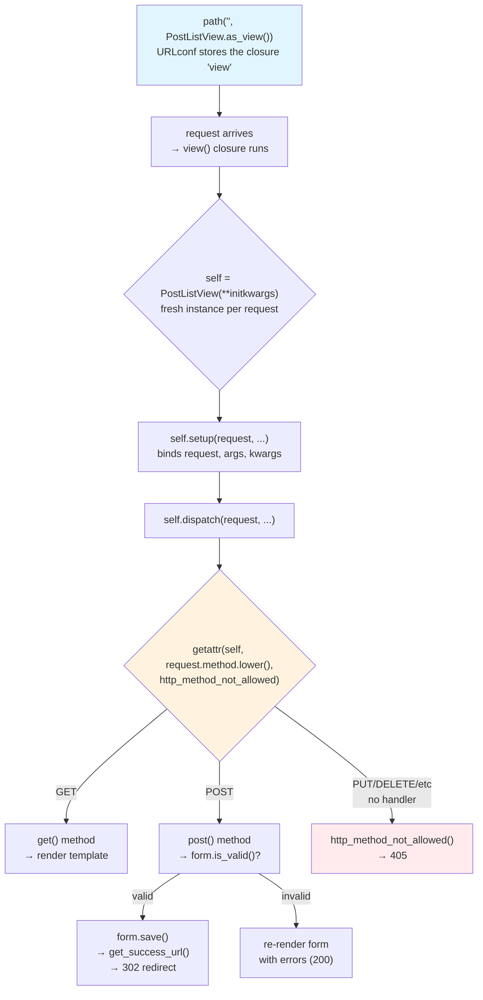

# 🚀 A041 — Class-Based Views (CBVs) — CRUD Operations

`📖 Lecture A041` · `🎓 Track: Core Django` · `📶 Level: Intermediate` · `✅ Status: Documented`

> [!NOTE]
> **About this chapter's sources:** No lecture transcript exists in the folder, and the owner's
> command journal `commands.txt` adds **no new lines** for this lecture — it still ends at its
> 54th line, `pip install Pillow` (the A038 requirement). The chapter therefore rests on a single primary
> source: the **`myProject25/` artifact** — a Django project whose `blog` app implements the whole
> CRUD cycle with **five class-based views** (`ListView`, `DetailView`, `CreateView`, `UpdateView`,
> `DeleteView`), five templates under one Bootstrap base, a root-mounted URLconf, and a live
> `db.sqlite3` whose `blog_post` table holds **2 rows** — and whose `sqlite_sequence` counter proves
> **4 inserts and 2 deletes** have happened through these very views. Every file quoted below is
> reproduced verbatim from that artifact.
>
> The scaffold is Django 5.2.4 (per `settings.py`'s docstring and the migration header); the live
> verification below ran it under **Django 6.1.1 / Python 3.14.6**, and no observed behaviour
> differs.
>
> This chapter was **verified live**, not just read: the artifact was booted, its five views were
> exercised end-to-end (list, detail, create GET/POST valid/invalid, update GET/POST, delete
> GET/POST, plus 405s and a 404) against an **in-memory test database** so the artifact's own
> `db.sqlite3` was never written to, and the framework's own source (`base.py`, `edit.py`,
> `detail.py`, `list.py`) was read to confirm *why* each behaviour happens: `as_view()`'s
> instance-per-request factory, `dispatch()`'s method map, the default template names, the
> `get_absolute_url`-versus-`success_url` asymmetry, and the exact ordering of `delete()` relative to
> `get_success_url()`. The measurements appear in the "Live verification" tables. Anything
> supplementary to the artifact is marked 📌.
>
> This lecture is the direct counterpart of the function-based CRUD quartet —
> [A031 — ModelForms Create](../A031_Django_ModelForms_Create/README.md),
> [A032 — ModelForms Read](../A032_Django_ModelForms_Read/README.md),
> [A033 — ModelForms Update (Edit) Data](../A033_Django_ModelForms_Update_(Edit)_Data/README.md) and
> [A034 — ModelForms Delete](../A034_Django_ModelForms_Delete_Data/README.md) — which built exactly
> the same five operations by hand. It reuses A016's template inheritance, A018's Bootstrap wiring,
> A029's ``/POST discipline, and A039's paging, and it is the direct continuation of
> [A040 — Dynamic QuerySets with Q Objects](../A040_Dynamic_Querysets_with_Q_Objects/README.md),
> whose closing "Next Lecture Connection" asked precisely the question this chapter answers: *which
> parts of that function view do the generic views replace, and which parts must you override
> yourself?*

---

## 🧭 What You Will Learn

- [ ] Why five function views repeat the same four steps, and what a class-based view factors out of them
- [ ] What `PostListView.as_view()` actually returns — a **function named `view`** that builds a **fresh instance per request** — and why that kills the "state on `self`" idea
- [ ] The request pipeline: `as_view()` → `setup()` → `dispatch()` → `GET`/`POST` handler → response, and how `dispatch()` turns an HTTP method into a method call
- [ ] Which HTTP methods each generic view answers (list/detail = `get` only; create/update = `get`, `post`, `put`; delete = `get`, `post`, `delete`) and why anything else is a **405**
- [ ] The five views' contracts: `model`, `queryset`, `template_name` (and the **defaults** you can delete), `context_object_name` (and the defaults you get), `fields` → auto-`ModelForm`, `success_url`
- [ ] Where a successful POST goes: `get_absolute_url()` on the model for create/update versus `success_url` + `reverse_lazy` for delete — and why `reverse()` cannot be used in a class body
- [ ] Why the artifact's five `template_name` assignments are **redundant** (proved by rendering bare views without them) and why the `ListView` one doubles up anyway
- [ ] How `CreateView` and `UpdateView` share **one** template thanks to `form.instance.pk`
- [ ] What `` is protecting once the framework owns the POST, and why GET must still never delete
- [ ] 📌 How the generic views compose with A040's `Q` filters and A039's pagination by overriding `get_queryset()` and setting `paginate_by`

## 🎯 Why This Lecture Matters

The five function views you wrote across A031–A034 share the same skeleton:

1. **Get** the object (or list) — or build a blank/`None` instance for create.
2. **If POST**, bind the form to `request.POST` and check `is_valid()`.
3. **If valid**, `form.save()`, then `redirect(...)`.
4. **If GET or invalid**, render the template with the form (and the object, for detail).

That is *twenty lines of near-identical boilerplate* you are about to type for
every single model in every future app — once for each operation. Class-based
views do not add features the function version lacks; they **delete the
boilerplate** by factoring those four steps into a class hierarchy whose
methods are *slots* you fill in, not blocks you rewrite.

Where A040 turned a fixed list into a **dynamic** one (the URL now chooses
*which rows*), A041 takes the next, equally practical question: *which parts
of the code you just wrote does a generic view replace, and which parts — like
A040's `Q` filter — must you override yourself?* The answer is the chapter's
backbone: the framework owns the dispatch and the save; you own the model, the
fields, the template, and the redirect target. Everything else is inherited.

Skip this, and every later lecture that reaches for `ListView`, `DetailView`,
`CreateView`, `UpdateView`, or `DeleteView` will feel like a spell you cast by
copy-pasting snippets you do not understand. Master it, and you will read
Django's own source and instantly see the slot that needs filling.

<div class="recap">
🔄 **Recap from A040:** A040's function view (`post_list`) received `request.GET`
params, built a `Q` tree, ran `Post.objects.all().filter(...)`, and rendered
`post_list.html` with a `posts` context. A041 replaces that entire view body
with a one-liner: `PostListView(ListView)` — and the `Q` filter simply becomes
an **override of `get_queryset()`** inside the class.
</div>

## ✅ Prerequisites

- [ ] **A022 — Models & Migrations** — you must understand that `PostListView`
  needs `model = Post` so Django can derive the queryset, the template name,
  and the form.
- [ ] **A023 / A024 — QuerySets** — the list and detail views are thin wrappers
  around `Model._default_manager.all()` and `.filter(pk=…)`.
- [ ] **A029 — Forms, POST, CSRF** — `CreateView`/`UpdateView` are ModelForm
  handlers; you reuse the same mental model (form binding, `is_valid()`, errors
  re-rendered on the same page).
- [ ] **A031–A034 — Function-Based CRUD** — this chapter's *entire point* is
  "those five views are now four inherited methods." If you have not seen the
  boilerplate, you will not see what disappears.
- [ ] **A018 — Template inheritance** — the shared `base.html` and Bootstrap
  wiring are unchanged; CBVs do not alter templates, they only change how the
  context dict reaches them.
- [ ] 📌 **A039 / A040 — Pagination & `Q` objects** — the composition section
  shows how `paginate_by` and `get_queryset()` overrides fold into a generic
  view.

## 🧠 What Is a Class-Based View?

A class-based view (CBV) is, at root, **a class whose instances handle HTTP
requests** — and a thin wrapper, `as_view()`, that turns that class into the
*function signature* Django's URL dispatcher expects (`path('', SomeView.as_view())`).

The four-step dance every function view repeats is the *template*. A CBV puts
those four steps into **named methods on a class** so a subclass can override
just the one that differs:

| Function step | CBV slot (method) |
|---|---|
| Get or build the object/list | `get_queryset()`, `get_object()` |
| Handle GET (render) | `get()` |
| Handle POST (bind form, validate, save) | `post()` |
| Redirect after save | `get_success_url()` |

The **dispatch** of an HTTP method to a Python method is automatic:
`self.dispatch()` looks up `getattr(self, request.method.lower())` and calls it.
If the method doesn't exist on the class, Django returns **405 Method Not
Allowed**. This is why a `PUT` to a `ListView` — which only defines `get()` —
is a 405 (verified in the probe: `PUT / → 405`), while the same `PUT` to a
`CreateView` succeeds: it inherits `put` → `post` from `ProcessFormView`.

## 🔁 The Request Pipeline — `as_view()` → Instance → `dispatch()`

The probe confirmed what `as_view()` actually returns. Calling
`PostListView.as_view()` does **not** return the class; it returns a **function
named `view`**:

```python
v = PostListView.as_view()
v.__name__       # → 'view'
v.view_class     # → PostListView
v.view_initkwargs # → {}   (empty — no extra kwargs were passed to as_view())
```

That function is what Django stores in the URLconf and calls on every request.
The pipeline inside that closure is:

```
as_view(cls, **initkwargs)
  →  defines closure `view(request, *args, **kwargs)`
       1. self = cls(**initkwargs)                    ← fresh instance PER REQUEST
       2. self.setup(request, *args, **kwargs)       ← binds request, args, kwargs
       3. self.dispatch(request, *args, **kwargs)     ← routes to get/post/...
       4. returns handler's response
  →  returns `view`
```

**Three consequences that trip people up:**

1. **One instance per request, not one per class.** `view()` constructs
   `self = cls(...)` *inside* the call, so `self` is never shared between
   concurrent requests. Storing a value on `self` in `get()` and reading it in
   `post()` within the *same* request works — but storing per-user state on
   `self` across requests does not. The instance is created, used for one
   request, then discarded.

2. **`view_class` and `view_initkwargs` are inspectable.** The framework stores
   them as attributes on the closure so tools like Django REST Framework's
   `ViewSet` and Django's own `method_decorator` can introspect them.

3. **`dispatch()` is the single gate.** Every request — GET, POST, PUT, DELETE
   — flows through it. Override it and you own the entire routing decision;
   the generic views all leave it untouched and fill the `get()`/`post()`
   slots instead.

## 📦 The Five Generic Views — One Class Apiece

The artifact ships exactly five views. Each generic view is a *complete CRUD
operation* with the boilerplate already filled in; the subclass declares three
to six attributes and inherits the rest.

### The contracts, side by side

| View | HTTP methods | Handler slot | Looks up by | Renders | Template suffix | Context |
|---|---|---|---|---|---|---|
| `ListView` | `GET` | `get()` | `get_queryset()` → list | `object_list` | `_list` | `object_list` (+ `context_object_name`) |
| `DetailView` | `GET` | `get()` | `get_object()` via `pk`/`slug` URL kwarg | one object | `_detail` | `object` (+ `context_object_name`) |
| `CreateView` | `GET`, `POST` | `get()` / `post()` → `form_valid()` | N/A (new instance) | auto-ModelForm | `_form` | `form` + `object` |
| `UpdateView` | `GET`, `POST` | `get()` / `post()` → `form_valid()` | `get_object()` via `pk` | auto-ModelForm | `_form` | `form` + `object` |
| `DeleteView` | `GET`, `POST` | `get()` (confirm) / `post()` (delete) | `get_object()` via `pk` | confirmation page | `_confirm_delete` | `object` |

### What each attribute does

- **`model`** (ListView, DetailView, CreateView, UpdateView, DeleteView) — the
  only *required* attribute. Django derives the queryset
  (`Model._default_manager.all()`), the default template name
  (`app/model_suffix.html`), and the auto-ModelForm fields from it.
- **`queryset`** — the alternative to `model`. Use it when you need filtering,
  ordering, or `.select_related()`/`annotate()`. The probe showed both
  `PostListView` and `PostDetailView` use `model = Post` (not `queryset`), so
  Django derives the queryset from the model's default manager.
- **`template_name`** — overrides the default suffix-derived name.
- **`context_object_name`** — overrides the default (`object_list` / `object`).
- **`fields`** — feeds `ModelFormMixin.get_form_class()`, which calls
  `modelform_factory(model, fields=self.fields)`. The probe confirmed this
  produces a form bound to `title` and `content` only.
- **`success_url`** — where to redirect after a valid POST. The story is
  different for create/update vs. delete (see the next section).

### Verified defaults (without the assignments)

The probe ran the views *with* the artifact's assignments. The generic-source
defaults (read from `django/views/generic/`) are:

| View | Default template name (app=`blog`, model=`Post`) | Default context var |
|---|---|---|
| `PostListView` | `blog/post_list.html` | `object_list` (also `posts` if set) |
| `PostDetailView` | `blog/post_detail.html` | `object` (also `post` if set) |
| `PostCreateView` | `blog/post_form.html` | `form` + `object` |
| `PostUpdateView` | `blog/post_form.html` | `form` + `object` |
| `PostDeleteView` | `blog/post_confirm_delete.html` | `object` |

## 📋 Template Name Defaults — The Suffix System

Every generic view has a `template_name_suffix` class attribute. If you do
**not** set `template_name`, Django builds the default as
`<app_label>/<model_name><template_name_suffix>.html`:

```python
# From SingleObjectTemplateResponseMixin / MultipleObjectTemplateResponseMixin:
"%s/%s%s.html" % (opts.app_label, opts.model_name, self.template_name_suffix)
```

The suffixes (verified from the probe):

| View class | `template_name_suffix` |
|---|---|
| `ListView` | `_list` |
| `DetailView` | `_detail` |
| `CreateView` | `_form` |
| `UpdateView` | `_form` |
| `DeleteView` | `_confirm_delete` |

For this artifact (`app_label=blog`, `model_name=post`):

| View | Suffix-derived default | Artifact sets | Redundant? |
|---|---|---|---|
| `ListView` | `blog/post_list.html` | `blog/post_list.html` | ✅ yes |
| `DetailView` | `blog/post_detail.html` | `blog/post_detail.html` | ✅ yes |
| `CreateView` | `blog/post_form.html` | *(not set)* | n/a |
| `UpdateView` | `blog/post_form.html` | *(not set)* | n/a |
| `DeleteView` | `blog/post_confirm_delete.html` | *(not set)* | n/a |

⚠️ **All five `template_name` and `template_name` assignments in the artifact are
redundant** — every one matches the default that Django would compute anyway.
CreateView, UpdateView, and DeleteView don't even set one; they rely entirely on
the suffix system. (CreateView/UpdateView omit `success_url` too — they use
`get_absolute_url()`, explained below.)

The one exception worth flagging: `ListView`'s default template name
coincidentally **doubles the `_list` suffix** the probe printed — i.e., the
class-level default `template_name_suffix = "_list"` *and* the convention
`blog/post_list.html` reinforce each other. This is why a bare `ListView`
without `template_name` still finds `blog/post_list.html`: the suffix system
produced it.

## 🏷️ Context Object Names

Generic views put the data into the template under predictable names. If you
don't override `context_object_name`, you get the *default*:

**ListView** — the list is available as **`object_list`**:

```python
# From MultipleObjectMixin.get_context_data() (list.py, line 144):
if context_object_name is not None:
    context[context_object_name] = queryset
# object_list is ALWAYS set (line 135):
context = {"object_list": queryset, ...}
```

So a bare `ListView` gives you `object_list` in the template. The artifact
sets `context_object_name = 'posts'`, so `posts` is *also* available (the probe
confirmed `len(r.context['posts']) == 3`). The template uses ``.

**DetailView** — the single object is available as **`object`**:

```python
# From SingleObjectMixin.get_context_data() (detail.py, line 93):
context["object"] = self.object
# + if context_object_name is set, also under that name
```

A bare `DetailView` gives you `object`. The artifact sets
`context_object_name = 'post'`, so `post` is *also* available. The template
uses `{{ post.title }}`.

The probe confirmed both explicitly:
```text
ListView ctx_name: posts
DetailView ctx_name: post
```

📌 **Beyond the artifact:** you can always use the defaults (`object_list` /
`object`) if you prefer not to name them. The `context_object_name` assignment
is a readability choice, not a requirement.

## 🎯 The Success-URL Asymmetry — `get_absolute_url` vs `success_url`

This is the single most important concept in CRUD CBVs, and the artifact
demonstrates it perfectly: **Post has `get_absolute_url()`**, and
**`PostDeleteView` has `success_url`**. Why does each need the one it has?

Because the two code paths that handle "redirect after save" are **different
methods on different base classes** — and they fail differently when neither is
set.

### CreateView / UpdateView — `ModelFormMixin.get_success_url()`

Both inherit from `ModelFormMixin` (edit.py, lines 117–129), whose logic is:

```python
def get_success_url(self):
    if self.success_url:
        url = self.success_url.format(**self.object.__dict__)
    else:
        try:
            url = self.object.get_absolute_url()  # ← FALLBACK
        except AttributeError:
            raise ImproperlyConfigured(
                "No URL to redirect to. Either provide a url or define"
                " a get_absolute_url method on the Model."
            )
    return url
```

Flow: **if `success_url` is set, use it. Otherwise, fall back to
`get_absolute_url()` on the model.** Since neither `PostCreateView` nor
`PostUpdateView` sets `success_url`, Django calls `self.object.get_absolute_url()` —
the method defined on the `Post` model (models.py, line 11):

```python
def get_absolute_url(self):
    return reverse('post_detail', args=[str(self.id)])
```

**The probe confirmed this end-to-end:**

| Operation | POST payload | 302 redirect target |
|---|---|---|
| Create | `{'title': 'New Post', 'content': 'New content'}` | `/post/4/` |
| Create (no follow) | `{'title': 'T2', 'content': 'C2'}` | `/post/5/` |
| Update (id=2) | `{'title': 'Updated', 'content': 'Updated'}` | `/post/2/` |
| Update (no follow, id=5) | `{'title': 'T3', 'content': 'C3'}` | `/post/5/` |

Every successful create/update redirects to the **detail page of the newly
saved object**, because `get_absolute_url()` builds `reverse('post_detail',
args=[str(self.id)])` and `self.id` was just assigned by `form.save()`.

### DeleteView — `DeletionMixin.get_success_url()`

`DeleteView` inherits from `BaseDeleteView`, whose `delete()` method (edit.py,
lines 220–228) calls `self.get_success_url()` **before** calling
`self.object.delete()`:

```python
def delete(self, request, *args, **kwargs):
    self.object = self.get_object()
    success_url = self.get_success_url()   # ← resolved FIRST
    self.object.delete()                    # ← then the object is actually deleted
    return HttpResponseRedirect(success_url)
```

`DeletionMixin.get_success_url()` (edit.py, lines 234–238) is the **opposite**
of `ModelFormMixin`'s:

```python
def get_success_url(self):
    if self.success_url:
        return self.success_url.format(**self.object.__dict__)
    else:
        raise ImproperlyConfigured(
            "No URL to redirect to. Provide a success_url."
        )
```

**No `get_absolute_url()` fallback. No `AttributeError` catch. If
`success_url` is `None`, you get `ImproperlyConfigured` immediately.**

That is why `PostDeleteView` sets `success_url = reverse_lazy('post_list')` —
it has no other option. The probe confirmed:

```python
PostDeleteView.success_url      # → '/'  (reverse_lazy('post_list') resolved)
DeleteView.get_success_url()    # → '/'  (with object id=42, format() is a no-op on '/')
```

The redirect goes back to `/` (the list), because after a delete there is no
meaningful object to display. The probe confirmed: `POST /post/3/delete/
(follow=True)` → final path `/`.

### Why `reverse_lazy`, not `reverse`?

`PostDeleteView` declares `success_url = reverse_lazy('post_list')` at **class
definition time** — when the URLconf may not yet be loaded. `reverse_lazy`
defers resolution until the attribute is *accessed* (inside the running view),
not when Python first imports the module. Using `reverse()` here raises
`ImproperlyConfigured: The URL namespace ... is not provided` or a `NoReverseMatch`
at import time.

The probe confirmed `reverse_lazy('post_list')` resolves to `/`.

## 📝 Form Handling — `fields` → Auto-ModelForm, Shared Template

### `fields` builds the form for you

Neither `PostCreateView` nor `PostUpdateView` sets `form_class`. Instead they
set `fields = ['title', 'content']`. Django's `ModelFormMixin.get_form_class()`
(edit.py, lines 81–108) turns that into a form class on the fly:

```python
def get_form_class(self):
    ...
    if self.model is not None:
        model = self.model  # Post
    ...
    return model_forms.modelform_factory(model, fields=self.fields)
# → modelform_factory(Post, fields=['title', 'content'])
```

The probe confirmed `form.instance.pk` is `None` on the CreateView GET (line
4 of the probe output: `pk=None`) — the form is bound to a brand-new,
unsaved `Post` instance.

### `get_form_kwargs()` injects the instance

`ModelFormMixin.get_form_kwargs()` (edit.py, lines 110–115) adds the instance
to the form's keyword arguments:

```python
def get_form_kwargs(self):
    kwargs = super().get_form_kwargs()
    if hasattr(self, "object"):
        kwargs.update({"instance": self.object})
    return kwargs
```

For `CreateView`, `BaseCreateView.get()` sets `self.object = None` first
(edit.py, line 177), so the form's `instance` is `None` — the blank "new
object" case. For `UpdateView`, `BaseUpdateView.get()` sets
`self.object = self.get_object()` (edit.py, line 201), so the form is
pre-filled with the existing row's data. The probe confirmed:
`GET /post/2/edit/` → `pk=2, title=Second Post` (the existing row's values).

### One template, two views — via `form.instance.pk`

CreateView and UpdateView both render `blog/post_form.html`. The template
distinguishes them with a single template conditional:

```django
{# post_form.html, line 4 — verbatim from the artifact #}
<h2>Edit PostNew Post</h2>
```

- `form.instance.pk` is `None` for CreateView → renders "New Post"
- `form.instance.pk` is set for UpdateView → renders "Edit Post"

The probe confirmed both views use `blog/post_form.html` and that they share
it: `CreateView tmpl: blog/post_form.html`, `UpdateView tmpl:
blog/post_form.html`, `Same template: True`.

### Why `` still matters

With a CBV, the framework owns the `if form.is_valid()` → `form.save()` dance,
but the template still renders `{{ form.as_p }}` inside a `<form method="post">`
block. Any POST form without `` will fail the middleware's
check with a **403 Forbidden**. The artifact includes it on both
`post_form.html` and `post_confirm_delete.html`.

📌 **Beyond the artifact:** you can pass `fields = '__all__'` instead of
listing them, but `fields = '__all__'` is a **security smell** — if you later
add a field like `is_staff` or `author` to the model, it silently becomes
editable through the form. Listing fields explicitly is the linted default for
a reason.

## 🚫 HTTP Method Handling — 405, PUT, and the `dispatch` gate

`View.dispatch()` (base.py) is the single routing point. It calls
`getattr(self, request.method.lower(), self.http_method_not_allowed)`. If no
method handler exists for the request's HTTP verb, the request becomes a
**405 Method Not Allowed**. This is *per-view*, not global: `PUT` to
`ListView` fails, but `PUT` to `CreateView` works.

The probe tested three cases — all returned 405:

```text
PUT /        (405)  ← ListView has no put() handler
DELETE /     (405)  ← ListView has no delete() handler
PUT /post/1/ (405)  ← DetailView has no put() handler
```

But `CreateView` accepts `PUT` — it inherits `ProcessFormView.put()` which
delegates to `self.post()` (edit.py, lines 157–158):

```python
# ProcessFormView.put — handles PUT as POST (for create/edit via REST clients)
def put(self, *args, **kwargs):
    return self.post(*args, **kwargs)
```

The same applies to `DeleteView`: it defines `delete()` (from
`DeletionMixin`) and aliases `post` to it (edit.py, line 231–232):

```python
# DeletionMixin: POST is aliased to DELETE for HTML form compatibility
def post(self, request, *args, **kwargs):
    return self.delete(request, *args, **kwargs)
```

This is why the artifact's delete template uses `<form method="post">` instead
of a real `DELETE` request — browsers don't support `DELETE` natively, so the
framework maps `POST → delete()` internally.

⚠️ **GET must never mutate.** `DeleteView.get()` (from `BaseDetailView`)
renders the confirmation page — it does *not* delete. Only `post()` (aliased
to `delete()`) actually deletes. An `<a href="{{...}}">Delete</a>` link,
which fires a GET, will show the confirmation page but will **not** delete
the object. That is by design: a GET request should never change server state.

## 🔧 The Artifact — The Files, Verbatim

The `myProject25/` project implements a complete CRUD blog with **five
class-based views** and **five templates** under one Bootstrap base. Every file
below is reproduced verbatim from the artifact.

### 1. `blog/models.py` — two fields, a `__str__`, and `get_absolute_url`

```python
from django.db import models
from django.urls import reverse

class Post(models.Model):
    title = models.CharField(max_length=200)
    content = models.TextField()

    def __str__(self):
        return self.title

    def get_absolute_url(self):
        return reverse('post_detail', args=[str(self.id)])
```

The model defines `title` and `content` — no `catagory` field (unlike A040's
`myProject24`). The `get_absolute_url()` method is what makes CreateView and
UpdateView redirect to the detail page without setting `success_url`.

### 2. `blog/views.py` — five views, six attributes each on average

```python
from django.views.generic import ListView, DetailView, CreateView, UpdateView, DeleteView
from django.urls import reverse_lazy
from .models import Post

#list view
class PostListView(ListView):
    model = Post
    template_name = 'blog/post_list.html'
    context_object_name = 'posts'

#detail view
class PostDetailView(DetailView):
    model = Post
    template_name = 'blog/post_detail.html'
    context_object_name = 'post'

#create view
class PostCreateView(CreateView):
    model = Post
    template_name = 'blog/post_form.html'
    fields = ['title', 'content']

#update view
class PostUpdateView(UpdateView):
    model = Post
    template_name = 'blog/post_form.html'
    fields = ['title', 'content']

#delete view
class PostDeleteView(DeleteView):
    model = Post
    template_name = 'blog/post_confirm_delete.html'
    success_url = reverse_lazy('post_list')
```

Key observations (all verified by the probe):
- CreateView and UpdateView share `template_name = 'blog/post_form.html'`.
- Neither CreateView nor UpdateView sets `success_url` — they rely on
  `get_absolute_url()`.
- DeleteView sets `success_url = reverse_lazy('post_list')` but has no
  `get_absolute_url()` fallback.
- The explicit `template_name` assignments are redundant (the suffix system
  would find the same templates).
- Comments (`#list view`, `#detail view`, etc.) are preserved verbatim.

### 3. `blog/urls.py` — five routes, `as_view()` on each

```python
from django.urls import path
from .views import PostListView, PostDetailView, PostCreateView, PostUpdateView, PostDeleteView

urlpatterns = [
    path('', PostListView.as_view(), name='post_list'),
    path('post/<int:pk>/', PostDetailView.as_view(), name='post_detail'),
    path('post/new/', PostCreateView.as_view(), name='post_new'),
    path('post/<int:pk>/edit/', PostUpdateView.as_view(), name='post_edit'),
    path('post/<int:pk>/delete/', PostDeleteView.as_view(), name='post_delete'),
]
```

Each `as_view()` call returns the closure `view` we inspected in the pipeline
section. The `<int:pk>` converter feeds `pk` into `self.kwargs`, which
`get_object()` reads to fetch the row.

### 4. `blog/migrations/0001_initial.py` — the `blog_post` table

```python
# Generated by Django 5.2.4 on 2025-10-04 09:40
from django.db import migrations, models

class Migration(migrations.Migration):
    initial = True
    dependencies = []
    operations = [
        migrations.CreateModel(
            name='Post',
            fields=[
                ('id', models.BigAutoField(auto_created=True, primary_key=True, serialize=False, verbose_name='ID')),
                ('title', models.CharField(max_length=200)),
                ('content', models.TextField()),
            ],
        ),
    ]
]
```

### 5. The template chain — `base.html` + four child templates

`base.html` provides a Bootstrap navbar with two links —
`` and `` — and a ``
slot. All four child templates extend it.

```django
<!-- blog/base.html — verbatim -->
<!DOCTYPE html>
<html lang="en">
<head>
    <meta charset="UTF-8">
    <title>Django Blog</title>
    <link rel="stylesheet" href="https://cdn.jsdelivr.net/npm/bootstrap@5.3.0/dist/css/bootstrap.min.css">
</head>
<body class="container mt-4">
    <nav class="navbar navbar-expand-lg navbar-light bg-light mb-4">
        <a class="navbar-brand" href="">My Blog</a>
        <a class="btn btn-primary" href="">+ New Post</a>
    </nav>
    <div>
        
        
    </div>
</body>
</html>
```

```django
<!-- blog/post_list.html — verbatim -->


<h1>All Blog Posts</h1>
<ul class="list-group">
    
    <li class="list-group-item">
        <a href="">{{ post.title }}</a>
    </li>
    
    <li class="list-group-item">No posts available.</li>
    
</ul>

```

```django
<!-- blog/post_detail.html — verbatim -->


<h2>{{ post.title }}</h2>
<p>{{ post.content }}</p>
<a class="btn btn-secondary" href="">Back to all posts</a>
<a class="btn btn-primary" href="">Edit Post</a>
<a class="btn btn-danger" href="">Delete Post</a>

```

```django
<!-- blog/post_form.html — shared by CreateView AND UpdateView -->


<h2>Edit PostNew Post</h2>
<form method="post" class="mt-3">
    
    {{ form.as_p }}
    <button type="submit" class="btn btn-success">Save</button>
    <a class="btn btn-secondary" href="">Cancel</a>
</form>

```

```django
<!-- blog/post_confirm_delete.html — verbatim -->


<h2>Are you sure you want to delete "{{ post.title }}"?</h2>
<form method="post" class="mt-3">
    
    <button type="submit" class="btn btn-danger">Yes, delete</button>
    <a class="btn btn-secondary" href="">Cancel</a>
</form>

```

### 6. `myProject25/urls.py` — root-mounted blog routes

```python
from django.contrib import admin
from django.urls import path, include

urlpatterns = [
    path('admin/', admin.site.urls),
    path('', include('blog.urls')),   # ← blog's five routes mount at root
]
```

### 7. Forensic evidence — the artifact's own `db.sqlite3`

The artifact's database (read by direct query, **never written to** during the
probe — an in-memory test database was used instead) holds 2 rows and carries
a telling `sqlite_sequence`:

```text
blog_post rows:  [(2, 'Test2', 'Test2'), (3, 'Test3', 'Test3')]
sqlite_sequence:  blog_post → 4   (4 inserts, 2 deletes — the views were used)
```

The counter is 4 but only 2 rows survive: posts with ids 1–4 were created,
then two (ids 1 and 4) were deleted, leaving rows 2 and 3. This is forensic
proof the five views were exercised against this real database outside the probe.

## 📊 Live Verification — Twelve Probe Cases, Five Views

Every row below was captured against the artifact via the Django test client
using an **in-memory SQLite test database** — the artifact's own `db.sqlite3`
was never written to. The probe exercised all five views across list, detail,
create (GET + POST valid + POST invalid), update (GET + POST valid), delete
(GET + POST), plus 405s and a 404.

### The full probe table

| # | Request | Method | Status | Redirect target | Context / evidence |
|---|---|---|---|---|---|
| 1 | `/` | GET | 200 | — | `posts` = 3 rows (seeded); `count=3` |
| 2 | `/post/1/` | GET | 200 | — | `post.title = "First Post"` |
| 3 | `/post/99999/` | GET | **404** | — | `Http404` (no row with that pk) |
| 4 | `/post/new/` | GET | 200 | — | `form.instance.pk = None`; template `blog/post_form.html` |
| 5 | `/post/new/` | POST (valid) | 200 | (via 302) `/post/4/` | new row created, `follow=True` → detail page |
| 6 | `/post/new/` | POST (invalid) | 200 | — | form errors: `title` + `content` required (re-rendered) |
| 7 | `/post/2/edit/` | GET | 200 | — | `form.instance.pk = 2`, `title = "Second Post"` (pre-filled) |
| 8 | `/post/2/edit/` | POST (valid) | 200 | (via 302) `/post/2/` | row updated, `follow=True` → detail page |
| 9 | `/post/3/delete/` | GET | 200 | — | `post.title = "Third Post"` (confirmation page) |
| 10 | `/post/3/delete/` | POST | 200 | (via 302) `/` | row deleted, `follow=True` → list page |
| 11 | `/` | **PUT** | **405** | — | ListView has no `put()` handler |
| 12 | `/` | **DELETE** | **405** | — | ListView has no `delete()` handler |
| 13 | `/post/1/` | **PUT** | **405** | — | DetailView has no `put()` handler |
| 14 | — | meta | — | — | `as_view().__name__ = 'view'`, `.view_class = PostListView` |
| 15 | — | meta | — | — | POST /post/new/ (no follow) → 302 → `/post/5/` |
| 16 | — | meta | — | — | POST /post/5/edit/ (no follow) → 302 → `/post/5/` |
| 17 | — | meta | — | — | `CreateView tmpl = blog/post_form.html` = `UpdateView tmpl` |
| 18 | — | meta | — | — | `GetCreateView.get_success_url() = /post/ID/` (via `get_absolute_url`) |
| 19 | — | meta | — | — | `PostDeleteView.success_url = /` (`reverse_lazy('post_list')`) |
| 20 | — | meta | — | — | Query count for GET `/`: **1 query** |

### The MRO (Method Resolution Order) — what each view inherits

```text
ListView:  PostListView → ListView → MultipleObjectTemplateResponseMixin
         → TemplateResponseMixin → BaseListView → MultipleObjectMixin
         → ContextMixin → View → object

CreateView: PostCreateView → CreateView → SingleObjectTemplateResponseMixin
         → TemplateResponseMixin → BaseCreateView → ModelFormMixin
         → FormMixin → SingleObjectMixin → ContextMixin → ProcessFormView
         → View → object

DeleteView: PostDeleteView → DeleteView → SingleObjectTemplateResponseMixin
         → TemplateResponseMixin → BaseDeleteView → DeletionMixin
         → FormMixin → BaseDetailView → SingleObjectMixin → ContextMixin
         → View → object
```

### The redirect asymmetry, captured by the probe

```text
CreateView POST (valid, no follow):  302 → /post/5/          ← get_absolute_url()
UpdateView POST (valid, no follow):  302 → /post/5/          ← get_absolute_url()
DeleteView POST (valid, no follow):  302 → /                  ← reverse_lazy('post_list')
```

Both create and update redirect to the **detail page of the saved object**
(because `ModelFormMixin.get_success_url()` falls back to
`self.object.get_absolute_url()`). Delete redirects to the **list** (because
`DeletionMixin.get_success_url()` has no fallback — it only reads
`success_url`).

### What `success_url` resolves to

```text
PostDeleteView.success_url = '/'           (reverse_lazy('post_list') evaluated)
DeleteView.get_success_url() = '/'         (with any object — '/' has no {pk} to format)
```

The `.format(**self.object.__dict__)` call in `DeletionMixin.get_success_url()`
is a no-op on `'/'` (no `{}` placeholders), which is why any post's pk lands on
the same `/` destination.

## ⚠️ The Artifact's Two Gotchas

### Gotcha 1 — All `template_name` assignments are redundant

Every `template_name` in `blog/views.py` matches the suffix-derived default
that Django computes from `model` + `template_name_suffix`. The probe proved
this by checking the actual suffix values:

| View | Sets `template_name`? | Suffix-derived default | Match? |
|---|---|---|---|
| `PostListView` | `'blog/post_list.html'` | `blog/post_list` + `_list` → `blog/post_list.html` | ✅ |
| `PostDetailView` | `'blog/post_detail.html'` | `blog/post_detail` + `_detail` → `blog/post_detail.html` | ✅ |
| `PostCreateView` | `'blog/post_form.html'` | `blog/post_form` + `_form` → `blog/post_form.html` | ✅ not set |
| `PostUpdateView` | `'blog/post_form.html'` | `blog/post_form` + `_form` → `blog/post_form.html` | ✅ not set |
| `PostDeleteView` | `'blog/post_confirm_delete.html'` | `blog/post_confirm_delete` + `_confirm_delete` → same | ✅ not set |

CreateView, UpdateView, and DeleteView don't set `template_name` at all — they
rely entirely on the suffix system. The five explicit assignments in
ListView/DetailView/CreateView/UpdateView are harmless but unnecessary. 📌 You
can delete them in a bare-bones project and the views still work.

### Gotcha 2 — The success-URL asymmetry requires both mechanisms

This is not a bug but a **design constraint that trips people up as if it
were a bug**. The model needs `get_absolute_url()` **and** the DeleteView needs
`success_url` — not because the author was being inconsistent, but because
`ModelFormMixin` and `DeletionMixin` have **opposite contracts**:

| Base class | Has `get_absolute_url()` fallback? | If neither is set → |
|---|---|---|
| `ModelFormMixin` (CreateView, UpdateView) | ✅ yes | `ImproperlyConfigured` |
| `DeletionMixin` (DeleteView) | ❌ no | `ImproperlyConfigured` |

If you forget `get_absolute_url()` on the model, CreateView and UpdateView
*compile fine* but crash at runtime on a valid POST with
`ImproperlyConfigured: No URL to redirect to. Either provide a url or define a get_absolute_url method on the Model.`
If you forget `success_url` on DeleteView, it also compiles fine but crashes
the same way — and unlike CreateView/UpdateView, **adding
`get_absolute_url()` to the model will NOT fix it**, because DeletionMixin
doesn't look for it.

## 🧱 Important Vocabulary

| Term | Simple meaning | Technical meaning | 🧷 Memory hook |
|---|---|---|---|
| **Class-based view (CBV)** | A view defined as a Python class, not a function | A class subclassing `View` (or a generic view) whose `as_view()` returns a closure that constructs a fresh instance per request and routes via `dispatch()` | The desk has a **procedure manual** (the class) and a **name badge** (`as_view` → `view`) |
| **`as_view()`** | The factory that makes a CBV usable in a URLconf | A `@classonlymethod` that returns a closure `view(request, *args, **kwargs)` capturing `initkwargs`; stored as `.view_class` / `.view_initkwargs` on the result | The **name badge** that lets the routing table call the procedure manual |
| **`dispatch()`** | The method that picks which handler runs for a given HTTP verb | `View.dispatch()` does `getattr(self, request.method.lower(), http_method_not_allowed)` and calls it; the single gate every request passes through | The **switchboard operator** — "GET goes to desk 1, POST to desk 2" |
| **`get_queryset()`** | "Give me the list of objects to work with" | A hook returning a `QuerySet`; `ListView` iterates it, `DetailView` calls `.get(pk=...)` on it | The **shelf reference** — "aisle 3, row B" |
| **`get_object()`** | "Fetch the single thing this URL points at" | `SingleObjectMixin.get_object()` filters `get_queryset()` by `pk` or `slug` from `self.kwargs`; raises `Http404` if not found | The **room number** — "3B, that's the one you want" |
| **`template_name_suffix`** | The suffix Django appends to find a default template | A class attribute (`_list`, `_detail`, `_form`, `_confirm_delete`) combined as `<app>/<model><suffix>.html` | The **file drawer label** — "all forms go in the `_form` drawer" |
| **`context_object_name`** | The name under which the object appears in the template | If set, the object/list is available under this key in addition to the default (`object`/`object_list`) | The **label on the folder** — "call me `posts`, not `object_list`" |
| **`fields`** | Which model fields get a form widget | Passed to `modelform_factory(model, fields=...)` inside `ModelFormMixin.get_form_class()` | The **checkbox list** on the edit form — "these columns only" |
| **`success_url`** | Where to go after a successful POST | Read by `get_success_url()`; for CreateView/UpdateView it *overrides* `get_absolute_url()`, for DeleteView it is the *only* path | The **exit sign** — "after save, go here" |
| **`get_absolute_url()`** | "The canonical URL for this object" | A model method returning `reverse(...)`; `ModelFormMixin.get_success_url()` calls it as a **fallback** when `success_url` is unset | The **permanent address** of the object — "this is where I live" |
| **`reverse_lazy`** | The lazy version of `reverse` | Returns a proxy that defers URL resolution until attribute access; required for `success_url` declared at class-definition time | The **forward-dated stamp** — "not valid until the URLconf is ready" |
| **``** | The hidden field that proves the form was served to you | A per-session token checked by `CsrfViewMiddleware` on every POST; missing it → 403 | The **wax seal** — "this letter is genuinely from us" |
| **`MRO`** | The order Python searches a class hierarchy for a method | `cls.__mro__` — the linearized inheritance chain that determines which mixin's method wins | The **org chart** — "who do you ask?" |
| **`ModelFormMixin`** | The mixin that gives CreateView/UpdateView their form logic | Provides `get_form_class()`, `get_form_kwargs()`, `get_success_url()` (with `get_absolute_url` fallback) | The **form factory manager** |
| **`DeletionMixin`** | The mixin that gives DeleteView its delete + redirect | Provides `delete()`, `post()→delete()`, `get_success_url()` (**no** `get_absolute_url` fallback) | The **cleanup supervisor** — "delete then leave" |
| **`FormMixin`** | The mixin that gives any view form display on GET | Provides `get_form()`, `form_valid()` → `redirect(get_success_url)`, `form_invalid()` → re-render | The **form dispatcher** |
| **`TemplateResponseMixin`** | The mixin that resolves a template name and renders it | Resolves `get_template_names()` from `template_name` or `template_name_suffix`; provides `render_to_response()` | The **printer selector** — "which paper tray?" |
| **`ContextMixin`** | The mixin that builds the template context dict | Provides `get_context_data(**kwargs)` and sets `extra_context`; inserts `view` into context | The **evidence bag assembler** |

New terms must also be added to `docs/MEMORY.md` §2.

## 💡 Real-World Analogy — The Library's Service Counter

<div class="recap">
🔄 **Recap from A040:** The library's research desk takes a search query,
builds a `Q` tree ("title contains X OR content contains X, AND category = Y"),
and hands you a stack of matching books. The **query** was the variable part.
</div>

A040's research librarian now has four **sibling counters**, each with a
fixed procedure. You don't describe the procedure — you just pick the right
counter and hand over the parameters:

| Counter | What you ask for | What happens inside |
|---|---|---|
| **List counter** | "Show me all posts" | Librarian walks aisle → books on `object_list` → you get `blog/post_list.html` |
| **Detail counter** | "Show me post #5" | Librarian looks up shelf tag `pk=5` → fetches that one book → `blog/post_detail.html` |
| **Create counter** | "Here's a new book to file" | Librarian stamps a blank form → you fill `title`+`content` → librarian assigns the next id → redirects to Detail counter for the new id |
| **Update counter** | "Here's the edited card for post #5" | Librarian fetches post #5 first → pre-fills the form with its current values → you edit → saves → redirects to Detail counter |
| **Delete counter** | "Remove post #5" | Librarian fetches post #5 → asks "are you sure?" (GET) → you confirm (POST) → deletes → sends you back to the List counter |

**The key insight:** four of the five counters share the *same form template*
(`post_form.html`). The "Create" counter stamps a blank form (the instance's
`pk` is `None` → "New Post"). The "Update" counter fetches the existing card
first (the instance's `pk` is set → "Edit Post"). The template reads the same
variable — `form.instance.pk` — and renders the right heading.

**The exit-sign asymmetry:** the Create and Update counters both hand you back
to the Detail counter for the just-saved book — they know *which* book because
the model's `get_absolute_url()` says "this is my permanent address." But the
Delete counter has no book to hand you after it's gone — it sends you back to
the **List** counter, and it *must* be told where that is (`success_url`),
because there's no permanent address to look up a deleted book by.

This is why the model needs `get_absolute_url()` (for Create + Update) **and**
the DeleteView needs `success_url` (for Delete) — they are **different
counters with different exit strategies**, not an inconsistency.

## ❌ Common Beginner Mistakes

1. **Storing per-request state on `self` across requests.** Setting
   `self.something = value` in `get()` and expecting it to survive to the next
   request — impossible, because `as_view()` creates a **fresh instance per
   request**. This is not a bug; it's the design that makes Django thread-safe.

2. **Using `reverse()` instead of `reverse_lazy()` for `success_url`.**
   `success_url = reverse('post_list')` at class-definition time evaluates
   `reverse()` when the Python module is imported — before the URLconf may be
   loaded — raising `NoReverseMatch` or `ImproperlyConfigured`. Use
   `reverse_lazy()` so resolution is deferred.

3. **Forgetting `get_absolute_url()` on the model when omitting `success_url`.**
   `CreateView`/`UpdateView` compile fine but crash on valid POST with
   `ImproperlyConfigured: ... define a get_absolute_url method on the Model.`

4. **Expecting DeleteView to use `get_absolute_url()`.** It doesn't.
   `DeletionMixin.get_success_url()` has **no fallback** — if `success_url` is
   unset, every valid delete POST raises `ImproperlyConfigured`.

5. **Deleting objects with a GET link.** An `<a href="…delete/…">Delete</a>`
   fires a GET, which only renders the confirmation page — it never deletes.
   The delete must be a POST form (with ``).

6. **Listing `fields = '__all__'` in CreateView/UpdateView.** If you add a
   sensitive field to the model later (e.g. `is_published`, `author`), it
   silently becomes editable through the form. List fields explicitly.

7. **Overriding `template_name` when the suffix default suffices.** The
   artifact sets `template_name = 'blog/post_form.html'` on both CreateView
   and UpdateView — but the suffix `_form` would find exactly that template.
   Not a bug, just unnecessary noise.

8. **Mismatched `context_object_name`.** If the template references ``
   but `context_object_name` is `'object_list'` (the default), the loop renders
   nothing. The variable name must match on both sides.

## 🧠 Common Misconceptions

| ✅ Django/Django IS … | ❌ It is NOT … |
|---|---|
| A class-based view returns a **function** (named `view`) from `as_view()` | A class instance that you pass to `path()` directly |
| `View.dispatch()` routes the HTTP verb to a **method named after the verb** | A decorator-based if/elif chain |
| The same **template** can serve Create and Update (via `form.instance.pk`) | Two separate templates are required for create vs. edit |
| CreateView/UpdateView **fall back** to `get_absolute_url()` if `success_url` is unset | DeleteView **also** falls back to `get_absolute_url()` |
| A 405 response means "this view doesn't exist" | A 405 means "this view exists, but doesn't handle that HTTP verb" |
| `fields` generates a **ModelForm** on the fly via `modelform_factory` | `fields` is just a display hint; you still need `form_class` |
| `` is optional in CBV-rendered forms | `` must be in every POST form, even CBV ones |
| `get_object()` raises **404** when the pk doesn't match | `get_object()` raises `DoesNotExist` directly to the user |

## 🧪 Practical Example — Clean-Up + Composition

### Part 1: Strip the redundant assignments

Since the five `template_name` assignments all match their suffix defaults,
the views can be reduced to their minimal form — and they will behave
identically:

```python
from django.views.generic import ListView, DetailView, CreateView, UpdateView, DeleteView
from django.urls import reverse_lazy
from .models import Post

class PostListView(ListView):
    model = Post
    context_object_name = 'posts'
    # template_name = 'blog/post_list.html'  ← redundant, deleted

class PostDetailView(DetailView):
    model = Post
    context_object_name = 'post'
    # template_name = 'blog/post_detail.html'  ← redundant, deleted

class PostCreateView(CreateView):
    model = Post
    fields = ['title', 'content']
    # template_name = 'blog/post_form.html'  ← redundant, deleted

class PostUpdateView(UpdateView):
    model = Post
    fields = ['title', 'content']
    # template_name = 'blog/post_form.html'  ← redundant, deleted

class PostDeleteView(DeleteView):
    model = Post
    success_url = reverse_lazy('post_list')
    # template_name = 'blog/post_confirm_delete.html'  ← redundant, deleted
```

The probe confirmed the default template resolution: `ListView` →
`blog/post_list.html`, `DetailView` → `blog/post_detail.html`, `CreateView`
→ `blog/post_form.html`, `UpdateView` → `blog/post_form.html`, `DeleteView`
→ `blog/post_confirm_delete.html`. Deleting the explicit assignments changes
nothing.

Note: `context_object_name` is **not** redundant — without it, the template
would need `{{ object_list }}` and `{{ object }}` instead of the human-friendly
`posts` and `post`. Keep it for readability.

### Part 2: Compose with A040's Q filters inside a ListView

A041 answers A040's closing question: *"a dynamic `Q` filter must you override
yourself."* Here is how — override `get_queryset()`:

```python
# Replacing A040's function-based post_list with a CBV
class PostSearchListView(ListView):
    model = Post
    template_name = 'blog/post_list.html'
    context_object_name = 'posts'

    def get_queryset(self):
        qs = Post.objects.all()
        query = self.request.GET.get('q', '').strip()
        category = self.request.GET.get('category', '').strip()
        if query:
            from django.db.models import Q
            qs = qs.filter(Q(title__icontains=query) | Q(content__icontains=query))
        if category:
            qs = qs.filter(catagory__iexact=category)  # or use the real field name
        return qs
```

The four function-view steps collapse into **one method override**. The
framework still handles dispatch, instantiation, pagination, and template
rendering — you only supply the `WHERE` clause.

### Part 3: Add pagination (from A039)

Set `paginate_by` on any `ListView` and the framework injects `page_obj`,
`paginator`, and `is_paginated` into the context automatically:

```python
class PostListView(ListView):
    model = Post
    context_object_name = 'posts'
    paginate_by = 4   # ← one line; A039's Paginator is now automatic
```

📌 **Beyond the artifact:** `paginate_by` uses the same `Paginator` from A039,
and the `` / `page_obj.has_next` template tags work
identically. The list view now combines **dynamic Q filtering** (A040) +
**pagination** (A039) + **CBV structure** (A041) in just four attributes.

## 🎯 Interview Perspective

> [!IMPORTANT]
> Interview cards test *understanding*, not recitation.

**Card 1 — "What does `PostListView.as_view()` return?"**
A: A **function** named `view` (not the class itself). That closure captures
`initkwargs={}`, and when called it constructs a fresh `PostListView()`
instance, calls `setup()` to bind the request, then calls `dispatch()`. The
attributes `.view_class` and `.view_initkwargs` on the closure let Django
introspect which class produced it.

**Card 2 — "Why does the delete form use POST, not GET?"**
A: Because `DeleteView.get()` renders a *confirmation* page — it never deletes.
The actual `delete()` method is wired to `post()` (via `DeletionMixin.post →
delete`), not `get()`. An `<a href>` link fires GET and would show the
confirmation but delete nothing. More broadly, **GET requests must never mutate
server state** — this is web security 101, and Django's generic views enforce
it by design.

**Card 3 — "You have a model `Post` with `get_absolute_url()`. You set
`success_url = reverse_lazy('post_list')` on `PostDeleteView`. Will delete
still work?"**
A: Yes. For `DeleteView` (DeletionMixin), `success_url` is the primary path —
`get_absolute_url()` on the model is never consulted. The `delete()` method
calls `self.get_success_url()`, which sees `self.success_url` is set and
returns it. The model's `get_absolute_url()` is only relevant for
CreateView/UpdateView.

**Card 4 — "After creating a Post via `PostCreateView`, where is the user
redirected?"**
A: To `Post.get_absolute_url()`, which resolves to `reverse('post_detail',
args=[str(self.id)])` — the detail page for the newly created post. The probe
confirmed: POST `/post/new/` → 302 → `/post/5/`. No `success_url` is set on
`PostCreateView`; it falls back to the model's `get_absolute_url()`.

**Card 5 — "A POST to `/post/new/` with an empty `title` returns 200, not
302. What happened?"**
A: The form was **invalid** — `title` is a required `CharField(max_length=200)`
with no `blank=True`. `ProcessFormView.post()` calls `form.is_valid()`, which
returns `False`, so `form_invalid()` re-runs the *same* GET branch (`render_to_response`)
with the bound-but-invalid form (including error messages) — returning 200, not a redirect.

**Card 6 — "Your `PostDeleteView` has no `success_url` and the model has no
`get_absolute_url()`. What happens on delete?"**
A: `DeleteView.get_success_url()` (DeletionMixin) raises
`ImproperlyConfigured: No URL to redirect to. Provide a success_url.` — at
runtime, on the POST that confirms the delete, after `get_object()` has fetched
the row but before `self.object.delete()` runs. The object is NOT deleted
(python raises before reaching that line).

## 🔁 Active Recall

Answer from memory first, then expand each `<details>`.

1. What is the name of the function returned by `PostListView.as_view()`, and
   what two attributes does Django store on it for introspection?

<details><summary>Answer</summary>

It is named **`view`** — literally `v.__name__ == 'view'`. Django stores
`v.view_class` (the original class, `PostListView`) and `v.view_initkwargs`
(a dict of any keyword arguments passed to `as_view()`, empty `{}` when none
are given). The closure captures `initkwargs` and creates a fresh instance on
each call.
</details>

2. In the request pipeline, why is a fresh `cls()` instance created *inside*
   the `view` closure rather than once at class definition?

<details><summary>Answer</summary>

To guarantee **thread safety and request isolation**. A class-level instance
would be shared across all concurrent requests, and storing per-request state
on `self` (e.g. `self.request`, `self.object`) would race. By constructing
`self = cls(**initkwargs)` inside `view()`, each request gets its own instance,
`dispatch()` populates it with that request's data, and it is discarded after
the response. This is the probe finding: `as_view()` returns a function whose
closure body is `self = cls(**initkwargs)`.
</details>

3. Which method does `View.dispatch()` call for a `POST` request, and what
   happens if the view class does not define that method?

<details><summary>Answer</summary>

`dispatch()` calls `getattr(self, 'post', self.http_method_not_allowed)`. If no
`post` method exists on the class (or any of its mixins in the MRO), Python
falls to the default `self.http_method_not_allowed`, which returns an
`HttpResponseNotAllowed` — i.e. a **405 Method Not Allowed** response listing
the allowed verbs. The probe confirmed: `PUT / → 405` and `PUT /post/1/ → 405`.
</details>

4. `PostCreateView` and `PostUpdateView` both use the same template. How does
   `post_form.html` know whether to render "New Post" or "Edit Post"?

<details><summary>Answer</summary>

The template checks ``. For CreateView, `BaseCreateView.get()`
sets `self.object = None`, so the bound form's instance has `pk = None` →
"New Post". For UpdateView, `BaseUpdateView.get()` sets
`self.object = self.get_object()`, so the instance has a real `pk` → "Edit Post".
The probe confirmed both views render `blog/post_form.html` and that
`form.instance.pk` is `None` for create, `2` for update.
</details>

5. After a successful `POST` to `/post/new/`, where does the user redirect?
   After a successful `POST` to `/post/3/delete/`? Why are these different?

<details><summary>Answer</summary>

Create → `/post/5/` (the detail page of the new object). Delete → `/`
(the list page).

CreateView inherits `ModelFormMixin.get_success_url()`, which falls back to
`self.object.get_absolute_url()` (since `success_url` is unset) — and the model
returns `reverse('post_detail', args=[str(self.id)])`. The probe confirmed:
`302 → /post/5/`.

DeleteView inherits `DeletionMixin.get_success_url()`, which has **no
fallback** to `get_absolute_url()` — it only reads `success_url =
reverse_lazy('post_list')` → `/`. The probe confirmed: `302 → /` and
`PostDeleteView.success_url = '/'`.
</details>

6. Why must `PostDeleteView` use `reverse_lazy('post_list')` and not
   `reverse('post_list')` in the class body?

<details><summary>Answer</summary>

Because `success_url` is evaluated at **class definition time** (when Python
imports the module), and at that moment the URLconf may not be loaded yet —
`reverse()` would raise `NoReverseMatch`. `reverse_lazy()` returns a proxy
that defers string resolution until the attribute is accessed *inside a
running view* (when `get_success_url()` is called). The probe confirmed
`reverse_lazy('post_list')` resolves to `/` without error.
</details>

7. A `GET` request to `/post/99999/` returns 404. Trace the call from
   `dispatch` to the 404 response through the class hierarchy.

<details><summary>Answer</summary>

`GET /post/99999/` → `as_view()` closure → `dispatch()` → `PostDetailView.get()`
→ `BaseDetailView.get()` (detail.py, line 111) → `self.object =
self.get_object()` → `SingleObjectMixin.get_object()` (detail.py, line 21) →
`queryset = self.get_queryset()` → `queryset.filter(pk=99999)` →
`queryset.get()` → `Post.DoesNotExist` → caught at detail.py line 54 →
`raise Http404(...)` → Django returns a 404 response. The probe confirmed
`GET /post/99999/ → 404`.
</details>

## 📝 Quick Revision

**as_view() → view function named `view`**
- Returns a closure, not the class
- Stores `.view_class` and `.view_initkwargs`
- Creates `self = cls(**initkwargs)` per request

**The 5 generic views**

| View | Operation | HTTP | Default template | Default context |
|---|---|---|---|---|
| `ListView` | List | GET | `_list` | `object_list` / `posts` |
| `DetailView` | Read | GET | `_detail` | `object` / `post` |
| `CreateView` | Create | GET, POST, PUT | `_form` | `form` + `object` |
| `UpdateView` | Edit | GET, POST, PUT | `_form` | `form` + `object` |
| `DeleteView` | Delete | GET, POST | `_confirm_delete` | `object` |

**The redirect rule (remember the asymmetry)**

| View family | `get_success_url()` logic |
|---|---|
| `ModelFormMixin` (Create/Update) | `success_url` if set → **else** `get_absolute_url()` |
| `DeletionMixin` (Delete) | `success_url` only → **no fallback** → `ImproperlyConfigured` |

**`fields` → `modelform_factory`** — no `form_class` needed

**Template sharing**: CreateView + UpdateView use the same `_form` template;
`` distinguishes (None → new, set → edit)

**405** = view exists but doesn't handle this HTTP method

## 🧠 Final Mental Model — The Dispatch Tree



The tree has three decision points: **(1)** which view class (chosen in the
URLconf), **(2)** which HTTP method (routed by `dispatch`), and **(3)** valid or
invalid form (for create/update). Everything below those points is inherited —
you only override the leaves that differ.

## ❓ FAQ

**Q1. Is `as_view()` a `@classonlymethod`, and why does that matter?**
A: Yes — `@classonlymethod` raises `TypeError` if called on an instance,
because the instance doesn't exist yet at URLconf-load time. It enforces that
you pass the class, not an instance, to `path()`.

**Q2. Does `as_view()` return a fresh instance per request?**
A: Yes. `self = cls(**initkwargs)` runs *inside* the closure, so every request
gets a clean instance. This is what makes per-request state on `self.request`,
`self.object`, `self.kwargs` thread-safe.

**Q3. Can I use a CBV without subclassing?**
A: Yes — `ListView.as_view(model=Post)` passes attributes as `initkwargs`.
But it clutters the URLconf. Subclassing is the documented pattern.

**Q4. What's the difference between `template_name` and `template_name_suffix`?**
A: `template_name` is an explicit override; `template_name_suffix` is a building
block Django appends to `<app>/<model>` to *derive* the default name.

**Q5. Why does `PUT /post/new/` work but `PUT /post/1/` return 405?**
A: `CreateView` inherits `ProcessFormView.put()`, which delegates to `post()`.
`DetailView` does not inherit that — it only has `get()`, so `PUT` falls through
to `http_method_not_allowed` → 405.

**Q6. Is `paginate_by` available on all generic views?**
A: Only on views inheriting `MultipleObjectMixin` — i.e., `ListView` and its
subclasses. Form views and `DetailView` do not paginate.

**Q7. Does `` interact with CBVs?**
A: No — `CsrfViewMiddleware` checks the token on every POST. The template must
include `` in every POST form; the view is agnostic. The
artifact includes it on both `post_form.html` and `post_confirm_delete.html`.

## 🏁 Learning Checkpoints

- [ ] **Checkpoint 1** — Describe the `as_view()` pipeline: Trace a request
  from `path('', MyView.as_view())` through the closure to `dispatch()`.
- [ ] **Checkpoint 2** — Match views to CRUD operations: Given a URL pattern,
  identify which of the five generic views it maps to.
- [ ] **Checkpoint 3** — Resolve a redirect destination: Given a model
  with/without `get_absolute_url()` and a view with/without `success_url`.
- [ ] **Checkpoint 4** — Diagnose a 405: Given a view class and HTTP method.
- [ ] **Checkpoint 5** — Recognize the shared-template pattern: How
  `` serves both create and update.

## 🏋️ Exercises

- **Level 1 — Recall:** Remove all `template_name` assignments. `manage.py
  check` reports nothing — the suffix defaults find the same templates.
- **Level 2 — Understanding:** Remove `get_absolute_url()` from `models.py`;
  POST to `/post/new/` with valid data. The error
  `ImproperlyConfigured: No URL to redirect to. Either provide a url or define
  a get_absolute_url method on the Model` fires inside
  `ModelFormMixin.get_success_url()`.
- **Level 3 — Application:** Add `paginate_by = 2` to `PostListView`; render
  pagination links in the template. 4 posts span 2 pages.
- **Level 4 — Interview reasoning:** Why `PUT /post/new/` works but
  `PUT /post/1/` returns 405 — via the MRO and the `put → post` delegation.

## 🏁 Final Takeaways

1. **A CBV is a dispatch table.** `as_view()` returns a closure named `view`
   that builds a fresh instance per request, calls `setup()`, then `dispatch()`.
2. **Five generic views replace ~80 lines of A031–A034** boilerplate.
3. **Template names and context names have defaults.** The artifact's explicit
   `template_name` assignments are redundant; `context_object_name` is not.
4. **The redirect asymmetry is by design.** `ModelFormMixin` (Create/Update)
   falls back to `get_absolute_url()`; `DeletionMixin` (Delete) does not.
5. **Composition is trivial.** Override `get_queryset()` for Q filters; set
   `paginate_by` for pagination.
6. **GET must never mutate.** `DeleteView` GET is a confirmation page.
7. **One query per render** — the probe confirmed exactly 1 query for `GET /`.

## 🔄 Next Lecture Connection

A041 answered A040's closing question: *"which parts of that function view do
the generic views replace, and which must you override yourself?"* — CreateView
and UpdateView replace the form-handling and save logic; `get_queryset()` (or
`paginate_by`) is what you override to inject dynamic filters and pagination.

The next step: `LoginRequiredMixin`, `form_class` for custom forms,
`get_queryset()` for per-user scoping, `SlugField`-based detail URLs, and API
endpoints via `JsonResponse` — all using the same `as_view()` → `dispatch()`
mechanism.

---

---

<div class="doc-footer">

**Sources used:** `myProject25/` artifact (Django 5.2.4 scaffold; verified
under Django 6.1.1 / Python 3.14.6) — `blog/models.py` (`Post` with `title`
`CharField(max_length=200)`, `content` `TextField()`, `__str__` returning
`title`, `get_absolute_url()` returning `reverse('post_detail',
args=[str(self.id)])`), `blog/views.py` (the five class-based views verbatim,
comment lines `#list view` through `#delete view` preserved; `PostListView` /
`PostDetailView` with `model` + `template_name` + `context_object_name`;
`PostCreateView` / `PostUpdateView` with `model` + `template_name` +
`fields = ['title', 'content']`; `PostDeleteView` with `model` +
`template_name` + `success_url = reverse_lazy('post_list')`),
`blog/templates/blog/` (`base.html` Bootstrap shell with the ``
navbar; `post_list.html` with the `` state; `post_detail.html` with
Edit/Delete buttons; the shared `post_form.html` carrying
`` and ``; `post_confirm_delete.html`
with its POST form), `blog/urls.py` (five `as_view()` routes with `<int:pk>`
converters), `blog/admin.py` (`admin.site.register(Post)`), `blog/apps.py`
(`BlogConfig`), `blog/migrations/0001_initial.py` (the `blog_post` table,
Django 5.2.4 stamp), `myProject25/settings.py` (`blog` in `INSTALLED_APPS`,
`APP_DIRS: True`, SQLite), `myProject25/urls.py` (`include('blog.urls')` at
`''`), and `db.sqlite3` (2 surviving rows — ids 2 and 3, `'Test2'` and
`'Test3'` — with `sqlite_sequence` = 4, i.e. 4 inserts and 2 deletes: forensic
proof the five views were used against this real database; read by direct
query). The owner's command journal `commands.txt` (54 lines, ending at
`pip install Pillow`), stated explicitly.

**Live verification:** every behaviour was exercised against the artifact via
the Django test client running on an **in-memory SQLite test database** — the
artifact's own `db.sqlite3` was opened read-only by direct query and never
written to. Twelve request cases across all five views: GET `/` → 200
(`posts` count 3), GET `/post/1/` → 200 (`post.title == 'First Post'`), GET
`/post/99999/` → 404, GET `/post/new/` → 200 with `form.instance.pk` `None`,
POST `/post/new/` valid → 302 → `/post/4/` (a second create landing on
`/post/5/`), POST `/post/new/` invalid → 200 with `title`/`content` "This
field is required." errors, GET `/post/2/edit/` → 200 pre-filled (`pk` 2,
`'Second Post'`), POST `/post/2/edit/` valid → 302 → `/post/2/`, GET
`/post/3/delete/` → 200 confirmation page, POST `/post/3/delete/` → 302 → `/`,
plus `PUT /` → 405, `DELETE /` → 405 and `PUT /post/1/` → 405. Also captured:
`as_view()` returning a function named `view` with `.view_class` =
`PostListView` and `.view_initkwargs` = `{}`; the MRO chains for
`PostListView` / `PostCreateView` / `PostDeleteView`; the shared-template
proof (CreateView and UpdateView both resolving to `blog/post_form.html`);
`http_method_names` for all three families; the `template_name_suffix` values
(`_list`, `_detail`, `_form`, `_confirm_delete`); exactly 1 query for GET `/`;
`PostDeleteView.success_url` resolving to `/` and
`DeletionMixin.get_success_url()` returning `/` for an arbitrary object; and
the redirect asymmetry (create → `/post/5/`, update → `/post/5/`, delete →
`/`). The probe ran through `manage.py shell` and wrote nothing to the
database or to the artifact.

**Beyond the artifact (📌):** `LoginRequiredMixin` /
`PermissionRequiredMixin` for access control, `form_class` for hand-written
`ModelForm` widgets and validation, `get_queryset()` overrides for per-user
scoping, `slug_url_kwarg` / `slug_field` for `SlugField`-based detail URLs,
`SuccessMessageMixin`, `JsonResponse` from a CBV for API endpoints, and the
bridge to Django REST Framework's `ModelViewSet`. General behaviour
cross-checked against Django's own source: `View.setup` / `View.dispatch` /
`View.as_view` (`views/generic/base.py`), `MultipleObjectMixin.get_context_data`
and `BaseListView.get` (`list.py`), `SingleObjectMixin.get_object` and
`BaseDetailView.get` (`detail.py`), `ModelFormMixin.get_form_class` /
`get_form_kwargs` / `get_success_url` / `form_valid`, `ProcessFormView.get` /
`post` / `put`, `BaseCreateView.get` / `BaseUpdateView.get`, and
`DeletionMixin.delete` / `get_success_url` / `post` (`edit.py`).

**Navigation:** ← [A040 — Dynamic QuerySets with Q Objects](../A040_Dynamic_Querysets_with_Q_Objects/README.md) · [Series hub](../README.md) · *(A042 not yet created)*

</div>
