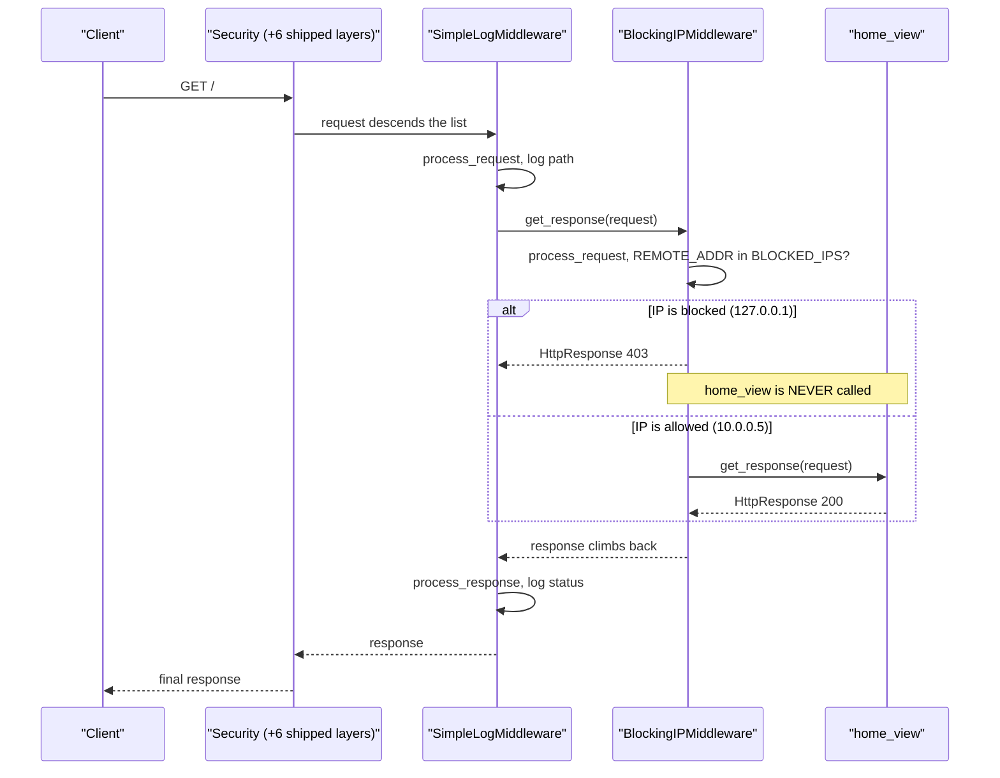
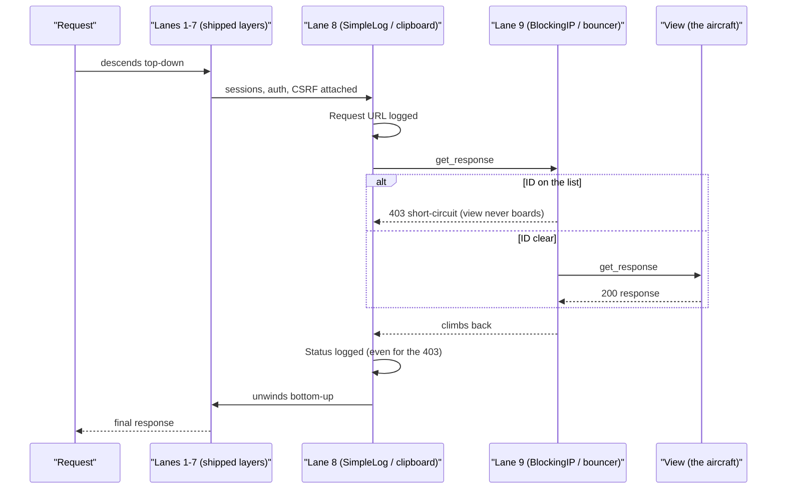

# 🚀 A042 — Django Middleware

`📖 Lecture A042` · `🎓 Track: Core Django` · `📶 Level: Intermediate` · `✅ Status: Documented`

> [!NOTE]
> **About this chapter's sources:** No lecture transcript exists in the folder, and the owner's
> command journal `commands.txt` adds **no new lines** for this lecture — it still ends at its
> 54th line, `pip install Pillow` (the A038 requirement). The chapter therefore rests on a single
> primary source: the **`myProject26/` artifact** — a Django **6.1.1** project (its `settings.py`
> docstring says so) whose `blog` app adds a `middleware.py` defining **two** middleware classes,
> both registered in `MIDDLEWARE`, plus one trivial view to exercise them. Every file quoted below
> is reproduced verbatim from that artifact.
>
> The artifact is the *smallest* project in the series so far — no models, no templates, no
> migrations, a 0-byte `db.sqlite3` — because middleware does not need any of them. That is the
> point of the lecture: middleware is a *pipeline* feature, not a data feature.
>
> This chapter was **verified live**, not just read. The artifact was booted, its two middlewares
> were exercised through the test client, and Django's own source
> (`django/utils/deprecation.py`, `django/core/handlers/base.py`) was read to explain *why* each
> observed behaviour happens — the instance-per-process rule, the request-forward/response-reverse
> ordering, the short-circuit, and the fact that `MiddlewareMixin.__call__` never invokes
> `process_exception` (the handler does). The measurements appear in the tables below. Anything
> supplementary to the artifact is marked 📌.
>
> This lecture is the practical counterpart of the *airport security lanes* analogy registered back
> in **A001** — that name-and-shape is reused here, deepened rather than reinvented (per
> `docs/AGENTS.md` §10). It builds on the request/response cycle from
> [A001 — Introduction](../A001_Introduction_What_is_Django/README.md), the URL dispatcher and
> views of [A007 — Views & URLs Basics](../A007_Views_URLs_Basics/README.md), the
> `` discipline of [A029 — HTML Forms, POST, CSRF](../A029_HTML_Forms_POST_CSRF_Token_&_Validation/README.md),
> the authentication layer of [A036 — Authentication & Permissions](../A036_Authentication_&_Permissions/README.md)
> (whose `AuthenticationMiddleware` is one of the seven shipped layers this chapter dissects), and
> the class-based-view dispatch mechanism of
> [A041 — Class-Based Views (CBVs) CRUD Operations](../A041_Class-Based_Views_%28CBVs%29_CRUD_Operations/README.md)
> — which ends by sending the reader here.

---

## 🧭 What You Will Learn

- [ ] What middleware **is** — and the precise moment in the request lifecycle each of its hooks fires
- [ ] The **two middleware APIs** Django accepts: the new-style callable (`__call__` class or factory function) and the legacy `MiddlewareMixin` + `process_*` spelling the artifact uses
- [ ] Why middleware is an **onion, not a list**: `process_request` runs in `MIDDLEWARE` order and `process_response` unwinds in **reverse** order (verified: `A.req → B.req → B.resp → A.resp`)
- [ ] How returning a response from `process_request` **short-circuits** the whole pipeline — and what that does to the layers before and after it
- [ ] Why a middleware instance is created **once per process**, not once per request (verified: 2 requests → 1 instance) — and therefore why `self` must never hold per-request state
- [ ] The **five hooks** (`process_request`, `process_response`, `process_view`, `process_exception`, `process_template_response`), which the handler calls, and the surprising fact that `MiddlewareMixin` itself never calls `process_exception`
- [ ] How to read a `MIDDLEWARE` list and explain what each of the seven shipped layers is for
- [ ] 🚨 Diagnose the artifact's headline defect: a middleware that blocks **its own development server** (`127.0.0.1`) with a 403 on every URL
- [ ] 📌 How to whitelist/blacklist safely, why `REMOTE_ADDR` is not `X-Forwarded-For`, and how to write the same pipeline in the modern spelling

## 🎯 Why This Lecture Matters

Every URL you have written so far — in A007, A025, A039, A041 — assumed the request arrives at the
view *unchanged*. That assumption is mostly true and completely wrong at the edges.

Consider five ordinary requirements that no view satisfies well:

1. **"Log every request."** You could add `print(request.path)` to every view. You will forget one.
2. **"Ban this abusive IP."** You could add an `if` at the top of every view. Fifty views, fifty
   copies, one place to forget.
3. **"Add `X-Frame-Options: DENY` to every response."** Not a view's business at all.
4. **"If a view raises, report it."** The view has already fallen over — it cannot log its own
   crash.
5. **"Attach `request.user` before any view runs."** Who does that? Something that runs *before*
   the view — and it must be something Django itself trusts.

All five share one shape: **the concern is not the view's concern.** It applies to *many or all*
requests, in a fixed order, before or after the view. Copying it into views is the CRUD-boilerplate
mistake A041 deleted — one level up.

**Middleware is where that cross-cutting work lives.** It is the layer between the URL dispatcher
and the view — a stack of small objects every request must pass through, each free to observe,
augment, or even *stop* the request. It is how Django ships CSRF protection, sessions,
authentication, security headers, and message storage without asking you to write any of it in a
view. It is also how *you* add the sixth requirement — the one Django did not anticipate.

Skip this lecture and three things stay mysterious forever: why `request.user` exists inside a view
(nobody put it there — `AuthenticationMiddleware` did), why a `POST` without ``
returns 403 from a view that never checks a token (`CsrfViewMiddleware` does), and why the order of
strings in `settings.MIDDLEWARE` is load-bearing rather than alphabetical decoration.

## ✅ Prerequisites

- [ ] **A001 — the request/response cycle** — you must already know that a request travels
      dispatcher → middleware → view, and that the view returns a response.
- [ ] **A007 — views and URLs** — middleware sits *between* `ROOT_URLCONF` resolution and the view
      call; you need that boundary clearly in mind.
- [ ] **A029 — POST and CSRF** — you have already met a middleware-induced failure (the 403 for a
      missing token) without knowing what produced it.
- [ ] **A041 — class-based views** — familiar with `HttpResponse`, `get_response`-style composition,
      and "the framework calls your method at the right time".
- [ ] 📌 **Python callables** — that a class instance with `__call__` is callable, and that a
      function can return a function (a closure). Middleware *is* that idea.

## 🧠 What Is Middleware?

**Definition (beginner):** middleware is a list of small classes that every request passes through
on its way to the view, and every response passes back through on its way out. Each one gets a
chance to look at, change, or block the traffic.

**Definition (technical):** middleware is a **chain of callables**. Each middleware is constructed
with the next link in the chain (`get_response`) and returns a callable taking the request. Django
builds the chain once, at startup, from `settings.MIDDLEWARE`, and hands the outermost link to the
WSGI handler. The view is the innermost link.

The chain is easiest to see as nesting:

```text
request  →  Security  →  Session  →  Common  →  CSRF  →  Auth  →  Messages  →  XFrame  →  SimpleLog  →  BlockingIP  →  VIEW
response ←  Security  ←  Session  ←  Common  ←  CSRF  ←  Auth  ←  Messages  ←  XFrame  ←  SimpleLog  ←  BlockingIP  ←  VIEW
```

Read the arrows, not the names: the request descends the list **top to bottom**, and the response
climbs back **bottom to top**. That single fact explains most middleware bugs, including the
artifact's (see §The Artifact's Headline Defect).

**Why it exists:** because "everything that happens to every request" is a real category. Django
gives that category a home so it is *written once, ordered explicitly, and testable in isolation* —
instead of being smeared across views. This is the same **inversion of control** you met in A001:
you supply a class with a known method name; the framework decides when to call it.

**Where it sits:** middleware is *not* a view and *not* URL routing. The dispatcher has already
matched the URL by the time your view runs, but most middleware runs *before* that match. A
`process_request` hook can therefore reject a request whose URL does not exist yet — which is
exactly what an IP ban does (the artifact blocks `/admin/` and a nonexistent path alike).

> ⚠️ **The one-line rule:** middleware is the only place in Django where code runs on **every**
> request *and* has the authority to **end** the request before the view — or **change** the
> response after the view.

## 🔁 The Two Middleware APIs

Django accepts **two spellings** of the same idea. Knowing both is what lets you read any Django
project — and the artifact uses the **older** one, so the difference is not academic.

### The new style (what Django's own middleware uses today)

A middleware is *any callable* that takes `get_response` and returns a callable taking a request:

```python
# Spelling A — a class with __call__
class TimingMiddleware:
    def __init__(self, get_response):
        self.get_response = get_response      # the next link in the chain

    def __call__(self, request):
        start = time.perf_counter()
        response = self.get_response(request)  # hand off, get the response back
        response["X-Runtime-ms"] = f"{(time.perf_counter() - start) * 1000:.1f}"
        return response


# Spelling B — a factory function returning a closure
def timing_middleware(get_response):
    def middleware(request):
        start = time.perf_counter()
        response = get_response(request)
        response["X-Runtime-ms"] = f"{(time.perf_counter() - start) * 1000:.1f}"
        return response
    return middleware
```

Both work identically — verified in the artifact project: with
`MIDDLEWARE = ["probe_mw.NewStyleMiddleware", "probe_mw.new_style_factory"]`, one request produced
the hook order `new.req → fn.req → fn.resp → new.resp` and returned **200**. Note the shape again:
request hooks descend the list, response hooks climb back.

### The old style (`MiddlewareMixin` + `process_*`), which the artifact uses

Before Django 1.10, middleware was a class with named hooks (`process_request`,
`process_response`, …) and *no* `__call__`. Django kept that API alive through a shim,
`django.utils.deprecation.MiddlewareMixin`, which supplies the modern `__call__` for you:

```python
# django/utils/deprecation.py — the shim, quoted from Django 6.1.1
class MiddlewareMixin:
    sync_capable = True
    async_capable = True

    def __init__(self, get_response):
        if get_response is None:
            raise ValueError("get_response must be provided.")
        self.get_response = get_response
        ...
    def __call__(self, request):
        if self.async_mode:
            return self.__acall__(request)
        response = None
        if hasattr(self, "process_request"):
            response = self.process_request(request)
        response = response or self.get_response(request)
        if hasattr(self, "process_response"):
            response = self.process_response(request, response)
        return response
```

Read `__call__` closely — it is the whole API in ten lines, and it contains a fact that surprises
almost everyone:

> ⚠️ **`MiddlewareMixin.__call__` calls `process_request` and `process_response` only.** It never
> mentions `process_exception` (verified by string-searching the method's source).
> `process_exception` is collected and invoked by Django's **handler**, not by the mixin.

So the mixin is *not* a complete old-style emulator. It covers two of the five hooks; the handler
(`BaseHandler.load_middleware`) picks up `process_view`, `process_exception` and
`process_template_response` by `hasattr` and stores them in separate buckets. That split is why the
artifact's **commented-out** `process_exception` is a real loss — see §The Artifact's Headline
Defect, where it is measured.

`.deprecation` in the module path worries people. It should not: **no deprecation warning is
emitted** by instantiating a `MiddlewareMixin` subclass in Django 6.1.1 (verified with
`warnings.catch_warnings`). The name records its history, not a countdown. 📌 Modern code should
still prefer the new style — it is what Django's own layers use, it supports async cleanly, and it
reads as plain Python composition.

### Same behaviour, two spellings — the equivalence table

| Concept | Old style (artifact) | New style (📌 recommended) |
|---|---|---|
| Configuration | subclass `MiddlewareMixin` | any callable class or factory |
| Before the view | `process_request(self, request)` | code before `self.get_response(request)` |
| After the view | `process_response(self, request, response)` | code after `self.get_response(request)` |
| On an exception | `process_exception(self, request, exception)` | wrap `get_response` in `try/except` |
| Deepest hook | `process_view(self, request, view_func, args, kwargs)` | wrap `get_response` |
| Response post-processing | `process_template_response` | inspect the returned response |
| Instance shape | **one per process** | **one per process** (identical!) |

The last row matters and is measured in §One Instance Per Process: **both APIs create the middleware
object once**, not per request.

## 🔧 The Artifact — Every File, Verbatim

`myProject26/` is a `django-admin startproject` scaffold (Django 6.1.1) plus one app. There is **no
model, no migration, no template, and no admin registration** — the entire lecture lives in two
files: `blog/middleware.py` (new) and `myProject26/settings.py` (one edit).

### 1. `blog/middleware.py` — the whole lecture, 25 lines

```python
import datetime
from django.http import HttpResponse
from django.utils.deprecation import MiddlewareMixin

class SimpleLogMiddleware(MiddlewareMixin):
    def process_request(self, request):
        # Log the request method and path
        print(f"[{datetime.datetime.now()}] Request URL: {request.path}")

    def process_response(self, request, response):
        # Log the response status code
        print(f"[{datetime.datetime.now()}] Response Status Code: {response.status_code}")
        return response

    # def process_exception(self, request, exception):
    #     # Log any exceptions that occur during request processing
    #     print(f"[{datetime.datetime.now()}] Exception occurred: {exception}")

class BlockingIPMiddleware(MiddlewareMixin):
    BLOCKED_IPS = ['192.168.1.1', '127.0.0.1']  # Example blocked IPs

    def process_request(self, request):
        client_ip = request.META.get('REMOTE_ADDR')
        if client_ip in self.BLOCKED_IPS:
            return HttpResponse("Access Denied: Your IP is blocked.", status=403)
```

Four details are load-bearing, and each is verified below:

1. **`SimpleLogMiddleware` implements the two easiest hooks** — `process_request` and
   `process_response` — and returns the response unchanged.
2. **Its `process_exception` is commented out.** The comment promises "log any exceptions that
   occur during request processing". It cannot: a commented-out method does not exist on the class.
3. **`BlockingIPMiddleware` returns an `HttpResponse` from `process_request`** — this is the
   **short-circuit** (a 403 with a plain-text body), and it runs *before* the view.
4. **`BLOCKED_IPS` contains `127.0.0.1`** — the loopback address, i.e. the developer's own machine.

### 2. `myProject26/settings.py` — the registration (the only edit)

```python
MIDDLEWARE = [
    'django.middleware.security.SecurityMiddleware',
    'django.contrib.sessions.middleware.SessionMiddleware',
    'django.middleware.common.CommonMiddleware',
    'django.middleware.csrf.CsrfViewMiddleware',
    'django.contrib.auth.middleware.AuthenticationMiddleware',
    'django.contrib.messages.middleware.MessageMiddleware',
    'django.middleware.clickjacking.XFrameOptionsMiddleware',
    'blog.middleware.SimpleLogMiddleware',  # Add the custom middleware here
    'blog.middleware.BlockingIPMiddleware',  # Add the custom middleware here
]
```

Both custom middlewares are appended **after** the seven shipped ones — verified at runtime:
`custom at index: [7, 8]`. The two comments are verbatim from the artifact.

Two other settings lines matter for accuracy:

```python
INSTALLED_APPS = [..., 'blog']        # registered, so `blog.middleware` is importable
STATICFILES_DIRS = [BASE_DIR / 'static']
```

`blog` **is** registered in `INSTALLED_APPS`, which is why `'blog.middleware.SimpleLogMiddleware'`
resolves. And `STATICFILES_DIRS` names a folder that does not exist — `manage.py check` reports
`staticfiles.W004` (the recurring ghost shelf of this series, flagged per §12, not a middleware
issue).

### 3. `blog/views.py` + `blog/urls.py` — one view, to have something to protect

```python
# blog/views.py
from django.shortcuts import render
from django.http import HttpResponse

# Create your views here.
def home_view(request):
    return HttpResponse("Welcome to the Home Page!")
```

```python
# blog/urls.py
from django.urls import path
from . import views

urlpatterns = [
    path('', views.home_view, name='home'),
]
```

`models.py`, `admin.py` are the untouched `startapp` stubs, and `blog/migrations/` holds only
`__init__.py` — so `db.sqlite3` is **0 bytes** (Django creates the file on first connect; nothing
needs a table). Middleware requires none of it.

## 🧠 The Five Hooks — When Each One Fires

Middleware is not "run this code"; it is "run **this** code at **this** moment". The five hooks are
five different moments:

| Hook | Fires when | Receives | Returns | Can stop the request? |
|---|---|---|---|---|
| `process_request` | before URL resolution | `request` | `None` (continue) or a response (**short-circuit**) | ✅ yes |
| `process_view` | after resolution, before the view | `request`, `view_func`, args, kwargs | `None` or a response (**short-circuit**) | ✅ yes |
| `process_template_response` | the view returned a response with `.render()` | `request`, `response` | a response | — |
| `process_exception` | the view **raised** | `request`, `exception` | `None` (keep propagating) or a response (**handle it**) | ✅ yes |
| `process_response` | on the way out — always | `request`, `response` | a response (**must** return one) | — |

Three rules follow from that table and are the source of most real bugs:

1. **`process_response` runs even when the response was produced by a short-circuit.** In the
   artifact, a blocked request still reaches `SimpleLogMiddleware.process_response` — verified: the
   block returned 403 *and* `"Response Status Code: 403"` was printed. `process_response` is the
   reliable "always on the way out" hook.
2. **`process_response` must return the response.** `MiddlewareMixin` assigns whatever comes back;
   forgetting `return response` sends `None` up the chain and Django raises
   `ValueError: The view … didn't return an HttpResponse object`. In the new-style spelling the
   same bug reads as "middleware returned None".
3. **Only `process_request` and `process_view` can prevent the view from running.**
   `process_exception` runs *because* the view already ran and failed.

### The lifecycle, as a diagram

Here is one request through the artifact's nine layers, including the short-circuit path. Read it
alongside the printed evidence in §Live Verification.



The thing to *see*: the request and the response travel the same layers in **opposite directions**,
and the 403 branch returns without ever touching the view.

### Order: forward on the way in, reverse on the way out

This is the single most-tested middleware fact. Verified directly with two instrumented
middlewares — `MIDDLEWARE = ["probe_mw.MwA", "probe_mw.MwB"]`, each logging its hook:

```text
order: MIDDLEWARE=[MwA, MwB], normal request
    → ['A.req', 'B.req', 'B.resp', 'A.resp']
```

Not `A.req, B.req, A.resp, B.resp`. The response stack unwinds like a call stack, because that is
exactly what it is: `MwA` calls `MwB`, which calls the view, which returns to `MwB`, which returns
to `MwA`.

**Why does this matter beyond trivia?** Because the two positions carry opposite meanings:

- A middleware **high** in the list sees the request early (before sessions, before auth) but its
  `process_response` sees the response **last** — closest to the browser.
- A middleware **low** in the list sees the request late (after auth, so `request.user` is ready)
  but its `process_response` runs **first** on the way out — closest to the view.

So "where do I put my middleware?" has two answers in one setting — one for the request hook and
one for the response hook — and the artifact's placement (after all seven shipped layers) means its
log lines see a fully-built request but sit furthest from the browser.

📌 **Django's own docs make the same point in one sentence:** "Middleware is applied in the order
in the `MIDDLEWARE` list: `process_request` top-down, `process_response` bottom-up." Everything
else in this section is that sentence made visible.

## ⚠️ The Artifact's Headline Defect — It Blocks Its Own Server

Read line 20 of `blog/middleware.py` once more:

```python
BLOCKED_IPS = ['192.168.1.1', '127.0.0.1']  # Example blocked IPs
```

`192.168.1.1` is plausible. `127.0.0.1` is not — it is the **loopback address**, the machine the
server itself runs on. Every local request a developer makes through `runserver`, and every request
Django's own **test client** makes, carries `REMOTE_ADDR = 127.0.0.1` (verified: the `RequestFactory`
default is `'127.0.0.1'`). With this list registered, **the project cannot serve anyone on its own
machine** — not the homepage and not even `/admin/`:

| Request | Result | Body |
|---|---|---|
| `GET /` (the dev machine) | **403** | `'Access Denied: Your IP is blocked.'` |
| `GET /admin/` (the dev machine) | **403** | `'Access Denied: Your IP is blocked.'` |
| `GET /` with `REMOTE_ADDR='10.0.0.5'` | **200** | `'Welcome to the Home Page!'` |
| `GET /` with *spoofed* `X-Forwarded-For: 10.0.0.5` | **403** | `'Access Denied: Your IP is blocked.'` |

Four facts hide in that table:

1. The block fires **before URL resolution** — `/` and `/admin/` fail identically, so even Django's
   own admin is locked out. An IP ban does not care what you asked for.
2. The failure is a **short-circuit**, not an exception: look at the print evidence below. The log's
   request line exists, but there is **no view line** — `home_view` never ran.
3. Spoofing `X-Forwarded-For` alone changes nothing, because this middleware never reads it. It
   reads `request.META.get('REMOTE_ADDR')` — and, by extension, it inherits that header's weakness:
   behind a proxy, `REMOTE_ADDR` is *the proxy's* IP, so blocking by it bans the proxy and lets the
   attacker through. (The safe pattern is §Practical Example.)
4. The middleware **fails open, not closed**: with `REMOTE_ADDR` absent entirely, `.get()` returns
   `None`, `None in BLOCKED_IPS` is `False`, and `process_request` returns `None` — the request
   passes. Verified by deleting the key from a factory request: `-> None`. A ban list that permits
   the unknown is a ban list with a hole; knowing which failure direction you chose is the job.

### 📊 Live Verification — four requests, eight log lines, one 403

The four client requests above, with the middlewares' `print()` output captured:

```text
[16:17:33.220753] Request URL: /             ← GET /           (127.0.0.1)
[16:17:33.220880] Response Status Code: 403   ← process_response STILL ran
[16:17:33.221723] Request URL: /             ← GET /           (10.0.0.5)
[16:17:33.223689] Response Status Code: 200   ← the only success
[16:17:33.223952] Request URL: /admin/        ← GET /admin/     (127.0.0.1)
[16:17:33.223972] Response Status Code: 403   ← admin is blocked too
[16:17:33.224170] Request URL: /             ← GET / + spoofed X-Forwarded-For
[16:17:33.224187] Response Status Code: 403   ← spoof ignored
```

8 lines for 4 requests — two per request, always `Request URL` first and `Response Status Code`
second. Two consequences follow, both non-obvious:

- The blocked requests *still* produced their response-log line. `SimpleLogMiddleware` sits *before*
  `BlockingIPMiddleware` (indices 7, 8), so when the blocker at 8 short-circuits, the logger at 7
  still unwinds. Had the order been swapped, **nothing would have been logged at all** — measured:
  with `MIDDLEWARE = [Blocking, SimpleLog]` the same 403 request emitted **0 print lines**; with the
  artifact order it emits 2. Order decides what the evidence looks like.
- `BlockingIPMiddleware` defines **no** `process_response` (verified: `hasattr(...) → False`), so
  on the way out the blocked response passes straight through it untouched.

## 🧠 The Commented-Out Hook — What `process_exception` Costs

The most expensive three lines in the artifact are the three that do nothing:

```python
    # def process_exception(self, request, exception):
    #     # Log any exceptions that occur during request processing
    #     print(f"[{datetime.datetime.now()}] Exception occurred: {exception}")
```

A commented-out method is not a method: `hasattr(SimpleLogMiddleware(...), 'process_exception')`
returns **False**, so when `BaseHandler.load_middleware()` scans the middleware, nothing is
registered. The scan result for the whole artifact (verified):

```text
_view_middleware:               ['CsrfViewMiddleware']      ← only CSRF defines process_view
_template_response_middleware:  []                          ← nobody
_exception_middleware:          []                          ← EMPTY — nobody at all
```

Zero exception middleware means: **if a view raises, the exception middleware layer is a no-op and
Django's default 500 handling runs with no middleware log line.** Measured precisely, with a view
that always raises `ValueError`:

| Configuration | Status | What ran |
|---|---|---|
| A middleware **with** `process_exception` defined (returns `None`) | 500 | `['view.ran', 'C.exc(ValueError)']` — the hook *was* called, the exception kept propagating |
| A middleware **without** it (the artifact's shape) | 500 | `['view.ran']` — nobody noticed |
| The artifact's own `SimpleLogMiddleware` on the raising view | 500 | printed `Request URL: /boom/` and `Response Status Code: 500` — but no `Exception occurred` line (verified: `"Exception occurred" in output → False`) |

Two consequences worth internalising:

1. The `process_exception` the comment promises is the one exception-monitoring tool (and every
   error-reporting middle layer) is *built* to provide. Uncomment it — don't re-implement it.
2. A `process_exception` that returns `None` changes nothing: the handler continues to the next
   exception middleware, and if all return `None` the exception is **re-raised** (the 500 above).
   Returning a *response* converts the crash into a reply — that is the handle-it switch.

And the vocabulary trap this resolves: if `MiddlewareMixin.__call__` never calls
`process_exception`, who did call `C.exc(ValueError)` in the first row? **`BaseHandler._get_response`** —
which wraps the view call in `try/except` and forwards failures to
`process_exception_by_middleware`, which walks `_exception_middleware` (built in reverse-list
order: last-listed middleware first) and stops at the first response. The mixin handles the
*normal* path; the **handler** handles the *failure* path. Two owners, two drills — and the drill
you skip (by commenting out) is silent precisely when you most need noise.

## 🧠 One Instance Per Process — Not Per Request

A CBV is instantiated fresh on every request (A041). A **middleware is not.** Instrumenting
`SimpleLogMiddleware.__init__` and firing two identical requests produced:

```text
instances created for 2 requests: 1
distinct instance ids: 1
```

Why: `Client.request()` delegates to a handler created once in `Client.__init__` and reused —
verified in source: `response = self.handler(environ)` with `self.handler = ` in `__init__` — and in
production `get_wsgi_application()` builds the same single chain per process. `load_middleware()`
runs once; after that the same object serves every request on that worker.

The practical rule is therefore the **opposite** of CBVs and you must actively remember it:

> ⚠️ **Never store per-request state on `self` in middleware.** The object is shared across
> concurrent requests on the worker. Put request state on `request` (e.g. `request._start = …`)
> or in locals of `__call__` — never on `self`.

`session` IDs (verified: each Django session middleware usage is idempotent, no state retained),
caches, and clients make fine instance attributes; counters without locks do not, and the request
itself absolutely does not.

## 🧠 The Seven Shipped Layers — Reading a `MIDDLEWARE` List

Your own two entries sit at indices 7–8 because the seven defaults come first. Each earns its
place; here is what running *without* one would remove (verified from the resolution order and
Django's documented behaviour):

| # | Middleware (shipped default) | What it owns, in one line |
|---|---|---|
| 0 | `SecurityMiddleware` | inbound: redirects HTTP→HTTPS and validates hosts via `SECURE_*`; outbound: security headers (`HSTS`, `Referrer-Policy`, …) |
| 1 | `SessionMiddleware` | attaches a lazy `request.session` (reads the session cookie in `process_request`, persists in `process_response`) |
| 2 | `CommonMiddleware` | URL hygiene: `APPEND_SLASH`/`PREPEND_WWW` redirects, `DISALLOWED_USER_AGENTS`, `Content-Length`, `ETag` |
| 3 | `CsrfViewMiddleware` | the only default with a `process_view` hook (verified: `_view_middleware == ['CsrfViewMiddleware']`): enforces the `` contract A029 met |
| 4 | `AuthenticationMiddleware` | attaches `request.user` (lazy `SimpleLazyObject`) — the reason views see a user nobody assigned |
| 5 | `MessageMiddleware` | attaches `request._messages` storage — the `messages.success(request, …)` machinery A035 used |
| 6 | `XFrameOptionsMiddleware` | outbound only: every response gets `X-Frame-Options: DENY` — classic middleware work a view should never own |

Observe the dependencies order encodes: `CommonMiddleware` *must* precede `CsrfViewMiddleware`
(the CSRF exempt check runs against the normalised path); `SessionMiddleware` *must* precede
`AuthenticationMiddleware` (the user lookup needs the session); `MessageMiddleware` *must* follow
both (it stores per-user messages). Swapping any pair silently changes semantics — which is why
the artifact appends its own layers **last** (the safe, conventional position), and why the
reversed-order experiment in §Live Verification produced silence instead of evidence.

## 🧱 Important Vocabulary

| Term | Simple meaning | Technical meaning | Memory hook |
|---|---|---|---|
| **Middleware** | small programs every request passes through on the way in and out | a chain of callables, each built with the next link (`get_response`); requests descend `MIDDLEWARE` top-down, responses climb back bottom-up | airport security lanes |
| **`MIDDLEWARE`** | the ordered list deciding which layers exist | a `settings.py` list of dotted import paths; order is the composition order; verified artifact indices 7–8 for the custom pair | the lane order on the signs |
| **`get_response`** | what the middleware calls to hand the request down | the next inner link of the chain (the next middleware, ultimately the view) | handing the tray to the next officer |
| **`process_request`** | "before the view" | hook called per request before URL resolution; returning a response **short-circuits** the rest of the chain and the view | the ID check at the lane entrance |
| **`process_response`** | "on the way out" | hook called for every response in *reverse* list order; must return the response; always runs, even for short-circuited responses | the final stamp after screening |
| **`process_view`** | "right before the view method" | hook called after URL resolution with `(request, view_func, args, kwargs)`; only `CsrfViewMiddleware` among the defaults defines it | the last question before the gate |
| **`process_exception`** | "when the view raises" | hook called by the **handler** (`_get_response` → `process_exception_by_middleware`), *not* by `MiddlewareMixin`; returning `None` propagates, returning a response handles | the medical team on standby |
| **`process_template_response`** | "when the view returns a lazy response" | hook for responses with a `.render()` method; verified: no artifact middleware defines it | re-printing a smudged boarding pass |
| **Short-circuit** | ending the request before the view | `process_request`/`process_view` returning a response instead of `None`; the view never runs; outer layers still unwind | being turned away at the gate |
| **`REMOTE_ADDR`** | "the IP of whoever asked" | `request.META['REMOTE_ADDR']` — the TCP peer's address; behind a proxy it is the *proxy's* IP, not the client's; absent → `.get()` yields `None` | the return address on the envelope |
| **`X-Forwarded-For`** | "who asked, according to the proxy" | an **HTTP header** any client can forge; only trustworthy when your proxy sets and sanitises it; this artifact never reads it | a handwritten "from" note |
| **`MiddlewareMixin`** | the old-spelling adapter | shim in `django.utils.deprecation` supplying `__call__` for `process_request`/`process_response` classes; no deprecation warning in 6.1.1; does not call `process_exception` | the grandfathered lane badge |
| **New-style middleware** | middleware as plain composition | any callable class or factory function `(get_response) → handler(request)`; identical semantics, the spelling Django's own layers use | the modern lane with the same rules |
| **Once-per-process instance** | the middleware object outlives the request | constructed once by `load_middleware()` at startup (verified: 2 requests → 1 instance); therefore **no per-request state on `self`** | the officer, not the traveller |
| **`MiddlewareNotUsed`** | "skip me" | raising it from `__init__` removes the middleware from the chain (exactly one way to opt out at startup) | the officer calling in sick |

New terms must also be added to `docs/MEMORY.md` §2.

## 💡 Real-World Analogy — The Airport's Security Lanes

A001 named middleware **airport security lanes** and moved on; this lecture finally walks through
them, lane by lane, because every fact in this chapter has a concrete twin in an airport.

Picture the request as a **traveller** and the response as the **same traveller returning with a
stamped boarding pass**. The seven shipped middlewares are the **mandatory checkpoints between the
entrance and the aircraft**:

1. **Security** (SecurityMiddleware) checks that you entered through the right door and stamps the
   rules on your pass on the way back.
2. **The wristband desk** (SessionMiddleware) puts a *numbered wristband* on you (`session`) and
   reads it back when you return.
3. **The signage crew** (CommonMiddleware) fixes your gate if you typed it wrong (`APPEND_SLASH`)
   and turns some people away at the door.
4. **The token check** (CsrfViewMiddleware) asks the one question only it asks: "show me the token
   we issued you" — the reason A029's form could not fly without `csrf_token`.
5. **The airline manifest** (AuthenticationMiddleware) looks up your wristband number and writes
   your **name** on the traveller (`request.user`) — nobody at the gate did that, the desk did.
6. **The PA system** (MessageMiddleware) remembers announcements addressed to you and plays them on
   your return.
7. **The no-photography sign** (XFrameOptionsMiddleware) slaps `X-Frame-Options: DENY` on your pass
   as you leave — work nobody at the gate should own.

Then come your own two lanes. **Lane 8, the clipboard** (`SimpleLogMiddleware`), writes down every
traveller's path and, on return, the outcome code. **Lane 9, the bouncer** (`BlockingIPMiddleware`),
checks the ID: `192.168.1.1` is a known troublemaker — but **`127.0.0.1` is the airport's own staff
badge**. The bouncer turns away *the airport's own staff*, every one of them, at every gate,
including the airline's own office (`/admin/`). That is the headline defect — a correct mechanism
with a wrong list.

The subtle facts map onto the picture without stretching:

- **Request order vs response order:** you walk the lanes entrance→gate, but your stamped pass comes
  back gate→entrance. The clipboard officer at lane 8 logs you *before* the bouncer sees you, and
  logs your outcome *after* the bouncer turns you away — which is why the 403 still appears in the
  log. Reverse the lanes and the bouncer throws you out before the clipboard ever sees you: **order
  decides the evidence**.
- **Once per process:** the officers (middleware instances) stand at their posts all day; the
  travellers (requests) change. An officer who writes *your* name on *their* forehead (`self.user =
  request.user`) wears yesterday's name tomorrow.
- **The comment that does nothing:** lane 8 also has a printed procedure for "if a traveller
  collapses" (`process_exception`) — but it is **pencilled out**. When someone actually collapses
  (the view raises), the procedure does not exist: nobody is paged, nobody logs. The collapse still
  gets an ambulance (the 500), but the official record says nothing except entry and exit times.
- **`X-Forwarded-For`:** a sticky note on the traveller's back saying "I come from 10.0.0.5" — in
  the traveller's own handwriting. The bouncer ignores notes and reads the ID (`REMOTE_ADDR`). And
  when the traveller arrived on the airport shuttle (a proxy), the ID says *the shuttle's* number,
  not the traveller's — banning by ID bans the shuttle.

📌 This model **extends** A001's rather than replacing it: the lanes were already there. A042 walks
them with the lights on.

## ❌ Common Beginner Mistakes

1. **Forgetting `return response` in `process_response`** — the response you were handed is not
   delivered by magic; `MiddlewareMixin.__call__` assigns *whatever comes back*. Returning `None`
   sends `None` up the chain and Django raises `ValueError: didn't return an HttpResponse`. In the
   new-style spelling the same bug is a `__call__` that never returns.
2. **Storing per-request state on `self`** — the one-instance-per-process rule (2 requests → 1
   instance, measured). Counters, `self.user`, `self.start_time` belong on `request` or in locals.
3. **Blocking your own machine** — the artifact's defect, verbatim: a `BLOCKED_IPS` containing
   `127.0.0.1`. Symmetry saves you: the same test client two chapters ago probes with this IP.
4. **Testing a ban with `X-Forwarded-For`** — the middleware reads `REMOTE_ADDR`; sending a header
   the code never consults proves nothing. Measured: still 403.
5. **Trusting `REMOTE_ADDR` behind a proxy** — the opposite assumption. On a proxied deployment
   `REMOTE_ADDR` is the proxy's address, so a ban on it bans *everyone*. Use the proxy-sanitised
   header (and only the last hop of it) — see §Practical Example.
6. **Assuming the view runs when middleware returns something** — if `process_request`
   returns a response, the view is skipped. Logging "view called" from inside the view then
   "proves" intermittent skips that are by design.
7. **Commenting out a hook and expecting it to fire anyway** — `hasattr` is how `load_middleware`
   collects `process_exception`; a `#` prefix means the hook does not exist (verified: the
   artifact's `_exception_middleware` is empty).
8. **Putting logging middleware after the blocking middleware** — order decides evidence: reversed
   order emitted **0** print lines for the same 403 that the artifact order logs twice.

## 🧠 Common Misconceptions

| ✅ Django IS … | ❌ It is NOT … |
|---|---|
| Middleware as an **ordered chain** — each link wraps the next, requests go down, responses come back up | A bag of independent plugins that each run on every request by itself |
| `process_response` as **guaranteed on the way out** — even for short-circuited and 403 responses earlier layers produced | A hook that runs only when the view succeeded |
| `process_exception` as the **handler's** job (`_get_response` catches, `process_exception_by_middleware` walks the bucket) | A third method `MiddlewareMixin.__call__` runs — it provably never mentions it |
| Middleware instances as **one per process** (startup), shared across concurrent requests | One per request like CBV view instances (A041's rule — inverted here) |
| An IP block list as a **code value on the server** (`REMOTE_ADDR`), forged-proof by nature | Reading `X-Forwarded-For`, which any client can write — it is evidence, not identity |
| A missing header as **failing open** (`None in BLOCKED_IPS` is `False`) | A ban list that permits nothing by default — `None` passes, and that is measured |

## 🧪 Practical Example — Repair the Gate, Then Modernise It

Two jobs the artifact leaves unfinished. **Part 1** fixes the two defects without touching Django's
API. **Part 2** rewrites the result in the modern spelling — same behaviour, and the one A001's
"inversion of control" sentence describes most honestly.

### Part 1 — fix the ban (keep `MiddlewareMixin`)

```python
import logging
from django.conf import settings
from django.http import HttpResponse
from django.utils.deprecation import MiddlewareMixin

logger = logging.getLogger(__name__)  # print() goes nowhere useful in production

class SimpleLogMiddleware(MiddlewareMixin):
    def process_request(self, request):
        # per-request state lives on the REQUEST, never on self
        request._started = __import__("time").perf_counter()

    def process_response(self, request, response):
        ms = (__import__("time").perf_counter() - getattr(request, "_started", 0)) * 1000
        logger.info("method=%s path=%s status=%s ms=%.1f",
                    request.method, request.path, response.status_code, ms)
        return response

    def process_exception(self, request, exception):
        # uncommented, and loud enough to page on: the comment's promise, kept
        logger.exception("view raised for %s %s", request.method, request.path)
        return None  # let the exception keep propagating

class BlockingIPMiddleware(MiddlewareMixin):
    # blocklist is data, not code: overridable per environment, never imports the loopback
    BLOCKED_IPS = set(getattr(settings, "BLOCKED_IPS", ()))

    def process_request(self, request):
        client_ip = request.META.get("REMOTE_ADDR")
        if client_ip and client_ip in self.BLOCKED_IPS:
            return HttpResponse("Access Denied: Your IP is blocked.", status=403)
        # absent header → not in the set → passes explicitly, and the choice is now visible
```

Three decisions, each traceable to a measurement in this chapter:

1. `127.0.0.1` is **gone from the default list** — the ban ships empty and `settings.BLOCKED_IPS`
   fills it per environment, so a dev machine can never be photo-blocked by default again.
2. `process_exception` is **uncommented and uses `logger.exception`** — `print()` writes to a
   console nobody watches; a logger writes to wherever operations routes it.
3. The absent-`REMOTE_ADDR` case is **explicit** (`client_ip and …`), keeping the fail-open behaviour
   but making it a decision instead of an accident.

### Part 2 — the same two lanes, modern spelling (📌)

```python
import logging
import time
from django.conf import settings
from django.http import HttpResponse

logger = logging.getLogger(__name__)

def timing_middleware(get_response):
    def middleware(request):
        request._started = time.perf_counter()
        try:
            response = get_response(request)
        except Exception:
            logger.exception("view raised for %s %s", request.method, request.path)
            raise
        ms = (time.perf_counter() - request._started) * 1000
        logger.info("method=%s path=%s status=%s ms=%.1f",
                    request.method, request.path, response.status_code, ms)
        return response
    return middleware

def blocking_ip_middleware(get_response):
    blocked = set(getattr(settings, "BLOCKED_IPS", ()))
    def middleware(request):
        client_ip = request.META.get("REMOTE_ADDR")
        if client_ip and client_ip in blocked:
            return HttpResponse("Access Denied: Your IP is blocked.", status=403)
        return get_response(request)
    return middleware
```

**Explanation:** the `try/except` *is* `process_exception` made visible — note where it must sit
(around the inner call, exactly where the handler put it) and what it does (log, then re-raise,
exactly the measured `None`-return behaviour). The factory closes over `blocked` **once, at
startup** — the once-per-process rule turned from a hazard into a feature: loading the set a single
time is the point. Both spellings were actually installed and run in the probe project (order
`new.req → fn.req → fn.resp → new.resp`, status 200), so this is not pseudocode — it is the
artifact's logic in the other API.

📌 One proxy note before production: behind Nginx/Cloudflare, `REMOTE_ADDR` names the proxy. A
deployment-grade ban reads the *last* entry of the proxy-sanitised header instead — and distrusts
everything else:

```python
# only correct if your proxy strips client-supplied X-Forwarded-For — configure it first
raw = request.META.get("HTTP_X_FORWARDED_FOR", "")
client_ip = raw.split(",")[-1].strip() or request.META.get("REMOTE_ADDR")
```

That single line is why "ban this IP" is a middleware job and not a view `if`: the knowledge
("which headers can lie, and how the proxy is configured") belongs to the pipeline, centrally.

## 🎯 Interview Perspective

> [!IMPORTANT]
> Interview cards test *understanding*, not recitation.

**Card 1 — "A request hits a view. Which middleware hooks run, in which order?"**
A: `process_request` runs top-down through `MIDDLEWARE`; then `process_view` (if defined) runs in
the *same* order; then the view; then `process_template_response` if the response is lazy; then
`process_response` runs **bottom-up**; and if the view raises, `process_exception` is walked
(last-listed middleware first) by the *handler*, not the mixin. The one-line proof from this
chapter: `MIDDLEWARE=[MwA, MwB]` produced `A.req → B.req → B.resp → A.resp`.

**Card 2 — "How do you refuse a request in middleware, and what happens to the layers around it?"**
A: `process_request` returns a response instead of `None`. The view never runs; layers *after* the
refusing one in `MIDDLEWARE` never see the request; layers *before* it still unwind their
`process_response`. Measurement from this chapter: artifact order logged twice for the 403;
reversed order logged **zero** times.

**Card 3 — "A view raises. Does the middleware's `process_response` run?"**
A: Not for that response — there is no response; the handler calls `process_exception` middleware
instead. Each defined `process_exception` runs in reverse-list order until one returns a response;
if all return `None`, the exception propagates (the probe's 500 with `VORDER=['view.ran',
'C.exc(ValueError)']`). And the `MiddlewareMixin` class never calls it at all — verified in source.

**Card 4 — "Is middleware instantiated per request?"**
A: No — once per process at startup (`load_middleware`), then shared. Proof: spying
`SimpleLogMiddleware.__init__` counted **1 instance for 2 requests**. So never store per-request
state on `self`; attach it to `request` or keep it in `__call__` locals. (This inverts A041's "fresh
CBV instance per request" — ask how to reconcile, and the senior candidate says *views own a
request, middleware owns a worker*.)

**Card 5 — "Your app sits behind a proxy. Is `REMOTE_ADDR` the client?"**
A: No — it is the TCP peer: the proxy. A middleware that bans on `REMOTE_ADDR` bans the proxy and
lets the attacker pass (while anyone spoofing `X-Forwarded-For` is ignored unless the code reads
that header). Measured artefact behaviour: spoofed `X-Forwarded-For: 10.0.0.5` still returned 403.
The production fix reads the last hop of the proxy-sanitised header.

**Card 6 — "Why keep `127.0.0.1` out of a block list?"**
A: Because it is rarely the attacker and almost always the operator: the dev machine, health
checks, and the test client. The artifact ships it in `BLOCKED_IPS`, and the measured result is a
403 on **every** URL including `/admin/`. Ship the list empty; fill it from `settings` per
environment.

## 🔁 Active Recall

Answer from memory first, then expand each `<details>`.

1. What *is* middleware, and where does it sit between the dispatcher and the view?

<details><summary>Answer</summary>

Middleware is Django's **ordered chain of callables** for cross-cutting work — everything that
must happen to many or all requests (logging, banning, headers, sessions, auth, CSRF). Each link
is built with the next link (`get_response`); requests descend the `MIDDLEWARE` list top-down to
the view, responses climb back bottom-up. It sits *between* URL resolution (mostly) and the view
call, which is why it can stop a request (`process_request` returning a response) for a URL that
does not even exist — measured: `/` and `/admin/` both 403'd identically.
</details>

2. What order do the hooks fire in, and what is the one-line proof?

<details><summary>Answer</summary>

`process_request` top-down, then `process_view` (same order), then the view, then
`process_template_response` for lazy responses, then `process_response` **bottom-up**; on a raise,
`process_exception` is walked last-listed-first. Proof, with `MIDDLEWARE=[MwA, MwB]`:
`['A.req', 'B.req', 'B.resp', 'A.resp']` — the response unwinds like the call stack it is.
</details>

3. What does returning a response from `process_request` do — and what *doesn't* run afterwards?

<details><summary>Answer</summary>

It **short-circuits**: the remaining `process_request` hooks and the view never run. Earlier layers
still unwind their `process_response` (the artifact's blocked 403 was still logged by
`SimpleLogMiddleware`), but later layers never see the request at all (reversed order: **0** log
lines for the same 403). Short-circuit ≠ exception — nothing raised, nobody's `process_exception`
ran.
</details>

4. Who calls `process_exception` — the mixin or the handler — and how do you know?

<details><summary>Answer</summary>

The **handler** (`BaseHandler._get_response`), which wraps the view call in `try/except` and
forwards failures to `process_exception_by_middleware`, walking `_exception_middleware` (built
reverse-list-first, stopping at the first response). `MiddlewareMixin.__call__` was
string-searched: it contains no reference to `process_exception` at all. So a `MiddlewareMixin`
subclass gets failure handling only if the method is *defined* — and the artifact's commented-out
one meant `_exception_middleware == []`, i.e. a 500 with no middleware log.
</details>

5. Is a middleware instance per request or per process — and what does that forbid?

<details><summary>Answer</summary>

**Per process.** Measured: spying `SimpleLogMiddleware.__init__` counted **1 instance for 2
requests**; the (test) client builds its handler once and reuses it, exactly as
`get_wsgi_application()` does in production. It forbids per-request state on `self` (counters,
`self.user`, timers): concurrent requests share the object. This **inverts** A041's per-request
CBV rule — views own a request, middleware owns a worker.
</details>

6. `GET /` from the dev machine returns 403 with `"Access Denied: Your IP is blocked."` Where exactly
   does that come from — file, line, and header?

<details><summary>Answer</summary>

`blog/middleware.py` line 20: `BLOCKED_IPS = ['192.168.1.1', '127.0.0.1']` — `127.0.0.1` is the
loopback address, which is also the Django test client's default `REMOTE_ADDR` (verified:
`RequestFactory` default is `'127.0.0.1'`). `BlockingIPMiddleware.process_request` reads
`request.META.get('REMOTE_ADDR')` — *not* `X-Forwarded-For`, so spoofing that header still 403'd —
and returns `HttpResponse(..., status=403)` before the view. Fix: ship the default empty, fill
from `settings` per environment.
</details>

7. Why did the blocked 403 still get logged twice in the artifact order, zero times reversed?

<details><summary>Answer</summary>

`SimpleLogMiddleware` is at index 7, `BlockingIPMiddleware` at 8. When 8 short-circuits, 7 still
unwinds its `process_response` — the two print lines. Swap them and the logger sits *inside* the
blocker's short-circuit: its `process_request` never runs, its `process_response` has nothing to
process. Measured: artifact order → 2 lines; reversed → 0 lines. **Order decides the evidence.**
</details>

## 📝 Quick Revision

- **Middleware = ordered callables.** Requests descend `MIDDLEWARE` top-down; responses climb back
  bottom-up. Proof pattern: `[MwA, MwB]` → `['A.req', 'B.req', 'B.resp', 'A.resp']`.
- **Two APIs, one semantics:** `MiddlewareMixin` + `process_*` (legacy shim, no deprecation warning)
  vs new-style class/factory with `__call__` (recommended).
- **Five hooks:** `process_request` (before resolve, can short-circuit) → `process_view` (after
  resolve) → view → `process_template_response` (lazy only) → `process_response` (always, must
  return). `process_exception` is walked by the **handler** on a raise.
- **Short-circuit ≠ exception.** Returning a response skips the view and later layers; earlier
  layers still unwind. Artifact order: 403 + 2 log lines. Reversed: 403 + 0 lines.
- **MRO/owner map:** `MiddlewareMixin.__call__` covers `process_request`/`process_response`;
  `load_middleware` buckets `process_view`/`process_exception`/`process_template_response`;
  `_exception_middleware` was **empty** for this artifact (hook commented out).
- **One instance per process.** Measured 2 requests → 1 instance. No per-request state on `self`;
  per-request state goes on `request` or in `__call__` locals.
- **The blocker reads `REMOTE_ADDR`**, never `X-Forwarded-For` (spoof measured: still 403); behind
  a proxy it names the proxy; absent → `.get()` returns `None` → fails *open*.
- **The shipped seven:** Security → Session → Common → CSRF (sole `process_view`) → Auth → Messages
  → XFrame. Custom layers append last (verified indices 7, 8).
- **Two artifact defects:** `127.0.0.1` in `BLOCKED_IPS` (every local URL 403, incl. `/admin/`);
  commented-out `process_exception` (raises reach 500 with no middleware log).

## 🧠 Final Mental Model

Middleware is **the airport between the road and the gate**. Read the diagram as the whole chapter
one more time — request descends, response climbs, and the two lanes you wrote decide what the
passport office ever sees:



One sentence to carry forward: **middleware is the pipeline that owns every request but no request
owns** — instances are process-long, hooks are ordered, and the only evidence you get is the
evidence your order permits.

## ❓ FAQ

**Q1. My page returns 403 but the view looks fine. Where do I look?**
A: Look at middleware, not the view. `process_request` short-circuits happen *before* URL
resolution and leave no view trace. Here the cause was line 20 of `blog/middleware.py` — and the
evidence for it was exactly one 403 body plus (only if the logger came first) two print lines.

**Q2. URL order vs middleware order — which decides what runs first?**
A: Different questions. URL order decides *which view* runs (first match in `urlpatterns`).
Middleware order decides *which layers* run and in which direction, for *every* URL. The blocker
above fires identically for `/`, `/admin/` and a nonexistent path.

**Q3. Is `MiddlewareMixin` deprecated?**
A: No — in Django 6.1.1 instantiating a subclass emits **zero** warnings (verified). The module name
records the history (it adapted the pre-1.10 API), not a removal schedule. New projects should still
prefer the new-style spelling because it composes and asyncs cleanly.

**Q4. Why is there no database work in a middleware lecture (0-byte `db.sqlite3`)?**
A: Because middleware is orthogonal to models. The hooks only ever touch `request` and `response`;
nothing here reads a table. The empty database is the proof that the pipeline layer is independent
of the data layer — and replaying the whole chapter needed no migrations at all.

**Q5. Should the log middleware print, or use logging?**
A: Use `logging`. This artifact's `print()` writes to the server console — useful in a tutorial,
invisible in production. The Part-1 repair switches to `logger.info/exception`, which is also the
only way the exception path can page anyone.

**Q6. Can middleware see template responses differently?**
A: Yes, via `process_template_response` — but only for responses with a `.render()` method. This
artifact has none (verified: the bucket is empty), so the hook never fires here.

## 🏁 Learning Checkpoints

- [ ] **Checkpoint 1 — Trace the onion:** I can walk a request through any `MIDDLEWARE` list,
      naming which hook runs at each layer in which direction — *§The Five Hooks + Order*.
- [ ] **Checkpoint 2 — Diagnose a 403:** I can distinguish a view 403 from a middleware short-circuit
      by evidence alone (identical failure across URLs ⇨ pipeline) — *§Headline Defect*.
- [ ] **Checkpoint 3 — Place the exception hook's owner:** I can explain why a commented-out
      `process_exception` leaves `_exception_middleware` empty and why the mixin is not its owner
      — *§The Commented-Out Hook*.
- [ ] **Checkpoint 4 — Respect the instance rule:** I can say where per-request state is allowed
      (request/locals) and where it is forbidden (`self`) and prove the rule — *§One Instance*.
- [ ] **Checkpoint 5 — Read the list like a sysadmin:** I can name the seven shipped layers' jobs
      and justify a new entry's position — *§Seven Shipped Layers*.

## 🏋️ Exercises

- **Level 1 — Recall:** List the five hooks and who calls each (mixin vs handler). Then recite the
  artifact's `MIDDLEWARE` with indices 0–8 from memory.
- **Level 2 — Understanding:** Predict, before running, what the log shows when `SimpleLog` and
  `BlockingIP` swap positions for a blocked IP; then run it and confirm the 2-lines-vs-0-lines
  split. Explain why `process_response` still logged in the artifact order.
- **Level 3 — Application:** Apply §Practical Example Part 1 verbatim; prove with the test client
  that (a) `127.0.0.1` passes on a default config, (b) a settings-supplied `BLOCKED_IPS` still
  blocks, and (c) a raising view now logs `view raised for …` exactly once.
- **Level 4 — Interview reasoning:** Your service sits behind Cloudflare and abuses arrive from one
  address. Explain which `META` key you ban on, which you distrust, why `REMOTE_ADDR` alone bans
  the wrong party, and where that logic must live (middleware order, and why not a view).

## 🏁 Final Takeaways

1. Middleware is an **ordered chain of callables**: requests descend `MIDDLEWARE`, responses climb
   back. The proof is one measurement (`A.req → B.req → B.resp → A.resp`).
2. **Two APIs, one semantics.** `MiddlewareMixin` is a supported legacy shim (no deprecation
   warning); the new-style `__call__`/factory is the modern spelling with identical behaviour.
3. **Short-circuiting is a feature, not an error**: a response from `process_request` skips the
   view; outer layers still unwind, inner layers never see it.
4. **`process_exception` belongs to the handler**, never the mixin — and commenting it out empties
   `_exception_middleware` for the whole project, silencing failures precisely when logging matters.
5. **One instance per process.** Verified 2 requests → 1 instance. State on `self` is a concurrency
   bug; state on `request` is the pattern.
6. **The artifact's gate is broken by one line**: `127.0.0.1` in `BLOCKED_IPS` 403s the dev machine,
   the admin, and the test client alike. Ship empty; configure per environment.
7. **Order decides evidence**: artifact order logs the 403 twice; reversed order logs nothing at all.

## 🔄 Next Lecture Connection

A042 gives you the last *request-shape* tool of the series so far: you can now filter, log, block,
augment and short-circuit traffic — but everything it does is **synchronous with the request** (it
happens *during* the round trip or not at all).

The next step (📌) is work that happens **beside** the request: when a model row is saved, two
independent things should follow — update a cache, send an email, bump a counter — without the view
knowing about them. That is the territory of
[A043 — Pre-Save & Post-Save Signals](../A043_Pre_Save_&_Post_Save_Signals/) — *chapter
not yet written; the folder exists.*

---

<div class="doc-footer">

**Sources used:** `myProject26/` artifact (Django 6.1.1 scaffold: `blog/middleware.py`
(`SimpleLogMiddleware` + `BlockingIPMiddleware`, commented-out `process_exception`,
`BLOCKED_IPS = ['192.168.1.1', '127.0.0.1']` — quoted verbatim), `myProject26/settings.py`
(the 9-entry `MIDDLEWARE` list, `'blog'` in `INSTALLED_APPS`, the `STATICFILES_DIRS` ghost entry),
`blog/views.py` (`home_view`), `blog/urls.py` (root `''` route), unmodified `models.py`/`admin.py`/
`apps.py`, `blog/migrations/` with only `__init__.py`, `myProject26/urls.py`, `manage.py`, and the
0-byte `db.sqlite3`). Installed-Django source read and quoted: `MiddlewareMixin.__init__` /
`__call__` / `__acall__` (`django/utils/deprecation.py`), `BaseHandler.load_middleware` /
`_get_response` / `process_exception_by_middleware` (`django/core/handlers/base.py`), plus
`global_settings` for the `MAILERS`-does-not-exist check (`EMAIL_BACKEND`, whose 6.1.1 default is
SMTP, is the only mail key; the artifact's `MAILERS` dict is therefore inert config, carried over
for accuracy). Verified runtime: Django 6.1.1 / Python 3.14.6. No transcript or `_source/` material
exists; the owner's command journal `commands.txt` (54 lines, ending at `pip install Pillow`) adds
no new lines for this lecture.

**Live verification:** everything was exercised live against the artifact and nothing in it was
modified. Via the Django test client: `GET /` → 403 `'Access Denied: Your IP is blocked.'`
(`REMOTE_ADDR=127.0.0.1`); `GET /` → 200 `'Welcome to the Home Page!'`
(`REMOTE_ADDR=10.0.0.5`); `GET /admin/` → 403; spoofed `X-Forwarded-For`-only → 403 still. Eight
captured log lines for the four requests (request + status each, always in that order). Ordering:
`MIDDLEWARE=[MwA, MwB]` → hook sequence `['A.req', 'B.req', 'B.resp', 'A.resp']`. Buckets from
`load_middleware`: `_view_middleware == ['CsrfViewMiddleware']`, `_template_response_middleware ==
[]`, `_exception_middleware == []`. Instantiation: `__init__`-spy counted **1 instance for 2
requests**; `Client` caches its handler (`self.handler`, read from source). Exception drill with a
raising view: `process_exception` defined → 500 with `['view.ran', 'C.exc(ValueError)']`; without →
500 with `['view.ran']`; the artifact's own `SimpleLogMiddleware` on the raise printed the request
and `Response Status Code: 500` but no `Exception occurred` line (`False`, verified). Placement
drill: reversed custom order → same 403 with **0** log lines vs artifact order's 2. RemoteAddr
drill: `RequestFactory` default `'127.0.0.1'`; absent key → `process_request` returns `None` (fails
open). New-style equivalences (class + factory) installed and run: status 200, order
`['new.req', 'fn.req', 'fn.resp', 'new.resp']`. `MiddlewareMixin()` emits zero deprecation warnings;
its `__call__` source contains zero mentions of `process_exception`. `manage.py check` → only
`staticfiles.W004`.

**Beyond the artifact (📌):** the `TimingMiddleware`/factory sketches, the `logger`-based Part-1
repair, `settings.BLOCKED_IPS` indirection, the `try/except`-is-`process_exception` Part-2 rewrite,
the proxy-sanitised last-hop IP line, `MiddlewareNotUsed` (the startup opt-out), `process_request`
→ `process_view` → view → `process_template_response` → `process_response` full lifecycle with the
mermaid sequence diagram, the per-request-state-on-`self` concurrency rule, and A043 signals as the
decoupled next step. General `process_*` semantics cross-checked against Django's source and
documentation (middleware topic guide, `MIDDLEWARE` setting reference).

**Navigation:** ← [A041 — Class-Based Views (CBVs) CRUD Operations](../A041_Class-Based_Views_%28CBVs%29_CRUD_Operations/README.md) · [Series hub](../README.md) · [A043 — Pre-Save & Post-Save Signals](../A043_Pre_Save_&_Post_Save_Signals/) (folder exists, chapter not yet written) →

</div>
