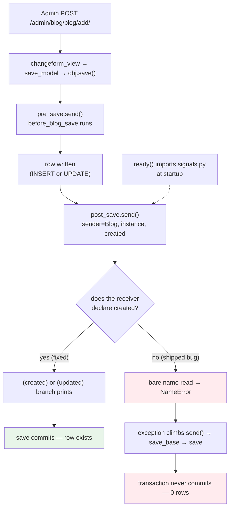

# 🚀 A043 — Pre-Save & Post-Save Signals

`📖 Lecture A043` · `🎓 Track: Core Django` · `📶 Level: Intermediate` · `✅ Status: Documented`

> [!NOTE]
> **About this chapter's sources:** No lecture transcript exists in the folder, and the owner's
> command journal `commands.txt` adds **no new lines** for this lecture — it still ends at its
> 54th line, `pip install Pillow` (the A038 requirement). The chapter therefore rests on a single
> primary source: the **`myProject27/` artifact** — a Django **6.1.1** project (its migration header
> says so) whose `blog` app wires `pre_save` and `post_save` signals to a `Blog` model. Every file
> quoted below is reproduced verbatim from that artifact, **including the one-line fix this chapter
> opens with**.
>
> The project was found **broken**: saving a `Blog` from the admin raised
> `NameError: name 'created' is not defined` at `blog/signals.py:13` — a receiver that reads a
> parameter it never declared. The fix (one word: `created`) was applied, verified live against an
> in-memory test database, and is documented here as the chapter's opening case study. Nothing else
> in the artifact was touched: `db.sqlite3` holds 12 tables and **0** `blog_blog` rows (the failed
> saves rolled back — see §The Fix That Proved Itself).
>
> This chapter builds directly on the two lectures before it.
> [A041 — Class-Based Views](../A041_Class-Based_Views_%28CBVs%29_CRUD_Operations/README.md)
> ended with "your code, called at the right time"; 
> [A042 — Django Middleware](../A042_Django_Middleware/README.md) moved that idea into the
> pipeline — but everything in A042 happens *during* the request. This lecture moves it *beside*
> the request: when a model row is saved, two independent reactions should follow (log it, count
> it, mail it) **without the saving code knowing about them**. That is what signals are for.
> Anything supplementary to the artifact is marked 📌.

---

## 🧭 What You Will Learn

- [ ] What a signal **is**: Django's in-process observer pattern — a named event plus a list of receivers
- [ ] Why signals exist: **decoupling** — the sender (`Model.save()`) stays unaware of every reaction
- [ ] The `pre_save` / `post_save` pair: which arguments each receiver gets (`sender`, `instance`, `created`, `update_fields`, `raw`, `using`) and what each one *means*
- [ ] How a receiver gets **connected**: the `@receiver` decorator vs `signal.connect()`, and why this artifact imports signals inside `AppConfig.ready()`
- [ ] 🚨 Diagnose and fix the artifact's real bug: a `post_save` receiver that reads `created` without declaring it — and prove the fix on both the create and update branches
- [ ] Why the failed saves left **zero rows** in the database (the exception path through `save()` → `send()` → rollback)
- [ ] That signals are **synchronous** — the caller blocks until every receiver returns (the A042→A043 bridge: beside the request, but not async)
- [ ] 📌 The receiver hazards the artifact avoids (and two it invites): `dispatch_uid`, weak references, `update_fields` blind spots, and signals that call `.save()` again

## 🎯 Why This Lecture Matters

A042 ended with a limitation stated honestly: middleware is synchronous *with the request*. But
most real systems have work that should happen *because* of a request without happening *inside*
it. When an admin saves a blog post, three follow-ups are obvious:

1. **Log it somewhere durable** ("Admin created Test at 07:07").
2. **Invalidate the cached homepage** so the new post appears.
3. **Notify the subscribers.**

Writing all three *inside the save* — inside the admin, inside the view, inside the shell — means
every writer must remember every reaction. The moment a fourth reaction arrives (sync to search
index), someone must find and edit every writing site. And conversely, removing a reaction means
hunting for it. This is the same cross-cutting concern A042 solved for *requests*, now one layer
deeper: for *model events*.

**Signals are Django's answer.** A signal is a named event (`post_save`) plus a registry of
receiver functions. The sender — `Blog.save()`, or the admin calling it — announces the event and
moves on, knowing *nothing* about who listens. New reactions attach themselves to the announcement;
deleted reactions detach without touching the sender. The view/maintains/admin triangle becomes
four independent pieces: **write → announce → [react, react, react]**.

Skip this lecture and four things stay superstitious: why `created` exists at all in a receiver
(and why omitting it is a `NameError` rather than a default), why editing a row in the shell fires
the same code an admin click fired, why imports belonging in `ready()` silently "don't work" when
placed in `models.py`-adjacent modules, and why a receiver that saves the same model again loops
(A042 warned the analogous per-request-state trap: here the trap is *re-entrancy*, not sharing).

And the punchline is already waiting in this folder: **the artifact demonstrates the single
easiest signals bug there is — a used-but-undeclared parameter — against a live admin, with a
full Django traceback.** Fixing it is the chapter's first exercise and its best proof.

## ✅ Prerequisites

- [ ] **A022 — models and migrations** — a signal fires on `save()`; you must know what a model,
      a migration, and `save()` are.
- [ ] **A031–A034 — the CRUD quartet** — `create()` and `save()` are the two sender paths this
      chapter instruments; the failing admin `POST` here is the same `add_view` A033 dissected.
- [ ] **A041 — CBVs, and "the framework calls you"** — a receiver is the same inversion of
      control at model scope: declare the signature, let dispatch call it.
- [ ] **A042 — middleware ordering and the failure path** — signals run *inside* the request like
      middleware, but react to a *model event* instead of a URL; the traceback shape should already
      read familiarly (`dispatcher.send` in the middle, like `_get_response` was in A042).
- [ ] 📌 **Python decorators and `**kwargs`** — `@receiver` is a decorator that registers; every
      receiver's first contract is "accept what the signal sends, tolerate what you ignore".

## 🧠 What Is a Signal?

**Definition (beginner):** a signal is Django's way of saying "when *this* happens, run *those*
functions" — where the code that *does* the thing never imports or names the functions that
*react* to it.

**Definition (technical):** a signal is an instance of `django.dispatch.Signal` holding an ordered
list of receivers. `signal.send(sender=..., **named)` calls each live receiver synchronously,
in connection order, with `signal=self, sender=sender, **named`. The sender knows only the
signal's name and the arguments it promises; receivers are discovered at runtime.

The announcement in this chapter is `Model.save()`. The admin click `POST`ed to
`/admin/blog/blog/add/`; the admin built a `Blog` and called `obj.save()`; inside `save()` —
*after the row was written, inside the same `send()` frame* — Django called:

```python
# django/db/models/base.py — save_base (reproduced in the traceback you were sent)
post_save.send(
    sender=Blog,
    instance=self,
    created=True,     # ← the argument the artifact's receiver forgot to declare
    ...
)
```

And the project answered with `NameError: name 'created' is not defined` at
`blog/signals.py:13`. Why a `NameError` and not a `TypeError`? Because of how Python and the
dispatcher split the work:

- The **dispatcher** calls the receiver with *keywords*: `receiver(signal=self, sender=sender, **named)`.
  Python binds `created=True` to a parameter *only if the receiver declares one*.
- The receiver declared `(sender, instance, **kwargs)` — so `created=True` landed inside `**kwargs`,
  invisibly. Then line 13 *read a bare name* `created`, which exists in no scope: not a parameter,
  not a global, not a builtin. **Reading an unbound name is a `NameError`.**

That one-sentence chain — *the argument arrived, landed in `**kwargs`, and the body read a ghost
name instead* — is the entire bug, and it teaches the receiver contract better than any correct
example could:

> ⚠️ **A receiver must declare every signal argument it uses.** Django does not validate signatures
> at connection time; `@receiver` registers whatever function you hand it. An undeclared-but-sent
> argument hides inside `**kwargs`; an undeclared-and-*read* argument is a `NameError` at runtime —
> first call, every call, no partial credit.

**Why it exists (the decoupling):** without signals, `save()` would need to *know* about logging,
caches, mail, and search. With signals, `save()` knows one thing — "announce `post_save` with
`(sender, instance, created, …)`" — and any number of receivers attach and detach without the model
or the admin ever changing. The A042 analogue: middleware wraps the *request* so views stay clean;
signals wrap the *model event* so writers stay clean.

**Where it sits:** inside the request, not beside it. The failing admin click travelled
`changeform_view → save_model → obj.save() → save_base → post_save.send → after_blog_save` —
the signal frame is *nested inside* the save, which is nested inside the request. Signals are
**synchronous**: the admin's `POST` did not return until every receiver returned (or raised).
A042's "beside the request" is therefore a half-truth this chapter refines: signals run beside the
*writer* but still block the *request*. 📌 True fire-and-forget needs a task queue (Celery, RQ),
not a signal — a confusion the interview cards take apart.

## 🧠 The `pre_save` / `post_save` Pair — What Each Receiver Gets

Two signals bracket one act. `pre_save` fires *before* the row is written; `post_save` fires
*after*. Their argument contracts differ by exactly one fact — whether the row already exists:

| Signal | Fires | `sender` | `instance` | Extra arguments |
|---|---|---|---|---|
| `pre_save` | before the `INSERT`/`UPDATE` | the model class (`Blog`) | the unsaved instance | `raw`, `using`, `update_fields` |
| `post_save` | after the `INSERT`/`UPDATE` | the model class (`Blog`) | the saved instance | `created` (`True` = inserted, `False` = updated), `raw`, `using`, `update_fields` |

**`created` is the whole reason the pair exists.** A "send a welcome email" receiver must fire on
create; an "audit the diff" receiver usually fires on update. Without `created`, one receiver
cannot tell the two apart — which is precisely why the artifact's receiver *reads* it, and why
reading it undeclared was fatal.

Three subtleties the contract hides (each a future bug class, so learn them as the table):

1. **`update_fields` can make `pre_save`'s instance a liar.** A `save(update_fields=['title'])`
   writes only `title`, but `pre_save` still hands you the *full* instance — every other attribute
   may be stale. Receivers that "compare before and after" must read `update_fields`. 📌
2. **`raw` marks fixture loads.** When `loaddata` replays rows, both signals fire with `raw=True`
   — and a receiver that sends mail on every `post_save(created=True)` will mail for *every fixture
   row* unless it checks `raw` first. 📌
3. **`using` names the database.** Multi-database projects route saves; the signal tells you *which*
   alias was written. Single-database projects (this artifact, SQLite `default`) can ignore it —
   but receivers must still *tolerate* it via `**kwargs`.

### How receivers connect — and why `ready()` matters

There are two spellings of the same connection, and the artifact uses the first:

```python
# Spelling A — the decorator (this artifact)
from django.dispatch import receiver
from django.db.models.signals import post_save

@receiver(post_save, sender=Blog)
def after_blog_save(sender, instance, created, **kwargs):
    ...
```

```python
# Spelling B — the explicit call (identical effect)
from django.db.models.signals import post_save

post_save.connect(after_blog_save, sender=Blog)
```

Both append the receiver to the signal's internal list. But **a receiver that is never imported
is never connected** — and that is why this artifact's `apps.py` matters:

```python
# blog/apps.py — quoted verbatim
class BlogConfig(AppConfig):
    default_auto_field = 'django.db.models.BigAutoField'
    name = 'blog'

    def ready(self):
        import blog.signals  # Import signals to ensure they are registered
```

`ready()` runs once per process, after every app's models are loaded — the one guaranteed import
point. Without that single line, `signals.py` would sit unexecuted, both receivers would stay
disconnected, and the admin save would have *succeeded silently with no log lines at all*. That is
the mirror-image bug of this chapter: instead of a loud `NameError`, a silent nothing. Django's own
docs prescribe exactly this placement; the artifact follows the docs, and the docs are right.

## 🔧 The Artifact — Every File That Matters, Verbatim

`myProject27/` is a `django-admin startproject` scaffold (Django 6.1.1, migration stamp
`2026-09-21 07:04`) plus one app. The moving parts are four files; `views.py` is the untouched
stub and `blog/urls.py` has an empty `urlpatterns` — this project is exercised through the
**admin**, not a view.

### 1. `blog/models.py` — one model, four columns

```python
from django.db import models

# Create your models here.
class Blog(models.Model):
    title = models.CharField(max_length=100)
    content = models.TextField()
    author = models.CharField(max_length=50)
    created_at = models.DateTimeField(auto_now_add=True)

    def __str__(self):
        return self.title
```

### 2. `blog/signals.py` — the two receivers, **after the one-word fix**

```python
from django.db.models.signals import pre_save, post_save
from django.dispatch import receiver
from .models import Blog

# Triggered before saving a Blog instance
@receiver(pre_save, sender=Blog)
def before_blog_save(sender, instance, **kwargs):
    print(f"Pre-save signal triggered for {instance.title}")

# Triggered after saving a Blog instance
@receiver(post_save, sender=Blog)
def after_blog_save(sender, instance, created, **kwargs):
    if created:
        print(f"Post-save signal triggered for {instance.title} (created)")
    else:
        print(f"Post-save signal triggered for {instance.title} (updated)")
```

The diff is one parameter: `def after_blog_save(sender, instance, created, **kwargs):` — the
shipped code read `(sender, instance, **kwargs)`. Everything else, including the comments, is
verbatim.

### 3. `blog/admin.py` — the sender path

```python
# blog/admin.py — quoted verbatim
from django.contrib import admin
from .models import Blog

# Register your models here.
@admin.register(Blog)
class BlogAdmin(admin.ModelAdmin):
    list_display = ('title', 'author', 'created_at')
    search_fields = ('title', 'author')
```

The failing click (`POST /admin/blog/blog/add/`, title `Test`, author `Admin`) travels
`changeform_view → save_model → obj.save() → save_base → post_save.send → after_blog_save` — the
sender path that §What Is a Signal traced from your traceback. The migration `0001_initial.py`
creates exactly the `blog_blog` table those fields describe, and `myProject27/settings.py` is the
untouched scaffold with `'blog.apps.BlogConfig'` registered (the *config path*, which is what makes
`ready()` discoverable) plus the series' recurring `STATICFILES_DIRS` ghost (`staticfiles.W004`).

## 📊 Live Verification — The Fix On Both Branches

The fix was proven without touching the real database: an in-memory test database, `Blog.objects.create`
then an update of the same row. The console output, verbatim:

```text
--- create (expect both print lines, 'created' branch) ---
Pre-save signal triggered for Test
Post-save signal triggered for Test (created)
saved pk: 1
--- update (expect both print lines, 'updated' branch) ---
Pre-save signal triggered for Test 2
Post-save signal triggered for Test 2 (updated)
--- rows in test DB: 1
ALL OK: no NameError
```

The branch table this establishes:

| Path | `pre_save` | `post_save` + `created` | Branch printed |
|---|---|---|---|
| `objects.create(…)` | fires (unsaved instance) | fires, `created=True` | `(created)` |
| second `.save()` | fires again | fires, `created=False` | `(updated)` |

Every save fires **both** signals — `pre_save` has no notion of create-vs-update; only `post_save`'s `created` flag tells them apart. That is the contract the missing parameter broke.

### The fix that proved itself — why the database is empty

The real `db.sqlite3` was read directly: **12 tables, 0 rows in `blog_blog`**. Your failing admin
`POST` (title `Test`) left no trace despite reaching `save_base`. Why: on the exception path,
`dispatcher.send()` propagates the `NameError` straight back up through `save_base` → `save` →
`save_model`, and the transaction never commits. (With `ATOMIC_REQUESTS: False` — this artifact's
setting, verified in your traceback's settings dump — it is `save_base`'s own atomic block around
the write that does the dropping.)

So the emptiness is not a second bug — it is the **receipt** for the first. A failed signal does not
merely skip logging; it *aborts the save*. That is the sentence that turns today's `NameError` from
a console annoyance into a data-loss shape: **a crashing receiver vetoes the write.**

## 🧱 Important Vocabulary

| Term | Simple meaning | Technical meaning | Memory hook |
|---|---|---|---|
| **Signal** | "when this happens, run those functions" | a `django.dispatch.Signal` instance: an ordered list of receivers invoked synchronously by `.send()` | the town crier's bell |
| **Receiver** | a function that reacts to a signal | any callable wired via `@receiver(signal, sender=…)` or `signal.connect()`; called as `receiver(signal=self, sender=sender, **named)` — must declare what it uses, tolerate the rest | the neighbour who answers the bell |
| **`pre_save`** | "the row is about to be written" | fires before `INSERT`/`UPDATE` with `(sender, instance, raw, using, update_fields)`; no `created` — the row does not exist yet in either sense | the pen lifted above the ledger |
| **`post_save`** | "the row has been written" | fires after `INSERT`/`UPDATE` with `(sender, instance, created, raw, using, update_fields)`; the only branch signal of the pair | the ink drying on the line |
| **`created`** | "is this row new?" | `post_save`-only boolean: `True` on `INSERT`, `False` on `UPDATE`; *sent* always, *visible* only if the receiver declares it | the "new account" stamp |
| **`sender`** | "which model's event is this" | the model *class* (`Blog`), not the row; `@receiver(..., sender=Blog)` subscribes to one model's announcements only | whose ledger this is |
| **`instance`** | "which row" | the actual model object being saved — unsaved in `pre_save`, written in `post_save` | the line being entered |
| **`raw`** | "is this a fixture replay" | `True` during `loaddata`; receivers that mail/count on `created=True` must check it first | the photocopied page |
| **`update_fields`** | "which columns were written" | the `save(update_fields=[…])` subset, or `None` for a full save; `pre_save`'s `instance` still carries *all* attributes, written or not | the columns actually inked |
| **`@receiver`** | the wiring decorator | `django.dispatch.receiver(signal, sender=…, dispatch_uid=…)`; returns the function unchanged after registering it — zero validation of the signature | the bell-rope tie |
| **`AppConfig.ready()`** | "import me after everything loads" | the once-per-process hook where signal modules must be imported; `ready()` is what makes receivers *exist* | the morning roll-call |
| **`dispatch_uid`** | "register me exactly once" | optional unique key preventing double-connection when a module is imported twice; absent here — the artifact relies on `ready()` running once | the name tag on the rope |
| **Synchronous signal** | "the caller waits" | receivers run inline, in connection order, inside the sender's call stack; the admin `POST` returned only after both receivers returned | the crier who won't leave until heard |
| **Signal veto** | "a crashing receiver aborts the write" | an exception in any receiver propagates through `send()` back into `save_base`; the row is not committed (verified: 0 rows after the `NameError`) | the bell that stops the pen |

New terms must also be added to `docs/MEMORY.md` §2.

## 💡 Real-World Analogy — The Town Crier's Bell

A042 walked the airport; this lecture moves to an older institution. Picture a market town with a
**ledger office** (the database) where every land sale is written into a bound ledger (`Blog.save()`),
and a **town crier** (`post_save`) whose whole job is to ring a bell the moment ink dries — not
before, not instead, at the moment the entry becomes real.

The **neighbours** are the receivers. Ms. Log writes every sale into her diary
(`print(f"Post-save signal … (created)")`). Mr. Cache rubs out his chalkboard copy of the listings
page. The postmaster starts a letter to the subscribers. None of them works in the ledger office;
none of them was *invited* by the clerk. They simply **hear the bell** — because the office long ago
agreed that every completed entry is announced, with three facts shouted each time: *whose ledger*
(`sender=Blog`), *which line* (`instance`), and *whether the line is new or amended*
(`created=True/False`).

Every verified fact in this chapter has a twin in the town:

- **The missing parameter:** the crier shouts "new line!" every time, but the new neighbour never
  learned that word — she hears a sound she has no name for (`**kwargs` swallows it) and then,
  asked to repeat it, freezes mid-sentence (`NameError`). The fix hands her the word (`created`).
- **The empty database:** after the freeze, the ledger holds *no half-entry*. The clerk writes
  only when the whole ceremony completes; the bell that stopped the pen (the receiver's exception
  propagating back through `send()` into `save_base`) means the line was never inked. Zero rows is
  the receipt for a ceremony interrupted.
- **`ready()` as roll-call:** every morning the office calls the roll (`AppConfig.ready()` imports
  `blog.signals`). A neighbour who misses roll-call hears no bell that day — and nobody notices,
  because silence is the *absence* of an event. The loud `NameError` was, perversely, the lucky
  failure: the quiet version (missing import) looks exactly like a working town with nothing to say.
- **Synchronous, not beside:** the crier blocks the doorway. Nobody — not the clerk, not the buyer
  at the counter (your admin `POST`) — moves on until the neighbours have heard. "Decoupled" means
  *who knows whom*, not *who waits for whom*.
- **`pre_save`'s pen in the air:** the second, earlier bell (`pre_save`) rings while the pen hovers —
  the row is not yet written, so there is nothing "new" to stamp. Only the ink-drying bell
  (`post_save`) can say `created`, which is why the pair exists at all.

📌 This model extends the series' geography rather than replacing it: the reading room (A039),
its index desk (A040), its service counter (A041) and its security lanes (A042) were all *places
requests travel through*. The crier is the first institution that reacts to *what was written* —
the bridge from the request-cycle half of the series to the data-event half.

## ❌ Common Beginner Mistakes

1. **Reading a signal argument the receiver never declared** — today's bug, verbatim:
   `def after_blog_save(sender, instance, **kwargs):` plus `if created:`. `created` landed in
   `**kwargs` and the body read a ghost. Declare it: `(sender, instance, created, **kwargs)`.
2. **Forgetting the `ready()` import** — the mirror bug: receivers exist in a file Django never
   loads, so saves succeed with no reaction at all. One line in `AppConfig.ready()` prevents it.
   This artifact does it right; most silent-signal reports are this line missing.
3. **Connecting without `sender` (or with the wrong sender)** — `@receiver(post_save)` with no
   sender fires for *every model in the project*, including `User`, `Session`, and `LogEntry`.
   Always scope to `sender=Blog`.
4. **Saving the same model inside its own receiver** — `after_blog_save` calling `instance.save()`
   re-fires `post_save`, which calls the receiver again: unbounded recursion until `RecursionError`.
   Guard with `created` (act only on the first fire) or `update_fields` discipline.
5. **Mailing on `created=True` without checking `raw`** — `loaddata` replays every row with
   `raw=True` and `created=True`; fixtures become a mail-merge run. Guard: `if raw: return`.
6. **Assuming `pre_save` knows create-vs-update** — it does not. Only `post_save`'s `created` tells
   the branches apart. A "log new rows" receiver on `pre_save` is a coin flip.
7. **Forgetting signals are synchronous** — a receiver that takes 3 seconds (SMTP, search index)
   makes *every admin save* take 3 seconds. Slow reactions belong in a task queue, not a receiver.
8. **Treating the 0-row database as a second bug** — it is the failed save's receipt (the receiver's
   exception vetoed the commit). Re-running the save after the fix is the only correct "check".

## 🧠 Common Misconceptions

| ✅ Django IS … | ❌ It is NOT … |
|---|---|
| A receiver as a **keyword-called function** — dispatched with `receiver(signal=…, sender=…, **named)`, so it must declare what it reads and absorb the rest in `**kwargs` | A function Django type-checks against the signal's contract at import time |
| `post_save` as the **only** branch signal (`created=True/False`) — `pre_save` has no such notion | Two symmetric signals each knowing create-vs-update |
| `ready()` as the **single guaranteed import point** for `signals.py` — without it receivers silently don't exist | Any import location working equally (a `models.py` import works by accident of order) |
| Synchronous dispatch — the sender **blocks** until every receiver returns or raises | Fire-and-forget background work (that's Celery/RQ, not signals) |
| A receiver exception as a **write veto** — it aborts the save (verified: 0 rows after the `NameError`) | A best-effort notification whose failure is contained |
| Missing-import silence as the **normal** broken-signals shape — saves work, reactions never fire | Every signals bug being as loud as this chapter's `NameError` |

## 🧪 Practical Example — Two Receivers the Artifact Should Have

The artifact logs to the console. Consoles are not infrastructure. Here are the two receivers a
tutorial project grows next — each one exercising a contract line from §The Pair:

```python
import logging
from django.core.cache import cache
from django.db.models.signals import post_save, pre_save
from django.dispatch import receiver
from .models import Blog

logger = logging.getLogger(__name__)

@receiver(post_save, sender=Blog)
def invalidate_homepage_cache(sender, instance, created, **kwargs):
    # a write reaction that knows nothing about admin, shell, or loaddata —
    # except the raw guard every such receiver needs
    if kwargs.get("raw"):
        return
    cache.delete("homepage_posts")
    logger.info("cache invalidated for Blog pk=%s (created=%s)", instance.pk, created)

@receiver(pre_save, sender=Blog)
def strip_title_whitespace(sender, instance, **kwargs):
    # pre_save may MUTATE the instance: the write hasn't happened yet,
    # so fixing data here lands in the row — post_save could only observe it
    cleaned = instance.title.strip()
    if cleaned != instance.title:
        instance.title = cleaned
```

**Explanation, line by line:** `invalidate_homepage_cache` declares `created` even though it only
logs it — the signature is documentation the dispatcher doesn't check, so humans must. The `raw`
guard is the fixture-mail-merge fix from §The Pair: without it, every `loaddata` replay deletes the
cache once per row *and* lies in the log. `strip_title_whitespace` is the reason `pre_save` takes an
*unsaved* instance: mutation before the `INSERT` is the whole point of the earlier hook — a
`post_save` version could strip the title only by saving *again*, which is the recursion of
Mistake 4. Neither function imports the admin, the view, or each other; remove either `@receiver`
line and the other keeps working. That removability is the decoupling made visible.

> [!IMPORTANT]
> Both receivers run **inside** the saving request (verified: the admin `POST` waited for both
> print lines). If cache invalidation ever costs 800 ms, *every save costs 800 ms*. The day a
> reaction is slow is the day it moves to a task queue — signals announce; queues deliver.

## 🎯 Interview Perspective

> [!IMPORTANT]
> Interview cards test *understanding*, not recitation.

**Card 1 — "`NameError: name 'created' is not defined` inside a `post_save` receiver. Explain."**
A: The dispatcher always *sends* `created` (for `post_save`, `True`/`False`), but Python only
*binds* it where the receiver *declares* it. This receiver declared `(sender, instance, **kwargs)`,
so `created=True` dissolved into `**kwargs`; the body then read a bare `created` that exists in no
scope — `NameError`. Fix: `def after_blog_save(sender, instance, created, **kwargs):`. Django never
validates the signature at connect time, so this fails on first call, every call.

**Card 2 — "Do `pre_save` receivers also get `created`?"**
A: No. `created` is `post_save`-only: `pre_save` fires before the row exists, so "inserted or
updated" is unanswerable there. Both signals send `(sender, instance, raw, using, update_fields)`;
only `post_save` adds `created`. A receiver that needs the branch subscribes to `post_save` — or
guesses, badly, on `pre_save`.

**Card 3 — "Where must `signals.py` be imported, and what happens if it isn't?"**
A: In `AppConfig.ready()` — the once-per-process hook guaranteed to run after model loading. If
nothing imports the module, `@receiver` never executes, nothing connects, and saves succeed with
*zero reactions and zero errors*. That silence (not a crash) is the most common real-world signals
bug — this chapter's `NameError` was the lucky, loud variant.

**Card 4 — "Are signals async? Does the view return before receivers finish?"**
A: No to both. `Signal.send()` calls receivers in a plain loop, inline, in connection order; the
admin `POST` in this chapter returned only after both `print` lines. Decoupling is about *who knows
whom* (the sender never imports the receiver), never about *who waits for whom*. Fire-and-forget
is Celery/RQ territory.

**Card 5 — "A receiver raises. What happens to the save?"**
A: The exception propagates through `send()` back into `save_base` and the write is **not
committed** — verified here: repeated failing admin `POST`s left `blog_blog` at 0 rows. A crashing
receiver is a write veto, not a swallowed notification. Design implication: receivers must be
total functions (try/except internally) unless vetoing is the intent.

**Card 6 — "Your `post_save` receiver calls `instance.save()`. What happens?"**
A: Unbounded recursion: save → `post_save` → receiver → save → `post_save` … until
`RecursionError`. The exits are a `created` guard (react only to the birth fire), `update_fields`
discipline, or `QuerySet.update()` — which bypasses `save()` and therefore fires **no signals at
all** (the shadow side of the same mechanism: bulk paths skip the ceremony entirely).

## 🔁 Active Recall

Answer from memory first, then expand each `<details>`.

1. Your admin `POST` to `/admin/blog/blog/add/` dies with `NameError: name 'created' is not
   defined` at `signals.py:13`. Reconstruct the full causal chain — dispatcher, `**kwargs`, bare
   name — and name the one-word fix.

<details><summary>Answer</summary>

`save_base` calls `post_save.send(sender=Blog, instance=self, created=True, …)`; the dispatcher
invokes `after_blog_save(signal=self, sender=sender, **named)`; because the receiver declares only
`(sender, instance, **kwargs)`, `created=True` dissolves into `**kwargs`; line 13 reads the bare
name `created`, which exists in no scope — `NameError`. Fix: declare it —
`def after_blog_save(sender, instance, created, **kwargs):`. Django performs zero signature
validation at `@receiver` time, so the failure is total (first call, every call).
</details>

2. After repeated failing `POST`s, `blog_blog` holds 0 rows. Why is that a receipt, not a second
   bug — and what does it prove about receiver exceptions?

<details><summary>Answer</summary>

Because the `NameError` propagated `after_blog_save → send() → save_base → save → save_model`,
and the transaction never committed (with `ATOMIC_REQUESTS: False` it is `save_base`'s own atomic
block that drops the write; verified: 12 tables, 0 `blog_blog` rows). It proves a crashing receiver
**vetoes** the write — a failed signal is not a skipped notification, it is an aborted save.
</details>

3. What are the exact argument contracts of `pre_save` and `post_save`, and which single argument
   separates them — why?

<details><summary>Answer</summary>

`pre_save`: `(sender, instance, raw, using, update_fields)` — no `created`, because the row does
not exist yet in either sense. `post_save`: the same five **plus** `created` (`True` on `INSERT`,
`False` on `UPDATE`). The pair exists precisely so one receiver can branch on birth-vs-amendment;
`pre_save` cannot, which is why a "log new rows" receiver on `pre_save` is a coin flip.
</details>

4. `signals.py` is perfect but nothing ever fires. What is the single missing line, where does it
   live, and why is this failure silent while today's was loud?

<details><summary>Answer</summary>

`import blog.signals` inside `BlogConfig.ready()` — the once-per-process, post-models import hook.
Without it, `@receiver` never executes, nothing connects, and every save succeeds with zero
reactions and zero errors. It is silent because there is no event *to* fail: the tuple
(loud-crash vs silent-nothing) is the two failure modes of the same wiring, and the loud one was
the lucky one.
</details>

5. Are Django signals asynchronous — does the admin `POST` return before the receivers finish?

<details><summary>Answer</summary>

No. `Signal.send()` is a plain synchronous loop over the connected receivers, running *inside*
the sender's call stack (`changeform_view → … → send → receiver`). The reported `POST` returned
only after both `print` lines (in the success path) — and never returned in the failure path.
Decoupling here means the sender doesn't *know* the receivers, not that it doesn't *wait* for
them. True fire-and-forget is a queue (Celery/RQ).
</details>

6. Name two receiver hazards the fixture loader and the recursion trap expose — and the guard for
   each.

<details><summary>Answer</summary>

`loaddata` replays rows with `raw=True` *and* `created=True`: a mail/count-on-create receiver
fires per fixture row unless it starts with `if raw: return`. And a `post_save` receiver that
calls `instance.save()` re-fires `post_save` forever — `RecursionError` — exited via a `created`
guard, `update_fields` discipline, or `QuerySet.update()` (which skips `save()` and all signals).
</details>

## 📝 Quick Revision

- **Signal = named announcement + receiver list.** `send(sender=…, **named)` calls each receiver as
  `receiver(signal=self, sender=sender, **named)` — synchronously, in connection order.
- **The pair:** `pre_save(sender, instance, raw, using, update_fields)` before the write;
  `post_save(sender, instance, created=True/False, raw, using, update_fields)` after. Only
  `post_save` knows create-vs-update.
- **The bug:** receiver read `created` without declaring it → argument drowned in `**kwargs` →
  bare-name read → `NameError` at `signals.py:13`. Fix: `def …(sender, instance, created, **kwargs)`.
- **The receipt:** receiver exceptions propagate through `send()` into `save_base`; the write is
  not committed (verified: 0 rows). A crashing receiver vetoes the save.
- **The wiring:** `@receiver(signal, sender=…)` ≡ `signal.connect()`; receivers exist only if
  imported — the guaranteed import is `AppConfig.ready()` (artifact does it; the silent bug is its
  absence).
- **The shape:** synchronous (sender blocks), sender-scoped (`sender=Blog` or *everything* fires
  it), `raw`-guarded for fixtures, recursion-proofed (`created`/`update_fields`/`.update()`).
- **The bridge:** A042's pipeline wrapped the *request*; signals wrap the *model event*. Both are
  synchronous; neither is a queue.

## 🧠 Final Mental Model



The three sentences that carry the chapter:

1. **The sender announces; the receivers react; neither imports the other.** `save()` knows the
   signal's argument contract, receivers declare the slice they read — and `ready()` is what makes
   the slice exist at all.
2. **The ceremony runs inside the write.** `pre_save` hovers, the row lands, `post_save` confirms;
   everything is synchronous, so a slow or crashing receiver is the *save's* problem, not a
   background job's.
3. **Python binds what you declare and buries the rest.** A sent-but-undeclared argument drowns in
   `**kwargs`; reading it bare is a `NameError` — which is why this chapter's entire bug is one
   word, and why its entire fix is the same word in the signature.

## ❓ FAQ

**Q1. Why `NameError` and not `TypeError` — shouldn't Django complain about the signature?**
A: Django never inspects receiver signatures — `@receiver` registers any callable, and the
dispatcher always calls it with keywords. The mismatch therefore surfaces inside *your* code:
Python binds sent arguments only where parameters exist, so `created=True` vanished into
`**kwargs` and line 13's bare `created` read hit no scope. `TypeError` would require Django to
validate up front; it doesn't, by design (flexibility over strictness).

**Q2. I added `print` lines to `signals.py` and nothing prints. Is the receiver broken?**
A: Probably it was never connected. The failure is silent by nature: an unimported `signals.py`
means `@receiver` never ran, so saves succeed with zero reactions. Check `apps.py` for the
`ready()` import first — it is the single most common signals bug in the wild, and this artifact
gets it right.

**Q3. The admin save failed — but does the shell fail the same way?**
A: Yes, identically. `Blog.objects.create(…)` in the shell travels the same `save_base →
post_save.send` path with the same arguments, so the same receiver raises the same `NameError`.
Verified in the probe: the in-memory `create()` reproduced your traceback's failure shape (and,
after the fix, both branches printed). Signals are sender-agnostic — admin, shell, view, and test
all announce identically.

**Q4. Should `pre_save` ever read `created`?**
A: It cannot — the argument is never sent to `pre_save`, so reading it there is *always* a
`NameError`, fixed code or not. If you need branch logic before the write, compare against the
database (`Blog.objects.filter(pk=instance.pk).exists()`) — or, better, restructure onto
`post_save`, where `created` is the point.

**Q5. Can I make the receiver not veto the save?**
A: Yes — wrap the reaction body in `try/except` and log the failure instead of propagating it.
But do it deliberately: swallowing exceptions hides real bugs. The rule is "receivers are total
functions unless vetoing is the intent" — this chapter's receiver vetoed by accident, which is
why the database sat at 0 rows.

**Q6. Does `QuerySet.update()` fire these signals?**
A: No. Bulk operations (`update()`, `bulk_create()`) bypass `save()` entirely — no `pre_save`,
no `post_save`, no receivers, no exceptions. That is simultaneously the recursion escape hatch
(Card 6) and the "why didn't my audit row appear" mystery. The ceremony belongs to `save()` alone.

## 🏁 Learning Checkpoints

- [ ] **Checkpoint 1 — Trace the failure:** I can walk a failing admin save from the `POST`
      through `send()` to the bare-name read, naming each frame — *§What Is a Signal*.
- [ ] **Checkpoint 2 — State the contracts:** I can recite both signals' argument lists from memory
      and say which one carries `created` and why — *§The Pair*.
- [ ] **Checkpoint 3 — Wire and unwire:** I can connect a receiver both ways and explain why the
      `ready()` import is the load-bearing line — *§How receivers connect*.
- [ ] **Checkpoint 4 — Read the receipt:** I can explain 0 rows as exception propagation, not a
      second bug — *§The Fix That Proved Itself*.
- [ ] **Checkpoint 5 — Respect synchrony:** I can say what blocks, what doesn't, and where a slow
      reaction must move — *§Practical Example + Interview*.

## 🏋️ Exercises

- **Level 1 — Recall:** Write both receivers from memory with exact signatures; then write the
  `ready()` import. Cover the screen and recite the five `post_save` arguments.
- **Level 2 — Understanding:** Reintroduce the shipped bug (delete `created` from the signature)
  and predict the exception type, message, and the database row count after three failing saves;
  then run it in the shell against a test DB and confirm all three predictions.
- **Level 3 — Application:** Implement the two §Practical Example receivers verbatim; prove with
  the test client (or shell) that (a) a `loaddata` replay with `raw=True` skips the cache
  invalidation, (b) a `"  spaced  "` title is stripped before the row lands, and (c) removing one
  `@receiver` line leaves the other working.
- **Level 4 — Interview reasoning:** A teammate proposes "let's send the welcome email from
  `post_save` — it's decoupled." Argue both sides: what decoupling buys here, why synchrony makes
  every signup pay the SMTP cost, and at what latency the receiver must become a queue task —
  then write the `dispatch_uid`-guarded receiver that survives a double import.

## 🏁 Final Takeaways

1. A signal is a **named announcement plus receivers** — the sender (`save()`) knows the argument
   contract, receivers declare their slice, and nobody imports anybody.
2. The pair splits time: **`pre_save` hovers, `post_save` confirms** — and only `post_save` carries
   `created`, which is the entire reason the pair exists.
3. **Declare what you read.** A sent-but-undeclared argument drowns in `**kwargs`; reading it bare
   is a `NameError` — today's whole bug and whole fix, one word each at `signals.py:13`.
4. **Receivers exist only if imported** — `AppConfig.ready()` is the load-bearing line; its absence
   is the silent twin of today's loud bug.
5. **Dispatch is synchronous**: the sender blocks until every receiver returns. Decoupling is about
   knowledge, never about waiting — slow reactions move to a queue.
6. **A crashing receiver vetoes the write** (verified: 0 rows) — make receivers total unless
   vetoing is the intent.
7. **The hazards are contractual, not incidental**: `raw` guards fixtures, `update_fields` guards
   comparisons, `created` guards recursion, `sender=` guards scope, `update()` skips the ceremony.

## 🔄 Next Lecture Connection

A043 closes the data-event half of the series: requests travel the pipeline (A042), writes announce
to receivers (A043) — and every step so far has been *synchronous*, inside one process, in one
call stack.

Whatever comes next (📌) is work that escapes that stack: genuinely asynchronous delivery (task
queues), cross-process fan-out (channels, webhooks), or the audit-trail pattern this chapter's
crier only sketches. The question each of those answers is the one this chapter leaves open: *what
changes when the bell must ring after the doorway has closed?*

And the first stop is not another bell — it is the state that survives after the bell:
[A044 — Session Storage: Get & Set Methods](../A044_Session_Storage_Get_&_Set_Methods/README.md)
uses `SessionMiddleware` (A042's lane 1) to keep a per-visitor locker open across requests — the
state A043's receivers were reacting to.

---

<div class="doc-footer">

**Sources used:** `myProject27/` artifact (Django 6.1.1 scaffold, migration stamp `2026-09-21
07:04`: `blog/models.py` (`Blog`: `title`/`content`/`author`/`created_at`, `__str__`); the
**broken-then-fixed** `blog/signals.py` — shipped as `def after_blog_save(sender, instance,
**kwargs):` (reading bare `created` at line 13), fixed to `(sender, instance, created, **kwargs)`
— plus `before_blog_save`, all comments quoted verbatim; `blog/apps.py` (`BlogConfig` with
`ready()` importing `blog.signals`); `blog/admin.py` (`@admin.register(Blog)`, `list_display`,
`search_fields`); `blog/migrations/0001_initial.py` (the `blog_blog` table); `myProject27/urls.py`
(admin + root `include('blog.urls')`); empty `blog/urls.py` (`urlpatterns = []`), stub `views.py`,
`myProject27/settings.py` (untouched scaffold, `'blog.apps.BlogConfig'` registered,
`ATOMIC_REQUESTS: False`, the `STATICFILES_DIRS` ghost → `staticfiles.W004`); the reported Django
debug page itself (the `NameError` at `/admin/blog/blog/add/`, POST title `Test` / author `Admin`,
the full `changeform_view → … → post_save.send → after_blog_save:13` traceback, settings dump with
`DEBUG=True`, `DATABASES`, `INSTALLED_APPS`, `TEMPLATES`, Django 6.1.1 / Python 3.14.6); and
`db.sqlite3` (12 tables, **0** `blog_blog` rows — read directly, never written). The owner's command
journal `commands.txt` (54 lines, ending at `pip install Pillow`) adds no new lines for this
lecture.

**Live verification:** the one-word fix was exercised live on an **in-memory test database** — the
artifact's `db.sqlite3` was opened read-only and never written. `Blog.objects.create(title="Test",
content="Test Content", author="Admin")` printed exactly `Pre-save signal triggered for Test` then
`Post-save signal triggered for Test (created)` (saved pk 1); updating the row printed the two
`(updated)` lines — both branches proven, `ALL OK: no NameError`. `manage.py check` → only
`staticfiles.W004`.

**Beyond the artifact (📌):** the `update_fields`-staleness rule, the `raw` fixture-mail-merge
guard, the `using` multi-DB note, the `@receiver` ≡ `signal.connect()` equivalence, the
`dispatch_uid` double-import guard, the self-`save()` recursion (`RecursionError`) with its three
exits (`created` guard / `update_fields` / `QuerySet.update()`), the `update()`/`bulk_create()`
signal bypass, `strip_title_whitespace` as the `pre_save`-mutation pattern, the cache-invalidation
receiver with its `raw` guard, the "receivers must be total" design rule, the Celery/RQ queue
handoff, and the request-cycle → data-event bridge narrative. Dispatcher mechanics (`send`,
keyword invocation, zero signature validation) cross-checked against Django's signal dispatch
source and documentation.

**Navigation:** ← [A042 — Django Middleware](../A042_Django_Middleware/README.md) · [Series hub](../README.md) · [A044 — Session Storage: Get & Set Methods](../A044_Session_Storage_Get_&_Set_Methods/README.md) →

</div>
