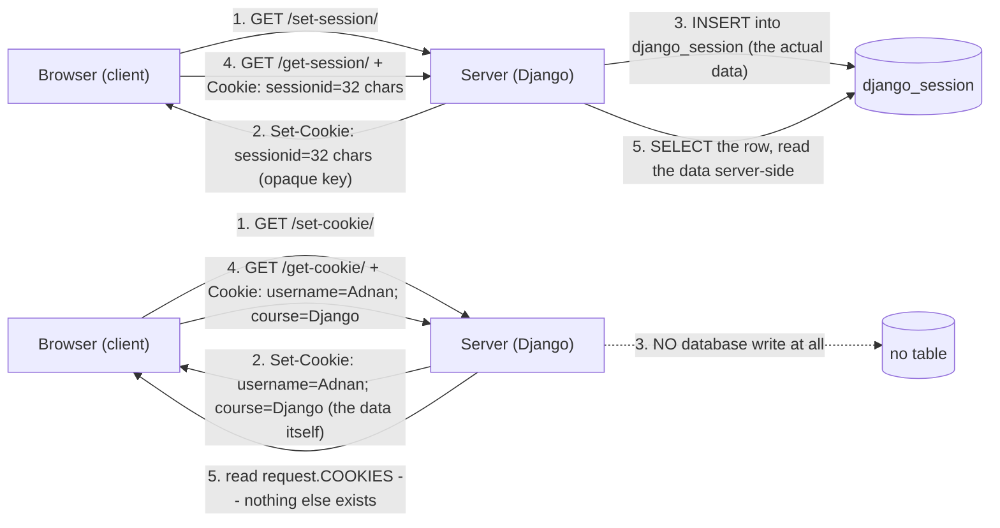
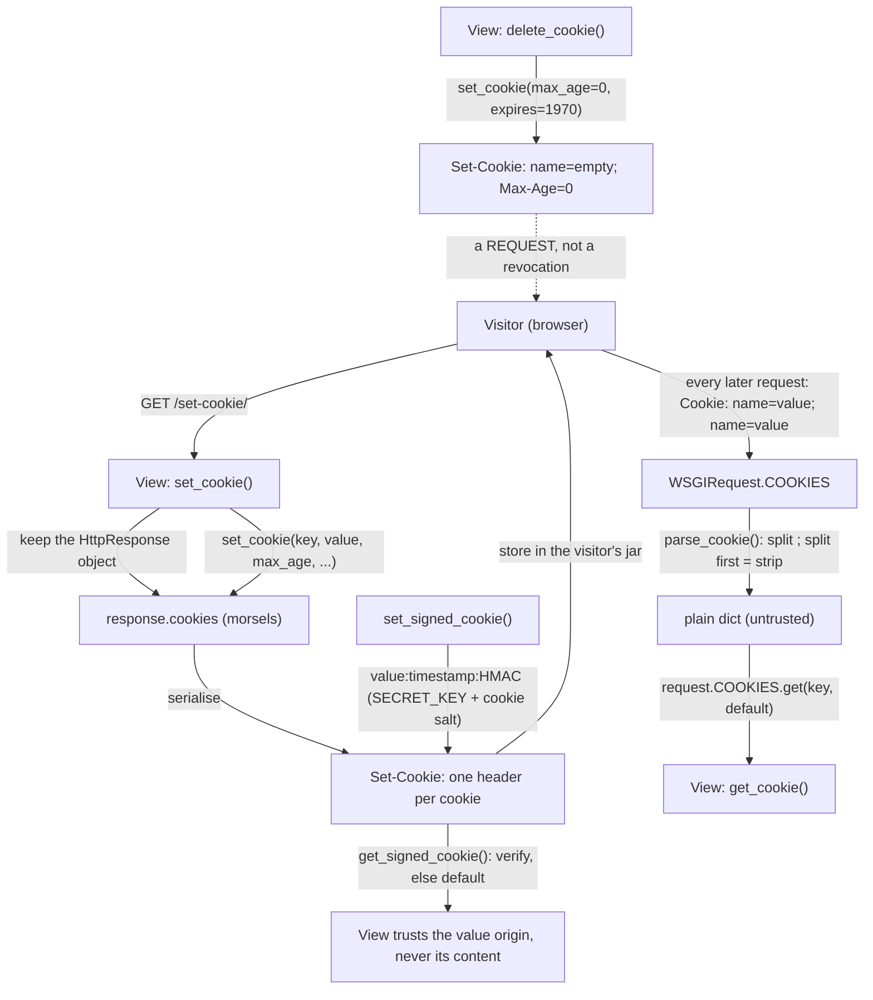

# 🚀 A045 — Set & Read Cookies in Django

`📖 Lecture A045` · `🎓 Track: Core Django` · `📶 Level: Intermediate` · `✅ Status: Documented`

> [!NOTE]
> **About this chapter's sources:** No lecture transcript exists in the folder, and the owner's
> command journal `commands.txt` adds **no new lines** for this lecture — it still ends at its
> 54th line, `pip install Pillow` (the A038 requirement). The chapter therefore rests on a single
> primary source: the **`myProject29/` artifact** — a Django **6.1.1** project whose `blog` app
> implements cookies with three function views: **set** (`response.set_cookie()` twice), **read**
> (`request.COOKIES.get()` twice), and **delete** (`response.delete_cookie()` twice), on
> root-mounted routes. Every file quoted below is reproduced verbatim from that artifact.
>
> The artifact is the series' third data-free project (like A042 and A044): no models, no forms,
> no templates — because **a cookie is not a model**. The `blog` app contributes **no migration at
> all**: its real database holds **11 tables, 18 applied migrations** (from `contenttypes`, `auth`,
> `admin`, `sessions` — the `blog` app appears nowhere in `django_migrations`), **0 `auth_user`
> rows**, and **0 `django_session` rows**. That emptiness is the chapter's first lesson: a cookie
> lives on the *visitor*, not in the database.
>
> This chapter was **verified live**, not just read: every claim below was measured through the
> Django test client on an in-memory test database, plus direct reads of the artifact's
> `db.sqlite3` (opened `mode=ro` — read-only — for every measurement; SHA-256
> `668F8C3F46D20F2C0A78134EBD4935EFE1D87C99A4517351DA99620E9581C51C` and mtime
> `2026-09-22 14:23:50` unchanged before and after) and of Django's own source
> (`django/http/response.py`, `django/http/request.py`, `django/http/cookie.py`,
> `django/core/signing.py`, `django/core/handlers/wsgi.py`, `django/test/client.py`).
> Anything supplementary to the artifact is marked 📌.
>
> This lecture builds on [A044 — Session Storage: Get & Set Methods](../A044_Session_Storage_Get_&_Set_Methods/README.md)
> — whose `sessionid` cookie is this chapter's deliberate counter-example — and on
> [A029 — HTML Forms, POST, CSRF Token & Validation](../A029_HTML_Forms_POST_CSRF_Token_&_Validation/README.md)
> (the CSRF cookie Django writes for you), [A038 — File & Image Upload](../A038_File_&_Image_Upload/README.md)
> (the original cloakroom), and the `request.GET`/plumbing habits of A040/A042. It is the direct
> continuation of A044: *if the session keeps the truth behind the counter, what happens when the
> visitor carries the truth themselves?*


---

## 🧭 What You Will Learn

- [ ] What a **cookie** actually is on the wire: `Set-Cookie` going out, `Cookie` coming back, and the browser as the *storage you do not control*
- [ ] `response.set_cookie(key, value, max_age=None, expires=None, path='/', domain=None, secure=False, httponly=False, samesite=None)` — the exact Django 6.1.1 signature, and what the artifact's two calls do and **do not** set
- [ ] The wire format, verbatim: why `max_age=60*60*24` also mints an `expires` line, and what the artifact's cookies **lack** (`HttpOnly`, `SameSite`, `Secure`) compared with the framework's own `sessionid`
- [ ] `request.COOKIES` — a **plain `dict`**, not a `QueryDict`: case-sensitive keys, always-`str` values, `.get(key, default)` vs `[key]` → `KeyError`
- [ ] `parse_cookie()` — Django's deliberately tolerant header parser, and the surprises it hides (last-wins duplicates, `a=b=c`, flag-only chunks, unquoting, whitespace)
- [ ] The artifact's **guard bug**: `if username and course:` tests *truthiness of values*, not *presence of cookies* — so a genuinely cookie-less visitor sees the Guest defaults and the `else` labelled `"No cookies found"` fires only for **present-but-empty** cookies (verified on four combinations)
- [ ] `response.delete_cookie()` — implemented as `set_cookie(..., max_age=0, expires="Thu, 01 Jan 1970 00:00:00 GMT")`, and why that is *not* the same as `set_cookie(..., max_age=0)`
- [ ] 📌 The test client's blind spot: it stores responses with `self.cookies.update(response.cookies)` and never honours `Max-Age=0`, so it keeps an **empty-value** cookie where a real browser deletes it — measured, and how to tell the two apart
- [ ] 📌 `set_signed_cookie()` / `get_signed_cookie()` — tamper-evident cookies with a `key`/`salt` namespace that makes a session payload and a signed cookie mutually invalid
- [ ] The decision rule between A044's session and this lecture's cookie: **who must be trusted with the truth?**

## 🎯 Why This Lecture Matters

A044 ended on a boundary. The session stores the *truth* behind the counter and hands the visitor
a 32-character key; the visitor never reads anything. That design is right for logins — and wrong
for almost everything else a website wants to remember.

Consider four things a real site wants to remember:

| What | Who should hold it | Why |
|---|---|---|
| "You are user #7" | the **server** (A044's session) | the client must not be able to *change* who it is |
| "Your theme is dark" | either — the **client** is fine | low value, no trust question, saves a DB round trip |
| "You dismissed the banner" | the **client** | pure UI state; the server does not care |
| "Remember me for 30 days" | the **server**, with a *hint* on the client | the truth is server-side; the hint is a signed cookie |

For three of those four, the answer is not "a session". It is a **cookie**: a small `name=value`
pair the server asks the browser to keep, and which the browser then **volunteers back on every
subsequent request** to the matching scope. No database row, no key indirection, no server memory
— and, crucially, **no server control** either. The cookie is stored in a place the visitor owns,
and the visitor can read it, edit it, copy it to another browser, and hand-craft it with `curl`
or the browser's DevTools.

That trade — *convenience for trust* — is the whole lecture. It shows up as three questions the
chapter answers with measurements rather than slogans:

- **Why does nothing in Django hold cookie state?** Because there is nothing to hold: the server
  writes a header and forgets. Reading a cookie is reading what the *client* chose to send.
- **Why is `request.COOKIES` a plain `dict`?** Because it is parsed from a header any client can
  forge, so it gets no `QueryDict` conveniences and no `.getlist()` — and no trust.
- **Why would anyone *sign* a cookie?** Because "the client can edit it" is unacceptable for some
  values, and Django offers exactly one honest middle ground: `set_signed_cookie()` — readable but
  not editable, the same tamper-evident trick A044's session payload uses.

The artifact is small — nine lines of view code — and it contains, in those nine lines, one
genuine bug worth a section of its own: a guard that reads as "were cookies sent?" and behaves as
"are the cookie *values* non-empty?" Four measured combinations prove the difference.

## ✅ Prerequisites

- [ ] **A044 — Session Storage: Get & Set Methods** — this chapter's counter-example: the two-part design (cookie `sessionid` + `django_session`), laziness, `flush()`'s cookie deletion, and "signed, not encrypted"
- [ ] **A029 — HTML Forms, POST, CSRF Token & Validation** — the `` seal; this chapter explains the **cookie** that backs it
- [ ] **A042 — Django Middleware** — where `CsrfViewMiddleware` sits, and why an unsafe verb on a cookie view 403s before the view runs
- [ ] Comfort with `request.GET` / `request.POST` (A040) — `request.COOKIES` is the same idea from a third transport
- [ ] 📌 Django 6.1 installed, `py manage.py check` clean apart from `staticfiles.W004` (the artifact's known ghost shelf)


---

## 🧠 What Is a Cookie?

Start from the problem, because the definition is unremarkable and the *consequence* is not.

**HTTP is stateless.** A012–A044 established this from four different angles: a view is a function
that receives a `request`, returns a `response`, and is destroyed. The protocol keeps no memory
between requests. Everything the server "remembers" is either (a) in a database, keyed by
something, or (b) re-sent by the client on every request. A044 chose (a) and hid the key in a
cookie. This chapter chooses (b) and hides nothing.

A **cookie** is a `name=value` pair which the server asks the browser to store, and which the
browser then attaches to subsequent requests that fall inside the cookie's **scope** (a `domain`
and a `path`). Two headers carry the whole conversation:

```text
server → browser   Set-Cookie: username=Adnan; Max-Age=86400; Path=/
                   (a plant: "keep this, and send it back later")

browser → server   Cookie: username=Adnan; course=Django
                   (a return: "these are all the cookies matching this request")
```

Three properties follow immediately, and they are the chapter:

1. **The browser is the storage.** No table, no row, no server memory. `GET /set-cookie/` writes a
   header and the server's work is done — verified: the request touched no table and set no
   session.
2. **The browser is the retrieval path.** The server learns the value *only* when the client sends
   it back. There is no `Cookie.objects.get(name='username')`.
3. **Therefore the client owns the value.** Anything the visitor can read, the visitor can change;
   anything the visitor can change, the server must not trust. Django's response to that is to
   provide one parser and one signing helper, and nothing else.

This is the exact shape of the contrast with A044:



**What the reader should see:** the top half is A044 — the cookie carries an *address*, and the
data lives behind it in a table. The bottom half is this lecture — the cookie carries the *data*,
and step 3 is a no-op. Same header, opposite architecture. The session is a locker with a ticket;
the cookie is the note itself.

**Three sentences, then, that define the lecture:**

- A session's cookie holds a **key**; this lecture's cookie holds the **value**.
- A session's data is **server-side and trustworthy**; this lecture's cookie is **client-side and untrusted until proven otherwise**.
- A session can be *revoked* by deleting a row; a cookie can only be *asked* to go away.

> [!WARNING]
> **Cookies travel to every matching request — including ones you did not write.** A cookie with
> `Path=/` is attached to *every* request to that host: your views, your static files, your API
> endpoints, and any third-party `<script>` whose requests are same-site. That is why the size
> limit (§Live Verification) and the scope attributes (`path`, `domain`) matter: an oversized or
> over-broad cookie taxes every request the visitor makes.

### The scope rules (📌 — beyond the artifact, but they explain its defaults)

The artifact never passes `path` or `domain`, so Django's defaults apply, and the defaults are the
broadest legal ones. What the browser does with them:

| Attribute | Artifact's value | Browser behaviour |
|---|---|---|
| `Path` | `/` (Django's default) | sent on every path on the host |
| `Domain` | **absent** | host-only: sent to `example.com` but **not** to `api.example.com` |
| `Secure` | **absent** | sent over plain `http://` too |
| `HttpOnly` | **absent** | **readable by JavaScript** (`document.cookie`) |
| `SameSite` | **absent** | browser default (`Lax` in Chrome/Firefox/Edge since ~2020) |
| `Max-Age` / `Expires` | `86400` — 1 day | dropped after 24 hours; a *session cookie* (no lifetime) dies at browser close |

📌 Two notes worth knowing before the artifact is dissected:

- **`Domain` is opt-in, not inherited.** Omitting `domain` produces a *host-only* cookie, which is
  the safer default; passing `domain=".example.com"` deliberately widens it to every subdomain.
- **Absent `SameSite` is not the same as `SameSite=None`.** Omitting the attribute lets the browser
  apply its own default (now `Lax`); writing `SameSite=None` *forces* cross-site sending, and
  browsers require `Secure` alongside it. Django's `delete_cookie()` encodes this rule explicitly
  (§Delete).

### How Django sees the request side

One line of source settles it (`django/core/handlers/wsgi.py`):

```python
from django.http import HttpRequest, QueryDict, parse_cookie
...
@property
def COOKIES(self):
    raw_cookie = get_str_from_wsgi(self.environ, "HTTP_COOKIE", "")
    return parse_cookie(raw_cookie)
```

`request.COOKIES` is a `cached_property` that takes the raw `Cookie:` header (already unpacked into
the WSGI environ as `HTTP_COOKIE`) and runs it through `parse_cookie()` exactly once. There is no
database lookup, no middleware, no validation — **no layer that could reject a forged cookie**,
because cookies are not meant to be trusted in the first place. Everything that makes a value
trustworthy must be added by the application (or by `set_signed_cookie`, 📌 §Signing Cookies).


---

## 🔧 The Artifact — Every File, Verbatim

Three files matter. The rest of `myProject29/` is the stock 6.1.1 scaffold, quoted only where a
line bears on cookies.

### 1. `blog/views.py` — set, read, delete (verbatim, 23 lines)

```python
from django.shortcuts import render
from django.http import HttpResponse

# Create your views here.
def set_cookie(request):
    response = HttpResponse("Cookie Set Successfully")
    response.set_cookie('username', 'Adnan', max_age=60*60*24)  # Set cookie for 1 day
    response.set_cookie('course', 'Django', max_age=60*60*24)  # Set cookie for 1 day
    return response

def get_cookie(request):
    username = request.COOKIES.get('username', 'Guest')
    course = request.COOKIES.get('course', 'No Course')
    if username and course:
        return HttpResponse(f"Username: {username}, Course: {course}")
    else:
        return HttpResponse("No cookies found")

def delete_cookie(request):
    response = HttpResponse("Cookie Deleted Successfully")
    response.delete_cookie('username')
    response.delete_cookie('course')
    return response
```

Read the four load-bearing lines carefully — this is the entire lecture:

| Line | What it is | What it is *not* |
|---|---|---|
| `response.set_cookie('username', 'Adnan', max_age=60*60*24)` | planting a host-only, 1-day, **readable-by-JS** cookie | not `HttpOnly`, not `SameSite`, not `Secure` — Django's defaults are the *minimum* |
| `request.COOKIES.get('username', 'Guest')` | reading the client's claim with a fallback | not a lookup, not validation — the value is whatever the client sent |
| `if username and course:` | a **truthiness** test on two strings | **not** a presence test (the bug, §Read) |
| `response.delete_cookie('username')` | an eviction notice (`Max-Age=0` + epoch `Expires`) | not a server-side revocation — the client may ignore it |

Note also what the file does *not* contain: no `request.method` check anywhere (verified by
search — `views.py` never mentions `request.method`), so every verb reaches the view body; and no
`@csrf_exempt` or `@csrf_protect`, so the framework's CSRF middleware decides what happens to
unsafe verbs (§Live Verification).

And one idiom worth flagging for A012's benefit: `set_cookie` assigns the `HttpResponse` to a
local variable `response` and returns it — the *response object* is what carries cookies, so you
cannot set a cookie after the response has been sent, and you cannot set one on a
`render(request, …)` unless you keep the object it returns.

### 2. `blog/urls.py` — three root-mounted verbs

```python
from django.urls import path
from . import views

urlpatterns = [
    path('set-cookie/', views.set_cookie, name='set_cookie'),
    path('get-cookie/', views.get_cookie, name='get_cookie'),
    path('delete-cookie/', views.delete_cookie, name='delete_cookie'),
]
```

Mounted at the project root and **without `app_name`**, so the three routes are truly
`/set-cookie/`, `/get-cookie/`, `/delete-cookie/` and their names live in the global namespace —
verified: `reverse('set_cookie')` → `'/set-cookie/'`, while `reverse('blog:set_cookie')` raises
`NoReverseMatch: 'blog' is not a registered namespace`. (A030/A040's `app_name` lesson, unchanged;
📌 worth noting that a *global* route name can collide with another app's.)

### 3. `settings.py` — the machinery this lecture stands on

The stock 6.1.1 scaffold with `'blog'` appended to `INSTALLED_APPS`. Two settings blocks matter:

```python
INSTALLED_APPS = [
    'django.contrib.admin',
    'django.contrib.auth',
    'django.contrib.contenttypes',
    'django.contrib.sessions',
    'django.contrib.messages',
    'django.contrib.staticfiles',
    'blog',
]

MIDDLEWARE = [
    'django.middleware.security.SecurityMiddleware',
    'django.contrib.sessions.middleware.SessionMiddleware',
    'django.middleware.common.CommonMiddleware',
    'django.middleware.csrf.CsrfViewMiddleware',
    'django.contrib.auth.middleware.AuthenticationMiddleware',
    'django.contrib.messages.middleware.MessageMiddleware',
    'django.middleware.clickjacking.XFrameOptionsMiddleware',
]
```

No `COOKIE_*` setting appears anywhere — because **Django has no generic cookie configuration**.
Cookies you write yourself are configured per call (`set_cookie(..., httponly=True)`); the only
cookie *settings* in Django are the namespaced families for cookies Django itself manages:

| Setting family | Cookie | Verified default in this artifact |
|---|---|---|
| `SESSION_COOKIE_*` | `sessionid` (A044) | `HTTPONLY=True`, `SAMESITE='Lax'`, `AGE=1209600`, `SECURE=False`, `PATH='/'`, `DOMAIN=None` |
| `CSRF_COOKIE_*` | `csrftoken` | `HTTPONLY=False`, `SAMESITE='Lax'`, `AGE=31449600` (1 year), `SECURE=False`, `PATH='/'` |
| `LANGUAGE_COOKIE_NAME` | `django_language` | present in settings, unused by this artifact |

The table is the chapter's quiet argument: Django protects **its own** cookies carefully
(`HttpOnly` + `SameSite` on the session; a one-year `SameSite=Lax` CSRF token) and leaves **your**
cookies to you. The artifact is the "before" picture.


---

## 🧠 Set — `response.set_cookie()` and the Artifact's Two Lines

`set_cookie()` is a method on the **response**, not the request, and that single fact explains most
of the confusion around cookies. The request is already history by the time your view runs; the
response is the one thing still in your hands and still on its way out. So Django hangs the
`Set-Cookie` headers on the response object, and the cookie is "set" when the response is finally
serialised (`HttpResponseBase` keeps a `SimpleCookie` named `self.cookies`; each `Set-Cookie` line
is emitted from one morsel in it).

The exact Django 6.1.1 signature — read from the installed source, not from memory:

```python
def set_cookie(
    self,
    key,
    value="",
    max_age=None,
    expires=None,
    path="/",
    domain=None,
    secure=False,
    httponly=False,
    samesite=None,
):
```

Every parameter is a **policy decision**, and every default is the permissive choice. The
artifact accepts all of them and overrides exactly one:

```python
response.set_cookie('username', 'Adnan', max_age=60*60*24)  # Set cookie for 1 day
```

`60*60*24` = 86 400 seconds = one day. The wire result, captured verbatim from
`GET /set-cookie/`:

```text
Set-Cookie: username=Adnan; expires=Wed, 23 Sep 2026 09:01:58 GMT; Max-Age=86400; Path=/
Set-Cookie: course=Django; expires=Wed, 23 Sep 2026 09:01:58 GMT; Max-Age=86400; Path=/
```

**Two headers, one per cookie** — Django emits a separate `Set-Cookie` line for each morsel; a
response can carry dozens. Three details are visible in those two lines:

1. **`max_age` produced *two* attributes.** Passing only `max_age=86400` yielded `Max-Age=86400`
   **and** an `expires=` line. That is deliberate, and the source comment says why — *"IE requires
   expires, so set it if hasn't been already"* — Django computes `expires = http_date(time.time()
   + max_age)`. So `max_age` is the modern spelling and `expires` is the compatibility twin; you
   pass one, the client receives both.
2. **`Path=/` appeared without being asked for.** `path="/"` is the default parameter, and the
   `if path is not None:` branch always writes it. Pass `path=None` and the attribute disappears
   entirely (verified).
3. **`HttpOnly`, `SameSite` and `Secure` are *absent*.** Not "false" — absent. The source only
   writes an attribute when the argument is truthy (`if httponly: self.cookies[key]["httponly"] =
   True`), so the header has no such token and the browser falls back to its own defaults. Verified
   by inspecting the parsed morsel: every omitted attribute reads back as the empty string.

```text
morsel attrs: {'expires': 'Wed, 23 Sep 2026 09:01:58 GMT', 'path': '/', 'comment': '',
               'domain': '', 'max-age': 86400, 'secure': '', 'httponly': '',
               'version': '', 'samesite': '', 'partitioned': ''}
```

That dict is the honest picture of the artifact's cookies: a value, one day, and the root path.
**Readable by any JavaScript on the page, sent over plain HTTP, and attached to every request on
the host.**


### The API surface, measured (every case below was run)

| Call | Resulting `Set-Cookie` |
|---|---|
| `set_cookie("k", "v")` | `k=v; Path=/` |
| `set_cookie("k", "v", max_age=86400)` | `k=v; expires=Wed, 23 Sep …; Max-Age=86400; Path=/` |
| `set_cookie("k", "v", max_age=timedelta(days=1))` | identical to the above — a `timedelta` is converted with `.total_seconds()` |
| `set_cookie("k", "v", expires=datetime.now(UTC) + timedelta(hours=1))` | `k=v; expires=…; Max-Age=3600; Path=/` — an aware `datetime` **computes** `max_age` for you |
| `set_cookie("k", "v", secure=True)` | `k=v; Path=/; Secure` |
| `set_cookie("k", "v", httponly=True)` | `k=v; HttpOnly; Path=/` |
| `set_cookie("k", "v", samesite="Lax")` | `k=v; Path=/; SameSite=Lax` |
| `set_cookie("k", "v", samesite="none")` | `k=v; Path=/; SameSite=none` — the string is stored **as given** (validated case-insensitively, not normalised) |
| `set_cookie("k", "v", path=None)` | `k=v` — no `Path` token at all |
| `set_cookie("k", "v", domain=".example.com")` | `k=v; Domain=.example.com; Path=/` |
| all of them at once | `k=v; Domain=.example.com; expires=…; HttpOnly; Max-Age=600; Path=/app/; SameSite=Lax; Secure` |

The ordering above is Django's own emission order (domain, expires, httponly, max-age, path,
samesite, secure) — attribute order is meaningless to browsers, but it is stable, which makes
header assertions in tests readable.

Three measured failure modes:

```text
set_cookie("k", "v", expires=<datetime>, max_age=60)  → ValueError: 'expires' and 'max_age' can't be used together.
set_cookie("k", "v", samesite="bogus")                → ValueError: samesite must be "lax", "none", or "strict".
set_cookie("k", "v") on an existing "k"               → 1 morsel, value replaced (last write wins)
```

The first is raised only when `expires` is a `datetime` — pass `expires` as a *pre-formatted
string* and Django stores it verbatim with no validation (verified: `expires="not a date"` is
accepted). Django validates the shape of your arguments, never the truth of them.

> [!TIP]
> **`set_cookie()` returns `None`.** Verified. If you want the response *and* the cookie in one
> expression, you cannot chain — `return response.set_cookie(...)` returns `None`, and Django then
> complains about the missing response. Always keep the response object:

```python
response = HttpResponse("Cookie Set Successfully")   # the artifact's pattern — correct
response.set_cookie('username', 'Adnan', max_age=60*60*24)
return response
```

📌 **Values are opaque strings, and Python's `http.cookies` quotes only when it must.** A value
containing a comma, semicolon, space or quote is emitted inside double quotes — `set_cookie("k",
'a; b, c "d"')` produced a quoted header, and `parse_cookie()` unquoted it back to the original
string. So the round trip is lossless *for sane values*; exotic ones (non-latin-1 bytes) raise at
header-serialisation time rather than silently mangling.

### Two cookies, or one cookie with two keys?

The artifact writes **two separate cookies**. The alternative — one cookie holding
`username=Adnan&course=Django` — is what most frameworks call a session, and it is exactly what
A044's `signed_cookies` engine does. The trade:

| Approach | Pros | Cons |
|---|---|---|
| two cookies (the artifact) | each has its own lifetime (`max_age`); deleting one leaves the other; separate `path`/`domain` possible | two headers on every response; two tokens on every request; each counts against the browser's per-domain cookie **count** limit |
| one cookie, delimited value | one header, one token | you must parse it yourself, and the browser's ~4 KB ceiling now spans **all** your values (📌) |

📌 Django has no opinion and no helper for "a bag of values in one unsigned cookie" —
deliberately, because the correct spellings are either *separate cookies* (the artifact) or *a
session* (A044).

### What the browser does with all this

Nothing the server can see. This is the part that surprises people coming from a database mindset:
after `GET /set-cookie/` returns, the server's knowledge of `username=Adnan` **ceases to exist**.
Verified on both sides:

```text
GET /set-cookie/  → 200 'Cookie Set Successfully'
                    Set-Cookie: username=Adnan; expires=…; Max-Age=86400; Path=/
                    Set-Cookie: course=Django;  expires=…; Max-Age=86400; Path=/
                    sessionid cookie set?   False    ← no session was created
                    tables written?         0        ← nothing anywhere
```

The proof is that a **different client** — one that never received the header — gets nothing:

```text
GET /get-cookie/  (the client that ran set-cookie)  → 'Username: Adnan, Course: Django'
GET /get-cookie/  (a fresh client, no cookies)      → 'Username: Guest, Course: No Course'
```

Same URL, same code, same database, two different answers — decided entirely by what the client
chose to send. That is not a curiosity; it is the definition of the mechanism.


---

## 🧠 Read — `request.COOKIES` and the Too-Eager Guard

Reading is one line per value:

```python
username = request.COOKIES.get('username', 'Guest')
course = request.COOKIES.get('course', 'No Course')
```

`request.COOKIES` is a **plain `dict`** (verified: `type(...).__name__ == 'dict'`). That is not an
oversight — it is the honest type for untrusted, header-derived data. Compare the three
request-side containers you have now met:

| Container | Type | Shape | Trust |
|---|---|---|---|
| `request.GET` | `QueryDict` | can repeat a key (`?t=a&t=b` → `.getlist('t')`) | client-supplied, but safe to *display* (A040) |
| `request.POST` | `QueryDict` | same, plus `FILES` (A029) | client-supplied, needs a CSRF gate |
| `request.COOKIES` | **`dict`** | one value per key, **last duplicate wins** | client-supplied, **nothing gates it** |

Measured properties of that dict:

```text
request.COOKIES                      → {'username': 'Adnan', 'course': 'Django'}
type(request.COOKIES).__name__       → 'dict'
request.COOKIES['username']          → 'Adnan'          (a str, always — never an int or bool)
request.COOKIES.get('nope', 'Guest') → 'Guest'
request.COOKIES['nope']              → KeyError: 'nope'
'Username' in request.COOKIES        → False            (keys are case-sensitive)
```

Two habits to keep: **always `.get()` with a default** (a `KeyError` in a view is a 500 for a
visitor who merely cleared their cookies), and **never assume a type** (`'1'` is a string; casting
is your job — `if request.COOKIES.get('count') == '1'`).

### The parser underneath: `parse_cookie()`

Django does not use `http.cookies.SimpleCookie` to read the request header — it uses seven lines of
its own (`django/http/cookie.py`), and those seven lines explain every surprise you will meet:

```python
def parse_cookie(cookie):
    """Return a dictionary parsed from a `Cookie:` header string."""
    cookiedict = {}
    for chunk in cookie.split(";"):
        if "=" in chunk:
            key, val = chunk.split("=", 1)
        else:
            # Assume an empty name per
            # https://bugzilla.mozilla.org/show_bug.cgi?id=169091
            key, val = "", chunk
        key, val = key.strip(), val.strip()
        if key or val:
            # unquote using Python's algorithm.
            cookiedict[key] = cookies._unquote(val)
    return cookiedict
```

It is a **tolerant** parser: it never raises, and it prefers keeping data over rejecting input.
Every branch was exercised:

| Raw `Cookie:` header | `parse_cookie()` result | Why |
|---|---|---|
| `username=Adnan; course=Django` | `{'username': 'Adnan', 'course': 'Django'}` | the normal case |
| `a=1;a=2` | `{'a': '2'}` | a `dict` cannot hold two values — **the last one wins** |
| `flag` | `{'': 'flag'}` | no `=`: the whole chunk becomes the value of the empty key (a 2001 Mozilla bug workaround — a cookie may legitimately have no name) |
| `a=b=c` | `{'a': 'b=c'}` | `split("=", 1)` — only the **first** `=` separates; values containing `=` survive (exactly why A044's session payload is safe in a cookie) |
| `a="x y"` | `{'a': 'x y'}` | quoted values are unquoted on the way in |
| `username=; course=` | `{'username': '', 'course': ''}` | a key **is** present, its value is the **empty string** |
| ` a = 1 ;  b = 2 ` | `{'a': '1', 'b': '2'}` | both key and value are `.strip()`ed |
| `` (empty header) | `{}` | the normal no-cookie case |

Hold on to the sixth row: **present-but-empty** is a state that "no cookie was sent" does not
share, and it is the hinge of the artifact's bug.


### The bug: truthiness is not presence

```python
    if username and course:
        return HttpResponse(f"Username: {username}, Course: {course}")
    else:
        return HttpResponse("No cookies found")
```

Read the guard in plain English: *"if both values are truthy"*. Both values arrived via
`.get(key, default)` with the defaults `'Guest'` and `'No Course'` — **non-empty strings, therefore
always truthy**. The `else` branch can therefore never be reached by the *absence* of a cookie,
which is exactly the case its message names.

Measured — every combination, with the view called directly so nothing is hidden:

| `request.COOKIES` | Branch taken | Response body |
|---|---|---|
| `{}` (a genuinely cookie-less visitor) | `if` | `Username: Guest, Course: No Course` |
| `{'username': 'Adnan'}` (only one cookie sent) | `if` | `Username: Adnan, Course: No Course` |
| `{'username': 'Adnan', 'course': 'Django'}` | `if` | `Username: Adnan, Course: Django` |
| `{'username': '', 'course': ''}` | **`else`** | **`No cookies found`** |
| `{'username': '', 'course': 'Django'}` | **`else`** | **`No cookies found`** |
| `{'username': '0', 'course': '0'}` | `if` | `Username: 0, Course: 0` |

So the message `"No cookies found"` appears exactly when cookies **were** found — with empty
values — and never appears for the visitor who actually sent none. The guard conflates two
different questions:

```text
"were cookies sent?"          → 'username' in request.COOKIES   (presence)
"are the values non-empty?"   → username and course             (truthiness)  ← the artifact
```

The fix is one word of intent, and its behaviour is measurably different (verified side by side):

```python
def fixed(request):
    if 'username' in request.COOKIES and 'course' in request.COOKIES:
        return HttpResponse(f"Username: {request.COOKIES['username']}, Course: {request.COOKIES['course']}")
    return HttpResponse("No cookies found")
```

| `request.COOKIES` | artifact's guard | presence-check guard |
|---|---|---|
| `{}` | `Username: Guest, Course: No Course` | **`No cookies found`** |
| `{'username': 'Adnan', 'course': 'Django'}` | `Username: Adnan, Course: Django` | `Username: Adnan, Course: Django` |
| `{'username': '', 'course': ''}` | `No cookies found` | `Username: , Course: ` |

Neither version is wrong about *what it does*; only one is right about *what it says*. This is
`docs/MEMORY.md` §12's recurring lesson in miniature: **the bug is not a crash, it is a mislabel**
— the shape A040's `catagory` typo took, one layer up.

> [!NOTE]
> **Why the `else` branch is not *quite* dead code.** The `''`-valued case is not hypothetical: it
> is precisely the state a **deleted** cookie leaves behind in Django's test client
> (§Live Verification), and a state a hand-crafted request reaches in one line. So the branch is
> reachable — just never for the reason its message claims.

📌 **The typed-helper habit.** A preference cookie is better read once and handed to the template
as a context value, with absence and emptiness collapsed — because the visitor experience is the
same either way:

```python
theme = request.COOKIES.get('theme') or 'light'   # '' and absent both fall back
```

📌 **And never let a cookie decide anything privileged.** `request.COOKIES.get('is_admin', 'no')`
is a security hole wearing a lock icon: the client chose the value. Compare with A044 — the session
keeps the user id server-side precisely so this line cannot exist.


---

## 🧠 Delete — `delete_cookie()` and the Epoch Trick

The third view is two lines:

```python
response.delete_cookie('username')
response.delete_cookie('course')
```

"They expire the cookie," is the usual explanation, and it is not wrong — it is just too vague to
be useful. The precise mechanism is worth reading from the source, because it explains what the
client receives and why the wire format looks so strange:

```python
def delete_cookie(self, key, path="/", domain=None, samesite=None):
    # Browsers can ignore the Set-Cookie header if the cookie doesn't use
    # the secure flag and:
    # - the cookie name starts with "__Host-" or "__Secure-", or
    # - the samesite is "none".
    secure = key.startswith(("__Secure-", "__Host-")) or (
        samesite and samesite.lower() == "none"
    )
    self.set_cookie(
        key,
        max_age=0,
        path=path,
        domain=domain,
        secure=secure,
        expires="Thu, 01 Jan 1970 00:00:00 GMT",
        samesite=samesite,
    )
```

Three conclusions follow from those lines:

1. **`delete_cookie()` is not a delete — it is a `set_cookie()` that says "already expired."** The
   value becomes the empty string, `Max-Age` becomes `0`, and `Expires` becomes the Unix epoch.
   There is no separate "delete" instruction in HTTP; there is only a cookie whose lifetime has
   already run out.
2. **The epoch string is hard-coded** — `"Thu, 01 Jan 1970 00:00:00 GMT"` — rather than computed.
   One less moving part, and a date no clock can be wrong about.
3. **`secure` can be forced on for you.** A cookie named `__Secure-*` or `__Host-*`, or one deleted
   with `samesite="none"`, gets `Secure` added automatically, because browsers would otherwise
   *ignore* the deletion notice (the comment says so).

The artifact's wire result, captured verbatim from `GET /delete-cookie/`:

```text
Response body: 200 'Cookie Deleted Successfully'

Set-Cookie: username=""; expires=Thu, 01 Jan 1970 00:00:00 GMT; Max-Age=0; Path=/
Set-Cookie: course="";   expires=Thu, 01 Jan 1970 00:00:00 GMT; Max-Age=0; Path=/
```

And the full measured API surface:

| Call | Resulting `Set-Cookie` |
|---|---|
| `delete_cookie("username")` | `username=""; expires=Thu, 01 Jan 1970 00:00:00 GMT; Max-Age=0; Path=/` |
| `delete_cookie("x", path="/app/")` | `x=""; expires=…1970…; Max-Age=0; Path=/app/` |
| `delete_cookie("x", domain=".example.com")` | `x=""; Domain=.example.com; expires=…1970…; Max-Age=0; Path=/` |
| `delete_cookie("x", samesite="none")` | `x=""; expires=…1970…; Max-Age=0; Path=/; SameSite=none; Secure` ← `Secure` added automatically |
| `delete_cookie("__Secure-x")` | `__Secure-x=""; expires=…1970…; Max-Age=0; Path=/; Secure` ← `Secure` added automatically |
| `delete_cookie("__Host-x")` | `__Host-x=""; expires=…1970…; Max-Age=0; Path=/; Secure` ← `Secure` added automatically |

### Why `path` and `domain` must match

A cookie is identified by the triple `(name, domain, path)` — **not** by name alone. So a deletion
must repeat the scope used when the cookie was planted, or the browser will happily store a
*second* cookie with the same name at a different path and leave the first one alive:

```text
set_cookie("theme", "dark", path="/shop/")     ← lives in the /shop/ jar
delete_cookie("theme")                          ← Path=/ — a DIFFERENT cookie
result: two cookies named "theme"; the /shop/ one still arrives on /shop/ requests
```

The artifact is safe here by accident: it never passes `path`, so the plant and the deletion both
default to `Path=/` and they match. 📌 If you deviate on either side, deviate on both.

### `delete_cookie` vs `set_cookie(..., max_age=0)`

Tempting equivalence, and it is false — measured side by side:

```text
set_cookie("k", "v", max_age=0)   → k=v; expires=Tue, 22 Sep 2026 09:02:52 GMT; Max-Age=0; Path=/
delete_cookie("k")                → k=""; expires=Thu, 01 Jan 1970 00:00:00 GMT; Max-Age=0; Path=/
```

Both carry `Max-Age=0`, so both are "dead on arrival" to a compliant browser — but they differ in
two ways that matter:

- **The value.** `set_cookie(..., max_age=0)` still ships `k=v`; if a client ignores `Max-Age` (or
  a captured `Cookie` header is replayed later), `v` is still there to be read. `delete_cookie()`
  blanks it.
- **The `Expires` date.** With `max_age=0`, Django auto-fills `expires` from
  `http_date(time.time() + 0)` — i.e. *now*, which a slightly-skewed clock can read as the future.
  `delete_cookie()` uses the hard-coded epoch, which is unambiguous.

So: to remove a cookie, call `delete_cookie()`. `max_age=0` is for the rare case where you want to
overwrite the value *and* kill the lifetime.


### The uncomfortable truth: deletion is a *request*

The server does not delete anything, because the server never had anything. It sends a notice and
hopes. Three ways the notice fails to take effect:

1. **The client ignores it.** `curl` with `-b`/`-c`, a hand-rolled HTTP client, or an attacker
   replaying a captured `Cookie:` header — none of them are obliged to honour `Max-Age=0`.
2. **The scope does not match** (§above) — the browser deletes a cookie that never existed and
   keeps the real one.
3. **A copy exists elsewhere.** The visitor exported the cookie, or a second browser profile still
   holds it. There is no row to delete, so there is no revocation.

Verified in the one case that is *least* intuitive — Django's own test client:

```text
jar after GET /set-cookie/     → {'username': 'Adnan', 'course': 'Django'}
jar after GET /delete-cookie/  → {'username': '', 'course': ''}   ← still there, blanked
```

Because the test client persists cookies with a single line — `self.cookies.update(response.cookies)`
(`django/test/client.py:1109-1111`) — it performs a *dictionary update*, and there is no branch
anywhere in that file for `Max-Age=0`. A real browser deliberately deletes the cookie; the test
client stores the deletion notice as an empty-valued cookie. Clearing the jar by hand (what the
browser does) restores the intuitive behaviour, verified:

```text
jar cleared, then GET /get-cookie/  → 'Username: Guest, Course: No Course'
```

That divergence produces the chapter's neatest villain: the *deleted* state (`''` values) is
exactly the state that trips the artifact's truthiness guard, which is why `GET /get-cookie/` in a
test run can print `No cookies found` where a browser prints the Guest defaults. **Both are
"correct" for their client; only the browser's answer is the product behaviour.** 📌 When you write
a test that asserts a cookie was deleted, assert on the *response* (`response.cookies["username"]
["max-age"] == 0`) or on the client's jar explicitly — never on the view's second-guess of it.

> [!WARNING]
> **`delete_cookie()` cannot invalidate a *copy*.** This is where cookies and sessions part company
> for good. A044's `flush()` deletes a database row: after it, the old `sessionid` opens nothing,
> because the data it pointed at no longer exists. A045's `delete_cookie()` only asks the client to
> forget; a stolen copy of `theme=dark` is still `theme=dark`, forever. **Never put anything
> security-relevant in an unsigned cookie you intend to be able to revoke.**


---

## 📌 Signing Cookies — `set_signed_cookie()` / `get_signed_cookie()`

Everything so far assumed the cookie may be a lie. Django's one mitigation is to make a lie
*detectable* without making the value secret — the exact posture A044's session payload uses, and
the exact posture this chapter's vocabulary calls **tamper-evident, not tamper-proof**.

```python
def set_signed_cookie(self, key, value, salt="", **kwargs):
    value = signing.get_cookie_signer(
        salt=signing._cookie_signer_salt(key, salt)
    ).sign(value)
    return self.set_cookie(key, value, **kwargs)
```

Two things happen in those four lines. `get_cookie_signer()` builds a `Signer` whose **key is not
`SECRET_KEY`** but `b"django.http.cookies" + SECRET_KEY` (verified:
`signing._cookie_signer_key(SECRET_KEY)` → `b'django.http.cookiesd…'`), and whose **salt is
namespaced to the cookie name**: `django.http.cookies.v2:{len(salt)}:{salt}{cookie_name}`.

📌 The `{len(salt)}` prefix is worth a second look: it exists so two different `(cookie_name, salt)`
pairs cannot collide by concatenation — `salt="ab", name="c"` and `salt="a", name="bc"` would
otherwise build the same salt string. The length prefix makes the pair unambiguous. Verified:

```text
_cookie_signer_salt("visits")                 → 'django.http.cookies.v2:0:visits'
_cookie_signer_salt("visits", salt="probe")   → 'django.http.cookies.v2:5:probevisits'
_cookie_signer_legacy_salt("visits", "probe") → 'visitsprobe'   ← the pre-6.1 salt, 📌
settings.SIGNED_COOKIE_LEGACY_SALT_FALLBACK   → False           ← legacy acceptance is OFF by default
```

The signed value itself is a three-segment string, and it looks familiar:

```text
Set-Cookie: visits=42:1x8wNy:h_g4XFR6io5zboYgAoMiZ5M9KpNdzECPDMpa1anSuKQ; expires=…; Max-Age=3600; Path=/
                   └┬─┘ └──┬───┘ └──────────────────┬───────────────────┘
                  value  base62           HMAC-SHA256 signature
              (as typed) timestamp         (43 chars, url-safe base64)
```

Same shape as A044's session payload — `value : timestamp : signature` — with **one difference that
matters**:

| | signed cookie | A044's session payload |
|---|---|---|
| segment 1 | the **raw value**, `42` — plaintext as typed | **base64 of the JSON** — `eyJ1c2VybmFtZSI6…` |
| produced by | `Signer.sign()` — no encoding at all | `sign_object()` — serialise, `b64_encode`, then sign |
| still readable? | **yes** — segment 1 *is* the value | **yes** — base64 is not encryption |

Verified: `urlsafe_b64decode("42")` yields garbage (`b'\xe3'`), because there is nothing to decode
— the signed-cookie helper signs the string you passed. So "signed" never means "hidden"; both
formats are transparent to anyone holding them.

### The behaviour, measured

| Call / condition | Result |
|---|---|
| `request.get_signed_cookie("visits", salt="probe")` with a valid cookie | `'42'` — the original `str` |
| valid cookie, `max_age=0` | `SignatureExpired: Signature age 0.98 > 0 seconds` |
| **tampered** cookie, `default="anon"` | `'anon'` — silent fallback |
| **garbage** value, `default="anon"` | `'anon'` |
| **missing** cookie, `default="anon"` | `'anon'` |
| tampered cookie, **no** default | `BadSignature` |
| missing cookie, **no** default | `KeyError` (not `BadSignature` — the key was never there) |
| valid cookie read with the **wrong salt** | `BadSignature` |

The middle rows are the design in action: **a tampered or expired cookie degrades to your default
instead of raising**, exactly like A044's `BadSignature` → `SuspiciousSession` → `{}`. The visitor
loses their preference; they do not get a 500. But note what is *not* there — no log line. 📌 A044's
session warning is free because `SessionStore.decode` writes it; `get_signed_cookie()` with a
default is silent, so if you care about forgery attempts, log them yourself.

### The namespace proof: a session payload is not a signed cookie

Because the two mechanisms use **different keys and different salts**, the formats are not
interchangeable. Verified both ways:

```text
session payload signed for salt 'django.contrib.sessions.SessionStore'
  eyJ1c2VybmFtZSI6IkpvaG4gRG9lIn0:1x8wNy:CFujWTvxkaHpKsFlWQyPGR0u24RrtQt_APjrpc7f8SM

  → get_signed_cookie('visits', salt='probe')             ⇒ BadSignature
  → signing.loads(<signed cookie>, salt='…SessionStore')  ⇒ BadSignature
```

That is not trivia. It is the mechanism that lets Django (and you) run several signing schemes in
the same browser cookie jar under the same `SECRET_KEY` without any of them impersonating another:
the session store, the CSRF token, A037's password-reset token, and your own `set_signed_cookie`
values are all mutually invalid. 📌 Losing `SECRET_KEY` invalidates all of them at once — the A044
warning, restated.


---

## 📊 Live Verification — Every Number, Measured

No claim in this chapter rests on documentation alone. Below is the measurement log.

**Artifact, opened read-only (`mode=ro`) for every read:**
`db.sqlite3` — 131 072 bytes, mtime `2026-09-22 14:23:50`, SHA-256
`668F8C3F46D20F2C0A78134EBD4935EFE1D87C99A4517351DA99620E9581C51C` — **hash and mtime identical
before and after `manage.py check` and all probes**; no `db.sqlite3-journal` / `-wal` companion
files exist. 11 tables: `auth_group`, `auth_group_permissions`, `auth_permission` (24 rows),
`auth_user` (**0**), `auth_user_groups`, `auth_user_user_permissions`, `django_admin_log`,
`django_content_type` (6), `django_migrations` (18), `django_session` (**0**), `sqlite_sequence`.
**No `blog_*` table exists** — the `blog` app contributed no migration; the 18 applied migrations
belong to `contenttypes`, `auth`, `admin`, `sessions`.

**The three views** (Django test client, in-memory test database):

| Request | Status | Body | Cookies emitted |
|---|---|---|---|
| `GET /set-cookie/` | 200 | `Cookie Set Successfully` | `username=Adnan; expires=Wed, 23 Sep 2026 09:01:58 GMT; Max-Age=86400; Path=/` and `course=Django; expires=…; Max-Age=86400; Path=/` (76 and 75 chars) |
| `GET /get-cookie/` (same client) | 200 | `Username: Adnan, Course: Django` | none |
| `GET /get-cookie/` (fresh client) | 200 | `Username: Guest, Course: No Course` | none |
| `GET /delete-cookie/` | 200 | `Cookie Deleted Successfully` | `username=""; expires=Thu, 01 Jan 1970 00:00:00 GMT; Max-Age=0; Path=/` (and `course`) |
| `GET /get-cookie/` after delete | 200 | `No cookies found` ← the test client kept blanked cookies; a **browser** would say `Username: Guest, Course: No Course` | none |

**Request-level facts:** `GET /set-cookie/` set **no** `sessionid` cookie and wrote **no** table
(the session was never touched); `GET /get-cookie/` emitted no cookie, no `Vary`, and no
`Cache-Control` header — contrast A044, where merely *reading* a session added `Vary: Cookie`.
`GET /set-cookie` (no trailing slash) → **301** → `/set-cookie/` (`APPEND_SLASH=True`).

**Routing:** `reverse('set_cookie')` → `/set-cookie/`; `reverse('get_cookie')` → `/get-cookie/`;
`reverse('delete_cookie')` → `/delete-cookie/`; `reverse('blog:set_cookie')` →
`NoReverseMatch: 'blog' is not a registered namespace` (no `app_name`); `resolve('/set-cookie/')`
→ `set_cookie`.

**Methods and CSRF:** `Client().post('/set-cookie/')` → **200** (the test client disables CSRF
checks by default); `Client(enforce_csrf_checks=True).post('/set-cookie/')` → **403**,
`Forbidden (CSRF cookie not set.): /set-cookie/`, with **no** `Set-Cookie` emitted — the view never
ran. `GET` (a safe method) → 200 under both clients. `HEAD` → 200 with an empty body;
`OPTIONS` → 200. Confirmed by search: `blog/views.py` contains **no** `request.method` check.

**`parse_cookie()`:** the eight-row table in §Read — duplicates last-wins, `flag` → `{'': 'flag'}`,
`a=b=c` → `{'a': 'b=c'}`, `a="x y"` → unquoted, `username=; course=` → empty strings,
`' a = 1 ;  b = 2 '` → stripped, `''` → `{}`.

**`request.COOKIES`:** a `dict`; `'Username' in …` → `False`; `.get('nope', 'Guest')` → `'Guest'`;
`['nope']` → `KeyError`; every value a `str`.

**The guard:** six combinations measured (§Read table), including the two that take the `else`
branch (`{'username': '', 'course': ''}` and `{'username': '', 'course': 'Django'}`) and the
cookie-less visitor that does **not** (`Username: Guest, Course: No Course`). The presence-check
rewrite measured alongside, on the same three inputs.


**`set_cookie()`:** signature `(self, key, value='', max_age=None, expires=None, path='/',
domain=None, secure=False, httponly=False, samesite=None)`; **returns `None`** in every case;
eleven attribute combinations measured (§Set table); `expires=<datetime>` + `max_age` →
`ValueError: 'expires' and 'max_age' can't be used together.`; `samesite='bogus'` → `ValueError:
samesite must be "lax", "none", or "strict".`; `expires="not a date"` → accepted verbatim;
re-`set_cookie` on the same key → one morsel, last write wins; the quoted round trip
(`'a; b, c "d"'`) survives `parse_cookie()` intact.

**`delete_cookie()`:** signature `(self, key, path='/', domain=None, samesite=None)`; six measured
forms (§Delete table), including the three that auto-add `Secure`.

**Sizes:** artifact `Set-Cookie` lines are 76 / 75 characters; the framework's session cookie is
**130** characters with a 32-character value
(`sessionid=8dvv00cb9q79gops8taf562aj46z9xhi; expires=Tue, 06 Oct 2026 09:04:16 GMT; HttpOnly;
Max-Age=1209600; Path=/; SameSite=Lax`); the `csrftoken` cookie is `expires=Tue, 21 Sep 2027
09:02:53 GMT; Max-Age=31449600; Path=/; SameSite=Lax` with **no** `HttpOnly` —
`CSRF_COOKIE_HTTPONLY=False`. A 4 000-character value produced a 4 016-character `Set-Cookie` with
**no server-side complaint** — Django enforces no size limit; the ~4 KB ceiling is the browser's
(📌).

**Signed cookies:** value `42:1x8wNy:h_g4XFR6io5zboYgAoMiZ5M9KpNdzECPDMpa1anSuKQ` (3 segments,
segment 1 the literal `42`); round trip → `'42'`; `max_age=0` → `SignatureExpired`;
tampered/garbage/missing with `default=` → `'anon'`; tampered without default → `BadSignature`;
missing without default → `KeyError`; wrong salt → `BadSignature`; `set_signed_cookie()` returns
`None`; key prefix `b'django.http.cookiesd…'`; salts `django.http.cookies.v2:0:visits` and
`…v2:5:probevisits`; legacy salt `visitsprobe`; `SIGNED_COOKIE_LEGACY_SALT_FALLBACK=False`;
cross-namespace: session payload as signed cookie → `BadSignature`, signed cookie as session
payload → `BadSignature`.

**Settings (all defaults, verified):** `SESSION_COOKIE_NAME='sessionid'`,
`SESSION_COOKIE_HTTPONLY=True`, `SESSION_COOKIE_SAMESITE='Lax'`, `SESSION_COOKIE_AGE=1209600`,
`SESSION_COOKIE_SECURE=False`, `SESSION_COOKIE_PATH='/'`, `SESSION_COOKIE_DOMAIN=None`,
`SESSION_ENGINE=…backends.db`; `CSRF_COOKIE_NAME='csrftoken'`, `CSRF_COOKIE_HTTPONLY=False`,
`CSRF_COOKIE_SAMESITE='Lax'`, `CSRF_COOKIE_AGE=31449600`, `CSRF_COOKIE_SECURE=False`,
`CSRF_COOKIE_PATH='/'`, `CSRF_COOKIE_DOMAIN=None`, `CSRF_USE_SESSIONS=False`;
`SECURE_SSL_REDIRECT=False`; `LANGUAGE_COOKIE_NAME='django_language'`. `manage.py check` → only
`staticfiles.W004` (the artifact's known ghost shelf: `STATICFILES_DIRS` names a `static/`
directory that does not exist). Verified runtime: Django 6.1.1 / Python 3.14.6.

**Where the cookie jar itself lies:** `django/test/client.py:1109-1111` —

```python
        # Update persistent cookie data.
        if response.cookies:
            self.cookies.update(response.cookies)
```

— a plain dictionary update, with no `Max-Age` handling anywhere in that file (searched). Hence
the blanked-jar result above.

> [!IMPORTANT]
> **What the test client cannot tell you.** It never ran a browser, so it cannot show you
> `document.cookie`, `SameSite` blocking a cross-site POST, the ~4 KB rejection, or a cookie
> actually disappearing. Treat a green test as *"the header is correct"*, and verify *"the browser
> obeys it"* with DevTools → Application → Cookies. That is A042's "who is the evidence for?"
> question, wearing a different hat.


---

## 🧱 Important Vocabulary

- **Cookie** — a client-stored `name=value` pair · *set by a `Set-Cookie` response header, returned by the client in a `Cookie` request header; identified by the triple `(name, domain, path)`, not by name alone; lifetime in `Max-Age`/`Expires`* · 🧷 the note the visitor keeps in their own pocket
- **`Set-Cookie`** — the planting header · *one header **per cookie**, emitted when the response is serialised; carries the value plus every scope/lifetime/security attribute in one line* · 🧷 the clerk slipping the note into the pocket
- **`Cookie` (request header / `HTTP_COOKIE`)** — the voluntary return · *`name=value` pairs joined with `; `, sent to every request inside the scope; the browser decides the order, and the server cannot request a specific one* · 🧷 emptying the pockets on the way in
- **`request.COOKIES`** — Django's parsed dict · *a **plain `dict`** (not a `QueryDict`) built from `HTTP_COOKIE` by `parse_cookie()` in a `cached_property`; case-sensitive keys, always-`str` values, duplicates last-wins, nothing validates it* · 🧷 the clerk reading the note, trusting nothing
- **`response.set_cookie()`** — the planting API · *`(key, value='', max_age=None, expires=None, path='/', domain=None, secure=False, httponly=False, samesite=None)`, returning **`None`**; every default is the permissive choice, so any security attribute you omit is absent from the header* · 🧷 the form you fill in at the window
- **`response.delete_cookie()`** — the eviction API · *literally `set_cookie(key, max_age=0, expires="Thu, 01 Jan 1970 00:00:00 GMT")`, with the value blanked and `Secure` auto-added for `__Secure-`/`__Host-` names or `samesite="none"`; a **request**, not a revocation* · 🧷 tearing the page out — if the visitor co-operates
- **`max_age` / `expires`** — the two lifetime spellings · *`max_age` in seconds (`int`/`float`/`timedelta`), `expires` as a date string or aware `datetime`; pass `max_age` and Django computes `expires` for you, but a `datetime` `expires` and a `max_age` together raise `ValueError`; **omitting both = a session cookie, deleted at browser close*** · 🧷 the best-before stamp
- **`path` / `domain`** — the cookie's scope · *`path` defaults to `/` (every path on the host); `domain` defaults to **absent** (host-only, no subdomains); together with the name they form the cookie's identity — a deletion must repeat them* · 🧷 which doors the note is checked at
- **`secure`** — HTTPS-only flag · *default `False` in `set_cookie()`; when set, the browser refuses to send the cookie over plain `http://`, and browsers require it alongside `samesite='None'`* · 🧷 "only hand this over in the sealed tunnel"
- **`httponly`** — invisible-to-JavaScript flag · *default `False` in `set_cookie()` — so the artifact's cookies are readable by any script on the page; Django sets `True` on its own `sessionid` (`SESSION_COOKIE_HTTPONLY`) and `False` on `csrftoken` (JS must read that one)* · 🧷 a note you can read but cannot show anyone
- **`samesite`** — the cross-site sending rule · *`'Lax'` / `'Strict'` / `'None'`, validated case-insensitively but stored as given; omitted means the browser's own default (`Lax` in current browsers), which is **not** the same as `None`* · 🧷 how far from home the note may travel
- **`parse_cookie()`** — Django's tolerant header parser · *seven lines: split on `;`, split on the **first** `=`, `.strip()`, store into a `dict`; never raises — a `flag`-only chunk becomes `{'': 'flag'}`* · 🧷 accepting the note however it was folded
- **Cookie epoch deletion** — `Max-Age=0` + `expires=Thu, 01 Jan 1970` · *HTTP has no delete instruction, only a lifetime that has already elapsed; a client may ignore it, and Django's own test client does (it stores a blanked cookie where a browser removes it)* · 🧷 the destruction date printed in advance
- **`set_signed_cookie()` / `get_signed_cookie()`** — tamper-evident cookies · *the value becomes `value:timestamp:HMAC-SHA256`, keyed by `b"django.http.cookies" + SECRET_KEY` and salted `django.http.cookies.v2:{len}:{salt}{name}`; readable but not editable, and **mutually invalid** with a session payload (different key *and* salt)* · 🧷 the wax seal that shows a rewrite
- **`__Secure-` / `__Host-` cookie prefixes** — names the browser polices · *browsers refuse these cookies unless `Secure` is set (`__Host-` also demands `Path=/` and no `Domain`); Django auto-adds `Secure` when deleting them so the eviction notice is not ignored* · 🧷 a label with rules attached
- **Cookie size limit** — the browser's ceiling (📌) · *~4 KB per cookie and a per-domain count cap per browser — Django enforces neither, verified with a 4 000-character value; cookies ride on **every** matching request, so the cost is per-request, not per-store* · 🧷 how much fits in a pocket


## 💡 Real-World Analogy — The Visitor's Own Pocket Notebook

A044's cloakroom had a numbered locker: the visitor leaves the object, keeps a ticket, and the
attendant owns the truth. This lecture's building has a second service — and it is the one every
visitor uses without noticing.

Picture a **visitor who carries a small notebook in their own coat pocket**, and a **clerk at a
window** who is willing to write in it.

- **The clerk writes a line and cannot keep a copy.** `response.set_cookie('username', 'Adnan')` is
  the clerk saying *"write this down"* and sliding the notebook back. That is `Set-Cookie`. The
  clerk's own records (the database) go untouched — verified: `GET /set-cookie/` wrote no row
  anywhere and created no session.
- **The visitor opens the notebook at every window without being asked.** On the next request the
  browser attaches `Cookie: username=Adnan; course=Django` to *every* matching request, whether or
  not the view wants it. That is why the notebook must be small (📌 the ~4 KB pocket) and why its
  contents also travel on requests for images, stylesheets and scripts.
- **The clerk reads, but cannot check.** `request.COOKIES.get('username', 'Guest')` is the clerk
  reading whichever page the visitor turned to. The clerk has **no way to know** whether the
  visitor wrote it or a previous clerk did. That is not a flaw in the clerk — it *is* the mechanism.
- **The clerk's "please delete this" is a request.** `delete_cookie()` scrawls a destruction note —
  *"expired 1 January 1970, maximum age 0"* — and trusts the visitor to tear the page out. A
  visitor with a photocopier (a second browser, an exported cookie, an attacker's replay) keeps the
  page regardless.
- **But the clerk can seal a page.** `set_signed_cookie()` adds a **wax seal** derived from
  `SECRET_KEY`: the visitor can still *read* the page — the value is plaintext, verified — but a
  rewrite breaks the seal and the clerk notices (`BadSignature`). Note what the seal does **not**
  do: it does not lock the notebook, and it does not stop the visitor from *discarding* a page. It
  only proves the page is genuine.
- **And the seals are not interchangeable.** The wax seal on the cloakroom ticket (A044's session)
  and the wax seal on this notebook are pressed with different dies and different keys, so a ticket
  cannot be passed off as a notebook page — verified in both directions (`BadSignature` each way).
- **The locker is still next door.** When the visitor needs the clerk to *know* rather than
  *guess* — "am I really user #7?" — the object goes back in the numbered locker (A044) and the
  notebook holds only a ticket number. The two services are complementary, and the choice between
  them is one question: **does the truth have to survive the visitor?**

📌 This model extends A038's cloakroom and A044's lockers rather than replacing either: the racks
were for *files*, the lockers for *state the visitor must not tamper with*, and the pocket notebook
for *state the visitor is allowed to own*.


## ❌ Common Beginner Mistakes

1. **Reading a cookie with brackets** — `request.COOKIES['username']` raises `KeyError` for the
   visitor who merely cleared their cookies, turning a normal first visit into a 500. The
   artifact's `.get(key, default)` is the pattern: *absence is normal*.
2. **Confusing truthiness with presence** — the artifact's own bug: `if username and course:` tests
   the **values**, not the **keys**, so the "no cookies" branch fires for blanked cookies and never
   for a cookie-less visitor (six combinations measured). If you mean "was it sent?", ask
   `'username' in request.COOKIES`.
3. **Blaming the client for a deleted cookie that is still arriving** — `delete_cookie()` must
   repeat the `path`/`domain` used at plant time, because a cookie's identity is
   `(name, domain, path)`. Delete with the wrong scope and you create a *second* cookie while the
   first lives on.
4. **Trusting a cookie because "only my server can set one"** — false. Any client can send any
   `Cookie:` header; the artifact's `get_cookie` would happily print `Username: attacker, Course:
   pwned` from a hand-written request. Cookies are *inbound user input*, exactly like `request.GET`
   and `request.POST` — cast, validate, and never branch on one for access.
5. **Putting a secret in a cookie and calling it safe** — nothing is encrypted. A raw cookie is
   readable and writable by the visitor; a **signed** cookie is readable by the visitor and only
   *not writable*; and A044's session is readable by anyone with server/DB access. Pick the right
   one of the three (§Interview Card 4).
6. **Assuming `delete_cookie()` revokes** — it asks the client to forget. A copied cookie survives
   everything the server can do. Anything that must be revocable belongs in A044's session.
7. **Setting the cookie on the wrong object** — cookies hang on the **response**. `set_cookie()`
   returns `None` (verified), so `return response.set_cookie(...)` breaks, and
   `HttpResponse("x").set_cookie(...)` throws the response away. Keep the object, then return it.
8. **Forgetting that cookies cost every request** — a 3 KB cookie is 3 KB added to *every* request
   to that host, including images and API calls. Django enforces nothing (verified with a 4 000-char
   value); the browser's ~4 KB ceiling is a cliff, not a budget.
9. **Leaving `HttpOnly` off data-heavy cookies out of habit** — the artifact's cookies are readable
   by any script on the page. If JavaScript does not need the value, pass `httponly=True`; if it
   does (like `csrftoken`), know that you have accepted the XSS-readability trade.
10. **Testing cookie deletion against the test client's jar alone** — the test client stores a
    blanked cookie where a browser removes it (`django/test/client.py:1109-1111`), so the next
    request looks different from production. Assert on the response header or the jar explicitly.

## 🧠 Common Misconceptions

| ✅ Django/HTTP IS … | ❌ It is NOT … |
|---|---|
| A **client-side store the server writes but never owns** — verified: `GET /set-cookie/` wrote no row anywhere | A server-side record of who has which cookie; the server cannot enumerate its cookies at all |
| Read through a **plain `dict`** (`request.COOKIES`) parsed by `parse_cookie()` — last-duplicate-wins, never raises | A `QueryDict` with `.getlist()`, or a validated/typed structure; every value is an unvalidated `str` |
| `set_cookie()`'s defaults **permissive**: `path='/'`, no `secure`, no `httponly`, no `samesite` | Secure-by-default. Django's *own* cookies are hardened (`SESSION_COOKIE_HTTPONLY=True`); *your* cookies are your responsibility |
| `max_age` and `expires` as **two spellings of one clock**, Django filling in the other for IE compatibility | Independent settings you should pass together — a `datetime` `expires` plus `max_age` is a `ValueError` |
| `delete_cookie()` as a **`Set-Cookie` with an elapsed lifetime** (`Max-Age=0` + epoch `Expires`) | A server-side deletion or a revocation; the client may ignore it, and Django's test client does |
| **Signed** cookies: readable, not writable (`value:timestamp:HMAC`, salted per cookie name) | Encrypted cookies. Segment 1 of a signed cookie is the literal value — verified |
| The **session cookie and a signed cookie as mutually invalid** — different key *and* salt namespace | Interchangeable, or "the same thing with extra steps"; verified `BadSignature` in both directions |
| Cookies as the **only** place a browser keeps per-site state that the server sees automatically | The only mechanism at all — `localStorage`/`sessionStorage` exist too, but the **server never receives** them (📌 that is the trade) |


## 🧪 Practical Example — "Remember Me", a Theme, and the Decision Rule

The artifact's three views are the *skeleton*. Here is the shape they grow into, with every
technique this chapter (and A044) taught, used where it belongs.

```python
import logging
from django.conf import settings
from django.http import HttpResponse
from django.shortcuts import redirect, render

logger = logging.getLogger("shop.security")

THEME_COOKIE = "theme"
REMEMBER_COOKIE = "shop_remember"

ONE_YEAR = 60 * 60 * 24 * 365


def choose_theme(request):
    """A real (harmless) preference cookie -- read, then write."""
    theme = request.COOKIES.get(THEME_COOKIE) or "light"      # absent AND blank -> default

    response = redirect("dashboard")
    response.set_cookie(
        THEME_COOKIE,
        theme,
        max_age=ONE_YEAR,
        path="/",
        secure=not settings.DEBUG,      # plain http in dev, HTTPS-only in production
        httponly=True,                  # JS never needs to read the theme
        samesite="Lax",
    )
    return response


def remember_me(request):
    """A hint the client may carry -- signed, because the server must not be fooled."""
    raw = request.get_signed_cookie(
        REMEMBER_COOKIE,
        default=None,                   # tampered OR missing -> None, never an exception
        salt="shop.remember",           # own namespace
        max_age=ONE_YEAR,
    )
    if raw is None:
        return HttpResponse("no remembered user")

    try:
        user_id = int(raw)              # the client's value is still untrusted: cast it
    except (TypeError, ValueError):
        logger.warning("forged remember-cookie payload: %r", raw)
        return HttpResponse("invalid payload")

    # The ONLY trustworthy check is against the database (A036/A044's lesson).
    from django.contrib.auth import get_user_model
    user = get_user_model().objects.filter(pk=user_id, is_active=True).first()
    if user is None:
        logger.warning("remember-cookie named a non-existent user: %r", raw)
        return HttpResponse("no remembered user")
    return HttpResponse(f"welcome back, {user.username}")
```

**Explanation of the load-bearing choices:**

1. **`request.COOKIES.get(THEME_COOKIE) or "light"`** — one expression collapses *absent* and
   *blank-*valued into the same default. This is the artifact's guard bug, avoided rather than
   fixed: there is no `if/else` to mislabel.
2. **`secure=not settings.DEBUG`** — the flags are *deployment-dependent*, not constants. A
   `Secure` cookie in local dev over `http://` never comes back, which is one of the FAQ's
   "everything resets" causes.
3. **`httponly=True` on the theme but the CSRF cookie must stay readable** — the flag is a
   deliberate per-cookie decision, not a house style.
4. **`default=None` in `get_signed_cookie()`** — the measured behaviour: a tampered cookie returns
   the default instead of raising `BadSignature`, so the *view* decides whether that is an error or
   a normal first visit (here: a normal first visit, logged only when a payload survives the seal
   but fails the lookup).
5. **`int(raw)` inside `try`** — a valid signature does **not** mean a valid payload. The cookie was
   signed by *some* code path, which is not the same as being what this view expects. Cast, then
   validate, exactly as with `request.GET`.
6. **The database decides** — `objects.filter(pk=user_id, is_active=True).first()`. The cookie
   provides a *candidate*; the database provides the *truth*. Without this line, editing the
   number in a signed cookie would be the only thing standing between a visitor and someone else's
   account — and signature-breaking is not a security boundary you want to rely on alone.

### And the decision rule, in one table

| The fact | Where it belongs | Why |
|---|---|---|
| "This visitor is user #7, authenticated" | **session** (A044) | must be server-side, must be revocable, must not be forgeable |
| "Which cart is theirs" | **session** | too large for a cookie; privacy-sensitive (📌) |
| "They prefer the dark theme" | **cookie** | tiny, non-sensitive, saves a DB row, and a forged value is harmless |
| "They dismissed the cookie banner" | **cookie** (no signature) | pure UI state; the worst a forgery achieves is a re-shown banner |
| "Remember me for 30 days" | **signed cookie** *hint* + **session/database** as the authority | the client may carry the claim; only the server may confirm it |
| A CSRF token (A029) | **cookie** (`csrftoken`, `HttpOnly=False`) | JavaScript must read it to echo it back in a header |
| An auth token you must be able to revoke | **session, or a DB row** | `delete_cookie()` cannot recall a copy (verified) |

**One-line summary of the whole chapter:** *if the client owning it is acceptable, use a cookie;
if it is not, use a session — and if you want the middle ground, sign it and still verify against
the database.*


## 🎯 Interview Perspective

> [!IMPORTANT]
> Interview cards test *understanding*, not recitation.

**Card 1 — "Where is a cookie stored, and who can read it?"**
A: On the **client**. The server writes a `Set-Cookie` header and keeps nothing — verified: this
lecture's `GET /set-cookie/` created no session and wrote no table row. The browser stores the pair
and attaches it to every request inside the cookie's scope (`path` + `domain`). Readable by anyone
who has the cookie: the visitor via DevTools, any JavaScript on the page **unless** `HttpOnly` is
set (the artifact's cookies are not), and any intermediary on a plain `http://` connection unless
`Secure` is set (the artifact's are not).

**Card 2 — "Is a cookie input or output? Which parts of Django touch one?"**
A: **Both, and that is the point.** Out: `response.set_cookie()` / `delete_cookie()` /
`set_signed_cookie()` write morsels onto the response, serialised into `Set-Cookie` headers.
In: `WSGIRequest.COOKIES` parses `HTTP_COOKIE` with `parse_cookie()` into a plain `dict`; nothing
validates it, and no middleware filters it. So a cookie is *inbound user input* (like
`request.GET`) that your own code previously wrote — a distinction with no security value at all,
which is why Django gives it a `dict` and no conveniences.

**Card 3 — "Why is `request.COOKIES` a plain `dict` when `request.GET` is a `QueryDict`?"**
A: Because a `Cookie:` header is a flat `name=value; name=value` list the browser itself
de-duplicates — there is no `?a=1&a=2` equivalent to preserve, so a `dict` is the honest model.
Verified: `parse_cookie('a=1;a=2')` → `{'a': '2'}`. The lack of `getlist()` is a *feature*: it
removes the temptation to build request-shaped APIs on untrusted data.

**Card 4 — "How do you stop a visitor from forging a cookie?"**
A: Three escalating answers, and only one of them is a real defence. (1) **Nothing** — a raw cookie
is client-owned; verify anything it implies against the database. (2) **`set_signed_cookie()`** —
the value becomes `value:timestamp:HMAC-SHA256` keyed by `b"django.http.cookies" + SECRET_KEY` and
salted `django.http.cookies.v2:{len}:{salt}{name}`; tampering or expiry yields your `default` (or
`BadSignature` if you gave none). But note the limit: the value is still **plaintext** (verified —
segment 1 of a signed cookie is the literal value), so signing provides integrity, never secrecy.
(3) **A session (A044)** — the value never leaves the server, so there is nothing to forge; the
cookie carries only an opaque 32-character key. For "who is this user?", (3) is the only correct
answer.

**Card 5 — "What exactly does `delete_cookie()` do, and what is it unable to do?"**
A: It sends `Set-Cookie: name=""; expires=Thu, 01 Jan 1970 00:00:00 GMT; Max-Age=0; Path=/` — a
cookie whose lifetime has already elapsed, because HTTP has no delete verb (verified exactly, both
matching `A045`'s artifact output). It must repeat the `path`/`domain` used when the cookie was
set or the browser deletes a different cookie and leaves the real one. And it cannot revoke: a
copy of the cookie held by a second browser, or replayed by an attacker, remains valid. Anything
that must be revocable belongs in the session, where `flush()` deletes a row.

**Card 6 — "A colleague's cookie feature 'works in tests but not in the browser'. Where do you look?"**
A: First the usual suspects for *both*, then the test-specific trap. Both: `Secure` on `http://`
(the cookie is never sent back), `SameSite` blocking a cross-site POST, `Path`/`Domain` mismatch
between set and delete, and `max_age` already elapsed. Test-specific: **the test client does not
honour `Max-Age=0`** — verified, `django/test/client.py:1109-1111` does
`self.cookies.update(response.cookies)` with no deletion handling, so a "deleted" cookie lingers in
the jar as an empty string, and the next request behaves differently from a real browser. Assert on
the response header, not on the jar.

**Card 7 — "Cookie or session — give the rule, not a list."**
A: **Who must be trusted with the truth?** If the client owning the value is acceptable
(preference, dismissal flag, theme, language) → cookie, and pay the ~4 KB-per-request tax for the
convenience of zero server state. If the client must *not* own it (identity, permissions, cart
values you price, anything revocable) → session (A044): data server-side, an opaque key on the
client, and a row to delete. The middle ground — "the client may carry it but must not alter it" —
is `set_signed_cookie()`, with the discipline that a valid signature still needs a database check
before it authorises anything.


## 🔁 Active Recall

Answer from memory first, then expand each `<details>`.

1. A fresh visitor requests `GET /get-cookie/` with no cookies at all. What body comes back, and
   which branch of the artifact's guard ran?

<details><summary>Answer</summary>

Body: `200 "Username: Guest, Course: No Course"` — the `.get(key, default)` fallbacks, meaning the
**`if`** branch ran (both `'Guest'` and `'No Course'` are non-empty strings, hence truthy). The
`else` labelled `"No cookies found"` is *not* reached by absence — verified across six
combinations; it fires only for **present-but-empty** values (`{'username': '', 'course': ''}`).
The guard tests truthiness where it reads as presence.
</details>

2. What two headers carry the whole cookie conversation, and what is in each?

<details><summary>Answer</summary>

`Set-Cookie` (response → browser, one header **per cookie**, e.g.
`username=Adnan; expires=Wed, 23 Sep 2026 09:01:58 GMT; Max-Age=86400; Path=/`) and `Cookie`
(browser → server, `name=value` pairs joined with `; `, e.g. `username=Adnan; course=Django`).
The server writes the first and parses the second; nothing is stored server-side — verified:
`GET /set-cookie/` created no session and wrote no table row.
</details>

3. Why did `max_age=60*60*24` produce **two** attributes (`Max-Age=86400` *and* `expires=…`)?

<details><summary>Answer</summary>

Because Django fills in `expires` whenever it computes `max_age` — the source comment is *"IE
requires expires, so set it if hasn't been already"*. `max_age` is the modern spelling; `expires`
is the compatibility twin, computed as `http_date(time.time() + max_age)`. You pass one and the
client receives both. (Passing an **aware `datetime`** `expires` instead makes Django compute
`max_age` for you — but passing both a `datetime` `expires` **and** a `max_age` raises
`ValueError: 'expires' and 'max_age' can't be used together.`)
</details>

4. The artifact's cookies omit `HttpOnly`, `SameSite` and `Secure` entirely. Why — and what does
   that mean in a browser?

<details><summary>Answer</summary>

Because `set_cookie()`'s defaults are `secure=False`, `httponly=False`, `samesite=None`, and the
source writes an attribute **only when the argument is truthy** — so the tokens are *absent*, not
"false" (verified: every omitted attribute reads back as `''` in the parsed morsel). Consequences
in a browser: the value is readable by any JavaScript on the page (no `HttpOnly`), it is sent over
plain `http://` (no `Secure`), and cross-site sending falls to the browser's own default rather
than an explicit policy (no `SameSite`). Django's *own* cookies are hardened the other way —
`SESSION_COOKIE_HTTPONLY=True` on `sessionid` — and that contrast is the chapter's point.
</details>

5. `parse_cookie('a=1;a=2')` and `parse_cookie('a=b=c')` — what do they return, and why does the
   second one matter to A044?

<details><summary>Answer</summary>

`{'a': '2'}` and `{'a': 'b=c'}`. The first because `request.COOKIES` is a `dict` — a duplicate key
is *overwritten*, so last wins. The second because `chunk.split("=", 1)` splits on the **first**
`=` only, so a value may itself contain `=`. That is exactly what keeps A044's base64 session key
(`…eyJ1c2VybmFtZSI6…`) intact when it travels as `sessionid=…` — and why Django does not use
`SimpleCookie` for the request side.
</details>

6. `delete_cookie('username')` — what did the artifact's `GET /delete-cookie/` actually send, and
   what does Django's implementation have to do with it?

<details><summary>Answer</summary>

`Set-Cookie: username=""; expires=Thu, 01 Jan 1970 00:00:00 GMT; Max-Age=0; Path=/` (verified
verbatim, one header per cookie). `delete_cookie()` is implemented as
`set_cookie(key, max_age=0, expires="Thu, 01 Jan 1970 00:00:00 GMT", …)` — HTTP has no delete
instruction, only a cookie whose lifetime has already elapsed. Django also auto-adds `Secure` when
the name starts with `__Secure-`/`__Host-` or when `samesite="none"`, because browsers would
otherwise ignore the deletion notice (verified for all three).
</details>


7. Django's test client reports `No cookies found` after a delete, but a real browser shows the
   Guest defaults. Explain both without blaming the view.

<details><summary>Answer</summary>

The test client persists cookies with `self.cookies.update(response.cookies)`
(`django/test/client.py:1109-1111`) — a plain dictionary update with **no `Max-Age` handling** —
so the deletion notice is stored as a cookie with an **empty value** instead of removing it
(verified: the jar goes `{'username': 'Adnan'}` → `{'username': ''}`). A real browser *removes* the
cookie, so the next request sends no header and `.get()` returns the Guest defaults (verified by
clearing the jar: `Username: Guest, Course: No Course`). The view is behaving consistently; the
`''` values are exactly the state its truthiness guard mislabels as "no cookies found".
</details>

8. What exactly does `set_signed_cookie()` put in the cookie, and what is the visitor allowed to
   do with it?

<details><summary>Answer</summary>

`value:timestamp:HMAC-SHA256` — e.g. `42:1x8wNy:h_g4XFR6io5zboYgAoMiZ5M9KpNdzECPDMpa1anSuKQ` — where
the signature is keyed by `b"django.http.cookies" + SECRET_KEY` and salted
`django.http.cookies.v2:{len(salt)}:{salt}{cookie_name}` (verified derivations). The visitor may
**read** it (segment 1 is the literal value, not even base64 — verified), copy it, and delete it;
they may **not** change it without `get_signed_cookie()` raising `BadSignature` or returning your
`default`. So: integrity without secrecy — tamper-evident, not encrypted.
</details>

9. Why does a session payload fail `get_signed_cookie()`, and a signed cookie fail
   `signing.loads(..., salt='django.contrib.sessions.SessionStore')`?

<details><summary>Answer</summary>

Because the two mechanisms share neither key nor salt. The session store signs with `SECRET_KEY`
plus `key_salt = 'django.contrib.sessions.SessionStore'`; the cookie signer uses
`b"django.http.cookies" + SECRET_KEY` and a per-cookie-name salt. Verified both directions:
`BadSignature` each way. That mutual invalidity is what lets a session, a CSRF token, a
password-reset token (A037) and your own signed cookies share one browser jar and one `SECRET_KEY`
without impersonating each other — and it is why rotating `SECRET_KEY` invalidates all of them at
once.
</details>

10. Unauthenticated `POST /set-cookie/` — what happens, and why does the answer depend on which
    client you use?

<details><summary>Answer</summary>

Under `Client(enforce_csrf_checks=True)` it is a **403** — `Forbidden (CSRF cookie not set.)`, with
**no** `Set-Cookie` emitted, because `CsrfViewMiddleware` judges the unsafe verb before the view
runs (and the view never checks `request.method` — verified by search). Under a default `Client()`
it is a **200**, because the test client **disables CSRF checks by default** — a convenience that
hides production behaviour. A safe method (`GET`) is 200 under both. Lesson: these cookie views are
GET-shaped handlers that happen to answer other verbs in a test, and a real browser would refuse the
POST without a token (A029).
</details>

## 📝 Quick Revision

- **Two headers, one conversation:** `Set-Cookie` out (one per cookie), `Cookie` in (`name=value; …`). The server stores nothing — verified: `GET /set-cookie/` wrote no session and no row.
- **`request.COOKIES` is a plain `dict`** from `parse_cookie()`: case-sensitive, always `str`, duplicates **last-wins**, `a=b=c` → `{'a': 'b=c'}`, `flag` → `{'': 'flag'}`, never raises.
- **`set_cookie()` returns `None`** and its defaults are the permissive ones: `path='/'`, no `secure`, no `httponly`, no `samesite`. An omitted attribute is **absent from the header**, not `False`.
- **`max_age` (seconds) and `expires` (date)** are two spellings of one lifetime; Django fills in the other. Both omitted → a *session cookie* that dies at browser close.
- **`delete_cookie()` is a `set_cookie()` with an elapsed lifetime**: `""` + `Max-Age=0` + `expires=Thu, 01 Jan 1970 00:00:00 GMT`; it must repeat the plant's `path`/`domain`, and it cannot revoke a copy.
- **The artifact's bug is a mislabel, not a crash:** `if username and course:` asks "are the *values* non-empty?" where the message claims "were cookies *sent*?" — the `else` fires only for present-but-empty values (`''`), never for a genuine first visit (six combinations verified).
- **The test client does not delete cookies**: `self.cookies.update(response.cookies)` keeps a blanked cookie where a browser removes it, so post-delete requests diverge from production.
- **`set_signed_cookie()` = integrity without secrecy**: `value:timestamp:HMAC`, keyed `b"django.http.cookies"+SECRET_KEY`, salted per cookie name; the value stays plaintext. Tampered or expired → your `default`, or `BadSignature`/`KeyError` without one.
- **Sessions and signed cookies are namespace-isolated** — different key *and* salt, verified `BadSignature` in both directions.
- **The decision rule:** if the client owning the value is acceptable → cookie; if not → session (A044); if "the client may carry it but not alter it" → signed cookie **plus** a database check.


## 🧠 Final Mental Model

Everything in this chapter collapses into one picture. Read it once, and the API stops being a list
of keyword arguments.



**What the reader should see:** one arrow leaves the server (a header) and one arrow returns (a
header). Nothing in the picture is a table, because nothing is stored. The two bottom branches are
the only things Django adds on top of the raw mechanism — an *eviction notice* that asks rather
than revokes, and a *wax seal* that proves origin but hides nothing.

**The five sentences that carry the model:**

1. **The visitor is the storage.** `Set-Cookie` writes, `Cookie` reads, and the server keeps no
   inventory of what it has written (verified: no row, no session, no table).
2. **Reading a cookie is reading user input.** `request.COOKIES` is a plain `dict` from
   `parse_cookie()` — no validation, no `QueryDict` niceties, no trust. Absent and
   present-but-empty are *different states*, and conflating them is the artifact's one bug.
3. **Every default is the permissive one.** `path='/'`, no `HttpOnly`, no `SameSite`, no `Secure` —
   so security is an explicit, per-call decision, and an omitted flag is an absent token.
4. **Deletion is a request; signing is a seal.** `delete_cookie()` asks the client to forget (and
   may be ignored — even by Django's own test client); `set_signed_cookie()` proves the value was
   not altered while leaving it readable.
5. **The locker is still next door.** The moment the client must *not* own the truth, this
   lecture's mechanism is the wrong tool and A044's session is the right one. A cookie carries what
   the visitor is allowed to own; a session carries what they must not touch.


## ❓ FAQ

**Q1. Where do my cookies live — can I see them in the admin?**

A: No, and there is nowhere to look. Cookies live in the visitor's browser jar. The admin lists
*models*, and a cookie is not a model — verified: this artifact's `blog` app has no model, no
migration and no table, yet the cookie views work perfectly. Django has no `Cookie` model and no
generic cookie settings; the only server-side traces of cookies are the ones Django's *own*
features keep (`django_session` for `sessionid`, a `Session` row when `CSRF_USE_SESSIONS=True`).

**Q2. Why does my cookie disappear when I tick "secure"?**

A: Because `Secure` means "the browser may only send this over HTTPS", and in local development you
are on `http://`. The cookie is *set* (the header is emitted) but the browser never sends it back,
so the next request looks exactly like a first visit. The pattern is `secure=not settings.DEBUG`
(📌 §Practical Example), or run dev over HTTPS.

**Q3. My login "works" but every request forgets me. What are the candidates?**

A: In order of frequency: (1) the cookie is `Secure` and you are on `http://`; (2) you set the
cookie on one response and returned a *different* response object (the cookie rides the response,
and `set_cookie()` returns `None`, so it is easy to lose); (3) `path`/`domain` do not match the URL
being requested; (4) `max_age` is 0 or already elapsed; (5) the browser is refusing the cookie
because of `SameSite` on a cross-site request; (6) you are testing with the test client and
assuming it behaves like a browser (it does not — §Live Verification). And remember the chapter's
rule: **login state belongs in the session**, so if you are debugging an auth *cookie* you have
probably already made the design mistake.

**Q4. Is `request.COOKIES` safe to use in a template?**

A: Safe from injection (Django escapes on output, A013), unsafe as *truth*. Displaying
`{{ request.COOKIES.theme }}` shows whatever the visitor sent; branching on it in a view to grant
access is a vulnerability. The container holds strings the client controls entirely.

**Q5. How big can a cookie be, and can I put JSON in it?**

A: Django places no limit (verified: a 4 000-character value produced a 4 016-character header with
no complaint). Browsers do: roughly 4 KB per cookie, plus a per-domain count cap. You *can* put
JSON in a cookie, but ask why — a delimited or signed single cookie is usually the right shape, and
a session is right when the data grows or must be trusted. And the cost is per-request: every byte
rides on every request to the host.

**Q6. How do I delete a cookie I set with the wrong path?**

A: You cannot delete it with `delete_cookie()` unless you repeat its exact `(name, domain, path)`.
Set a replacement at the *correct* path with `max_age=0`, or overwrite the same name at the same
scope with a new value and lifetime. And accept §Delete's uncomfortable truth: you can ask, never
enforce.

**Q7. What is the difference between `request.COOKIES` and `document.cookie`?**

A: The same jar, seen from two sides. `document.cookie` (JavaScript) reads and writes every cookie
that is **not** `HttpOnly`, and never reveals the `HttpOnly` ones. `request.COOKIES` (server) sees
exactly what the browser chose to *send* for that request. The link between them is the security
argument: anything readable by JavaScript is readable by an attacker who achieves XSS — precisely
why `SESSION_COOKIE_HTTPONLY=True` exists, and why the artifact's cookies (`HttpOnly` absent,
verified) are a deliberate downgrade.

**Q8. Do cookies work across subdomains, ports, or `localhost`?**

A: Cookies are scoped by host and path, **not** by port, and a cookie set without `domain` is
host-only: `example.com` does not send it to `api.example.com`, while a `domain=".example.com"`
cookie does. `localhost` treats `localhost` and `127.0.0.1` as **different hosts**, which is a
classic "it works on my machine — and also does not" trap. Django's `SESSION_COOKIE_DOMAIN` and
`CSRF_COOKIE_DOMAIN` exist for exactly this, and both default to `None` (host-only) here.


## 🏁 Learning Checkpoints

- [ ] **Checkpoint 1 — The two headers:** I can draw the `Set-Cookie` out / `Cookie` in round trip, name what is stored where, and state why the server has no cookie inventory — *§What Is a Cookie?*
- [ ] **Checkpoint 2 — The artifact's defaults:** I can predict the exact `Set-Cookie` line for `set_cookie('k', 'v', max_age=86400)` and name the three attributes it does **not** carry — *§Set*
- [ ] **Checkpoint 3 — The parser's five surprises:** I can state what `parse_cookie()` returns for duplicate keys, a flag-only chunk, an `=`-containing value, quoted values, and blank values — *§Read*
- [ ] **Checkpoint 4 — The mislabel:** I can explain why `if username and course:` never fires for a cookie-less visitor, and rewrite it as a presence check whose behaviour I can predict on all six measured inputs — *§Read*
- [ ] **Checkpoint 5 — Deletion:** I can write the exact deletion header from memory, explain the epoch trick, why the scope must match, and why the test client disagrees with a browser — *§Delete*
- [ ] **Checkpoint 6 — Signing:** I can name the three segments of a signed cookie, the key derivation and the salt namespace, and explain why a session payload is rejected — *📌 Signing Cookies*

## 🏋️ Exercises

- **Level 1 — Recall:** Write the three artifact views from memory; recite the full `set_cookie()`
  signature with its defaults; write the exact `Set-Cookie` line `delete_cookie('x')` produces.
- **Level 2 — Understanding:** Predict, then verify with the test client: (a) what a *fresh* client
  sees at `/get-cookie/`; (b) whether `GET /set-cookie/` creates a `django_session` row; (c) what
  `GET /get-cookie/` returns in the *test client's* jar after `/delete-cookie/` versus after
  `client.cookies.clear()`. Explain each difference in one sentence.
- **Level 3 — Application:** Extend the artifact with a **theme** preference: a view that reads
  `theme` with a `light` default, a view that writes it with `httponly=True`, `samesite='Lax'`, a
  one-year `max_age` and `secure=not settings.DEBUG`, and a delete view. Prove with tests that: the
  header carries all four attributes; a hand-crafted `Cookie: theme=` yields the default; and
  deleting with `path='/shop/'` leaves a `/`-scoped cookie alive (the scope trap).
- **Level 4 — Interview reasoning:** A teammate proposes to store `is_premium=True` in a plain
  cookie "because the session is slow", and to keep the user's auth token in a `signed_cookie`
  "because it is signed". Compose the review: what a plain cookie exposes (verified: no `HttpOnly`,
  plaintext, forgeable — `request.COOKIES.get('is_admin', 'no')`), what signing does and does not
  buy (integrity, not secrecy; the value is still plaintext), why neither survives revocation, and
  where each fact belongs instead (A044's session; a database row; A036's permission check).

## 🏁 Final Takeaways

1. **A cookie is a client-owned store the server writes but never owns.** `Set-Cookie` out, `Cookie`
   in; no table, no row, no inventory — verified: `GET /set-cookie/` created no session and wrote
   nothing.
2. **Reading a cookie is reading user input.** `request.COOKIES` is a plain `dict` produced by the
   tolerant, never-raising `parse_cookie()` — duplicates last-wins, `a=b=c` → `{'a': 'b=c'}`,
   `flag` → `{'': 'flag'}` — and nothing validates it.
3. **`set_cookie()`'s defaults are the permissive ones**, and an omitted attribute is *absent* from
   the header: the artifact ships readable-by-JS, plain-HTTP-eligible, `SameSite`-unspecified
   cookies, where Django's own `sessionid` carries `HttpOnly` + `SameSite=Lax`.
4. **The artifact's one bug is a mislabel, not a crash.** The guard asks "are the values
   non-empty?" while claiming "were cookies sent?" — so a genuine first visit gets the Guest
   defaults and `"No cookies found"` appears only for present-but-empty cookies (six combinations
   measured).
5. **Deletion is an eviction notice.** `delete_cookie()` emits `name=""` with `Max-Age=0` and
   `expires=Thu, 01 Jan 1970 00:00:00 GMT`, must repeat the plant's `(name, domain, path)`, and
   cannot recall a copy — while Django's own test client does not even honour it (verified:
   `django/test/client.py:1109-1111`).
6. **Signing gives integrity, never secrecy.** `set_signed_cookie()` writes
   `value:timestamp:HMAC-SHA256` keyed by `b"django.http.cookies" + SECRET_KEY` and salted per
   cookie name; the value stays plaintext, and a session payload is rejected in both directions.
7. **The decision rule is one question:** must the truth survive the visitor? If yes → A044's
   session; if no → this lecture's cookie; if "carried but not altered" → a signed cookie **plus** a
   database check.


## 🔄 Next Lecture Connection

This chapter's cookie is a **convenience that costs every request**: a few bytes the browser
attaches to everything, readable by the visitor, forgeable unless signed, and impossible to revoke.
It is the right home for preferences and hints — and a poor one for anything the server must be
able to *take back*.

But the chapter kept bumping into a different subject entirely. The artifact's three views answer
`GET`, and every unsafe verb runs into `CsrfViewMiddleware`: an unauthenticated
`POST /set-cookie/` is a hard **403** before the view is reached (verified — and invisible to a
default test client, which switches CSRF checks off). That is the second half of A029's story — the
`` seal is backed by a **cookie** Django writes for you (`csrftoken`, one year,
`SameSite=Lax`, readable by JavaScript on purpose), and that mechanism only makes sense once you
know how cookies travel.

That is where the series goes next (📌):
[A046 — Django Email Setup](../A046_Django_Email_Setup/) — *chapter not yet written; the folder
exists.* It leaves the browser behind for the wire: `EMAIL_BACKEND`, the `MAILERS` block this
artifact still carries inertly from the scaffold, `send_mail()`, and the difference between an email
*printed to a console* and one that actually leaves the machine — the same
"works-in-a-test, nothing-happened-in-production" gap this chapter measured in the test client's
cookie jar.


---

<div class="doc-footer">

**Sources used:** `myProject29/` artifact (Django 6.1.1 scaffold): `blog/views.py` — `set_cookie`
(two `response.set_cookie(..., max_age=60*60*24)` calls), `get_cookie` (two
`request.COOKIES.get(key, default)` calls with `'Guest'`/`'No Course'` fallbacks and the
`if username and course:` guard), `delete_cookie` (two `response.delete_cookie()` calls), all
comments quoted verbatim (23 lines); `blog/urls.py` (`set-cookie/`, `get-cookie/`,
`delete-cookie/` on root-mount, no `app_name`); `myProject29/urls.py` (`include('blog.urls')` at
`''`); `myProject29/settings.py` (the stock 6.1.1 scaffold with `'blog'` added; the seven-layer
`MIDDLEWARE`; every `SESSION_COOKIE_*`/`CSRF_COOKIE_*` value left at its default; the
`STATICFILES_DIRS` ghost → `staticfiles.W004`; the inert `MAILERS` block); stub
`models.py`/`admin.py`/`apps.py`/`tests.py`; `blog/migrations/` holding only `__init__.py`; and
`db.sqlite3` (11 tables, 18 migrations, 0 `django_session` rows, 0 `auth_user` rows, no `blog_*`
table — read directly with `mode=ro`, never written). Installed-Django source read and quoted:
`django/http/response.py` (`set_cookie`, `delete_cookie`, `set_signed_cookie`),
`django/http/request.py` (`get_signed_cookie`), `django/http/cookie.py` (`parse_cookie`),
`django/core/handlers/wsgi.py` (`COOKIES` as a `cached_property` over `HTTP_COOKIE`),
`django/core/signing.py` (`Signer.sign`/`unsign`, `TimestampSigner`, `dumps`/`loads`,
`_cookie_signer_key`, `_cookie_signer_salt`, `_cookie_signer_legacy_salt`, `_unsign_cookie`), and
`django/test/client.py:1109-1111` (the cookie-jar update line). Verified runtime: Django 6.1.1 /
Python 3.14.6. No transcript or `_source/` material exists; the owner's command journal
`commands.txt` (54 lines, ending at `pip install Pillow`) adds no new lines for this lecture.

**Live verification:** every behaviour was exercised via the Django test client and
`RequestFactory` on an **in-memory test database** — the artifact's own `db.sqlite3` was opened
read-only (`mode=ro`) and never written (SHA-256 and mtime identical before and after; no journal
file). Captured per request: bodies (`Cookie Set Successfully` / `Username: Adnan, Course: Django` /
`Username: Guest, Course: No Course` / `Cookie Deleted Successfully` / `No cookies found`); the two
`Set-Cookie` lines with their exact lengths (76 and 75 characters); the two deletion lines; the
absence of a `sessionid` cookie, of `Vary`, and of `Cache-Control`. API surface: the full
`set_cookie()` and `delete_cookie()` signatures, eleven attribute combinations, the two
`ValueError`s, the verbatim-`expires` acceptance, the overwrite and quoting round trips, and the
`None` return values. Parsing: eight `parse_cookie()` inputs (duplicates, flag-only, `a=b=c`,
quoted, blank, whitespace, empty) plus the six-input guard table and the presence-check rewrite.
Deletion: the jar-before/after evidence (`{'username': 'Adnan'}` → `{'username': ''}`), the cleared
jar producing the Guest defaults, and the `django/test/client.py` source line. Signing: the
three-segment value with its literal plaintext segment 1, the round trip, `SignatureExpired` at
`max_age=0`, `default`-ing on tampered/garbage/missing, `BadSignature` without a default,
`KeyError` for a missing key, wrong-salt rejection, the key/salt derivations, and the
cross-namespace `BadSignature` in both directions. Routing and methods: `reverse()` for all three
names, the missing-namespace `NoReverseMatch`, `resolve()`, the `APPEND_SLASH` 301, `HEAD`/`OPTIONS`
at 200, and the CSRF evidence (200 with the default client, **403** with `enforce_csrf_checks=True`
and no `Set-Cookie` emitted). `manage.py check` → only `staticfiles.W004`.

**Beyond the artifact (📌):** the scope rules (`path`/`domain`, host-only vs subdomains, ports),
the security flags and their browser semantics (`Secure`, `HttpOnly`, `SameSite`, the
`__Secure-`/`__Host-` prefixes), browser storage limits (~4 KB per cookie, per-domain count caps),
`document.cookie` vs `request.COOKIES`, the single-signed-cookie pattern,
`SIGNED_COOKIE_LEGACY_SALT_FALLBACK` and the pre-6.1 cookie salt, and the cookie-vs-session decision
table that hands A046 its topic. General cookie mechanics cross-checked against Django's
documentation (the `HttpResponse.set_cookie` reference and the HTTP-cookies topic) and the MDN
`Set-Cookie` reference.

**Navigation:** ← [A044 — Session Storage: Get & Set Methods](../A044_Session_Storage_Get_&_Set_Methods/README.md) · [Series hub](../README.md) · [A046 — Django Email Setup](../A046_Django_Email_Setup/) (chapter not yet written) →

</div>

