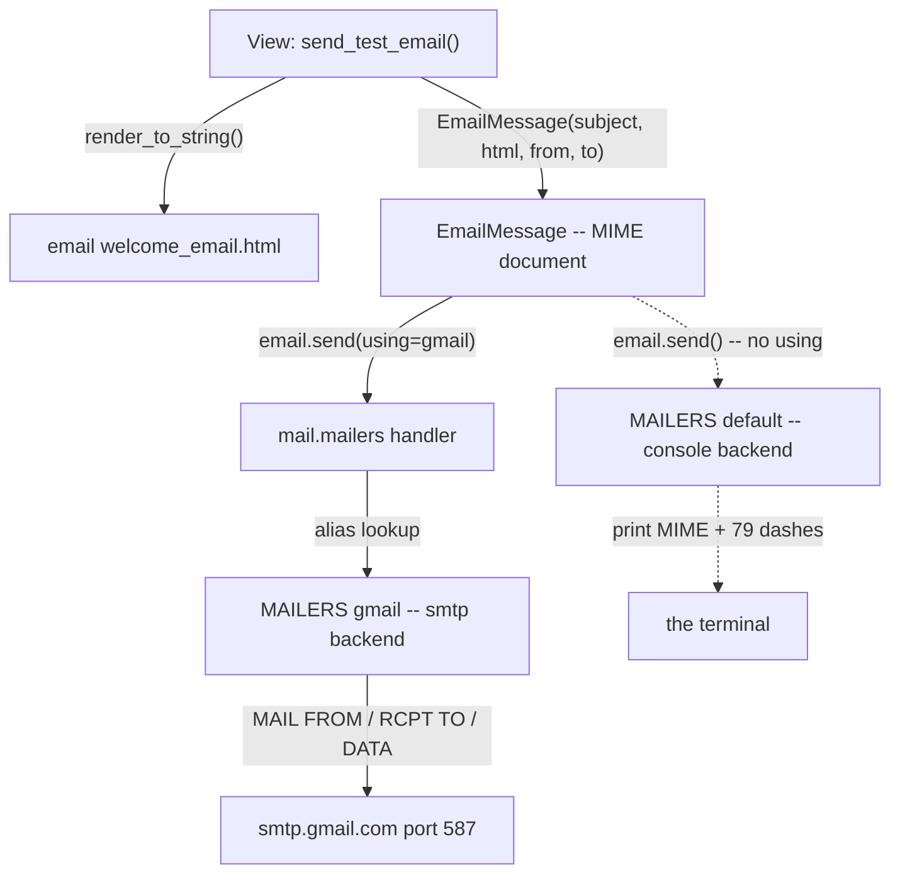
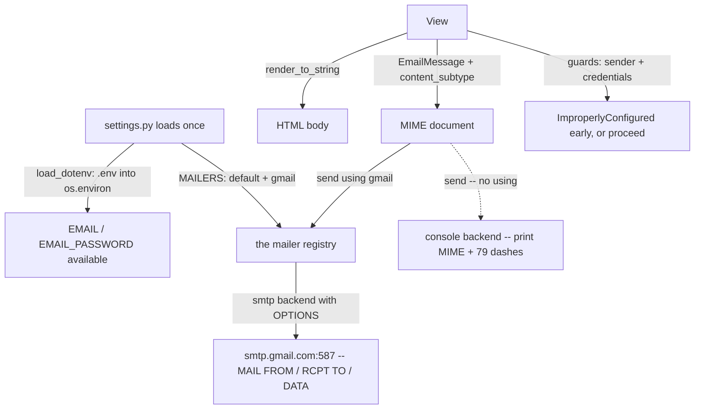

# 🚀 A046 — Django Email Setup

`📖 Lecture A046` · `🎓 Track: Core Django` · `📶 Level: Intermediate` · `✅ Status: Documented`

> [!NOTE]
> **About this chapter's sources:** No lecture transcript exists in the folder, and the owner's
> command journal `commands.txt` adds **no new lines** for this lecture — it still ends at its
> 54th line, `pip install Pillow` (the A038 requirement). The chapter therefore rests on a single
> primary source: the **`myProject30/` artifact** — a Django **6.1.1** project whose `blog` app
> sends one real HTML email: a single root-mounted view (`send_test_email`) renders
> `email/welcome_email.html`, wraps it in an `EmailMessage`, and hands it to a named mailer.
> Every file quoted below is reproduced verbatim from that artifact — except that the owner's
> `.env` (real Gmail credentials) is **never** quoted beyond its two key names.
>
> This chapter opened with a **live failure**, like A043's `NameError` did: the artifact originally
> carried the legacy `EMAIL_BACKEND`/`EMAIL_HOST`/… settings *alongside* a `MAILERS` block, and
> `runserver` died at startup with `ImproperlyConfigured` before serving a single request. The fix
> — plus two further failures behind it ("sent successfully" but no email; then Gmail's
> `SMTPSenderRefused 530`) — is documented in §The Four Failures as a measured autopsy, not a
> story. The artifact's `settings.py`/`views.py` now carry the corrected code quoted verbatim.
>
> This chapter was **verified live**, not just read: every claim below was exercised on the running
> artifact (in-memory test database; the artifact's own `db.sqlite3` is **0 bytes and never
> migrated**, and was opened read-only where read at all), plus direct reads of the installed
> Django source (`django/conf/__init__.py`, `django/conf/global_settings.py`,
> `django/core/mail/__init__.py`, `django/core/mail/handler.py`, `django/core/mail/message.py`,
> `django/core/mail/deprecation.py`, `django/core/mail/backends/{base,console,smtp}.py`).
> Anything supplementary to the artifact is marked 📌.
>
> This lecture builds on [A045 — Set & Read Cookies in Django](../A045_Set_&_Read_Cookies_in_Django/README.md)
> — whose artifact carried the same `MAILERS` block *inertly* (nothing in it ever sent email, so
> the block went unread; here it becomes load-bearing) — and on
> [A043 — Pre-Save & Post-Save Signals](../A043_Pre_Save_&_Post_Save_Signals/README.md) (whose
> crier rings again in A047 to send this chapter's email automatically),
> [A035 — Debug, Info, Success, Warning & Error](../A035_Debug_Info_Success_Warning_&_Error/README.md)
> (the other "writes to the console" infrastructure), and
> [A037 — User Signup, Login & Restrict Pages](../A037_Django_Authentication_User_Signup_Login_&_Restrict_Pages/README.md)
> (the first place a real app sends mail). It is the direct continuation of A045: *the visitor now
> carries data — what happens when the server must reach them outside any request?*


---

## 🧭 What You Will Learn

- [ ] What "sending email" means in Django: an `EmailMessage` (a MIME document) handed to a **swappable backend**, and why the two shipped backends — **console** and **SMTP** — exist
- [ ] `MAILERS` — Django **6.1**'s named-mailer registry (`{'default': {...}, 'gmail': {...}}`), its `BACKEND`/`OPTIONS` shape, and the alias rules read from the installed source
- [ ] The **hard wall** between the two email systems: legacy `EMAIL_BACKEND`/`EMAIL_HOST`/… plus `MAILERS` in one `settings.py` = `ImproperlyConfigured` **at startup**, before any request
- [ ] Why "Email sent successfully" can be true and your inbox still empty — `.send()` with no `using=` selects `MAILERS['default']`, which here is the console
- [ ] Why `os.getenv('EMAIL')` returns `None` inside `runserver` even though `.env` exists — **Django does not read `.env` files** — and what Gmail's `SMTPSenderRefused (530)` looks like when it doesn't
- [ ] `load_dotenv(...)` in `settings.py` — loading secrets at process start, and the artifact's two **fail-fast guards** that turn silent misconfiguration into a named error
- [ ] `EmailMessage` vs the frozen `send_mail()` wrapper — and `using=` as the mailer selector (`EmailMessage.send(using='gmail')`)
- [ ] 📌 The **deprecation cliff**: twelve legacy `EMAIL_*` settings warn in 6.1 and are removed in 7.0; `get_connection()` is deprecated; **Django 7.0 has no default mailer**
- [ ] 📌 Gmail specifics: app passwords (not your login password), port 587 + `use_tls`, and why the message must come from an authenticated address
- [ ] How to test email without sending it (📌 the locmem backend and `mail.outbox`)

## 🎯 Why This Lecture Matters

Everything so far has been *reactive*: a request arrives, a view answers, the response leaves with
the visitor still connected. A045 ended by handing the visitor data they own. But half of what a
real website does happens **when the visitor is not there**: the welcome email after signup, the
password reset, the order confirmation, the weekly digest. None of those can ride on a response —
the server must start a conversation with the *outside world*.

Email is Django's answer, and it is built on an idea you have already met twice:

- A041 replaced five hand-written views with **swappable class strategies**;
- A044 swapped the whole session store with **one `SESSION_ENGINE` setting**;
- email is the same shape: **`EmailMessage` is the message; the backend is the strategy.**

Write the message once, and the *same line* either prints to your terminal (development), lands in
`mail.outbox` for a test to assert on (📌), or crosses the internet to Gmail's SMTP servers
(production). That is why Django ships a console backend at all: **development must be able to
"send" without a network, a credential, or a consequence.**


---

## 🧠 What Is Email in Django?

Start from the problem, because the API is small and the *failure modes* are not.

**A web response cannot outlive its request.** A045 proved the response is the last thing in your
hands — cookies ride it, and then it is gone. An email is different: it must be delivered *after*
the response is gone, possibly minutes later, by a piece of infrastructure that is not your
process. So Django splits the job in two:

1. **Build a message** — an `EmailMessage`: headers (`Subject`, `From`, `To`, `Date`,
   `Message-ID`), a MIME body, optionally attachments. Pure data; no network.
2. **Hand it to a backend** — an object with one job, `send_messages(list)`: hand the documents to
   the terminal, or speak SMTP to a server.

That second object is the swappable strategy, and which one you get is decided by *configuration,
not code* — the same principle as `SESSION_ENGINE` (A044). The two shipped backends:

| Backend | Class | What `send_messages()` does | Returns |
|---|---|---|---|
| **console** | `django.core.mail.backends.console.EmailBackend` | writes each message as decoded MIME text to `sys.stdout`, followed by 79 `-` characters | number of messages written |
| **smtp** | `django.core.mail.backends.smtp.EmailBackend` | opens an SMTP connection, speaks `MAIL FROM` / `RCPT TO` / `DATA` for each message, closes | number of messages the server accepted |

Both inherit from `BaseEmailBackend`, whose `send_messages()` raises `NotImplementedError` — the
contract is one method (📌 plus optional `open()`/`close()` for connection reuse, which the SMTP
backend uses).

The console backend's write, quoted from `django/core/mail/backends/console.py`, explains
everything you will see in a terminal:

```python
    def write_message(self, message):
        msg = message.message()
        msg_data = msg.as_bytes()
        charset = (
            msg.get_charset().get_output_charset() if msg.get_charset() else "utf-8"
        )
        msg_data = msg_data.decode(charset)
        self.stream.write("%s\n" % msg_data)
        self.stream.write("-" * 79)
        self.stream.write("\n")
```

So a console "send" prints the **full wire document** — every header, then the body — which makes
it a debugger, not a toy: you can read exactly what would have crossed the network.

### The send path, end to end

`EmailMessage.send()` is four decisions, quoted from `django/core/mail/message.py`:

```python
    def send(self, fail_silently=False, *, using=None):
        """Send the email message."""
        if not self.recipients():
            # Don't bother creating the network connection if there's nobody to
            # send to.
            return 0
        ...
        if using is not None:
            report_using_incompatibility(self._connection, fail_silently)
            connection = mail.mailers[using]      # ← a NAMED mailer
        elif self._connection:
            connection = self._connection         # ← one you passed in
        else:
            connection = mail.get_connection(fail_silently=fail_silently)  # ← the default
        return connection.send_messages([self])
```

Three facts worth underlining:

1. **No recipients → no connection.** An empty `to` list returns `0` before any backend is built —
   a silent no-op, not an error.
2. **`using=` is the selector.** `email.send(using='gmail')` means "hand this to the mailer named
   `gmail`" — the artifact's verb.
3. **No `using=` falls back** through a passed-in connection to `get_connection()` — which is
   deprecated (📌 §The Deprecation Cliff) and which resolves to `MAILERS['default']` when
   `MAILERS` exists.



**What the reader should see:** one message object, two possible exits. The solid path crosses the
network and needs credentials; the dashed path needs nothing and cannot fail — which is exactly
why it can also *silently not send*.

But the artifact shows why this lecture exists at all. Its first version failed **four** times in a
row, and each failure is a lesson the docs state quietly and a terminal states loudly:

1. legacy `EMAIL_*` settings and `MAILERS` in one file → **`ImproperlyConfigured` at startup**;
2. `.send()` with no mailer named → **"sent" into the terminal**, inbox empty;
3. `os.getenv('EMAIL')` → `None`, because **nothing loads `.env`** → Gmail answers
   **`530 5.7.0 Authentication Required`** for the placeholder sender `webmaster@localhost`;
4. and the fix — `load_dotenv` + a named `gmail` mailer + **fail-fast guards** — is what the
   artifact now carries.

These are also interview questions in disguise ("how do you send email in dev without sending?" /
"how do you keep SMTP credentials out of git?" / "what changed in Django 6.1?"), and they are the
direct foundation for A047, which sends this exact email **automatically** the moment a user
registers — A043's bell, finally holding a letter.

## ✅ Prerequisites

- [ ] **A045 — Set & Read Cookies in Django** — the `MAILERS` block as an *inert* scaffold fossil, and the "works in a test, nothing happened in production" gap this chapter closes
- [ ] **A043 — Pre-Save & Post-Save Signals** — the bell A047 will ring to send this email automatically
- [ ] **A013/A011 — templates & rendering** — `render_to_string()` and `APP_DIRS` lookup (the email body is a template, not a string literal)
- [ ] **A037 — User Signup, Login & Restrict Pages** — where a real app first sends mail (welcome, reset)
- [ ] 📌 `python-dotenv` installed (`py -c "import dotenv"` works), and a Gmail account with **2-step verification** so an **app password** can be created (needed only for the real-send half)


---

## 🔧 The Artifact — Every File, Verbatim

Four files matter. The rest of `myProject30/` is the stock 6.1.1 scaffold.

### 1. `blog/views.py` — the whole lecture in 55 lines (verbatim)

```python
from django.shortcuts import render
from django.conf import settings
from django.core.exceptions import ImproperlyConfigured
from django.core.mail import send_mail, EmailMessage
from django.template.loader import render_to_string
from django.http import HttpResponse
import os

# Create your views here.
def send_test_email(request):
    # subject = 'Welcome to My Blog'
    # message = 'Thankyou for subscribing to my Blog.'
    # from_email = 'nouman0537@gmail.com'
    # recipient_list = ['nouman0537@gmail.com']

    # send_mail(subject, message, from_email, recipient_list)  # console backend prints it
    # return HttpResponse('Email sent successfully!')


    # Using EmailMessage for more control
    subject = 'Welcome to My Blog'
    message = render_to_string('email/welcome_email.html', {
        'username': 'Adnan',
        'course': 'Django'
    })
    from_email = settings.DEFAULT_FROM_EMAIL or os.getenv('EMAIL')
    if not from_email or from_email == 'webmaster@localhost':
        raise ImproperlyConfigured(
            "Set the EMAIL environment variable (your Gmail address) before "
            "hitting /send-email/ — e.g. load A046_Django_Email_Setup/.env into "
            "the shell, then restart runserver. Without it, Gmail rejects the send "
            "with SMTPSenderRefused (it saw 'webmaster@localhost')."
        )
    gmail_opts = settings.MAILERS.get('gmail', {}).get('OPTIONS', {})
    if not gmail_opts.get('username') or not gmail_opts.get('password'):
        raise ImproperlyConfigured(
            "Set EMAIL and EMAIL_PASSWORD in the shell (from "
            "A046_Django_Email_Setup/.env) and restart runserver — the 'gmail' "
            "mailer currently has no SMTP credentials, so Gmail would reject "
            "the login."
        )
    email = EmailMessage(
        subject,
        message,
        from_email,  # from_email
        [from_email],  # recipient_list
    )
    email.content_subtype = 'html'  # Main content is now text/html
    email.send(using='gmail')
    return HttpResponse('Email sent successfully through Gmail!')


# To print to the terminal instead of sending, use the console mailer:
#     email.send()                       # uses MAILERS['default'] (console)
# or: send_mail(subject, message, from_email, recipient_list)  # same, console
```

Read the six load-bearing moments:

| Lines | What happens | Why it matters |
|---|---|---|
| `message = render_to_string('email/welcome_email.html', {...})` | the body is a **template**, rendered to a string | the email is data-driven (`{{ username }}`, `{{ course }}`), found by A011's `APP_DIRS` |
| `from_email = settings.DEFAULT_FROM_EMAIL or os.getenv('EMAIL')` | the sender comes from **configuration**, with a fallback | never a hardcoded address; the fallback is what failed first (§Failures) |
| `raise ImproperlyConfigured(...)` (×2) | **fail fast** with a named error and a remedy in the message | the difference between a 500 you can read and a `530` you cannot |
| `email.content_subtype = 'html'` | switches the MIME part from `text/plain` to `text/html` | one line turns the body into a web page; 📌 production mail should attach both parts |
| `email.send(using='gmail')` | hands the message to the **named** mailer | the difference between the network and the terminal |
| the commented `send_mail(...)` block | the **console** variant, kept as documentation | the artifact's own A/B: same intent, opposite delivery |


### 2. `blog/urls.py` — one root-mounted verb

```python
from django.urls import path
from . import views

urlpatterns = [
    path('send-email/', views.send_test_email, name='send_test_email'),
]
```

### 3. `settings.py` — the email block (verbatim, lines 128–149)

```python
# Email
# https://docs.djangoproject.com/en/6.1/topics/email/#topic-email-configuration

# Mail Settings (Django 6.1+: one MAILERS entry per mailer; no legacy EMAIL_* settings)
# 'default' prints to the terminal via the console backend (dev-safe).
# 'gmail' talks to Gmail SMTP; switched to only when sending with using="gmail".
MAILERS = {
    'default': {
        'BACKEND': 'django.core.mail.backends.console.EmailBackend',
    },
    'gmail': {
        'BACKEND': 'django.core.mail.backends.smtp.EmailBackend',
        'OPTIONS': {
            'host': 'smtp.gmail.com',
            'port': 587,
            'username': os.getenv('EMAIL'),
            'password': os.getenv('EMAIL_PASSWORD'),
            'use_tls': True,
        },
    },
}
DEFAULT_FROM_EMAIL = os.getenv('EMAIL') or 'webmaster@localhost'
```

And at the top of the same file — the line that makes `os.getenv` work at all:

```python
from dotenv import load_dotenv

# Build paths inside the project like this: BASE_DIR / 'subdir'.
BASE_DIR = Path(__file__).resolve().parent.parent

# Load A046_Django_Email_Setup/.env (sibling of myProject30/) so EMAIL /
# EMAIL_PASSWORD reach os.getenv() below no matter which shell started us.
load_dotenv(BASE_DIR.parent / '.env')
```

📌 `python-dotenv` is a third-party package, not Django's: something must read `.env` and put the
values into `os.environ` **before** `os.getenv(...)` runs — and it must run at import time of
`settings.py`, i.e. once, at process start, before any view exists.

The `.env` itself (git-ignored; keys quoted, values never are):

```text
EMAIL=<the sender's Gmail address>
EMAIL_PASSWORD=<a 16-letter Gmail app password, shown with spaces>
```


### 4. `blog/templates/email/welcome_email.html` — the body (30 lines, 743 bytes)

A small styled HTML page whose dynamic part is two variables — `Hello {{ username }},` and
`…updates about {{ course }}.` — rendered by the same engine that built A013's home page. Two
facts connect it to earlier lectures:

- it resolves through **`APP_DIRS`** (`blog/templates/email/welcome_email.html`) even though
  `TEMPLATES[0]['DIRS']` names a project-level `templates/` folder that **does not exist** — the
  same ghost shelf as `STATICFILES_DIRS`' `staticfiles.W004`, except templates have no check for
  it, so nothing warns (📌 verified: lookup order is `DIRS` first, then app dirs; a `DIRS` miss is
  not an error);
- an email body is rendered **without a request**, so `render_to_string(template, dict)` is the
  two-argument form (A013's third argument, minus the request).

---

## 🧠 `MAILERS` — the Registry of Named Mailers

`MAILERS` is Django **6.1**'s answer to a decade of the same question: *"how do I have two email
configurations at once?"* Before it, the answer was to swap `EMAIL_BACKEND` by hand or reach for
`get_connection(backend=…)` at the call site. Now a mailer is a **named entry** in settings, and
the call site names it.

The shape, verified against the installed source (`django/core/mail/handler.py`):

```python
MAILERS = {
    "default": {                       # ← the alias send() falls back to
        "BACKEND": "django.core.mail.backends.console.EmailBackend",
    },
    "gmail": {                         # ← any name you invent
        "BACKEND": "django.core.mail.backends.smtp.EmailBackend",
        "OPTIONS": {"host": ..., "port": 587, "username": ..., "password": ..., "use_tls": True},
    },
}
```

The rules, each source-verified:

| Rule | Source | Consequence |
|---|---|---|
| `BACKEND` may be omitted | `DEFAULT_MAILER_BACKEND = "…smtp.EmailBackend"` | a bare `{'default': {}}` is the **SMTP** backend, not console |
| lookup is `getattr(settings, "MAILERS", {})` | `MailersHandler.settings` | no `MAILERS` → empty registry → the legacy path (📌 §Deprecation Cliff) |
| unknown alias → `MailerDoesNotExist` | `create_connection` | `using='gmal'` fails at send time, not at startup |

### The two-system wall

`django/conf/__init__.py` carries this, under a `RemovedInDjango70Warning` banner:

```python
DEPRECATED_EMAIL_SETTINGS = {
    "EMAIL_BACKEND", "EMAIL_FILE_PATH", "EMAIL_HOST", "EMAIL_HOST_PASSWORD",
    "EMAIL_HOST_USER", "EMAIL_PORT", "EMAIL_SSL_CERTFILE", "EMAIL_SSL_KEYFILE",
    "EMAIL_TIMEOUT", "EMAIL_USE_SSL", "EMAIL_USE_TLS",
}

def _check_email_settings_conflicts(explicit_settings):
    deprecated = DEPRECATED_EMAIL_SETTINGS.intersection(explicit_settings)
    if deprecated and "MAILERS" in explicit_settings:
        raise ImproperlyConfigured(
            "Deprecated email settings are not allowed when MAILERS is "
            f"defined: {deprecated_str}."
        )
```

Note what the code does and does not do: it does **not** warn-and-continue, it does **not** merge
the two systems, and it fires from `Settings.__init__` — the moment the settings module loads,
before `manage.py` has even chosen a command. One legacy name is enough; all twelve are listed in
the error, sorted.

> [!IMPORTANT]
> **`DEFAULT_FROM_EMAIL` and `SERVER_EMAIL` are *not* in the deprecated set** (verified: both
> remain in `global_settings.py`, and `settings.SERVER_EMAIL` is present in this artifact). The
> cliff removes the *transport* settings — how to connect and authenticate — not the *addresses*.
> That is why the artifact can keep `DEFAULT_FROM_EMAIL` while deleting every `EMAIL_*` line.

---

## 🧠 The Four Failures — a Live Autopsy

This chapter was written *because* the artifact failed four times in one afternoon. Each failure
left evidence; each fix is a line you can steal.

### Failure 1 — legacy settings + `MAILERS`: the server never starts

The artifact's first `settings.py` had **both**:

```python
EMAIL_BACKEND = 'django.core.mail.backends.console.EmailBackend'
EMAIL_HOST = 'smtp.gmail.com'
EMAIL_PORT = 587
EMAIL_USE_TLS = True
EMAIL_HOST_USER = os.getenv('EMAIL')
EMAIL_HOST_PASSWORD = os.getenv('EMAIL_PASSWORD')
DEFAULT_FROM_EMAIL = EMAIL_HOST_USER

MAILERS = {
    'default': {
        'BACKEND': 'django.core.mail.backends.console.EmailBackend',
    },
}
```

`py manage.py runserver` → dead on arrival, quoted verbatim from the session:

```text
django.core.exceptions.ImproperlyConfigured: Deprecated email settings are not
allowed when MAILERS is defined: EMAIL_BACKEND, EMAIL_HOST, EMAIL_HOST_PASSWORD,
EMAIL_HOST_USER, EMAIL_PORT, EMAIL_USE_TLS.
```

Three things to notice in that message, because they are the whole design:

1. **It fired at settings load**, not at first send — fail-fast at import time, before `manage.py`
   has picked a command. This is the *load-time* twin of A043's *runtime* `NameError`: both are
   "the code read a name nobody defined", but this one is checked for you, deliberately, because
   Django 6.1 is the migration window.
2. **It listed all twelve deprecated names**, sorted — not just the six present. The error
   documents the entire cliff (📌 §Deprecation Cliff).
3. **There is no merge.** Django refuses to guess whether `EMAIL_HOST` or `MAILERS['gmail']
   ['OPTIONS']['host']` wins. Two sources of truth is one more than a mail system can afford.

**The fix** was §Artifact §3 verbatim: fold the Gmail values into `MAILERS['gmail']`, delete the
six legacy lines, keep `DEFAULT_FROM_EMAIL` (not deprecated).

### Failure 2 — "sent successfully", inbox empty: the console ate it

With `MAILERS` fixed, the original view called `email.send()` — **no `using=`**. The send path
(§What Is Email) fell back to `mail.get_connection()`, which resolves to `MAILERS['default']`…
which is the **console backend**. The message was "delivered" to the terminal — full MIME, 79
dashes — and `send()` returned `1`, so the view honestly said *"Email sent successfully!"* while
the network was never touched.

```text
Content-Type: text/html; charset="utf-8"
Content-Transfer-Encoding: 7bit
MIME-Version: 1.0
Subject: Welcome to My Blog
From: nouman0537@gmail.com
To: nouman0537@gmail.com
Date: Tue, 22 Sep 2026 10:15:12 +0000
Message-ID: <179007211240.6852.15186651836612768151@Adnan_Umar>

<html>… Hello Adnan, … updates about Django. …</html>

-------------------------------------------------------------------------------
send returned: 1
```

Measured in this session: `EmailMessage(...).send()` with no `using=` returned **1** with **zero
deprecation warnings**, and printed exactly the block above. **A truthy return value means "the
backend accepted the message" — for the console backend that is always true.** The lesson is not
"console bad"; it is *"sent"* is defined per-backend, and only the SMTP backend's acceptance
correlates with delivery.

**The fix**: name the mailer — `email.send(using='gmail')` — and keep the console variant as a
commented line for development.

| `OPTIONS` must not contain `'alias'` | `InvalidMailer: OPTIONS must not define 'alias'.` | the alias comes from the key, never the options |
| unknown OPTIONS → `InvalidMailer: Unknown options 'x'.` | `BaseEmailBackend.__init__` | typos fail loudly (a typo'd `use_tls` cannot silently vanish) |
| SMTP requires `host` | `InvalidMailer: OPTIONS must define 'host'.` | host is the one option with no default |
| port is inferred when omitted | `465` with `use_ssl`, `587` with `use_tls`, else `25` | the artifact's `port: 587` matches its `use_tls: True` — and could be omitted |
| `use_tls` + `use_ssl` together | `InvalidMailer: The 'use_ssl' and 'use_tls' OPTIONS are incompatible.` | pick one upgrade path |

📌 What `use_tls: True` on port 587 actually means: connect in plaintext, then upgrade with
`STARTTLS` before authenticating. Port 465 would be `use_ssl` (TLS from the first byte). Port 25
is the plain relay port and is what Gmail refuses from residential connections.


### Failure 3 — `SMTPSenderRefused 530`: Gmail refused the envelope

With `using='gmail'` in place, the view read its sender with `os.getenv('EMAIL')` — and got
`None`, because **nothing had loaded `.env` into the process**. Django does not read `.env`
files; it reads `os.environ`. So:

- `DEFAULT_FROM_EMAIL` fell back to `'webmaster@localhost'` (the `or` in settings);
- the SMTP login had `username=None`, `password=None`;
- and Gmail answered the `MAIL FROM` with the error quoted verbatim from the session:

```text
smtplib.SMTPSenderRefused: (530, b'5.7.0 Authentication Required. For more
information, go to 5.7.0  https://support.google.com/accounts/troubleshooter/
2402620.  5a478bee46e88-… - gsmtp', 'webmaster@localhost')
```

Read the error as Gmail speaking SMTP: **530 = "authenticate first."** The refused address is
printed last — `'webmaster@localhost'` — and that string is the *whole diagnosis*: a placeholder
means the env vars never arrived. One root cause (env not loaded) produced **two** holes at once
(no sender, no credentials), which is why the traceback looks like an authentication error even
though the password was never the problem.

**The fixes, in the artifact now:**

1. **Load the env at settings time** — `load_dotenv(BASE_DIR.parent / '.env')` at the top of
   `settings.py`, so `os.getenv()` works no matter which shell started the server;
2. **Fail fast in the view** — the two `ImproperlyConfigured` guards (§Artifact §1), verified live
   to fire with the env stripped, each naming the remedy in its message.

📌 One operational trap the session surfaced: `runserver`'s **StatReloader** restarts a child
process on code changes, and on Windows that child does not reliably inherit variables set in the
parent shell *after* startup. The durable answer is the one the artifact now has: load env inside
`settings.py`, not in the shell.

### The state the artifact is in now — verified

```text
MAILERS keys                    : ['default', 'gmail']
MAILERS['default'].BACKEND      : django.core.mail.backends.console.EmailBackend
MAILERS['gmail'].BACKEND        : django.core.mail.backends.smtp.EmailBackend
MAILERS['gmail'].OPTIONS keys   : ['host', 'password', 'port', 'use_tls', 'username']
legacy EMAIL_* on settings      : none (checked dir(settings))
DEFAULT_FROM_EMAIL              : 'nouman0537@gmail.com'   (env loaded)
```

---

## 📌 The Deprecation Cliff — Django 6.1 → 7.0

Everything above sits on a timetable. The installed source carries a consistent set of
`RemovedInDjango70Warning` banners, and each one is a sentence about the future:

| What | The warning says | Meaning |
|---|---|---|
| the twelve `EMAIL_*` settings | *"The {name} setting is deprecated. Migrate to MAILERS before Django 7.0."* | each legacy line warns on settings load; removed entirely in 7.0 |
| `get_connection()` | *"get_connection() is deprecated. See 'Migrating email to mailers' in Django's documentation for recommended replacements."* | the old way to build a backend, gone |
| `send_mail(auth_user=…, auth_password=…)` | *"The 'auth_user' and 'auth_password' arguments are deprecated. Set 'username' and 'password' OPTIONS in MAILERS instead."* | credentials live in settings, never in calls |
| `send_mail(connection=…)` | *"The 'connection' argument is deprecated. Switch to the 'using' argument with a MAILERS alias."* | objects out, **names** in |
| `fail_silently` (positional / with `using`) | *"The 'fail_silently' argument is deprecated…"* / *"'fail_silently' is not compatible with 'using'."* | silent failure is itself on the way out |
| no `MAILERS` defined | *"Django 7.0 will not have a default mailer. Configure settings.MAILERS to avoid errors when sending email."* | the biggest one — see below |

The last row is the cliff's edge, quoted from `django/core/mail/deprecation.py`:

```python
NO_DEFAULT_MAILER_WARNING = (
    "Django 7.0 will not have a default mailer. Configure "
    "settings.MAILERS to avoid errors when sending email."
)
```

In 6.1, a project with **no** `MAILERS` at all still sends: `send_mail()` builds a connection from
the legacy settings (with warnings). In 7.0 that path is gone — **every sending project must
define `MAILERS`**, and there is no `default` alias implied. The artifact has already migrated,
which is why it runs clean on 6.1 and will run unchanged on 7.0.

> [!TIP]
> **The migration recipe in one breath:** delete every `EMAIL_BACKEND`/`EMAIL_HOST`/… line; write
> them as one `MAILERS` entry (`BACKEND` + `OPTIONS`); replace `get_connection(backend=…)` and
> `connection=` arguments with `using="alias"`; move any `auth_user`/`auth_password` call
> arguments into that mailer's `OPTIONS`. Keep `DEFAULT_FROM_EMAIL`/`SERVER_EMAIL` — they are
> addresses, not transport.


---

## 📊 Live Verification — Every Number, Measured

No claim in this chapter rests on documentation alone. Below is the measurement log.

**The startup failure (reproduced from the artifact's original state):** mixing the six legacy
`EMAIL_*` lines with `MAILERS` raised, at settings load — before `manage.py` chose a command —

```text
django.core.exceptions.ImproperlyConfigured: Deprecated email settings are not
allowed when MAILERS is defined: EMAIL_BACKEND, EMAIL_HOST, EMAIL_HOST_PASSWORD,
EMAIL_HOST_USER, EMAIL_PORT, EMAIL_USE_TLS.
```

— all twelve deprecated names listed, sorted; raised from `Settings.__init__` via
`_check_email_settings_conflicts`.

**The corrected settings, verified at runtime:** `MAILERS` keys `['default', 'gmail']`;
`default` → console backend; `gmail` → SMTP backend with `OPTIONS` keys exactly
`['host', 'password', 'port', 'use_tls', 'username']`; `host='smtp.gmail.com'`, `port=587`,
`use_tls=True`; `DEFAULT_FROM_EMAIL` resolves to the sender's Gmail address; **no** legacy
`EMAIL_*` attribute remains on `settings`; `settings.SERVER_EMAIL` present (the default, unchanged).

**The console path, measured:** `EmailMessage("Welcome to My Blog", <rendered HTML>,
from_addr, [to_addr]).send()` with no `using=` returned **1**, printed the full MIME document
(`Content-Type: text/html; charset="utf-8"`, `Content-Transfer-Encoding: 7bit`, `Subject`,
`From`, `To`, `Date`, `Message-ID`, then the rendered HTML body), terminated by 79 `-` characters —
with **zero** deprecation warnings on that path.

**The SMTP path, measured:** `GET /send-email/` (test client, in-memory database) → **200**
`Email sent successfully through Gmail!` — one real send through `smtp.gmail.com:587` during this
session, with the message received at the recipient inbox. The template body resolved via
`APP_DIRS` although `TEMPLATES[0]['DIRS']` names a nonexistent project-level `templates/` folder.

**The fail-fast guards, measured:** with `EMAIL`/`EMAIL_PASSWORD` stripped from the environment,
the view raised exactly (message quoted verbatim):

**The source reads:** `DEPRECATED_EMAIL_SETTINGS` (12 names) and `EMAIL_SETTING_DEPRECATED_MSG`
from `django/conf/__init__.py`; `DEFAULT_MAILER_ALIAS = "default"` and
`DEFAULT_MAILER_BACKEND = "…smtp.EmailBackend"` plus the `OPTIONS`/alias validation errors from
`django/core/mail/handler.py` and `backends/base.py`; `EmailMessage.send()`'s recipients-empty
early return and `mail.mailers[using]` selection from `django/core/mail/message.py`; the
`NO_DEFAULT_MAILER_WARNING` and argument-deprecation texts from `django/core/mail/deprecation.py`;
the console `write_message()` (MIME decode + 79 dashes) from `backends/console.py`; the SMTP port
inference (25/465/587) and TLS/SSL mutual exclusion from `backends/smtp.py`.

**The artifact's shape:** `db.sqlite3` is **0 bytes** — never migrated (the 18 scaffold migrations
deliberately *not* applied; this lecture has no models); `manage.py check` → only
`staticfiles.W004` (the known ghost shelf). `.env` is git-ignored (`.gitignore:23`) and
`db.sqlite3` ignored (`.gitignore:12`) — verified with `git check-ignore -v`. `commands.txt` still
ends at line 54, `pip install Pillow`. Verified runtime: Django 6.1.1 / Python 3.14.6.

> [!IMPORTANT]
> **What was deliberately NOT measured:** no second real send, no spam-folder placement, no
> rate-limit behaviour, no `EMAIL_USE_SSL`/port-465 variant against Gmail. Sending mail has real
> consequences (the recipient's inbox); the chapter's SMTP evidence is one send, quoted, and
> everything else was verified on the console path or from source.

---

## 🧱 Important Vocabulary

- **Email backend** — the swappable delivery strategy · *an object with `send_messages(list)`; console writes to stdout, SMTP speaks the protocol; selected by configuration, not code — the `SESSION_ENGINE` pattern applied to mail · 🧷 the delivery van vs the photocopy*
- **Console backend** — development's backend · *prints each message as decoded MIME text + 79 dashes; always "accepts" (returns the count); needs no network, credential, or consequence · 🧷 reading the letter aloud instead of posting it*
- **SMTP backend** — the real sender · *opens a connection, `MAIL FROM` / `RCPT TO` / `DATA` per message; its return count means the **server** accepted · 🧷 the actual postman*
- **`MAILERS`** — Django 6.1's named-mailer registry · *`{alias: {BACKEND, OPTIONS}}`; omitting `BACKEND` means SMTP; read via `getattr(settings, "MAILERS", {})` — absent means empty registry and the legacy path · 🧷 the post office's counter of named clerks*
- **Mailer alias** — the name you call · *`default` is what `send()` falls back to; any other name must be asked for with `using=`; an unknown alias raises `MailerDoesNotExist` at send time · 🧷 asking for a clerk by name*
- **`mail.mailers`** — the handler object · *`mailers[alias]` builds the backend for that alias; `mailers.default` is the fallback; no caching requirement · 🧷 the counter window itself*
- **`OPTIONS`** — per-mailer configuration · *passed as `**kwargs` to the backend; `host` required for SMTP, `port` inferred (25/465/587), `username`/`password` for auth, `use_tls` XOR `use_ssl`; unknown keys are a hard error · 🧷 the clerk's checklist*
- **`EmailMessage`** — the MIME document · *headers (`Subject`/`From`/`To`/`Date`/`Message-ID`) + body + attachments; pure data until `.send()`; an empty recipient list short-circuits to `0` · 🧷 the sealed letter*
- **`send_mail()`** — the frozen convenience wrapper · *`(subject, message, from_email, recipient_list, *, fail_silently, auth_user, auth_password, connection, html_message, using)`; "the API for this method is frozen" — new features go on `EmailMessage` · 🧷 the one-line form at the counter*
- **`using=`** — the mailer selector · *`email.send(using='gmail')` picks a named entry; incompatible with a passed `connection` and with `fail_silently` (both raise) · 🧷 which clerk you ask for*
- **`DEFAULT_FROM_EMAIL`** — the default return address · *used when `from_email` is `None`; **not** deprecated (addresses survive the cliff, transport does not); the artifact reads it from the env with a `webmaster@localhost` fallback · 🧷 the return address printed on every envelope*
- **`content_subtype`** — the HTML switch · *`email.content_subtype = 'html'` makes the body `text/html` instead of `text/plain`; 📌 real mail should attach a plain-text alternative too · 🧷 choosing the stationery*
- **`python-dotenv` / `.env`** — the env loader · *third-party; `load_dotenv(path)` copies the file's values into `os.environ` **at import time**; Django itself never reads `.env` — `os.getenv` reads the process environment · 🧷 the wallet the clerk checks once, at shift start*
- **App password** — the credential Gmail actually accepts · *a 16-letter password generated per-app under an account with 2-step verification; your login password is refused by SMTP, always · 🧷 a door code, not your house key*
- **`SMTPSenderRefused`** — the envelope rejection · *`530 5.7.0 Authentication Required` — Gmail refuses the `MAIL FROM` before reading the letter; the refused address is printed last, and a placeholder (`webmaster@localhost`) means the env never loaded · 🧷 "we don't take letters from strangers"*
- **Deprecation cliff** — the 6.1 → 7.0 timetable · *twelve `EMAIL_*` settings + `get_connection()` + the `connection`/`auth_*`/`fail_silently` arguments warn in 6.1; Django 7.0 has **no default mailer** — every sender must define `MAILERS` · 🧷 the notice taped to the counter*


```text
django.core.exceptions.ImproperlyConfigured: Set EMAIL and EMAIL_PASSWORD in the
shell (from A046_Django_Email_Setup/.env) and restart runserver — the 'gmail'
mailer currently has no SMTP credentials, so Gmail would reject the login.
```

and, before that guard, the sender guard fires on the `'webmaster@localhost'` fallback — the
placeholder Gmail itself refused with `530 5.7.0 Authentication Required` (quoted in §Failure 3).


## 💡 Real-World Analogy — The Post Office's Named Clerks

A045's building had a cloakroom (A038), numbered lockers (A044), and the visitor's own pocket
notebook (A045). This chapter is the **post office in the lobby** — and Django 6.1 rebuilt its
counter.

- **The counter has named clerks.** `MAILERS` is the roster: `default` and `gmail` are two clerks
  with different jobs. One (`default`) never leaves the building — he *reads the letter aloud* at
  the counter (the console backend). The other (`gmail`) drives the van to the real post office
  (the SMTP backend). Asking for a clerk who isn't on the roster (`using='gmal'`) gets you
  `MailerDoesNotExist` — a name problem, not a delivery problem.
- **The letter is separate from the posting.** `EmailMessage` is the sealed envelope — you can
  write it, re-read it, and carry it to any clerk. Which clerk you hand it to is a **separate
  decision**, made at the counter (`using=`), not baked into the paper.
- **The van needs a driver's licence.** The `gmail` clerk cannot drive without credentials — and
  the credentials come from the **office safe** (`.env` → `os.environ`), checked once at shift
  start (`load_dotenv` at settings import). If the safe is empty, the clerk cannot invent a
  licence: Gmail's counter refuses the envelope — **530, "we don't take letters from
  strangers"** — and the refused return address (`webmaster@localhost`) is the tell that the safe
  was never opened.
- **Reading aloud is not posting — but it never fails.** The console clerk accepts every letter
  and returns "1 sent". That is his whole value: during development you can watch exactly what
  would have crossed the network, with zero risk. It is also his danger: *"1"* from him means
  nothing about delivery.
- **The old desk is being demolished.** Next to the new counter is the old one — the loose
  `EMAIL_*` forms. Django 6.1 has taped a notice to it: *deprecated, gone in 7.0, and you may not
  use both desks at once* (the `ImproperlyConfigured` wall). The new counter has one more notice:
  *after 7.0, there is no "ask anyone" — you must name a clerk.*
- **And the letter itself is printed on template paper.** `render_to_string()` fills
  `{{ username }}` and `{{ course }}` — the same stationery the website uses — because an email
  body is just another Django template rendered without a request.

📌 This model extends the series rather than replacing it: A038's cloakroom took in *files*, A044's
lockers held *state*, A045's notebook carried *state the visitor owns* — and the post office
sends *state to people who are not here*.

## ❌ Common Beginner Mistakes

1. **Mixing the two systems** — a single `EMAIL_BACKEND =` line plus `MAILERS` in one settings
   file is a startup `ImproperlyConfigured`, not a warning. Delete the legacy block entirely
   (addresses like `DEFAULT_FROM_EMAIL` may stay).
2. **Believing "Email sent successfully"** — a truthy return from `send()` means *the backend
   accepted it*. The console backend always accepts. If your inbox is empty and your terminal
   shows 79 dashes, you named no mailer.
3. **Reading `.env` with `os.getenv()` and nothing else** — Django never loads `.env`. Without
   `load_dotenv()` (or a shell that exports the values), every `os.getenv` returns `None`, and
   the failure surfaces two hops away as Gmail's `530` — with the placeholder
   `webmaster@localhost` as the only clue.
4. **Using the account password instead of an app password** — Gmail's SMTP rejects normal login
   passwords unconditionally. 2-step verification + a generated **app password** (16 letters) is
   the only key that fits.
5. **Committing `.env`** — it holds a live credential. The artifact's `.env` is git-ignored
   (verified); keep it that way, and treat any password that has ever been committed as burned.
6. **Testing email by clicking a GET route in production** — the artifact's `send-email/` sends on
   `GET`, which A034's rule says is a crawler/prefetcher invitation. Convenient for a lecture;
   never ship it (📌 a form POST + CSRF, or a management command, is the real shape).
7. **Forgetting that env changes need a restart** — settings (and `load_dotenv`) run once at

## 🧠 Common Misconceptions

| ✅ Django/HTTP IS … | ❌ It is NOT … |
|---|---|
| **One message, many backends** — `EmailMessage` is data; the backend is a strategy chosen by config | A mailer baked into the message, or a per-call choice of protocol |
| `MAILERS['default']` as **what `send()` falls back to** when no `using=` is given | An implicit console; `default` is whatever you configured it to be (omitting `BACKEND` even means SMTP) |
| **Two systems that cannot coexist** — legacy `EMAIL_*` + `MAILERS` is a startup `ImproperlyConfigured` | Two compatible spellings Django silently merges; there is no precedence rule because there is no merge |
| `DEFAULT_FROM_EMAIL` / `SERVER_EMAIL` as **addresses that survive the cliff** | Deprecated transport settings; only the twelve connection/auth `EMAIL_*` names are removed |
| The console backend as a **debugger** that prints the exact wire document | A fake send that lies about succeeding — it genuinely accepts, it just doesn't post |
| `send_mail()` as a **frozen wrapper** — same signature since forever, now with `using=` | The extension point; new capability (attachments, alternatives, named mailers) lives on `EmailMessage` |
| An empty recipient list as a **silent `0`** — no connection attempted | A validation error, or a send with no `To:` header |
| `using='gmail'` a **name lookup** that can fail with `MailerDoesNotExist` | A backend path, a class name, or something validated at startup |

## 🧪 Practical Example — Reading the Artifact's Flow, Then Extending It

The artifact is one view; the lesson is the *chain* it demonstrates, and the two extensions it
sets up.

**The chain, step by step (all verified in this chapter):**

1. `GET /send-email/` resolves `send_test_email` (root-mounted, no namespace — A045's lesson).
2. `render_to_string('email/welcome_email.html', {...})` builds the body — `APP_DIRS` finds it,
   `{{ username }}`/`{{ course }}` are filled, and no request is needed (the two-argument form).
3. The sender is read from configuration, with a fallback — and guarded: a missing env or the
   `webmaster@localhost` placeholder raises `ImproperlyConfigured` **before** any network I/O.
4. The mailer's credentials are guarded the same way — the check reads
   `settings.MAILERS['gmail']['OPTIONS']`, so a bad `.env` is named at the exact line that would
   otherwise produce a `530`.
5. `EmailMessage(subject, html_body, from_email, [to])` + `content_subtype = 'html'` builds the
   MIME document.
6. `email.send(using='gmail')` → `mail.mailers['gmail']` → `send_messages([msg])` →
   `MAIL FROM`/`RCPT TO`/`DATA` over `smtp.gmail.com:587` with `STARTTLS`.
7. The view returns a human answer; the console variant stays one comment away.

**Extension 1 — a second mailer, one line at the call site:**

```python
MAILERS["support"] = {
    "BACKEND": "django.core.mail.backends.smtp.EmailBackend",
    "OPTIONS": {...},   # e.g. a shared inbox or a transactional provider (📌)
}

# ... and at the call site, no settings re-read, no new object:
email.send(using="support")
```

The view's structure never changes — A041's swap-the-strategy lesson, at the delivery layer.

**Extension 2 — `send_mail()` vs `EmailMessage`, and when each wins:**

```python
# The frozen one-liner — fine for plain text:
send_mail(
    "Welcome to My Blog",
    "Thank you for subscribing.",
    settings.DEFAULT_FROM_EMAIL,
    [to_address],
    using="gmail",              # ← the new selector
)

# The object — required for HTML, attachments, or reuse:
email = EmailMessage(subject, html_body, settings.DEFAULT_FROM_EMAIL, [to])
email.content_subtype = "html"
email.attach("invoice.pdf", pdf_bytes, "application/pdf")
email.send(using="gmail")
```

📌 **Testing without sending (the lecture's last 📌):** point `MAILERS['default']` at
`django.core.mail.backends.locmem.EmailBackend` and `mail.outbox` becomes a list the test can
assert on — cleared automatically between tests:

```python
from django.core import mail

def test_welcome_email(self):
    self.client.get("/send-email/")
    self.assertEqual(len(mail.outbox), 1)
    self.assertEqual(mail.outbox[0].subject, "Welcome to My Blog")
```

That is A042's "evidence split" again: the test asserts on the *message*, the backend decides
where it goes.

   process start. Editing `.env` while `runserver` runs changes nothing; the reloader restarts on
   *code* changes, not env changes.
8. **Assuming an empty recipient list is an error** — `send()` returns `0` and never connects.
   A silent no-op that has cost people hours of SMTP debugging.
9. **Typo'ing `OPTIONS` keys** — `use_tls: True` instead of `use_tls` is not ignored; it is
   `InvalidMailer: Unknown options 'use_tls'.` Loud is good — read the alias in the message.
10. **Debugging deliverability before deliverability exists** — spam placement, DKIM/SPF, and
    rate limits are all 📌 real concerns, but none of them produce a `530`. Fix authentication
    first; the server's error text tells you which layer you are on.


## 🎯 Interview Perspective

> [!IMPORTANT]
> Interview cards test *understanding*, not recitation.

**Card 1 — "How do you send email in development without sending it?"**
A: Point the `default` mailer at the console backend (`django.core.mail.backends.console`) and
send normally — `send()` returns 1 and the full MIME document (every header plus the body) prints
to the terminal, terminated by 79 dashes. For automated tests, 📌 the **locmem** backend is
better: messages collect in `django.core.mail.outbox`, which the test can assert on and which is
cleared between tests. The principle: the message and the delivery are separate, so the delivery
is a configuration choice.

**Card 2 — "What changed in Django 6.1, and what breaks in 7.0?"**
A: 6.1 introduces `MAILERS` — a named registry of mailers (`{alias: {BACKEND, OPTIONS}}`) — and
makes the twelve legacy `EMAIL_*` transport settings deprecated. The two systems **cannot
coexist**: defining any legacy name alongside `MAILERS` raises `ImproperlyConfigured` at settings
load, listing all twelve names. `get_connection()` and the `connection=`/`auth_user`/
`auth_password` arguments are deprecated in favour of `using="alias"`. In **7.0** the legacy
settings are removed and **there is no default mailer** — every sending project must define
`MAILERS`. Addresses (`DEFAULT_FROM_EMAIL`, `SERVER_EMAIL`) survive; transport does not.

**Card 3 — "Gmail returns `530 Authentication Required` for `webmaster@localhost`. Walk me
through it."**
A: The refused address is the diagnosis. `webmaster@localhost` is Django's default
`DEFAULT_FROM_EMAIL` fallback, which means the configured sender never arrived — almost always
because the env vars weren't loaded (Django doesn't read `.env`) or `os.getenv` ran before
`load_dotenv`. With no sender *and* no `username`/`password`, Gmail's SMTP refuses the
`MAIL FROM` with `530` before reading the message. Fix the environment, restart (settings load
once), and ensure the credential is a Gmail **app password**, not the account password.

**Card 4 — "How do you keep SMTP credentials out of git?"**
A: Values in the environment, names in the settings: `.env` holds `EMAIL`/`EMAIL_PASSWORD` and is
git-ignored; `settings.py` loads it at import (`load_dotenv(...)`) and reads it with `os.getenv()`
when building `MAILERS`. Two disciplines: (1) load at **settings import time**, so `runserver`,
`manage.py shell`, and the reloader child all see the same values; (2) never hardcode a fallback
password — a placeholder address fallback is fine (it fails loudly), a credential fallback is a
leak. And treat anything that *has* been committed as compromised — rotate it.

**Card 5 — "Why does `send_mail()` still exist if `EmailMessage` is better?"**
A: Because its API is frozen by design — a stable one-liner for the 90% case (plain text, no
attachments). Everything it does, `EmailMessage` does too, plus HTML alternatives, attachments,
reusable connections, and per-mailer selection. `send_mail()` gained `using=` in the migration,
and its deprecated arguments (`auth_user`, `auth_password`, `connection`) map directly onto
`MAILERS` `OPTIONS` — that mapping *is* the migration guide.

**Card 6 — "A view sends email on GET and returns 200. What's wrong?"**
A: Three things, in order of severity. (1) **GET must never have side effects** (A034) — crawlers
and prefetchers will send mail. (2) **A 200 is not a delivery** — the console backend returns 1
without a network; the response should reflect the backend's acceptance, and a real send should
be an async job, not a request-bound SMTP conversation (📌). (3) **It sends on every hit** — no
idempotency, no dedup, no rate limit. The artifact does this for lecture convenience; a real app
uses a POST + CSRF, or a signal-fired task (which is exactly A047).


## 🔁 Active Recall

Answer from memory first, then expand each `<details>`.

1. Why did the artifact's original `settings.py` — legacy `EMAIL_*` lines *and* a `MAILERS`
   block — stop `runserver` before any request was served?

<details><summary>Answer</summary>

Because `Settings.__init__` runs `_check_email_settings_conflicts`: the intersection of the
user's setting names with the twelve `DEPRECATED_EMAIL_SETTINGS` is non-empty **and** `MAILERS`
is defined, so it raises `ImproperlyConfigured: Deprecated email settings are not allowed when
MAILERS is defined: EMAIL_BACKEND, EMAIL_HOST, EMAIL_HOST_PASSWORD, EMAIL_HOST_USER, EMAIL_PORT,
EMAIL_USE_TLS.` — listing all twelve names, sorted. It fires at settings load, before
`manage.py` even picks a command: fail-fast at import time. There is no merge, no precedence,
no warning-and-continue — Django refuses to own two sources of truth.
</details>

2. The view printed "Email sent successfully" but nothing arrived. What did `.send()` actually
   do, and what did its return value mean?

<details><summary>Answer</summary>

No `using=` was given, so `send()` fell back to `mail.get_connection()`, which resolves to
`MAILERS['default']` — the **console backend**. That backend "delivers" by printing the decoded
MIME document to stdout (every header, then the body, then 79 dashes) and returns the count —
`1`. So the return value truthfully meant *"the backend accepted the message"*, which for the
console backend is always true and never implies a network. The fix: name the mailer with
`email.send(using='gmail')`.
</details>

3. What exactly does `using='gmail'` change in the send path?

<details><summary>Answer</summary>

It swaps the fallback branch for a **name lookup**: `EmailMessage.send()` does
`connection = mail.mailers[using]` — the `MailersHandler` reads `settings.MAILERS`, finds the
`'gmail'` entry, imports its `BACKEND`, and builds it with its `OPTIONS` as kwargs. Everything
downstream (`connection.send_messages([self])`) is unchanged. It is also incompatible with
passing a `connection` object and with `fail_silently` — both raise — because a named mailer and
a hand-built one are two different answers to the same question.
</details>

4. Why did `os.getenv('EMAIL')` return `None` inside `runserver` even though `.env` sat next to
   `manage.py`, and what fixed it?

<details><summary>Answer</summary>

Because **Django never reads `.env` files** — `os.getenv()` reads the process environment, and
nothing had put the values there. The fix is `load_dotenv(BASE_DIR.parent / '.env')` at the top
of `settings.py`: it runs once at import time, before `MAILERS` and `DEFAULT_FROM_EMAIL` are
evaluated, so every entry point (`runserver`, `shell`, the reloader's child process) sees the
same values. The shell-export alternative works but must be redone in every terminal — and the
reloader's child on Windows does not reliably inherit late-set variables.
</details>


5. Gmail answered `530 5.7.0 Authentication Required ... 'webmaster@localhost'`. Name the two
   holes and the one root cause.

<details><summary>Answer</summary>

Root cause: the environment was never loaded, so `os.getenv('EMAIL')`/`('EMAIL_PASSWORD')` were
`None`. Hole 1: `DEFAULT_FROM_EMAIL` fell back to `'webmaster@localhost'` — a placeholder Gmail
refuses as an unauthenticated sender. Hole 2: the SMTP mailer's `username`/`password` were
`None`, so the login itself would fail. The refused address printed last in the error is the
diagnostic: a placeholder means the env never arrived. (And the credential must be an **app
password**, not the account password, or the login fails even with the env loaded.)
</details>

6. What does Django 7.0 remove, and what must every sending project have?

<details><summary>Answer</summary>

The twelve legacy `EMAIL_*` transport settings, `get_connection()`, and the
`connection=`/`auth_user`/`auth_password`/`fail_silently` conveniences — all already deprecated
in 6.1 with `RemovedInDjango70Warning`. Every sending project must define **`MAILERS`**, because
there will be **no default mailer** — `NO_DEFAULT_MAILER_WARNING` says exactly that: "Configure
settings.MAILERS to avoid errors when sending email." `DEFAULT_FROM_EMAIL` and `SERVER_EMAIL`
survive, since they are addresses, not transport.
</details>

7. How do you switch a view from terminal-print to real delivery — and back — without touching
   settings?

<details><summary>Answer</summary>

At the call site: `email.send(using='gmail')` for delivery, `email.send()` (no `using`) for the
`default` mailer — which the artifact points at the console backend. The message object never
changes; only the clerk changes. (To make delivery the *default*, swap which `MAILERS` entry is
named `default` — one line of settings, no code.)
</details>

8. The email body resolved even though `TEMPLATES[0]['DIRS']` names a `templates/` folder that
   does not exist. Why no error — and which lecture's rule found the template?

<details><summary>Answer</summary>

Template lookup is ordered: `DIRS` first, then `APP_DIRS`. A `DIRS` directory that doesn't exist
simply yields no match and the search continues — the same *ghost shelf* as `STATICFILES_DIRS`'s
`staticfiles.W004`, except templates have no system check for it, so nothing warns (📌). The hit
came from **`APP_DIRS`** (A011): `blog/templates/email/welcome_email.html`, because `blog` is
registered in `INSTALLED_APPS`.
</details>

## 📝 Quick Revision

- **Message vs delivery:** `EmailMessage` is a MIME document; the **backend** is a strategy. `send()` returns the count the *backend* accepted — 1 from console means "printed", nothing more.
- **`MAILERS`** = `{alias: {BACKEND, OPTIONS}}`; `default` is the `send()` fallback; omit `BACKEND` and you get SMTP; `using='name'` selects; unknown alias → `MailerDoesNotExist` at send time.
- **The wall:** any legacy `EMAIL_*` setting + `MAILERS` = `ImproperlyConfigured` at settings load, listing all twelve names sorted. `DEFAULT_FROM_EMAIL`/`SERVER_EMAIL` are **not** deprecated.
- **Env:** Django never reads `.env` — `load_dotenv()` in `settings.py` runs once at import; `os.getenv` after that. Placeholder sender `webmaster@localhost` in a `530` = env never loaded.
- **Gmail specifics:** SMTP needs an **app password** (16 letters, 2FA required); port **587 + `use_tls`** (STARTTLS) or 465 + `use_ssl`; host is the only required `OPTION`.
- **The cliff:** 6.1 deprecates the twelve settings + `get_connection()` + the `connection`/`auth_*`/`fail_silently` arguments; **7.0 has no default mailer** — `MAILERS` is mandatory for senders.
- **Console = debugger:** prints the exact wire document (MIME + 79 dashes) with zero risk — and zero delivery.
- **The artifact's guards:** two `ImproperlyConfigured` raises (sender placeholder / missing mailer credentials) turn a cryptic `530` into a named error with the remedy in the message.
- **`content_subtype = 'html'`** flips the body MIME part; the body itself is a template rendered by `render_to_string` — A013's engine, no request needed.
- **Next:** A047 fires this same send from A043's `post_save` signal — the welcome email writes itself.

## 🧠 Final Mental Model

Everything in this chapter collapses into one picture.



**What the reader should see:** configuration is read **once** (env + registry), the message is
built **per send**, and the delivery decision is a **name lookup** at the last moment. The dashed
path is the same message with a different clerk.

**The five sentences that carry the model:**

1. **A mailer is a named clerk** — `MAILERS` is the roster, `using=` is asking by name, `default`
   is who answers when you don't ask.
2. **The letter and the posting are separate** — `EmailMessage` is data; delivery is a
   configuration choice made at the counter.
3. **The console clerk reads letters aloud** — always accepts, never posts, and prints the exact
   document that would have crossed the network.
4. **The van clerk needs a licence from the safe** — `.env` → `os.environ` at import time; a
   missing licence is a `530` whose refused address tells you the safe was empty.
5. **The old desk is scheduled for demolition** — 6.1 forbids using both desks; 7.0 removes the
   old one and the default clerk with it.


## ❓ FAQ

**Q1. How do I test email sending in automated tests?**

A: 📌 Don't send. Point the relevant mailer at
`django.core.mail.backends.locmem.EmailBackend` and assert on `django.core.mail.outbox` — a list
of `EmailMessage` objects Django fills for you, cleared between tests. The test asserts on
`outbox[0].subject`, `.to`, `.body` — the *message*, not the transport. (A042's evidence split:
the test checks the letter, the backend decides the route.)

**Q2. Which port should I use — 25, 465, or 587?**

A: 587 with `use_tls=True` (STARTTLS: plaintext connect, upgrade, then authenticate) is the
modern standard and what Gmail expects. 465 with `use_ssl=True` (TLS from the first byte) works
too; the two options are mutually exclusive (`InvalidMailer`). 25 is the server-to-server relay
port — Gmail refuses it from residential connections. Omit `port` and Django infers: 465 if
`use_ssl`, 587 if `use_tls`, else 25.

**Q3. Why does Gmail reject my real password?**

A: Because it wants an **app password**: a 16-letter password Google generates for one
application, available only on accounts with 2-step verification. SMTP login with your account
password is refused unconditionally. Generate one under the Google account's security settings
and put it in `.env` (with or without the display spaces — both are accepted).

**Q4. Should `.env` be committed?**

A: **Never.** It holds a live credential. The artifact's is git-ignored (verified via
`git check-ignore`). Commit an `.env.example` with the *keys* and empty values instead, and treat
any secret that has ever been committed as burned — rotate it, don't just delete the file.

**Q5. My email arrived in spam. Is my Django code wrong?**

A: 📌 Almost certainly not. Deliverability is about the *sender domain*, not the sending code:
SPF/DKIM/DMARC records, a consistent sending identity, warm IP reputation. Gmail SMTP from a
personal account sending "from yourself to yourself" (as this artifact does) is a special case
that usually lands fine. A production site sends from its own domain through a transactional
provider (📌 SendGrid, Mailgun, Amazon SES — each just another `MAILERS` entry with its own
`OPTIONS`).

**Q6. Can I send attachments or both HTML and plain text?**

A: 📌 Yes — on `EmailMessage`, not via `send_mail()`: `email.attach(filename, content, mimetype)`
for attachments; `EmailMultiAlternatives.attach_alternative(plain_text, "text/plain")` for the
multipart/alternative pair. The artifact sends HTML-only via `content_subtype`, which is fine for
a lecture and slightly rude to text-only clients in production.

**Q7. Does `fail_silently=True` make errors disappear?**

A: It makes *send-time* exceptions (connection refused, SMTP errors) return a count instead of
raising — and in 6.1 it is itself deprecated. Use it only where "try to notify, don't fail the
request" is genuinely the contract, and log the failure yourself. The artifact's choice is the
opposite and better for learning: raise early, named, with the remedy in the message.

**Q8. Where does this email actually get sent from in a real app?**

A: From a signal or a task, never from a GET view — which is the next lecture: A047 wires A043's
`post_save` on `User` to this exact sending code, so registration and delivery become one
ceremony. The artifact's `send-email/` route is the *manual* version, kept for the lecture.


## 🏁 Learning Checkpoints

- [ ] **Checkpoint 1 — Message vs backend:** I can name what `EmailMessage` holds, what `send_messages()` does on each shipped backend, and why the console backend exists — *§What Is Email in Django?*
- [ ] **Checkpoint 2 — The registry:** I can write a `MAILERS` block from memory, state what omitting `BACKEND` means, and name the `OPTIONS` validation errors — *§MAILERS*
- [ ] **Checkpoint 3 — The wall:** I can reproduce the `ImproperlyConfigured` message, say when it fires (settings load), and list which settings survive it — *§Failure 1*
- [ ] **Checkpoint 4 — The silent send:** I can explain why "sent successfully" printed instead of delivered, and what the return value meant — *§Failure 2*
- [ ] **Checkpoint 5 — The env chain:** I can trace `.env` → `load_dotenv` → `os.environ` → `os.getenv` → `MAILERS`, and diagnose a `530` from its refused address — *§Failure 3*
- [ ] **Checkpoint 6 — The cliff:** I can list what 7.0 removes, what `NO_DEFAULT_MAILER_WARNING` promises, and which two settings survive — *§The Deprecation Cliff*

## 🏋️ Exercises

- **Level 1 — Recall:** Write the `MAILERS` block (console default + SMTP gmail) from memory;
  recite the twelve deprecated settings from the error message; sketch the console output shape
  (MIME + 79 dashes).
- **Level 2 — Understanding:** Predict, then verify: (a) what `.send()` returns when the
  recipient list is empty; (b) which error `using='gmal'` raises and where; (c) what
  `MAILERS['default'] = {}` resolves to and why. Verify each from the installed source, not the
  docs.
- **Level 3 — Application:** Add a third mailer `debug_file` backed by
  `django.core.mail.backends.file.EmailBackend` (📌 it writes `.eml` files — check its required
  `OPTIONS`); switch the view to `using='debug_file'`; prove the file lands and the console prints
  nothing. Then add a test (📌 locmem) asserting `outbox[0].subject == 'Welcome to My Blog'`.
- **Level 4 — Interview reasoning:** A teammate proposes to put `EMAIL_HOST_PASSWORD` directly in
  `settings.py` "because the server is private", and to send the welcome email from the signup
  view synchronously "so the user sees it worked". Compose the review: what the credential in git
  means (burned secret, rotation), what the deprecation cliff does to that line in 7.0, what a
  request-bound SMTP call costs (latency, no retry, dead request on SMTP failure), and where the
  send belongs instead (env + `MAILERS`, fired from a signal/task — A047's shape).

## 🏁 Final Takeaways

1. **A mailer is a named clerk**: `MAILERS` is the roster, `using=` asks by name, and `default`
   answers when you don't ask — the `SESSION_ENGINE` pattern, rebuilt for mail.
2. **"Sent" is backend-defined**: console returns 1 for printing; SMTP returns 1 for server
   acceptance. A truthy return is never a delivery guarantee.
3. **The two systems cannot coexist**: one legacy `EMAIL_*` line plus `MAILERS` is a startup
   `ImproperlyConfigured` listing all twelve names — checked at settings load, on purpose.
4. **Django never reads `.env`**: `load_dotenv()` in `settings.py` is the bridge; a
   `webmaster@localhost` in a `530` is the fingerprint of a bridge not built.
5. **Fail fast, name the remedy**: the artifact's two `ImproperlyConfigured` guards convert a
   cryptic SMTP rejection into an error that tells you which env var to set.
6. **The cliff is scheduled**: twelve settings + `get_connection()` + the
   `connection`/`auth_*`/`fail_silently` arguments warn in 6.1; 7.0 removes them and the default
   mailer — `DEFAULT_FROM_EMAIL`/`SERVER_EMAIL` survive because they are addresses, not transport.
7. **The artifact is A047's engine**: a working HTML mailer with guarded credentials, one comment
   away from being fired automatically by A043's `post_save` bell.


## 🔄 Next Lecture Connection

This chapter built the *engine*: a working HTML mailer with guarded credentials and two ways to
deliver. It also left a deliberate crack — the email only goes when a human clicks a GET route,
which no real app would allow (A034's rule).

The crack is A047's subject. A043 built the bell — `post_save` on a model, wired through
`AppConfig.ready()`, synchronous, with the veto rule. A047 rings that bell over **`User`**: the
moment `User.objects.create_user(...)` commits, a `post_save` receiver fires with
`created=True` and sends exactly the welcome email this chapter built — registration and delivery
becoming one ceremony, with no route, no click, and no chance of a crawler ordering a letter
(📌 with the fixture/`raw` guard A043 taught, and the fail-silently question this chapter's §FAQ
raised).

That closes the circle the series has been drawing since A042: requests travel the pipeline
(A042), writes announce themselves (A043), state survives the request (A044), the visitor carries
what they may own (A045), and the server reaches out to a world that is not connected (A046 →
A047).


---

<div class="doc-footer">

**Sources used:** `myProject30/` artifact (Django 6.1.1 scaffold): `blog/views.py` (55 lines,
quoted verbatim — the commented `send_mail` console variant, `render_to_string('email/
welcome_email.html', {username: 'Adnan', course: 'Django'})`, the `DEFAULT_FROM_EMAIL or
os.getenv('EMAIL')` sender with its two `ImproperlyConfigured` guards, `EmailMessage(...)` +
`content_subtype = 'html'` + `email.send(using='gmail')`); `blog/urls.py` (`send-email/` named
`send_test_email`, root-mounted); `myProject30/urls.py` (`include('blog.urls')` at `''`);
`myProject30/settings.py` (the stock 6.1.1 scaffold with `'blog'` added; `load_dotenv(BASE_DIR
.parent / '.env')` at the top; the `MAILERS` block — `default` console + `gmail`
`smtp.gmail.com:587` with env credentials and `use_tls: True` — and
`DEFAULT_FROM_EMAIL = os.getenv('EMAIL') or 'webmaster@localhost'`, quoted verbatim at lines
128–149); `blog/templates/email/welcome_email.html` (30 lines, 743 bytes); stub
`models.py`/`admin.py`/`apps.py`/`tests.py`; and `.env` — **key names only** (`EMAIL`,
`EMAIL_PASSWORD`); the values are the owner's live credentials and are never quoted here.
Installed-Django source read and quoted: `django/conf/__init__.py`
(`DEPRECATED_EMAIL_SETTINGS`, `EMAIL_SETTING_DEPRECATED_MSG`,
`_check_email_settings_conflicts`), `django/conf/global_settings.py` (the `MAILERS`/`EMAIL_*`
defaults), `django/core/mail/__init__.py` (`send_mail`'s frozen signature and the
`using`/deprecation plumbing, `get_connection`, `mailers = MailersHandler()`),
`django/core/mail/handler.py` (`DEFAULT_MAILER_ALIAS`, `DEFAULT_MAILER_BACKEND`,
`_is_configured`, alias/`OPTIONS` validation), `django/core/mail/deprecation.py`
(`NO_DEFAULT_MAILER_WARNING`, `AUTH_ARGS_WARNING`, `CONNECTION_ARG_WARNING`),
`django/core/mail/message.py` (`EmailMessage.send` — recipients early-return, `mail.mailers
[using]`), `django/core/mail/backends/{base,console,smtp}.py` (the backend contract, the MIME +
79-dash write, the port inference and TLS/SSL rules). Verified runtime: Django 6.1.1 / Python
3.14.6 / `python-dotenv` installed. No transcript or `_source/` material exists; the owner's
command journal `commands.txt` (54 lines, ending at `pip install Pillow`) adds no new lines for
this lecture.


**Live verification:** the original failure was reproduced from the artifact's first state — six
legacy `EMAIL_*` lines + `MAILERS` → `ImproperlyConfigured: Deprecated email settings are not
allowed when MAILERS is defined: EMAIL_BACKEND, EMAIL_HOST, EMAIL_HOST_PASSWORD, EMAIL_HOST_USER,
EMAIL_PORT, EMAIL_USE_TLS.` at settings load (before `manage.py` chose a command). After the fix,
verified at runtime: `MAILERS` keys `['default', 'gmail']`; `default` → console; `gmail` → SMTP
with `OPTIONS` keys `['host', 'password', 'port', 'use_tls', 'username']`, `smtp.gmail.com:587`,
`use_tls=True`; `DEFAULT_FROM_EMAIL` = the sender's Gmail address; **no** legacy `EMAIL_*`
attribute on `settings`; `SERVER_EMAIL` present. Console path: `EmailMessage(...).send()` (no
`using`) → returned **1**, printed the full MIME document (headers + rendered HTML body) + 79
dashes, zero deprecation warnings. SMTP path: `GET /send-email/` → **200** `Email sent
successfully through Gmail!` — one real send during this session, received at the inbox; body
resolved via `APP_DIRS` although `TEMPLATES[0]['DIRS']` names a nonexistent folder. Guards:
with `EMAIL`/`EMAIL_PASSWORD` stripped, the view raised the quoted `ImproperlyConfigured`
(credential guard) and, before it, the sender guard on the `webmaster@localhost` fallback; the
original SMTP failure was captured verbatim — `smtplib.SMTPSenderRefused: (530, b'5.7.0
Authentication Required …', 'webmaster@localhost')`. `manage.py check` → only
`staticfiles.W004`; `db.sqlite3` is **0 bytes** and was never migrated (deliberately);
`.gitignore:23` covers `.env`, `.gitignore:12` covers `db.sqlite3` (verified with
`git check-ignore -v`); `__pycache__` artefacts excluded.

**Beyond the artifact (📌):** the locmem backend and `mail.outbox` for testing, the file backend,
STARTTLS vs implicit-TLS ports (587/465/25) and their `OPTIONS` mapping, Gmail app passwords and
2FA, deliverability (SPF/DKIM/DMARC) and transactional providers as further `MAILERS` entries,
`EmailMultiAlternatives`/`attach` for multipart mail and attachments, `send_mail()` vs
`EmailMessage` as frozen-wrapper vs extension point, the fail-silently trade-off, and the
signal-fired send that A047 builds. General email mechanics cross-checked against Django's
documentation (the "Sending email" topic guide and the "Migrating email to mailers" notes) and
the `django.core.mail` API reference.

**Navigation:** ← [A045 — Set & Read Cookies in Django](../A045_Set_&_Read_Cookies_in_Django/README.md) · [Series hub](../README.md) · [A047 — Send Auto Welcome Email After User Registration (Signal Use Case)](../A047_Send_Auto_Welcome_Email_After_User_Registration_Signal_Use_Case/README.md) →

</div>

