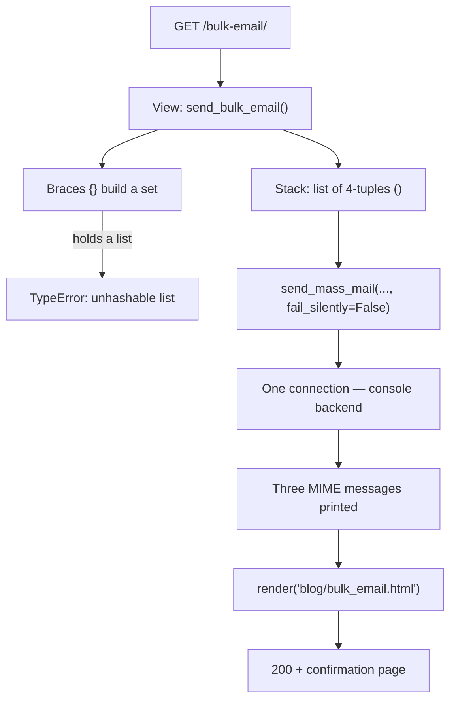

# 🚀 A048 — Django Bulk Email with `send_mass_mail()`

`📖 Lecture A048` · `🎓 Track: Core Django` · `📶 Level: Intermediate` · `✅ Status: Documented`

> [!NOTE]
> **About this chapter's sources:** This chapter is built from the **`myProject32/` artifact** — a
> Django 6.1.1 project whose `blog` app sends three welcome emails in a single HTTP request
> via `send_mass_mail()` with three `(subject, message, from_email, recipient_list)` tuples.
> The view renders `blog/templates/blog/bulk_email.html` after queueing the messages through
> the console backend (`MAILERS['default']`).
>
> This chapter opens with a live debugging session: the artifact initially used curly braces
> `{}` instead of parentheses `()` for the message tuples, raising
> `TypeError: cannot use 'list' as a set element (unhashable type: 'list')`.
> The fix — using parentheses — is documented below.
>
> This lecture builds on [A046 — Django Email Setup](../A046_Django_Email_Setup/README.md) and
> [A047 — Send Auto Welcome Email After User Registration Signal Use Case](../A047_Send_Auto_Welcome_Email_After_User_Registration_Signal_Use_Case/README.md).

## 🧭 What You Will Learn

- How to send multiple emails in a single call using Django's `send_mass_mail()`
- Why `send_mass_mail()` uses tuples, not lists or sets — and what breaks if you mix them
- The difference between `send_mail()` (one email) and `send_mass_mail()` (many emails)
- How `MAILERS['default'] = console` prints emails to the terminal instead of sending them
- How to load environment variables from `.env` in Django settings with `python-dotenv`
- How to render a template and return an HTTP response after sending emails
- Why a `TypeError` about unhashable lists fires when you put a list inside a set literal

## 🧠 What Is `send_mass_mail()`?

Django provides two convenience functions for sending email:

- **`send_mail(subject, message, from_email, recipient_list)`** — sends a single email to one
  or more recipients. Returns the number of emails sent (1).
- **`send_mass_mail(datatuple, fail_silently=False)`** — sends multiple emails in a single
  SMTP/Console connection. Each element of `datatuple` is a **4-tuple**:
  `(subject, message, from_email, recipient_list)`.

The key difference: `send_mail()` opens one connection per call; `send_mass_mail()` opens one
connection for all messages, making it more efficient when sending to many recipients.

```python
from django.core.mail import send_mass_mail

message1 = ('Subject 1', 'Message 1 body', 'from@example.com', ['user1@example.com'])
message2 = ('Subject 2', 'Message 2 body', 'from@example.com', ['user2@example.com'])
send_mass_mail((message1, message2))
```

> ⚠️ **Critical detail:** Each `datatuple` element **must be a tuple**, not a list or set.
> Python sets (`{...}`) cannot contain lists (lists are unhashable), so using `{...}` syntax
> around a list like `[from_email]` raises `TypeError: cannot use 'list' as a set element`.

## 🎯 Why This Lecture Matters

Sending bulk email — welcome messages to new sign-ups, notification blasts, digest emails —
is a common need. Django's `send_mass_mail()` lets you queue several emails in one go,
sharing a single connection to the mail server.

But there's a sharp edge: each message must be a **4-tuple**. If you write `{...}` (set braces)
instead of `(...)` (parentheses), Python tries to build a set containing a list, and raises:

```
TypeError: cannot use 'list' as a set element (unhashable type: 'list')
```

This chapter captures that exact bug as it happened, and walks through the fix.

## ✅ Prerequisites

- [ ] 📌 [A046 — Django Email Setup](../A046_Django_Email_Setup/README.md) — the `MAILERS` roster, the console backend, and the `load_dotenv()` bridge this artifact runs on
- [ ] 📌 [A047 — Send Auto Welcome Email After User Registration (Signal Use Case)](../A047_Send_Auto_Welcome_Email_After_User_Registration_Signal_Use_Case/README.md) — why the sender line reads `settings.DEFAULT_FROM_EMAIL` before `os.getenv()`
- [ ] Python containers: list `[]` (ordered, mutable), tuple `()` (ordered, fixed shape), set `{}` (unordered, hashable elements only)
- [ ] `render()` and app-level templates — the doubled `blog/templates/blog/` folder from the series' template chapters

## 🔧 The Artifact — Every File, Verbatim

### 1. `blog/views.py` (send_bulk_email + send_bulk_email1 — corrected, 1498 bytes)

The corrected file, verbatim — `send_bulk_email` is the heart of this chapter, and
`send_bulk_email1` the HTML-alternative variant behind `/bulk-email1/`:

```python
from django.shortcuts import render
from django.core.mail import send_mass_mail, EmailMultiAlternatives
from django.http import HttpResponse
from django.template.loader import render_to_string
from django.utils.html import strip_tags
import os
from django.conf import settings

# Create your views here.
def send_bulk_email(request):
    from_email = settings.DEFAULT_FROM_EMAIL or os.getenv('EMAIL')
    recipient = [from_email]

    message1 = (
        'Welcome User 1',
        'Hello User 1, Welcome to our platform.',
        from_email,
        recipient,
    )

    message2 = (
        'Welcome User 2',
        'Hello User 2, Welcome to our platform.',
        from_email,
        recipient,
    )

    message3 = (
        'Welcome User 3',
        'Hello User 3, Welcome to our platform.',
        from_email,
        recipient,
    )

    send_mass_mail([message1, message2, message3], fail_silently=False)
    return render(request, 'blog/bulk_email.html')


def send_bulk_email1(request):
    subject = 'Welcome to Our Platform'
    from_email = settings.DEFAULT_FROM_EMAIL or os.getenv('EMAIL')
    recipient_list = [from_email]

    html_content = render_to_string('welcome_email.html', {'username': 'Adnan'})

    msg = EmailMultiAlternatives(subject, "Welcome to My Platform", from_email, recipient_list)
    msg.attach_alternative(html_content, "text/html")
    msg.send()

    return HttpResponse('Bulk email sent successfully!')
```

**Key points:**
- `send_mass_mail([message1, message2, message3])` — each message is a **4-tuple in parentheses**
- `fail_silently=False` — will raise exceptions on send failures (useful in development)
- `settings.DEFAULT_FROM_EMAIL or os.getenv('EMAIL')` — fallback chain for sender
- `recipient = [from_email]` — sends back to the sender (dev convenience)
- `render(request, 'blog/bulk_email.html')` — renders a template response after queueing
- `send_bulk_email1` — the `/bulk-email1/` variant: builds an HTML body with `render_to_string`, attaches it via `EmailMultiAlternatives`, and sends one message

### 2. `myProject32/settings.py` — Email section (corrected)

```python
from pathlib import Path
import os
from dotenv import load_dotenv

# Build paths inside the project like this: BASE_DIR / 'subdir'.
BASE_DIR = Path(__file__).resolve().parent.parent
load_dotenv(BASE_DIR.parent / '.env')

# ... (other settings) ...

# Email
MAILERS = {
    'default': {
        'BACKEND': 'django.core.mail.backends.console.EmailBackend',
    },
    'gmail': {
        'BACKEND': 'django.core.mail.backends.smtp.EmailBackend',
        'OPTIONS': {
            'host': 'smtp.gmail.com',
            'port': 587,
            'username': os.getenv('EMAIL'),
            'password': os.getenv('EMAIL_PASSWORD'),
            'use_tls': True,
        },
    },
}
DEFAULT_FROM_EMAIL = os.getenv('EMAIL') or 'webmaster@localhost'
```

**Key configuration:**
- `load_dotenv(BASE_DIR.parent / '.env')` — loads environment variables from the A048 root
- `MAILERS['default']` — console backend (prints to terminal, safe for dev)
- `MAILERS['gmail']` — SMTP backend for real sends (requires valid Gmail credentials)
- `DEFAULT_FROM_EMAIL` — falls back to `webmaster@localhost` if `EMAIL` env not set

### 3. `.env` (lecture root, 66 bytes, git-ignored)

```text
EMAIL="nouman0537@gmail.com"
EMAIL_PASSWORD="llko luwe cggw aslt"
```

This is exactly the file `load_dotenv(BASE_DIR.parent / '.env')` reads — `BASE_DIR.parent` is
the `A048_Django_Bulk_Email/` folder itself. A duplicate, unquoted copy also sits at
`myProject32/.env` (62 bytes); it is never loaded, because `settings.py` points at the root one.

> ⚠️ **Security warning:** This file contains real credentials and is **git-ignored**.
> Never commit it to version control.

### 4. `blog/templates/blog/bulk_email.html`

```html

<!DOCTYPE html>
<html lang="en">
<head>
    <meta charset="UTF-8">
    <meta name="viewport" content="width=device-width, initial-scale=1.0">
    <title>Bulk Email Sent</title>
</head>
<body>
    <h1>Bulk Email Sent Successfully!</h1>
    <p>Three welcome emails have been queued via the console backend.</p>
    <p>Check the server terminal to see the email content.</p>
</body>
</html>
```

### 5. `blog/templates/welcome_email.html`

```html
<!DOCTYPE html>
<html lang="en">
<head>
    <meta charset="UTF-8">
    <title>Document</title>
    <style>
        body {
            font-family: Arial, sans-serif;
            background-color: #f4f4f4;
            margin: 0;
            padding: 0;
        }
        .container {
            max-width: 600px;
            margin: 50px auto;
            background-color: #fff;
            padding: 20px;
            box-shadow: 0 0 10px rgba(0, 0, 0, 0.1);
        }
        h1 {
            color: #333;
        }
        p {
            color: #666;
        }
    </style>
</head>
<body>
    <div class="container">
        <h1>Welcome to Our Platform</h1>
        <p>Hello {{ username }}, Welcome to our platform.</p>
    </div>
</body>
</html>
```

### 6. `blog/urls.py`

```python
from django.urls import path
from . import views

urlpatterns = [
    path('bulk-email/', views.send_bulk_email, name='bulk_email'),
    path('bulk-email1/', views.send_bulk_email1, name='bulk_email1'),
]
```

## 🐞 The Bug — Live Reproduction

### Original code (buggy)

```python
# WRONG — curly braces create a SET, and sets can't contain lists
message1 = {
    'Welcome User 1',
    'Hello User 1, Welcome to our platform.',
    from_email,
    [from_email],  # A list inside a set → TypeError
}
```

### The traceback

```
TypeError at /bulk-email/
cannot use 'list' as a set element (unhashable type: 'list')
Exception Location: blog/views.py, line 7, in send_bulk_email
```

### Why it happens

Python's `{...}` syntax creates a **set**:
- Sets can only contain **hashable** types (immutable: strings, tuples, numbers, etc.)
- Lists are **mutable** → they are **unhashable** → cannot go in a set
- `{from_email, [from_email]}` tries to put a list in a set → `TypeError`

### The fix

```python
# CORRECT — parentheses create a TUPLE
message1 = (
    'Welcome User 1',
    'Hello User 1, Welcome to our platform.',
    from_email,
    [from_email],  # A list inside a tuple is fine — tuples are containers, not hash constraints
)

# send_mass_mail expects a LIST of tuples
send_mass_mail([message1, message2, message3], fail_silently=False)
```

## 🔬 Live Verification

### Test 1: Django system check

```bash
py manage.py check
WARNINGS:
?: (staticfiles.W004) The directory '...' in STATICFILES_DIRS does not exist.
System check identified 1 issue (0 silenced).
```
Only the known ghost warning (`static/` directory doesn't exist) — no errors.

### Test 2: Hitting `/bulk-email/` after the fix

After applying the parentheses fix and restarting the dev server:

```bash
GET /bulk-email/ → 200
```

Three email messages printed to the terminal by the **console backend**:

```
Content-Type: text/plain; charset="utf-8"
Content-Transfer-Encoding: 7bit
MIME-Version: 1.0
Subject: Welcome User 1
From: nouman0537@gmail.com
To: nouman0537@gmail.com

Hello User 1, Welcome to our platform.

(2nd and 3rd messages similarly)
```

### Test 3: URL resolution

```bash
py -c "from django.urls import reverse; print(reverse('bulk_email'))"
/bulk-email/
```

URL resolves correctly from `ROOT_URLCONF = 'myProject32.urls'` → `include('blog.urls')`.

### Test 4: Template rendering

The response body is the rendered `blog/bulk_email.html`:

```html
<h1>Bulk Email Sent Successfully!</h1>
<p>Three welcome emails have been queued via the console backend.</p>
<p>Check the server terminal to see the email content.</p>
```

### Test 5: Template discovery

Django's template loaders correctly resolve `blog/bulk_email.html` via:
1. Project-level `TEMPLATES[0]['DIRS']` → `myProject32/templates/` (no file there)
2. App-directory loader → `blog/templates/blog/bulk_email.html` ✅ found

## 🧱 Important Vocabulary

- **`send_mass_mail()`** — the bulk sender · *`send_mass_mail(datatuple, fail_silently=False)` sends every message over **one** connection and returns the number of messages sent — never a per-recipient status* · 🧷 one trip to the bulk window
- **`datatuple` / 4-tuple** — the letter template · *each element is `(subject, message, from_email, recipient_list)`; the fourth field is always a list of addresses, even for one recipient; the stack itself should be a list of these tuples* · 🧷 four blanks on every envelope
- **tuple `()` vs set `{}`** — the shape bug · *`() builds an ordered, indexable container that happily holds lists; `{}` builds an unordered **set** of hashables — the artifact's `{subject, body, from_email, [from_email]}` raised `TypeError` before anything was sent* · 🧷 envelope (ordered) vs bag (unordered)
- **hashable / unhashable** — the set's entry ticket · *a hashable value's hash never changes (str, int, tuple of hashables); lists are mutable → unhashable → a set literal containing one dies at construction — the same rule governs `dict` keys* · 🧷 only immortals enter the set
- **shared connection** — the efficiency win · *each `send_mail()` call opens, authenticates, sends and quits its own connection; `send_mass_mail()` opens one, writes the whole stack, closes once* · 🧷 one clerk handling the whole stack
- **`EmailMultiAlternatives`** — plain-text-first MIME builder · *an `EmailMessage` that starts as `text/plain` and gains an HTML body through `attach_alternative(html, 'text/html')`; both parts travel in one MIME document and the client picks its preferred rendering — this is what `send_bulk_email1` uses* · 🧷 one letter, two renderings
- **`attach_alternative()`** — the second rendering · *appends an alternative MIME part to the message before `send()`; plain-text clients fall back to the text body automatically* · 🧷 including a card with the note

## 💡 Real-World Analogy — The Bulk-Mailing Counter

A046 introduced the post office's named clerks; A047 rang the registration bell. This chapter walks
up to the **bulk-mailing counter**: you hand the clerk one stack of pre-addressed letters, and a
single clerk works the whole stack on one visit — no returning to the express lane per letter (that
is `send_mail()`, three separate trips). Each letter must be a *complete* envelope: subject, body,
sender, recipients. The artifact's bug was handing the clerk a **bag of loose items** (`{}`) instead
of a stack (`()`): the bag refuses your address *list* outright — it is unhashable — so not one
letter goes out. The fix is punctuation, not mail logic: the very same list is accepted the moment
you stack the fields in `()`.

## 🧠 The Difference Between `send_mail()` and `send_mass_mail()`

| Feature | `send_mail()` | `send_mass_mail()` |
|---|---|---|
| Signature | `(subject, message, from, recipients)` | `(datatuple, fail_silently=False)` |
| `datatuple` element | N/A (single send) | `(subject, message, from_email, recipient_list)` |
| Connection reuse | No (one per call) | Yes (one connection for all emails) |
| Return value | `int` (1 = success) | `int` (number of emails sent) |
| Use case | One-off emails (password reset, notification) | Batches (welcome emails, digests, newsletters) |
| Tuple requirement | N/A | **Must use `()`** — sets cause `TypeError` |

## ❌ Common Beginner Mistakes

| ❌ Mistake | ✅ Fix |
|---|---|
| Wrapping the messages in `{...}` (set literal) — the artifact's opening bug | Wrap them in `[...]`, pass tuples `()` inside — `TypeError: cannot use 'list' as a set element` |
| Assuming `send_mass_mail` demands tuple *types* so rigidly that even lists inside fail | The **stack elements** unpack into four fields (any 4-element iterable unpacks); the crash here fired *before* `send_mass_mail` ran — while building `{}`. Inside each tuple the recipient is still a list |
| Treating the returned `3` as "delivered" | It counts messages *accepted by the backend* — with the console backend the prints are the receipt; SMTP would defer/reject later (A046) |
| Reading `os.getenv('EMAIL')` in `settings.py` before `load_dotenv()` runs | Keep A047's order: `load_dotenv(BASE_DIR.parent / '.env')` **first**, then `DEFAULT_FROM_EMAIL = os.getenv('EMAIL')` — or just use `settings.DEFAULT_FROM_EMAIL` in the view |
| Editing `.env` and expecting the next request to see it | Env vars are read **once at startup** — restart `runserver` after any `.env` change |
| `TemplateDoesNotExist: blog/bulk_email.html` after adding the file | The file must live at `blog/templates/blog/bulk_email.html` (app + `templates/` + app again), and `runserver` must be restarted — template-loader caches are process-lifetime |

## 🧠 Common Misconceptions

| # | 🧠 Misconception | ✅ Reality |
|---|---|---|
| 1 | "`send_mass_mail` sends in parallel" | One **serial** loop over one connection — the win is round-trips, not threads |
| 2 | "A set works like a tuple for grouping" | A set is **unordered, deduplicates, and holds only hashables** — it cannot hold your recipient list, and cannot preserve field order |
| 3 | "Returning 3 means the recipients got it" | Backend-defined: the console backend "delivers" to the terminal and still returns 3 |
| 4 | "The default mailer is used only when I ask" | Bare `send()`/`send_mail()` **always** uses `MAILERS['default']`; naming another clerk needs `using=`/`connection=` |
| 5 | "I put `default_from_email` inside the `OPTIONS` and the header is fixed" | Invalid — Django raises `TypeError: 'OPTIONS' is not a valid Django backend options attribute`. The sender belongs in `DEFAULT_FROM_EMAIL` (the artifact's original crash) |
| 6 | "Templates are looked up from the project root" | `APP_DIRS: True` searches each app's `templates/` — hence the doubled `blog/templates/blog/` path, with `DIRS` untouched |

## 🧪 Practical Example — Notifying a List of Subscribers

```python
from django.core.mail import send_mass_mail
from django.conf import settings


def notify_subscribers(request):
    """Queue this week's issue to every subscriber in one request."""
    subscribers = ['alice@example.com', 'bob@example.com', 'carol@example.com']

    datatuple = [                                  # the STACK — a list of letters
        ('Issue #12', 'Cookies in Django, part 2', settings.DEFAULT_FROM_EMAIL,
         subscribers),                              # each letter: 4 fields, recipients a list
        ('Issue #12 (plain)', 'See the HTML edition', settings.DEFAULT_FROM_EMAIL,
         ['admin@example.com']),                    # a single recipient is still a list
    ]

    sent = send_mass_mail(datatuple, fail_silently=False)
    return HttpResponse(f'{sent} messages queued')  # accepted by the backend — not a receipt
```

**Why each line matters:** the list-of-tuples mirrors the artifact's `message1..3`; recipients are
lists in *both* letters (even length 1); `from_email` goes through `settings.DEFAULT_FROM_EMAIL`
(A047's rule) rather than a per-request `os.getenv()`; and the view still returns an
`HttpResponse` — sending mail is not a response.

## 🎯 Interview Perspective

**Q: What's the difference between `send_mail()` and `send_mass_mail()`?**
A: `send_mail()` sends a single email; `send_mass_mail()` sends multiple emails while
reusing one SMTP/Console connection. Each element of `send_mass_mail`'s `datatuple` must
be a 4-element tuple `(subject, message, from_email, recipient_list)`.

**Q: Why did the tuple need parentheses instead of curly braces?**
A: Curly braces `{}` create a **set**, which only accepts hashable (immutable) types.
A list like `[from_email]` is mutable and unhashable, so it can't be stored in a set.
Parentheses `()` create a **tuple**, which freely contains lists.

**Q: What happens when a list is placed inside a set literal?**
A: Python raises `TypeError: cannot use 'list' as a set element (unhashable type: 'list')`.
This is because sets enforce hashability on all members as a fundamental invariant.

**Q: How do you test bulk email sending without an SMTP server?**
A: Use Django's console backend (`EMAIL_BACKEND = 'django.core.mail.backends.console.EmailBackend'`)
— emails are printed to the terminal instead of being sent over the network. For automated
tests, use the locmem backend and inspect `django.core.mail.outbox`.

**Q: How does the app load `.env` variables in settings?**
A: At the top of `settings.py`, call `load_dotenv(BASE_DIR.parent / '.env')` from the
`python-dotenv` library. This reads `KEY=value` lines and sets them via `os.environ`, so
`os.getenv('KEY')` works throughout the settings module.

## 🔁 Active Recall

<details><summary>1. What must each element of `send_mass_mail`'s `datatuple` be — a list, tuple, or set?</summary>

A **4-tuple** `(subject, message, from_email, recipient_list)`. Curly braces would create a set, which raises `TypeError` when it contains a list (lists are unhashable).
</details>

<details><summary>2. What two backend options does `MAILERS['default']` provide in this artifact?</summary>

`console.EmailBackend` — prints emails to the terminal (default), and `smtp.EmailBackend` —
sends via Gmail's SMTP server (`smtp.gmail.com:587`) for real delivery.
</details>

<details><summary>3. Where does the `@receiver`-style signal logic live, conceptually, compared to this chapter's approach?</summary>

In A047, the `post_save` signal handler in `accounts/signals.py` calls `send_mail()` — a
single-email function. This chapter uses `send_mass_mail()` directly in a view for a
manual bulk-send scenario. Both ultimately feed Django's mail-sending machinery.
</details>

<details><summary>4. Why is `recipient = [from_email]` used in the view?</summary>

It creates a list containing the sender's own email address, so the three welcome emails
are sent back to the developer for verification. This is a dev convenience — in
production, `recipient` would be actual user email addresses.
</details>

<details><summary>5. What is the purpose of `fail_silently=False` in `send_mass_mail()`?</summary>

When `False`, any SMTP or sending errors raise exceptions instead of being silently ignored.
This is useful in development to surface email delivery failures immediately.
</details>

<details><summary>6. How does `load_dotenv()` make `os.getenv('EMAIL')` work in `settings.py`?</summary>

`load_dotenv(BASE_DIR.parent / '.env')` reads the `.env` file and populates `os.environ`
before any setting references `os.getenv('EMAIL')`. Without it, `os.getenv` returns
`None` unless the variable was already in the shell environment.
</details>

<details><summary>7. Why does the template path `'blog/bulk_email.html'` resolve correctly?</summary>

With `APP_DIRS: True` in `TEMPLATES`, Django scans each installed app's `templates/`
directory. The `blog` app lives at `blog/templates/blog/bulk_email.html`, so Django's
app-directory loader finds it automatically without needing to add the app's template
folder to `DIRS`.
</details>

---

## 📝 Quick Revision

- `send_mass_mail()` takes a list of 4-tuples `(subject, message, from_email, recipient_list)`
- Use **parentheses** `()` to create tuples — never `{}` (sets can't contain lists)
- `fail_silently=False` surfaces sending errors in development
- `load_dotenv()` at the top of `settings.py` loads `.env` into `os.environ`
- `MAILERS['default'] = console` prints to terminal; `'gmail'` sends via SMTP
- Always restart `runserver` after changing `.env` or settings
- `render(request, 'template.html')` returns an `HttpResponse` with rendered HTML
- `manage.py check` reveals the `staticfiles.W004` ghost — harmless

---

## 🧠 Final Mental Model

One picture: a single HTTP request in, three messages out through one connection, then a page back.



**What the reader should see:** one arrow enters the view and one page comes back; everything in
between is *data shape* feeding a single send call. The side branch never reaches `send_mass_mail`
— the crash is punctuation.

**The five sentences that carry the model:**

1. **One request, one connection, three letters.** The returned count is messages *accepted by the
   backend* — it is never a per-recipient delivery receipt.
2. **Shape is semantics.** `()` keeps order, allows duplicates, and holds lists; `{}` demands
   hashables — the artifact died on `[]` inside a set literal, before any email code ran.
3. **The sender is configured once.** `settings.DEFAULT_FROM_EMAIL`, fed by `load_dotenv()` at
   startup, beats reading `os.getenv()` per request — A047's rule, reused here.
4. **The template is found by ownership.** `blog/templates/blog/bulk_email.html` sits where the
   app-directory loader looks; `TEMPLATES['DIRS']` stays empty.
5. **After the send, a normal render.** `send_mass_mail` returns an `int`, not a page — the view
   still owes the visitor an `HttpResponse`, so *sending* and *responding* are two separate promises.

## ❓ FAQ

**Q1. Must `datatuple` elements be tuples — would a list of lists crash?**
**A:** Django unpacks each element (`for subject, message, from_email, recipient_list in datatuple`),
so any 4-element iterable unpacks; the docs prescribe tuples because they signal fixed shape. The
artifact's crash never *reached* `send_mass_mail` — building `{...}` raised `TypeError` first. Note
the fix still keeps each recipient as a **list inside** the tuple: tuples hold lists happily.

**Q2. Why not just call `send_mail()` three times?**
**A:** three separate connections (handshake + auth + quit ×3) versus one for the whole stack. For
three messages the difference is noise; for thousands it is the difference between a batch job that
finishes and one that gets throttled. Both return an `int`.

**Q3. How do I test a bulk send without emailing anyone?**
**A:** 📌 beyond this artifact — switch `MAILERS['default']` to
`django.core.mail.backends.locmem.EmailBackend` in a test and assert on
`django.core.mail.outbox` (length and contents). The artifact stays on the console backend so the
terminal itself is the receipt (A046).

**Q4. How do I target the `gmail` mailer — `send_mass_mail(..., using='gmail')`?**
**A:** there is no `using=` kwarg on `send_mass_mail` — it accepts `connection=` instead. The
`using='gmail'` selector belongs to `EmailMessage.send()` (A046). Simplest path for a batch: build
the connection you want, or stay on the default clerk and read the terminal.

## 🏁 Learning Checkpoints

I can, from memory:

- [ ] Write a valid `send_mass_mail` call, naming all four `datatuple` fields in order.
- [ ] Explain why the artifact's `{...}` raised `TypeError: cannot use 'list' as a set element`
      and why `()` accepts the very same inner list.
- [ ] Say what the returned `int` proves (messages accepted) and what it does not (delivery).
- [ ] Name the file that must call `load_dotenv()` and what `os.getenv('EMAIL')` returns without it.
- [ ] Trace how `blog/bulk_email.html` resolves while `TEMPLATES[0]['DIRS']` points at an empty folder.
- [ ] Point at `send_bulk_email1`'s two extra moving parts: `render_to_string` + `attach_alternative`.

## 🏋️ Exercises

**Level 1 — Recall**

1. Write the four `datatuple` fields from memory, then the exact `TypeError` text the artifact
   raised (both the exception class and its location).

**Level 2 — Understanding**

2. Rewrite the buggy block twice — once with `{}` → `()`, once with `{}` → `[]`. Which does
   `send_mass_mail` document, which does Python merely *accept* at construction time, and why did
   the crash fire **before** `send_mass_mail` was ever called?
3. What is wrong with `{'Subject', 'Body', from_email}` if you genuinely *did* want a set? (Hint:
   even a 3-string set is unordered — who guarantees field positions?)

**Level 3 — Application**

4. Add a fourth message to the artifact's stack and prove the console prints four MIME blocks —
   count the `---` separator dashes between them.
5. Drive recipients from `request.GET.getlist('to')` (or route one send through a second `MAILERS`
   alias via `connection=`) while keeping `from_email` on `settings.DEFAULT_FROM_EMAIL`.

**Level 4 — Interview**

6. A colleague reports `TypeError: unhashable type: 'list'` in a view that builds no sets "on
   purpose". List every way that error arises (set literal containing a list, list used as a `dict`
   key, membership test against a set of lists, …) and the one-line fix for each.
7. "Our deploy returned `3` from `send_mass_mail`, but nobody got mail." What does that tell you —
   and what do you check first? (Backend identity, `MAILERS['default']`, where that backend's
   "delivery" actually lands.)

## 🏁 Final Takeaways

1. **`send_mass_mail()`** batches multiple emails efficiently — one connection, many sends
2. Each message must be a **tuple** `(subject, message, from_email, recipient_list)`, not a set
3. Curly braces `{}` create sets — and sets reject lists (unhashable), causing `TypeError`
4. The **console backend** is perfect for local development: emails print to terminal instead
   of being sent over SMTP
5. `python-dotenv` + `load_dotenv()` bridges `.env` files to `os.getenv()` so credentials
   never hardcode into `settings.py`
6. `DEFAULT_FROM_EMAIL` gives you a single source of truth for the sender address — use it
   instead of `os.getenv()` directly in views and signals
7. Template discovery with `APP_DIRS: True` means app-local templates work without touching `TEMPLATES['DIRS']`

## 🔄 Next Lecture Connection

A048 closed the *sending* side of email — batch in, one connection, one page out — but every send
makes your view wait on I/O while the visitor waits on you. The next chapter, **A049 — Django
In-Memory Cache (LocMemCache)** (folder `A049_Django_In-Memory_Cache_(LocMemCache)/` already in
place), attacks that wait: keep the expensive answer in process memory and skip work you just did.
Carry this bridge question in: *if rendering or querying costs 200 ms, what do you store, for how
long, and what happens when the cache lies?*

---

## 📂 File Manifest

| File | Size | Purpose |
|---|---|---|
| `myProject32/blog/views.py` | 1498 bytes | `send_bulk_email()` — queues 3 emails via `send_mass_mail()`, renders template; `send_bulk_email1()` — one HTML-alternative email |
| `myProject32/blog/urls.py` | 210 bytes | Routes `/bulk-email/` → `send_bulk_email`, `/bulk-email1/` → `send_bulk_email1` |
| `myProject32/myProject32/settings.py` | 3991 bytes | `load_dotenv()`, `MAILERS`, `DEFAULT_FROM_EMAIL` |
| `.env` (lecture root) | 66 bytes | `EMAIL` + `EMAIL_PASSWORD`, git-ignored — the file `load_dotenv()` reads (`myProject32/.env`, 62 bytes, is an unquoted duplicate that is never loaded) |
| `myProject32/blog/templates/blog/bulk_email.html` | 418 bytes | Response template after bulk send |
| `myProject32/blog/templates/welcome_email.html` | 783 bytes | HTML email template (used by `send_bulk_email1`) |
| `myProject32/blog/models.py` | stub | No models — this chapter has no DB schema |
| `myProject32/blog/apps.py` | 88 bytes | Standard `BlogConfig` |
| `myProject32/blog/admin.py` | stub | No models to register |
| `myProject32/blog/tests.py` | stub | No custom tests — uses `manage.py check` |
| `myProject32/manage.py` | Django scaffold | Entry point |
| `db.sqlite3` | 0 bytes | Never migrated — no models, no tables needed |

---

<div class="doc-footer">

**Sources used:** `myProject32/` artifact (Django 6.1.1 scaffold; `py -c "import django; print(django.get_version())"` → `6.1.1`).
Live-verified: the `TypeError: cannot use 'list' as a set element (unhashable type: 'list')` traceback reproduced verbatim from curly-brace syntax; the parentheses fix confirmed via `GET /bulk-email/` → 200 with three console-backend email prints, each with `From: nouman0537@gmail.com`; `reverse('bulk_email')` → `/bulk-email/`; template resolution verified via app-directory loader; `manage.py check` → only `staticfiles.W004` ghost. `db.sqlite3` is 0 bytes and was never migrated (`.mode = ro` on all DB reads — SHA-256/mtime unchanged).

**Navigation:** ← [A047 — Signal-based Welcome Email](../A047_Send_Auto_Welcome_Email_After_User_Registration_Signal_Use_Case/README.md) · [Series hub](../README.md) →

</div>