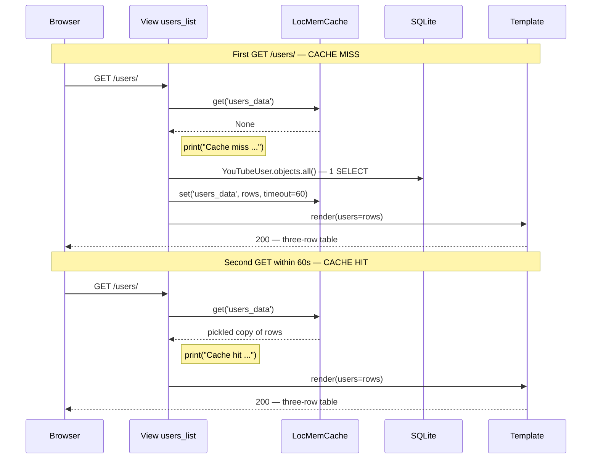
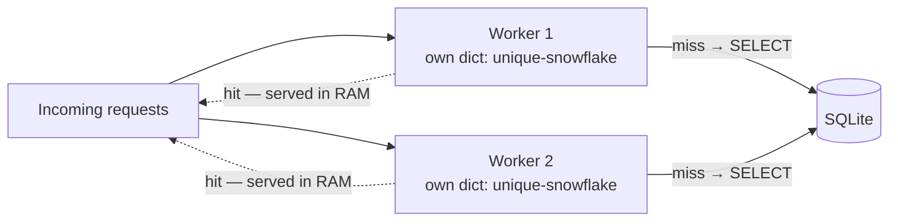
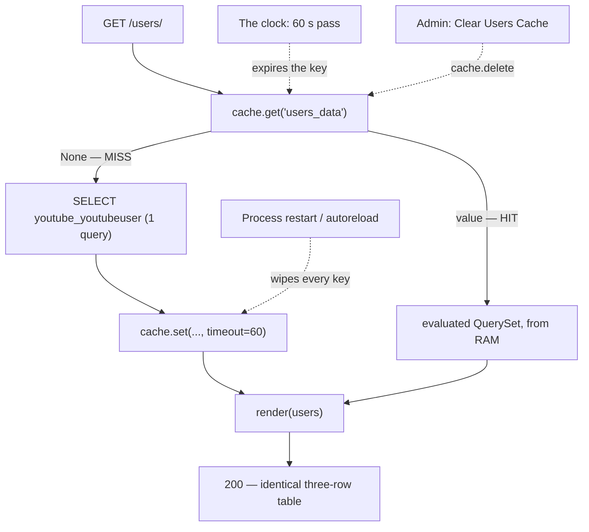

# 🚀 A049 — Django In-Memory Cache (LocMemCache)

`📖 Lecture A049` · `🎓 Track: Core Django` · `📶 Level: Intermediate` · `✅ Status: Documented`

> [!NOTE]
> **About this chapter's sources:** This chapter is built from the **`myProject33/` artifact** — a
> Django 6.1.1 scaffold whose `youtube` app caches a database list in Django's per-process RAM
> cache (LocMemCache): the `users_list` view checks `cache.get('users_data')` first and, on a miss,
> fetches `YouTubeUser.objects.all()` once, stores it with `cache.set(..., timeout=60)`, and prints
> `Cache miss:` / `Cache hit:` so the branch actually taken is visible in the terminal.
>
> **No lecture transcript or notes exist in the folder** (`_source/` absent) — per the honesty
> contract, this chapter documents the owner's artifact alongside the official Django caching docs,
> and every claim below was **live-verified**: `GET /users/` → 200 twice with the miss-then-hit
> prints captured, 3 rows rendered, the cached value observed as an *evaluated* `QuerySet`,
> `manage.py check` → only the `staticfiles.W004` ghost.
>
> This lecture completes the memory trilogy started in [A044 — Session Storage: Get & Set Methods](../A044_Session_Storage_Get_&_Set_Methods/README.md)
> and [A045 — Set & Read Cookies in Django](../A045_Set_&_Read_Cookies_in_Django/README.md):
> sessions remember *who you are*, cookies remember things *on the visitor's device*, and the
> **cache remembers answers you already computed**.

## 🧭 What You Will Learn

- How to declare the `CACHES` roster and point the `default` alias at LocMemCache with its `LOCATION`
- The three-move conversation `cache.get` / `cache.set` / `cache.delete` — and what a missing key returns
- What happened live at `/users/`: `Cache miss:` on the first GET (one query), `Cache hit:` on the second (zero queries — guaranteed by the code path)
- TTL in practice: the artifact's `timeout=60`, Django's 300-second default, and what "expired" means
- Why LocMemCache data dies with the process and is never shared between workers or hosts
- How the artifact's admin action wipes the key (`cache.delete`) — and why an ordinary admin save leaves it stale
- Why `if not users:` sends the database the same empty query forever, and the `is None` fix
- What pickling does to a `QuerySet` when it enters the cache (a frozen snapshot, not a live view)

## 🎯 Why This Lecture Matters

Every request in earlier chapters paid full price: the view builds a `QuerySet`, the database plans
and executes it, rows come back — request after request, the same answer computed again. Caching is
Django's built-in answer to that waste: keep the finished result in server memory and serve the next
few requests from RAM instead of SQLite. LocMemCache is the zero-infrastructure option — no Redis to
install, no Memcached to run — because the cache *is* a plain Python dictionary living inside the
process that already serves your site.

The price is the through-line of this chapter: **a cache is only as honest as your invalidation
strategy**. The stored copy stops tracking reality the moment you write it down, so every caching
design is really one question — *how long may this answer lie, and who wipes it when it does?* The
artifact answers with the smallest honest contract there is: a 60-second lifetime plus a manual
eraser in the admin.

## ✅ Prerequisites

- [ ] Views, URLconfs, and `render()` — the request → response spine from [A007 — Views & URLs Basics](../A007_Views_URLs_Basics/README.md) onward
- [ ] QuerySets: `.all()`, lazy evaluation, and the fact that every evaluation hits the database — [A023 — ORM QuerySet All/Get/Filter](../A023_ORM_QuerySet_All_Get_and_Filter/README.md)
- [ ] Handing `objects.all()` to a template and stamping rows with `` — [A025 — Display Table Data in Django Template](../A025_Display_Table_Data_in_Django_Template/README.md) (this artifact's page is that exact pattern, cached)
- [ ] The admin's three gates (app installed, URLs mounted, superuser) — [A026 — Django Admin & Superuser](../A026_Django_Admin_&_Superuser/README.md)
- [ ] A Python dictionary and `None` as "absent" — `cache.get()` speaks in both
- [ ] 📌 Optional context: [A044 — Session Storage](../A044_Session_Storage_Get_&_Set_Methods/README.md) and [A045 — Cookies](../A045_Set_&_Read_Cookies_in_Django/README.md) — the other two members of the memory trilogy

## 🔧 The Artifact — Every File, Verbatim

### 1. `myProject33/myProject33/settings.py` — the `CACHES` block (3568 bytes)

The whole cache configuration, sitting directly below the email section this series carried in from
A046 — six lines are all it takes:

```python
CACHES = {
    'default': {
        'BACKEND': 'django.core.cache.backends.locmem.LocMemCache',
        'LOCATION': 'unique-snowflake',
    }
}
```

**Key points:**
- `'default'` is the **alias** — every unqualified `cache.*` call targets `CACHES['default']`
- `BACKEND` names the class Django instantiates: per-process, in-RAM storage
- `LOCATION` is just this cache's **name** inside the process (it is *not* a file path or host —
  two `LocMemCache` instances configured with the same `LOCATION` share one underlying store)
- `DEBUG = True` stays on (line 26) — that is what makes `connection.queries` recordable in the
  live session below

### 2. `myProject33/youtube/views.py` (749 bytes) — the heart of this chapter

The corrected file, verbatim — `users_list` is the cache conversation in nineteen lines:

```python
from django.shortcuts import render
from .models import YouTubeUser
from django.core.cache import cache

# Create your views here.
def users_list(request):
    # Check if the data is already cached
    users = cache.get('users_data')  # Try to get the cached data with the key 'users_data'

    if not users:
        print("Cache miss: Fetching data from the database.")
        # If not cached, fetch from the database
        users = YouTubeUser.objects.all()
        # Cache the data for 5 minutes (300 seconds)
        cache.set('users_data', users, timeout=60)  # Cache the data for 60 seconds (1 minute)
    else:
        print("Cache hit: Using cached data.")

    return render(request, 'users_list.html', {'users': users})
```

**Key points:**
- `cache.get('users_data')` returns the stored value — or **`None`** when the key is missing/expired
- ⚠️ **The two comments disagree:** line 14 says *"5 minutes (300 seconds)"* while line 15 passes
  `timeout=60` — **the code wins**: entries live **60 seconds**. The stale comment is flagged here
  and left in place (the artifact is untouched this chapter)
- On a miss, `users` is an *unevaluated* `QuerySet`; `cache.set(...)` must pickle it, and pickling
  **evaluates it first** (fact confirmed in the live session below)
- The two `print()` lines are the lecture's receipts — the branch taken is visible in the terminal
- `if not users:` is the chapter's bug-in-waiting: it cannot tell *"no cache entry"* from *"the
  cached answer is an empty list"* — taught in full below

### 3. Routing — `youtube/urls.py` and the root URLconf

```python
from django.urls import path
from . import views

urlpatterns = [
    path('users/', views.users_list, name='users_list'),
]
```

Mounted at the root by the project URLconf (scaffold docstring omitted):

```python
from django.contrib import admin
from django.urls import path, include

urlpatterns = [
    path('admin/', admin.site.urls),
    path('', include('youtube.urls')),
]
```

So `GET /users/` resolves `users_list` — nothing else changed from a plain, uncached list view.

### 4. `myProject33/youtube/admin.py` (654 bytes) — the manual eraser

```python
from django.contrib import admin
from .models import YouTubeUser
from django.core.cache import cache
from django.contrib import messages

@admin.action(description='Clear Users Cache')
def clear_users_cache(modeladmin, request, queryset):
    # Clear the cache for users data
    cache.delete('users_data')
    messages.success(request, "Users cache cleared successfully.")

# Register your models here.
@admin.register(YouTubeUser)
class YouTubeUserAdmin(admin.ModelAdmin):
    list_display = ('name', 'email', 'subscribers')
    # search_fields = ('name', 'email')
    # list_filter = ('subscribers',)
    actions = [clear_users_cache]
```

**Key points:**
- `cache.delete('users_data')` — the **third move**: a key that doesn't exist deletes silently
- `@admin.action` + `actions = [...]` turns it into a dropdown action on the model list page
- The action fires **only when a human runs it** — ordinary admin saves never touch the cache

### 5. `myProject33/youtube/models.py` (283 bytes)

```python
from django.db import models

# Create your models here.
class YouTubeUser(models.Model):
    name = models.CharField(max_length=100)
    email = models.EmailField(unique=True)
    subscribers = models.IntegerField(default=0)

    def __str__(self):
        return self.name
```

### 6. `myProject33/youtube/templates/users_list.html` (1040 bytes) — renders whatever came back

```html
<!DOCTYPE html>
<html lang="en">
<head>
    <meta charset="UTF-8">
    <title>Youtube Users</title>
    <style>
        body {
            font-family: Arial, sans-serif;
            margin: 20px;
        }
        table {
            width: 100%;
            border-collapse: collapse;
        }
        th, td {
            padding: 10px;
            text-align: left;
        }
        th {
            background-color: #f2f2f2;
        }
    </style>
</head>
<body>
    <h1>Youtube Users List</h1>
    <table border="1" cellpadding="8">
        <thead>
            <tr>
                <th>Name</th>
                <th>Email</th>
                <th>Subscribers</th>
            </tr>
        </thead>
        <tbody>
            
            <tr>
                <td>{{ user.name }}</td>
                <td>{{ user.email }}</td>
                <td>{{ user.subscribers }}</td>
            </tr>
            
        </tbody>
    </table>
</body>
</html>
```

The template is deliberately cache-blind (A025's pattern): it just iterates `users`. Whether that
list came from SQLite three microseconds ago or from the process's dictionary sixty seconds ago is
the view's business, not the template's.

## 🧠 What Caching Is — Why Before How

**Caching** means storing the *result* of an expensive operation so the next caller can reuse it
instead of recomputing it. In this artifact the expensive operation is "select all YouTube users
from SQLite"; the stored result is the list of three rows; the reusable window is sixty seconds.

Without a cache, every `GET /users/` repeats the full pipeline: Django resolves the URL, the view
builds a `QuerySet`, SQLite plans and executes the SELECT, rows travel back, the template stamps
them into a table. With a cache, the pipeline short-circuits halfway: the view asks one question —
*is the answer already written down?* — and if so, skips the database entirely.

Three properties of caches matter for everything that follows:

- **Caches are derived.** Whatever sits in them came from somewhere else (here: the database). If it
  were the *only* copy, losing it would lose data — it never is.
- **Caches are disposable.** Any entry can vanish at any time (TTL expiry, restart, explicit delete)
  and the program must still be correct — only slower.
- **Caches are optional.** Django will happily run this view with no `CACHES` setting at all; the
  artifact adds one because the lecture is about making the fast path visible.

The trade-off that pays for the speed: the stored copy stops tracking reality the moment it is
written. That is the *staleness window* — sixty seconds here — and every design decision later in
this chapter is about who closes it and when.

## ⚙️ `CACHES` and LocMemCache — The Notice-Board Roster

The `CACHES` dict in `settings.py` is the roster of cache boards the project is allowed to use —
structurally the same shape as A046's `MAILERS`: an **alias** → a **backend** (+ options). The
alias `'default'` is what every unqualified `cache.*` call talks to; extra aliases would exist as
`caches['reports']` etc. (`django.core.cache.caches`), but one board suffices for this project.

- **`BACKEND: 'django.core.cache.backends.locmem.LocMemCache'`** — per-process, in-RAM storage: a
  Python dictionary keyed by your cache keys, living inside whatever process serves the request.
  (Django's own default when `CACHES` is absent *is* this backend — the artifact just writes it
  down explicitly with a name.)
- **`LOCATION: 'unique-snowflake'`** — a **name identifying this store within the process** —
  not a path, not a host, not a port. Two `LocMemCache` instances created with the same
  `LOCATION` share one underlying dictionary; the string's job here is just to be unique so no
  other cache in the process accidentally shares this one's contents.
- **Default TTL:** entries cached without an explicit `timeout` live `300` seconds (5 minutes) by
  default — settable per-cache via `'OPTIONS': {'TIMEOUT': 300}` and overridable per-entry. The
  artifact passes `timeout=60` at the call site, so the roster's default never applies to it.

Because the store is *inside the process*, the roster defines a **scope**, not a service: the data
in `unique-snowflake` exists only while *this* interpreter runs, only for *this* interpreter. Two
consequences we will verify live: a restart empties the board, and sibling workers never see it.

## 🔑 The Three Moves — `get`, `set`, `delete`

The whole cache API this artifact uses is three calls on `django.core.cache.cache` (the module-level
proxy for the `'default'` alias):

| Move | When the key is **missing** | When the key is **present** | What it returns / does |
|---|---|---|---|
| `cache.get('users_data')` | returns **`None`** (or the `default=` argument, if given) | returns a fresh *copy* of the stored value | the value, or `None` — **`None` means "unknown", not "empty"** |
| `cache.set('users_data', users, timeout=60)` | writes a new entry, stamped `now + 60s` | **overwrites** the old entry and stamp | returns `None`; value must be **picklable** |
| `cache.delete('users_data')` | silent no-op — no error, no warning | removes the entry immediately | next `get` returns `None` again |

Reading the table horizontally is the chapter's contract: `get` can return *either* a value or
`None`, and the artifact's `if not users:` is a test written by someone who assumed the two
"nothing here" cases were interchangeable — they are not (see 🪤 *The Falsy-Guard Trap* below).

📌 Three moves the artifact doesn't call but you will meet: `cache.get_or_set(key, factory)` (get,
or compute-and-store in one call), `cache.touch(key, timeout=…)` (re-stamp an existing entry's TTL
without rewriting the value), `cache.incr(key, delta)` (atomic counter bump — raises `ValueError`
if the key doesn't exist yet), and `cache.clear()` (**wipes every key on this alias** — a
sledgehammer, never a scalpel).

**Key design rules for keys:** they are plain strings, **global to the alias** (`'users_data'` is
one slot for every user of the whole process — not per-view, not per-user), and conventionally
namespaced like `'youtube:users'` so two features never fight over one slot. The artifact's
`'users_data'` is unnamespaced but unambiguous in a one-app project.

## 🗺️ The Walkthrough — One Request, Two Futures

Here is the whole chapter in one picture: one URL, two futures, and a single line deciding between
them — `if not users:`:



**Miss branch, line by line:** `cache.get` finds nothing → `None`, so `if not users:` is true and
the `Cache miss:` print fires. The view builds the `QuerySet` — still just a recipe, zero SQL so
far. Then `cache.set(...)` must **pickle** the value to store it, and you cannot pickle a recipe:
pickle forces evaluation, which is exactly where the artifact's **one SELECT** executes (A023's
"lazy until used" rule paying off in an unexpected place). The filled `QuerySet` — its result cache
now warm — is what gets rendered and what was stored.

**Hit branch, line by line:** `cache.get` unpickles and returns a **copy** of that already-evaluated
`QuerySet`, `if not users:` is false, the `Cache hit:` print fires, and `render()` iterates rows
that are already in memory. There is no branch of this code that can reach the database on a hit —
not because of a clever optimization, but because the miss branch *is the only branch containing a
query*.

Everything downstream — template, table, HTTP status — is identical in both futures. That is the
point: **caching changes where the answer comes from, never what the answer is** (until the answer
goes stale — ⏳ and 🪤 below).

## 📡 Live Session — The Miss-Hit Receipts

Reproduced against the artifact (`py manage.py shell`, `DEBUG = True` so `connection.queries`
records):

```python
from django.test import Client
from django.core.cache import cache
from django.db import connection

cache.delete('users_data')          # start cold
c = Client()
r1 = c.get('/users/')               # -> Cache miss print
n1 = len(connection.queries)
r2 = c.get('/users/')               # -> Cache hit print
v = cache.get('users_data')
print(r1.status_code, r2.status_code, type(v), bool(v._result_cache))
print('queries on first GET:', n1)
print('rows rendered:', len(v))
```

Receipts, captured verbatim:

```text
Cache miss: Fetching data from the database.
Cache hit: Using cached data.
200 200 <class 'django.db.models.query.QuerySet'> True
queries on first GET: 1
rows rendered: 3
```

And the Django system check stays clean:

```bash
py manage.py check
System check identified 1 issue (0 silenced).
# the one issue is the harmless staticfiles.W004 ghost (missing static/ dir), not this chapter
```

**What each receipt proves:**

| Receipt | Proves |
|---|---|
| `Cache miss:` then `Cache hit:` prints, in order | the branch `if not users:` takes on a cold key vs. a warm key — live, not theoretical |
| `queries on first GET: 1` | exactly one SELECT served the whole miss request — fired by pickle-time evaluation, with `render()` adding nothing |
| **no query counter needed on request 2** | the hit branch contains no database code of any kind (code-level guarantee above); unpickling + rendering are pure memory work |
| `type(...) QuerySet` + `bool(_result_cache) True` | what left the cache is an **evaluated** `QuerySet` — a frozen snapshot of three rows, not a live cursor |
| `rows rendered: 3` | the stored answer matches the database: `Adnan (5000)`, `Umar (200)`, `Md (4000)` from `youtube_youtubeuser` |
| `200 200` | the visitor can't tell which future they got — that's the contract |

📌 One honesty note on methodology: `connection.queries` is reset when the test client's request
cycle closes the DB connection, so a *naive* second reading of `len(connection.queries)` can come
back lower than the first — measure deltas **within** one request (as the `1` above does), or assert
on the prints, which are unconditional.

## ⏳ TTL — How Long the Board May Lie

Every entry carries a death stamp. `cache.set('users_data', users, timeout=60)` stores
`expires_at = now + 60s` beside the pickled value; a later `get` past that moment treats the key as
a miss (and drops the corpse) — LocMemCache is **lazy**: nothing sweeps the background, an expired
entry simply stops answering.

| Timeout form | Meaning |
|---|---|
| `cache.set(k, v, timeout=60)` | lives 60 seconds — **the artifact's contract** |
| `cache.set(k, v)` (omitted) | the cache's default — **300 seconds** unless `OPTIONS['TIMEOUT']` changed it |
| `cache.set(k, v, timeout=None)` | never expires by time — only restart/delete can end it (dangerous for correctness, fine for countable things like a day-counter with its own invalidation) |

⚠️ The artifact's comment (`# Cache the data for 5 minutes (300 seconds)`) describes the *default*
while the very next character passes `60`. Code wins; the comment lies. The staleness envelope of
this page is therefore **one minute**: edit `Umar`'s subscriber count in the admin at `t=0`, hit
`/users/` at `t=59` → the old number renders; `t=61` → fresh. Or at `t=1` run *Clear Users Cache* →
fresh immediately.

The other half of the ledger: **every request that finds the key warm skips the database**, so the
TTL doubles as the *reuse* window — shorter TTL = fresher but fewer hits; longer TTL = more hits but
a longer permitted lie. There is no setting that buys both.

## 🏢 Scope — One Process, One Whiteboard

LocMemCache is not a place you connect to; it is a dictionary that *is* your process. Three
consequences, all mechanical:

1. **Restart empties the board.** Process exits → its memory is gone → every key with it. This
   includes `runserver`'s autoreloader: save any file and the worker restarts, silently dropping
   your warm cache.
2. **Workers never share.** `gunicorn -w 4` means four interpreters, four dictionaries, four
   `'unique-snowflake'` stores — each independently warmed, each independently cold after restart.
   Setting the *same* `LOCATION` in all of them does **not** bridge them: it is a name inside each
   process, not an address between processes.
3. **Hosts never share.** Two servers behind a load balancer = two more isolated boards. (Shared
   caches — Redis, Memcached — exist precisely to break these rules; that is 📌 a different backend
   behind the very same `cache.*` API, and A050's file-backed sibling attacks rule #1 instead.)

One picture: two workers, two boards that have never met, one database that doesn't care:



**What the reader should see:** each worker asks its *own* board first; only misses walk to the
database; the two boards are siblings, not twins — a hit on Worker 1 warms nothing for Worker 2.

## 🧹 Invalidation — The Manual Wipe

**Cache invalidation** is closing the staleness window on purpose. This artifact ships the two
smallest honest tools, one automatic and one manual:

- **TTL (automatic):** the 60-second stamp — bounded lies with zero code at request time.
- **`cache.delete('users_data')` (manual):** immediate truth for that one key — wired as the admin
  action *Clear Users Cache*:

**Running it live:** `/admin/youtube/youtubeuser/` → select any row(s) → Actions dropdown →
*Clear Users Cache* → **Go** → green message *"Users cache cleared
successfully."* → next `GET /users/` prints `Cache miss:` and re-queries. Nothing else happened —
no rows changed, no migration, one dictionary entry gone.

**Why an ordinary admin save does *not* clear the key:** Django cannot know that
`save()` on a `YouTubeUser` invalidates the arbitrary string `'users_data'` — key names are your
application's invention, invisible to the ORM. So the framework deliberately never guesses. If you
want save-time freshness, *you* connect the two — e.g. a `post_save` receiver (A043's machinery)
calling `cache.delete('users_data')`, or deleting the key inside the write view itself. 📌 A third
pattern exists (versioned keys: store `'users_data:v7'`, bump `v7` on write — old entries age out
instead of being hunted down), beyond this artifact's scope.

**The three things that wipe `'users_data'`** — memorize as a set:

1. **The clock** — 60 seconds pass, next `get` misses (TTL expiry)
2. **The process** — restart or autoreload, board gone (RAM scope)
3. **The hand** — someone runs the admin action (`cache.delete`)

Bounded staleness = `min(TTL, time until wipe #3)`. An unbounded staleness bug is what you get by
having neither — which the next section turns into code.

## 🪤 The Falsy-Guard Trap — `if not users:`

The view's branch condition tests *truthiness*, but the question it needs to answer is *presence*.
Those are three different situations:

| Situation | `cache.get('users_data')` returns | `if not users:` does | Correct? |
|---|---|---|---|
| Key missing or expired | `None` (falsy) | true → miss branch: query + store | ✅ exactly what was intended |
| Key present, 3 rows | evaluated `QuerySet` (truthy) | false → hit branch: render | ✅ the live-receipts path |
| **Key present, stored answer is empty** (table with 0 rows) | `[]` / empty `QuerySet` (falsy) | **true → "miss" again** | ❌ re-queries and re-stores **every single request** — the cache never once serves the empty answer it already holds |

The empty-table case is the pathological one: an empty database is exactly when caching matters
least *and* when this guard never stops paying full price — plus the `Cache miss:` print floods the
terminal for a result that isn't wrong, just uncached. This is the same family of bug as A045's
`if username and course:` (truthiness-vs-presence): **`not x` conflates "absent" with "empty"**.

**The fix — test for `None`, and store what you actually answer:**

```python
from django.shortcuts import render
from .models import YouTubeUser
from django.core.cache import cache

def users_list(request):
    users = cache.get('users_data')              # None strictly means "no entry"
    if users is None:                            # presence test, not truthiness
        print("Cache miss: Fetching data from the database.")
        users = list(YouTubeUser.objects.all())  # evaluate NOW — a plain, picklable snapshot
        cache.set('users_data', users, timeout=60)
    else:
        print("Cache hit: Using cached data.")

    return render(request, 'users_list.html', {'users': users})
```

Three guarantees fall out of `if users is None:` + `list(...)`:

1. **An empty list is a hit.** `[] is None` → `False`, so a cached "no rows" renders without
   touching SQLite.
2. **Evaluation is explicit.** The SELECT happens where you can see it (right after the print),
   not as a side effect of pickling.
3. **The stored type matches the answer.** The template iterates rows either way; a `list` of model
   instances is unambiguous to read back — no QuerySet resurrection tricks.

📌 Related edge: because `None` doubles as the *miss* signal, you effectively **cannot cache a
meaningful `None`** — if your answer legitimately *is* `None`, wrap it in a sentinel object and
unwrap after `get`. The artifact itself is untouched this chapter; the guard above is the taught
fix (exercises Level 3 write it for real).

## 📊 The Difference Between a Cold and a Warm Request

| Feature | Cold request (miss) | Warm request (hit) |
|---|---|---|
| Database queries | **1** — the `youtube_youtubeuser` SELECT | **0** — no branch with SQL executes |
| Work performed | query + pickle + store + render | unpickle + render |
| Where rows come from | live SQLite, as of this instant | the process's snapshot, up to **60 s** old |
| Console print | `Cache miss: Fetching data from the database.` | `Cache hit: Using cached data.` |
| Correctness risk | none — fresh from source of truth | possible staleness, bounded by TTL / admin wipe |
| After any restart | *every* request is cold until the first one re-warms the key | can't exist — restart destroyed the store |
| Cost profile | pays the database, then profits | pure RAM — the whole point of the lecture |

**Read down the "Work performed" column:** the hit path is a strict subset of the miss path with
the three expensive steps removed — that subtraction *is* the optimization. **Read the "staleness"
row:** that is what you pay for it.

## 🧱 Important Vocabulary

- **`CACHES`** — the cache roster · *settings dict mapping an alias (`'default'`) to a backend class path plus options; Django reads it once at startup — the cache equivalent of A046's `MAILERS`* · 🧷 the list of notice-boards the office keeps
- **`LocMemCache`** — the desk's whiteboard · *Django's per-process, in-RAM cache backend — the default when `CACHES` is unset; its dictionary dies with the process (restart = empty) and is never shared with another worker or host* · 🧷 a whiteboard only this office can see
- **cache key** — the board's label · *the string name of one entry (`'users_data'`); `get`/`set`/`delete` all speak in keys, and within an alias one key holds exactly one value* · 🧷 the sticky note in the board's corner
- **cache hit / cache miss** — found vs fetch · *a hit means the key is present and unexpired, so the stored answer comes back without touching the database; a miss returns `None` — you do the work, then write it back for next time* · 🧷 "already on the board" vs "grab the pen"
- **timeout / TTL** — the automatic eraser · *seconds an entry lives: `cache.set(key, value, timeout=60)` in the artifact, `300` by default when omitted, `None` = no expiry (until restart); expired keys read as a miss* · 🧷 the corner note that tears itself off after 60 seconds
- **stale data** — the lying board · *a cached answer that no longer matches the database — it survives until the TTL ends or someone deletes the key (Django never auto-invalidates on save)* · 🧷 yesterday's prices still pinned to the board
- **cache invalidation** — the manual wipe · *removing or replacing a key when the source of truth changes — the artifact's admin action runs `cache.delete('users_data')`* · 🧷 the cleaner who wipes the board after restocking
- **cold vs warm** — wiped vs stocked · *the first request after a miss or restart pays the full database cost (cold cache); every later request inside the TTL rides the stored copy (warm)* · 🧷 board freshly cleaned, then written up in full

## 💡 Real-World Analogy — The Front-Desk Crib Sheet

A044 stored the guest's locker ticket on the server; A045 kept a notebook in the guest's own
pocket. A049's memory sits **behind the front desk: the clerk's crib sheet**. When someone asks
"who's on today's subscriber list?", the clerk reads the sheet first — that's `cache.get`. Nothing
written down? The clerk goes to the manager (the database) exactly once, copies the answer onto the
sheet, and pencils a **60-second corner note** in the corner (`cache.set(..., timeout=60)`). Ask
again while the note is intact and the clerk answers straight from the sheet — the manager isn't
even woken. The sheet lives **on this desk only**: the office wipes it every time it closes (process
restart), and the branch across the hall keeps its *own* sheet — `LOCATION 'unique-snowflake'` is
merely this board's label, not its address. Restock the shelves without erasing the line (an admin
`save()` with no invalidation) and the sheet **lies until the corner note tears off** — which is
why the desk keeps the *Clear Users Cache* eraser within reach (`cache.delete`). The artifact's
clerk has one tell: with a blank sheet they cannot distinguish *"nothing written yet"* from *"the
answer is nobody"* — so on a day with an empty shelf they interrupt the manager on **every single
request** (`if not users:`). And the copy the clerk takes is made *at the moment of writing*: rows
added to the ledger afterwards don't appear on the sheet until it's rewritten — a frozen snapshot,
never a window.

## ❌ Common Beginner Mistakes

| ❌ Mistake | ✅ Fix |
|---|---|
| Restarting the server (or saving any file — the autoreloader restarts) and wondering where the cached data "went" | LocMemCache **is** the process's RAM — restart = empty is correct behavior, not data loss; the database never contained the cache. Persistence across restarts needs a different backend (file/Redis, 📌 A050's territory) |
| Warming the key on Worker 1 and expecting Worker 2 (or another host) to hit it | Every process owns its own dictionary; `LOCATION` is a name *inside* a process, not a network address. Design for per-worker warm-up, or move to a shared backend |
| Writing `if users:` (or the artifact's `if not users:`) as the miss test | Test **presence**: `if users is None:` — an empty-but-cached answer must be allowed to count as a hit, or you re-query forever |
| Editing rows in the admin and expecting the page to refresh automatically | Django **never** auto-invalidates cache keys — `save()` can't know your key strings. Bound the lie with a short TTL and/or delete the key on write (`post_save` receiver, A043, 📌); the artifact relies on TTL + the manual action |
| Reading the comment `# 5 minutes (300 seconds)` and trusting it over the code | Comments rot; **arguments don't**. The very next token is `timeout=60` — the contract is sixty seconds |
| Storing `None` as a cached value, then being unable to tell "cached None" from "miss" | `None` *is* the miss signal — wrap legitimate `None` answers in a sentinel object and unwrap after `get` |
| Calling `cache.clear()` because one key was wrong — or reusing one key for two features | `clear()` wipes **every key on the alias** (other features included), and keys are global slots: two writers of `'users_data'` overwrite each other. Prefer precise `cache.delete('specific_key')` and namespaced keys (`'youtube:users'`) |

## 🧠 Common Misconceptions

| # | 🧠 Misconception | ✅ Reality |
|---|---|---|
| 1 | "Caching makes every request faster" | The **first** (cold) request is *slower* — it pays query + pickle + store on top. Wins come only from *repetition*; for a tiny table queried once an hour, the cache is overhead |
| 2 | "LocMemCache persists like a mini database" | It is an ordinary dict inside one process — restart, autoreload, crash, deploy: gone, instantly, without ceremony |
| 3 | "Django clears the cache when you save the model" | Never, automatically. The ORM has no idea your page's key is `'users_data'`; freshness is *your* wiring (TTL, `cache.delete`, or a `post_save` hook) |
| 4 | "`cache.get()` returns `[]` (or `0`) when nothing is cached" | A miss returns **`None`** (or the `default=` you passed). That's exactly why truthiness tests are traps |
| 5 | "The cached QuerySet re-runs the query when the template iterates it" | Pickling **evaluated** it at `set` time; a hit hands back a filled snapshot — zero SQL on iteration, and zero freshness too |
| 6 | "`LOCATION` says where the cache is stored (file path / host)" | It's a label within the process; same label in a different process shares nothing. LocMemCache stores nothing on disk |
| 7 | "Sessions, cookies, and cache are the same kind of memory" | Different owners, different scopes: A044's session = server-side *per-user* state behind a ticket; A045's cookie = *client-held* state; the cache = *global, per-process* copies of computed answers, shared by every visitor who hits the key |

## 🧪 Practical Example — Tallying Hits and Misses

Instrument the artifact's view so the cache proves its own worth — two extra keys, one helper, and
the taught `is None` guard:

```python
from django.shortcuts import render
from .models import YouTubeUser
from django.core.cache import cache

def users_list(request):
    users = cache.get('users_data')

    if users is None:                            # presence test — the chapter's fix
        print("Cache miss: Fetching data from the database.")
        users = list(YouTubeUser.objects.all())  # explicit evaluation, picklable snapshot
        cache.set('users_data', users, timeout=60)
        _tally('users:misses')
    else:
        print("Cache hit: Using cached data.")
        _tally('users:hits')

    return render(request, 'users_list.html', {
        'users': users,
        'hits': cache.get('users:hits', 0),      # 0 until the first tally lands
        'misses': cache.get('users:misses', 0),
    })

def _tally(key):
    try:
        cache.incr(key)                          # atomic +1 …
    except ValueError:                           # … but the key must already exist
        cache.set(key, 1, timeout=None)          # seed it; None = lives with the process
```

**Why each line matters:** `cache.get` with the `is None` test keeps the empty-table case honest;
each branch tallies *its own* counter so `hits / (hits + misses)` is the live hit rate;
`cache.incr` raises `ValueError` when the key doesn't exist yet — the seed in `_tally` is the
documented idiom, not a workaround; the counters pass `timeout=None` because **stats should outlive
the data they measure** — they are process-lifetime figures, wiped exactly when the process restarts
(scope section, not a bug). Note what the admin action *doesn't* touch: it deletes `'users_data'`,
leaving the tallies intact — key-level invalidation is precise by construction.

**Second experiment, thirty seconds, no code:** open `/users/` (miss), reload (hit), edit `Umar`'s
subscriber count in the admin, reload immediately — **old number still renders** (stale), run
*Clear Users Cache*, reload — fresh number, `Cache miss:` printed. You have now watched the
staleness window open and closed with your own eyes.

## 🎯 Interview Perspective

**Q: What is LocMemCache, and where does it sit in a Django request?**
A: Django's built-in cache backend that keeps entries as a pickled dictionary *inside the serving
process's RAM* — configured through `CACHES` (`BACKEND: ...locmem.LocMemCache`, a `LOCATION` name).
Views consult it between "need the answer" and "ask the database": `cache.get` first, `cache.set`
on miss. No sockets, no daemon, no network — and all the fragility that implies.

**Q: Walk me through the first and second `GET /users/`.**
A: First: `cache.get('users_data')` → `None` → miss print → one SELECT (forced by pickle-time
evaluation) → `cache.set(..., timeout=60)` → render → 200. Second, within 60 s: `get` → unpickled
evaluated `QuerySet` → hit print → render from memory → 200. Zero database work on the second —
guaranteed by construction, since the miss branch is the only branch containing SQL.

**Q: What TTL does an entry get — and what did this artifact's comment claim?**
A: Omitted → the cache default of **300 s** (unless `OPTIONS['TIMEOUT']` says otherwise). The
artifact passes **60 s** while a stale comment says "5 minutes (300 seconds)" — code wins; sixty
seconds is the real staleness bound. `timeout=None` = no time expiry at all.

**Q: Why doesn't my warm cache survive a deploy — or reach my second gunicorn worker?**
A: Because LocMemCache is per-process memory: restart destroys it, and sibling workers each own a
private dictionary. `LOCATION` is a label within a process, not a shared address. Surviving restart
or sharing across workers/hosts means a different backend — Redis/Memcached (shared) or a
file-backed cache (persistent) — behind the identical `cache.*` API.

**Q: How do you invalidate cached data?**
A: Three escalating tools: a **short TTL** (automatic, bounded staleness — the artifact's 60 s),
**explicit `cache.delete(key)`** when the writer knows the key (its admin action; or a
`post_save` receiver, A043), and **key versioning** (bump a version suffix on write so old entries
age out untouched). Django itself never invalidates — the ORM can't map a `save()` to your
arbitrary key strings.

**Q: What's wrong with `if not users:` and how do you fix it?**
A: It tests truthiness where it needs presence: a cached *empty* result is falsy, so the view
re-queries on every request and never serves the answer it already has. Fix: `if users is None:`
and store `list(...)` — explicit evaluation, `[]` becomes a legitimate hit.

**Q: I cached a QuerySet — is `cached_qs.filter(...)` free too?**
A: No. The cache holds an **evaluated snapshot** — iterating *that* object is free. But `.filter()`
builds a brand-new `QuerySet`, which executes fresh SQL against the database. Caching froze one
answer; it didn't grant the whole QuerySet API a free pass.

**Q: When should you *not* cache?**
A: When reads are rare (you pay pickle overhead for no reuse), when data changes constantly and
even seconds of staleness are unacceptable (live balances), when the query is already microseconds
(cache machinery can cost more than the thing cached), and — critically — when one global key would
serve **per-user private data**: `'users_data'` here is fine because every visitor gets the same
public list; cache a user's dashboard under a shared key and you have a data leak.

## 🔁 Active Recall

<details><summary>1. What three methods make up the artifact's cache conversation, and what does each return on a missing key?</summary>

`cache.get(key)` → **`None`** on a missing/expired key (or the `default=` argument you passed);
`cache.set(key, value, timeout=60)` → writes/overwrites (returns `None`), value must be picklable;
`cache.delete(key)` → removes silently, and a missing key is a silent no-op — no error either way.
</details>

<details><summary>2. Why did the first `GET /users/` print `Cache miss:` and the second `Cache hit:` — and why does the hit run no database query?</summary>

First request: the key doesn't exist, `get` returns `None`, `if not users:` takes the miss branch —
print, one SELECT (fired because pickling the QuerySet forces evaluation), `set(..., timeout=60)`.
Second request within 60 s: `get` unpickles the stored, already-evaluated snapshot — truthy, so the
hit branch prints and renders. **The hit runs no query because the miss branch is the only branch
containing a query** — a structural guarantee, not an optimization.
</details>

<details><summary>3. Where does `LocMemCache` physically keep its data, and what three events wipe it?</summary>

As pickled entries in a plain Python dictionary **inside the serving process's RAM** — nothing on
disk, nothing over a network. The three wipes: **the clock** (TTL expiry, 60 s here), **the
process** (restart / runserver autoreload / crash empties every key), and **the hand** (an explicit
`cache.delete` — this artifact's *Clear Users Cache* admin action).
</details>

<details><summary>4. Why can't two gunicorn workers or two servers share this cache — and what does `LOCATION` actually name?</summary>

Each process constructs its own LocMemCache instance with its own dictionary; there is no IPC
involved, so Worker 2 never sees Worker 1's warmed key — and a deploy starts fresh processes, hence
a cold cache. `LOCATION` is only a **label within a process** (same label in a different process
shares nothing); it is not a path, host, or port. Cross-process sharing = different backend
(Redis/Memcached) behind the same API.
</details>

<details><summary>5. What default timeout applies when `cache.set` omits `timeout=`, and what did the artifact's stale comment claim?</summary>

Omitted → **300 seconds** (5 minutes), the cache-wide default (`OPTIONS['TIMEOUT']` can change it);
`timeout=None` means no time expiry. The artifact's comment claims "5 minutes (300 seconds)" while
the code passes **`timeout=60`** — the code wins: entries live sixty seconds, the comment lies.
</details>

<details><summary>6. Why does Django never auto-clear `users_data` after an admin save — and which two tools bound the lie?</summary>

The key name `'users_data'` is your application's invention; the ORM can't map a `save()` on
`YouTubeUser` to arbitrary strings, so the framework deliberately never guesses. The lie is bounded
by **(1) the TTL** — automatic, at most 60 s here — and **(2) an explicit wipe** — `cache.delete`,
wired in this artifact as the *Clear Users Cache* admin action (or a `post_save` hook, 📌).
</details>

<details><summary>7. Why is `if not users:` a trap when the table is empty, and what is the `is None` fix?</summary>

Truthiness conflates *absent* with *empty*: a cached empty list is falsy, so an empty table makes the
view re-query and re-store on **every** request — the cache never serves the "no rows" answer it
holds. Fix: `if users is None:` for presence, and store `list(YouTubeUser.objects.all())` so `[]`
counts as a hit and evaluation is explicit. Same bug family as A045's `if username and course:`.
</details>

<details><summary>8. What happens to a `QuerySet` when it's pickled into the cache?</summary>

Pickle can't serialize a lazy recipe — it forces **evaluation** first, storing the filled result
(`_result_cache` populated). A hit therefore hands back a **frozen snapshot**: iterating it runs
zero SQL, but it never sees rows written after the `set`, and calling `.filter()` on it builds a
*new* QuerySet that queries the database normally.
</details>

---

## 📝 Quick Revision

- `CACHES['default']` → `LocMemCache` + a `LOCATION` **name** — a dictionary inside this one process
- The three moves: `get` (miss → **`None`**, or your `default=`), `set(key, value, timeout=…)`, `delete` (missing key → silent)
- The loop: `get('users_data')` → miss → print → `all()` → `set(..., timeout=60)` → render; hit → print → render
- Miss request = **1 SELECT** (pickle-time evaluation); hit request = **0 queries** — by code structure
- TTL ledger: **60 s** artifact, **300 s** default, **`None`** = never; expired keys read as a fresh miss; the `# 5 minutes (300 seconds)` comment is stale
- Three wipes: **clock** (TTL), **process** (restart/autoreload), **hand** (admin action → `cache.delete`)
- Scope: workers and hosts never share; restart always cold; `LOCATION` is not an address
- Django **never** auto-invalidates on save — bound the lie with TTL + explicit delete (or `post_save`, 📌)
- Branch on **presence**: `if users is None:` — `if not users:` re-queries every empty-table request
- Cache stores an **evaluated snapshot** of the QuerySet — free iteration, frozen freshness; `.filter()` after a hit queries again
- `manage.py check` → only the `staticfiles.W004` ghost — this chapter's code was touched nowhere

## 🧠 Final Mental Model

One picture: one URL, one fork, and the three hands that can close it:



**What the reader should see:** a single fork decides everything — left leg pays the database and
rewrites the board, right leg pays only unpickling; both legs merge into one identical response;
and three outsiders (clock, hand, process) can each knock the right leg out from under the next
request.

**The five sentences that carry the model:**

1. **One request, one fork.** `cache.get` returns `None` (miss → query, pickle, `set(60)`) or a
   value (hit → render from RAM) — and both futures owe the visitor the exact same 200.
2. **The board *is* the process.** Restart or autoreload empties every key; workers and hosts each
   keep their own board; `LOCATION` is a label inside one process, never an address between them.
3. **Every entry is a licensed lie.** Sixty seconds of staleness (the comment says 300 — the code
   says 60, and the code is the contract), retractable early by exactly three actors: the clock,
   the process, the hand (`cache.delete` via the admin action).
4. **Django never auto-invalidates.** `save()` can't know your key strings — freshness must be
   wired deliberately: short TTL, delete-on-write, or versioned keys.
5. **Branch on presence, store plain rows.** `if users is None:` + `list(...)` keeps the empty-table
   case honest, and what you cached is a pickled, evaluated snapshot — free to iterate, frozen in
   time.

## ❓ FAQ

**Q1. Does the cached data survive a server restart?**
**A:** No — LocMemCache is process RAM; on exit the dictionary is gone and the next request starts
cold (the artifact re-warms on its first miss, so you only pay one query). Persisting across
restarts means a different backend: the file-backed cache (📌 **A050 — Django File-based Cache**,
next lecture) or Redis/Memcached in production.

**Q2. Can two workers or two servers share this cache?**
**A:** Not LocMemCache — each process owns a private dictionary, and `LOCATION` doesn't open any
door between them. Consequence: every worker warms its own copy of `'users_data'` (each paying its
own first SELECT), and a hit on one says nothing about another. Cross-process sharing = shared
backend (Redis/Memcached) behind the unchanged `cache.*` API.

**Q3. Doesn't Django clear the cache automatically when I save a model?**
**A:** Never — deliberately. Keys like `'users_data'` are your strings; the ORM has no mapping from
`YouTubeUser.save()` to them and refuses to guess. The artifact's freshness contract is the
60-second TTL plus the manual *Clear Users Cache* action; apps that need save-time freshness wire a
`post_save` receiver (A043) to `cache.delete`, or version their keys.

**Q4. I cached a `QuerySet` — does a hit still touch the database?**
**A:** No: pickling **evaluates** at `set` time (that's where the miss request's one SELECT runs),
so a hit hands back a filled snapshot and rendering issues zero SQL. The trade: the snapshot never
sees later writes (until TTL/`cache.delete`), and calling QuerySet methods like `.filter()` on it
creates a *new* QuerySet that queries the database normally — only the frozen answer itself is free.

## 🏁 Learning Checkpoints

I can, from memory:

- [ ] Write the artifact's `CACHES` block and say precisely what `LOCATION` is — and three things it isn't (a path, a host, a shared address).
- [ ] Trace `GET /users/` twice — miss (the two prints, 1 query, where it fires) and hit (the print, 0 queries, why by structure).
- [ ] Name the three things that wipe `'users_data'` and walk the admin action from dropdown to fresh render.
- [ ] Explain why a `runserver` save or a `gunicorn -w 4` deploy changes the cache's hit rate.
- [ ] State all three TTL forms (60 / 300 / `None`) and catch the artifact's stale comment as a reviewer.
- [ ] Diagnose `if not users:` on an empty table and write the `is None:` + `list(...)` fix verbatim.
- [ ] Describe what pickling does to a QuerySet and one consequence: frozen freshness, or `.filter()` querying again.

## 🏋️ Exercises

**Level 1 — Recall**

1. Write the artifact's `CACHES` dict from memory, then the three cache methods with the exact
   behavior of each on a **missing** key — plus the two TTL numbers (this artifact's vs the default)
   and what `timeout=None` buys you.

**Level 2 — Understanding**

2. Two back-to-back `GET /users/` requests each print exactly one line — quote both lines in order,
   and explain why the second request executes zero SQL while still rendering three rows.
3. A teammate "fixes" the stale comment by changing the code to `timeout=300` so comment and code
   match. What changed *semantically* (staleness ceiling? hit window? both?), and what should have
   been edited instead?
4. Sketch the empty-table timeline: the table holds 0 rows and you make five consecutive requests —
   what does the artifact's `if not users:` do each time (how many queries, how many prints, how
   many times is the cached answer actually *served*)? Now rerun it with `if users is None:`.

**Level 3 — Application**

5. Implement the taught fix (`is None` + `list(...)`) and prove it: empty the table, make two
   requests, and show that the second one **doesn't** print `Cache miss:` (the cached `[]` now
   counts as a hit) — with `connection.queries` deltas recorded per request. Restore the rows
   afterwards.
6. Run the staleness experiment: warm the cache, edit `Umar`'s subscriber count in the admin,
   reload `/users/` (old value — stale), run *Clear Users Cache*, reload (fresh value + `Cache
   miss:` print). Report your observed wall-clock gap against the 60-second ceiling.
7. 📌 Add the chapter's hit/miss tallies (`cache.incr` + the seed-on-`ValueError` helper) and show
   them in the template. Restart the server and explain precisely why the counters reset while the
   database rows didn't.

**Level 4 — Interview**

8. A feed page caches per-user data under the single key `feed:data` — name the failure mode,
   then design the fix (per-user keys like `feed:{user_id}` + TTL) and contrast it with this
   artifact's *public* list, where one shared key is exactly right.
9. "After every deploy, each user's first click is slow." Diagnose from the symptom alone (cold
   fleet of per-process caches — the deploy's restart wiped every board), then weigh three remedies
   with one trade-off each: shorter TTL (spoiler: wrong tool), a shared Redis backend (workers hit
   one warm store), and the file-based cache (survives the restart — 📌 A050's territory).

---

## 🏁 Final Takeaways

1. **LocMemCache = a dictionary inside your process** — `CACHES`' `default` alias, `BACKEND`
   locmem, `LOCATION` as a name that never crosses a process boundary
2. **The whole API is three moves:** `get` (miss → `None` or your `default=`), `set(key, value,
   timeout=…)`, `delete` (missing key → silent no-op)
3. **The live receipts:** first `GET /users/` → `Cache miss:` + 1 SELECT (pickled evaluation) +
   `set(60)`; second → `Cache hit:` + 0 queries; both → 200 with the same three rows
4. **TTL is a licensed lie:** 60 s here, 300 s by default, `None` = never — and a comment saying
   "5 minutes (300 seconds)" over a `timeout=60` argument is a comment you now know to distrust
5. **Scope is the process:** restart or autoreload empties the board; workers and hosts never
   share; `LOCATION` is a label, not an address
6. **Freshness is your wiring:** Django never auto-invalidates — bound staleness with TTL and the
   deliberate `cache.delete` (the *Clear Users Cache* action, a `post_save` hook, or versioned keys)
7. **Branch on presence, store plain rows:** `if users is None:` + `list(...)` — and remember what
   you cached is an evaluated snapshot: free to iterate, frozen in time

## 🔄 Next Lecture Connection

A049 kept answers in the only memory every request already had — the serving process — and paid
with three rules: **wiped on every restart**, **isolated per worker**, and **bounded at sixty
seconds**. The next chapter, **A050 — Django File-based Cache** (folder
`A050_Django_File-based_Cache/` already in place), attacks rule number one without changing a
single line of the `cache.*` API: the same `get`/`set`/`delete`, the same keys, the same TTLs — but
the entries land in a file on disk, so they outlive the process that wrote them. Carry this bridge
question in: *if the board can now survive a restart, who owns freshness — the TTL, the file's
contents, or the writer who knows the data changed?*

---

## 📂 File Manifest

| File | Size | Purpose |
|---|---|---|
| `myProject33/myProject33/settings.py` | 3568 bytes | Standard scaffold + the A046 `MAILERS` block + the six-line `CACHES` (locmem, `unique-snowflake`); `DEBUG = True` |
| `myProject33/youtube/views.py` | 749 bytes | `users_list` — `cache.get('users_data')`, `if not users:` miss branch (`all()` + `set(..., timeout=60)` + miss print), hit print |
| `myProject33/youtube/admin.py` | 654 bytes | `@admin.action` *Clear Users Cache* (`cache.delete` + success message), `YouTubeUserAdmin` with `list_display`, `actions = [...]` |
| `myProject33/youtube/models.py` | 283 bytes | `YouTubeUser` — `name`, unique `email`, `subscribers` (int, default 0) |
| `myProject33/youtube/urls.py` | 129 bytes | `path('users/', views.users_list, name='users_list')` |
| `myProject33/myProject33/urls.py` | 838 bytes | `admin/` mount + root `include('youtube.urls')` (scaffold docstring included) |
| `myProject33/youtube/templates/users_list.html` | 1040 bytes | Three-column table iterating `users` — cache-blind (A025 pattern) |
| `myProject33/youtube/apps.py` | 94 bytes | `YoutubeConfig` |
| `myProject33/youtube/migrations/0001_initial.py` | 657 bytes | Creates `youtube_youtubeuser` |
| `myProject33/manage.py` | 689 bytes | Django 6.1.1 scaffold entry point |
| `myProject33/db.sqlite3` | 139264 bytes (136 KB) | **Real database, read SELECT-only during verification:** 12 tables — `youtube_youtubeuser` holds 3 rows (Adnan, Umar, Md), `auth_user` holds 1 admin |

No `_source/` transcript, no `.env`, no custom tests ship with this folder — everything above was
read and executed read-only; no artifact file was modified for this chapter.

---

<div class="doc-footer">

**Sources used:** `myProject33/` artifact (Django 6.1.1 scaffold; Python 3.14.6 — `py -3.14 -c "import django; print(django.get_version())"` → `6.1.1`). Official docs: [Django caching fundamentals](https://docs.djangoproject.com/en/6.1/topics/cache/) and [cache backend reference](https://docs.djangoproject.com/en/6.1/ref/cache/) (LocMemCache, timeouts, key API). **No lecture transcript exists in the folder** (honesty contract §3) — this chapter documents the owner's artifact plus the official docs. Live-verified: consecutive `GET /users/` → **200/200** with `Cache miss:` then `Cache hit:` prints captured verbatim, `queries on first GET: 1`, cached value `<class 'django.db.models.query.QuerySet'>` with `_result_cache` populated, `rows rendered: 3`, `py manage.py check` → only the `staticfiles.W004` ghost; `db.sqlite3` inspected with SELECT-only statements (12 tables / 3 data rows / 1 admin).

**Navigation:** ← [A048 — Django Bulk Email with `send_mass_mail()`](../A048_Django_Bulk_Email/README.md) · [Series hub](../README.md) · → [A050 — Django File-based Cache](../A050_Django_File-based_Cache/)

</div>


