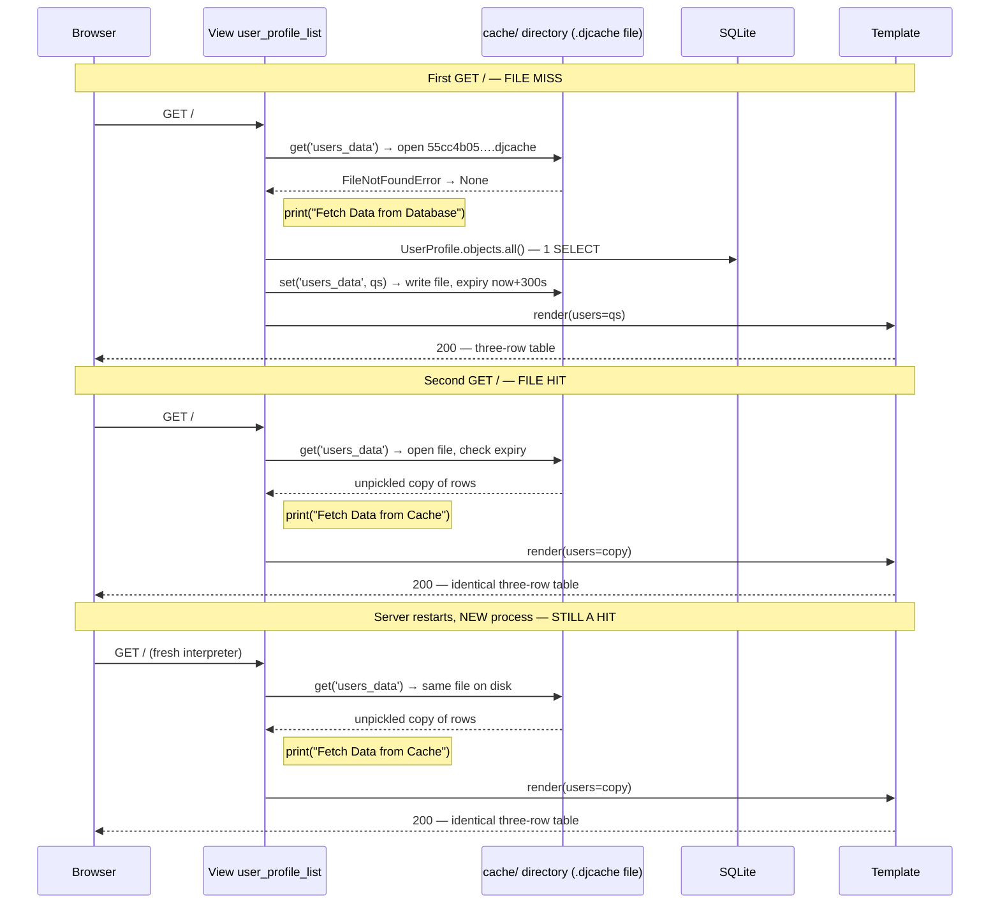
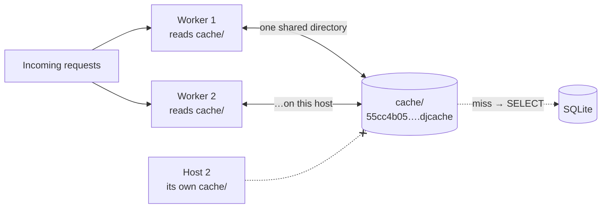
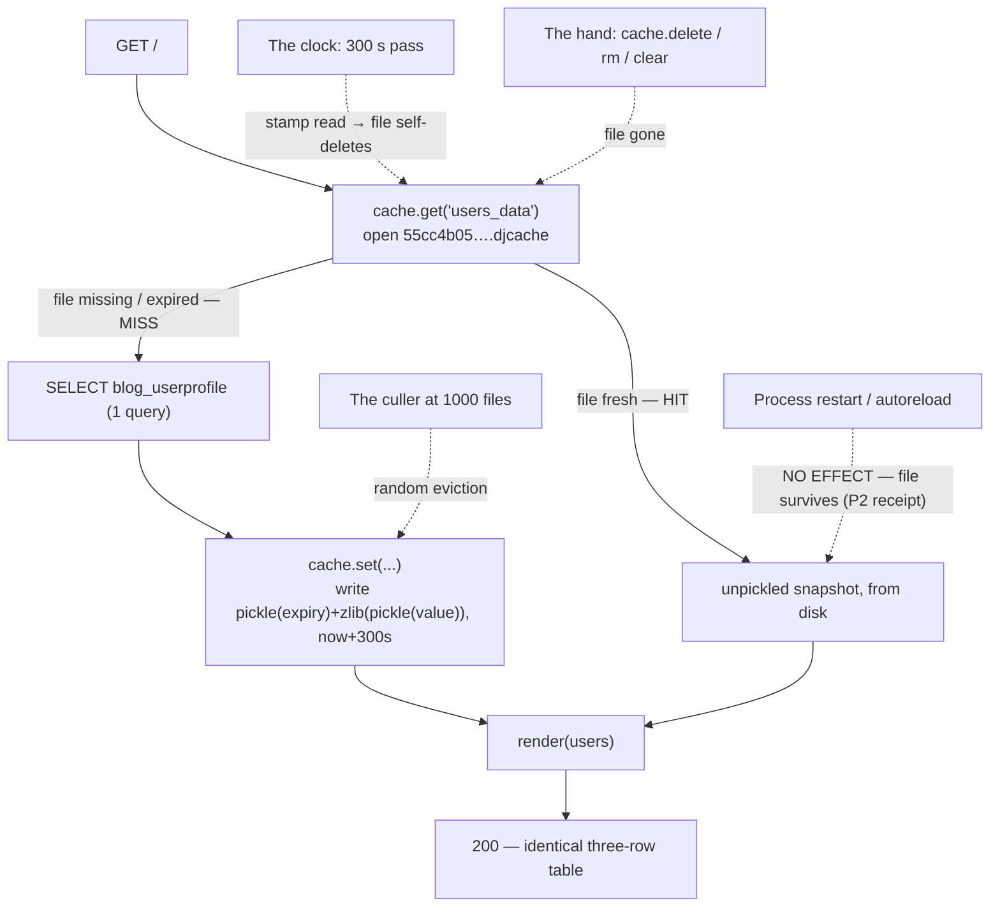

# 🚀 A050 — Django File-based Cache

`📖 Lecture A050` · `🎓 Track: Core Django` · `📶 Level: Intermediate` · `✅ Status: Documented`

> [!NOTE]
> **About this chapter's sources:** This chapter is built from the **`myProject34/` artifact** — a
> Django 6.1.1 scaffold whose `blog` app caches a database list in Django's **file-based** cache
> (`FileBasedCache`): the `user_profile_list` view checks `cache.get('users_data')` first and, on a
> miss, fetches `UserProfile.objects.all()` once, stores it with
> `cache.set('users_data', users_data)` (no `timeout=` — the roster's 300 seconds applies), and
> prints `Fetch Data from Database` / `Fetch Data from Cache` so the branch actually taken is
> visible in the terminal.
>
> **No lecture transcript or notes exist in the folder** (`_source/` absent) — per the honesty
> contract, this chapter documents the owner's artifact alongside the official Django caching docs
> *and the installed backend source* (`django/core/cache/backends/filebased.py`), and every claim
> below was **live-verified**: cold `GET /` → 200 with `Fetch Data from Database` + 1 query, warm
> `GET /` → 200 with `Fetch Data from Cache` + 0 queries, **a brand-new interpreter served the hit
> from disk** (restart survival — impossible in A049), the `.djcache` file decoded byte-for-byte,
> a `timeout=2` probe file observed self-deleting across a process boundary, and
> `manage.py check` → only the `staticfiles.W004` ghost.
>
> This lecture is the second half of the cache diptych started in
> [A049 — Django In-Memory Cache (LocMemCache)](../A049_Django_In-Memory_Cache_%28LocMemCache%29/README.md):
> A049's board lived on the wall (per-process RAM — wiped at closing time); this chapter moves the
> same board into a **desk drawer on disk**. The `cache.*` API does not change by a single line —
> only the shelf the answers sit on, and the rules that shelf obeys.

## 🧭 What You Will Learn

- How to declare the `CACHES` roster against `FileBasedCache` — and why `LOCATION` is now a **real directory** (`BASE_DIR / 'cache'`), not a name
- The `.djcache` file format — a pickled expiry stamp plus a zlib-compressed pickled value — and how a cache key becomes a filename (md5 of the *versioned* key)
- What happened live at `/`: `Fetch Data from Database` on the cold GET (one query), `Fetch Data from Cache` on the warm GET (zero queries)
- The restart receipt: a **second, brand-new process** serving a HIT with 0 queries from the same file on disk
- The roster's 300-second `TIMEOUT` applying because `cache.set` omits `timeout=` — and where the expiry is stored (inside the file, as an absolute epoch)
- Which wall remains: every process on the **same disk** shares the cache; hosts with separate disks still don't
- Why an expired file deletes *itself* on the next read — and what culling (`MAX_ENTRIES` + random victims) does instead of LRU
- That this artifact ships **no invalidation UI at all** — and the three hands that can still end an entry

## 🎯 Why This Lecture Matters

A049's answer to "how long may this lie?" had a secret fourth tool: **the restart**. Per-process RAM
meant every deploy, crash, or even a `runserver` autoreload silently wiped the board — stale data
could not outlive the process that wrote it. That property was so convenient it felt like a
feature. This lecture removes it.

File-based caching keeps the identical `cache.get` / `cache.set` / `cache.delete` conversation but
moves the store into one small file per key under a real directory. The gains are immediate and
large: entries **survive restarts**, every worker on the machine **shares one warm cache** instead
of four cold ones, and nothing has to be installed or administered — no Redis, no Memcached, just a
folder. The price is the through-line of this chapter: the crutch is gone. Staleness now survives
deploys, and the artifact's contract weakens measurably versus A049 — **300 seconds** instead of 60,
**no admin eraser** shipped, and restart no longer wiping anything. Freshness has to be earned with
deliberate wiring, which is exactly what the invalidation and trap sections teach.

## ✅ Prerequisites

- [ ] The entire `cache.*` vocabulary from [A049 — Django In-Memory Cache (LocMemCache)](../A049_Django_In-Memory_Cache_%28LocMemCache%29/README.md) — `get`/`set`/`delete`, miss vs hit, TTL, the `is None` guard lesson (this chapter changes the *shelf*, never the *conversation*)
- [ ] Views, URLconfs, and `render()` — the request → response spine from [A007 — Views & URLs Basics](../A007_Views_URLs_Basics/README.md) onward
- [ ] QuerySets: `.all()`, lazy evaluation, and the fact that every evaluation hits the database — [A023 — ORM QuerySet All/Get/Filter](../A023_ORM_QuerySet_All_Get_and_Filter/README.md)
- [ ] Handing `objects.all()` to a template and stamping rows with `` — [A025 — Display Table Data in Django Template](../A025_Display_Table_Data_in_Django_Template/README.md) (this artifact's page is that exact pattern, cached)
- [ ] The admin's three gates (app installed, URLs mounted, superuser) — [A026 — Django Admin & Superuser](../A026_Django_Admin_&_Superuser/README.md)
- [ ] A Python dictionary, `None` as "absent", and the idea that objects can be **serialized to bytes** (pickle) — `cache.get()` and the `.djcache` file both speak in both
- [ ] 📌 Optional context: [A044 — Session Storage](../A044_Session_Storage_Get_&_Set_Methods/README.md) and [A045 — Cookies](../A045_Set_&_Read_Cookies_in_Django/README.md) — the other two members of the memory trilogy; [A043 — Signals](../A043_Pre_Save_&_Post_Save_Signals/README.md) arms the `post_save` eraser the practical example wires up

## 🔧 The Artifact — Every File, Verbatim

### 1. `myProject34/myProject34/settings.py` — the `CACHES` block (3823 bytes)

The whole cache configuration — sitting below the console `MAILERS` block the series has carried in
since A046 (`settings.py` also keeps `DEBUG = True` at line 26, which is what makes
`connection.queries` recordable in the live session below, and `STATICFILES_DIRS` pointing at a
non-existent `static/` folder, the source of the harmless `staticfiles.W004` warning):

```python
CACHES = {
    'default': {
        'BACKEND': 'django.core.cache.backends.filebased.FileBasedCache',
        'LOCATION': BASE_DIR / 'cache', # Specify Cache directory
        'TIMEOUT': 300, # Cache timeout in seconds
        'OPTIONS': {
            'MAX_ENTRIES': 1000, # Maximum number of entries in the cache
            # 'CULL_FREQUENCY': 3, # Frequency of cache culling
        },
    }
}
```

**Key points:**
- `'default'` is still the **alias** — every unqualified `cache.*` call targets `CACHES['default']`,
  exactly as in A049. The roster shape (`alias → BACKEND + options`) is unchanged
- `BACKEND` now names `FileBasedCache` — storage moves from this process's RAM to **one file per
  key** in a directory
- ⚠️ **`LOCATION` changed meaning with the backend.** For LocMemCache it was a meaningless label
  (`'unique-snowflake'`); here it is a **real filesystem path** — `BASE_DIR / 'cache'`, a
  `pathlib.Path` Django accepts and absolutizes. The directory is created automatically (mode
  `0700`) and re-created on every `set`, so deleting it mid-run is survivable
- `TIMEOUT: 300` sits **top-level** next to `BACKEND`/`LOCATION` (not inside `OPTIONS`) — it is the
  roster-wide default TTL in seconds: any `cache.set(...)` that omits `timeout=` gets 300 s
- `OPTIONS: {'MAX_ENTRIES': 1000}` caps how many files the directory holds before culling starts
  (Django's default cap is 300; the artifact triples it). `CULL_FREQUENCY` is **commented out** —
  which is a no-op: Django's default of `3` already applies (cull roughly one-third of the files
  when the cap is hit; `0` would mean "clear everything")
- `ALLOWED_HOSTS = []` (line 28) stays empty — harmless in a browser under `DEBUG = True`, but the
  test client's `testserver` host gets a 400 `DisallowedHost`, which the live session below had to
  patch **in-process** (the artifact itself is untouched)

### 2. `myProject34/blog/views.py` (780 bytes) — the heart of this chapter

The whole file, verbatim — `user_profile_list` is the cache conversation in nineteen lines, and
this time it is written *correctly*:

```python
from django.shortcuts import render
from .models import UserProfile
from django.core.cache import cache

# Create your views here.
def user_profile_list(request):
    # Check if the user profile is already cached
    users_data = cache.get('users_data')

    if users_data is None:
        print("Fetch Data from Database")  # For debugging purposes
        # If not cached, retrieve it from the database
        users_data = UserProfile.objects.all()  # Assuming you want all user profiles
        # Cache the user profiles for future requests (e.g., for 5 minutes)
        cache.set('users_data', users_data)
    else:
        print("Fetch Data from Cache")  # For debugging purposes

    return render(request, 'user_profile_list.html', {'users': users_data})
```

**Key points:**
- ✅ **The guard is right:** `if users_data is None:` is the *presence* test A049's artifact got
  wrong (`if not users:`). An empty-but-cached answer counts as a hit — the lesson was applied in
  the owner's very next project
- ✅ **The comment is honest this time:** `# Cache the user profiles for future requests (e.g., for
  5 minutes)` — `cache.set` omits `timeout=`, so the roster's `TIMEOUT: 300` applies: exactly five
  minutes. (A049's artifact shipped a comment that *contradicted* its code; this one matches)
- `cache.set('users_data', users_data)` — **no `timeout=` argument**: the TTL comes from settings,
  not the call site. Same three moves as A049, different clock wiring
- On a miss, `users_data` is an *unevaluated* `QuerySet`; `cache.set` must pickle it, and pickling
  **evaluates it first** — that is where the artifact's one SELECT fires
- The two `print()` lines are the lecture's receipts: `Fetch Data from Database` vs
  `Fetch Data from Cache` — the branch taken is visible in the terminal
- Key name `'users_data'` is byte-for-byte A049's key — deliberate: the *conversation* between view
  and cache didn't change, only the shelf behind it

### 3. `myProject34/blog/models.py` (275 bytes)

```python
from django.db import models

# Create your models here.
class UserProfile(models.Model):
    name = models.CharField(max_length=100)
    email = models.EmailField(unique=True)
    sub = models.IntegerField(default=0)

    def __str__(self):
        return self.name
```

Three fields — `name`, unique `email`, `sub` (subscriber count, default `0`) — the same shape as
A049's `YouTubeUser` with the field renamed to `sub`. Migration `0001_initial.py` (649 bytes,
"Generated by Django 6.1.1 on 2026-09-23 16:37") creates `blog_userprofile`; live inspection
counts **3 rows** (`Adnan`/1000, `Umar`/100, `Md`/2000).

### 4. Routing — `blog/urls.py` and the root URLconf

```python
from django.urls import path
from . import views

urlpatterns = [
    path('', views.user_profile_list, name='user_profile_list')
]
```

Mounted at the root by the project URLconf (scaffold docstring omitted):

```python
from django.contrib import admin
from django.urls import path, include

urlpatterns = [
    path('admin/', admin.site.urls),
    path('', include('blog.urls')),
]
```

So `GET /` (root!) resolves `user_profile_list` — unlike A049's `GET /users/`. The page sits at the
site's front door, which makes the cache the *first* thing every visitor hits.

### 5. `myProject34/blog/admin.py` (215 bytes) — note what is *missing*

```python
from django.contrib import admin
from .models import UserProfile

# Register your models here.
@admin.register(UserProfile)
class UserProfileAdmin(admin.ModelAdmin):
    list_display = ('name', 'email', 'sub')
```

**Key points:**
- ⚠️ **No cache action ships with this artifact.** A049's admin carried a *Clear Users Cache*
  action (`cache.delete` wired into a `@admin.action`); here the admin only registers the model
  with a three-column list. The artifact's freshness contract is therefore **TTL only** — 300
  seconds, plus whatever you do by hand (see 🧹 below)
- `@admin.register(...)` is decorator registration — the same effect as A049's
  `admin.site.register(...)`, just written inline

### 6. `myProject34/blog/templates/user_profile_list.html` (960 bytes)

```html
<!DOCTYPE html>
<html lang="en">
<head>
    <meta charset="UTF-8">
    <title>Users - File Cache Demo</title>
    <style>
        table {
            border-collapse: collapse;
            width: 100%;
        }
        th, td {
            text-align: left;
            padding: 8px;
        }
        th {
            background-color: #f2f2f2;
        }
    </style>
</head>
<body>
    <h2>Users Data (File-Based Cache Demo)</h2>
    <table border="1" cellpadding="10">
        <thead>
            <tr>
                <th>Name</th>
                <th>Email</th>
                <th>Subscription</th>
            </tr>
        </thead>
        <tbody>
            
            <tr>
                <td>{{ user.name }}</td>
                <td>{{ user.email }}</td>
                <td>{{ user.sub }}</td>
            </tr>
            
        </tbody>
    </table>
</body>
</html>
```

The template is deliberately cache-blind (A025's pattern), exactly like A049's: it just iterates
`users`. Whether that list came from SQLite this millisecond or from a file on disk up to five
minutes old is the view's business, not the template's — which is precisely why a stale-cache bug
*looks* like an ordinary page until you diff it against the database.

### 7. The rest of the scaffold

`blog/apps.py` (88 bytes, `BlogConfig` with `name = 'blog'`), `blog/tests.py` (63 bytes — the
untouched `TestCase` stub, **no tests ship**), `myProject34/manage.py` (689 bytes, standard Django
6.1.1 entry point), empty `__init__.py` files, and the usual `asgi.py`/`wsgi.py` (415 bytes each).
No `_source/` transcript, no `.env`, no lecture notes — the honesty contract applies: this chapter
documents the artifact itself plus the official docs and Django's installed backend source.

## 🧠 What File Caching Is — A049's Board, Rebuilt on Disk

A049 already taught what a cache *is*: store the result of an expensive operation so the next
caller reuses it instead of recomputing it; caches are **derived**, **disposable**, and
**optional**; the trade is the staleness window. Nothing here changes any of that — read
[A049's "What Caching Is"](../A049_Django_In-Memory_Cache_%28LocMemCache%29/README.md) first if
those three properties aren't solid yet.

What changes is one sentence: **where the stored result lives**. LocMemCache keeps entries in a
Python dictionary inside the serving process — RAM that dies with the process. `FileBasedCache`
writes each entry to its own small file under a directory on disk — bytes that outlive the process
that wrote them. The view code above runs **unchanged** against either backend; that is the whole
design of Django's cache API: the `CACHES` roster swaps the shelf, never the conversation.

Three properties gain a corollary on disk:

- **Derived** still holds — the `.djcache` file is a *copy* of a database answer; delete the
  directory and nothing is lost but speed. (It is never a backup: entries expire, get culled, and
  sit in a folder nobody thinks to restore.)
- **Disposable** still holds — but the *triggers* change. In RAM, every entry dies on every
  restart. On disk, entries survive restarts and only three actors can end them: the TTL clock,
  an explicit delete, and the culler (🏢 and 🧹 below).
- **Optional** still holds — no `CACHES` key, no cache; add the block, and every process on the
  machine starts reading and writing the same folder.

The gain, stated concretely: a restart no longer empties the cache, and four gunicorn workers stop
maintaining four private copies of the same answer. The cost, stated just as concretely: staleness
can now outlive a deploy — the file doesn't know you fixed the data.

## ⚙️ `CACHES` and FileBasedCache — The Roster Points at a Directory

The roster shape is A049's to the letter — `alias → BACKEND (+ LOCATION, TIMEOUT, OPTIONS)` —
structurally the same pattern as A046's `MAILERS`. Only the backend line and the meaning of its
options differ:

- **`BACKEND: 'django.core.cache.backends.filebased.FileBasedCache'`** — one file per key under a
  directory. Django's installed source (`filebased.py`, Django 6.1.1) shows the mechanics this
  chapter verifies live: `get` opens the key's file and reads it; `set` writes to a temp file and
  moves it into place (atomic on the same filesystem); `delete` removes the file; the class also
  re-creates the directory on every `set`, because *you* may have deleted it at any time
- **`LOCATION: BASE_DIR / 'cache'`** — a **real directory path** (a `pathlib.Path`; Django
  absolutizes it). Created on demand with mode `0700` (owner-only — the folder holds readable
  copies of your data). Resolved live: `WindowsPath('D:/…/myProject34/cache')`. Contrast A049:
  same option name, *completely different semantics* — a label vs a path
- **`TIMEOUT: 300`** — the roster's default TTL, top-level beside `BACKEND`. The artifact's only
  `cache.set(...)` omits `timeout=`, so **this** number is the artifact's real staleness ceiling:
  five minutes, matching its comment
- **`OPTIONS: {'MAX_ENTRIES': 1000}`** — the culling threshold: once the directory holds 1000
  `.djcache` files, each further `set` first deletes about a third of them (**random** victims, not
  oldest-first — `random.sample` in the source; `CULL_FREQUENCY` divides, `0` clears everything).
  The commented-out `'CULL_FREQUENCY': 3` changes nothing: `3` is already the default

One roster per project, one directory per roster — and everything below follows from those two
sentences.

## 🔑 The Three Moves — Same Conversation, File Underneath

The whole cache API this artifact uses is still three calls on `django.core.cache.cache` (the
module-level proxy for the `'default'` alias) — identical to A049, with one new implementation
detail per move:

| Move | When the key is **missing** | When the key is **present** | What it returns / does |
|---|---|---|---|
| `cache.get('users_data')` | returns **`None`** (or the `default=` argument, if given) — the file simply doesn't exist, or exists but is expired | reads the file, checks its embedded expiry, unpickles a fresh *copy* | the value, or `None` — **`None` means "unknown", not "empty"** |
| `cache.set('users_data', users_data)` | writes a temp file, then moves it into place as `md5(':1:users_data').djcache`, stamped `now + 300s` | **overwrites** the old file atomically (temp + move — a concurrent reader never sees a half-written file) | returns `None`; value must be **picklable**; TTL comes from `TIMEOUT: 300` |
| `cache.delete('users_data')` | silent no-op — no error, no warning | **removes the file** from disk | next `get` returns `None` again |

Reading the table horizontally is this chapter's contract: the *semantics* are A049's to the byte
(`get` can return either a value or `None`, `set` overwrites, `delete` never raises on a missing
key) — only the storage behind each row moved from a dict to a directory. That is why the artifact
could reuse A049's key name `'users_data'` without a single line of view code changing its
*meaning*.

📌 Three moves the artifact doesn't call but you will meet — each with a file-cache flavor:
`cache.get_or_set(key, factory)` (get, or compute-and-store in one call), `cache.touch(key,
timeout=…)` (re-stamp an existing entry's TTL by rewriting the file's expiry without touching the
value), `cache.incr(key, delta)` (atomic counter bump — raises `ValueError` if the key doesn't
exist yet), and `cache.clear()` (**deletes every `.djcache` file in `LOCATION`** — a sledgehammer,
never a scalpel; with files it is also the fastest way to go cold).

**Key design rules for keys** are unchanged from A049: plain strings, **global to the alias**
(`'users_data'` is one slot for the whole project — not per-view, not per-user), conventionally
namespaced like `'blog:users'` so two features never fight over one slot. One new wrinkle: the
key's **filename** is derived mechanically — Django takes the versioned key (`':1:users_data'` —
empty `KEY_PREFIX`, version `1`, then the key), md5-hashes those bytes, and appends `.djcache`.
Verified live: `md5(b'users_data')` → `4a7fdd36…` (a decoy), `md5(b':1:users_data')` →
`55cc4b05d02a2f484e37e9b20edcac57` — **exactly** the file in the artifact's `cache/` directory. You
can therefore map any key to its file without starting Django, and conversely fingerprint which
key a stray file came from.

## 🗺️ The Walkthrough — One Request, Two Futures (…and a Third)

Here is the whole chapter in one picture: one URL, two futures, and a single line deciding between
them — `if users_data is None:` (presence, not truthiness — A049's lesson applied):



**File-miss branch, line by line:** `cache.get` tries to open the key's file → `FileNotFoundError`
(caught internally) → `None`, so `if users_data is None:` is true and the `Fetch Data from
Database` print fires. The view builds a `QuerySet` — still just a recipe, zero SQL so far. Then
`cache.set(...)` must **pickle** the value to store it, and you cannot pickle a recipe: pickle
forces evaluation, which is exactly where the artifact's **one SELECT** executes (A023's "lazy
until used" rule, paying off in an unexpected place again). The filled `QuerySet` is pickled,
zlib-compressed, and written to the file.

**File-hit branch, line by line:** `cache.get` opens the file, reads the embedded expiry first,
finds it in the future, then unpickles the value and returns a **copy**; `if users_data is None:`
is false, the `Fetch Data from Cache` print fires, and `render()` iterates rows already in memory.
No branch of this code can reach the database on a hit — the miss branch *is the only branch
containing a query* (structural guarantee, same as A049).

**The third future is the new one:** after the process dies and a brand-new interpreter boots, the
file is still there — the *same* hit branch runs for the *first* request of the *new* process.
LocMemCache could never offer this future; that single mermaid note is this lecture in one line.

Everything downstream — template, table, HTTP status — is identical in all three futures. That is
the point: **caching changes where the answer comes from, never what the answer is** (until the
answer goes stale — ⏳ and 🪤 below).

## 📡 Live Session — The Miss-Hit-Restart Receipts

Reproduced against the artifact (`py -3.14 manage.py shell`, `DEBUG = True` so `connection.queries`
records). Two honesty notes on method, captured verbatim so you can reproduce them:

1. The artifact's `ALLOWED_HOSTS = []` rejects the test client's default `testserver` host with a
   400 `DisallowedHost` — every probe below therefore ran
   `settings.ALLOWED_HOSTS.append('testserver')` **in-process** (no artifact file was edited).
2. `connection.queries` resets when a request cycle closes the DB connection, so a *naive* second
   reading of `len(connection.queries)` can come back lower than the first (we measured
   `Q2_delta -1` exactly that way) — assert on the **prints**, which are unconditional, and treat
   the structural argument (only the miss branch contains SQL) as the guarantee.

**Probe A — cold then warm in one process:**

```python
from django.conf import settings
settings.ALLOWED_HOSTS.append('testserver')       # in-process patch (note 1)
from django.test import Client
from django.db import connection
from django.core.cache import cache

cache.delete('users_data')          # start cold
c = Client()
r1 = c.get('/')                     # -> Fetch Data from Database
q1 = len(connection.queries)
r2 = c.get('/')                     # -> Fetch Data from Cache
v = cache.get('users_data')
print(r1.status_code, r2.status_code, q1, type(v).__name__, len(v))
print('cells in response:', r1.content.decode().count('<td>'))
```

Receipts, captured verbatim:

```text
Fetch Data from Database
Fetch Data from Cache
R1 200 R2 200 Q1 1 type QuerySet len 3
cells in response: 9
cache/55cc4b05d02a2f484e37e9b20edcac57.djcache  758B
```

**Probe B — the restart receipt (two processes, the chapter's headline):**

```bash
# process 1: start cold, end warm
py -3.14 manage.py shell -c "…ALLOWED_HOSTS patch…; cache.delete('users_data'); c=Client()
print('P1 first ', c.get('/').status_code); print('P1 second', c.get('/').status_code)"
# process 2: brand-new interpreter, no warm-up
py -3.14 manage.py shell -c "…ALLOWED_HOSTS patch…; c=Client(); r=c.get('/')
print('P2 status', r.status_code, 'queries', len(connection.queries))"
```

```text
Fetch Data from Database
P1 first  200
Fetch Data from Cache
P1 second 200
Fetch Data from Cache          <-- printed by PROCESS 2's first-ever request
P2 status 200 queries 0
```

**Probe C — decode the `.djcache` file byte-for-byte:**

```python
import glob, io, pickle, zlib, time
p = sorted(glob.glob('cache/*.djcache'))[-1]
b = open(p, 'rb').read()
f = io.BytesIO(b)
exp = pickle.load(f)                             # first object: the expiry stamp
val = pickle.loads(zlib.decompress(f.read()))    # rest: zlib(pickle(value))
print(len(b), exp, round(exp - time.time(), 1))
print(type(val).__name__, len(val), [u.name for u in val])
```

```text
bytes 758 expiry 1790184969.7859566 ttl_left_s 299.5
value QuerySet len 3 names ['Adnan', 'Umar', 'Md']
```

**Probe D — TTL lives in the file, not in the process (cross-process expiry):**

```bash
py -3.14 manage.py shell -c "…; cache.set('ttl_probe', [1,2,3], timeout=2)"   # process A
sleep 3
py -3.14 manage.py shell -c "…; print(cache.get('ttl_probe')); print(os.listdir('cache'))"  # process B
```

```text
new process get -> None
files: ['55cc4b05d02a2f484e37e9b20edcac57.djcache']     # ttl_probe's file is already gone
```

And the Django system check stays clean:

```bash
py manage.py check
System check identified 1 issue (0 silenced).
# the one issue is the harmless staticfiles.W004 ghost (missing static/ dir), not this chapter
```

**What each receipt proves:**

| Receipt | Proves |
|---|---|
| `Fetch Data from Database` then `Fetch Data from Cache`, in order | the branch `if users_data is None:` takes on a cold file vs. a warm file — live, not theoretical |
| `Q1 1` | exactly one SELECT served the whole file-miss request — fired by pickle-time evaluation |
| `P2 status 200 queries 0` + the hit print from a **fresh interpreter** | **restart survival**: the file (not the process) is the store — A049's rule #1 is gone |
| `758B` file named `55cc4b05….djcache` | one file per key, named md5 of the versioned key (matches the standalone md5 probe) |
| decode → `expiry … ttl_left_s 299.5` | the file's two-part layout: pickled float epoch **first**, then zlib-compressed pickled value; TTL stamped at write |
| `value QuerySet len 3 names […]` | what left the cache is an **evaluated** `QuerySet` — a frozen snapshot of the three `blog_userprofile` rows |
| `new process get -> None` + file gone | expiry is enforced **from the file** across a process boundary, and an expired file **deletes itself on read** |
| `cells in response: 9` / `200 200` | three rows × three columns rendered both times — the visitor can't tell which future they got |
| `manage.py check` → only `staticfiles.W004` | the system stays clean; this chapter's verification touched no artifact file |

## ⏳ TTL — The Death Stamp Travels with the File

Every entry still carries a death stamp — the difference is *where* it is stamped. LocMemCache
kept `expires_at` in a dict beside the value (memory that dies with the process); `FileBasedCache`
**pickles the expiry epoch into the file itself**, ahead of the value (verified: first bytes of
`55cc4b05….djcache` unpickle to `1790184969.78…`, a float ≈ `write time + 300`). A later `get`
reads the stamp first; past that moment the key is a miss — and, per the source, the expired file
is **deleted on the spot** (`_is_expired()` closes and unlinks it). Nothing sweeps the background;
expiry is *lazy*, enforced by whoever reads next — even a reader in a brand-new process (Probe D).

| Timeout form | Meaning |
|---|---|
| `cache.set(k, v)` — the artifact's call | the roster's `TIMEOUT: 300` → **300 seconds (5 minutes)** |
| `cache.set(k, v, timeout=60)` | overrides the roster for this one entry — 60 seconds |
| `cache.set(k, v, timeout=None)` | expiry pickled as `None` → never expires by time — only delete/clear/cull can end it (dangerous for correctness, fine for countable things like a day-counter with its own invalidation) |

✅ This artifact's comment (`# Cache the user profiles for future requests (e.g., for 5 minutes)`)
**agrees** with the code path — no argument, roster default 300 s = 5 minutes. (A049's artifact
shipped a comment that contradicted its `timeout=60`; the reviewer's habit stays the same even
when the artifact behaves: *trust the argument, or the roster when there is no argument — never
the comment.*) The staleness envelope of this page is therefore **five minutes**: edit `Umar`'s
`sub` in the admin at `t=0`, hit `/` at `t=299` → old number renders; `t=301` → fresh (the expired
file self-deletes on that read, and the miss re-queries).

Two clocks, one stamp — don't confuse them:
- **TTL** (300 s) bounds how long the *answer* may lie.
- **Culling** (1000 files) bounds how big the *directory* may grow — and takes **random** victims,
  which is a disk-pressure valve, not a freshness mechanism.

The other half of the ledger, unchanged from A049: **every request that finds the file warm skips
the database**, so the TTL doubles as the *reuse* window — shorter TTL = fresher but fewer hits;
longer TTL = more hits but a longer permitted lie. There is no setting that buys both.

## 🏢 Scope — One Directory, Every Worker on This Disk

LocMemCache's three rules were: restart wipes, workers never share, hosts never share. File-based
storage **deletes the first rule and reverses the second**; only the third survives:

1. **Restart does NOT wipe.** Process exits → files remain → next boot reads them warm. Live
   receipt: process 2's *first* request printed `Fetch Data from Cache` with `queries 0`. This is
   the lecture's headline, and it cuts both ways — a deploy can serve last deploy's answers
   (🪤 below).
2. **Workers on the same machine DO share.** `gunicorn -w 4` means four interpreters, but one
   `cache/` directory: Worker 1's warm file is Worker 2's warm file. The `set` path is
   temp-file-then-move (atomic on the same filesystem), and `get` reads whole committed files — so
   sharing doesn't mean torn reads. One warm-up serves the whole fleet *on this box*.
3. **Hosts still never share.** Two servers behind a load balancer = two local disks = two private
   `cache/` directories. File-based cache fixes *persistence* and *same-host sharing*; cross-host
   sharing still needs a network service — Redis or Memcached behind the very same `cache.*` API
   (📌 a later backend, same three moves).



**What the reader should see:** both workers funnel through *one* directory (siblings now, not the
isolated boards of A049); only misses walk to the database; the cross-host line is struck — a
second machine cannot see these files.

**`LOCATION` in concrete terms:** a real path (`BASE_DIR / 'cache'` →
`D:/…/myProject34/cache` live), created on demand with mode `0700`, re-created on every `set` even
if you `rm -rf` it mid-run. Two operational consequences: (a) relative `LOCATION` values resolve
against the working directory — always anchor on `BASE_DIR`; (b) the directory is as sensitive as
the data it mirrors — pickled copies of rows sit there in near-plain sight (misconception #7), so
its `0700` mode and your backup/exclusion policy matter.

## 🧹 Invalidation — The Manual Wipe (Absent by Default)

**Cache invalidation** is closing the staleness window on purpose. A049 shipped two tools — a 60 s
TTL and an admin action. This artifact ships **one**: the 300 s TTL. The admin action is gone
(`admin.py` registers the model and stops), so nothing in the artifact's UI can wipe the key.
Available hammers, from precise to nuclear:

- **TTL (automatic):** 300 seconds — bounded lies with zero code at request time. This is the
  artifact's *entire* freshness contract.
- **`cache.delete('users_data')` (manual, precise):** removes that one file now — in a shell, in a
  signal handler, in code you write. The artifact never calls it; 🧪 below wires it properly.
- **Delete the file (manual, blunt):** `del cache/55cc4b05….djcache` or `rm -rf cache/` — derived
  data, safe to destroy any time; the directory re-creates itself on the next `set`. Useful when
  Django isn't running (deploys, forensics).
- **`cache.clear()` (sledgehammer):** deletes **every** `.djcache` file in `LOCATION` — every key
  on the alias, this project's and any future one's.
- 📌 **Versioned keys** (pattern, beyond this artifact): store `'users_data:v7'`, bump `v7` on
  write — old files age out (or get culled) instead of being hunted down.

**Why an ordinary admin save does *not* clear the key** — same reason as A049, unchanged: Django
cannot know that `save()` on `UserProfile` invalidates the arbitrary string `'users_data'`; key
names are your invention, invisible to the ORM, so the framework deliberately never guesses. The
difference from A049: there the process would at least *help* you on restart (accidental
invalidation); here the file waits patiently through every restart, so **save-time freshness must
be wired deliberately** or it doesn't exist.

**The three things that end an entry now** — memorize as A049's updated set:

1. **The clock** — 300 seconds pass, the next `get` reads the stamp, finds it past, deletes the
   file, reports a miss (TTL expiry — lazy, self-executing)
2. **The hand** — someone calls `cache.delete`/`cache.clear`, or deletes the file directly
3. **The culler** — the directory hits `MAX_ENTRIES: 1000` and `random.sample` picks this file
   among ~333 evicted victims (surprise miss, no freshness meaning attached)

Note what's **missing from the list: the process.** A049's set was *clock, hand, process* — the
restart was your accidental fourth invalidator. On disk, restart appears nowhere: bounded
staleness = `min(TTL, time until wipe #2 or #3)` — and if neither happens, the file lies
*forever*-ish (well, until culling, which is luck, not design).

## 🪤 The Stale Restart — When Persistence Is the Bug

Everything a beginner loved about A049 ("restart and it's gone!") inverts here. Three concrete
traps, all mechanical:

| # | 🪤 Trap | What happens | Fix |
|---|---|---|---|
| 1 | **"I restarted — why is it still stale?"** | the fix/data change is live, the `.djcache` file from before the restart still holds the old answer, and its stamp is still in the future → warm hits serve *last deploy's rows* to everyone on the box | delete the key/file (or `cache.clear()`) as an explicit **deploy step**; better: wire delete-on-write (🧪) |
| 2 | **Changed the data, page won't update (within 5 min)** | no — not even within: the artifact has *no* manual eraser, so an admin edit is invisible until the clock fires; and restarts, which used to mask this, now preserve it | TTL is the only built-in bound; add `post_save` → `cache.delete` (A043's machinery) for save-time freshness |
| 3 | **The empty-table ghost** | table emptied → old file still holds 3 rows → page renders three users that no longer exist; the guard is correct (`is None`), so nothing re-queries until the stamp passes | same as #1 — wipe on write, or accept the 300 s lie consciously |

Two honest counters to keep this section from sounding like "don't use files": (a) staleness was
*already* possible in A049 for 60 s with no restart involved — persistence changes the **default**,
not the category; (b) every fix above is one line, and the artifact is a teaching scaffold, not a
production freshness design.

📌 One more trap for the road, inherited from pickling: **class moves break old files.** The file
holds a pickled `blog.models.UserProfile`; rename the model (or app) and an old file's unpickle
raises `AttributeError`/`ModuleNotFoundError` on the *hit* path. LocMemCache dodged this by dying
on restart; files don't. Deploy checklist item: flush `cache/` when you move/rename models.

## 📊 The Difference Between a Cold and a Warm Request

| Feature | Cold request (file miss) | Warm request (file hit) |
|---|---|---|
| Database queries | **1** — the `blog_userprofile` SELECT | **0** — no branch with SQL executes |
| Work performed | open-miss + query + pickle + compress + write file + render | open + expiry check + decompress + unpickle + render |
| Where rows come from | live SQLite, as of this instant | the file's snapshot, up to **300 s** old |
| Console print | `Fetch Data from Database` | `Fetch Data from Cache` |
| Correctness risk | none — fresh from source of truth | possible staleness, bounded by TTL (the only wipe in town) |
| After any restart | only if the file is *missing or expired* | **the normal case** — files survive boots |
| Cost profile | pays the database, then profits | disk read + zlib + unpickle — cheaper than SQL, costlier than A049's pure-RAM hit |

**Read down the "Work performed" column:** the hit path is the miss path with query + write
removed — that subtraction is the optimization. **Read the "After any restart" row:** it's
inverted versus A049 — cold-after-restart is now the *exception*, not the rule. **Read the last
row:** disk + decompression is still I/O — file hits are not free, just much cheaper than the
database.

## 🧱 Important Vocabulary

- **`FileBasedCache`** — the disk shelf · *Django's file-backed cache backend: one file per key
  under `LOCATION`, so entries outlive the process and are shared by every worker on the host —
  the default-ish "persistent but zero-infrastructure" step between RAM and Redis* · 🧷 a folder
  of labeled envelopes instead of a whiteboard
- **`.djcache` file** — the envelope · *the per-key file: **pickled float expiry epoch first,
  then zlib-compressed pickled value**; name = `md5(':1:<key>') + '.djcache'` — verified 758 bytes
  for `users_data`* · 🧷 one envelope per answer, stamped before sealing
- **cache directory (`LOCATION`)** — the shelf's address · *for this backend `LOCATION` is a real
  directory path (`BASE_DIR / 'cache'`), created on demand at mode `0700`, re-created on every
  `set` — not the meaningless label it was for LocMemCache* · 🧷 the cabinet's street address, not
  its nickname
- **cache hit / cache miss** — found vs fetch · *a hit = file present and unexpired, served
  without touching the database; a miss = no file or expired stamp (which self-deletes), you do
  the work, then write it back* · 🧷 "envelope's there and dated today" vs "fetch the folder"
- **lazy expiry** — self-deleting lie · *expired files are removed only when someone reads them
  (`_is_expired()` unlinks); no background sweeper — untouched expired files can sit until the
  next `get` or the culler* · 🧷 the note tears itself off — but only when someone looks
- **culling / `MAX_ENTRIES`** — the disk-pressure valve · *once the directory reaches `MAX_ENTRIES`
  (1000 here; Django default 300), each `set` first deletes `count / CULL_FREQUENCY` **random**
  files (`0` = clear all); victims are random, not oldest-first* · 🧷 the drawer's spring-loaded
  ejector, taking seats at random when full
- **stale data** — the lying envelope · *a cached answer that no longer matches the database —
  survives until the TTL stamp passes or someone deletes the file; Django never auto-invalidates
  on save, and restart no longer helps you* · 🧷 yesterday's list still in today's envelope
- **cache invalidation** — the manual wipe · *closing the staleness window on purpose — TTL,
  `cache.delete`/`cache.clear`, file removal, or versioned keys; this artifact wires none of the
  manual ones* · 🧷 shredding the envelope before its date
- **cold vs warm** — empty vs stocked shelf · *cold = file missing/expired (first request after a
  wipe, a deploy of a fresh checkout, or TTL burn); warm = file present and fresh (including the
  first request of a brand-new process)* · 🧷 cabinet searched vs cabinet stocked

## 💡 Real-World Analogy — The Hotel Concierge's Shelf Binder

A044 gave guests lockers; A045 a pocket notebook; A049 the clerk's **crib sheet** on the desk. This
chapter keeps that sheet — and files it into a **binder on the concierge's shelf**. When someone
asks "who's on today's subscriber list?", the clerk pulls the binder page (`cache.get`) — nothing
filed? Ask the manager (the database) exactly once, photocopy the answer, **date-stamp the page
for five minutes** (`cache.set` → pickled expiry), file it. Ask again while the date is current
and the clerk reads straight from the binder — the manager isn't woken.

What the shelf adds, in the concierge's own words: **"We don't throw the binder out when I go
home."** The night clerk (a brand-new process after restart) finds the page exactly where it was
left — that's the P2 receipt. **"Every clerk on this desk reads the same binder"** — four workers,
one shelf (A049's four separate scratch pads are gone). **"The branch across town keeps its own
binder"** — hosts still don't share; the shelf is furniture, not a network. **"Pages older than
their date get shredded — but only when someone actually pulls the page"** — lazy expiry, the
self-deleting file. **"When the shelf is full, our over-eager intern grabs random pages and bins
them"** — culling takes random victims at 1000 files; the *oldest* page is not special. And the
trouble with shelves: **restock the shelves without re-dating the page (an admin `save()` with no
invalidation) and the binder lies to every clerk for the full five minutes — through shift
changes, through the manager's birthday, through a whole restart.** This artifact ships no
eraser on the desk (A049 had one); the clerk can only wait for the date to pass — unless someone
*wires* the shredder to the stock room (`post_save` → `cache.delete`, 🧪). One more room to avoid:
the binder is a **photocopy anyone with the shelf's key can read** — zlib is compression, not
encryption; the `0700` folder is the only wall, so secrets don't belong in it.

## ❌ Common Beginner Mistakes

| ❌ Mistake | ✅ Fix |
|---|---|
| Restarting the server to "clear the cached data" (A049 muscle memory) | restarts don't touch files — use `cache.delete('users_data')`, delete the file, or `cache.clear()`; the 🪤 section is about exactly this inversion |
| Pointing `LOCATION` at a bare name (`'unique-snowflake'`) out of habit from A049 | for `FileBasedCache`, `LOCATION` must be a **directory path** — a name would be resolved relative to the process's working directory and scatter files wherever `runserver` was started; anchor on `BASE_DIR / 'cache'` |
| Editing rows in the admin and expecting the page to refresh — especially after a restart | Django **never** auto-invalidates; this artifact ships no eraser either. Bound the lie: short TTL, delete-on-write (`post_save` receiver, A043), or wipe `cache/` on deploy |
| Assuming two hosts share the cache because "it's a file — just sync it" | each host reads its own disk; cross-host sharing needs a real shared service (Redis/Memcached) behind the same `cache.*` API — files fix persistence and *same-host* sharing only |
| Treating culling as "the oldest entries fall off" (LRU intuition) | victims are chosen with `random.sample` — a 1-second-old file can be culled while a 4-minute-old one survives. TTL, not culling, is your freshness bound |
| Shipping a model rename/move without flushing `cache/` | old files unpickle `blog.models.UserProfile`; after the move, hits raise on the *warm* path. Deploy step: delete the directory (it re-creates itself) |
| Storing secrets (tokens, personal payloads) in cached values because "it's server-side" | the file is zlib-compressed pickle — **readable** by anyone who can read the directory (`0700` helps, backups/deploys often widen it). Cache references, not secrets |
| Reading the comment `# … (e.g., for 5 minutes)` and stopping there | this time comment and code agree — but the reviewer's rule is unchanged: the TTL is `TIMEOUT: 300` *in settings*, and the comment would be the first thing to rot |
| Calling `cache.clear()` in a shared environment because one key was wrong — or reusing `'users_data'` for two features | `clear()` removes **every** `.djcache` file on the alias; keys are global slots — prefer precise `cache.delete('specific_key')` and namespaced keys (`'blog:users'`) |

## 🧠 Common Misconceptions

| # | 🧠 Misconception | ✅ Reality |
|---|---|---|
| 1 | "File cache is a small database" | it's still **derived, disposable, optional** — no queries, no transactions, no relations; it holds copies that expire, get culled at random, and may be deleted at any moment. The database remains the only source of truth |
| 2 | "Persistent cache means my data is safe" | persistence applies to the *copies*, not your data — and you should want them disposable; losing `cache/` must only cost speed. Never store the only copy of anything in a cache |
| 3 | "Django clears the cache when you save the model" | never, automatically — same as A049. The ORM can't map `UserProfile.save()` to your key strings; freshness is *your* wiring (TTL here; `cache.delete` on write if you add it) |
| 4 | "A restart now clears the cache like LocMemCache did" | the exact opposite: files outlive the process — live-proven by process 2's first-request hit. Restarts are irrelevant to file-cache contents |
| 5 | "`cache.get()` returns `[]` (or `0`) when nothing is cached" | a miss returns **`None`** (or your `default=`) — which is why the artifact's `if users_data is None:` is the correct presence test (and an empty cached list is a legitimate hit) |
| 6 | "The cached QuerySet re-runs the query when the template iterates it" | pickling **evaluated** it at `set` time; a hit hands back a filled snapshot — zero SQL on iteration, zero freshness either. `.filter()` on it would build a *new* QuerySet and query normally |
| 7 | "`LOCATION` names this cache (like LocMemCache's label)" | with `FileBasedCache` it is a **filesystem directory** — same key, new semantics; two projects pointed at the same path would literally share files (and shouldn't) |
| 8 | "A file hit is free (it's just a file)" | every hit pays open + expiry check + `zlib.decompress` + `pickle.loads` — real I/O and CPU. Cheap versus SQL, costlier than A049's RAM hit; for a tiny table queried once an hour the whole cache is overhead |
| 9 | "Sessions, cookies, and cache are the same kind of memory" | different owners, different scopes, unchanged from A049: A044 session = server-side *per-user* state behind a ticket; A045 cookie = *client-held* state; the cache = *global* copies of computed answers — now surviving in files, shared by every visitor **and every worker on the host** |

## 🧪 Practical Example — Wiring the Missing Eraser (`post_save` → `cache.delete`)

The artifact's freshness contract is TTL-only. The taught fix, using A043's machinery: make every
`UserProfile` save shred the page *now* instead of waiting five minutes. Two new files plus one
method in `apps.py` — **the artifact itself stays untouched**; this is the code exercises write
for real:

```python
# blog/signals.py  (new file)
from django.db.models.signals import post_save
from django.dispatch import receiver
from django.core.cache import cache
from .models import UserProfile

@receiver(post_save, sender=UserProfile)
def wipe_user_list_cache(sender, **kwargs):
    """Shred the shelf page the moment the stock room changes."""
    cache.delete('users_data')
```

```python
# blog/apps.py  — the ready() import that arms the bell (A043's rule)
from django.apps import AppConfig

class BlogConfig(AppConfig):
    name = 'blog'

    def ready(self):
        from . import signals  # noqa: F401  — importing registers the receiver
```

**Why each line matters:**
- `@receiver(post_save, sender=UserProfile)` — the bell rings after every successful `save()`,
  admin or code; `sender=` pins it to *this* model so unrelated saves don't shred the page
- `cache.delete('users_data')` — precise hammer: one file gone, next request pays one SELECT and
  re-files a fresh page; other keys (if you add counters etc.) stay untouched
- the `ready()` import is the silent twin: skip it and **no receiver ever registers** — no error,
  no warning, pages just stay five minutes stale (A043's lesson, re-earned)
- the receiver runs **synchronously** while the saving request waits — the next reader is
  guaranteed a cold key; no "eventually consistent" window

**Second experiment — watch persistence and invalidation in one sitting (no new code):**

1. `GET /` → `Fetch Data from Database`; reload → `Fetch Data from Cache` (file, 758 B, on disk)
2. **Kill the server, start it again, reload** → still `Fetch Data from Cache` — the P2 receipt in
   your own terminal: restarts no longer wipe (the 🪤, now demonstrated)
3. Edit `Umar`'s `sub` in the admin (receiver wired) → reload → **immediately** fresh print — the
   bell shredded the page, five-minute wait cancelled
4. Comment out the `ready()` import, repeat step 3 → old number renders until the stamp passes —
   the silent twin, demonstrated

You have now watched both halves of this lecture: persistence that survives the process, and the
one-line wire that puts a human hand back on the shredder.

## 🎯 Interview Perspective

**Q: What is `FileBasedCache`, and where does `LOCATION` point?**
A: Django's built-in file-backed cache backend — one file per key under a directory, configured
through `CACHES` (`BACKEND: …filebased.FileBasedCache`, `LOCATION: BASE_DIR / 'cache'`). Unlike
LocMemCache's label, `LOCATION` here is a real filesystem path, created on demand (mode `0700`)
and re-created on every `set`. Views consult it with the same three moves: `get` first, `set` on
miss — persistence comes from the disk, not from a bigger dictionary.

**Q: Walk me through the first request, the second, and the first request after a restart.**
A: First `GET /`: `cache.get('users_data')` → file missing → `None` → miss print → one SELECT
(fired by pickle-time evaluation) → `cache.set(...)` writes pickle(expiry) + zlib(pickle(value))
→ render → 200. Second, within 300 s: `get` opens the file, stamp is in the future → unpickled
snapshot → hit print → render → 200, zero SQL. After a restart, in a *brand-new process*: same as
the second — the file doesn't know the process died. Live receipt: `P2 status 200 queries 0` with
the hit print. That third walk is the entire lecture in one answer.

**Q: What TTL does the artifact's entry get, and where is the expiry stored?**
A: `cache.set` omits `timeout=`, so the roster's `TIMEOUT: 300` applies — five minutes, matching
the comment. The expiry is stored **inside the file**, pickled as an absolute float epoch ahead of
the value (decoded live: `1790184969.78…`, ≈299.5 s left at read time). Because the stamp travels
with the file, even a fresh process enforces it — Probe D showed a 2-second entry returning `None`
in a new interpreter and self-deleting its file.

**Q: What's physically in a `.djcache` file, and why that name?**
A: Two parts: `pickle.dumps(expiry)` then `zlib.compress(pickle.dumps(value))` — 758 bytes total
for three rows. The name is `md5(versioned_key) + '.djcache'` — with defaults the versioned key
is `':1:users_data'`, whose md5 is `55cc4b05…`, exactly the file on disk (md5 of the *raw* key,
`4a7fdd…`, is a decoy). You can therefore locate a key's file without booting Django.

**Q: Which of A049's scope rules changed, and which didn't?**
A: Two changed, one survived. Restart no longer wipes (files outlive the process — proven);
same-host workers now *share* one warm directory instead of owning private dicts (proven across
two interpreters); hosts still never share — two servers mean two local disks. `LOCATION` also
changed meaning: label → directory path. Cross-host sharing remains Redis/Memcached territory
behind the unchanged `cache.*` API.

**Q: How do you invalidate — and what does this artifact ship?**
A: The artifact ships **only the 300-second TTL** — A049's admin action is absent. Available
tools: precise `cache.delete('users_data')`, blunt file deletion, `cache.clear()` (every file on
the alias), `post_save` → `cache.delete` for save-time freshness (the 🧪 receiver), and 📌
versioned keys. Django itself never auto-invalidates — it can't map `save()` to your key strings.
And mind the updated set of what ends an entry: **clock, hand, culler** — the *process* left the
list.

**Q: I cached a `QuerySet` — is `cached_qs.filter(...)` free, and does it survive code changes?**
A: No on both counts. The cache holds an **evaluated snapshot** — iterating *that* object is free;
`.filter()` builds a brand-new QuerySet that queries the database normally. And the snapshot is a
pickle of `blog.models.UserProfile` — move or rename that class and old files fail to unpickle on
the hit path; flush `cache/` on such deploys (LocMemCache dodged this by dying on restart).

**Q: When should you *not* cache this way?**
A: When reads are rare (you pay pickle+compress for no reuse); when data changes constantly and
even seconds of staleness are unacceptable; when hits must be nanoseconds (file I/O +
decompression is still I/O — RAM or Redis wins); when **one host can't be the boundary**
(multi-server deployments need a shared backend — files won't cross machines); and — critically —
when a global key would serve **per-user private data**: `'users_data'` is fine because every
visitor gets the same public list; cache a user's dashboard under one shared key and you have a
data leak — and now a *durable* one.

## 🔁 Active Recall

<details><summary>1. What changed in the `CACHES` block versus A049, and what did NOT change?</summary>

Changed: `BACKEND` → `FileBasedCache`; `LOCATION` → a real directory (`BASE_DIR / 'cache'`, mode
`0700`, auto-created); added top-level `TIMEOUT: 300` and `OPTIONS: {'MAX_ENTRIES': 1000}`.
Unchanged: the roster *shape* (alias → options), the `'default'` alias, the three-move `cache.*`
API, the key name `'users_data'`, and `DEBUG`/`MAILERS` around it.
</details>

<details><summary>2. Why did the first `GET /` print `Fetch Data from Database` and the second `Fetch Data from Cache` — and what did the restart probe prove?</summary>

First request: no `.djcache` file (or expired) → `get` returns `None` → presence guard takes the
miss branch → print, one SELECT (pickle-time evaluation), `set` writes the file (expiry =
now+300). Second: file present and unexpired → unpickled snapshot → hit print, zero SQL. The
restart probe ran a **brand-new interpreter** whose first-ever request printed
`Fetch Data from Cache` with `queries 0` — proving the *file*, not the process, is the store:
A049's "restart wipes" rule is gone.
</details>

<details><summary>3. What is physically inside the artifact's `.djcache` file, and what is its filename derived from?</summary>

Two parts: `pickle.dumps(expiry_float_epoch)` first, then `zlib.compress(pickle.dumps(value))` —
verified: 758 bytes, first object `1790184969.78…`, body unpickles to a 3-row evaluated `QuerySet`
(`Adnan`, `Umar`, `Md`). Filename = `md5(':1:users_data') + '.djcache'` — the md5 is over the
**versioned** key (empty `KEY_PREFIX` + version `1`), giving
`55cc4b05d02a2f484e37e9b20edcac57.djcache`; the raw-key md5 `4a7fdd…` is a decoy.
</details>

<details><summary>4. What TTL does `cache.set('users_data', users_data)` produce here, and where does the expiry actually live?</summary>

No `timeout=` argument → the roster's `TIMEOUT: 300` → 300 seconds (5 minutes — the comment
happens to agree). The expiry lives **inside the file** as a pickled absolute epoch ahead of the
value, not in process memory — which is why a brand-new process still enforces it (Probe D: a
2-second probe returned `None` in a fresh interpreter and its file self-deleted on that read).
</details>

<details><summary>5. Which actors can end a file-cache entry now — and which actor from A049 left the list?</summary>

Three: **the clock** (300 s → lazy expiry deletes the file on the next read), **the hand**
(`cache.delete` / `cache.clear` / deleting the file), **the culler** (at `MAX_ENTRIES: 1000`,
`random.sample` evicts ~a third — random, not oldest-first). **The process left the list**: restart
and autoreload no longer touch file contents — the accidental invalidator of A049 is gone.
</details>

<details><summary>6. Which processes share this cache and which don't — and what does `LOCATION` name?</summary>

All workers on the **same host** share one `cache/` directory (Worker 1's warm file is Worker 2's;
writes are temp-file-then-move, so no torn reads). **Different hosts don't** — separate disks,
separate directories; crossing machines needs Redis/Memcached behind the same API. `LOCATION` is a
**filesystem directory path** here (`BASE_DIR / 'cache'`), not the meaningless per-process label
it was for LocMemCache.
</details>

<details><summary>7. Why does Django never auto-clear `users_data` after an admin save — and what does this artifact ship instead?</summary>

Key names are the application's invention; the ORM can't map a `UserProfile.save()` to the string
`'users_data'`, so the framework deliberately never guesses (same as A049). This artifact ships
**no manual eraser either** — no admin action, no signal: the *entire* built-in freshness contract
is the 300-second TTL. Save-time freshness must be wired deliberately (`post_save` →
`cache.delete`, the 🧪 receiver) or accepted as a five-minute lie.
</details>

<details><summary>8. What happens to a `QuerySet` when it's pickled into the file — and what breaks when the class moves?</summary>

Pickle can't serialize a lazy recipe — it forces **evaluation** first, storing the filled result;
a hit hands back a **frozen snapshot**: iterating it runs zero SQL, but it never sees later writes,
and `.filter()` on it builds a new QuerySet that queries normally. Because the pickle records
`blog.models.UserProfile`, moving/renaming that class makes old files fail to unpickle on the hit
path — flush `cache/` on such deploys (LocMemCache never faced this; it died on restart).
</details>

---

## 📝 Quick Revision

- `CACHES['default']` → `FileBasedCache` + `LOCATION` = a **directory** (`BASE_DIR / 'cache'`,
  mode `0700`) — not a label; `TIMEOUT: 300` top-level; `MAX_ENTRIES: 1000` in `OPTIONS`
- The three moves unchanged: `get` (miss → **`None`**), `set(key, value)` (no timeout arg →
  roster TTL), `delete` (missing file → silent)
- The loop: `get('users_data')` → miss → print → `all()` → `set(...)` → render; hit → print →
  render; **third walk**: brand-new process → same file → hit
- `.djcache` layout: **pickled float expiry, then zlib-compressed pickled value**; filename
  `md5(':1:users_data')` = `55cc4b05….djcache` (758 B for three rows)
- Miss request = **1 SELECT** (pickle-time evaluation); hit = **0 queries** — by code structure
- TTL ledger: roster **300 s** applies (comment agrees); `timeout=` overrides; `None` = never by
  time; expired file **self-deletes on read** — lazily, even in a fresh process
- Scope: **restart survives** (P2 receipt: 200, 0 queries, hit print); **same-host workers
  share**; **hosts don't**; `LOCATION` is a path
- Three endings for an entry: **clock, hand, culler** — the *process* is no longer one of them;
  culling = random victims at 1000 files (Django default cap: 300)
- Django **never** auto-invalidates on save; this artifact ships **no manual eraser** — bound the
  lie with TTL + `post_save` → `cache.delete` (armed via `ready()`)
- The guard is right: `if users_data is None:` — presence, letting a cached empty list count as a
  hit (A049's lesson applied)
- Cache stores an **evaluated snapshot** — free iteration, frozen freshness; `.filter()` after a
  hit queries again; model moves require a `cache/` flush
- `manage.py check` → only the `staticfiles.W004` ghost — verification edited no artifact file
  (`db.sqlite3` SELECT-only; probes patched `ALLOWED_HOSTS` in-process)

## 🧠 Final Mental Model

One picture: one URL, one fork, the file on the shelf, and the three hands that can end it — plus
the hand that *used* to (restart), crossed out:



**What the reader should see:** a single fork decides everything — left leg pays the database and
writes the stamped file, right leg pays only read + decompress; both legs merge into one identical
response; three outsiders (clock, hand, culler) can each knock the right leg out from under the
next request; and the fourth outsider from A049 (restart) now bounces harmlessly off the file.

**The five sentences that carry the model:**

1. **One request, one fork.** `cache.get` returns `None` (miss → query, pickle, compress, write)
   or a value (hit → render from disk) — and both futures owe the visitor the exact same 200.
2. **The board is a directory.** Files outlive every process; all workers on this host share one
   shelf; hosts keep their own; `LOCATION` is the shelf's path, not its nickname.
3. **Every file is a licensed lie with its stamp inside it.** Five minutes of staleness (roster
   `TIMEOUT: 300`, comment agrees), retractable early by exactly three actors: the clock (lazy
   self-delete), the hand (`cache.delete`/file/`clear()`), the culler (random victims at 1000) —
   never by a restart.
4. **Django never auto-invalidates — and this artifact ships no eraser.** Freshness must be wired:
   the `post_save` receiver (armed via `ready()`), a deploy-step wipe, or versioned keys.
5. **Branch on presence, store a frozen copy.** `if users_data is None:` keeps the empty-table
   case honest, and what you cached is a pickled, evaluated snapshot — free to iterate, frozen in
   time, and pinned to the class path it was pickled from.

## ❓ FAQ

**Q1. Does the cached data survive a server restart?**
**A:** Yes — that's the whole lecture. Live proof: process 2, a brand-new interpreter with no
warm-up, served its first request with the `Fetch Data from Cache` print and `queries 0`. The
`.djcache` file simply doesn't care that the process that wrote it died. (A049's LocMemCache
answer was the exact opposite — restarts *were* the cache flush.) What still ends an entry: the
300-second clock, an explicit delete, or the culler — never the reboot.

**Q2. Can two workers or two servers share this cache?**
**A:** Workers **on the same host: yes** — one `cache/` directory, all interpreters read and write
it; Worker 1's warm-up is Worker 2's hit (writes are atomic temp-file-then-move). **Servers: no** —
separate machines have separate disks, and file-based cache has no network protocol. Multi-host
deployments need Redis/Memcached behind the unchanged `cache.*` API; files solve persistence and
same-host sharing only.

**Q3. Doesn't Django clear the cache automatically when I save a model?**
**A:** Never — deliberately. Keys like `'users_data'` are your strings; the ORM has no mapping from
`UserProfile.save()` to them and refuses to guess. And unlike A049, this artifact ships **no
manual eraser either** — the only built-in bound is the 300-second TTL. For save-time freshness,
wire it yourself: the `post_save` receiver in 🧪 (`cache.delete`, armed via `ready()`), a
deploy-step `cache.clear()`, or versioned keys.

**Q4. I cached a `QuerySet` — does a hit still touch the database? Is the file portable?**
**A:** No SQL on a hit: pickling **evaluated** at `set` time (that's where the miss request's one
SELECT runs), so a hit hands back a filled snapshot — zero queries on render, and zero freshness
too; `.filter()` on it builds a *new* QuerySet that queries normally. Portability: any process on
the same host can unpickle the file (that's the sharing), but the pickle records
`blog.models.UserProfile` — move/rename that class and old files fail to unpickle on the hit
path, so flush `cache/` on such deploys.

## 🏁 Learning Checkpoints

I can, from memory:

- [ ] Write the artifact's `CACHES` block and say precisely what `LOCATION` is now — a directory path (auto-created, `0700`) — and what it still is not (a network address, a host)
- [ ] Trace `GET /` three times — file miss (print, 1 query, where it fires), file hit (print, 0 queries, why by structure), and first request after a restart (same hit — why the file doesn't know)
- [ ] Draw a `.djcache` file's two-part layout and the filename formula, then explain which md5 (`4a7fdd…` or `55cc4b05…`) names the artifact's file and why
- [ ] Name the three things that end an entry now — and say which of A049's four left the list
- [ ] State the TTL that applies to this artifact's `cache.set(...)` (and where it lives: settings → pickled into the file), plus the comment's verdict
- [ ] Explain what same-host workers share, what hosts don't, and why `LOCATION`'s meaning flipped between backends
- [ ] Describe the artifact's invalidation gap (no eraser ships) and write the `post_save` + `ready()` fix verbatim
- [ ] Diagnose a "restarted but still stale" report and give the deploy-step answer; recall why a model rename demands a `cache/` flush

## 🏋️ Exercises

**Level 1 — Recall**

1. Write the artifact's `CACHES` dict from memory, then the three cache methods with the exact
   behavior of each on a **missing** key — plus the TTL that applies to this artifact's `set`
   call, the file's two-part byte layout, and the filename formula (including what exactly gets
   md5-hashed).

**Level 2 — Understanding**

2. Three requests print three lines: quote them in order (including the restart case), and
   explain why requests 2 and 3 execute zero SQL while still rendering three rows.
3. Decode `cache/55cc4b05….djcache` by hand with `pickle` + `zlib.decompress` (Probe C), read off
   the expiry epoch, and compute the seconds remaining. Then explain why a *different* process
   reading that same file still enforces the stamp — and what it does to the file afterwards.
4. A teammate says: "File cache and LocMemCache differ only in speed — persistence is a bonus."
   Enumerate the four *semantic* differences this chapter proved (restart rule, worker sharing,
   `LOCATION` meaning, culling) and the one thing that provably did **not** change.

**Level 3 — Application**

5. Run the restart drill: warm the cache, stop `runserver`, start it again, reload — record the
   print and `connection.queries`. Then delete `cache/` entirely, reload twice, and record both
   prints. Account for every difference from A049's equivalent drill (where every restart was a
   forced miss).
6. Wire the taught fix (`blog/signals.py` + `ready()`), prove it: warm the cache, edit `Umar`'s
   `sub` in the admin, reload → fresh value immediately (no 300 s wait); comment out the `ready()`
   import, repeat → stale value persists. Report both observations — the silent twin is now
   demonstrated, not theoretical.
7. 📌 Culling lab: set `MAX_ENTRIES` to `3`, `cache.set` four distinct keys, and list the
   directory — three files remain, and *which* three is random (`random.sample`). Repeat twice to
   see different survivors. Restore `MAX_ENTRIES: 1000` afterwards. What does this teach you about
   relying on culling for freshness?

**Level 4 — Interview**

8. A team caches each user's dashboard under the single key `'dashboard:data'` — name the failure
   mode, then design the fix (per-user keys like `f'dashboard:{user_id}'` + a TTL) and contrast it
   with this artifact's *public* list, where one shared key is exactly right. Add the file-cache
   twist: the leak would now **persist across restarts**.
9. "After every deploy, users see last week's data until someone notices." Diagnose from the
   symptom alone (stale `.djcache` files surviving the restart — persistence as the bug), then
   weigh four remedies with one trade-off each: shorter TTL (spoiler: bounded, not fixed), a
   deploy-step `cache.clear()`, the `post_save` receiver, and — for a multi-host fleet where
   files can't cross machines anyway — a shared Redis backend.

---

## 🏁 Final Takeaways

1. **`FileBasedCache` = one stamped file per key in a real directory** — `CACHES`' `default`
   alias, `LOCATION: BASE_DIR / 'cache'`, auto-created at `0700`, re-created on every `set`
2. **The API didn't change; the shelf did.** Same three moves, same key, same `None`-on-miss
   contract — which is why A049's view logic carried over, guard fixed, comment now honest
3. **The live receipts:** cold `GET /` → `Fetch Data from Database` + 1 SELECT; warm →
   `Fetch Data from Cache` + 0 queries; **a brand-new process** → same hit print + `200 queries 0`
4. **The file's contents:** pickled float expiry first, then zlib-compressed pickled value —
   filename `md5(':1:users_data')` = `55cc4b05….djcache`, 758 bytes for three rows
5. **TTL is a licensed lie stamped *inside* the file:** roster `TIMEOUT: 300` (comment agrees),
   lazy self-deletion on the first late read — enforced even across process boundaries
6. **Scope is the disk:** restart survives, same-host workers share, hosts never do; `LOCATION`
   is a path, not a label — A049's rules 1 and 2 rewritten, rule 3 untouched
7. **Freshness is still your wiring — now with no accidental help:** Django never auto-invalidates
   and this artifact ships no eraser; the three endings are clock, hand, culler (never restart);
   wire `post_save` → `cache.delete` (via `ready()`) or accept five-minute lies — and flush
   `cache/` whenever model classes move

## 🔄 Next Lecture Connection

A049 and A050 answered **where** answers live: RAM (fast, amnesiac) vs disk (shared, persistent,
stale-prone) — both entirely inside *your* view code, with *your* `cache.get`/`cache.set` calls
around the query. The next chapter, **A051 — Django Per-View Cache** (folder
`A051_Django_Per-View_Cache/` already in place), moves the question to **who does the caching**:
Django's `cache_page` decorator caches the *whole response* for a URL, keyed by request details,
without you writing a single `cache.*` call. Carry this bridge question in: *if the framework
caches the response instead of your view's data — where does the key come from, what happens when
two users hit the same URL with different headers, and who exactly invalidates a cache you never
named?*

---

## 📂 File Manifest

| File | Size | Purpose |
|---|---|---|
| `myProject34/myProject34/settings.py` | 3823 bytes | Standard scaffold + console `MAILERS` (A046 lineage) + the eleven-line `CACHES` (filebased, `cache/` dir, `TIMEOUT: 300`, `MAX_ENTRIES: 1000`); `DEBUG = True`, `ALLOWED_HOSTS = []` |
| `myProject34/blog/views.py` | 780 bytes | `user_profile_list` — `cache.get('users_data')`, **correct** `if users_data is None:` guard (`Fetch Data from Database` print + `all()` + `set` without timeout), `Fetch Data from Cache` hit print |
| `myProject34/blog/admin.py` | 215 bytes | `@admin.register` + `list_display` — **no cache action ships** (TTL-only freshness) |
| `myProject34/blog/models.py` | 275 bytes | `UserProfile` — `name`, unique `email`, `sub` (int, default 0) |
| `myProject34/blog/urls.py` | 136 bytes | `path('', views.user_profile_list, …)` — page served at the site root |
| `myProject34/myProject34/urls.py` | 835 bytes | `admin/` mount + root `include('blog.urls')` (scaffold docstring included) |
| `myProject34/blog/templates/user_profile_list.html` | 960 bytes | Three-column table iterating `users` — cache-blind (A025 pattern) |
| `myProject34/blog/apps.py` | 88 bytes | `BlogConfig` (no `ready()` — the receiver in 🧪 is not wired in the artifact) |
| `myProject34/blog/migrations/0001_initial.py` | 649 bytes | Creates `blog_userprofile` (generated by Django 6.1.1, 2026-09-23 16:37) |
| `myProject34/blog/tests.py` | 63 bytes | Untouched `TestCase` stub — no tests ship |
| `myProject34/manage.py` | 689 bytes | Django 6.1.1 scaffold entry point |
| `myProject34/db.sqlite3` | 139264 bytes (136 KB) | **Real database, read SELECT-only during verification:** 12 tables incl. `sqlite_sequence` — `blog_userprofile` holds 3 rows (Adnan/1000, Umar/100, Md/2000), `auth_user` holds 1 admin |
| `myProject34/cache/55cc4b05….djcache` | 758 bytes (runtime) | The artifact's one cache file — created/refreshed by live probes; **not committed** (runtime output, git-ignored via `*.djcache`) |

No `_source/` transcript, no `.env`, no custom tests ship with this folder — everything above was
read and executed read-only; no artifact file was modified for this chapter (the test-client
probes patched `ALLOWED_HOSTS` in-process only).

---

<div class="doc-footer">

**Sources used:** `myProject34/` artifact (Django 6.1.1 scaffold; Python 3.14.6 — `py -3.14 -c
"import django; print(django.get_version())"` → `6.1.1`). Official docs: [Django caching
fundamentals](https://docs.djangoproject.com/en/6.1/topics/cache/) and [cache backend
reference](https://docs.djangoproject.com/en/6.1/ref/cache/) (FileBasedCache, timeouts, key API),
plus the installed backend source `django/core/cache/backends/filebased.py` read directly for the
file layout and culling algorithm. **No lecture transcript exists in the folder** (honesty
contract §3) — this chapter documents the owner's artifact plus the official docs. Live-verified:
cold→warm `GET /` → **200/200** with `Fetch Data from Database` then `Fetch Data from Cache`
prints captured verbatim, `Q1 1`; **restart survival** — second interpreter's first request → hit
print + `P2 status 200 queries 0`; `.djcache` decoded → pickled expiry + zlib value, `758` bytes,
`ttl_left_s 299.5`, `QuerySet len 3 ['Adnan', 'Umar', 'Md']`; filename md5(`:1:users_data`) =
`55cc4b05d02a2f484e37e9b20edcac57`; cross-process TTL probe self-deleted; `py manage.py check` →
only the `staticfiles.W004` ghost; `db.sqlite3` inspected read-only (12 tables / 3 rows / 1
admin; SHA-256 unchanged).

**Navigation:** ← [A049 — Django In-Memory Cache (LocMemCache)](../A049_Django_In-Memory_Cache_%28LocMemCache%29/README.md) · [Series hub](../README.md) · → [A051 — Django Per-View Cache](../A051_Django_Per-View_Cache/)

</div>